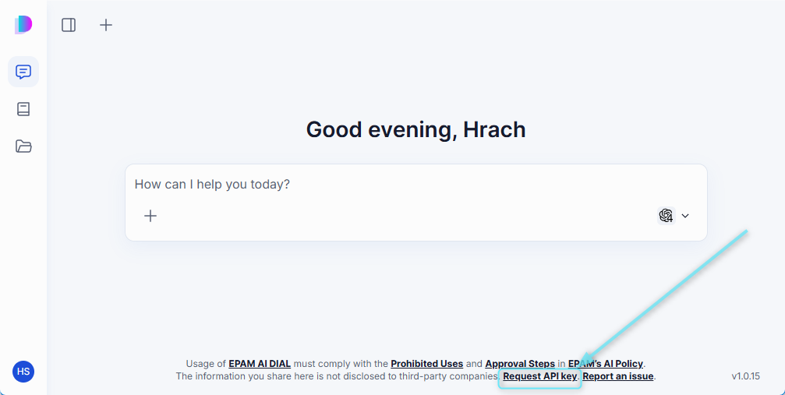
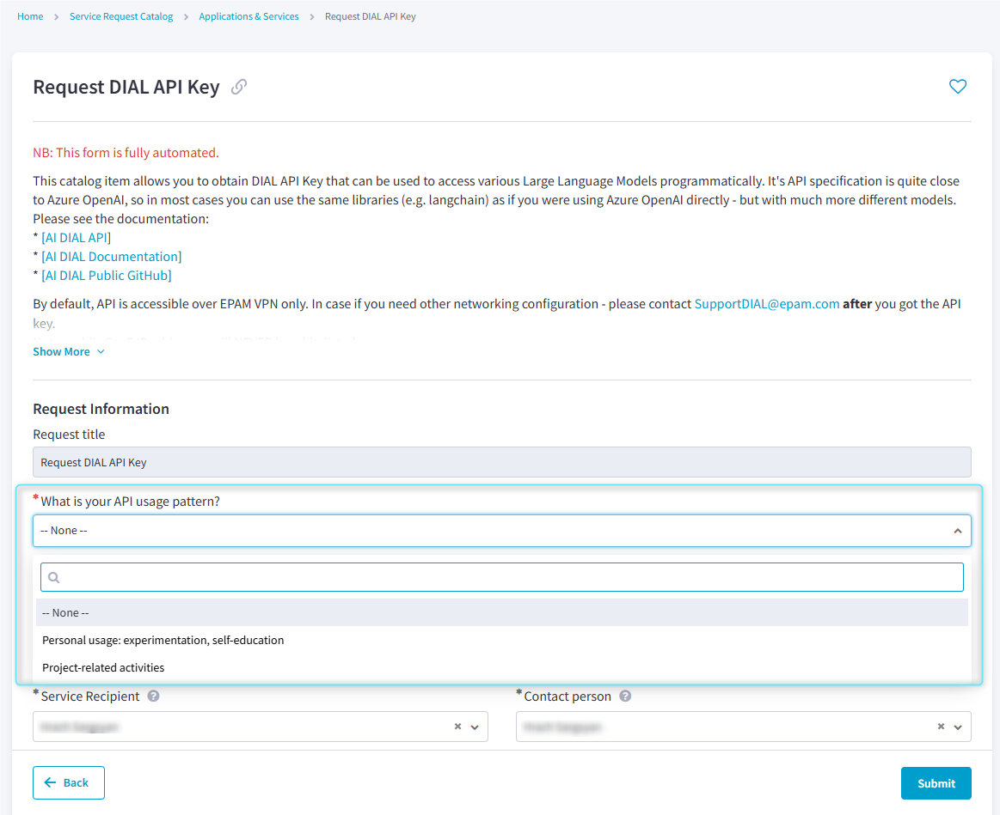
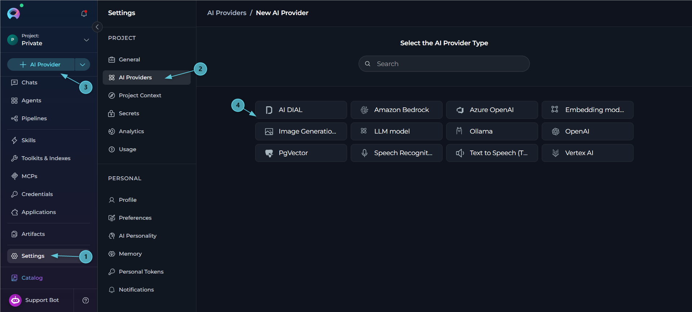
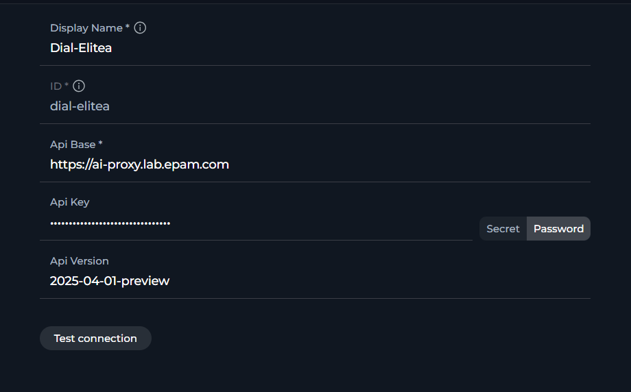
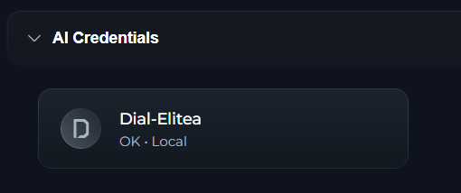
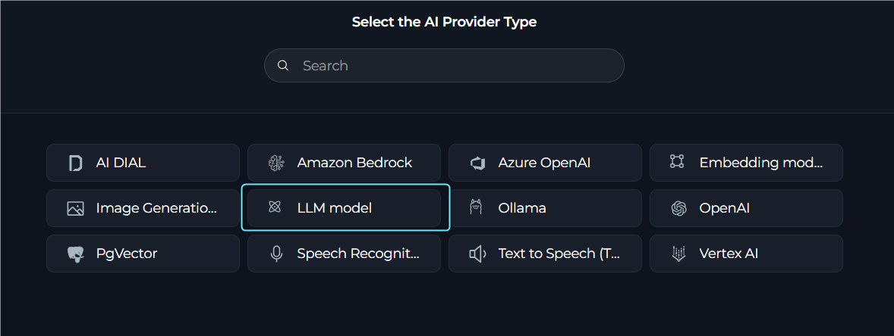
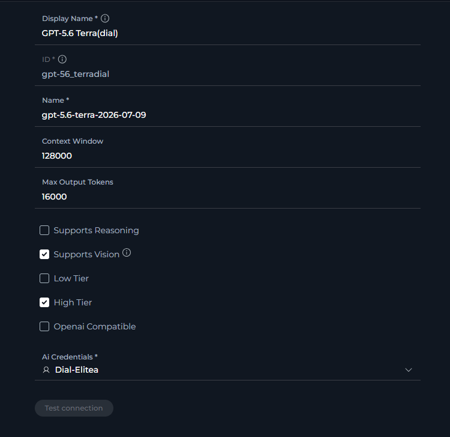
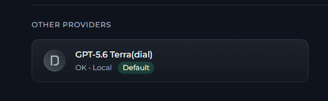
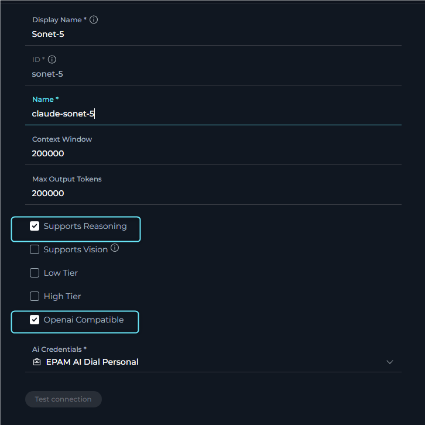

<Warning title="Important">
The LLM models in the Next environment are shared and for evaluation only with daily limits. For any sustained or production use, request your own EPAM AI DIAL keys and configure them under Settings → AI Providers.
</Warning>

---

## Request an EPAM AI DIAL API Key
1. Open EPAM AI DIAL: [https://chat.lab.epam.com](https://chat.lab.epam.com).
2. Click "Request API key" at the bottom, or go directly: [Request API Key](https://support.epam.com/ess?id=sc_cat_item&table=sc_cat_item&sys_id=910603f1c3789e907509583bb001310c).

     

3. Fill in the required details to open a support request.
4. Wait for the confirmation email with your API key and usage details.

     

---

## Configure DIAL Credentials & Models
Once you have your EPAM AI DIAL API key, register it in ELITEA. First, save the key as an **AI Credential** so ELITEA can authenticate with DIAL. Then, add one or more **LLM Models** that reference that credential. This makes the specific models your key is entitled to available for use in Chat, Agents and Pipelines.

### Configure the DIAL Credential
1. Log in to the Next environment: [https://next.elitea.ai](https://next.elitea.ai).
2. Go to Settings → [AI Providers](../menus/settings/ai-providers) to view existing credentials, or create one directly from any page.
3. Click the **+ AI Providers** button in the sidebar.
4. In the type selector, select credential type: "**AI DIAL**".
     
5. Fill the fields:

   | Field | Value |
   |-------|-------|
   | **Display name** | A clear name (e.g., "Team DIAL Prod") |
   | **API Base** | `https://ai-proxy.lab.epam.com` |
   | **API key** | Paste the key from the email |
   | **API version** | `2025-04-01-preview` (current supported) |

   

<Tip title="Verify Before Saving">
Click **Test connection** to confirm the API Base, API key and API version are valid before saving the credential.
</Tip>

6. Click **Save**. The DIAL credential is created and appears under **AI Credentials** in AI Providers as available to use.
     

### Configure LLM Models
After creating the DIAL credential, add the LLM models that your key can access.

1. Log in to the Next environment: [https://next.elitea.ai](https://next.elitea.ai).
2. Go to Settings → AI Providers to view existing credentials, or create one directly from any page.
3. Click the **+ AI Providers** button in the sidebar to create a new AI provider.
4. In the type selector, select credential type: "**LLM Model**".

   

5. Fill the fields:

   | Field | Type | Description |
   |-------|------|--------------|
   | **ID** | Text (read-only) | The model's unique identifier, auto-generated by the system |
   | **Display name** | Text | A friendly label (e.g., "Dial Claude Sonnet") |
   | **Name** | Text | The exact model name as listed here: [Available Models and Rate Limits](https://kb.epam.com/display/EPMGPT/Personal+API+Keys%3A+Available+Models+and+Rate+Limits) |
   | **Context Window** | Number | The supported context window for that model |
   | **Max Output Tokens** | Number | The supported max output tokens, capped to the model's actual limit. Requests that exceed the limit are rejected with an error |
   | **Credentials** | Dropdown | Pick the DIAL credential you created (or create new via "New private credentials") |
   | **Supports Reasoning** | Checkbox | When checked, enables a reasoning-effort control and enforces a minimum output-token floor for this model |
   | **Supports Vision** | Checkbox | When checked, marks the model as able to accept image inputs |
   | **Low Tier** | Checkbox | When checked, makes this model selectable as the project's Low-Tier model, used for simpler, cost-effective tasks |
   | **High Tier** | Checkbox | When checked, makes this model selectable as the project's High-Tier model, used for complex tasks requiring stronger reasoning |
   | **OpenAI Compatible** | Checkbox | When checked, marks the model to be called using an OpenAI-compatible API format |

   

6. Click **Save**. The model appears in the model selector across Chat, Agents and Pipelines.
     

<Warning>
**AI DIAL and Reasoning Models**

When you create an OpenAI LLM model and use AI DIAL as the selected AI Credentials provider, keep **Supports Reasoning** turned off.
</Warning>

<Info>
**Anthropic Models on AI DIAL**

When you create an Anthropic (Claude) LLM model and use AI DIAL as the selected AI Credentials provider, enable both **Supports Reasoning** and **OpenAI Compatible** for the model to work correctly.

</Info>

<Warning>
**Error After Updating an Existing LLM Model**

If you receive an error (for example `400`, `401` or `403`) when using an LLM model with AI DIAL credentials after updating an existing LLM model:

1. Delete the LLM model you updated.
2. Create a new LLM model with a **Display Name** different from the deleted one, using the same configuration.

Avoid editing the same LLM model configuration multiple times, as repeated edits may cause this issue.
</Warning>

---

## Notes & Limits
- EPAM AI DIAL enforces its own per-model and per-key limits. Review the limits at the model catalog link above and plan accordingly.
- If a model is not visible in the model selector, double-check that the **Name** field matches the exact model name from the catalog and that your key is entitled to that model.
- In Settings → AI Providers, each credential and model shows a status of **OK** or **In Progress**, along with its scope (**Shared** or **Local**). If your DIAL credential does not show **OK**, use **Test connection** (or the batch check) to confirm the API Base, API key and API version before creating models against it.
- For troubleshooting or blocked usage, switch to your dedicated key (avoid the shared Next models) and re-verify the credential and its models in AI Providers.

---