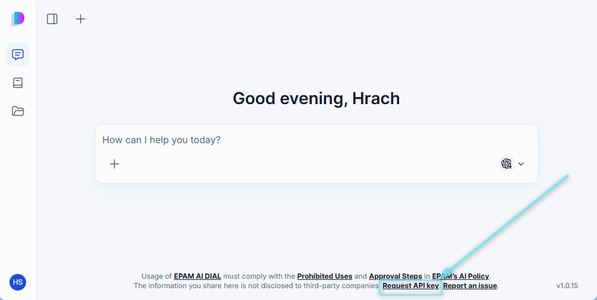
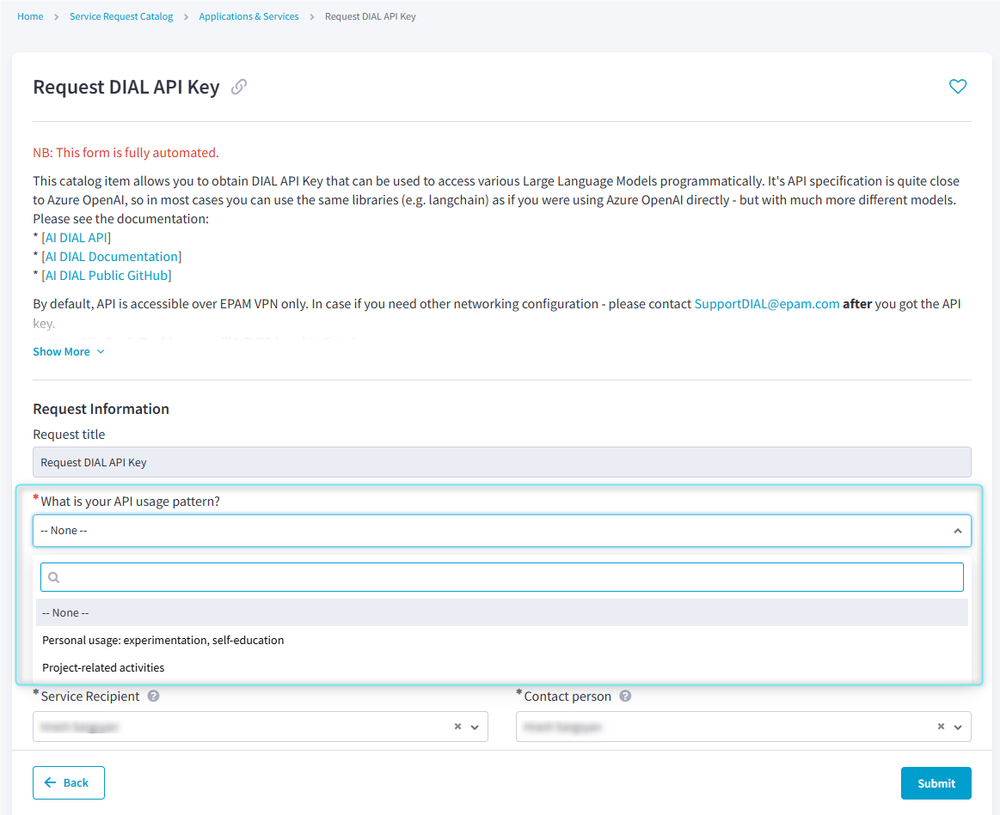
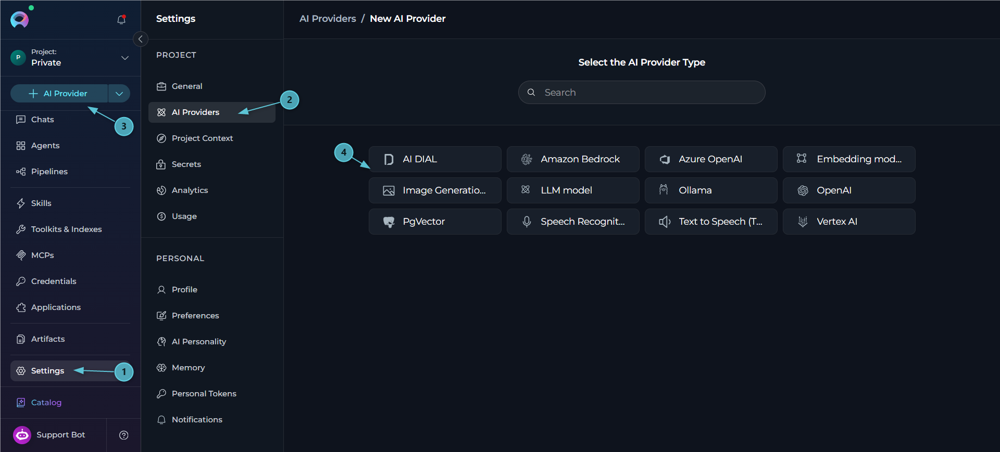
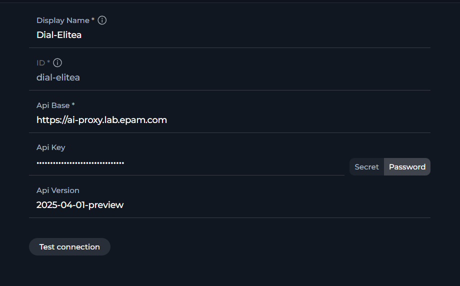
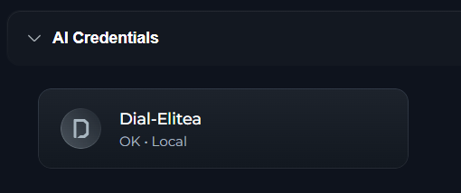
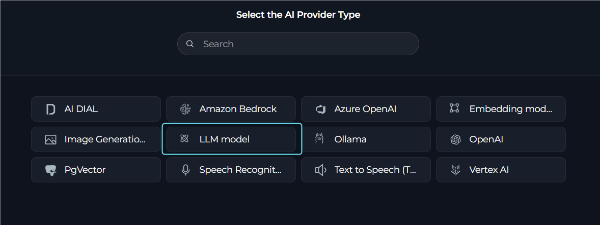
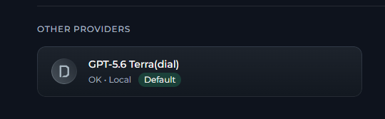

<Warning title="Important">
The LLM models in the Next environment are shared and for evaluation only with daily limits. For any sustained or production use, request your own EPAM AI DIAL keys and configure them under Settings → AI Providers.
</Warning>

---

## Request an EPAM AI DIAL API Key
1. Open EPAM AI DIAL: [https://chat.lab.epam.com](https://chat.lab.epam.com).
2. Click "Request API key" at the bottom, or go directly: [Request API Key](https://support.epam.com/ess?id=sc_cat_item&table=sc_cat_item&sys_id=910603f1c3789e907509583bb001310c).

     

3. Fill in the required details to open a support request.
4. Wait for the confirmation email with your API key and usage details.

     

---

## Configure DIAL Credentials & Models
Once you have your EPAM AI DIAL API key, register it in ELITEA in two steps:

1. Save the key as an **AI Credential** so ELITEA can authenticate with DIAL. You only need to do this once: a single credential covers every model family DIAL offers—GPT, Claude, Gemini and others—so there is no need to create a separate credential per model.
2. Add one or more **LLM Models** that reference that credential. This makes the specific models your key is entitled to available for use in Chat, Agents and Pipelines.

<Note>
Not every DIAL model is available for every API key. Before adding a model, check that your key has access to it—see [Check Model Access and Limits in DIAL](#check-model-access-and-limits-in-dial) below.
</Note>

### Configure the DIAL Credential
1. Log in to the Next environment: [https://next.elitea.ai](https://next.elitea.ai).
2. Go to Settings → [AI Providers](../menus/settings/ai-providers) to view existing credentials, or create one directly from any page.
3. Click the **+ AI Providers** button in the sidebar.
4. In the type selector, select credential type: "**AI DIAL**".
     
5. Fill the fields:

   | Field | Value |
   |-------|-------|
   | **Display name** | A clear name (e.g., "Team DIAL Prod") |
   | **API Base** | `https://ai-proxy.lab.epam.com` |
   | **API key** | Paste the key from the email |
   | **API version** | `2025-04-01-preview` (current supported) |

   

<Tip>
**Verify Before Saving**

Click **Test connection** to confirm the API Base, API key and API version are valid before saving the credential.
</Tip>

6. Click **Save**. The DIAL credential is created and appears under **AI Credentials** in AI Providers as available to use.
     

### Configure LLM Models
After creating the DIAL credential, add each LLM model that your key can access.

1. Log in to the Next environment: [https://next.elitea.ai](https://next.elitea.ai).
2. Go to Settings → AI Providers to view existing credentials, or create one directly from any page.
3. Click the **+ AI Providers** button in the sidebar to create a new AI provider.
4. In the type selector, select credential type: "**LLM Model**".

   

5. Fill the fields:

   | Field | Type | Description |
   |-------|------|--------------|
   | **Display Name** | Text | A friendly label (e.g., "Dial Claude Sonnet") |
   | **ID** | Text (read-only) | The model's unique identifier, generated from the display name and fixed once created |
   | **Name** | Text | The DIAL deployment ID, exactly as DIAL lists it (e.g. `gpt-5.6-luna-2026-07-09`, `claude-sonnet-4-6@default`, `gemini-3.8-flash`) |
   | **Context window** | Number | Total tokens the model can handle in one request, input and output combined |
   | **Max output tokens** | Number | The most tokens the model can generate in one response. Must not exceed the model's actual maximum—see [Troubleshooting](#troubleshooting) |
   | **AI Credentials** | Dropdown | Pick the DIAL credential you created. Selecting a DIAL credential reveals the **API protocol** field |
   | **API protocol** | Dropdown | Which request format DIAL should use for this model. Shown only when the selected credential is AI DIAL—see [Choose the API Protocol by Model Family](#choose-the-api-protocol-by-model-family) below. This is the most important setting |
   | **Reasoning** | Checkbox | Turns on a reasoning-effort control for this model. For recognized model names, the available effort levels are filled in automatically |
   | **Vision** | Checkbox | When checked, marks the model as able to accept image inputs |
   | **Model tier** | Dropdown | Optional: **Not set**, **Low tier** (fast, low-cost background tasks), or **High tier** (complex tasks) |
   | **OpenAI compatible** | Checkbox | Leave **off** for DIAL models—see the warning below |

<Warning>
**Do Not Use OpenAI Compatible with DIAL**

The **API protocol** field already selects the right request format for DIAL. Turning **OpenAI compatible** on changes how ELITEA formats requests to Claude models specifically. As a result, reasoning settings such as thinking mode and effort levels are not applied as configured, and prompt caching is lost. The model is also excluded from the Auto model. Keep it off unless your administrator tells you otherwise.
</Warning>

6. Click **Save**. The model appears in the model selector across Chat, Agents and Pipelines.
     

#### Choose the API Protocol by Model Family

| Model family | API protocol |
|---------------|---------------|
| GPT models, including o1 / o3 / o4-mini | OpenAI |
| Claude models, both `claude-…@…` and `anthropic.claude-…` IDs | Anthropic |
| Gemini and other models (DeepSeek, Qwen, Llama, Grok, GLM, Kimi, MiniMax, Nemotron) | Azure OpenAI |

### Reasoning

- Use the base model and turn on **Reasoning** in ELITEA. Do not add DIAL's `-reasoning`, `-with-thinking` or `-without-thinking` variants as separate models.
- Reasoning can be turned on or off for any model on its correct API protocol.
- GPT-4, GPT-4o and GPT-4.1 do not support reasoning, and ELITEA hides or blocks enabling it for these models.

### Embedding and Image Generation Models

Create an **Embedding Model** the same way, using the DIAL deployment ID as the **Model Name** and the DIAL credential. Image generation models follow the same process as other models. See [Embedding Models](../menus/settings/ai-providers#embedding-models) and [Image Generation](../menus/settings/ai-providers#image-generation) for the general steps.

---

## Migrate Existing DIAL Models

Models created before the **API protocol** field existed show **Azure OpenAI** by default. Plain chat keeps working on Azure OpenAI, but reasoning does not. Open each GPT model and switch its **API protocol** to **OpenAI**, and each Claude model to **Anthropic**. Changes take effect immediately—no LiteLLM sync needed.

---

## Check Model Access and Limits in DIAL

DIAL has an endpoint that returns the limits for one deployment for your API key:

```
GET https://ai-proxy.lab.epam.com/v1/deployments/<deployment-id>/limits
Header: Api-Key: <your DIAL API key>
```

Example: `https://ai-proxy.lab.epam.com/v1/deployments/claude-sonnet-5@default/limits`

The response shows the per-minute and per-day token limits and how much has been used. If the call fails for a deployment, your key probably does not have access to that model.


---

## Troubleshooting

<Accordion title="Empty Answer with No Error">
Check two things:

- **Is the API protocol right for the model family?** A wrong protocol gives this symptom—for example, Claude on Azure OpenAI fails even with reasoning off.
- **Is the deployment still supported?** Some older deployments may no longer work.
</Accordion>

<Accordion title="Rate Limit Reached (429)">
DIAL limits how many tokens each key can use per minute and per day, and the limits differ by model. When a limit is reached, the chat shows an error like this:

```
Error: Error code: 429 - {'type': 'error', 'error': {'type': 'rate_limit_error', 'message': 'litellm.RateLimitError: AnthropicException - {"error":{"message":"Hit token rate limit. Minute limit: 0 / 120000 tokens. Day limit: 2067531 / 2000000 tokens. ...","display_message":"You've exceeded your daily token limit","code":"429"}}. Received Model Group=112_claude-sonnet-5@default ...'}}
```

Wait for the limit to reset—the next minute, or the next day for the daily limit—or switch to another model. To see your current limits and usage, see [Check Model Access and Limits in DIAL](#check-model-access-and-limits-in-dial) below.
</Accordion>

<Accordion title="Max Output Tokens Set Too High (400)">
If **Max output tokens** is higher than the model allows, every request fails with an error like this:

```
Error: Error code: 400 - {'type': 'error', 'error': {'type': 'invalid_request_error', 'message': 'litellm.BadRequestError: AnthropicException - {"type":"error","error":{"type":"invalid_request_error","message":"max_tokens: 200000 > 128000, which is the maximum allowed number of output tokens for claude-sonnet-5"} ...'}}
```

Set **Max output tokens** to a value no higher than the maximum named in the message (here, `128000`), then save.
</Accordion>

<Accordion title="Error After Updating an Existing LLM Model">
If you receive an error (for example `400`, `401` or `403`) when using an LLM model with AI DIAL credentials after updating an existing LLM model:

1. Delete the LLM model you updated.
2. Create a new LLM model with a **Display Name** different from the deleted one, using the same configuration.

Avoid editing the same LLM model configuration multiple times, as repeated edits may cause this issue.
</Accordion>

---

## Notes & Limits
- EPAM AI DIAL enforces its own per-model and per-key limits. Use [Check Model Access and Limits in DIAL](#check-model-access-and-limits-in-dial) above, or the [Available Models and Rate Limits](https://kb.epam.com/display/EPMGPT/Personal+API+Keys%3A+Available+Models+and+Rate+Limits) catalog, to plan accordingly.
- If a model is not visible in the model selector, double-check that the **Model Name** field matches the exact DIAL deployment ID and that your key is entitled to that model.
- In Settings → AI Providers, each credential and model shows a status of **OK** or **In Progress**, along with its scope (**Shared** or **Local**). If your DIAL credential does not show **OK**, use **Test connection** (or the batch check) to confirm the API Base, API key and API version before creating models against it.
- For troubleshooting or blocked usage, switch to your dedicated key (avoid the shared Next models) and re-verify the credential and its models in AI Providers.

---
