## Overview

**Agent Evaluation** lets you measure how well an agent performs against a repeatable set of test cases, using criteria you define yourself. Instead of judging agent quality by spot-checking a few chat replies, you build a repeatable process. You create a **Dataset** of representative inputs, define **Dimensions** that describe what "good" looks like (tone, accuracy, following instructions, structure, etc.) and combine them into a **Suite**. Running the suite scores the agent against the dataset and produces consistent, comparable results.

This turns agent quality from a subjective impression into something you can track over time:

* **Catch regressions**—re-run the same suite after changing agent instructions or tools, and immediately see whether scores improved or dropped.
* **Combine automated and human judgment**—score responses with an Artificial Intelligence (AI) judge model, a custom validation script, a human reviewer or any mix of the three.
* **Compare instruction changes objectively**—run the same dataset against different agent versions to see which configuration performs best before you adopt it.
* **Build a record of quality**—the platform keeps every run in a searchable history, so you can cite concrete evidence of how an agent behaves, rather than relying on anecdotes.

<CardGroup cols={2}>
<Card title="Dimensions" icon="ruler">
Named criteria used to score responses—via an AI judge, a human reviewer or a custom validation script.
</Card>
<Card title="Datasets and cases" icon="database">
Reusable collections of test inputs (and optionally expected outputs) that a suite runs the agent against.
</Card>
<Card title="Suites" icon="layer-group">
A configured pairing of one agent version, one dataset and one or more dimensions—the unit you actually run.
</Card>
<Card title="Results and history" icon="chart-line">
Per-case, per-dimension scores for every run, plus a full history you can revisit, export or clear.
</Card>
</CardGroup>

<Note title="Beta Feature">
Agent Evaluation is currently in Beta. The interface and available options may continue to evolve.
</Note>

## Prerequisites

* You need an existing agent to evaluate. See [Agents](../../menus/agents) if you have not created one yet.
* Your project role determines what you can do in Agent Evaluation:

| Role | Access |
| --- | --- |
| **Viewer** | No access to Agent Evaluation. |
| **Editor** | Can create and manage Dimensions, Suites, Datasets and Runs. Can view Code-based dimensions in read-only mode. |
| **Admin** | Full access, including creating, editing and deleting Code-based dimensions. |

## Access Agent Evaluation

1. Open the agent you want to evaluate.
2. Click the **three-dot menu** (⋮) on the agent.
3. Select **Evaluate** (Beta).

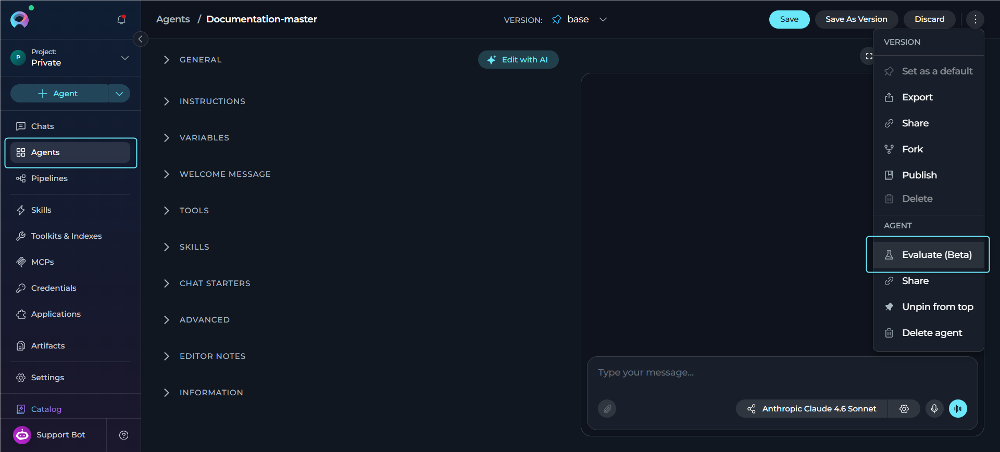

This opens the **Evaluation** workspace for that agent, where you manage Suites, Dimensions, Datasets and the Results History.

<Tip title="Documentation Shortcut">
Inside the Evaluation workspace, click the documentation icon to open the [Agent Evaluation FAQ](./agent-evaluation-faq) for quick answers to common questions.
</Tip>

## Suites

A **Suite** is what you actually run: it pairs one **agent version**, one **Dataset** and one or more **Dimensions** (via per-suite bindings), plus a **Judge Model** used for any AI-scored dimensions.

<Note>
A dimension **binding** carries suite-specific settings—such as weight, target, engine and evidence scope—without changing the shared dimension definition itself. Removing a dimension from a suite only removes the binding. The dimension itself stays in the library for reuse.
</Note>

**Create a Suite**

The first time you open **Evaluate (Beta)** for an agent, no suites exist yet—the **Suites** panel shows an empty state prompting you to create one, because you need a suite before you can run an evaluation.

1. In the Evaluation workspace, click **New Suite** (or via the **+** button once other suites already exist).
     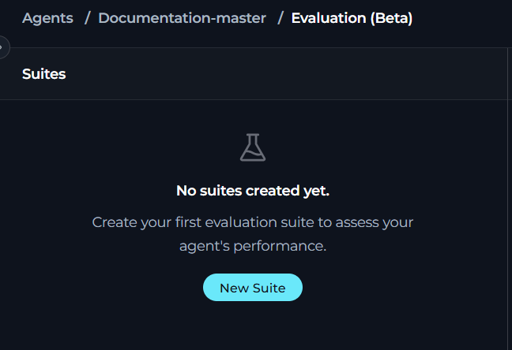
2. Under **General**, fill in the following fields:

     | Field | Description |
     | --- | --- |
     | **Name** | The display name of the suite. |
     | **Description** | Optional notes about what this suite evaluates. |
     | **Judge Model** | The LLM used to score any AI-evaluated dimensions in this suite. |
     | **Version** | The agent version this suite evaluates. Locked to the suite once set. If you need to evaluate a different version, change it here. |
     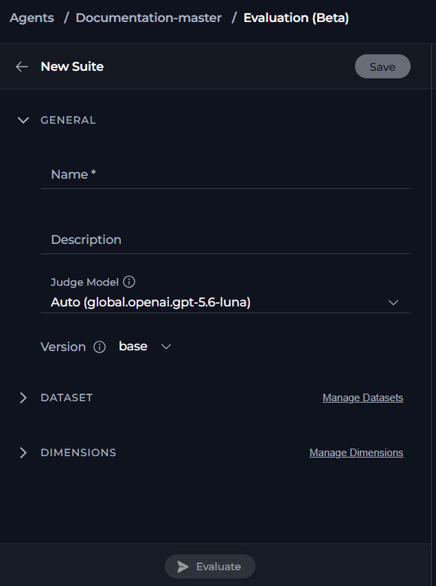

3. Click **Save** to create the suite.

## Datasets

A **Dataset** is a named collection of test **Cases** that you run the agent against during an evaluation. Datasets belong to an owning agent but can be marked **Available across the project** so other agents' suites can reuse them.

<Note>
Only the owner of the dataset can edit its cases. A suite borrowing a shared dataset can exclude or include individual cases for its own runs without affecting the original dataset or any other suite using it—at least one case must remain active.
</Note>

### Create a Dataset

1. In the Evaluation workspace, open **Manage Datasets**.
2. Click **+** to create a dataset.
3. Enter a **Dataset Name** (required) and an optional **Description**.
4. If you want other agents' suites to use this dataset, check **Available across the project**.
5. Click **Save**.
     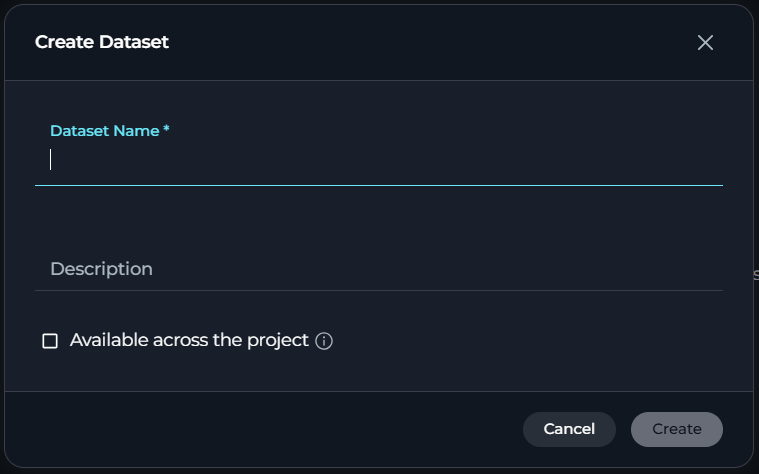

### View the Dataset Page

Selecting a dataset from **Manage Datasets** opens its case list.

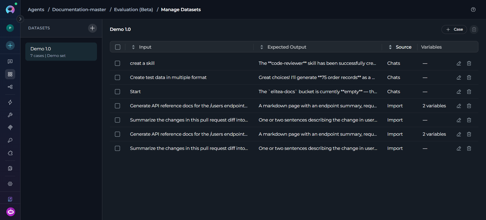

* **Dataset list (left)**—every dataset created for the agent, showing its case count and description. Click a dataset to view its cases. Click **+** to create another.
* **Case table (right)**—one row per case, with sortable **Input**, **Expected Output**, **Source** and **Variables** columns. **Source** shows how you created the case (for example, **Chats** or **Import**), and **Variables** shows how many key-value pairs the case defines, or **—** when it has none.
* **+ Case**—opens the add-case menu.
* **Delete icon** (top right, next to **+ Case**)—deletes the dataset itself.
* **Row actions**—hover a row to reveal its edit (pencil) and delete (trash) icons, for editing or removing that individual case.

## Test Cases

A **Case** is a single test within a dataset: an input (and, optionally, an expected output and variables) that the agent responds to during a run. Each case represents one concrete scenario for evaluating the agent. The dataset stays meaningful only when its cases reflect the situations the agent needs to handle well.

Every dimension bound to the suite scores each case independently, and a run breaks down results per case. Adding, editing or excluding a case changes what the suite evaluates and directly affects its overall score the next time it runs.

### Add a Test Case

With the dataset selected, click **+ Case** to open the add-case menu. Then choose one of the three methods below.

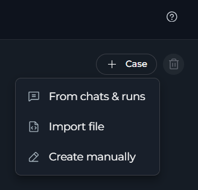

**From Chats and Runs**

Turns a real conversation or a past evaluation run into a repeatable test case, so you can capture actual agent interactions—including ones that previously went wrong—instead of writing an input from scratch.

1. From the add-case menu, select **From chats and runs**.
2. Switch between the **Chats** and **History Runs** tabs to find the conversation or run you want to reuse.
3. Select the entry to turn it into a repeatable test case in the dataset.
     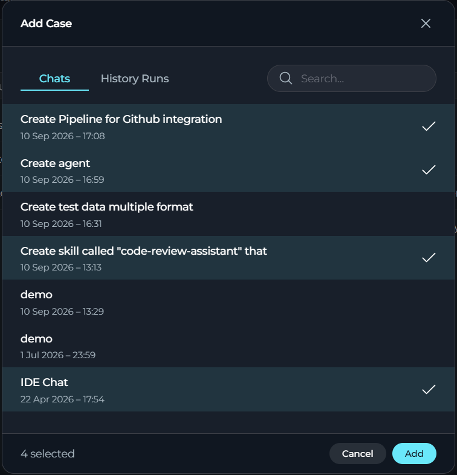

Each case in the dataset shows its Input, Expected Output, Source (marked **Chats** when pulled from a conversation) and Variables.

**Import a File**

Adds many test cases at once from a file, useful when you already maintain test data outside of ELITEA or want to bulk-load a large set of inputs instead of entering them one by one.

1. From the add-case menu, select **Import file**.
2. Choose a `.csv` or `.json` file containing your cases.
3. Upload the file. A result banner shows how many cases were imported and how many were rejected.

     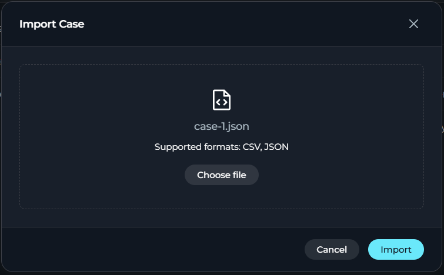

<Note title="Import Validation">
The platform checks a `.json` file for valid JSON syntax before upload. It rejects a malformed file outright and imports no cases from it. Once uploaded, the platform validates each case individually: it adds valid cases to the dataset and skips invalid ones, listing each skipped case in the result banner with the reason for rejection. This way, the rest of the file still imports even when one row is invalid.
</Note>

**Create a Case Manually**

Builds a single test case field-by-field, giving you full control over the exact input, variables and expected output—the most direct option when you already know precisely what you want to test.

1. From the add-case menu, select **Create manually**.
2. Enter the **Input** (required)—the text sent to the agent.
3. Optionally add **Variables** as key-value pairs.
4. Optionally check the **Expected Output** option and enter the expected response.
5. Click **Save** to add the case to the dataset.

     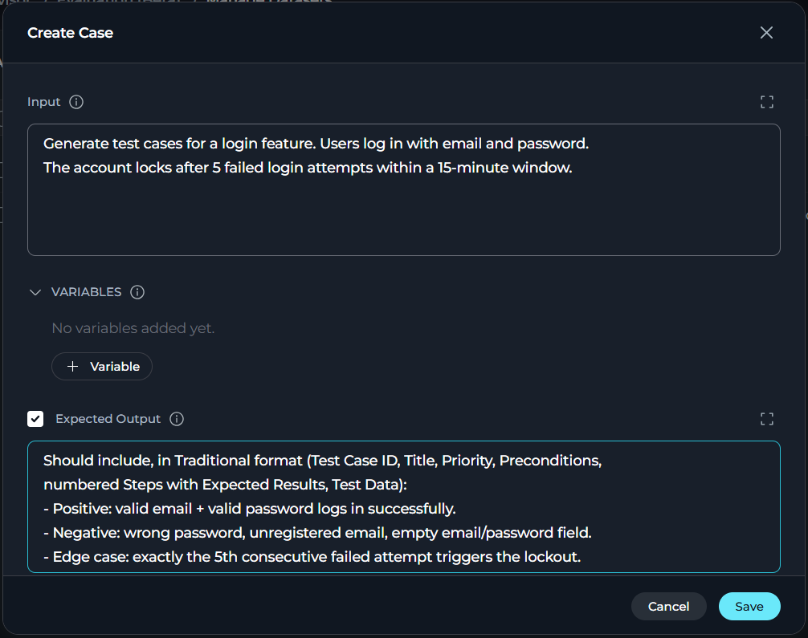

## Dimensions

A **Dimension** defines one thing you want to measure—for example, "Response is polite and professional" or "Output is valid JSON." Dimensions turn what would otherwise be a subjective impression of quality into a named, repeatable criterion that scores the same way on every case, every time the suite runs. One of three engines scores each dimension. You choose the engine when you create the dimension, and it stays fixed afterward:

| Engine | How it Scores |
| --- | --- |
| **AI** | An AI judge model reads the response (and any other evidence you select) against your written evaluation instructions and produces a score. |
| **Human** | A person reviews the response afterward and enters a score manually. Human scoring lets a run continue without waiting. The platform marks cases as pending until someone reviews them. |
| **Code** | A Python validation script you write inspects the response and sets a `result` value, which becomes the score. |

A dimension lives in a shared library, and you add it to one or more suites through a binding. Editing its evaluation instructions, target or scale affects every suite that includes it the next time that suite runs, not just the suite you were viewing when you made the change.

Dimensions can be scoped at three levels:

* **Agent**—private to the agent you are evaluating.
* **Project**—shared and reusable across every agent in the project.
* **Platform**—shared platform-wide; read-only to regular users.

### Create a Dimension

1. In the Evaluation workspace, open **Manage Dimensions**.
2. Switch between the **Agent**, **Project** and **Platform** tabs to choose the scope for the new dimension (**Platform** is read-only for dimension creation).
3. Click **+** to create a new dimension.
4. Fill in the following fields and click **Save**.

     | Field | Description |
     | --- | --- |
     | **Name** | The display name of the dimension. |
     | **Available across the project** | Lets all agents and agent versions in the current project use this dimension. |
     | **Evaluator** | **AI**, **Human** or **Code**—sets how you evaluate the dimension. Locks once you save the dimension. |
     | **Evaluation Instructions** *(AI only)* | Describes the qualities, behaviors or examples the judge model should identify. |
     | **Evaluation Guidance** *(Human only)* | Optional guidance to help reviewers score consistently. |
     | **Validation Code (Python)** *(Code only)* | Script written in the built-in editor. Must assign the result to a plain variable named `result` (a boolean for pass or fail, or a number for a numeric score) instead of using `return`. Depending on the evaluation target, the script can read `input`, `output`, `expected` and `structure`. |
     | **Evaluation Target** | Which parts of the case you show to the judge or script: **Output**, **Input** or **Agent structure** (select one or more). |
     | **Scale Type** | **Score (1-100)**, **Rating (1-5)**, **Pass or Fail** or **Custom** (define your own **Min** and **Max**). |
     | **Success Criteria** | **At least (`>=`)**, **At most (`<=`)** or **Exactly (`=`)**—plus the **Target Value** the score must meet to pass. |
     | **Importance** | **Low**, **Medium**, **High**, **Critical** or **Custom** (with a custom weight value). Controls how much this dimension contributes to the overall score of the suite. |

     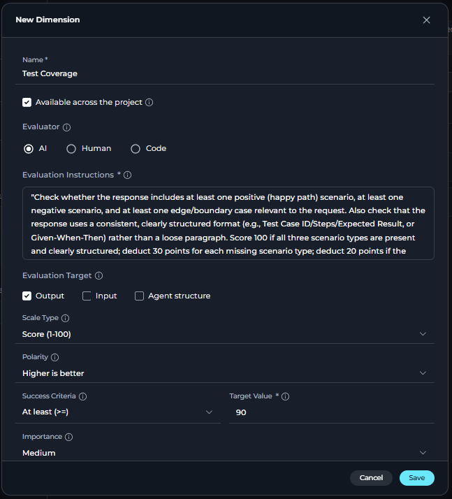

<Info>
**Example of Evaluation Instructions**

For a dimension measuring tone, **Evaluation Instructions** might read: "Score the response from 1-100 based on how polite and professional it sounds. A courteous response that avoids slang, sarcasm or curt phrasing should score above 80. A response that is rude, dismissive or uses inappropriate language should score below 40." Specific, concrete instructions keep scoring by the AI judge more consistent across cases.
</Info>

<Note>
A dimension can only have one evaluator. If you want both an AI score and a human score for the same criterion, create two separate dimensions (or two bindings of dimensions with the same instructions)—one set to AI, one set to Human.
</Note>

<Info>
**Code Validation Safety**

An automatic safety check runs before you can save a validation script. The check rejects scripts that use dangerous imports, unsafe built-in functions or dunder (`__`) attribute access. Only Admins can create or edit Code dimensions. Editors can view them.
</Info>

### Build a Dimension with AI

If you would rather describe what you want in plain language than complete every field yourself, you can generate a dimension draft:

1. From the dimension creation menu, choose **Build with AI**.
     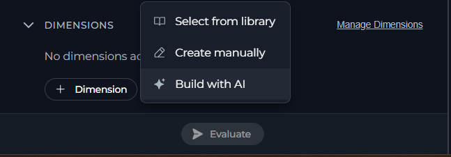
2. Describe the quality you want to measure—for example, a description of a polite and professional tone, or a requirement that output be valid JSON.
3. Click **Generate Draft**.
4. Review the generated candidate dimensions and click one to select it.
     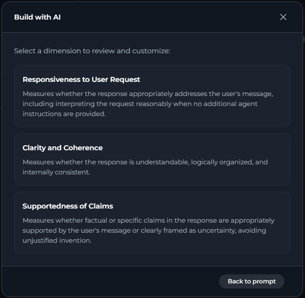
5. The full dimension form opens pre-filled with the generated content. Adjust any field as needed, then click **Create Dimension**.

You can return to the prompt step or the candidate list at any point before creating the dimension.

## Run an Evaluation

Use a completed suite to measure agent performance and review its results.

### Run the Suite

1. Open the suite you want to run.
2. Confirm that a dataset is attached under the **Dataset** section of the suite.
3. Confirm that at least one dimension is added under the **Dimensions** section of the suite.
4. Click **Evaluate**.
5. A progress indicator shows how many cases have completed (for example, "3 of 10 cases") while the run is in progress. You can cancel a run in progress.
6. When the run finishes, the **Results** panel updates automatically with the new scores.

 <video controls>
   <source src="../../img/how-tos/agents-pipelines/agent-evaluation/run-evaluation.mp4" type="video/mp4"/>
 </video>

<Info title="Automatic Batching and Scaling">
When multiple dimensions share the same evaluation target, the platform automatically batches them into a single AI judge call per test case, rather than one call per dimension. The platform also splits or truncates oversized evidence or oversized batches automatically, behind the scenes. This works without configuration, and the run always completes successfully.
</Info>

## Review Results

The **Results** panel shows the outcome of the most recent run for the selected suite:

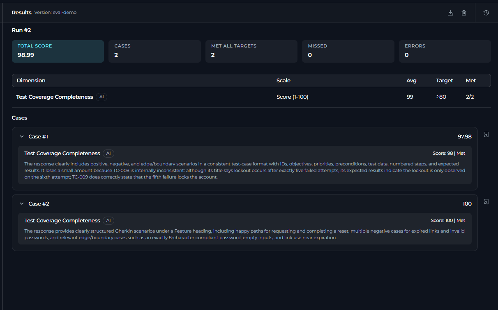

The summary cards show the following information:

| Card | Shows |
| --- | --- |
| **Total Score** | The overall score of the suite for this run. |
| **Cases** | The total number of cases included in the run. |
| **Met** | Cases where the target for every dimension was met. |
| **Missed** | Cases where the target for at least one dimension was missed. |
| **Errors** | Cases where at least one dimension failed to produce a score. |

* **Dimension table**—for each dimension: its Scale, Average score, Target and whether the target was Met.
* **Case list**—every case in the dataset, expandable to show its per-dimension results. Each dimension card shows its state (score and whether the target was met, an error, or—for Human-scored dimensions—pending) along with the rationale from the judge, your own comments or an "Awaiting human evaluation" note.

From the Results panel toolbar you can:

* **Export to Excel**—download the full results as a spreadsheet.
* **Clear the results**—remove the results for the current run (with a confirmation prompt).
* **Results History**—open the full run history for this agent in a separate panel.

## Score a Human Dimension

Human-scored dimensions let a run continue without waiting. The cases appear as pending until someone enters a score.

1. In the case results, find a dimension card for a Human-evaluated dimension and open it.
2. Review the response shown, using any **Evaluation Guidance** written on the dimension.
3. Enter a score using the control shown for the scale of that dimension (a Pass or Fail choice or a numeric score or rating).
4. Optionally add a **Comment** (up to 2000 characters).
5. Click **Save**.

## Review Run History

1. From the Results panel, click the **Results History** icon (or navigate to it directly from the Evaluation workspace).
2. The run history table lists every run for the agent, showing its Date, Suite, agent Version and Score. A badge highlights the score change compared to the previous scored run for the same suite.
3. Select a run to view its full results in the panel beside the table.
4. Use the row actions menu to **Share**, **Export to Excel** or **Delete** a run (deleting requires the appropriate permission).

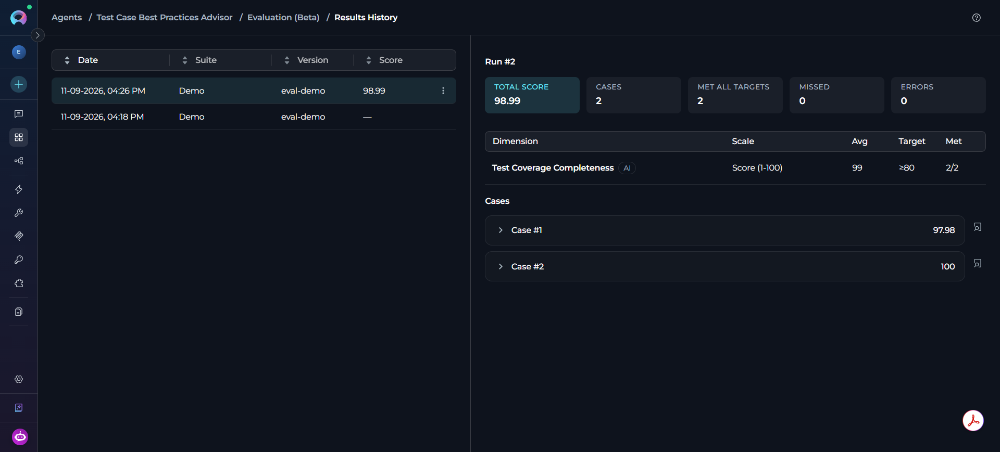

<Note>
Deleting a dimension from the library removes it everywhere it is used going forward, but finished runs keep a frozen snapshot of the dimensions as they were scored at the time. Historical results stay exactly as they were.
</Note>

## Troubleshoot Evaluation Issues

<Accordion title="Resolve a Dimension Error for a Case">
This means the scoring engine could not produce a valid result for that specific case—for example, the AI judge returned a response that did not match the expected format. The error remains isolated to this dimension and case. Other dimensions and cases in the same run are unaffected. Review the evaluation instructions or evidence scope for the dimension and run the suite again if needed.
</Accordion>

<Accordion title="Resolve a Pending Human Dimension">
Human-scored dimensions require someone to manually enter a score after the run completes—only a person can score them. Open the case and save a score to clear the pending state.
</Accordion>

<Accordion title="Create or Edit a Code Dimension">
Only Admins can create or edit Code-based dimensions. Editors have view-only access. Also check that your validation script passes the automatic safety check—the check rejects dangerous imports, unsafe built-ins and dunder attribute access.
</Accordion>

<Accordion title="Keep an Active Case in a Shared Dataset">
A suite must keep at least one active case from its attached dataset. Include a different case before excluding the one you want removed.
</Accordion>

<Accordion title="Resolve Rejected Imported Cases">
The platform rejects a `.json` file entirely when it is not valid JSON, and imports no cases from it. Otherwise, it validates each case on its own. Check the reasons listed next to the rejected count in the import result banner, fix those rows in your source file and re-import. Cases that already passed validation stay in the dataset unchanged.
</Accordion>

<Accordion title="Run a Suite">
Before you can evaluate a suite, it needs a **Dataset** attached and at least one **Dimension** added. Open the suite and check both the **Dataset** and **Dimensions** sections. For instructions, see the Run the Suite section.
</Accordion>

---

## Best Practices

<Accordion title="Start Small and Expand the Dataset">
Begin with a handful of cases that cover the scenarios you care about most, confirm your dimensions score them sensibly, then add more cases—including known failure cases—once the setup is stable.
</Accordion>

<Accordion title="Write Specific, Concrete Evaluation Instructions">
Vague instructions produce inconsistent AI scores. Naming exact qualities, thresholds, or examples such as those in the evaluation instructions example gives the judge model less room for inconsistent scoring between runs.
</Accordion>

<Accordion title="Reuse Project and Platform Dimensions">
Reuse a shared dimension instead of recreating similar criteria for every agent, so scores stay comparable across agents that share the same standards.
</Accordion>

<Accordion title="Turn Real Failures into Cases">
Use the **From Chats and Runs** method in the Add a Test Case section to capture an actual bad response as a permanent case, so the platform automatically catches the same mistake if it appears again.
</Accordion>

<Accordion title="Match the Engine to the Criterion">
Use Code dimensions for objective, deterministic checks (format, required fields), AI dimensions for judged qualities (tone, relevance) and Human dimensions only for what genuinely needs human judgment. Human scoring lets a run continue without waiting, but a person must complete it.
</Accordion>

<Accordion title="Use Case: Catch a Regression After an Instruction Change">
1. Run a suite once to establish a baseline score.
2. Edit the instructions or tools of the agent.
3. Re-run the same suite—same dataset, same dimensions—and compare the new score against the previous one in the Run History section.

A drop in score, especially on cases that previously passed, flags a regression before it reaches users.
</Accordion>

<Accordion title="Use Case: Compare Two Agent Versions">
1. Create two suites that share the same **Dataset** and **Dimensions** but are each locked to a different agent **Version**.
2. Run both suites.
3. Compare their scores in the Run History section to decide which version performs better before deploying it.
</Accordion>

<Accordion title="Use Case: Build a Regression Set from Real Failures">
1. When a chat or a run produces a bad response, open the **From Chats and Runs** method in the Add a Test Case section and add it to a dataset as a case.
2. If you have one, enter the correct **Expected Output** so future runs have something concrete to compare against.
3. Keep the case in the dataset used by your suites, so they automatically catch the same failure if it recurs.
</Accordion>

---

<Info title="Additional Resources">
* [Agent Evaluation FAQ](./agent-evaluation-faq) answers common questions about dimensions, datasets, suites and scoring behavior.
* [Agents](../../menus/agents) provides a complete guide to creating and configuring agents.
</Info>
