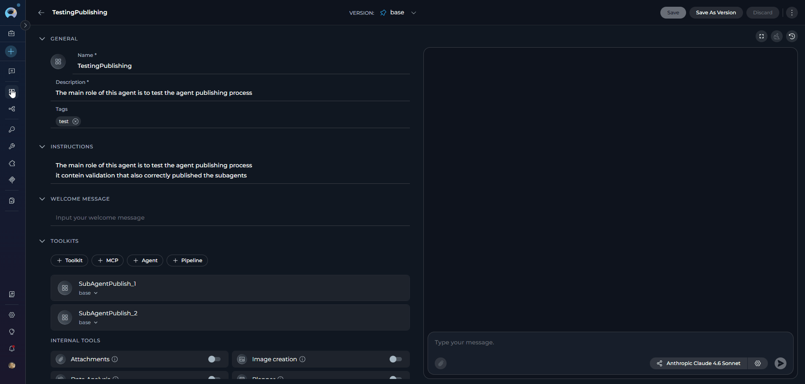
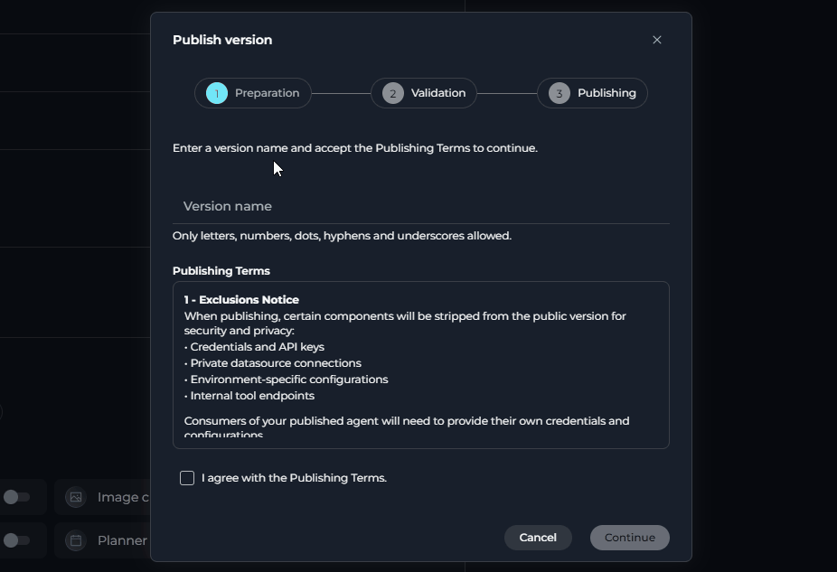
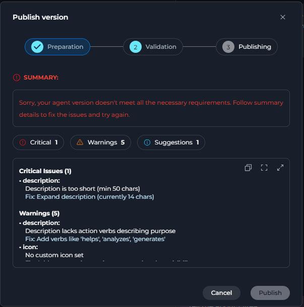
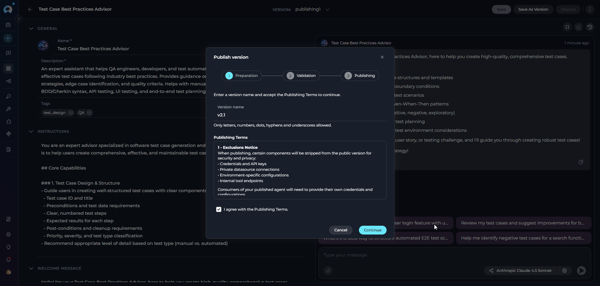
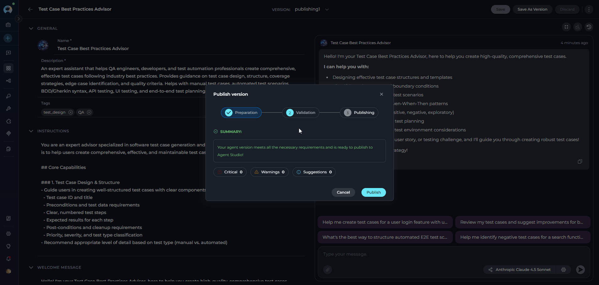
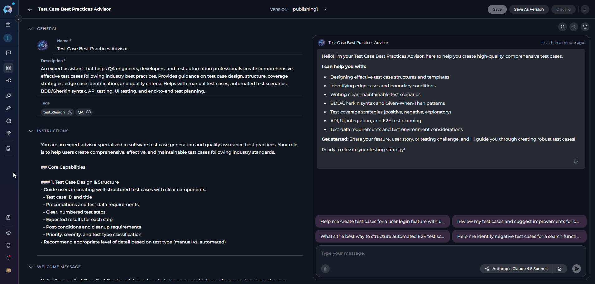
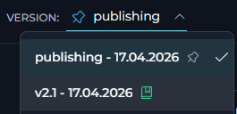
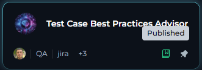
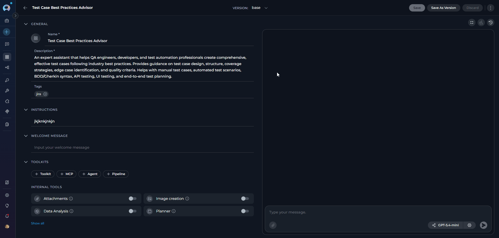

## Introduction

**Agent Publishing** is the process of making an agent version available in [Agents Studio](../../menus/agents-studio) — a shared library accessible to all users in your ELITEA installation. Once published, an agent version is visible to the entire community and can be added to conversations without requiring project membership.

**Key capabilities:**

- Publish a `draft` agent version to Agents Studio through a guided three-step wizard
- **AI-powered automated validation** runs before publishing — intelligent checks replace manual pre-approval by identifying critical issues, warnings, and improvement suggestions
- A **validation token** from the AI review is cryptographically linked to the publish request, ensuring only validated versions can be submitted
- Unpublish a published version at any time to remove it from Agents Studio immediately
- Track the status of your agents across the **Drafts**, **Moderation**, **Published**, and **Rejected** tabs in the Agents menu
- Receive in-app notifications when your agent is published, rejected, or unpublished by a moderator

<Note title="Scope">
Publishing is available only for **agents** (classic type). Pipeline publishing is not supported. You must have the `models.applications.publish.post` permission in your role to see the **Publish** action. Only versions in `Draft` status can be published.
</Note>

---

## Publishing an Agent Version

### Step 1 — Open the Publish wizard

1. Navigate to the **Agents** menu and open the agent you want to publish.
2. Select the version you want to publish from the version selector. The version must have a **Draft** status.
3. Click the **three-dot menu (⋮)** in the agent tab bar to open the version actions menu.
4. Select **Publish** from the dropdown.

<Warning title="Publish option not visible or disabled?">
- **Not visible at all** — The option is hidden when the current version is not in `Draft` status, or your role does not include the publish permission (`models.applications.publish.post`).
- **Visible but greyed out** — The option appears but is disabled with the tooltip **"Publishing is blocked by platform policy"**. This means `is_publish_blocked` is enabled on the platform and your project is not on the allowed list. Contact your platform administrator.
</Warning>

---

### Step 2 — Preparation

The **Publish version** dialog opens on the first step: **Preparation**.

**Fields and actions on this step:**

| Element | Description |
|---------|-------------|
| **Version name** | A unique name for this published version. Allowed characters: letters, numbers, dots (`.`), hyphens (`-`), underscores (`_`). Maximum 50 characters. Must not duplicate an existing version name for this agent. |
| **Publishing Terms** | A scrollable section listing what is excluded during publishing and the best-practice requirements. Expand with the expand icon or open in full-screen with the full-screen icon. |
| **I agree with the Publishing Terms** checkbox | Must be checked before you can continue. |
| **Continue** button | Enabled only when the version name is valid, not duplicate, and the checkbox is checked. Clicking it starts the automated validation. |
| **Cancel** button | Closes the wizard without publishing. |

**Publishing Terms contents:**

<AccordionGroup>
  <Accordion title="1 — Exclusions Notice">
    When publishing, the following components are stripped from the public version for security and privacy:

    - Credentials and API keys
    - Private datasource connections
    - Environment-specific configurations
    - Internal tool endpoints

    Consumers of your published agent will need to provide their own credentials and configurations.
  </Accordion>

  <Accordion title="2 — Best Practices Requirements">
    To ensure a quality experience for consumers, your agent should include:

    - A clear, descriptive name (not generic)
    - A detailed description explaining capabilities
    - At least one tag for discoverability
    - Comprehensive instructions for the model
    - Welcome message and conversation starters

    Agents that do not meet these requirements may fail validation.
  </Accordion>

  <Accordion title="3 — Administrative Rights">
    By publishing, you acknowledge that:

    - Platform administrators may unpublish your agent at any time
    - You retain the ability to unpublish your own agent
    - Published agents are visible to all users in Agents Studio
    - Usage metrics may be collected for published agents
  </Accordion>
</AccordionGroup>

---

### Step 3 — AI Validation

After clicking **Continue**, the wizard moves to the **Validation** step and submits the agent version to the **AI-powered validation engine**. The AI reviews the version against all publication requirements automatically — no manual moderator pre-approval is needed at this stage.

**While validation runs**, the dialog shows:

> *Reviewing your agent version to ensure it meets publication rules.*

<Note title="AI validation and automatic retries">
The validation engine uses an AI model to perform intelligent checks. If the AI service encounters a transient error, the system automatically retries the validation request up to **2 times** before reporting a failure. This is transparent to the user — you do not need to take any action during retries.
</Note>

**Validation result statuses:**

| Status | Message |
|--------|---------|
| <Badge color="green">PASS</Badge> | "Your agent version meets all the necessary requirements and is ready to publish to Agent Studio!" |
| <Badge color="orange">WARN</Badge> | "Your agent version meets the necessary requirements, but has some points for improvement. Follow summary details to improve." |
| <Badge color="red">FAIL</Badge> | "Sorry, your agent version doesn't meet all the necessary requirements. Follow summary details to fix the issues and try again." |

<Frame caption="The result panel shows three **severity counters** — **Critical**, **Warnings**, and **Suggestions** — each linking to the corresponding section in the detail list. The detail list includes the **field**, optional **context**, the **issue** or **suggestion**, and a recommended **fix** where applicable.">
  
</Frame>

Use the toolbar on hover to:
- **Copy** the full validation report as plain text
- **Open full-screen** for a larger view (opens **Validation Details** dialog)
- **Expand/Collapse** the detail list

**After validation:**

- If the status is **PASS** or **WARN**, the **Publish** button becomes enabled. The system stores a **validation token** generated by the AI engine.
- If the status is **FAIL**, the **Publish** button remains disabled. Return to the **Preparation** step to address the critical issues, then run validation again.

---

### Step 4 — Publishing

Click **Publish** to submit the agent for publication. The system sends both the version name and the **validation token** from the AI review in the same request — the token certifies that the version passed automated validation.

The dialog transitions to the **Publishing** step and displays:

> *Publishing your agent...*

On success, the dialog closes, a toast notification confirms:

> *The agent has been published*

and the UI navigates you to the owner view of the newly published version.

<Warning title="Sub-agent publishing">
If your agent uses nested sub-agents and some of those sub-agpublish-stepents could not be published, you will see this warning instead:

> *Agent published, but some sub-agents may not have been published.*

Verify that each sub-agent also meets publication requirements and publish them separately if needed.
</Warning>

### After publishing

Once published, your agent version is immediately available in [Agents Studio](../../menus/agents-studio):

<Tabs>
  <Tab title="Agent Studio">
    <Frame caption="Community users can find your agent by browsing or searching the studio and add it to their conversations without requiring access to your project.">
      
    </Frame>
  </Tab>
  <Tab title="Agent Card">
    <Frame caption="On the agent page, a **published** icon is added to the agent card to indicate that the version has been published to Agents Studio.">
      
    </Frame>
  </Tab>
  <Tab title="Version Name">
    <Frame caption="The version status in your **Agents** menu updates to `Published` and the version appears in your **Published** tab.">
      
    </Frame>
  </Tab>
</Tabs>

---

## Publishing from the Public Project (Admin Mode)

When you are working inside the **Public project** (the admin context), the wizard uses a simplified single-step flow that bypasses the three-step wizard and AI validation entirely.

**The simplified dialog shows:**

- A heading: **Publish version**
- A single prompt: *Enter a version name to publish.*
- A **Version name** text field (same character rules apply: letters, numbers, `.`, `-`, `_`; max 50 characters)
- A **Publish** button (enabled as soon as a valid version name is entered)
- A **Cancel** button

No Publishing Terms, no agreement checkbox, and no AI validation step are shown. Clicking **Publish** submits the version directly.

---

## Unpublishing an Agent Version

You can remove a published agent version from Agents Studio at any time.

### As the agent owner

1. Open the published agent version (status must be **Published**).
2. Click the **three-dot menu (⋮)** in the agent tab bar.
3. Select **Unpublish** from the dropdown.
4. In the **Unpublish Agent** dialog, review the confirmation message:

   > *Are you sure you want to unpublish **\{agent name\}** (version: **\{version name\}**)? The agent will be removed from Agents Studio immediately. Existing conversations using this agent version may be affected.*

5. Click **Unpublish** to confirm, or **Cancel** to close without changes.

On success, a notification confirms:

> *Agent has been successfully unpublished!*

### As an administrator (Moderation Space)

Administrators working in **Moderation Space** see an additional **Reason** field in the **Unpublish Agent** dialog:

> *Provide clear explanation for the unpublishing decision.*

The reason field is optional. Click **Unpublish** to confirm. The agent owner receives a notification:

> *"Unpublished agent version id: \{linked version ID\} from project id: \{project ID\}. Reason: \{reason provided\}"* — links directly to the affected version.

---

## Agent Status Lifecycle

After publishing, the version moves through the following statuses, visible in the **Agents** menu tabs:

| Tab | Status | Meaning |
|-----|--------|---------|
| **Drafts** | `draft` | Not yet published; the version can be edited freely |
| **Published** | `published` | Live and visible in Agents Studio |

<Note title="Moderation, Approval, and Rejected tabs">
The **Moderation** (`on_moderation`), **Approval** (`user_approval`), and **Rejected** (`rejected`) statuses exist in the platform but belong to an **optional moderation workflow** that is disabled by default. In the standard flow, agents publish **directly** to `published` status after passing AI validation — no moderator approval step is required. Contact your platform administrator to determine whether the moderation review workflow is active in your ELITEA installation.
</Note>

---

## Moderation Workflow

In the standard publishing flow, agents are published **directly** to `published` status after passing AI validation — no moderator pre-approval is required.

### Admin oversight

Administrators working in the **Public Project** or **Moderation Space** can unpublish any published agent at any time using the same Unpublish action described [above](#as-an-administrator-moderation-space). This is a reactive oversight tool, not a publication gate. The agent author receives a notification when this happens.

### Optional pre-publication moderation

A pre-publication moderation step can be enabled by platform administrators. When active, agents submitted for publishing enter `on_moderation` status and are queued for review in **Moderation Space → Agents** instead of publishing directly.

**Moderator actions (when moderation is enabled):**

| Action | Button | Result |
|--------|--------|--------|
| Approve | (approval action) | Agent moves to `published` status and becomes visible in Agents Studio |
| Decline | **Decline** | Opens **"Publish decline"** dialog with a required **Comment for author** field; agent moves to `rejected` |

### Notifications

| Event | Notification message |
|-------|---------------------|
| Agent unpublished by admin | *"Unpublished agent version id: \{linked version ID\} from project id: \{project ID\}. Reason: \{reason\}"* — links directly to the affected version |
| Approved for publishing (moderation flow) | *"\{agent\} is approved by \{approver\} for publishing."* |
| Published after moderation approval | *"\{agent\} is published."* |
| Rejected by moderator (moderation flow) | *"\{agent\} is rejected by \{approver\}."* |

---

## <Icon icon="circle-check" size={32} /> Best Practices 

<AccordionGroup>
  <Accordion title="Prepare your agent before opening the wizard">
    Address common validation failures before you begin:

    - Set a clear, specific agent name — avoid generic names like "My Agent" or "Test"
    - Write a detailed description that explains what the agent does and when to use it
    - Add at least one tag to help users discover your agent in Agents Studio
    - Write comprehensive model instructions that cover the agent's scope, tone, and behavior
    - Add a welcome message and at least one conversation starter so users know how to begin

    Agents lacking these elements are likely to receive validation warnings or failures.
  </Accordion>

  <Accordion title="Choose a meaningful version name" >
    The version name you enter in the **Preparation** step becomes the permanent identifier for this published snapshot. Use a name that communicates the release context, for example:

    - A semantic version number: `1.0.0`, `2.1.3`
    - A date-based label: `2026-04`
    - A descriptor: `initial-release`, `beta`

    Only letters, numbers, dots (`.`), hyphens (`-`), and underscores (`_`) are allowed. The name cannot be changed after publishing.
  </Accordion>

  <Accordion title="Review validation warnings before publishing" >
    A **WARN** status allows you to proceed, but improvement suggestions indicate areas where your agent could provide a better experience for community users. Review each suggestion in the validation detail list and decide whether to address it before clicking **Publish**.
  </Accordion>

  <Accordion title="Account for credential exclusions" >
    When your agent is published, all credentials, private datasource connections, environment-specific configurations, and internal tool endpoints are stripped from the public version. Before publishing:

    - Ensure your agent's instructions are written to guide users to provide their own credentials
    - Document which credentials or configurations users must supply in the agent's description
    - Test the agent without credentials to verify that prompts and instructions still guide users effectively
  </Accordion>

  <Accordion title="Understand sub-agent publishing behavior" >
    If your agent uses nested sub-agents, each sub-agent must also be in a publishable state or the parent agent may publish with a warning. Publish all required sub-agents to Agents Studio before publishing the parent agent to ensure the complete workflow is available to users.
  </Accordion>
</AccordionGroup>

---

## <Icon icon="triangle-exclamation" size={32} /> Troubleshooting

<AccordionGroup>
  <Accordion title="Issue: The Publish option is not visible in the three-dot menu" >
    **Cause:** The version is not in `Draft` status, or your role does not include the publish permission.

    **Solution:** Check the version status indicator next to the version name. Only `Draft` versions can be published. If the version is `Published`, `On Moderation`, or `Rejected`, the option is hidden. Contact your project administrator to verify your role permissions include `models.applications.publish.post`.
  </Accordion>

  <Accordion title="Issue: Validation fails with a transient AI error every attempt" >
    **Cause:** The AI validation engine encountered repeated errors (`ai_validation_failed`). The system automatically retried 2 times but was still unable to complete the review.

    **Solution:** Close the wizard and try publishing again after a short wait. If the error persists, contact your platform administrator — the AI validation service may be temporarily unavailable.
  </Accordion>

  <Accordion title="Issue: The Publish option is visible but disabled with a tooltip" >
    **Cause:** The tooltip reads **"Publishing is blocked by platform policy"**, which means the platform's `is_publish_blocked` setting is enabled and your project is not included in the allowed list.

    **Solution:** Contact your platform administrator to request that your project be added to the publishing allowlist.
  </Accordion>

  <Accordion title="Issue: The Continue button remains disabled on the Preparation step" >
    **Cause:** One or more of the following conditions is not met:
    - The **Version name** field is empty
    - The version name contains characters other than letters, numbers, `.`, `-`, or `_`
    - A version with the same name already exists for this agent
    - The **I agree with the Publishing Terms** checkbox is unchecked

    **Solution:** Enter a valid, unique version name and check the agreement checkbox.
  </Accordion>

  <Accordion title="Issue: Validation returns a FAIL result" >
    **Cause:** The agent version does not meet one or more mandatory publication requirements. **Critical Issues** shown in the validation result list must be resolved before publishing.

    **Solution:**
    1. Review the **Critical Issues** section in the validation detail list — each entry shows the affected field, context, the issue description, and a recommended fix.
    2. Close the wizard, update the agent accordingly, save changes, then re-open the **Publish** wizard.
    3. Re-run validation to confirm all critical issues are resolved.
  </Accordion>

  <Accordion title="Issue: An error appears on the Preparation step after clicking Continue" >
    **Cause:** The server returned a `version_name_invalid` error, meaning the version name does not pass server-side validation (for example, the name is already in use on the backend).

    **Solution:** Change the version name to a different value and click **Continue** again.
  </Accordion>

  <Accordion title="Issue: Validation token expired or 'Agent was modified since validation'" >
    **Cause:** The validation token generated during Step 3 has a **5-minute expiry**. If you wait too long between validation and clicking **Publish**, the token expires. Alternatively, if you navigated away and edited the agent between validation and publishing, the system detects a content change and invalidates the token.

    **Solution:** Click **Back** to return to the Preparation step, then click **Continue** again to trigger a fresh validation run. The token is refreshed automatically.
  </Accordion>

  <Accordion title="Issue: The agent publishes but shows a sub-agent warning" >
    **Cause:** One or more nested sub-agents could not be published alongside the parent agent. The warning message reads: *"Agent published, but some sub-agents may not have been published."*

    **Solution:** Open each sub-agent used within your agent's configuration and publish them individually following the same three-step wizard. Once all sub-agents are published, users of the parent agent will have access to the complete workflow.
  </Accordion>

  <Accordion title="Issue: A published agent was unpublished and I received a notification" >
    **Cause:** A platform administrator unpublished your agent. The notification reads: *"Unpublished agent version id: [linked ID] from project id: [project ID]. Reason: [reason]"* and links directly to the affected version.

    **Solution:** Review the agent version to understand which content was flagged. Address the issue, create a new draft version with the corrections, and submit it for publishing again.
  </Accordion>

  <Accordion title="Issue: Publishing fails with 'Maximum published versions reached'" >
    **Cause:** You have reached the platform limit for published versions on this agent. By default, a maximum of **3 published versions** per agent are allowed at one time. The error returned is `limit_reached`.

    **Solution:** Unpublish one or more older published versions of the same agent before publishing a new one.
  </Accordion>

  <Accordion title="Issue: Validation fails with 'LLM model is project-specific' or 'No LLM model configured'" >
    **Cause:** Your agent (or one of its sub-agents) is using an LLM model that is not a shared model from the Public project. Only shared models are allowed in published agents so that all users can run the agent. The error returned is `llm_not_shared`.

    **Solution:** Open the agent (or the affected sub-agent) in the editor, navigate to the **Model** settings, and select a model that is shared from the Public project. After saving, re-run the publish wizard.
  </Accordion>
</AccordionGroup>

---

## <Icon icon="book-open" size={32} /> Additional Resources

<Note title="Related documentation">
- [Agents Studio](../../menus/agents-studio) — Browse and use published agents from the community
- [Agents Menu](../../menus/agents) — Manage your agents and track version statuses
- [Forking](./forking) — Copy an agent to another project within the same environment
- [Export & Import](./import-export) — Transfer agents between different ELITEA environments
</Note>
