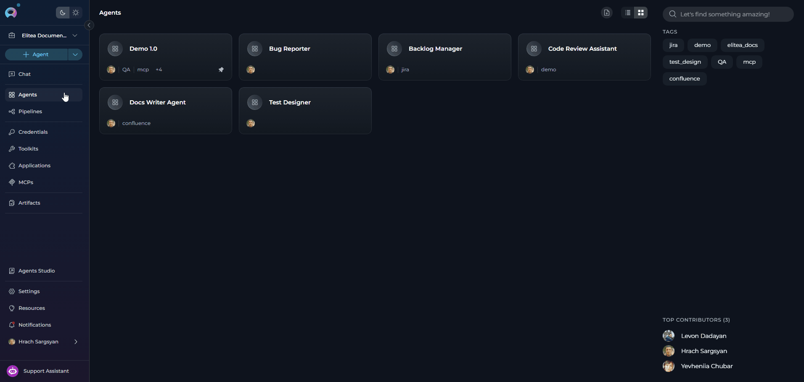
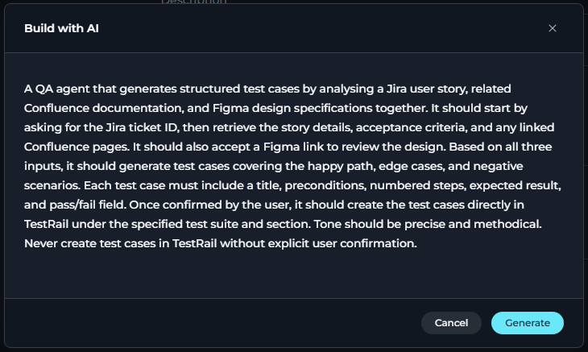
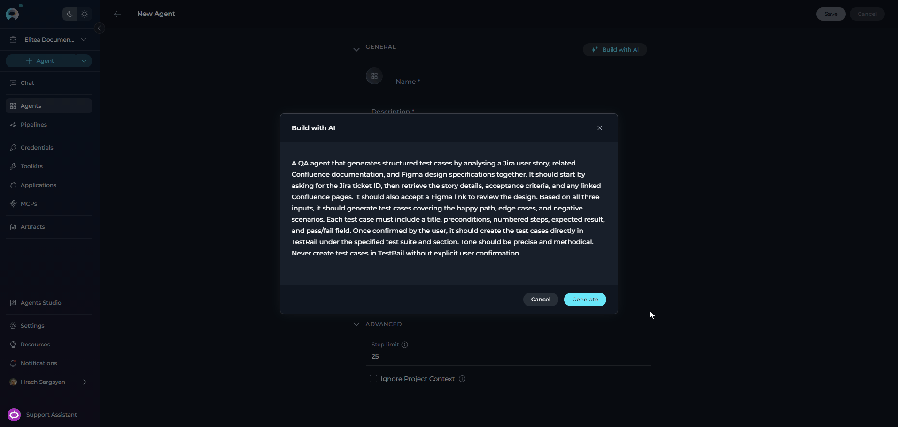
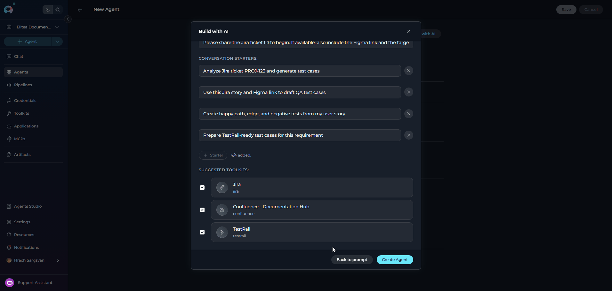
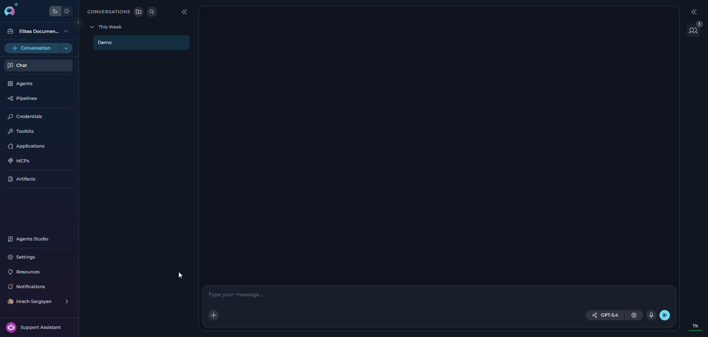

## Overview

**Build with AI** is an agent creation shortcut that converts a natural-language description into a complete agent draft. Instead of filling in every field manually, you describe what the agent should do and ELITEA generates a starting configuration: name, description, instructions, welcome message, conversation starters, and suggestions for toolkits and child agents already available in your project.

The draft is fully editable before the agent is created — nothing is saved until you click **Create Agent**.

<CardGroup cols={2}>
  <Card title="Natural-Language Input" icon="pen-line">
    Describe the agent's goal, tasks, and tone in plain text. No structured syntax or templates required.
  </Card>
  <Card title="Full Draft Preview" icon="eye">
    Review and edit every generated field — name, description, instructions, welcome message, and conversation starters — before the agent is created.
  </Card>
  <Card title="Suggested Resources" icon="link">
    ELITEA analyses the available toolkits and agents in your project and suggests relevant ones to attach. You decide which to include.
  </Card>
  <Card title="Non-Destructive" icon="shield-check">
    No agent is created until you click **Create Agent**. You can go back to edit your prompt at any time before confirming.
  </Card>
</CardGroup>

---

## Prerequisites

- **Permission**: Requires agent edit/update permissions in the project. The **Build with AI** button is not shown to users without this permission.
- **Default Model**: The project must have at least one LLM model configured. The generated agent uses the project's default model.
- **Existing Resources** *(optional)*: Toolkits and agents already in the project are surfaced as suggestions. None are required to use the feature.

---

## How It Works

**Build with AI** is a three-step modal flow:

| Step | What Happens |
|------|-------------|
| **1. Describe** | You type a free-text description of the agent's goal, tasks, and behavior |
| **2. Generating** | ELITEA calls the AI backend to produce a structured agent draft |
| **3. Review & Create** | You review and edit all generated fields, select suggested resources, and confirm creation |

After you click **Create Agent**, the platform:
1. Creates the agent with the reviewed fields and the project's default LLM model
2. Associates the selected toolkits and child agents
3. Navigates you directly to the new agent's **Configuration** tab

<Info title="What Gets Generated">
The AI generates values for: **Name**, **Description**, **Instructions**, **Welcome Message**, **Conversation Starters**, and lists of **Suggested Toolkits** and **Suggested Agents** from your project. All values are editable before creation.
</Info>

---

## Using Build with AI

### Step 1 — Open the Build with AI Dialog

1. Navigate to **Agents** in the main menu.
2. Click **+ Create** to open the new agent form.
3. In the **General** accordion section, locate the **Build with AI** button in the section header (sparkle icon ✨).
4. Click **Build with AI** to open the dialog.

     

<Tip title="Where to Find It">
The **Build with AI** button appears in the header of the **General** section inside the new agent creation form — not as a standalone page entry. Open the agent creation form first.
</Tip>

### Step 2 — Describe Your Agent

The dialog opens on the **description input** step. A large multiline text field is shown with the placeholder:

> *Describe your agent's goal, key tasks, and preferred tone or behavior.*

1. Type your description in the text field. Include:
   - What the agent is for
   - What tasks it should handle
   - Any specific tone, constraints, or behavior you want
2. Click **Generate** or press **Enter** (without Shift) to submit.

     

The dialog transitions to a loading state showing **"Generating agent draft…"** while the backend processes your description.

If generation fails, an error message is shown and you remain on the input step. You can edit your description and try again.

<Note>
Pressing **Shift+Enter** inserts a line break in your description. Only plain **Enter** triggers generation.
</Note>

### Step 3 — Review and Edit the Draft

Once generation completes, the dialog shows the **Review** step with all generated fields pre-filled and fully editable.

**Editable fields:**

| Field | Notes |
|-------|-------|
| **Name** | Max 32 characters. A character counter appears while the field is focused. |
| **Description** | Multiline, no hard limit shown in the dialog. |
| **Instructions** | Multiline, 4–10 visible rows. The core system prompt for the agent. |
| **Welcome Message** | Single-line. Shown to users when they open a conversation with this agent. |
| **Conversation Starters** | Up to **4** starters, each max **768** characters. You can edit, add, or remove starters. A counter shows `N/4 added`. |

**Suggested resources:**

If the AI detected relevant toolkits or agents in your project, they are shown in checkbox lists at the bottom of the review form:

- **Suggested Toolkits** — shows toolkit name and type. Check the ones to attach.
- **Suggested Agents** — shows agent name and description. Check the ones to attach as child agents.

Resources that are not checked are **not attached** when the agent is created.

**Actions on the Review step:**

- **Back to prompt** — returns to the description input step with your original text preserved, without losing the draft. Use this to refine your description and regenerate.
- **Create Agent** — creates the agent with the current field values and selected resources.

     

### Step 4 — Agent Created

After clicking **Create Agent**:

1. The agent is created in the project.
2. Selected toolkits are associated with the agent's first version.
3. Selected agents are associated as child agents.
4. The dialog closes and the browser navigates directly to the new agent's **Configuration** tab.

     

From the Configuration tab, you can continue configuring the agent — adjust the LLM model, add more toolkits, set variables, configure internal tools, and save or publish.

---

## Build an Agent with AI from Chat

You can use **Build with AI** without leaving an active conversation, via the **Canvas** interface in Chat.

1. In the chat input toolbar, click the **`+`** icon.
2. Hover over **Agents** to expand the submenu.
3. Click **Create New Agent** at the bottom of the submenu.
4. The Agent Canvas slides in with the full creation form.
5. In the **General** section header, click the **Build with AI** button (sparkle icon ✨).
6. Type a description of your agent's goal, tasks, and behavior, then click **Generate**.
7. Review and edit the generated draft — name, instructions, welcome message, conversation starters, and suggested resources.
8. Click **Save** to create the agent.

     

---

## Example Descriptions

The following examples show the range of descriptions you can provide:

<Accordion title="Code Review Agent">

> A code review agent that reviews Python pull requests for correctness, style, and security issues. It should be thorough but concise, and return its feedback as a structured list with severity labels (critical, warning, suggestion).

The AI will generate instructions focused on Python code analysis, a welcome message inviting users to paste their code, and conversation starters like *"Review this Python function for security issues."*
</Accordion>

<Accordion title="Jira Ticket Management Agent">

> An agent that helps engineers create, update, and search Jira tickets. It should ask clarifying questions before creating tickets to ensure all required fields are filled. Tone should be professional and efficient.

The AI will generate instructions for Jira task management and likely suggest any Jira toolkits available in your project.
</Accordion>

<Accordion title="Sprint Planning Coordinator">

> A meta-agent that coordinates sprint planning by gathering sprint goals from the user, delegating analysis to specialist agents, and producing a consolidated sprint plan. It should be structured and ask one question at a time.

The AI will generate coordinator-style instructions and may suggest other agents in the project as child agents.
</Accordion>

---

## Troubleshooting

<Accordion title="The 'Build with AI' button is not visible">
The button only appears for users with agent edit/update permissions. If you do not have the required permissions, the button is hidden entirely. Contact your project administrator to request the appropriate role.
</Accordion>

<Accordion title="Generation fails with an error">
If the AI backend fails to generate a draft, an error message appears in the dialog and you remain on the input step. Common causes:
- The description is empty or too short
- A backend service is temporarily unavailable

Edit your description and click **Generate** again. If the error persists, contact your Elitea administrator.
</Accordion>

<Accordion title="Suggested toolkits or agents are not shown">
Suggestions are based on resources already in your project. If no toolkits or agents exist in the project, no suggestions appear. Create the relevant toolkits or agents first, then try generating a draft again.
</Accordion>

<Accordion title="The generated name or instructions are not suitable">
All fields are fully editable in the Review step. You can overwrite the generated name, rewrite the instructions, and adjust any other field before clicking **Create Agent**. Alternatively, click **Back to prompt**, refine your description, and regenerate.
</Accordion>

<Accordion title="I want to start over with a different description">
Click **Back to prompt** on the Review step. Your original description is preserved in the input field and you can edit it before generating again.
</Accordion>

---

## Related Features

<Info title="Additional Resources">
* **[Agents Overview](../../menus/agents)** - Creating and configuring agents manually
* **[Agent Publishing](./agent-publishing)** - Publish your generated agent so others can use it
* **[Entity Versioning](./entity-versioning)** - Create and manage versions of your agent after generation
* **[Toolkits Overview](../../menus/toolkits)** - Create and configure toolkits to attach to your agent
* **[Agents from Canvas](../chat-conversations/how-to-create-and-edit-agents-from-canvas)** - Another way to create and edit agents directly from a conversation
</Info>
