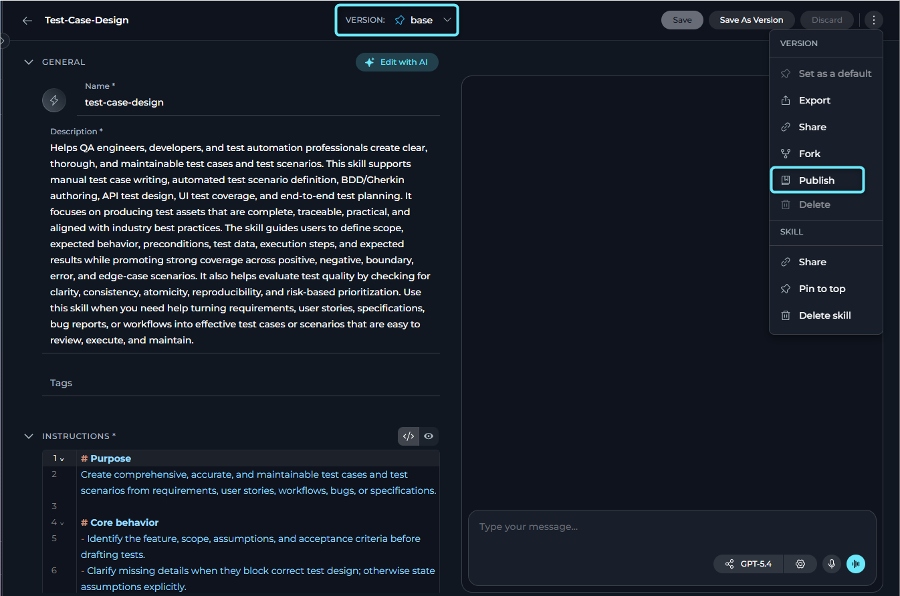
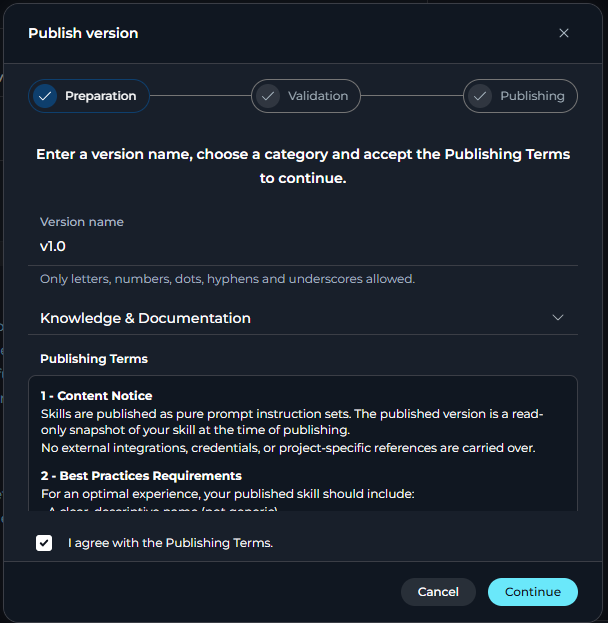
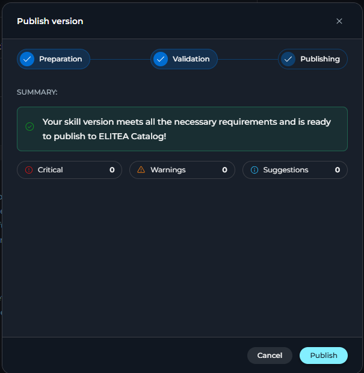
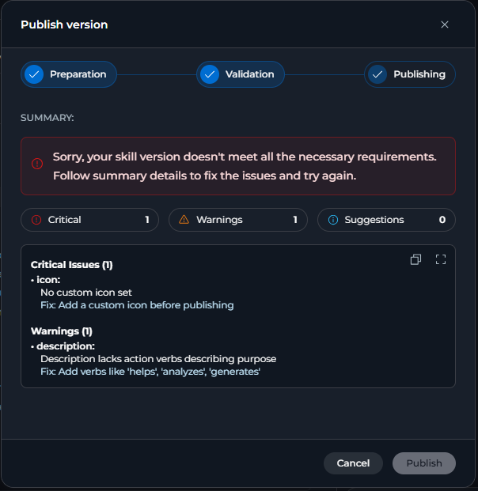
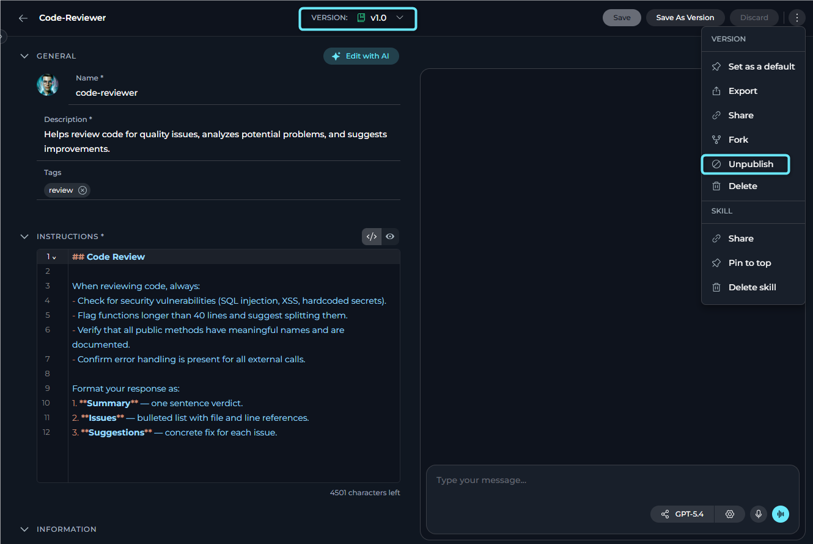

## Introduction

*Skill publishing* is the process of making a skill version available in **ELITEA Catalog**, a shared library of community-published agents and skills. Once published, your skill becomes visible in the catalog and other users can reuse it across projects.

**Key capabilities:**

- Publish skill versions through a guided three-step wizard
- AI-powered automated validation runs before publishing in the standard flow
- A validation token from the AI review is sent with the publish request and must still be valid at publish time
- Unpublish your skill at any time to remove it from ELITEA Catalog
- Published skills appear in the public catalog and the catalog cache refreshes after publish or unpublish

<Note title="Scope">
Publishing is available for skills.
Your role must include the `models.applications.skills.publish` permission to show the **Publish** action in the **Skills** UI.
</Note>

---

## How to Publish a Skill

### Start

1. In **Skills**, open the skill you want to publish.
2. Select the version you want to publish from the version selector.
3. Select the three-dot menu.
4. Select **Publish** from the dropdown.

   

<Warning>
**Publish Option Not Visible or Disabled**

- **Not visible** — The option is hidden when your role does not include the publish permission (`models.applications.skills.publish`).
- **Visible but unavailable** — The option appears but is unavailable with the tooltip **"Publishing is blocked by platform policy."** In the UI, this behavior is controlled by `is_skill_publish_blocked` together with `skill_publish_whitelist_project_ids`. If your project is not on the allowlist, publishing is blocked.
</Warning>

---

### Complete Preparation

The **Publish version** dialog opens on the first step, **Preparation**.

**Fields and actions on this step:**

| Element | Description |
|---------|-------------|
| **Version name** | A unique name for this published version. Allowed characters: letters, numbers, dots (`.`), hyphens (`-`) and underscores (`_`). Maximum 50 characters. The UI checks whether the same version name already exists on the current skill.|
| **Category** | Required dropdown. You must select a category before continuing. |
| **Publishing Terms** | A scrollable section describing what a published skill contains, best-practice requirements, and administrative rights. Open it in full-screen if needed. |
| **I agree with the publishing terms** checkbox | Must be checked before you can continue in the standard flow. |
| **Continue** button | Enabled only when the version name is valid, a category is selected, the checkbox is selected and no duplicate version name is detected in the current skill. Selecting it starts automated validation. |
| **Cancel** button | Closes the wizard without publishing. |

   

<Info>
The wizard requires a **Category** before you can continue or publish.
</Info>

This card summarizes the publishing terms.

<Card title="Publishing Terms" icon="file-lines">
  **Content Notice**

  Skills are published as pure prompt instruction sets. The published version is a read-only snapshot of your skill at the time of publishing.

  No external integrations, credentials or project-specific references are carried over.

  **Best Practice Requirements**

  For an optimal experience, your published skill should include:

  - A clear, descriptive name
  - A comprehensive description that covers purpose and use cases
  - A distinctive icon
  - Complete, actionable instructions
  - A descriptive version name that follows semantic versioning

  **Administrative Rights**

  ELITEA administrators reserve the right to unpublish skills that:

  - Violate platform rules or guidelines
  - Do not meet quality standards
  - Contain inappropriate, harmful or offensive content
  - Embed credentials, API keys or security-sensitive information
  - Fail to satisfy publishing requirements
</Card>

---

### Review Validation Results

When you select **Continue**, the wizard moves to the validation step and submits the selected skill version for AI-powered validation.

While the validation runs, the dialog shows:

> *Reviewing your skill version to ensure it meets publication rules.*

In tabs, you can see possible validation outcomes.

<Tabs>
  <Tab title="Passed">
    | Status | Message |
    |--------|---------|
    | <Badge color="green">PASS</Badge> | "Your skill version meets all the necessary requirements and is ready to publish to ELITEA Catalog." |
    | <Badge color="orange">WARN</Badge> | "Your skill version meets the necessary requirements, but has some points for improvement. Follow summary details to improve." |

    The result panel shows three severity counters: **Critical**, **Warnings** and **Suggestions**. Each counter links to the matching section in the detail list. The detail list includes the field, optional context, the issue or suggestion and a recommended fix when available.

    Use the toolbar on hover to:
    - Copy the full validation report as plain text
    - Open full-screen for a larger view in the Validation Details dialog

    After validation:

    - If the status is **PASS** or **WARN**, the **Publish** button becomes enabled.
    - The response includes a validation token.

    

  </Tab>

  <Tab title="Not Passed">
    | Status | Message |
    |--------|---------|
    | <Badge color="red">FAIL</Badge> | "Sorry, your skill version doesn't meet all the necessary requirements. Follow summary details to fix the issues and try again." |

    The result panel still shows the validation details, including the field, optional context, the issue and a recommended fix when available.

    After validation:

    - If the status is **FAIL**, the **Publish** button remains disabled.
    
  </Tab>
</Tabs>

---

### Publish the Skill

Select **Publish** to submit the skill for publication. In the standard flow, the request includes the version name, category and the validation token returned by the validation step.

The dialog transitions to the **Publishing** step and displays:

> *Publishing your skill...*

On success, the UI shows one of these notifications:

- *The skill has been published.*
- *Skill published, but some resources may not have been published.*

After a successful publish, the dialog closes and the surrounding skill data is refreshed.

Once published, your skill appears in **ELITEA Catalog**.

<video controls width="100%" aria-label="Skill publishing full.">
  <source src="../../img/how-tos/agents-pipelines/skill-publishing/skill-publishing-full.mp4" type="video/mp4" />
</video>

---

<Note>
**Admin Mode**

When you work in the public project, the publish flow uses a simplified single-step dialog.

Enter a version name, select a category and select **Publish**. This flow does not show publishing terms, the agreement checkbox or the AI validation step.
</Note>

---

## How to Unpublish a Skill

You can remove a published skill from ELITEA Catalog at any time.

1. Open the published skill version.
2. Select the three-dot menu.
3. Select **Unpublish** from the dropdown.
4. In the confirmation dialog, review the skill name and version name.
5. Select **Unpublish** to confirm, or select **Cancel** to close without changes.

  

On success, a notification confirms:

> *Skill has been successfully unpublished!*

<Note>
**Admin Mode**

When you unpublish from the public project context, the confirmation dialog shows an additional **Reason** field.

The reason is optional. After a successful unpublish, the UI goes to the **Skills** page.
</Note>

---

## Validation & Server Checks

The backend and UI verify these conditions during the publish flow:

- The version must not already be published.
- The version name must be unique on the current skill in the UI and must also pass backend checks.
- The version name must also be unique on the published public copy of the skill.
- The validation token must still be valid when publishing.
- The validation token expires after **five minutes** by default.
- If the skill content changes after validation, the token becomes invalid and publishing is rejected.
- Platform policy can block skill publishing outside the allowlist projects.

---

## Best Practices

<AccordionGroup>
  <Accordion title="Prepare your skill before opening the wizard">
    Address common validation failures before you begin:

    - Set a clear, specific skill name
    - Write a comprehensive description covering the skill's purpose and use cases
    - Add a distinctive icon
    - Write complete, actionable instructions
    - Choose a descriptive version name
  </Accordion>

  <Accordion title="Choose a meaningful version name">
    The version name becomes the identifier for the published snapshot. The UI accepts names such as:

    - A semantic version number: `1.0.0`, `2.1.3`
    - A date-based label: `2026-07`
    - A descriptor: `initial-release`, `beta`

    Only letters, numbers, dots (`.`), hyphens (`-`) and underscores (`_`) are allowed.
  </Accordion>

  <Accordion title="Review validation warnings before publishing">
    A **WARN** result still allows publishing. Review the warnings and suggestions in the validation details before deciding whether to publish immediately.
  </Accordion>

  <Accordion title="Avoid embedding sensitive information">
    The UI terms state that published skills are pure prompt instruction sets and should not carry credentials, API keys or project-specific references. Review your instructions before publishing.
  </Accordion>
</AccordionGroup>

---

## Troubleshooting

<AccordionGroup>
  <Accordion title="The Publish option is not visible in the three-dot menu">
    **Cause:** Your role does not include the publish permission.

    **Solution:** Verify that your role includes `models.applications.skills.publish`.
  </Accordion>

  <Accordion title="The Publish option is visible but disabled with a tooltip">
    **Cause:** The tooltip reads **"Publishing is blocked by platform policy."** This occurs when `is_skill_publish_blocked` is enabled and your project is not included in `skill_publish_whitelist_project_ids`.

    **Solution:** Ask a platform administrator to add your project to the skill publishing allowlist.
  </Accordion>

  <Accordion title="The Continue button remains disabled on the Preparation step">
    **Cause:** One or more of these conditions is not met:

    - The **Version name** field is empty
    - The version name contains characters other than letters, numbers, `.`, `-`, or `_`
    - A version with the same name already exists on the current skill
    - No **Category** is selected
    - The **I agree with the publishing terms** checkbox is unchecked

    **Solution:** Enter a valid version name, select a category, and check the agreement checkbox.
  </Accordion>

  <Accordion title="Validation fails with a transient AI error on every attempt">
    **Cause:** The backend returned `ai_validation_failed` even after the UI retried the validation request twice.

    **Solution:** Try again later. If the problem persists, contact your platform administrator.
  </Accordion>

  <Accordion title="Validation returns a FAIL result">
    **Cause:** The validation response returned status `FAIL`.

    **Solution:** Review the **Critical Issues** section in the validation details, update the skill and run validation again.
  </Accordion>

  <Accordion title="Publishing fails because the validation token is invalid or expired">
    **Cause:** The backend rejects invalid, expired or stale validation tokens. The implementation returns messages such as:

    - *Invalid validation token.*
    - *Validation token expired. Please re-validate before publishing.*
    - *Agent was modified since validation. Please re-validate.*

    **Solution:** Return to the validation step and run validation again before publishing.
  </Accordion>

  <Accordion title="Publishing fails with a duplicate version name error">
    **Cause:** The backend detected either `version_name_exists_in_source` or `version_name_exists`.

    **Solution:** Choose a different version name and try again.
  </Accordion>

  <Accordion title="Publishing fails with 'Maximum published versions reached'">
    **Cause:** The backend returned `limit_reached`.

    **Solution:** Unpublish one or more older published versions before publishing a new one.
  </Accordion>

  <Accordion title="Unpublish fails because the version is not published">
    **Cause:** The backend returned `not_published`.

    **Solution:** Verify that the selected skill version is in **Published** status.
  </Accordion>
</AccordionGroup>

---

## Guides & References

<Note>
- [Skills](../../menus/skills) — Manage skills and review skill versions
- [ELITEA Catalog](../../menus/agents-studio) — Browse published agents and skills
- [Agent Publishing](./agent-publishing.mdx) — Publishing flow for agents
</Note>