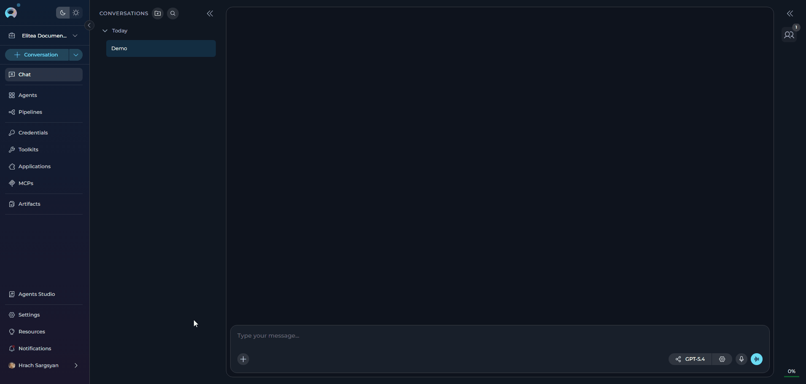
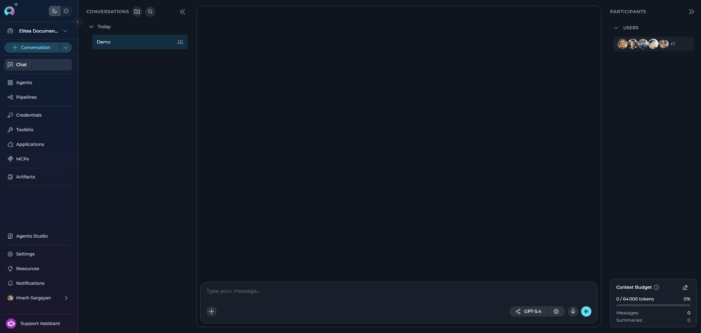
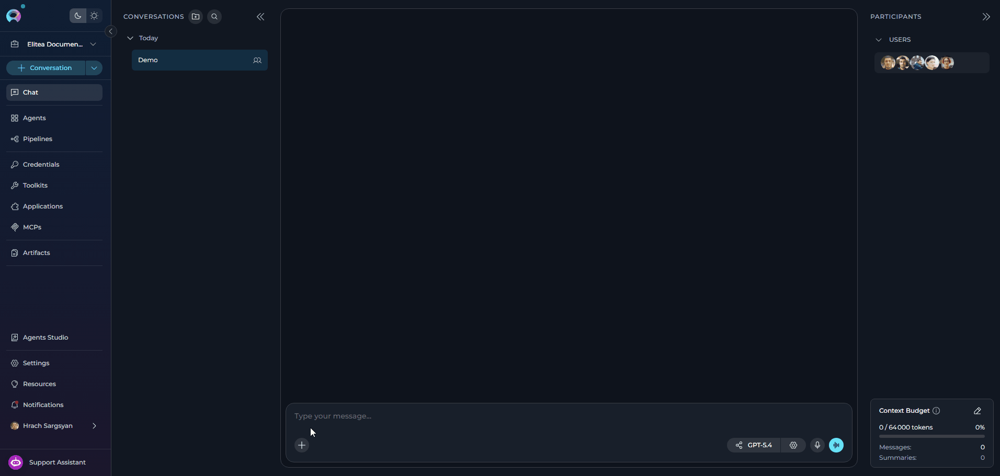
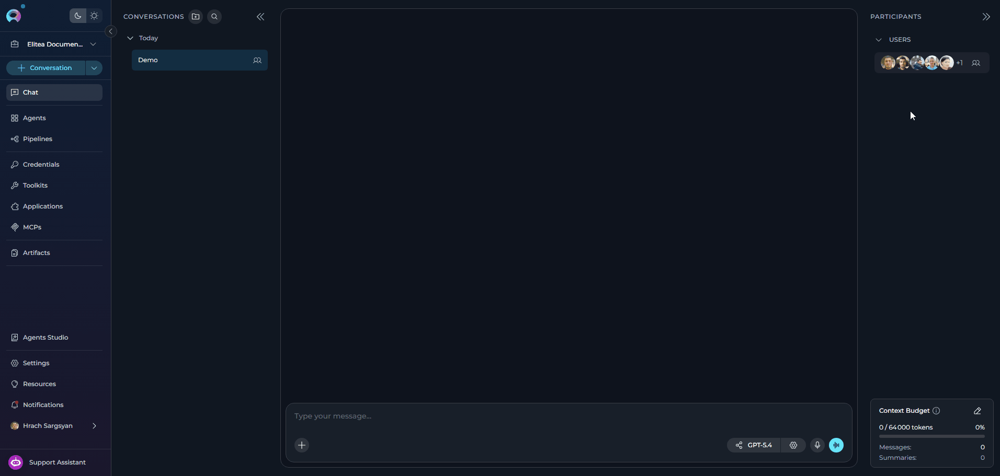

## Overview

<Note title="Team Projects Only">
User collaboration features are only available in team projects, not in your private/personal project workspace.
</Note>

---

## Add Teammates to a Conversation

**To add users to your conversation:**

1. Open your conversation in ELITEA Chat.
2. In the chat input toolbar, click the **`+`** icon.
3. Select **Invite Users** from the popup menu.
4. The **Add users** modal will appear with a searchable list of team members.
5. Use the search to find teammates by name.
6. Select one or more users from the list. Scroll down to load more results.
7. Click **Add** to confirm.

The selected users will be added as participants and will appear in the Users section of the Participants panel.

<Info title="Notification to Added Users">
When you add users to a conversation, they will automatically receive a notification informing them that they have been added. This ensures all participants are aware of their inclusion in the conversation.
</Info>

   

---

## View Participants

All conversation participants are visible in the **PARTICIPANTS** panel on the right side of the chat interface:

* **Users Section**: Shows human teammates as circular avatars
* **Visual Display**: When multiple users are present, their avatars are displayed in a row
* **Participant Count**: If there are more users than can fit in the display, a count indicator (e.g., "+3") shows additional participants
* **Users Dropdown**: Hover over the Users section to reveal the users icon, then click it to see the complete list of all conversation participants
* **Sorted List**: Users appear in alphabetical order by name in the dropdown menu

   

---

## Mention Users

Mentioning teammates directs messages to them and highlights their name in the conversation for better visibility.

**How to Mention a Specific User:**

**Method 1: Using the Participants Panel**

1. In the **PARTICIPANTS** panel, hover over the **Users** section to reveal the users icon.
2. Click the users icon to open the users dropdown.
3. Hover over the user's name you want to mention — an **@** symbol overlay appears.
4. Click the user's name (or the **@** overlay) to insert the mention into your message.

**Method 2: Using @ in Chat Input**

1. In the chat input field, type **@**
2. A suggestion list appears showing all users in the conversation
3. Select the user you want to mention from the list (or continue typing their name to filter)
4. The mention is inserted into your message

The user's mention will be automatically inserted into the chat input field.

**Mention Everyone:**

To direct your message to all participants in the conversation:

1. In the **PARTICIPANTS** panel, hover over the **Users** section to reveal the users icon.
2. Click the users icon to open the users dropdown.
3. Select **"All users"** from the dropdown (appears at the bottom after the divider, only shown when there are 2 or more users).
4. The `@Everyone` mention is inserted into your message.
5. Complete your message and send.

Alternatively, type **@** in the chat input and select **"Everyone"** from the suggestion list.

   

<Tip title="About Mentions">
* Mentions help direct messages to specific users or all participants in the conversation
* You can mention multiple users in a single message by clicking on each user's avatar
* **Important**: When you mention a user, the message is directed to that user only - AI assistants (agents, pipelines) will not process or respond to the message
</Tip>

---

## Remove a User from Conversation

**To remove a user from the conversation:**

1. In the **PARTICIPANTS** panel, hover over the **Users** section to reveal the users icon.
2. Click the users icon to open the dropdown.
3. Hover over the user's name — a **Delete** icon appears on the right.
4. Click the **Delete** icon.
5. In the confirmation dialog ("Remove user? Are you sure to remove the **[name]** user from conversation?"), click **Remove** to confirm.

The user will be immediately removed from the conversation and will no longer have access to the chat.

   

<Warning title="Removal Confirmation">
You cannot remove yourself from the conversation. The Delete icon only appears for other users.
</Warning>

---

## Best Practices

<Accordion title="Adding and Managing Users">
* **Use Search**: In the Add users modal, use the search bar to quickly find teammates by name in large teams
* **Multiple Users**: You can add multiple users at once from the Add users modal for team-wide conversations
* **User Management**: Remove users who no longer need access to keep conversations focused and secure
</Accordion>

<Accordion title="Using Mentions Effectively">
* **Strategic Mentions**: Use @mentions to get specific users' attention on important updates or questions
* **Mention Everyone Sparingly**: Use `@Everyone` only for critical announcements to avoid notification fatigue
</Accordion>

<Accordion title="Human-AI Collaboration">
* **Collaboration**: Combine user mentions with AI participants (agents, pipelines) for powerful human-AI collaboration
* **Teamwork**: Use conversations to enable seamless collaboration between human teammates and AI assistants
</Accordion>

---

## Troubleshooting

<Accordion title="Cannot see 'Add users' option">
* Verify you're in a team project (not your personal/private project)
* User collaboration features are disabled in private workspaces
</Accordion>

<Accordion title="User not appearing in search results">
* Ensure the user is a member of your project/team
* Check if the user has been filtered by existing participants (already added users don't appear in search)
* Scroll down in the user list - there may be more results below
</Accordion>

<Accordion title="Cannot remove a user">
* You cannot remove yourself from the conversation
* Only users who were added to the conversation can be removed
* The conversation creator and project members with appropriate permissions can remove users
</Accordion>

<Accordion title="Mentions not working">
* Ensure you're typing **@** followed by the username
* Select the user from the dropdown menu that appears
* Verify the user is still a participant in the conversation
</Accordion>

---

<Info title="Related Resources">
* [ELITEA Chat Documentation](../../menus/chat) - Complete chat interface guide
* [How to Use Chat Functionality](./how-to-use-chat-functionality) - Chat features and capabilities
* [Understanding Participants](../../menus/chat#participants) - Learn about all participant types (agents, pipelines, toolkits, users)
</Info>

---