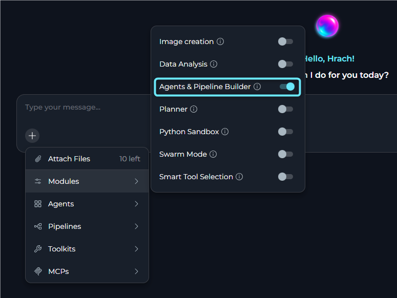
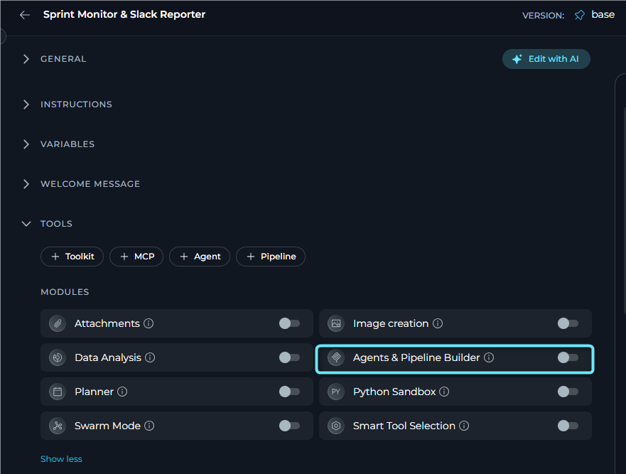

## Overview

**Agents & Pipeline Builder** is a built-in Module that connects a conversation agent to ELITEA's own **Model Context Protocol (MCP) server**. Once enabled, the agent can create and update agents and pipelines directly from chat, while also discovering and calling other agents and toolkit operations that have been explicitly made available through MCP — all from within a single conversation, without the user needing to pre-wire every dependency upfront.

<CardGroup cols={2}>
  <Card title="Platform-Native MCP Access" icon="server">
    Uses the same secure MCP server that external MCP clients use, but from inside a conversation — no separate connection needed.
  </Card>
  <Card title="Agent & Pipeline Creation" icon="sparkles">
    Create and update agents and pipelines directly from chat when the conversation requires new automation or orchestration.
  </Card>
  <Card title="Agent Invocation" icon="robot">
    Call other agents tagged with **mcp** as tools — pass a task, get back the agent's full response.
  </Card>
  <Card title="Toolkit Tool Execution" icon="toolbox">
    Invoke individual tools from any toolkit with **Available via MCP** enabled — each selected tool becomes a direct callable.
  </Card>
  <Card title="No External Credentials" icon="shield-check">
    Authentication is inherited from the current user session — no additional secrets or setup required.
  </Card>
</CardGroup>

<Tip title="When to Use Agents & Pipeline Builder">
Use Agents & Pipeline Builder when you want a **coordinator or meta-agent** to discover and delegate to other agents at runtime, create or update agents and pipelines directly from chat, and invoke toolkit operations dynamically based on what the conversation requires.
</Tip>

---

## Prerequisites

- **MCP Enabled**: MCP features must be enabled on the platform. If the **Agents & Pipeline Builder** toggle does not appear in the Modules list, contact your Elitea administrator.
- **Permission Level**: User role with conversation or agent edit access
- **Default Availability**: The feature can be enabled by default for new conversations through the project-level **Agent & Pipeline Builder** setting.
- **Agents tagged with `mcp`**: To appear as callable tools, agents must have the **`mcp`** tag applied. Agents without this tag are not listed, regardless of publish status.
- **MCP-Available Toolkits** *(optional)*: Toolkits with **Available via MCP** enabled in their settings, so their individual tools are callable.
- **Elitea Personal Access Token** *(for internal MCP toolkits when required)*: Some internal MCP toolkit actions require a valid Elitea personal access token. If the token is missing or expired, renew or create one before retrying the action.

---

## How It Works

When Agents & Pipeline Builder is enabled, the agent connects to ELITEA's built-in MCP server, which exposes callable resources and supports chat-driven builder workflows:

| Category | What Is Exposed | Requirement |
|----------|----------------|-------------|
| **Builder Actions** | Agent can create or update agents and pipelines directly from chat | Feature enabled and user has the required project permissions |
| **Agents** | Agents appear as tools the AI can call with a `task` argument | Agent must have the **`mcp` tag** applied |
| **Toolkit Tools** | Each selected tool within a toolkit becomes a standalone callable | Toolkit must have **Available via MCP** enabled in its MCP Options |

**How a tool call works**

1. The agent decides to call a resource — for example, `PR_Review_Agent` with `task: "Review PR #42"`
2. The MCP server resolves the name and routes the call:
   - **Agent call** → runs the full agent prediction pipeline and returns the agent's final reply
   - **Toolkit tool call** → executes the tool with the provided arguments and returns the result as JSON
3. The response is returned to the calling agent, which incorporates it into its reasoning

<Info title="How Tool Names Are Generated">
Both agent and toolkit tool names are derived from the resource's display name: any character that is not a letter, digit, underscore, or hyphen is replaced with `_`. For example, `"PR Review Agent"` → `PR_Review_Agent`, and `"My GitHub Toolkit"` with tool `create_issue` → `My_GitHub_Toolkit_create_issue`. Names that collide after normalisation — the second occurrence is silently skipped, so keep resource names distinct.
</Info>

---

## Enabling Agents & Pipeline Builder

Agents & Pipeline Builder can be toggled on per conversation or saved as part of an agent's configuration for persistent use across all conversations with that agent.

<Note>
If **Agents & Pipeline Builder** does not appear in the Modules list, the MCP feature may be disabled at the platform level. Contact your Elitea administrator.
</Note>

### In a Conversation

Enable Agents & Pipeline Builder for an ad-hoc conversation.

1. Navigate to your conversation.
2. Locate the chat input toolbar at the bottom of the screen.
3. Click the **`+`** icon in the toolbar to open the menu.
4. Hover over **Modules** to reveal the flyout panel.
5. Find **Agents & Pipeline Builder** in the list and click the toggle to enable it.
6. A success toast notification appears: **"Modules configuration updated"**.
7. Click anywhere outside the panel to close it.

    

Once enabled, the agent has access to builder capabilities and all MCP-exposed tools in that conversation. The agent can create or update agents and pipelines, and call available MCP tools as needed based on the conversation flow and user instructions.

### In Agent Configuration

Configure Agents & Pipeline Builder as part of an agent's saved configuration so it is active for all new conversations using that agent.

1. Navigate to **Agents** in the main menu.
2. Select the agent you want to configure or create a new agent.
3. Within the TOOLS section, locate the **MODULES** subsection.
4. Find the **Agents & Pipeline Builder** toggle. If it is not visible, click **Show all** to expand the full list.
5. Click the **Agents & Pipeline Builder** toggle to enable it.
6. Click **Save** at the top of the configuration page.
7. New conversations created with this agent will have Agents & Pipeline Builder active by default.

<Info title="Default Enablement for New Conversations">
In the UI, **Agent & Pipeline Builder** can also be enabled by default for new conversations through the project general settings. When this default is on, new chat sessions start with the module already enabled.
</Info>

  

<Tip title="Combine With Smart Tools Selection">
When many platform agents and toolkits are available, consider also enabling **Smart Tools Selection** to reduce token usage from binding all discovered tools upfront.
</Tip>

---

## Available Tools at Runtime

The exact tools the agent sees at runtime depend on your project's configuration.

### Agent Tools

Agents that have the **`mcp` tag** applied are exposed as callable tools. Each such agent produces one tool:

| Property | Value |
|----------|-------|
| **Name** | Derived from the agent's display name — any character outside `[A-Za-z0-9_-]` becomes `_` |
| **Description** | The agent's description field |
| **Input** | Single `task` string — a self-contained instruction; the agent receives no other context |
| **Output** | The agent's final text response |

<Warning title="Tag Your Agents">
Agents without the **`mcp`** tag do **not** appear as tools, even if they are published. Apply the `mcp` tag to an agent in its settings to make it callable via Agents & Pipeline Builder.
</Warning>

### Toolkit Tools

Toolkits with **Available via MCP** turned on in their **MCP Options** section expose their selected tools individually:

| Property | Value |
|----------|-------|
| **Name** | `{toolkit_name}_{tool_name}` — both normalised with the same rule as above |
| **Description** | `"Tool '{tool_name}' from toolkit type '{toolkit_type}'. Toolkit description: {description}"` |
| **Input / Output** | Matches the toolkit's native tool schema exactly |

---

## Using Agents & Pipeline Builder

Once enabled, the agent automatically has access to all discovered tools. No additional prompting or configuration is needed — the agent uses them based on the task requirements.

### Create an Agent from Chat

<Warning>
This feature is under development and will be improved in upcoming releases.
</Warning>

You can use Agents & Pipeline Builder to create a new agent directly from a conversation.

1. Open a conversation where **Agents & Pipeline Builder** is enabled.
2. Ask the agent to create a new agent and describe what it should do.
3. Include the key details in your request.
4. Review the generated result in chat.
5. If needed, ask the agent to refine or update the generated agent configuration.
6. Save or apply the created agent configuration in the platform when the result matches your intent.

<Tip title="Be Specific in Builder Requests">
The more specific your request is, the better the generated agent will be. Include the agent's goal, expected inputs, outputs, constraints, and any required tools or integrations.
</Tip>

### Example Interaction

**User:** *"List all open pull requests from the GitHub toolkit and ask the code review agent to review each one."*

**Setup required:**
- GitHub toolkit has **Available via MCP** enabled and `list_pull_requests` in its selected tools
- The code review agent has the **`mcp`** tag applied

**Behind the Scenes:**

1. The agent calls `My_GitHub_Toolkit_list_pull_requests` (normalised from `"My GitHub Toolkit"` + `list_pull_requests`) to fetch open PRs
2. For each PR, the agent calls `Code_Review_Agent` with a self-contained `task` that includes the PR title and diff inline
3. The code review agent runs its full prediction pipeline and returns its findings as text
4. The calling agent collects all reviews and presents a consolidated summary to the user

---

## Example Scenarios

<Accordion title="Dynamic Agent Coordinator">
**Scenario:** A meta-agent that delegates tasks to specialised agents at runtime, without pre-wiring every dependency in the configuration.

**Setup:**

- Agents & Pipeline Builder: Enabled on the coordinator agent
- `Reporting Agent` and `QA Agent` both have the **`mcp`** tag applied

**User Request:**

> `Summarise the last sprint and send the report through the reporting agent, then run the regression tests using the QA agent.`

**Workflow:**

1. Coordinator discovers available agent tools from the MCP server
2. Calls `Reporting_Agent` with `task: "Generate a sprint summary for the last sprint. Include completed items, blockers, and carry-overs."`
3. Receives the sprint report as text
4. Calls `QA_Agent` with `task: "Run the regression test suite and return the pass/fail summary."`
5. Receives the test results
6. Combines both outputs and returns a single status update to the user

The coordinator never needed hardcoded references to the child agents — adding a new agent with the `mcp` tag makes it immediately available.
</Accordion>

<Accordion title="Release Automation Agent">
**Scenario:** A DevOps engineer wants an agent that bridges Jira and GitHub using natural language — finding tickets, merging their PRs, and updating statuses.

**Setup:**

- Agents & Pipeline Builder: Enabled
- `Dev GitHub` toolkit — **Available via MCP** on; selected tools include `list_pull_requests`, `merge_pull_request`
- `Project Jira` toolkit — **Available via MCP** on; selected tools include `search_issues`, `update_issue`

**Exposed tool names** (after normalisation):
- `Dev_GitHub_list_pull_requests`, `Dev_GitHub_merge_pull_request`
- `Project_Jira_search_issues`, `Project_Jira_update_issue`

**User Request:**

> `Find all Jira tickets marked "Ready for Release" and merge the associated GitHub pull requests.`

**Workflow:**

1. Agent calls `Project_Jira_search_issues` with JQL `status = "Ready for Release"`
2. For each ticket, extracts the linked PR number from the ticket fields
3. Calls `Dev_GitHub_merge_pull_request` for each PR
4. Calls `Project_Jira_update_issue` to transition each ticket to "Released"
5. Returns a summary: merged PRs and updated Jira tickets
</Accordion>

<Accordion title="QA Coordinator Agent">
**Scenario:** A QA team uses one coordinator agent to orchestrate test execution and bug filing across dedicated specialist agents and a Jira toolkit — all resolved at runtime.

**Setup:**

- Agents & Pipeline Builder: Enabled on the coordinator agent
- `Test Runner Agent` — `mcp` tag applied; runs the test suite and returns results
- `Failure Analysis Agent` — `mcp` tag applied; classifies failures as known regressions or new bugs
- `QA Jira` toolkit — **Available via MCP** on; selected tools include `create_issue`

**User Request:**

> `Run today's regression suite, analyse any failures, and log new bugs.`

**Workflow:**

1. Coordinator calls `Test_Runner_Agent` with `task: "Run the full regression suite and return pass/fail per test case."`
2. Agent receives structured results with failure details
3. Coordinator calls `Failure_Analysis_Agent` with `task: "Classify the following failures as known regressions or new bugs: {failures_list}"`
4. Analysis agent returns a categorised list
5. For each new bug, coordinator calls `QA_Jira_create_issue` with the failure details
6. Coordinator sends a final summary: tests run, failures found, bugs filed
</Accordion>

---

## Troubleshooting

<Accordion title="Agents & Pipeline Builder toggle is not visible in the Modules list">
The toggle only appears when MCP features are enabled at the platform level. Contact your Elitea administrator and ask them to enable **MCP exposure** and **MCP in menu** in the platform configuration.
</Accordion>

<Accordion title="No agent tools appear after enabling">
Agents are only listed if they have the **`mcp`** tag applied. Publish status alone is not sufficient.

To expose an agent:
1. Open the agent in the **Agents** menu
2. Go to the agent's settings and add the **`mcp`** tag
3. Save the agent

The agent will now appear as a tool when Agents & Pipeline Builder is enabled.
</Accordion>

<Accordion title="No toolkit tools appear after enabling">
Toolkit tools are only exposed when the toolkit has **Available via MCP** enabled in its configuration. Go to **Toolkits**, open the toolkit, locate the **MCP Options** section, and enable the toggle. Only `selected_tools` within that toolkit will be exposed — verify the correct tools are selected.
</Accordion>

<Accordion title="The agent calls the wrong tool or gets confused by similar tool names">
Tool names are derived from display names: any character outside `[A-Za-z0-9_-]` is replaced with `_`. If two resources produce the same normalised name, only the first is exposed and the second is silently skipped.

Make names clearly distinct. For example, `"GitHub - Frontend Repo"` and `"GitHub - Backend Repo"` normalise to different names, while `"GitHub (Frontend)"` and `"GitHub Frontend"` both become `GitHub_Frontend_` and may collide.

Rename conflicting agents or toolkits and verify the resulting normalised names are unique before relying on them.
</Accordion>

<Accordion title="Agent tool calls time out or return errors">
Agent tool calls run the full agent prediction pipeline, which can take significant time for complex agents. If timeouts occur:
- Ensure the target agent's LLM is healthy and its configuration is complete
- Check if the target agent has its own toolkits that may be failing to initialise
- Simplify the `task` argument — the called agent must be able to complete it independently
</Accordion>

<Accordion title="Toolkit tool calls return 'Access denied' or similar errors">
Toolkit tool execution uses the current user's session credentials. Verify:
- The user has access to the project containing the toolkit
- The toolkit's stored credentials (API keys, tokens) are valid and not expired
- The toolkit's **Available via MCP** option is still enabled
</Accordion>

<Accordion title="Internal MCP toolkit actions ask for a personal access token">
Some internal MCP toolkit actions require a valid Elitea personal access token.

If the token is missing or expired:
- Create a new Elitea personal access token
- Renew the existing token if it has expired
- Retry the action after updating the token

If the issue persists, verify that the token belongs to the current user and has access to the current project.
</Accordion>

---

## Related Features

<Info title="Additional Resources">
* **[Expose Elitea Tools via MCP](../../integrations/mcp/make-tools-available-by-mcp)** - Enable toolkit tools for ELITEA's MCP server so they appear as callables when Agents & Pipeline Builder is active
* **[Elitea MCP Server (SSE)](../../integrations/mcp/mcp-server-sse)** - Connect external MCP clients to ELITEA's built-in MCP server — the same server this feature uses internally
* **[Smart Tools Selection](./smart-tools-selection-internal-tool)** - Reduce token usage when many agent and toolkit tools are available — pairs well with Agents & Pipeline Builder
* **[Swarm Mode](./swarm-mode-internal-tool)** - Another multi-agent pattern for tightly coupled agent handoffs with shared context
* **[Agent Publishing](../agents-pipelines/agent-publishing)** - Publish an agent version before tagging it with `mcp` to make it callable via Agents & Pipeline Builder
* **[Remote MCP Servers](../../integrations/mcp/create-and-use-remote-mcp)** - Add external MCP servers to your project as toolkits, complementing the platform's built-in MCP capabilities
* **[Agent Configuration](../../menus/agents)** - Creating and configuring agents
* **[Conversation Management](../../menus/chat)** - Managing conversations and settings
</Info>
