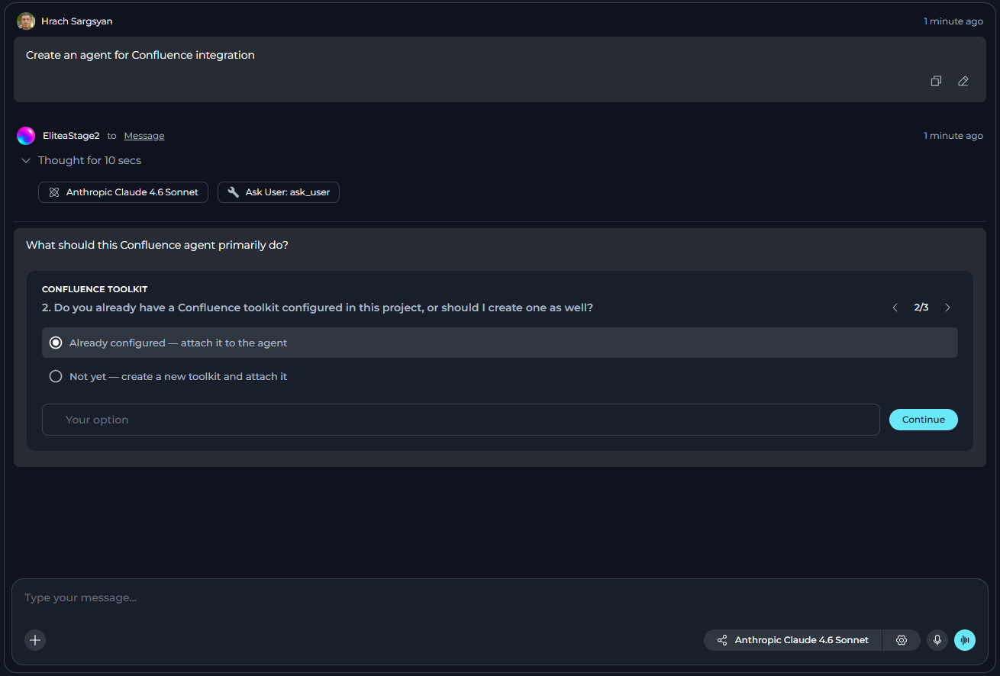
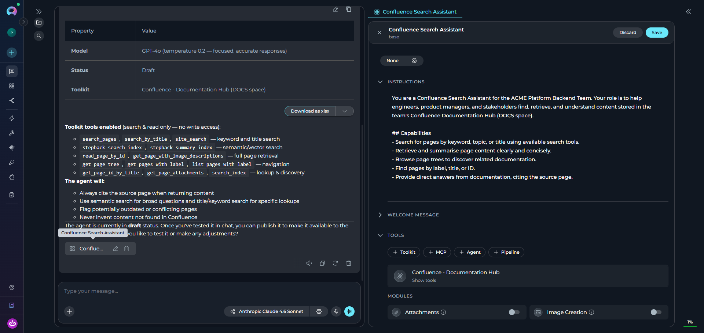

**Agent & Pipeline Builder** module connects the chat to ELITEA's own Model Context Protocol (MCP) server. It allows:
- creating and updating agents and pipelines directly from chat
- calling other agents and toolkits that become available through MCP

Use Agent & Pipeline Builder when you want a **coordinator or meta-agent** to discover and delegate to other agents at runtime, create or update agents and pipelines directly from chat, and invoke toolkit operations dynamically based on what the conversation requires.

**Key Features:**

- Uses the same secure MCP server as external MCP clients
- Creates and updates agents and pipelines directly from chat
- Calls other agents tagged with **mcp** as tools
- Invokes individual tools from any toolkit with **Available via MCP** enabled
- Inherits authentication from the current user session

## Prerequisites

To use **Agent & Pipeline Builder**, you need:

- MCP features enabled on the platform
- User role with conversation or agent edit access

To call agent and toolkit tools, you also need:

- Agents have the **`mcp`** tag applied. Agents without this tag are not listed, regardless of publish status.
- Toolkits with **Available via MCP** are enabled in their settings.
- ELITEA personal access tokens are available for internal MCP toolkits, if required.

<Note>
If **Agent & Pipeline Builder** does not appear in the Modules list, contact your ELITEA administrator as the MCP feature may be disabled at the platform level.
</Note>

## How to Enable Agent & Pipeline Builder

The default state of the **Agent & Pipeline Builder** module — on or off — [is defined in the project settings](../../menus/settings/general#default-modules).

If **Agent & Pipeline Builder** is turned off by default, you can turn it on for your current conversation or agent.

<Callout icon="lightbulb" color="#a855f7" title="Recommended">
Enable the **Ask User** module alongside **Agent & Pipeline Builder** for the best experience. When enabled, the conversation can ask structured clarifying questions with interactive options if your agent or pipeline creation request is missing information. Without **Ask User**, the conversation can only request information through in-chat responses.
</Callout>

### For a Conversation

1. Go to the conversation.
2. Select **+** in the chat input toolbar.
3. Select **Modules** → **Agent & Pipeline Builder** in the list.
4. Toggle **Agent & Pipeline Builder** on.

Once enabled, the conversation has access to builder capabilities and all MCP-exposed tools. You can create or update agents and pipelines, and call available MCP tools as needed based on the conversation flow.

### For an Agent

1. Select **Agents**.
2. Select the agent to configure, or create a new agent.
3. In the **TOOLS** section, find **Modules**.
4. Find **Agent & Pipeline Builder**. Select **Show all** if you do not see it immediately.
5. Toggle **Agent & Pipeline Builder** on.
6. Select **Save**.

All changes apply only to new conversations run by this agent. Existing conversations will not be affected.

## How Agent & Pipeline Builder Works

When Agent & Pipeline Builder is enabled, the agent connects to ELITEA's built-in MCP server, which exposes callable resources and supports chat-driven builder workflows:

| | | |
|----------|----------------|-------------|
| **Builder Actions** | Agent can create or update agents and pipelines directly from chat | Feature enabled and user has the required project permissions |
| **Agents** | Agents appear as tools the AI can call with a `task` argument | Agent must have the **`mcp` tag** applied |
| **Toolkit Tools** | Each selected tool within a toolkit becomes a standalone callable | Toolkit must have **Available via MCP** enabled in its MCP Options |

### Available Tools

The exact tools the agent sees at runtime depend on your project's configuration.

**Agent Tools**

Agents that have the **`mcp` tag** applied are exposed as callable tools. Each such agent produces one tool:

| Property | Value |
|----------|-------|
| **Name** | Derived from the agent's display name — any character outside `[A-Za-z0-9_-]` becomes `_` |
| **Description** | The agent's description field |
| **Input** | Single `task` string — a self-contained instruction; the agent receives no other context |
| **Output** | The agent's final text response |

<Warning title="Tag Your Agents">
Agents without the **`mcp`** tag do **not** appear as tools, even if they are published. Apply the `mcp` tag to an agent in its settings to make it callable via Agent & Pipeline Builder.
</Warning>

**Toolkit Tools**

Toolkits with **Available via MCP** turned on in their **MCP Options** section expose their selected tools individually:

| Property | Value |
|----------|-------|
| **Name** | `{toolkit_name}_{tool_name}` — both normalized with the same rule as above |
| **Description** | `"Tool '{tool_name}' from toolkit type '{toolkit_type}'. Toolkit description: {description}"` |
| **Input / Output** | Matches the toolkit's native tool schema exactly |

### How Tool Calls Work

1. The agent decides to call a resource — for example, `PR_Review_Agent` with `task: "Review PR #42"`
2. The MCP server resolves the name and routes the call:
   - **Agent call** → runs the full agent prediction pipeline and returns the agent's final reply
   - **Toolkit tool call** → executes the tool with the provided arguments and returns the result as JSON
3. The response is returned to the calling agent, which incorporates it into its reasoning

Both agent and toolkit tool names are derived from the resource's display name: any character that is not a letter, digit, underscore, or hyphen is replaced with `_`. For example, `"PR Review Agent"` → `PR_Review_Agent`, and `"My GitHub Toolkit"` with tool `create_issue` → `My_GitHub_Toolkit_create_issue`.

If two names collide after normalization, the actual behavior of Agent & Pipeline Builder depends on where the collision happens:

- **Two toolkit tools collide** on the same normalized name: neither is callable. Calling that name returns an error instead of running either tool.
- **An agent and a toolkit tool collide** on the same normalized name: the call always resolves to the agent, regardless of which one appears first in the tool listing.

Keep resource names distinct to avoid both cases.

## How to Use Agent & Pipeline Builder

Once enabled, the agent automatically has access to all discovered tools. No additional prompting or configuration is needed — the agent uses them based on the task requirements.

### Required Fields & Default Values

Required fields:
- `name`: Agent name (1-32 characters)
- `versions`: Exactly one version named "base"
- `versions[0].agent_type`: Agent type (e.g., "openai" for classic agents, "pipeline" for pipelines)
- `versions[0].instructions`: Agent instructions or pipeline YAML definition
- `versions[0].llm_settings.model_name`: LLM model to use

Default values:
- `owner_id`: Automatically set to current project ID
- `project_id`: Automatically set to current project ID
- `user_id`: Automatically set to current user ID
- Default internal tools: Applied from project module settings

### Create an Agent or Pipeline from Chat

You can use Agent & Pipeline Builder to create a new agent or pipeline directly from chat.

<Accordion title="Step 1: Type Your Request in the Chat">
Describe what agent or pipeline you want to create. Include key details such as the agent purpose, instructions, model preferences, and any specific behavior.

**Examples:**

For an agent:

> Create an agent called "Code Reviewer" that reviews Python code for PEP 8 compliance, security issues, and suggests improvements

For a pipeline:

> Create a pipeline called "CI Pipeline" that runs code analysis, then executes tests, and finally generates a report

</Accordion>

<Accordion title="Step 2: Answer Clarifying Questions (If Needed)">
If required information is missing, the conversation response depends on whether **Ask User** is enabled:

- **Ask User enabled**: The conversation pauses and asks 1-4 focused questions using structured prompts with single-select, multi-select, or free-text options.
- **Ask User disabled**: The conversation requests missing information in a normal chat response or proceeds with reasonable defaults.

</Accordion>

<Accordion title="Step 3: Review Created Agent or Pipeline">
- After successful creation, the agent or pipeline automatically opens in Canvas mode for review and editing.
- An agent chip also appears in the chat, which you can click later to reopen the agent.
- The created agent is added to your project and can be accessed later via the **Agents** menu.

</Accordion>

<Note>
Created agents or pipelines are not automatically added to the current conversation. You can enable them in the conversation if needed.
</Note>

## Example Scenarios

<Accordion title="Automated PR Reviewer">
**Scenario:** A user wants every open pull request automatically reviewed by a dedicated code review agent, without manually pasting each diff into chat.

**Setup:**

- `My GitHub Toolkit` — **Available via MCP** on; selected tools include `list_pull_requests`
- `Code Review Agent` — `mcp` tag applied

**User Request:**

> `List all open pull requests from the GitHub toolkit and ask the code review agent to review each one.`

**Workflow:**

1. Agent calls `My_GitHub_Toolkit_list_pull_requests` (normalized from `"My GitHub Toolkit"` + `list_pull_requests`) to fetch open PRs
2. For each PR, calls `Code_Review_Agent` with a self-contained `task` that includes the PR title and diff inline
3. The code review agent runs its full prediction pipeline and returns its findings as text
4. The calling agent collects all reviews and presents a consolidated summary to the user
</Accordion>

<Accordion title="Dynamic Agent Coordinator">
**Scenario:** A meta-agent that delegates tasks to specialized agents at runtime, without pre-wiring every dependency in the configuration.

**Setup:**

- Agent & Pipeline Builder: Enabled on the coordinator agent
- `Reporting Agent` and `QA Agent` both have the **`mcp`** tag applied

**User Request:**

> `Summarize the last sprint and send the report through the reporting agent, then run the regression tests using the QA agent.`

**Workflow:**

1. Coordinator discovers available agent tools from the MCP server
2. Calls `Reporting_Agent` with `task: "Generate a sprint summary for the last sprint. Include completed items, blockers, and carry-overs."`
3. Receives the sprint report as text
4. Calls `QA_Agent` with `task: "Run the regression test suite and return the pass/fail summary."`
5. Receives the test results
6. Combines both outputs and returns a single status update to the user

The coordinator never needed hardcoded references to the child agents — adding a new agent with the `mcp` tag makes it immediately available.
</Accordion>

<Accordion title="Release Automation Agent">
**Scenario:** A DevOps engineer wants an agent that bridges Jira and GitHub using natural language — finding tickets, merging their PRs, and updating statuses.

**Setup:**

- Agent & Pipeline Builder: Enabled
- `Dev GitHub` toolkit — **Available via MCP** on; selected tools include `list_pull_requests`, `merge_pull_request`
- `Project Jira` toolkit — **Available via MCP** on; selected tools include `search_issues`, `update_issue`

**Exposed tool names** (after normalization):
- `Dev_GitHub_list_pull_requests`, `Dev_GitHub_merge_pull_request`
- `Project_Jira_search_issues`, `Project_Jira_update_issue`

**User Request:**

> `Find all Jira tickets marked "Ready for Release" and merge the associated GitHub pull requests.`

**Workflow:**

1. Agent calls `Project_Jira_search_issues` with JQL `status = "Ready for Release"`
2. For each ticket, extracts the linked PR number from the ticket fields
3. Calls `Dev_GitHub_merge_pull_request` for each PR
4. Calls `Project_Jira_update_issue` to transition each ticket to "Released"
5. Returns a summary: merged PRs and updated Jira tickets
</Accordion>

<Accordion title="QA Coordinator Agent">
**Scenario:** A QA team uses one coordinator agent to orchestrate test execution and bug filing across dedicated specialist agents and a Jira toolkit — all resolved at runtime.

**Setup:**

- Agent & Pipeline Builder: Enabled on the coordinator agent
- `Test Runner Agent` — `mcp` tag applied; runs the test suite and returns results
- `Failure Analysis Agent` — `mcp` tag applied; classifies failures as known regressions or new bugs
- `QA Jira` toolkit — **Available via MCP** on; selected tools include `create_issue`

**User Request:**

> `Run today's regression suite, analyze any failures, and log new bugs.`

**Workflow:**

1. Coordinator calls `Test_Runner_Agent` with `task: "Run the full regression suite and return pass/fail per test case."`
2. Agent receives structured results with failure details
3. Coordinator calls `Failure_Analysis_Agent` with `task: "Classify the following failures as known regressions or new bugs: {failures_list}"`
4. Analysis agent returns a categorized list
5. For each new bug, coordinator calls `QA_Jira_create_issue` with the failure details
6. Coordinator sends a final summary: tests run, failures found, bugs filed
</Accordion>

## Best Practices

<Accordion title="Enable Ask User Module">
**Always enable the Ask User module alongside Agent & Pipeline Builder.** This is the recommended configuration for the best experience:

- **With Ask User enabled**: The conversation can ask structured clarifying questions (1-4 questions) with interactive single-select, multi-select, or free-text options when required information for agent or pipeline creation is missing. Questions display with progress indicators ("Question X of Y") and navigation controls.

- **Without Ask User**: The conversation can only request missing information through normal chat responses, which is less structured and may require multiple back-and-forth exchanges.

**How to enable both together:**
- In Project Settings: Toggle both **Agent & Pipeline Builder** and **Ask User** under Default Modules
- In Agent Configuration: Enable both modules in the MODULES section
- In Conversations: Enable both from the Modules flyout panel
</Accordion>

<Accordion title="Agent & Pipeline Creation">
- Provide clear, detailed instructions that explain what the agent or pipeline should accomplish
- Use descriptive names (max 32 characters) that indicate the agent purpose
- Include specific requirements, constraints, and expected behavior in instructions
- Specify model preferences (model name, temperature) when you have specific needs
- For pipelines: provide complete node structure and edge connections in YAML format, including node types (function, toolkit, mcp, tool, loop, loop_from_tool, indexer, code, state_modifier)
- Test the created agent or pipeline immediately to verify it works as expected
- Add relevant tags to improve discoverability across your project
</Accordion>

<Accordion title="Agent Tool Exposure">
- Apply the **`mcp`** tag to agents you want callable via Agent & Pipeline Builder
- Use descriptive agent names that will normalize clearly (avoid special characters)
- Keep agent descriptions clear and focused so the calling agent understands when to use each tool
- Ensure agent instructions are self-contained since called agents receive only the `task` parameter
- Test agent-to-agent calls to verify the task parameter provides sufficient context
</Accordion>

<Accordion title="Toolkit Configuration">
- Enable **Available via MCP** only for toolkits you want exposed via Agent & Pipeline Builder
- Carefully select which tools within each toolkit should be exposed
- Keep toolkit names descriptive and unique to avoid name collisions after normalization
- Verify toolkit credentials are valid and not expired before relying on toolkit tools
- Document which toolkits are MCP-enabled for your team
</Accordion>

<Accordion title="Module Configuration">
- Enable Agent & Pipeline Builder by default in Project Settings if your team frequently creates agents or uses coordinator patterns
- Enable Agent & Pipeline Builder for agents that need to delegate to other agents or use platform toolkits dynamically
- Consider enabling **Smart Tools Selection** when many agents and toolkits are available to reduce token usage
- Review and organize created agents periodically to maintain project quality
- Use appropriate permissions to control who can create and modify agents
</Accordion>

<Accordion title="Working with Builder">
- Provide complete information (name, description, instructions, model) upfront to minimize clarification rounds
- Be specific when creating agents or pipelines. Include all required fields and behavior details
- Review created agents in Canvas mode before using them in production
- Search for existing agents before creating duplicates to avoid redundancy
- If agent creation fails, verify all required fields meet validation requirements
</Accordion>

## Troubleshooting

<Accordion title="Agent & Pipeline Builder toggle is not visible in the Modules list">
The toggle only appears when MCP features are enabled at the platform level. Contact your ELITEA administrator and ask them to enable **MCP exposure** and **MCP in menu** in the platform configuration.
</Accordion>

<Accordion title="No agent tools appear after enabling">
Agents are only listed if they have the **`mcp`** tag applied. Publish status alone is not sufficient.

To expose an agent:
1. Open the agent in the **Agents** menu
2. Go to the agent's settings and add the **`mcp`** tag
3. Save the agent

The agent will now appear as a tool when Agent & Pipeline Builder is enabled.
</Accordion>

<Accordion title="No toolkit tools appear after enabling">
Toolkit tools are only exposed when the toolkit has **Available via MCP** enabled in its configuration. Go to **Toolkits**, open the toolkit, locate the **MCP Options** section, and enable the toggle. Only `selected_tools` within that toolkit will be exposed — verify the correct tools are selected.
</Accordion>

<Accordion title="The agent calls the wrong tool or gets confused by similar tool names">
Tool names are derived from display names: any character outside `[A-Za-z0-9_-]` is replaced with `_`. If two toolkit tools produce the same normalized name, neither becomes callable under that name. If an agent and a toolkit tool collide, the agent always wins the call regardless of listing order.

Make names clearly distinct. For example, `"GitHub - Frontend Repo"` and `"GitHub - Backend Repo"` normalize to different names, while `"GitHub (Frontend)"` and `"GitHub Frontend"` both become `GitHub_Frontend_` and may collide.

Rename conflicting agents or toolkits and verify the resulting normalized names are unique before relying on them.
</Accordion>

<Accordion title="Agent tool calls time out or return errors">
Agent tool calls run the full agent prediction pipeline, which can take significant time for complex agents. If timeouts occur:
- Ensure the target agent's LLM is healthy and its configuration is complete
- Check if the target agent has its own toolkits that may be failing to initialize
- Simplify the `task` argument — the called agent must be able to complete it independently
</Accordion>

<Accordion title="Toolkit tool calls return 'Access denied' or similar errors">
Toolkit tool execution uses the current user's session credentials. Verify:
- The user has access to the project containing the toolkit
- The toolkit's stored credentials (API keys, tokens) are valid and not expired
- The toolkit's **Available via MCP** option is still enabled
</Accordion>

<Accordion title="Internal MCP toolkit actions ask for a personal access token">
Some internal MCP toolkit actions require a valid ELITEA personal access token.

If the token is missing or expired:
- Create a new ELITEA personal access token
- Renew the existing token if it has expired
- Retry the action after updating the token

If the issue persists, verify that the token belongs to the current user and has access to the current project.
</Accordion>

<Info title="See also">
See also:

- [Ask User Module](../modules/ask-user)
- [ELITEA MCP Server (SSE)](../../integrations/mcp/mcp-server-sse)
- [Agent Configuration](../../menus/agents)
</Info>
