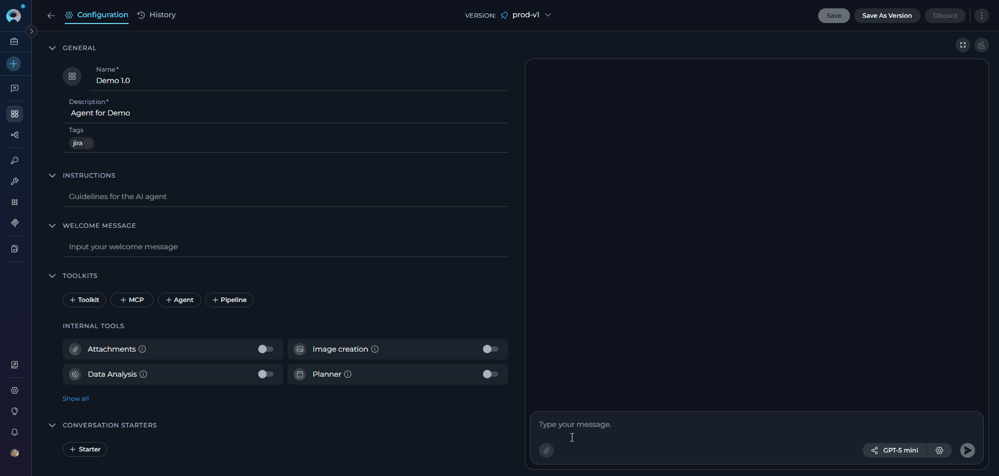
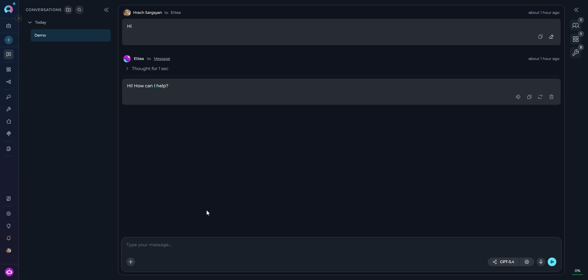
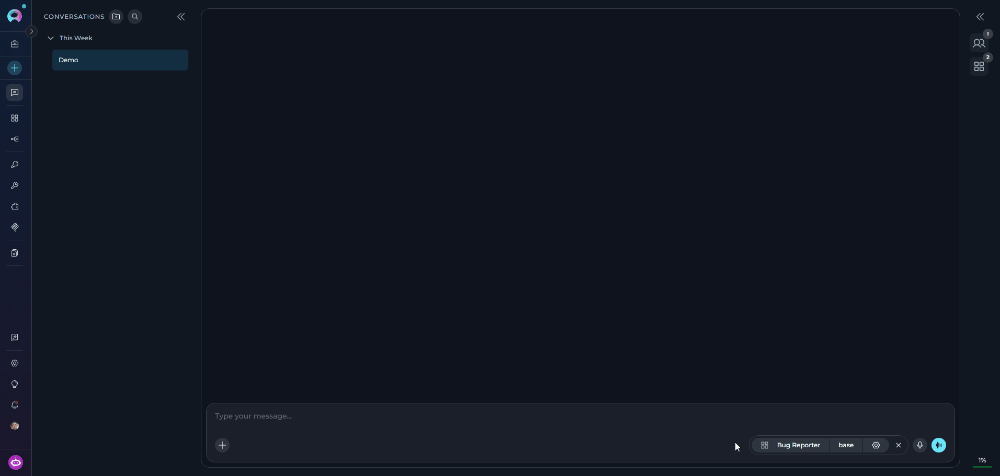
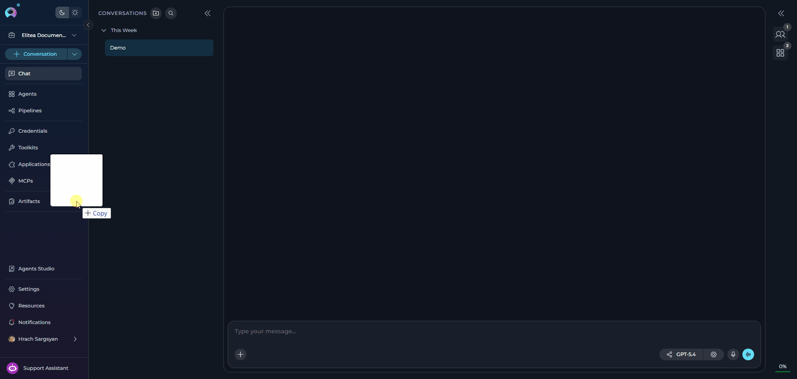
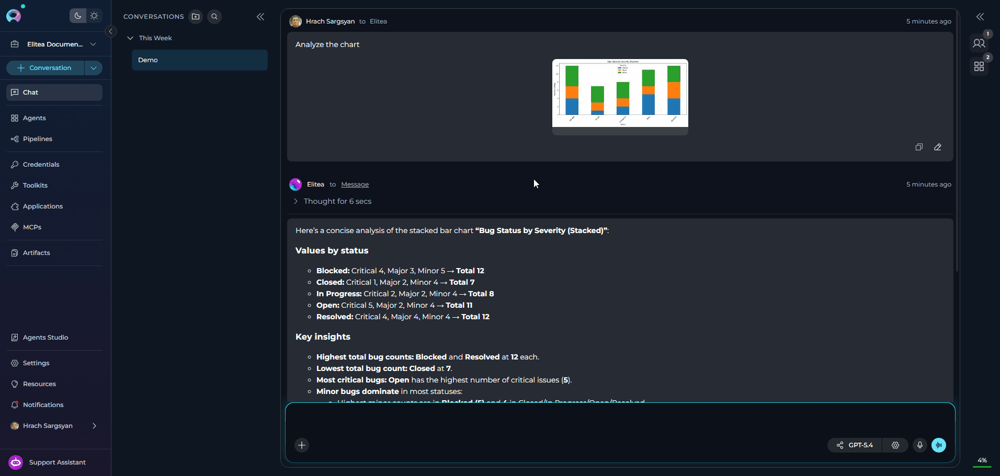
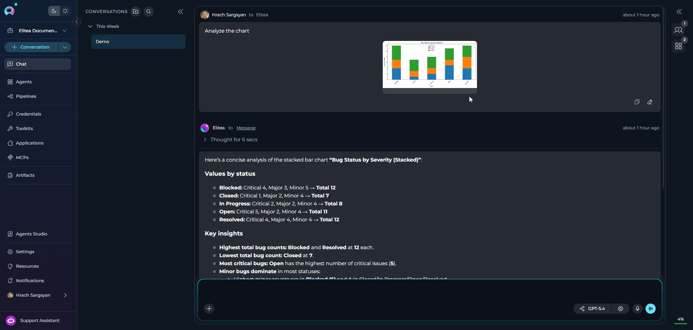
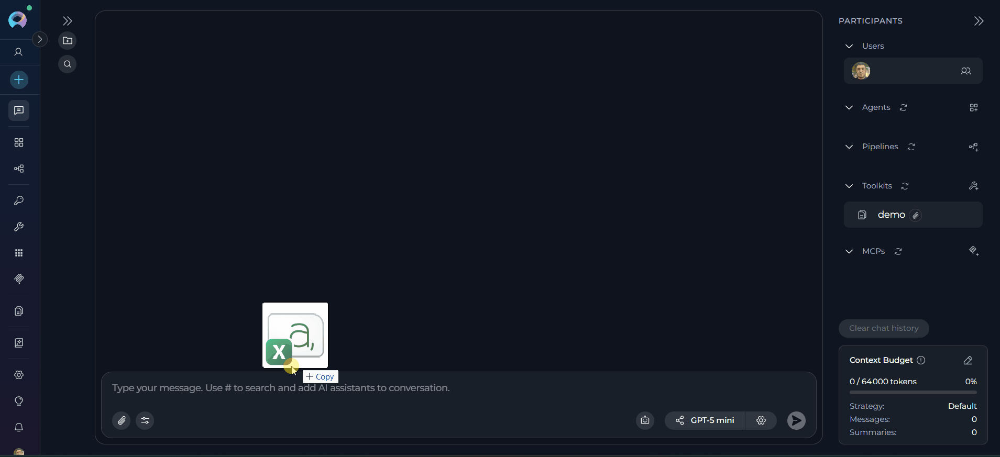

## Overview

**Key Capabilities:**

- **Image Analysis**: Upload images for visual analysis, OCR, content extraction, and AI-powered interpretation
- **Document Processing**: Attach documents for content indexing, semantic search, and information retrieval
- **Data Files**: Upload CSV, JSON, and other data formats for analysis and processing
- **Multiple Upload Methods**: Click to browse, drag-and-drop, or paste from clipboard
- **Centralized Storage**: All attachments stored in Artifact buckets with configurable retention policies

---

## How Attachments Work

The attachment functionality is integrated with the **Artifact Toolkit**.

*   **Storage:** Every file you attach is automatically uploaded and stored in an Artifact bucket. The backend always uses the default `attachments` bucket — no manual Artifact Toolkit configuration is required.
*   **Access:** This allows the AI agent to access the file for analysis and also provides a centralized location for you to manage these files via the **Artifacts** section of the platform.
*   **Retention:** Files are subject to the retention policy of the bucket they are stored in. By default, new buckets have a retention period of 30 days, after which files are automatically deleted. Retention period can be changed manually.

For detailed information about bucket management and retention policies, see the [Artifacts Documentation](../../menus/artifacts).

---

## Prerequisites

Before using attachments, ensure you have:

- **Permission Level**: Editor or Admin role within the project (required for Agent configuration)
- **Active Conversation**: An existing conversation or agent

<Info title="User Permissions">
Any user with conversation access can attach files once attachments are enabled. Editor or Admin permissions are only required for enabling attachments on Agents.
</Info>

---

## Enabling Attachments

Attachments must be explicitly enabled before use.

### Enable Attachments for Agents

Configure attachment capabilities at the Agent level to enable file uploads in all conversations using that agent.

1. Navigate to **Agents** from the main menu
2. Select the agent to configure
3. On the **Configuration** tab, locate the **Allow attachments** toggle in **Modules** (disabled by default)
4. Click the toggle to enable attachments
5. Save the agent

**Result:** The `Attachments` module is added to the agent. The backend automatically provisions storage using the default `attachments` bucket — no additional toolkit configuration is required. When using this agent in a conversation, **Attach Files** becomes available in the **`+`** menu of the message input area.

### Attach Files in a Conversation

Upload files directly within an active chat session without configuring the agent.

1. Open a new or existing conversation
2. Click the **`+`** button in the message input toolbar
3. Click **Attach Files** at the top of the menu
4. The file browser opens — select and confirm your files

**Result:** Attachments are immediately available. No additional setup is required.

**Upload options**

<Tabs>
  <Tab title="Drag and Drop">
    1. Select files from your file explorer
    2. Drag files directly into the message input area
    3. Release to attach files
  </Tab>
  <Tab title="Paste from Clipboard">
    1. Copy an image to your clipboard (Ctrl+C or Cmd+C)
    2. Click inside the message input area
    3. Paste the image (Ctrl+V or Cmd+V) to attach
  </Tab>
</Tabs>

<Info title="Duplicate File Handling">
If you upload a file with the same name as an existing attachment, it is automatically renamed by appending a timestamp and file size (e.g., `image_20251106_143022_1.50KB.png`). No error is shown and both files are preserved.
</Info>

### Using Agents with Attachments in Conversations

The availability of **Attach Files** in the **`+`** menu is determined by the currently active participant.

- If the active agent or pipeline has **Allow attachments** enabled, **Attach Files** is active in the `+` menu
- If you switch to an agent or pipeline without attachments enabled, **Attach Files** is disabled and shows the tooltip: *"Attachments aren't available for the selected agent or pipeline."*
- In direct LLM or dummy conversations (no agent selected), **Attach Files** is always active

     

---

## Using Attachments in Conversations

When attachments are available — either because you are in a direct LLM chat or using an agent/pipeline with **Allow attachments** enabled — the **`+`** button in the message input toolbar gives access to **Attach Files**.

**Send Message with Attachments**

1. After attaching files, thumbnails appear above the message input area
2. **Type a text prompt** describing what you want the AI to do (required)
3. Click the **Send** button

     

<Info title="Text Required">
The Send button remains disabled until you enter text. A text prompt provides context for the AI to understand how to process your attachments. When sent, each file is automatically uploaded to the default `attachments` Artifact bucket and can be viewed and managed from the **Artifacts** section in the main navigation.
</Info>

### Manage Attachments in Chat

**View Attachments**

- Sent attachments display as clickable thumbnails in the chat history
- Click any thumbnail to view the full-size image or preview the file

**Download or Delete Attachments**

1. Hover over any attachment thumbnail in the chat
2. Two icons appear:
      - **Download icon**: Save the file to your local system
      - **Delete icon** (trash can): Remove the attachment

     

### Delete Attachments

When clicking the delete (trash can) icon, a confirmation dialog provides two deletion options:

**Option 1: Delete from Chat Only** (default)

- Removes the thumbnail from the conversation
- Original file remains in the Artifact bucket
- File remains accessible via the Artifacts menu

**Option 2: Delete from Chat and Storage**

- Check the box: **"Also delete from attachment storage"**
- Removes the thumbnail from the conversation
- **Permanently deletes** the file from the Artifact bucket
- File cannot be recovered

<Warning title="Permanent Deletion">
When "Also delete from attachment storage" is checked, the file is permanently deleted from storage and cannot be recovered. Use this option carefully.
</Warning>

---

## Working with Non-Image Files

Non-image file attachments follow a different processing workflow than images. While images are analyzed directly by the LLM's vision capabilities, other file types are indexed for semantic search and retrieval.

**Processing Workflow:**

1. **Upload**: File is uploaded to the default `attachments` bucket
2. **Indexing**: File content is automatically extracted and indexed into a vector database
3. **Retrieval**: When you query, relevant content is retrieved through semantic search

**Key Differences from Images:**

| Feature | Images | Non-Image Files |
|---------|--------|-----------------|
| Processing | Sent directly to LLM | Indexed in vector DB |
| Analysis | Real-time vision analysis | Semantic search retrieval |
| Query type | Visual analysis | Content-based search |
| Token usage | Per image | Per retrieved chunk |

<Tip title="Specificity Improves Results">
Since content is retrieved through semantic search, specific queries that describe the information you're looking for will yield better results than general summarization requests.
</Tip>

**Shared Collection Behavior**

All non-image attachments are indexed into the same storage collection in the default `attachments` bucket.

**Implications:**

- Search results may include content from previously attached files (if using the same toolkit)
- Queries might retrieve information from multiple uploaded files
- Results may include content you didn't intend to search

**Recommendations:**

1. **Be specific in queries** to avoid retrieving irrelevant content from other files
2. **Include context** in queries to help narrow down relevant content
3. **Reference filenames** when querying if you need content from a specific file

**Usage Tips** 

<Accordion title="Structure your queries effectively">
Instead of asking "What does the file say?", ask "What are the recommended security practices mentioned in the uploaded security guidelines?"
</Accordion>

<Accordion title="Include context in your prompt">
Reference the file type or subject: "In the uploaded project plan, what are the Q2 milestones?"
</Accordion>

<Accordion title="Query for specific sections">
Ask for particular information: "Find all mentions of API rate limits in the uploaded documentation"
</Accordion>

<Accordion title="Use keywords from your files">
If you know specific terms appear in your files, include them in queries to improve retrieval accuracy
</Accordion>

---

## Supported File Types and Limits

**Image Formats**

Raster images are sent directly to the LLM for visual analysis. Supported formats include:

| Extension | Notes |
|-----------|-------|
| `.jpg` / `.jpeg` | Standard compressed image format |
| `.png` | Lossless compression with transparency |
| `.gif` | First frame only for animated GIFs |
| `.bmp` | Uncompressed raster format |
| `.webp` | Modern compressed format |
| `.tiff` / `.tif` | High-quality raster format |
| `.ico` | Windows icon format |
| `.apng` | Animated PNG format |
| `.avif` | Next-gen compressed format |
| `.svg` | Processed as a document (see note below) |

<Info title="Image Processing">
Raster images are sent directly to the LLM's vision capabilities for analysis. Animated GIFs are processed using only the first frame.

**SVG files** are processed as documents, not as images — they are indexed and retrieved via the document pipeline rather than sent inline to the LLM's vision input. SVG files are also exempt from the per-image 5 MB size limit and do not count toward the image attachment count.
</Info>

**Documents & Data Files**

Documents and data files are indexed into a vector database for semantic search and retrieval. Supported types include:

| Extension | Category |
|-----------|----------|
| `.pdf` | Document |
| `.doc` / `.docx` | Document |
| `.ppt` / `.pptx` | Presentation |
| `.xls` / `.xlsx` | Spreadsheet |
| `.txt` | Text |
| `.md` | Text |
| `.csv` | Data |
| `.json` | Data |
| `.yaml` / `.yml` | Data |
| `.xml` | Data |

**Programming & Code Files**

Source code files are indexed and their content is made available for AI analysis. Supported languages include:

| Extension | Language |
|-----------|----------|
| `.py` | Python |
| `.js` | JavaScript |
| `.ts` | TypeScript |
| `.java` | Java |
| `.cpp` / `.c` / `.h` | C / C++ |
| `.cs` | C# |
| `.go` | Go |
| `.rb` | Ruby |
| `.php` | PHP |
| `.swift` | Swift |
| `.kt` | Kotlin |
| `.rs` | Rust |
| `.html` | HTML |
| `.css` | CSS |
| `.sql` | SQL |
| `.sh` | Shell |

<Info title="Programming File Support">
You can attach source code files directly to a conversation. The AI reads and analyzes the full code content — enabling code review, bug detection, refactoring suggestions, explanations, and more — without requiring any copy-paste.
</Info>

<Info title="File Types and Processing">
Supported types are configured dynamically per ELITEA deployment — unsupported files are rejected with an error listing allowed extensions. Unlike images, non-image files are indexed into a vector database and retrieved via semantic search rather than sent directly to the LLM.
</Info>

**File Size and Quantity Limits**

| Limit | Default Value | Notes |
|-------|---------------|-------|
| Maximum attachments per message | 10 files | Applies to all file types including SVG |
| Maximum total size per message | 150 MB | Combined size of all attachments |
| Maximum individual file size | 150 MB | Applies to any single file |
| Maximum image attachments per message | 10 images | SVG files are exempt and do not count toward this limit |
| Maximum individual image size | 5 MB | SVG files are not subject to this limit |

<Info title="Limits and Validation">
All limits are configurable per ELITEA deployment — the values above are defaults. Raster images exceeding 5 MB are rejected client-side before sending. SVG files are exempt from the image size limit and the image count limit.
</Info>

---

## FAQ

<Accordion title="Where are my attached files stored?">
All attachments are stored in the default `attachments` bucket. You can view and manage these files from the **Artifacts** menu in the main navigation.
</Accordion>

<Accordion title="How long are files stored?">
By default, new Artifact buckets have a 30-day retention period. Files older than the retention period are automatically deleted. You can view and modify retention periods from the **Artifacts** page.
</Accordion>

<Accordion title="Can I use attachments with multiple agents in one conversation?">
Yes. In conversations, all attachments are saved to the default `attachments` bucket. All agents participating in that conversation can access the chat history, including attachments. Which agents can process attachments depends on their individual configuration — only agents with **Allow attachments** enabled can actively use attached files.
</Accordion>

<Accordion title="Can I recover a deleted attachment?">
No. Deletion is permanent. If you delete a file from the Artifacts bucket or use the "Also delete from attachment storage" option in chat, it cannot be recovered.
</Accordion>

<Accordion title="Why can't I send a message with only an attachment and no text?">
The system requires a text prompt to provide context about how the AI should interpret or process the attachment(s). The Send button activates only after you enter text.
</Accordion>

<Accordion title="How many tokens does an image consume?">
Token consumption varies by LLM provider:

- **Claude (Anthropic)**: Fixed number of tokens per image (consult model documentation)
- **GPT (OpenAI)**: Varies based on image size and resolution

Check your LLM provider's documentation for specific token costs.
</Accordion>

<Accordion title="What happens when I attach the same filename twice?">
Duplicate filenames are handled automatically. The system renames the new file by appending a timestamp and file size (e.g., `image_20251106_143022_1.50KB.png`). Both files are preserved in the bucket with distinct names — no error is shown and no data is overwritten.
</Accordion>

<Accordion title="Can I use attachments in Pipeline conversations?">
Yes. Pipelines have the **Allow attachments** toggle in **Modules**. When enabled, the toggle adds `attachments` to the pipeline's modules and also adds an `input_attachments` state variable to the pipeline YAML. Once enabled, the paperclip icon becomes active when using that pipeline in a conversation.
</Accordion>

---

## Troubleshooting

<Accordion title="File size exceeds image limit">
**Error:** Image is rejected when attaching

**Cause:** The image exceeds the 5 MB per-image size limit (SVG files are exempt).

**Solution:** 

1. Compress or resize the image below 5 MB
2. For SVG files, the size limit does not apply
3. Re-attach the file
</Accordion>

<Accordion title="Attach Files is disabled or shows a tooltip in the + menu">
**Symptom:** Clicking `+` shows **Attach Files** with the tooltip *"Attachments aren't available for the selected agent or pipeline."*

**Cause:** The active agent or pipeline does not have **Allow attachments** enabled.

**Solution:**

1. Enable **Allow attachments** on the agent via its **Configuration** tab (see Enabling Attachments above)
2. Verify you have the required permissions to edit the agent configuration
3. Contact a project administrator if permissions are insufficient
</Accordion>

<Accordion title="Unexpected filename in chat after upload">
**Symptom:** Attached file appears with a different name than the original (e.g., `image_20251106_143022_1.50KB.png`)

**Cause:** A file with the same name was already attached. The system automatically renames duplicates with a timestamp and file size suffix to avoid overwriting existing files.

**Solution:** This is expected behavior. Both files are preserved. Use unique filenames if you need to distinguish uploads easily.
</Accordion>

<Accordion title="Attachment visible in chat but not found in Artifacts">
**Symptom:** Thumbnail appears in chat, but file is missing from Artifacts menu

**Possible Causes:**

- File was deleted directly from the Artifacts page
- Retention period expired and file was auto-deleted

**Solution:** Files deleted from Artifacts cannot be recovered. Re-upload if needed.
</Accordion>

<Accordion title="Cannot delete attachment with Also delete from attachment storage option">
**Error:** Deletion fails when "Also delete from attachment storage" is checked

**Possible Causes:**

- File was already deleted from the bucket via the Artifacts page

**Solution:**

1. Uncheck "Also delete from attachment storage"
2. Delete from chat only
</Accordion>

<Accordion title="Maximum attachment limit reached">
**Error:** Cannot attach more files to a message

**Cause:** Attempting to attach more than the maximum number of files per message (default: 10)

**Solution:**

1. Remove some attachments to stay within the limit
2. Send multiple messages if needed
3. Combine related content into fewer files when possible
</Accordion>

<Accordion title="Maximum image attachment limit reached">
**Error:** Toast warning — `Maximum N image attachments allowed`

**Cause:** The number of non-SVG images attached would exceed the image attachment limit (default: 10). SVG files do not count toward this limit because they are processed as documents.

**Solution:**

1. Remove some image attachments
2. Send images across multiple messages
</Accordion>

<Accordion title="Total message size exceeds limit">
**Error:** Message fails to send due to total attachment size

**Cause:** Combined size of all attachments exceeds 150 MB

**Solution:**

1. Reduce number of attachments
2. Compress images or files
3. Send multiple messages with fewer attachments each
</Accordion>

---

<Info title="Related Documentation">
For more information about related features and configurations:

- **[Data Analysis](./data-analysis-internal-tool)** - Analyze CSV and data files with Pandas capabilities
- **[Artifacts Menu](../../menus/artifacts)** - Manage buckets, retention policies, and file storage
- **[Agent Configuration](../../menus/agents)** - Configure agents with attachment support
- **[Chat Functionality](./how-to-use-chat-functionality)** - General chat features and usage
- **[Python Sandbox](./python-sandbox-internal-tool)** - Execute custom Python code with file access
</Info>