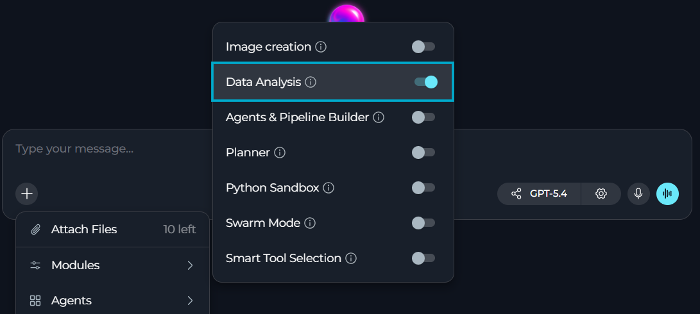
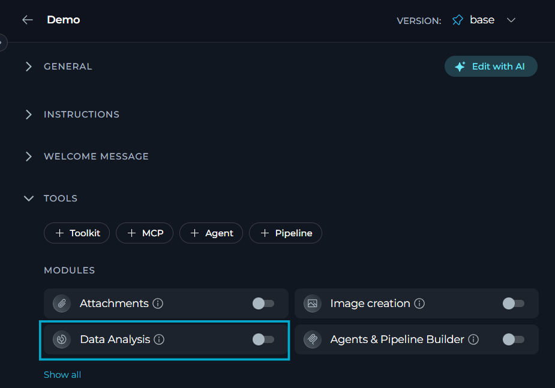
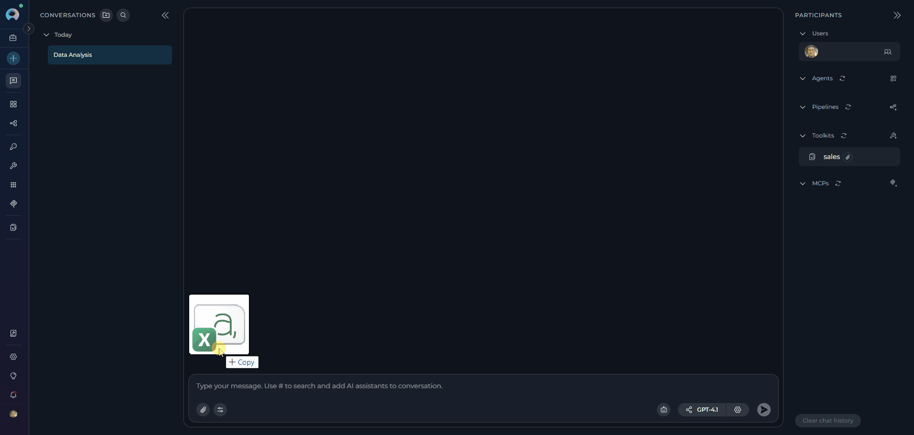
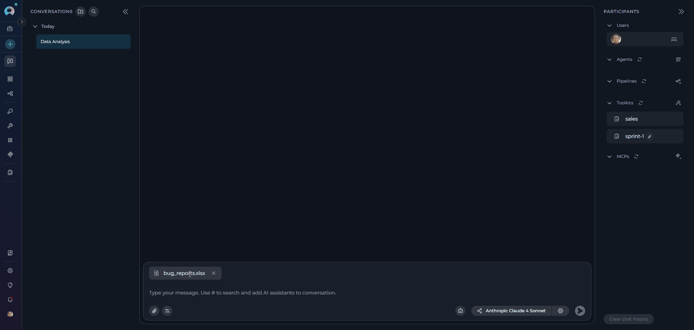
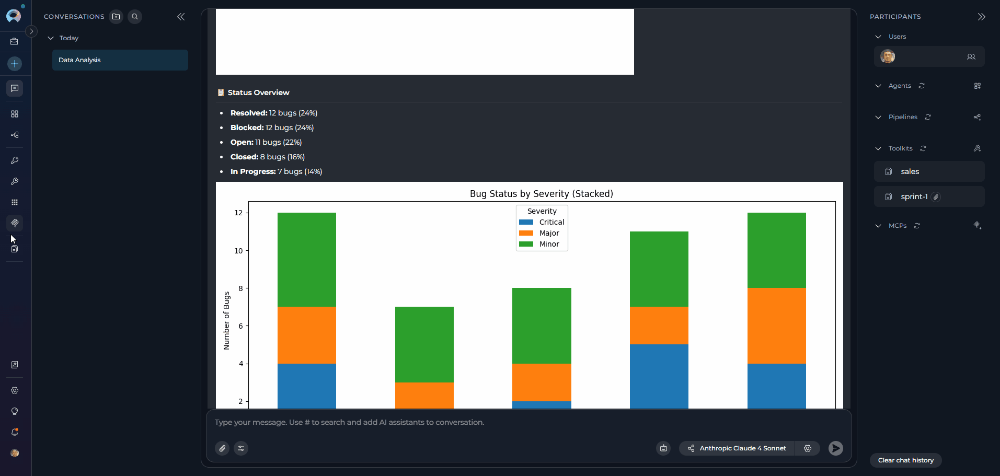

<Warning title="Migration Required: Pandas Toolkit Deprecated">
Starting with release 2.0.0 B2, the legacy **Pandas** toolkit has been deprecated and replaced by the **Data Analysis** module. Existing Pandas toolkits are disabled and no longer functional.

**Action Required:** Users must migrate to the Data Analysis module available in chat conversations and agents. See the [Pandas Toolkit Migration Guide](../../migration/v2.0.1/pandas-toolkit-migration) for step-by-step migration instructions.
</Warning>

**Data Analysis** module provides powerful Pandas-based data analysis capabilities directly within ELITEA chats. This module enables seamless data processing and analysis without separate configurations, making it easy to work with uploaded files using natural language queries.

**Key Features:**

- **Direct Integration:** Available in chats and agents
- **Natural Language Processing:** Use plain English to request data analysis operations
- **File-Based Analysis:** Works with files uploaded directly to conversations (CSV, Excel, and other tabular formats)
- **Automated Processing:** Intelligent file format detection and data analysis
- **Chart Generation:** Automatic creation of visualizations with downloadable results

---

## Prerequisites

- **Permission Level**: User role with chat edit access
- **Chat**: An active chat or agent configuration

<Info title="Important">
The Data Analysis module must be explicitly enabled it can be used in a chat. It is hidden from the regular toolkit menu and exposed only through the **Modules** configuration.
</Info>

---

## How to Enable Data Analysis

### In Chat

Enable the Data Analysis module for ad-hoc data analysis in conversations.

1. Go to your chat.
2. In the chat toolbar, select **+**.
3. Select **Modules** → **Data Analysis** in the list.
4. Toggle **Data Analysis** on to enable it.



<Tip title="Quick Access">
The module configuration persists for the duration of your chat session. You can toggle Data Analysis on/off at any time.
</Tip>

---

### For Agents

You can configure Data Analysis as part of an agent's default configuration.

1. Open the agent you want to configure (or create and opena new agent).
2. Scroll down to **TOOLS**.
3. In **TOOLS**, find **MODULES**.
4. Find **Data Analysis**. If it is not immediately visible, select **Show all** to see the full list of modules.
5. Toggle **Data Analysis** on.
6. Select **Save**.
7. New conversations created with this agent will have Data Analysis enabled by default.

     

<Info title="Agent vs Chat Settings">
- **Agent Configuration**: Sets the default state for all new chats with that agent
- **Chat Configuration**: Overrides the agent's default for that specific chat session
- Changes to agent configuration do not affect existing chats
</Info>
---

## How to Use Data Analysis

Once enabled, the Data Analysis module allows you to perform comprehensive data analysis directly in chat using natural language commands. Simply upload your data files and request analysis operations in plain English.

### How It Works

1. **Upload Data:** Upload CSV, Excel, or other data files to your chat
2. **Request Analysis:** Ask the assistant to perform analysis using natural language
3. **Get Results:** Receive summaries, transformations, charts, and downloadable files

**Available Operations**

- **Data Summaries:** Descriptive statistics, data profiling, and overview reports
- **Data Filtering:** Row and column filtering based on conditions
- **Transformations:** Data cleaning, column operations, and restructuring
- **Aggregation:** Grouping, totals, averages, and statistical calculations
- **Visualization:** Automatic chart generation (bar charts, line graphs, histograms, etc.)
- **Export:** Save transformed data as downloadable files

<Info title="Important Notes">
- Always upload your data file to the chat before requesting analysis
- For very large datasets (>100MB) or complex custom operations, consider using the Python Sandbox instead
</Info>

---

### Example Workflows


These examples show typical workflows using the Data Analysis module.

Example 1 — Natural language data summary

1. Open the chat and click **+**.
2. Check that the Data Analysis module is enabled.
3. Upload a small sample file (CSV) and ask the assistant to return a summary.
4. Ask the assistant:

```
Please show summary statistics for `sales_data.csv` and the top 5 rows.
```

What happens: the assistant indexes the uploaded data first, then performs the requested analysis on the indexed data.




Example 2 — Summarize bug reports and highlight hotspots

1. Check that the Data Analysis module is enabled and upload `bug_reports.xlsx`.
2. Ask the assistant:

```
Summarize Sprint 1 bug reports in `bug_reports.csv`: total count, trend over time, top 3 modules by number of reports, and recommended priorities for fixes.
```

What happens: the assistant indexes the uploaded data first, then performs the requested analysis. If a chart is helpful (for example a histogram of sales or a time series), the assistant will generate one or more charts and save each chart as an image file in chat.



**Generated files**


---

## Best Practices

<Accordion title="Keep dataset size reasonable">
Upload moderately sized files for interactive analysis. Very large datasets may cause timeouts or higher latency. Consider using Python Sandbox for datasets larger than 100MB.
</Accordion>

<Accordion title="Prefer common file formats">
Use widely supported formats like CSV, Excel for best compatibility. These formats work reliably across different systems.
</Accordion>

<Accordion title="Be explicit about outputs">
When you need a specific output (for example: a downloadable CSV of filtered rows, an aggregated table, or a PNG chart), state it clearly in your request: "Save filtered rows as CSV" or "Generate a time-series chart and export as PNG".
</Accordion>

<Accordion title="Expect saved files for charts and exports">
Charts and exported files are saved to your chat. The assistant will provide links to view or download these files. Charts are saved as PNG files with auto-generated UUID filenames.
</Accordion>

<Accordion title="Small iterative steps">
Break complex analyses into smaller steps (load → inspect → filter → aggregate → visualize). This reduces errors and makes results easier to validate.
</Accordion>

<Accordion title="Be precise with column names and formats">
Refer to column names exactly as they appear in your dataset and provide example values when helpful (for dates, currencies, or categories).
</Accordion>

<Accordion title="Prefer reproducible transformations">
If you expect to re-run the same workflow, ask the assistant to "save transformed data" and include the intended filename. This makes it easy to re-open or share results later.
</Accordion>

<Accordion title="Use Python Sandbox for custom code">
For advanced custom logic, very large datasets, or specialized operations, enable the Python sandbox and provide code snippets directly.
</Accordion>

<Accordion title="Watch output size">
Requests that ask for extensive detailed outputs may be truncated. Prefer summaries or downloadable files for large results.
</Accordion>

<Accordion title="Validate sensitive data handling">
Avoid uploading highly sensitive data if you are unsure about retention policies. When in doubt, remove or anonymize personal information before uploading.
</Accordion>

<Accordion title="Handle encoding issues">
For CSV files with special characters, ensure UTF-8 encoding. UTF-8 files work most reliably.
</Accordion>

<Accordion title="Use descriptive queries">
Provide clear, specific analysis requests. Instead of "analyze this data", try "Calculate monthly sales totals and create a bar chart showing top 5 products by revenue".
</Accordion>


## Troubleshooting

<Accordion title="Data Analysis requires file access">
**Possible causes:**

* Data Analysis module not enabled in chat
* Chat configuration issue

**Solution:**

1. Enable Data Analysis in **Modules** for the chat
2. Refresh the chat and re-enable the tool if needed
</Accordion>

<Accordion title="File format not recognized or read errors">
**Possible causes:**

* Unsupported file format uploaded
* Corrupted or malformed data file
* File encoding issues
* Large file causing read timeouts

**Solution:**

1. Ensure file is in a supported format (CSV, Excel, Parquet, or other common tabular formats)
2. Check file integrity and try re-uploading a clean version
3. Convert file to UTF-8 encoding if needed
4. For large files, consider using Python Sandbox instead
</Accordion>

<Accordion title="No Data Analysis option in UI">
**Possible causes:**

* Insufficient user permissions
* **Modules** are not accessible
* **Modules** are hidden because no tools pass the availability filter
* UI configuration issue

**Solution:**

1. Confirm you have chat edit access permissions.
2. Check that **Modules** are visible — the icon is hidden entirely when no modules are available for the project.
3. Check that Data Analysis appears in the list.
4. Refresh the page and try accessing the popup again.
5. If the icon is missing, contact your project administrator to confirm modules are enabled for the project.
</Accordion>

<Accordion title="Data Analysis requests timeout or fail">
**Possible causes:**

* Very large datasets causing processing delays
* Complex analysis requests
* Network connectivity issues

**Solution:**

1. Reduce dataset size or use smaller sample files for testing
2. Break complex requests into smaller iterative steps
3. Prefer aggregated summaries over detailed outputs
4. Check network connection and retry the request
5. For very large data, consider enabling Python Sandbox instead
</Accordion>

<Accordion title="Charts or exported files not generated">
**Possible causes:**

* Chart generation failed due to data issues
* File saving permissions issue
* Invalid filenames

**Solution:**

1. Verify data is suitable for the requested chart type
2. Check that file saving is working
3. Use valid filenames without special characters
4. Try simpler chart types first
5. Request download links explicitly in your prompt
</Accordion>

<Accordion title="Code generation fails or produces errors">
**Possible causes:**

* Ambiguous or overly complex queries
* Column names with special characters
* Data type mismatches

**Solution:**

1. Use clear, specific analysis requests with exact column names
2. Break complex queries into simpler steps
3. Provide example values for date formats, categories, etc.
4. Try rephrasing the query if it fails
5. Check for error messages and adjust accordingly
</Accordion>

<Accordion title="Memory or performance issues">
**Possible causes:**

* Loading very large datasets
* Complex operations on big datasets
* Multiple concurrent requests
* Insufficient system resources

**Solution:**

1. Use smaller sample datasets for initial testing
2. Consider using Python Sandbox for memory-intensive operations
3. Close other conversations to free up resources
4. Optimize queries to use less memory
5. Monitor system resource usage
</Accordion>

---

<Info title="Additional Resources">
* **[Pandas Toolkit Migration Guide](../../migration/v2.0.1/pandas-toolkit-migration)** - Complete migration guide from legacy Pandas toolkit
* **[Agent Configuration](../../menus/agents)** - Setting up agents with tools
* **[Chat Functionality](./how-to-use-chat-functionality)** - General chat features and usage
* **[Python Sandbox](./python-sandbox-internal-tool)** - Python Sandbox overview
* **[Conversation Management](../../menus/chat)** - Managing conversations and settings
</Info>
