---
title: "Create and Edit Agents from Canvas"
sidebarTitle: "Agents from Canvas"
description: "Create, configure, and update agents directly from Canvas without leaving the conversation."
---

## Agent Canvas Feature: Visual Agent Management

The **Agent Canvas** interface in ELITEA serves as an integrated agent management system accessible directly from the chat interface. This feature enables you to create, configure, and manage AI agents without leaving your conversation context, streamlining your development workflow.

<CardGroup cols={3}>
  <Card title="Integrated Chat Experience" icon="comments">
    Access agent management directly from the PARTICIPANTS section in chat, maintaining conversation context while managing AI assistants.
  </Card>
  <Card title="Real-time Validation" icon="circle-check">
    Configuration fields are validated in real-time, ensuring proper setup before agent creation.
  </Card>
  <Card title="Instant Integration" icon="bolt">
    Created agents are immediately available for use in conversations and can be added to the PARTICIPANTS section.
  </Card>
  <Card title="Advanced Model Configuration" icon="sliders">
    Integration with ELITEA's LLM model management system for comprehensive AI model selection and fine-tuning.
  </Card>
  <Card title="Internal Tools" icon="toolbox">
    Extend agent capabilities with built-in tools such as file attachments, image generation, data analysis, Python sandbox, and more.
  </Card>
</CardGroup>

---

## Creating Agents via Canvas Interface

<Steps>
  <Step title="Access the Agent Creation Canvas">
    1. Navigate to the **Chat** page (main sidebar menu).
    2. In the **PARTICIPANTS** section, locate **Agents**.
    3. Click on the **Create new agent** button.

     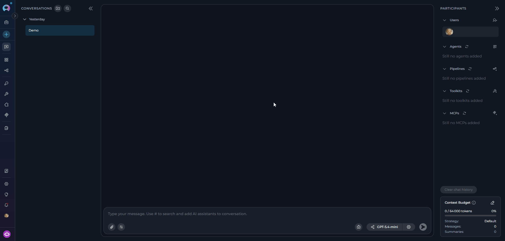

    The "Create New Agent" canvas interface will slide in with all available configuration sections.
  </Step>

  <Step title="Configure Agent">
    The agent creation form opens with several collapsible sections. Fill in each section as needed:

    **GENERAL**

    - **Name*** (required): Enter a unique, descriptive name for your agent — max **32 characters** (e.g., "Code Review Assistant", "Documentation Helper")
    - **Description*** (required): Provide a clear description of what your agent will do — max **2304 characters**
    - **Tags** (optional): Add relevant tags to help organize and categorize your agents
    - **Icon** (optional): Click to set a custom icon for your agent

    <Note>
    Required fields are marked with an asterisk * and must be completed before the agent can be saved. The **Save** button remains disabled until both **Name** and **Description** contain valid text.
    </Note>

    **INSTRUCTIONS**

    Provide detailed guidelines specifying how your agent should behave and what tasks it should perform:

    - **Example:** "You are a helpful AI assistant that reviews code for best practices. Always check for security issues, performance concerns, and code readability."

    <Note>
    The Instructions field supports `{{variable_name}}` syntax. Any variables referenced this way are automatically detected and added to the **VARIABLES** section, where you can set their default values.
    </Note>

    **WELCOME MESSAGE** (optional)

    Add a message that users see when they first interact with your agent — max **768 characters**:
    - **Example:** "Hello! I'm your code review assistant. Share your code and I'll help you identify improvements."

    **CONVERSATION STARTERS** (optional)

    1. Click the **+ Add** button to add conversation starters (maximum **4** starters allowed)
    2. Enter helpful prompts that guide users on how to interact with your agent — each max **768 characters**
    3.  **Examples:**
       - "Review this code for security issues"

    **ADVANCED** (optional)

    - **Step limit**: Set the maximum number of steps the agent can execute before ending the loop — valid range **0–999** (default: **25**). Click the tooltip icon for more information.

    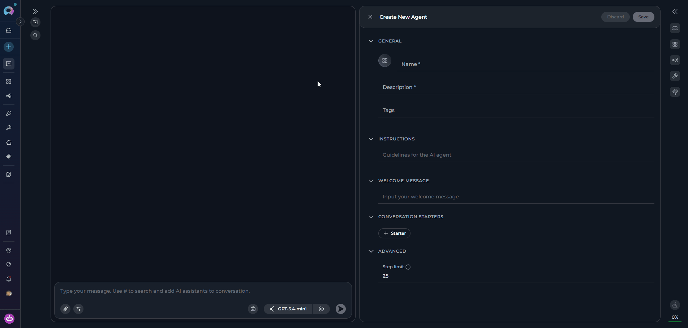
  </Step>

  <Step title="Save Initial Configuration">
    Click the **Save** button to create your agent. After saving, the canvas transitions to **edit mode** where the full configuration interface becomes available:

    <CardGroup cols={3}>
      <Card title="LLM Model Selector" icon="microchip">
        Appears at the top of the panel — select and configure the AI model for your agent.
      </Card>
      <Card title="Integration Buttons" icon="plug">
        **+ Toolkit**, **+ MCP**, **+ Agent**, and **+ Pipeline** buttons become active in the TOOLKITS section.
      </Card>
      <Card title="Internal Tools" icon="toolbox">
        Built-in capability toggle cards appear in the TOOLKITS section, ready to enable.
      </Card>
    </CardGroup>

    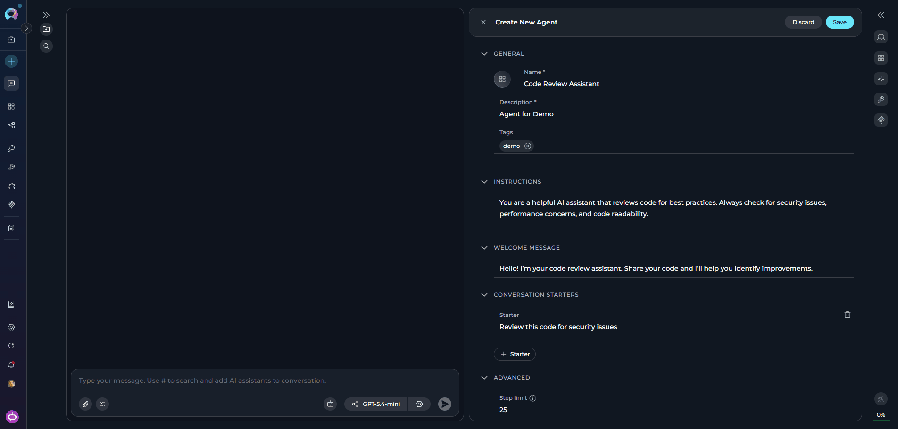
  </Step>
</Steps>

---

## Advanced Agent Configuration

After the initial save, the full agent configuration interface is available. Configure the following:

### LLM Model and Settings

The **LLM Model Selector** appears at the top of the editor panel in edit mode.

1. **Model Selection:**
    - Click the **Select LLM Model** button to choose from available models in your project (e.g., "GPT-5.2", "GPT-5.4")
    - The selected model name is displayed on the button
    - Models that support **image analysis** or **reasoning** show small capability icons next to their name in the dropdown

    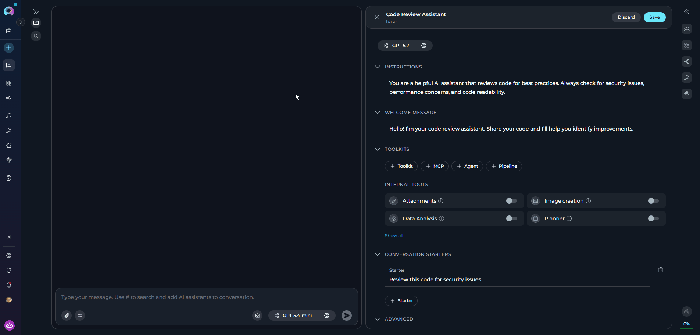

2. **Model Settings:**

    Click the **Model Settings** icon (⚙️) next to the model selector to fine-tune response generation. Settings vary by model type:

    <Tabs>
      <Tab title="Reasoning Models (e.g. GPT-5.1)">
        | Parameter | Description |
        |-----------|-------------|
        | **Reasoning** | Controls depth of logical thinking and problem-solving. |

        | Level | Behavior |
        |-------|----------|
        | **Low** | Fast, surface-level reasoning with concise answers and minimal steps |
        | **Medium** | Balanced reasoning with clear explanations and moderate multi-step thinking *(default)* |
        | **High** | Deep, thorough reasoning with detailed step-by-step analysis (may be slower) |

            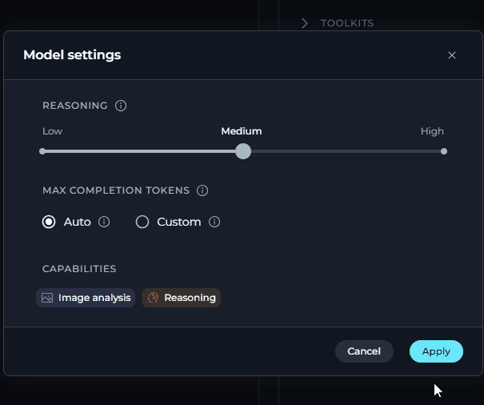
      </Tab>
      <Tab title="Standard Models (e.g. GPT-4o)">
        | Parameter | Description |
        |-----------|-------------|
        | **Creativity** | Controls response randomness. Lower values produce focused, deterministic outputs; higher values produce more varied and creative responses. |

        | Level | Behavior |
        |-------|----------|
        | **1** | Highly focused and deterministic outputs |
        | **2** | Mostly focused with slight variation |
        | **3** | Balanced between focus and creativity *(default)* |
        | **4** | More varied and creative responses |
        | **5** | Maximum creativity and diversity |

                    

      </Tab>
    </Tabs>

    **Max Completion Tokens** *(All Models)*

    | Option | Description |
    |--------|-------------|
    | **Auto** | System sets the token limit to 4096 tokens *(default)* |
    | **Custom** | Manually enter a specific token limit. An error is shown if the value exceeds the model's maximum output tokens. |

    **Capabilities** *(shown when supported by the selected model)*

    | Badge | Meaning |
    |-------|---------|
    |  | The model accepts image inputs alongside text |
    |  | The model uses extended chain-of-thought reasoning |

    <Note>
    Capability badges appear automatically at the bottom of the settings panel based on the selected model. If neither capability is supported, the Capabilities row is hidden.
    </Note>

---

### Toolkits Configuration

In the **TOOLKITS** section, enhance your agent's capabilities by adding integrations and enabling internal tools.

<Note title="Save first">
The **+ Toolkit**, **+ MCP**, **+ Agent**, and **+ Pipeline** buttons are disabled until the agent has been saved at least once. Save the agent first, then add integrations.
</Note>

<Tabs>
  <Tab title="Toolkits">
    - Click **+ Toolkit** to select from available toolkits or create new ones
    - Browse and select toolkits like GitHub, Jira, Confluence, etc.
    - A **"+ Create new"** option navigates to toolkit creation and returns after completion

         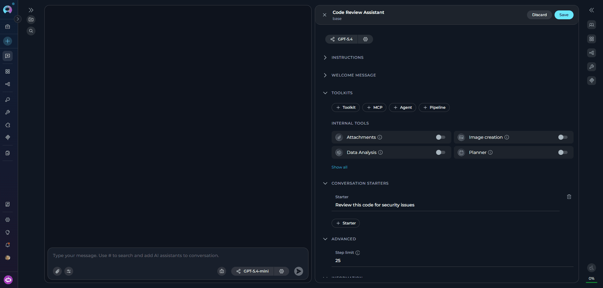
  </Tab>
  <Tab title="MCP Connections">
    - Click **+ MCP** to add Model Context Protocol connections
    - Select from available MCP configurations or create new ones
    - MCP connections appear in the toolkits list with proper status indicators

         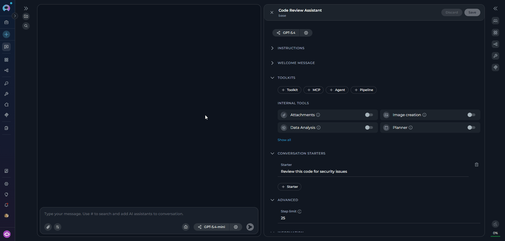
  </Tab>
  <Tab title="Nested Agents">
    - Click **+ Agent** to add other agents as components of this agent
    - Select from existing agents in your project
    - Choose specific versions from the version dropdown

         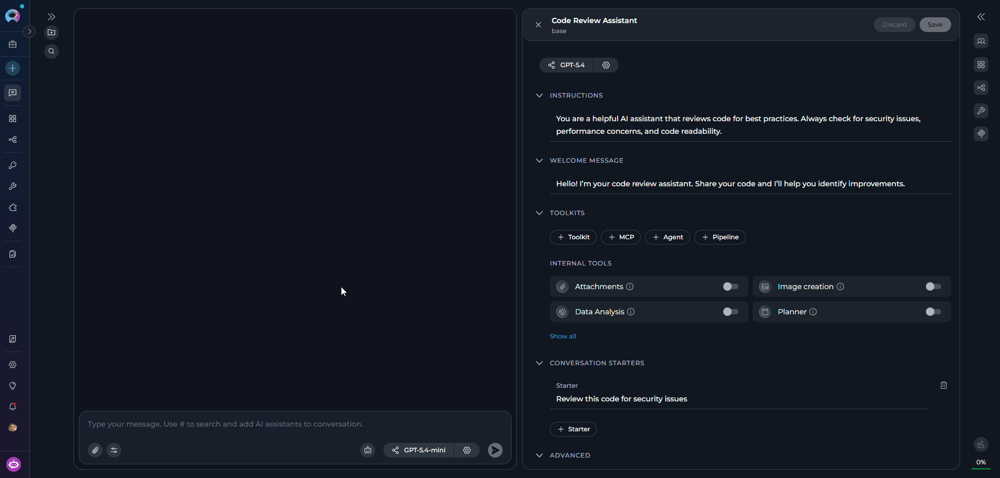
  </Tab>
  <Tab title="Nested Pipelines">
    - Click **+ Pipeline** to integrate pipeline workflows
    - Select from available pipelines in your project
    - Nested pipelines provide structured workflow capabilities to your agent

         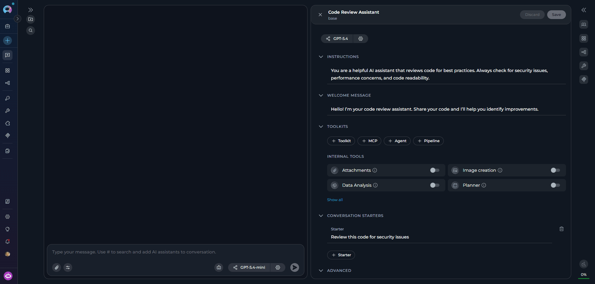
  </Tab>
</Tabs>

### Internal Tools

Below the added integrations, the **INTERNAL TOOLS** section displays built-in capabilities as toggle cards. Enable these tools to extend your agent's functionality without needing external integrations:

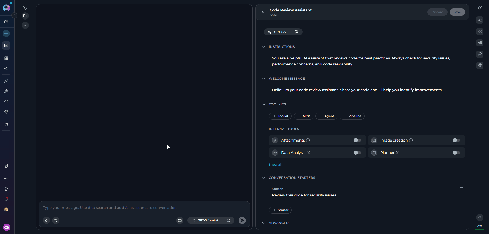

<CardGroup cols={3}>
  <Card title="Attachments" icon="paperclip" href="./attach-files">
    Enable file attachment capabilities for document upload, indexing, and search operations in conversations.
  </Card>
  <Card title="Image Creation" icon="image" href="./image-generation">
    AI-powered image generation directly within the agent conversation.
  </Card>
  <Card title="Data Analysis" icon="chart-bar" href="./data-analysis-internal-tool">
    Pandas-based data analysis on attached files without requiring a separate toolkit.
  </Card>
  <Card title="Planner" icon="list-check" href="./planner-internal-tool">
    Break work into steps and track progress with a built-in task planning tool.
  </Card>
  <Card title="Python Sandbox" icon="code" href="./python-sandbox-internal-tool">
    Secure Python code execution via Pyodide for calculations, data processing, and prototyping.
  </Card>
  <Card title="Swarm Mode" icon="network-wired" href="./swarm-mode-internal-tool">
    Multi-agent collaboration allowing a parent agent to delegate tasks to child agents with shared conversation history.
  </Card>
  <Card title="Smart Tools Selection" icon="wand-magic-sparkles" href="./smart-tools-selection-internal-tool">
    Reduces token usage by using meta-tools to discover and invoke tools on demand instead of binding all upfront.
  </Card>
</CardGroup>

### Finalizing Agent Creation

Once you have completed configuring your agent:

- Click the **Save** button to save all configuration changes
- Click the **×** button to close the canvas interface

Your newly created agent will appear in the **PARTICIPANTS** section under **Agents** and becomes immediately available for use in conversations.

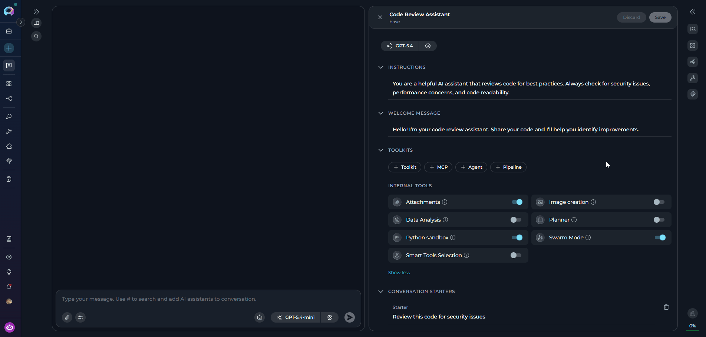

---

## Editing Agents via Canvas Interface

### Accessing Agent Edit Mode

There are two ways to access the agent edit mode:

1. **From PARTICIPANTS Section**
    - Navigate to the **Chat** page where the agent is available.
    - In the **PARTICIPANTS** section, locate **Agents**.
    - Find the agent you want to edit.
    - Hover over the agent to reveal action buttons.
    - Click the pencil **Edit** icon that appears.

2. **From Chat Interface**
    - When an agent is active in your conversation, a **ButtonGroup** appears in the chat input area showing the agent name, version selector, and a **gear icon (⚙)**.
    - Click the **gear icon** to open the agent configuration panel directly.
    - Tooltip reads "**Agent Settings**" for editable versions, or "**Published versions are not editable**" for read-only versions.

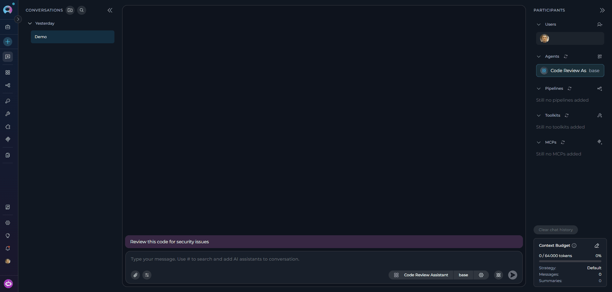

The agent configuration canvas will open with current settings pre-populated.

### Modifying Agent Configuration

Once in edit mode, the interface displays current settings pre-populated. You can modify any of the following:

<CardGroup cols={2}>
  <Card title="Instructions" icon="file-lines">
    Update the agent's behavior guidelines and task definitions. References to `{{variable_name}}` automatically update the Variables section.
  </Card>
  <Card title="Welcome Message" icon="message">
    Change the initial message users see when they start interacting with your agent.
  </Card>
  <Card title="Conversation Starters" icon="comments">
    Add, remove, or modify starter prompts (maximum 4) that guide users on how to interact with the agent.
  </Card>
  <Card title="Advanced Settings" icon="gear">
    Adjust the step limit (0–999) and other execution parameters.
  </Card>
  <Card title="LLM Model and Settings" icon="sliders">
    Switch to a different model or fine-tune model parameters including creativity/reasoning level and max tokens. Click **Apply** after changing settings.
  </Card>
  <Card title="Toolkits and Integrations" icon="toolbox">
    Add or remove toolkits, MCP connections, nested agents, and nested pipelines. Toggle internal tools on or off as needed.
  </Card>
</CardGroup>

After making changes, click the **Save** button to apply them. The **Discard** button resets the form to the last saved state. Clicking **×** with unsaved changes triggers a confirmation dialog.

### Version Management

When editing agents from the chat interface, the **ButtonGroup** in the chat input area includes a version selector:

1. **Version Selector:**
    - The current version name is displayed as a button
    - Click the version dropdown to view all available versions
    - Select a different version to view or edit it

2. **Version Status:**
    - **Draft versions**: Can be edited and modified
    - **Published versions**: Read-only; the gear icon shows "Published versions are not editable"

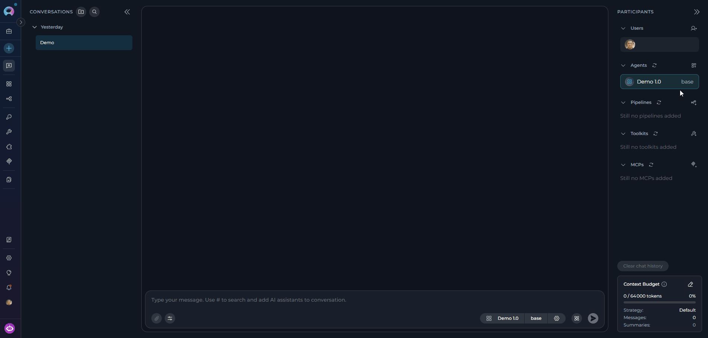    

<Warning title="Unsaved Changes and Version Switching">
Switching to a different version while the editor has unsaved changes will trigger a warning dialog: "You are editing now. Do you want to discard current changes and continue?" Confirm to discard and switch, or Cancel to stay.
</Warning>

---

## <Icon icon="triangle-exclamation" size={32} /> Troubleshooting

<AccordionGroup>
  <Accordion title="Save button remains disabled">
    **Problem:** Required fields are missing or incomplete.

    - Ensure both **Name** and **Description** fields are filled in with valid text
    - In edit mode, verify that no conversation starter is blank or whitespace-only
    - The Save button is also disabled if the form has no unsaved changes
  </Accordion>
  <Accordion title="Cannot add toolkits, agents, or pipelines">
    **Problem:** Integration buttons are greyed out.

    - The **+ Toolkit**, **+ MCP**, **+ Agent**, and **+ Pipeline** buttons are disabled until the agent has been saved at least once
    - Save the agent first using the **Save** button, then add integrations
  </Accordion>
  <Accordion title="Model Settings Apply button is disabled">
    **Problem:** Cannot apply model settings.

    - Check that the **Max Completion Tokens** value does not exceed the selected model's maximum output token limit
    - Reduce the custom token value or switch to **Auto** mode
  </Accordion>
</AccordionGroup>

<AccordionGroup>
  <Accordion title="Cannot access edit mode for existing agent">
    **Problem:** Gear icon shows "Published versions are not editable" or edit icon is missing.

    - Published versions are read-only and cannot be edited
    - To modify, create a new draft version or edit an existing draft version
    - Verify you have the required permissions to edit agents in this project
  </Accordion>
  <Accordion title="Changes cannot be saved due to validation errors">
    **Problem:** Save button is disabled or shows an error after attempting to save.

    - Review any inline error messages displayed beneath fields
    - Ensure all required fields (Name, Description) contain valid values within character limits
    - Check that external resources (models, toolkits, agents) are still accessible in your project
  </Accordion>
  <Accordion title="Unsaved changes lost after switching versions">
    **Problem:** Edits disappeared after selecting a different version.

    - Switching versions discards unsaved changes after confirming the warning dialog — this is expected behavior
    - Always save your changes before switching to another version
  </Accordion>
</AccordionGroup>

<AccordionGroup>
  <Accordion title="Created agent doesn't appear in PARTICIPANTS">
    **Problem:** Agent was created but is not visible in the PARTICIPANTS section.

    - Refresh the interface
    - Verify the agent was created in the correct workspace/project
    - Ensure you are viewing the correct project context
  </Accordion>
  <Accordion title="Model configuration changes don't take effect">
    **Problem:** Model settings were closed without applying.

    - Reopen the model settings dialog using the ⚙️ icon
    - Make your changes and click **Apply** before closing
    - Simply closing the dialog without clicking Apply discards any changes
  </Accordion>
  <Accordion title="Variables section is empty or missing expected variables">
    **Problem:** Variables defined in Instructions are not appearing in the VARIABLES section.

    - Verify the variable syntax in Instructions uses double curly braces: `{{variable_name}}`
    - Variable names are case-sensitive and must not contain spaces
    - Save the agent after adding variable references to refresh the Variables section
  </Accordion>
</AccordionGroup>

---

<Info title="Related Documentation">
For additional information and related functionality, refer to these helpful resources:

- **[Agent Menu](../../menus/agents)** - Complete reference for agent management and configuration options
- **[Chat Menu](../../menus/chat)** - Comprehensive guide to chat interface features and navigation
- **[Credential Menu](../../menus/credentials)** - Detailed instructions for managing authentication credentials
- **[AI Configuration](../../menus/settings/ai-configuration)** - Setup and configuration guide for AI models and settings
- **[How to Create and Edit Pipelines from Canvas](./how-to-create-and-edit-pipelines-from-canvas)** - Similar guide for pipeline management
</Info>
