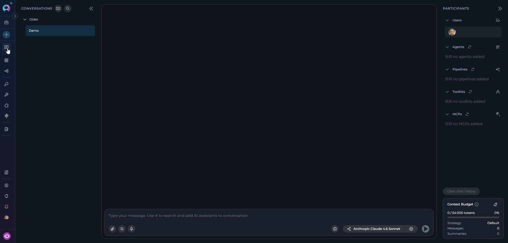
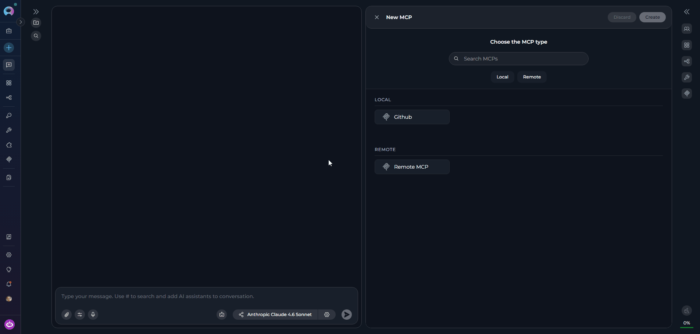
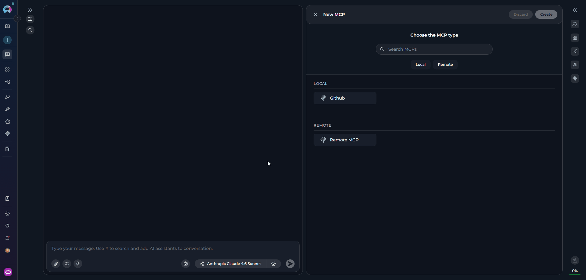
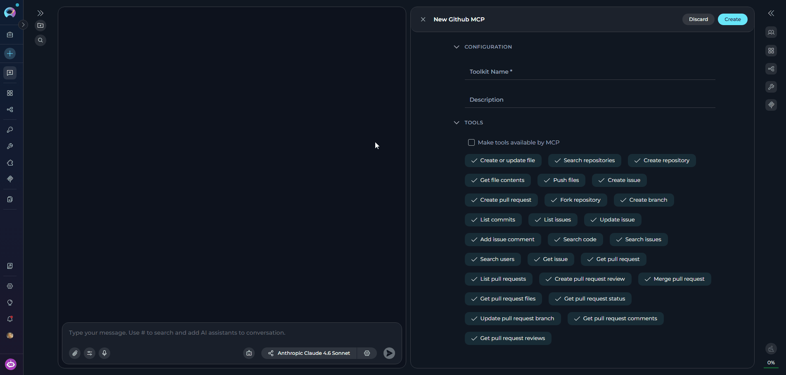
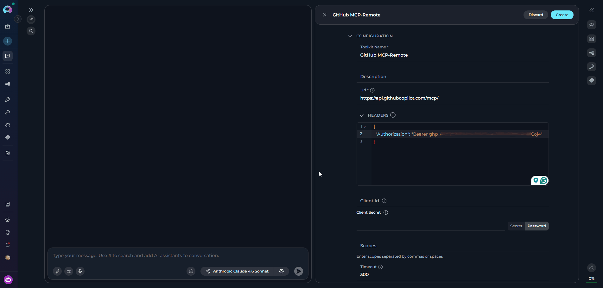
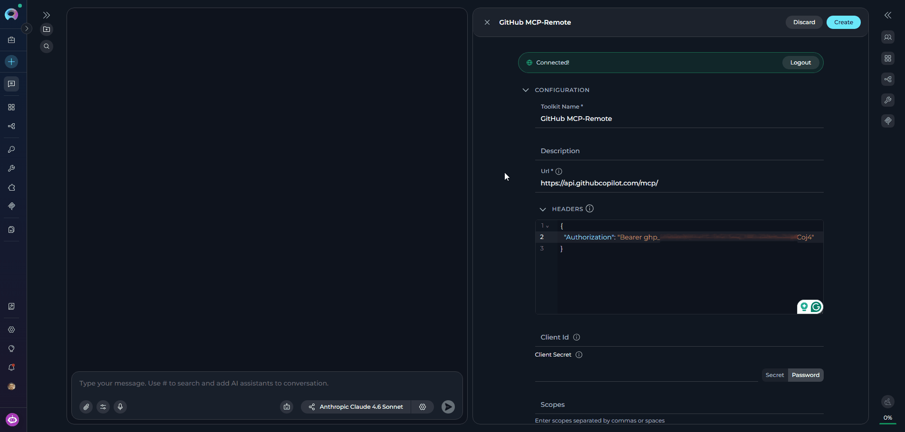
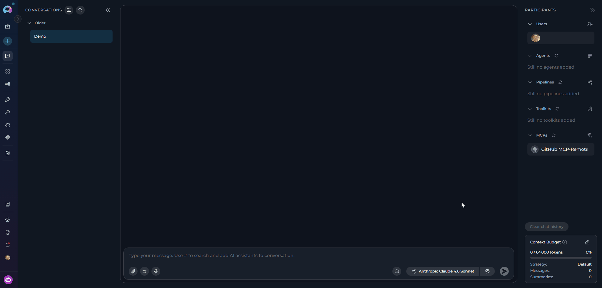
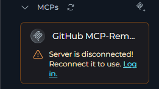

## MCP Canvas Feature: Visual MCP Management

The **MCP Canvas** interface in ELITEA serves as an integrated MCP management system accessible directly from the chat interface. This feature enables you to create, configure, and manage Model Context Protocol connections without leaving your conversation context.

<CardGroup cols={3}>
  <Card title="Integrated Chat Experience" icon="comments">
    Access MCP management directly from the PARTICIPANTS section in chat, maintaining conversation context while configuring integrations.
  </Card>
  <Card title="Real-time Validation" icon="circle-check">
    Configuration fields are validated in real-time, ensuring correct setup before the MCP is created.
  </Card>
  <Card title="Instant Integration" icon="bolt">
    Created MCPs are immediately available for use in the current conversation and appear in the PARTICIPANTS panel.
  </Card>
  <Card title="Dynamic Tool Discovery" icon="wrench">
    MCP tools are automatically discovered from connected MCP servers via the Elitea MCP Client..
  </Card>
  <Card title="Two Connection Types" icon="network-wired">
    Connect to **Local** MCP servers discovered from your running Elitea MCP Client, or configure a **Remote MCP** connection to any HTTP-based MCP server.
  </Card>
</CardGroup>

<Warning title="Prerequisites">
Before creating MCPs from canvas, ensure the **Elitea MCP Client** is installed and running with at least one MCP server configured. See the [MCP Client integration guide](../../integrations/mcp/create-and-use-client-stdio) for setup instructions.
</Warning>

---

## Creating MCPs via Canvas Interface

<Steps>
  <Step title="Access the MCP Creation Canvas">
    1. Navigate to the **Chat** page (main sidebar menu).
    2. In the chat input toolbar, click the **`+`** icon.
    3. Hover over **MCPs** to expand the submenu.
    4. Click **Create New MCP** at the bottom of the submenu.

    The **MCP Editor** slides open, displaying the **"Choose the MCP type"** selector.

    
  </Step>

  <Step title="Select an MCP Type">
    The type selector displays all available MCP types grouped into two categories:

    **To find an MCP type:**

    - **Browse by category** — Scroll through the **Local** and **Remote** groups and click an MCP type.
    - **Search** — Type in the **"Search MCPs"** field to filter by name. Results update in real-time.

    <Tabs>
      <Tab title="Local">
        Local MCP types are MCP servers that you have configured and connected via the **Elitea MCP Client** running on your machine. Any MCP server connected through the client (e.g., Playwright, GitHub, Figma, or other stdio/http-based MCP servers) automatically appears here.

         

        <Warning>
        If no Local MCP types appear, ensure the Elitea MCP Client is running and has connected MCP servers. The UI automatically discovers available MCP servers via real-time updates.
        </Warning>
      </Tab>
      <Tab title="Remote">
        The **Remote MCP** type lets you connect to any MCP-compliant HTTP server by providing its URL and optional authentication headers. This option always appears regardless of platform configuration.

        
      </Tab>
    </Tabs>

    Clicking an MCP type immediately loads its configuration form.
  </Step>

  <Step title="Configure the MCP">
    After selecting the MCP type, the **Create MCP** canvas interface slides in with the available configuration fields.

    <Tabs>
      <Tab title="Local MCP">
        Local MCP configuration is minimal — the server's tools and schema are automatically discovered from your connected Elitea MCP Client. Fill in the following fields:

        | Field | Required | Description |
        |-------|----------|-------------|
        | **MCP Name** | Yes | A clear, descriptive name for this MCP instance |
        | **Description** | No | Brief description of the MCP's purpose and usage |
        | **TOOLS** | No | Select which tools to enable — all discovered tools are selected by default |
        | **Make Tools Available by MCP** | No | Enable this option to make the selected tools accessible through external MCP clients |

        <Note>
        The available tools in the TOOLS section are automatically populated from the connected MCP server. No additional connection configuration is required for Local MCPs.
        </Note>

        
      </Tab>
      <Tab title="Remote MCP">
        For Remote MCP, fill in the connection details for the target HTTP-based MCP server:

        | Field | Required | Default | Description |
        |-------|----------|---------|-------------|
        | **MCP Name** | Yes | — | A descriptive name for this MCP connection |
        | **Description** | No | — | Purpose and usage notes |
        | **URL** | Yes | — | The HTTP/HTTPS endpoint of the MCP server |
        | **Headers** | No | — | HTTP headers as key-value pairs (e.g., for API key authentication) |
        | **Client ID** | No | — | OAuth Client ID (if the server uses OAuth) |
        | **Client Secret** | No | — | OAuth Client Secret (if the server uses OAuth) |
        | **Scopes** | No | — | OAuth scopes required by the server |
        | **Timeout** | No | 300 s | Request timeout in seconds (range: 1–3600) |
        | **Selected Tools** | No | All | Specific tools to enable — click **Load Tools** to fetch from the server, then select |
        | **Enable Caching** | No | Enabled | Cache tool schemas to improve performance |
        | **Cache TTL** | No | 300 s | How long to cache tool schemas in seconds (range: 60–3600) |
        | **SSL Verify** | No | Enabled | Verify SSL certificates — disable only for self-signed certificates in development |

        

        Click **Load Tools** after entering the Server URL to discover and select the tools exposed by the remote MCP server.

        <Note>
        For a full step-by-step guide on configuring a Remote MCP connection, see [Create and Use Remote MCP](../../integrations/mcp/create-and-use-remote-mcp).
        </Note>
      </Tab>
    </Tabs>
  </Step>

  <Step title="Create the MCP">
    Once you have completed configuring your MCP:

    1. Click the **Create** button to save the configuration.
    2. Click the **×** button to close the canvas interface.

    Your newly created MCP will appear in the **PARTICIPANTS** section under **MCPs** and becomes immediately available for use in conversations.

    
  </Step>
</Steps>

---

## Editing MCPs via Canvas Interface

### Accessing MCP Edit Mode

1. Navigate to the **Chat** page where the MCP is listed as a participant.
2. In the **PARTICIPANTS** section, locate the **MCPs** group.
3. Hover over the MCP you want to edit to reveal the action icons.
4. Click the pencil **Edit MCP** icon.

The MCP Editor opens with all current settings pre-populated.

### Modifying MCP Configuration

Once in edit mode you can modify any of the following:

<CardGroup cols={2}>
  <Card title="Description" icon="pen-to-square">
    Update the MCP's description. Note that the MCP name cannot be changed via the canvas interface.
  </Card>
  <Card title="Configuration Fields" icon="sliders">
    Update type-specific parameters such as server URL, authentication headers, timeout, and caching settings.
  </Card>
  <Card title="Selected Tools" icon="toolbox">
    Toggle individual tools on or off in the TOOLS section to control which capabilities are exposed to the AI.
  </Card>
  <Card title="Connection Status (Remote MCP)" icon="plug">
    For Remote MCPs that use OAuth, a **Log In** / **Log Out** button appears in the PARTICIPANTS panel. Click **Log In** to complete the OAuth authorization flow, or **Log Out** to revoke the active session.
  </Card>
</CardGroup>

After making changes, click **Save** to apply them. On success: *"The toolkit has been updated successfully."* The **Save** button is disabled if no changes have been made. Click **Discard** to revert the form to the last saved state.

<Warning title="Disconnected MCP">
If an MCP loses its connection, the participant item in the PARTICIPANTS panel displays a disconnection warning:

- **Local MCP** — Displays: *"The \<server-name\> mcp server is disconnected. Reconnect it to use."* No **Log in** button is shown. To resolve, ensure the Elitea MCP Client is running and the MCP server is active.
- **Remote MCP** — Displays: *"Server is disconnected! Reconnect it to use."* with a **Log in** link. Click **Log in** to re-authenticate and restore the connection.

The MCP cannot be used in the conversation until the connection is restored.

</Warning>

---

## <Icon icon="triangle-exclamation" size={32} /> Troubleshooting

<AccordionGroup>
  <Accordion title="Create button remains disabled">
    **Problem:** The **Create** button is greyed out and cannot be clicked.

    The Create button is enabled only when **all** of the following conditions are met:
    - An MCP type has been selected from the type selector.
    - At least one field in the form has been filled in (the form has changes).
    - The MCP is not currently being saved.

    Ensure you have selected an MCP type first, then begin filling in the configuration fields.
  </Accordion>
  <Accordion title="Validation error on create or save">
    **Problem:** A toast message appears — *"Please fill in all required fields before creating the toolkit."*

    - Review all fields marked with an asterisk `*` and ensure they are completed.
    - Inline red borders and error text below individual fields indicate exactly which fields need attention.
    - Check that the **MCP Name** field is filled in — it is required for all MCP types.
    - For Remote MCP, verify that the **URL** field is filled in and uses `http://` or `https://`.
  </Accordion>
  <Accordion title="Save button is disabled in edit mode">
    **Problem:** The **Save** button is greyed out when editing an existing MCP.

    - The Save button is only enabled when the form has unsaved changes. If you have not yet modified any field, the button remains disabled.
    - Make at least one change to any field (e.g., update the description or toggle a tool) before attempting to save.
  </Accordion>
</AccordionGroup>

<AccordionGroup>
  <Accordion title="No Local MCP types available">
    **Problem:** The **Local** category in the type selector is empty.

    - Local MCP types are discovered from your **Elitea MCP Client**. If none appear, ensure the MCP Client is installed, running, and has at least one MCP server connected.
    - Verify the MCP Client is active and connected to the ELITEA platform — the UI discovers available servers via real-time updates.
    - See the [MCP Client integration guide](../../integrations/mcp/create-and-use-client-stdio) for setup instructions.
    - You can still use **Remote MCP** to connect directly to any HTTP-based MCP server without the client.
  </Accordion>
  <Accordion title="Cannot access edit mode for existing MCP">
    **Problem:** The pencil edit icon is not visible or clicking it does nothing.

    - Hover directly over the MCP row in the PARTICIPANTS panel — the action icons appear only on hover.
    - If the MCP belongs to a public project, the form fields will be read-only and editing is not permitted.
    - Verify you have the **Edit** permission for this project. Users without edit permissions cannot modify MCPs.
  </Accordion>
  <Accordion title="MCP not appearing in PARTICIPANTS after creation">
    **Problem:** The MCP was created successfully but is not visible in the PARTICIPANTS panel.

    - After creation, the MCP is added to the available MCPs list but is **not automatically set as an active participant**. Locate it in the **+Add MCP** dropdown and select it to add it to the current conversation.
    - Verify the MCP was created in the correct project — check that you are viewing the right project in the sidebar.
    - If you still cannot find it, refresh the page and check again.
  </Accordion>
  <Accordion title="Remote MCP shows a disconnected or logged-out warning">
    **Problem:** A Remote MCP participant displays *"Server is disconnected! Reconnect it to use."* with a **Log in** link in the PARTICIPANTS panel.

    - The Remote MCP's OAuth token has expired or was never set. The MCP cannot be used until re-authenticated.
    - Click the **Log in** link on the participant item. An OAuth authorization modal will open automatically.
    - Complete the authorization flow in the modal. After a successful login, the MCP reconnects and retries automatically.
    - If the modal shows a 403 error after login, the OAuth token may have insufficient scopes — re-authorize and ensure all required scopes are granted.
  </Accordion>
  <Accordion title="Load Tools fails for Remote MCP">
    **Problem:** Clicking **Load Tools** returns an error or discovers no tools.

    - Ensure the **URL** field is filled in before clicking Load Tools — if it is empty, the error *"MCP server URL is required"* will appear.
    - If a **401 Unauthorized** error appears (*"Authorization failed. Please try logging in again."*), the OAuth token is invalid or expired. The OAuth modal will open automatically — complete the login flow and Load Tools will retry automatically.
    - If a **403 Forbidden** error appears (*"Access denied. The OAuth token may have insufficient permissions..."*), re-authorize using the OAuth modal and ensure all required scopes are included.
    - If the server URL is correct and authentication succeeds but no tools are returned, verify that the remote MCP server exposes tools and is reachable from the ELITEA platform.
  </Accordion>
</AccordionGroup>

---

<Info title="Related Documentation">
For additional information and related functionality, explore these related guides and references:

- **[MCP Menu](../../menus/mcps)** - Complete reference for MCP management and configuration options
- **[Chat Menu](../../menus/chat)** - Comprehensive guide to chat interface features and navigation
- **[Credential Menu](../../menus/credentials)** - Detailed instructions for managing authentication credentials
- **[How to Create and Edit Toolkits from Canvas](./how-to-create-and-edit-toolkits-from-canvas)** - Similar guide for toolkit management
- **[How to Create and Edit Agents from Canvas](./how-to-create-and-edit-agents-from-canvas)** - Similar guide for agent management
- **[How to Create and Edit Pipelines from Canvas](./how-to-create-and-edit-pipelines-from-canvas)** - Similar guide for pipeline management
</Info>
