## Pipeline Canvas Feature: Visual Pipeline Management

The **Pipeline Canvas** interface in ELITEA serves as an integrated pipeline management system accessible directly from the chat interface. This feature enables you to create, configure, and manage AI pipelines without leaving your conversation context, streamlining your development workflow.

<CardGroup cols={2}>
  <Card title="Integrated Chat Experience" icon="comments">
    Access pipeline management directly from the PARTICIPANTS section in chat, maintaining conversation context while managing AI workflows.
  </Card>
  <Card title="Dual-Mode Configuration" icon="table-columns">
    Use both Configuration mode for general settings and Flow Editor mode for visual workflow design.
  </Card>
  <Card title="Real-time Validation" icon="circle-check">
    Configuration fields are validated in real-time, ensuring proper setup before pipeline creation.
  </Card>
  <Card title="Instant Integration" icon="bolt">
    Created pipelines are immediately available for use in conversations and can be added to the PARTICIPANTS section.
  </Card>
  <Card title="Advanced Model Configuration" icon="sliders">
    Integration with ELITEA's LLM model management system for comprehensive AI model selection and fine-tuning.
  </Card>
</CardGroup>

---

## Creating Pipelines via Canvas Interface

<Steps>
  <Step title="Access the Pipeline Creation Canvas">
    1. Navigate to the **Chat** page (main sidebar menu).
    2. In the chat input toolbar, click the **`+`** icon.
    3. Hover over **Pipelines** to expand the submenu.
    4. Click **Create New Pipeline** at the bottom of the submenu.

    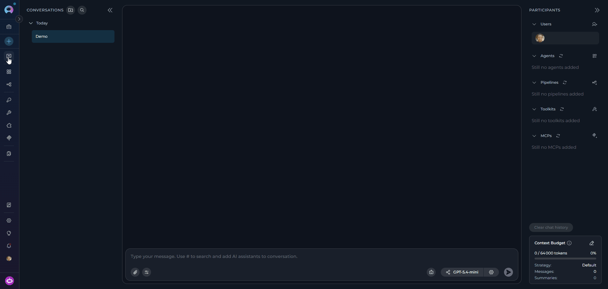

    The "Create New Pipeline" canvas interface will be displayed with all available configuration sections.
  </Step>

  <Step title="Configure General Information">
    The pipeline creation form opens in a single-page layout. Fill in the **GENERAL** section:

    - **Name*** (required): Enter a unique, descriptive name for your pipeline (e.g., "Content Review Workflow", "Data Processing Pipeline")
    - **Description*** (required): Provide a clear description of what your pipeline will do and its purpose
    - **Tags** (optional): Add relevant tags by typing tag names to help organize and categorize your pipelines

    <Note title="Note">
    Required fields are marked with an asterisk * and must be completed before the pipeline can be created.
    </Note>

    **Welcome Message (Optional)**

    In the **WELCOME MESSAGE** section, add a message that users see when they first interact with your pipeline:

    - **Example:** "Hello! I'm your content review pipeline. I'll help you process and validate your content through multiple review stages."

    **Conversation Starters (Optional)**

    In the **CONVERSATION STARTERS** section:

    1. Click the **+ Starter** button to add conversation starters (maximum 4 starters allowed)
    2. Enter helpful prompts that guide users on how to interact with your pipeline
    3. Each starter has a delete (trash) icon for removal if needed
    4. **Examples:**
       - "Start a new review process"

    **Advanced Settings (Optional)**

    In the **ADVANCED** section:

    - **Step limit**: Set the maximum number of steps the pipeline can execute (default: 25). This controls how many operations the pipeline can perform in a single execution.

    **LLM Model**

    The LLM model selector is available during creation. Click **Select LLM Model** to choose the model your pipeline will use, and click the settings icon (⚙️) to configure model parameters.

    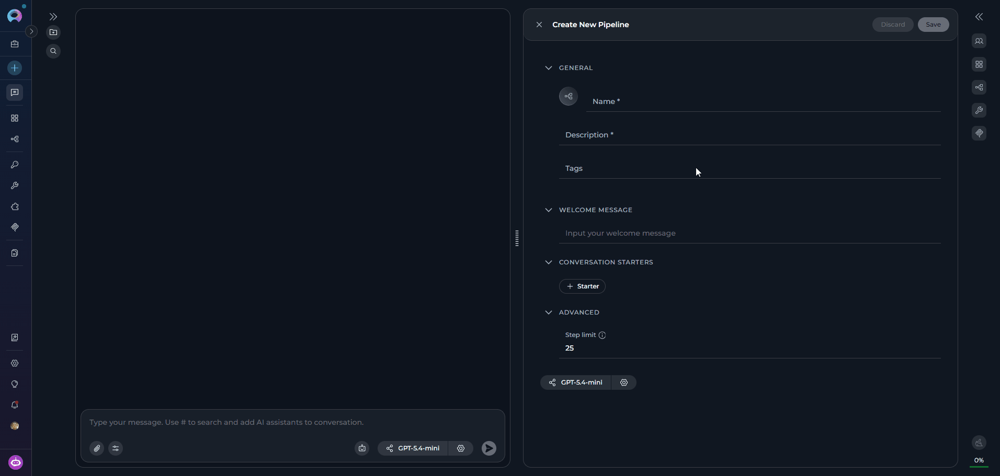
  </Step>

  <Step title="Save Initial Configuration">
    Click the **Save** button to create your pipeline. The canvas transitions to the advanced configuration interface with two tabs:

    - **Configuration** — Add toolkits, agents, pipelines, and MCP connections (these buttons are disabled until the pipeline is saved).
    - **Flow editor** — Visually design the pipeline workflow using nodes and connectors.

    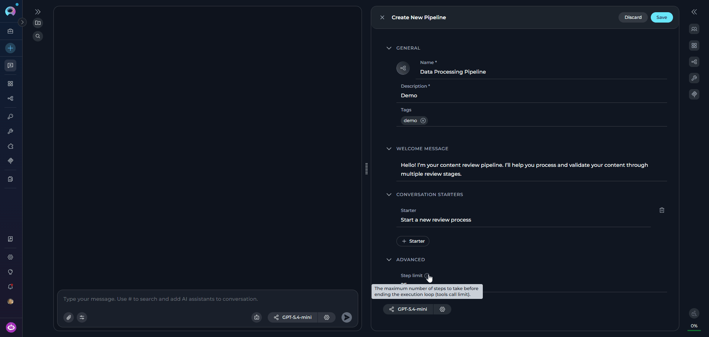
  </Step>
</Steps>

---

## Advanced Pipeline Configuration

After saving the initial configuration, the advanced configuration interface opens with two main tabs:

### Configuration Tab

#### LLM Model and Settings Configuration

1. **Model Selection:**
    - Click the **Select LLM Model** button at the top of the interface
    - Choose from available LLM models in your project (e.g., "gpt-4o", "gpt-4o-mini")
    - The selected model will be displayed on the button

     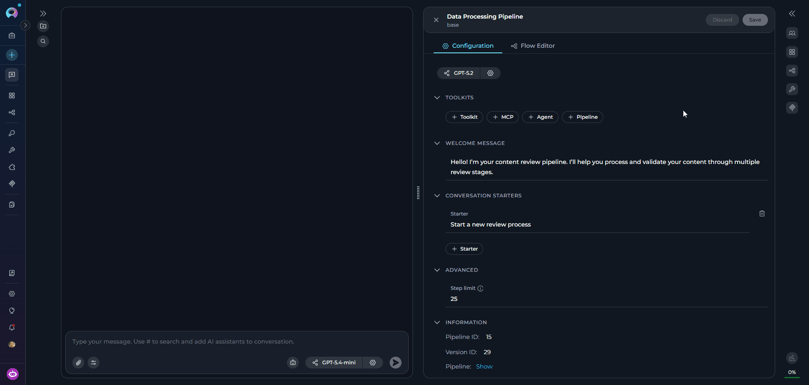

2. **Model Settings:**

    Click the **Model Settings** icon (⚙️) next to the model selector to fine-tune response generation. Settings vary by model type:

    <Tabs>
      <Tab title="Reasoning Models (e.g. GPT-5.4)">
        | Parameter | Description |
        |-----------|-------------|
        | **Reasoning** | Controls depth of logical thinking and problem-solving. |

        | Level | Behavior |
        |-------|----------|
        | **Low** | Fast, surface-level reasoning with concise answers and minimal steps |
        | **Medium** | Balanced reasoning with clear explanations and moderate multi-step thinking *(default)* |
        | **High** | Deep, thorough reasoning with detailed step-by-step analysis (may be slower) |

            

      </Tab>
      <Tab title="Standard Models (e.g. GPT-4o)">
        | Parameter | Description |
        |-----------|-------------|
        | **Creativity** | Controls response randomness. Lower values produce focused, deterministic outputs; higher values produce more varied and creative responses. |

        | Level | Behavior |
        |-------|----------|
        | **1** | Highly focused and deterministic outputs |
        | **2** | Mostly focused with slight variation |
        | **3** | Balanced between focus and creativity *(default)* |
        | **4** | More varied and creative responses |
        | **5** | Maximum creativity and diversity |

                    
      </Tab>
    </Tabs>

    **Max Completion Tokens** *(All Models)*

    | Option | Description |
    |--------|-------------|
    | **Auto** | System sets the token limit to 4096 tokens *(default)* |
    | **Custom** | Manually enter a specific token limit. The interface shows remaining tokens available. An error is shown if the value exceeds the model's maximum output tokens. |

    **Capabilities** *(shown when supported by the selected model)*

    | Badge | Meaning |
    |-------|---------|
    |  | The model accepts image inputs alongside text |
    |  | The model uses extended chain-of-thought reasoning |

    <Note>
    Capability badges appear automatically at the bottom of the settings panel based on the selected model. If neither capability is supported, the Capabilities row is hidden.
    </Note>

---

#### Toolkits Configuration

In the **TOOLKITS** section, you can enhance your pipeline's capabilities by adding various integrations:

<Note title="Save first">
The **+ Toolkit**, **+ MCP**, **+ Agent**, and **+ Pipeline** buttons are disabled until the pipeline has been saved at least once. Save the pipeline in the Configuration tab first, then add integrations.
</Note>

<Tabs>
  <Tab title="Toolkits">
    - Click **+ Toolkit** to select from available toolkits or create new ones
    - Browse and select toolkits like GitHub, Jira, Confluence, etc.

         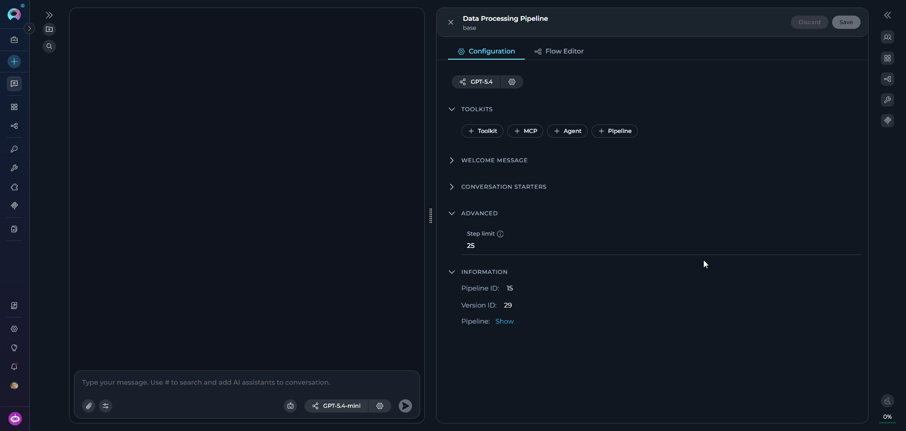
  </Tab>
  <Tab title="MCP Connections">
    - Click **+ MCP** to add Model Context Protocol connections
    - Select from available MCP configurations or create new ones
    - MCP connections appear in the toolkits list with proper status indicators
    - For **remote MCP servers**, an **Authorize** button appears — click it to complete the OAuth authorization flow before the connection becomes active

         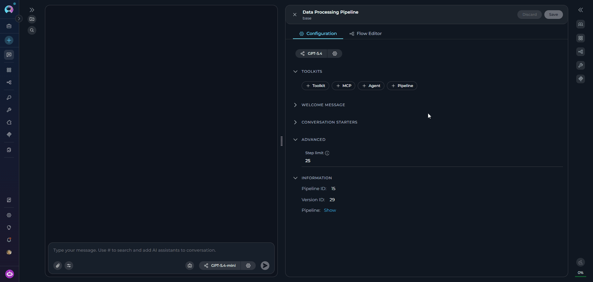
  </Tab>
  <Tab title="Nested Agents">
    - Click **+ Agent** to add agents as pipeline components
    - Select from existing agents in your project
    - Choose specific versions from the version dropdown
    - Nested agents provide AI capabilities within pipeline nodes

         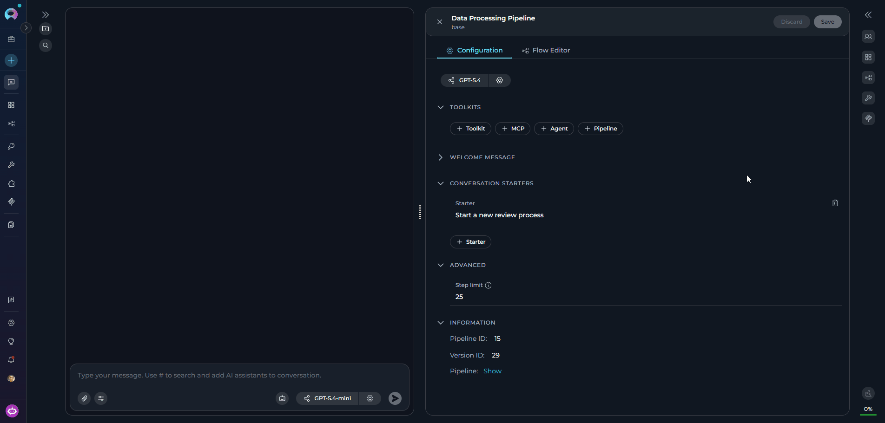
  </Tab>
  <Tab title="Nested Pipelines">
    - Click **+ Pipeline** to integrate other pipeline workflows
    - Select from available pipelines in your project
    - Nested pipelines enable complex workflow compositions

         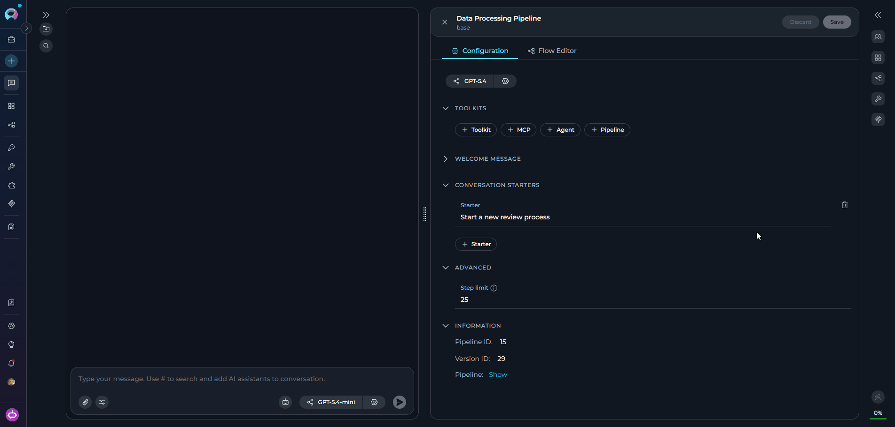
  </Tab>
</Tabs>

#### Internal Tools Configuration

In the **INTERNAL TOOLS** section, you can enable built-in capabilities that extend the pipeline without requiring external credentials:

- **Attachments**: Toggle to enable file attachment support in pipeline conversations. When enabled, users can attach documents, images, code files, and more directly in the chat input. Enabling this automatically adds an `input_attachments` state variable to the pipeline YAML, which nodes can reference via `{{state.input_attachments}}`.

<Note>
File attachments require a default vector storage (pgvector) and a default embedding model to be configured in your project settings. Contact your platform administrator if attachments fail to upload.
</Note>

### Flow Editor Tab

The **Flow Editor** tab provides a visual interface for designing your pipeline workflow. 

<Note title="Flow Editor Availability">
The Flow Editor is disabled during pipeline creation. You must save the pipeline first in the Configuration tab before accessing the Flow Editor.
</Note>

<CardGroup cols={2}>
  <Card title="Visual Node Management" icon="diagram-project">
    - Drag and drop nodes onto the canvas
    - Connect nodes to create workflow paths
    - Configure individual node properties
    - Click the **+ (Add Node)** button to add nodes to your workflow
    - Node types include: Agent, Decision, Loop, Router, State Modifier, and more
  </Card>
  <Card title="State Management" icon="database">
    - **State**: Holds data that flows through your workflow
    - **State Variables**: Store information between nodes
    - **State Modifier Node**: Update, transform, or clean up state variables during execution
    - Configure input and output variables per node to control data flow
  </Card>
  <Card title="YAML Synchronization" icon="arrows-rotate">
    - Flow Editor changes automatically update the YAML instructions
    - Manual YAML edits are reflected in the visual editor
    - Seamlessly switch between visual and code-based editing
  </Card>
  <Card title="Editor Modes" icon="display">
    - **Flow mode**: Visual drag-and-drop interface
    - **YAML mode**: Direct YAML code editing
  </Card>
</CardGroup>

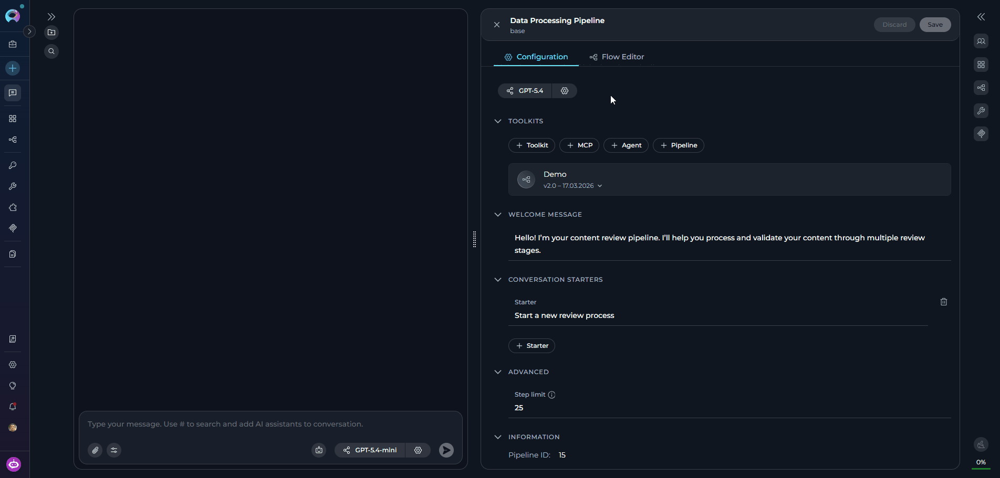

### Finalizing Pipeline Creation

Once you have completed configuring your pipeline:

- Click the **Save** button to save all your configuration changes
- Click the **X** button to close the canvas interface

Your newly created pipeline will appear in the **PARTICIPANTS** section under **Pipelines** and becomes immediately available for use in conversations.

 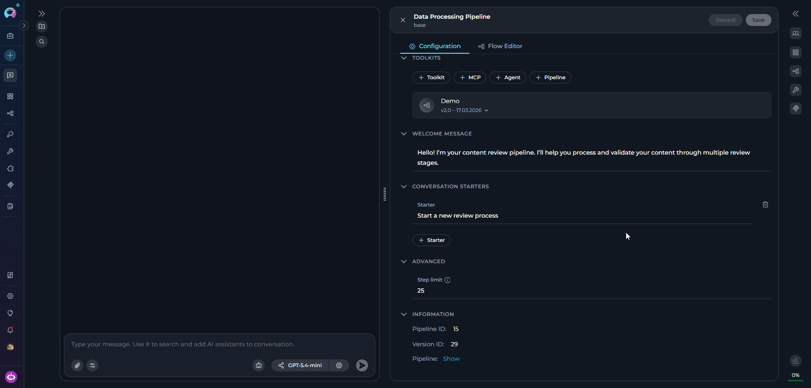

---

## Editing Pipelines via Canvas Interface

### Accessing Pipeline Edit Mode

There are two ways to access the pipeline edit mode:

1. **From PARTICIPANTS Section**
    - Navigate to the **Chat** page where the pipeline is available.
    - In the **PARTICIPANTS** section, locate **Pipelines**.
    - Find the pipeline you want to edit.
    - Hover over the pipeline to reveal action buttons.
    - Click the pencil **Edit** icon that appears.

2. **From Chat Interface**
    - When a pipeline is active in your conversation, click the **Pipeline Settings** button (gear icon) that appears in the chat interface.
    - This will open the pipeline configuration canvas directly.

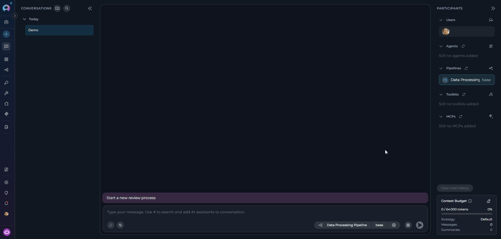

The pipeline configuration canvas will open with current settings pre-populated.

### Modifying Pipeline Configuration

Once in edit mode, the interface displays current settings pre-populated. You can modify any of the following:

<Tabs>
  <Tab title="Configuration Tab" icon="gear">
    <CardGroup cols={2}>
      <Card title="Welcome Message" icon="message">
        Change the initial message users see when they start interacting with your pipeline.
      </Card>
      <Card title="Conversation Starters" icon="comments">
        Add, remove, or modify starter prompts (maximum 4) that guide users on how to interact with the pipeline.
      </Card>
      <Card title="Advanced Settings" icon="gear">
        Adjust the step limit and other execution parameters.
      </Card>
      <Card title="Internal Tools" icon="wrench">
        Toggle **Attachments** on or off to enable or disable file upload support for the pipeline.
      </Card>
      <Card title="LLM Model and Settings" icon="sliders">
        Switch to a different model or fine-tune model parameters such as creativity/reasoning level and max tokens.
      </Card>
      <Card title="Toolkits and Integrations" icon="toolbox">
        Add or remove toolkits, MCP connections, nested agents, and nested pipelines. Expand each entry to view and manage individual tools or select specific versions.
      </Card>
    </CardGroup>
  </Tab>
  <Tab title="Flow Editor Tab" icon="diagram-project">
    <CardGroup cols={2}>
      <Card title="Visual Workflow Design" icon="diagram-project">
        Add, remove, or rearrange nodes directly on the canvas.
      </Card>
      <Card title="Node Configuration" icon="pen-to-square">
        Update properties, inputs, and outputs for individual nodes.
      </Card>
      <Card title="Connection Management" icon="link">
        Modify transitions and data flow between nodes.
      </Card>
      <Card title="YAML Editing" icon="code">
        Directly edit the workflow YAML code for fine-grained control.
      </Card>
    </CardGroup>
  </Tab>
</Tabs>

After making your desired changes, click the **Save** button to apply them. The updated configuration becomes immediately active.

## Version Management

When editing pipelines from the chat interface:

1. **Version Selector:**
    - The current version is displayed on the version dropdown in the pipeline settings panel
    - The current version is also displayed on the pipeline card in the PARTICIPANTS sidebar
    - Click the version dropdown to view all available versions of the pipeline
    - Select different versions to view or edit

2. **Version Status:**
    - **Draft versions**: Can be edited and modified
    - **Published versions**: Read-only, cannot be edited

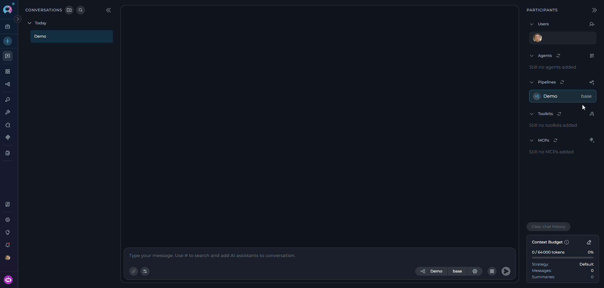

<Warning title="Published Version Limitations">
Published versions are read-only and cannot be edited. To modify a published version, create a new version or edit an existing draft version.
</Warning>

---

## <Icon icon="triangle-exclamation" size={32} /> Troubleshooting

<AccordionGroup>
  <Accordion title="Save button remains disabled">
    **Problem:** Required fields are missing or incomplete.

    - Review all fields marked with an asterisk (*) and ensure they are filled in
    - Verify that both **Name** and **Description** fields contain valid text
  </Accordion>
  <Accordion title="Pipeline creation fails due to invalid YAML">
    **Problem:** YAML syntax error in the workflow definition.

    - Verify YAML syntax — check proper indentation and structure
    - Use a YAML validator or start from a simple workflow template
  </Accordion>
  <Accordion title="Pipeline creation fails due to model configuration issues">
    **Problem:** Invalid or misconfigured LLM model settings.

    - Verify that a valid LLM model is selected
    - Ensure model settings are within acceptable ranges
    - Use default model settings initially, then customize as needed
  </Accordion>
</AccordionGroup>

<AccordionGroup>
  <Accordion title="Cannot access edit mode for existing pipeline">
    **Problem:** Insufficient permissions or version is published.

    - Verify you have the `applications.update` permission
    - Confirm the pipeline version is not in Published state (published versions are read-only)
    - Ensure no active operations are currently using the pipeline
  </Accordion>
  <Accordion title="Flow Editor tab is disabled">
    **Problem:** Pipeline has not been saved yet.

    - Save the pipeline first in the **Configuration** tab
    - The Flow Editor becomes available only after the initial pipeline save
  </Accordion>
  <Accordion title="Changes cannot be saved due to validation errors">
    **Problem:** One or more fields contain invalid values.

    - Review error messages displayed in the interface
    - Ensure all required fields maintain valid values
    - Check that external resources (models, toolkits, agents) are still accessible
  </Accordion>
</AccordionGroup>

<AccordionGroup>
  <Accordion title="Created pipeline doesn't appear in PARTICIPANTS">
    **Problem:** Pipeline may have been created in a different project context.

    - Refresh the interface
    - Verify the pipeline was created in the correct workspace/project
    - Ensure you are viewing the correct project context
  </Accordion>
  <Accordion title="Model configuration changes don't take effect">
    **Problem:** Model settings were closed without applying.

    - Reopen the model settings dialog
    - Make your changes and click **Apply** before closing
  </Accordion>
  <Accordion title="Cannot switch between pipeline versions">
    **Problem:** Unsaved changes are blocking the version switch.

    - Save or discard your current changes before switching versions
    - A confirmation dialog will appear if you try to switch with unsaved changes
  </Accordion>
</AccordionGroup>

---

<Info title="Related Documentation">
For additional information and related functionality, refer to these helpful resources:

- **[Pipeline Menu](../../menus/pipelines)** - Complete reference for pipeline management and configuration options
- **[Chat Menu](../../menus/chat)** - Comprehensive guide to chat interface features and navigation
- **[Credential Menu](../../menus/credentials)** - Detailed instructions for managing authentication credentials
- **[AI Configuration](../../menus/settings/ai-configuration)** - Setup and configuration guide for AI models and settings
- **[How to Create and Edit Agents from Canvas](./how-to-create-and-edit-agents-from-canvas)** - Similar guide for agent management
</Info>
