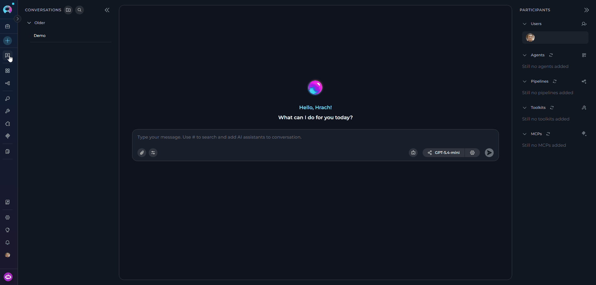
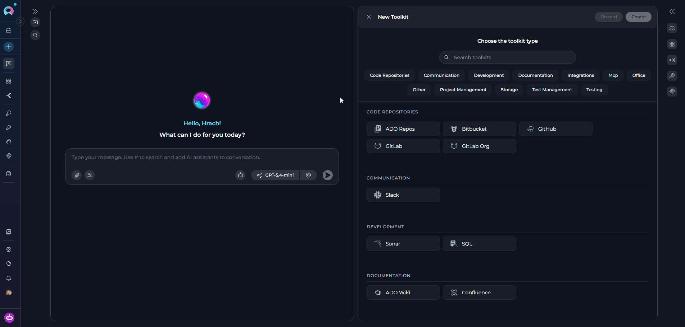
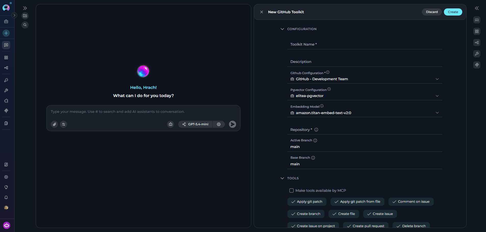
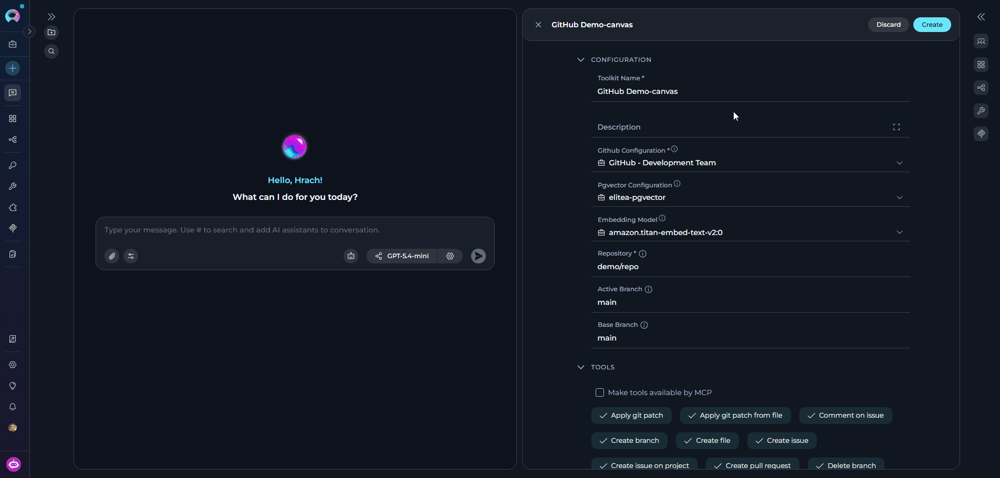
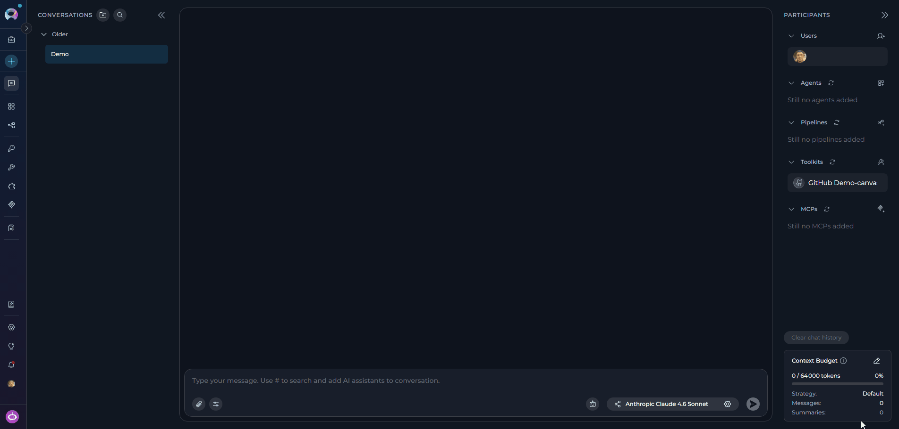

## Toolkit Canvas Feature: Visual Toolkit Management

The **Toolkit Canvas** interface in ELITEA serves as an integrated toolkit management system accessible directly from the chat interface. This feature enables you to create, configure, and manage toolkits without leaving your conversation context.

<CardGroup cols={3}>
  <Card title="Integrated Chat Experience" icon="comments">
    Access toolkit management directly from the PARTICIPANTS section in chat, maintaining conversation context while configuring integrations.
  </Card>
  <Card title="Real-time Validation" icon="circle-check">
    Configuration fields are validated in real-time, ensuring correct setup before the toolkit is created.
  </Card>
  <Card title="Instant Integration" icon="bolt">
    Created toolkits are immediately available for use in the current conversation and appear in the PARTICIPANTS panel.
  </Card>
  <Card title="Tool Testing Panel" icon="flask">
    Test individual toolkit tools directly in the editor — select a tool, provide input parameters, and run it before saving.
  </Card>
  <Card title="Secure Configuration" icon="shield-halved">
    Integrates with ELITEA's credential management system to ensure secure authentication for external services.
  </Card>
</CardGroup>

---

## Creating Toolkits via Canvas Interface

<Steps>
  <Step title="Access the Toolkit Creation Canvas">
    1. Navigate to the **Chat** page (main sidebar menu).
    2. In the chat input toolbar, click the **`+`** icon.
    3. Hover over **Toolkits** to expand the submenu.
    4. Click **Create New Toolkit** at the bottom of the submenu.

    The **Toolkit Editor** slides open, displaying the **"Choose the toolkit type"** selector.

    
  </Step>

  <Step title="Select a Toolkit Type">
    The type selector displays all available toolkit integrations, grouped by category. Categories are assigned by each toolkit's metadata and include groupings such as Code Repositories, Project Management, Documentation, Testing, Communication, and others.

    **To find a toolkit type:**

    - **Browse by category** — Scroll through the grouped list and click a toolkit type (e.g., **GitHub**, **Jira**, **Confluence**).
    - **Search** — Type in the **"Search toolkits"** field to filter by name. Results update in real-time.

    Available toolkit types include (among others):

    <Badge>GitHub</Badge> <Badge>GitLab</Badge> <Badge>Bitbucket</Badge> <Badge>Jira</Badge> <Badge>Confluence</Badge> <Badge>SharePoint</Badge> <Badge>SQL</Badge> <Badge>OpenAPI</Badge> <Badge>ServiceNow</Badge> <Badge>TestRail</Badge> <Badge>Zephyr Scale</Badge> <Badge>Sonar</Badge> <Badge>Rally</Badge> <Badge>Report Portal</Badge> <Badge>ADO Boards</Badge> <Badge>ADO Repos</Badge> <Badge>and more...</Badge>

    Clicking a toolkit type immediately loads its configuration form.

    

  </Step>
    
  <Step title="Configure the Toolkit">

    After selecting the toolkit type, the **Create Toolkit** canvas interface slides in with all available configuration fields. Fill in the sections relevant to your toolkit type:

    - **Toolkit Name** — Enter a clear, descriptive name for this toolkit instance.
    - **Description** — Provide a brief description to clarify the toolkit's purpose and usage.
    - **Credentials Configuration** *(varies by toolkit type)* — Configure authentication for the integration:
      - For toolkits that **require credentials** (e.g., GitHub, Jira): open the **Credentials** dropdown and either select an existing credential or create a new one.
      - For toolkits **without credential requirements** (e.g., Artifact): connection and configuration fields are shown directly on the canvas.
    - **PgVector Configuration** — Select or configure a PgVector connection to enable vector storage capabilities for document indexing and similarity search.
    - **Embedding Model** — Select an appropriate embedding model configuration to enable text processing and semantic search features.
    - **Parameters** *(varies by toolkit type)* — Additional integration-specific parameters such as URLs and endpoints, project identifiers, and custom configuration options.
    - **TOOLS** — Select which specific tools and actions to enable for this toolkit. Review the available tools carefully and enable only those needed for your use case — enabling only necessary tools improves security (principle of least privilege) and optimizes performance.
    - **Make Tools Available by MCP** *(optional checkbox)* — Enable this option to make the selected tools accessible through external MCP clients.

    <Note>
    Not all fields appear for every toolkit type. The canvas displays only the sections relevant to the selected toolkit's schema. Required fields are marked with an asterisk `*`.
    </Note>

    
  </Step>

  <Step title="Create the Toolkit">
    Once you have completed configuring your toolkit:

    1. Click the **Save** button to save all configuration changes.
    2. Click the **×** button to close the canvas interface.

    Your newly created toolkit will appear in the **PARTICIPANTS** section under **TOOLKITS** and becomes immediately available for use in conversations.

    
  </Step>
</Steps>

---

## Editing Toolkits via Canvas Interface

### Accessing Toolkit Edit Mode

1. Navigate to the **Chat** page where the toolkit is listed as a participant.
2. In the **PARTICIPANTS** section, locate the **Toolkits** group.
3. Hover over the toolkit you want to edit to reveal the action icons.
4. Click the pencil **Edit Toolkit** icon.

The Toolkit Editor opens with all current settings pre-populated.

### Modifying Toolkit Configuration

Once in edit mode you can modify any of the following:

<CardGroup cols={2}>
  <Card title="Description" icon="pen-to-square">
    Update the toolkit's description. Note that the toolkit name cannot be changed via the canvas interface.
  </Card>
  <Card title="Credentials & Connection" icon="key">
    Change the credential configuration or update any connection fields (API keys, URLs, repository paths, etc.) in the CONFIGURATION section.
  </Card>
  <Card title="Configuration Fields" icon="sliders">
    Update integration-specific parameters (URLs, endpoints, project identifiers, etc.). The available fields depend on the selected toolkit type.
  </Card>
  <Card title="Selected Tools" icon="toolbox">
    Toggle individual tools on or off in the TOOLS section to control which capabilities are exposed to the AI.
  </Card>
</CardGroup>
After making changes, click **Save** to apply them. On success: *"The toolkit has been updated successfully."* The **Save** button is disabled if no changes have been made.

---

## <Icon icon="triangle-exclamation" size={32} /> Troubleshooting

<AccordionGroup>
  <Accordion title="Create button remains disabled">
    **Problem:** The **Create** button is greyed out and cannot be clicked.

    The Create button is enabled only when **both** conditions are met:
    - A toolkit type has been selected from the type selector.
    - At least one field in the form has been filled in (the form has changes).

    Ensure you have selected a toolkit type first, then begin filling in the configuration fields.
  </Accordion>
  <Accordion title="Validation error on create or save">
    **Problem:** A toast message appears — *"Please fill in all required fields before creating the toolkit."*

    - Review all fields marked with an asterisk `*` and ensure they are completed.
    - Inline red borders and error text below individual fields indicate exactly which fields need attention.
    - Check that the **Toolkit Name** field is filled in — it is required for most toolkit types.
  </Accordion>
  <Accordion title="Save button is disabled in edit mode">
    **Problem:** The **Save** button is greyed out when editing an existing toolkit.

    - The Save button is only enabled when the form has unsaved changes. If you have not yet modified any field, the button remains disabled.
    - Make at least one change to any field (e.g., update the description or toggle a tool) before attempting to save.
  </Accordion>
  <Accordion title="Credential warning dialog appears when saving">
    **Problem:** A dialog titled *"Credential Configuration Change"* appears when attempting to save in a Team project.

    This warning is shown when you change the credential on a toolkit that is shared in a Team project. Switching to a **Private** credential means other team members without that credential will lose access to the toolkit's functionality.

    - Click **Confirm changes** to proceed with the new credential.
    - Click **Discard changes** to revert the credential field to its previous value.

    Consider using a **Team** credential rather than a Private one when the toolkit is shared across your team.
  </Accordion>
</AccordionGroup>

<AccordionGroup>
  <Accordion title="Cannot access edit mode for existing toolkit">
    **Problem:** The pencil edit icon is not visible or clicking it does nothing.

    - Hover directly over the toolkit row in the PARTICIPANTS panel — the action icons appear only on hover.
    - Verify you have the required permissions to edit toolkits in this project.
    - If the toolkit belongs to a public project that you do not have edit access to, the form fields will be read-only.
  </Accordion>
  <Accordion title="Toolkit not appearing in PARTICIPANTS after creation">
    **Problem:** The toolkit was created successfully but is not visible in the PARTICIPANTS panel.

    - After creation the toolkit is added to the available toolkits list but is **not automatically set as an active participant**. Locate it in the **+Add toolkit** dropdown and select it to add it to the current conversation.
    - Verify the toolkit was created in the correct project — check that you are viewing the right project in the sidebar.
    - If you still cannot find it, refresh the page and check again.
  </Accordion>
  <Accordion title="SharePoint toolkit shows an authentication error in chat">
    **Problem:** A SharePoint toolkit participant shows a warning or authentication error during a conversation.

    - SharePoint toolkits use OAuth authentication. If you have not completed the OAuth login flow, or if the session has expired, the toolkit will appear as logged out.
    - Open the toolkit settings from the PARTICIPANTS panel and complete the OAuth authorization step to re-authenticate.
  </Accordion>
  <Accordion title="MCP toolkit shows a logged-out warning in chat">
    **Problem:** An MCP-type toolkit participant displays a logged-out or disconnected warning in the PARTICIPANTS panel.

    - Remote MCP toolkits require an active authentication token. If the token has expired or was never set, the toolkit will show as logged out.
    - Re-authenticate by opening the toolkit's settings and completing the login step for the MCP connection.
  </Accordion>
</AccordionGroup>

---

<Info title="Related Documentation">
For additional information and related functionality, refer to these helpful resources:

- **[Toolkit Menu](../../menus/toolkits)** - Complete reference for toolkit management and configuration options
- **[Chat Menu](../../menus/chat)** - Comprehensive guide to chat interface features and navigation
- **[Credential Menu](../../menus/credentials)** - Detailed instructions for managing authentication credentials
- **[AI Configuration](../../menus/settings/ai-configuration)** - Setup and configuration guide for AI models and settings
- **[How to Create and Edit Agents from Canvas](./how-to-create-and-edit-agents-from-canvas)** - Similar guide for agent management
- **[How to Create and Edit Pipelines from Canvas](./how-to-create-and-edit-pipelines-from-canvas)** - Similar guide for pipeline management
</Info>

