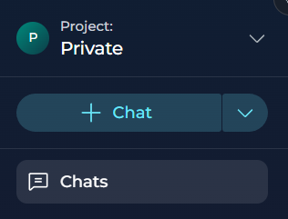
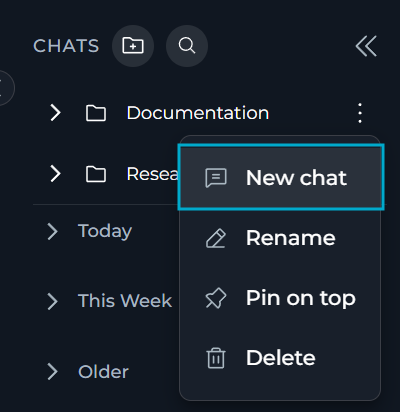
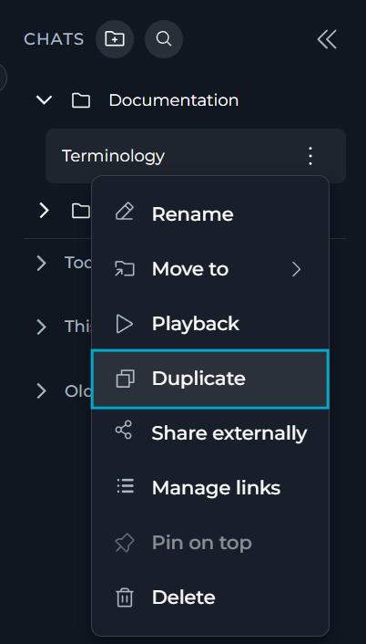
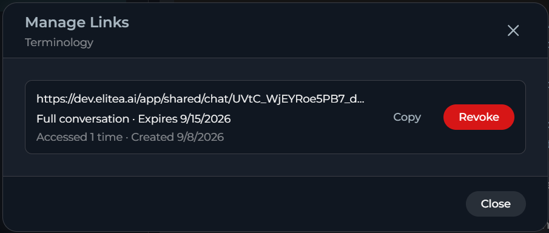
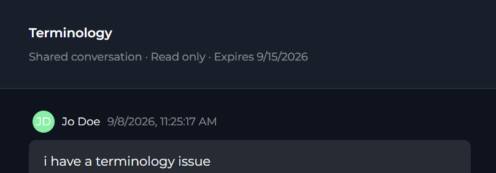
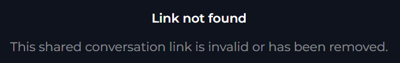
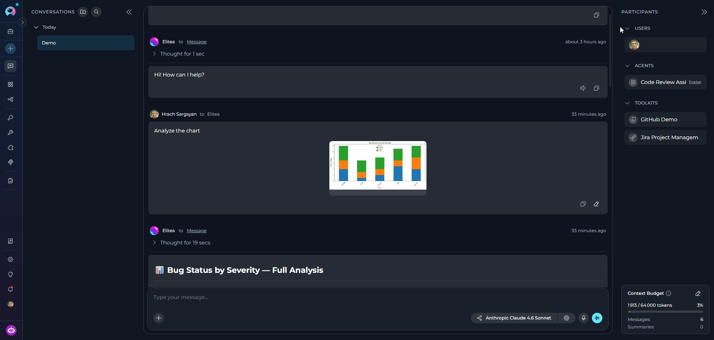
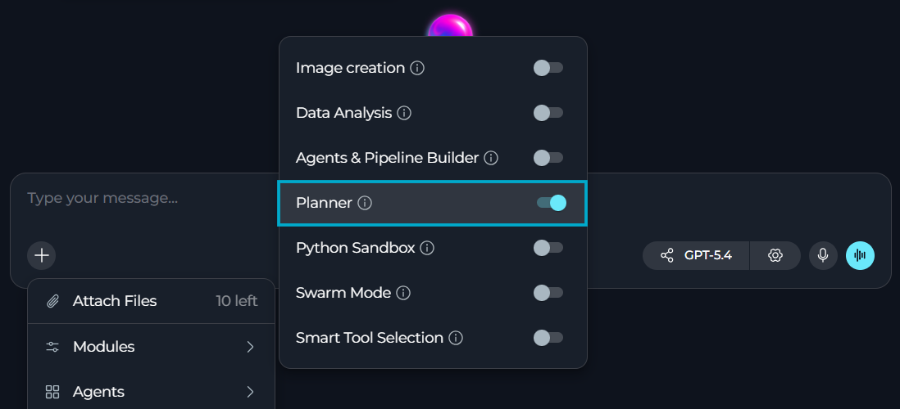

## Introduction

A Conversation in ELITEA represents a dynamic dialogue involving multiple participants. These can include language models (LLMs), Agents, Pipelines, Toolkits, MCPs, and human Users like yourself. You interact using natural language, and the chat maintains context, allowing you to refer to previous messages within the same conversation. Conversations are isolated; context is not shared between different conversations.

All your conversations are securely stored on the ELITEA server, making them accessible from any device where you log in. You can find all your conversations listed under the Chat menu in the sidebar.

**Key Features**

<CardGroup cols={3}>
  <Card title="Public & Private Conversations" icon="lock">
    Control visibility and collaboration by sharing conversations or keeping them private.
  </Card>
  <Card title="Diverse Participants" icon="users">
    Integrate Models, Agents, Pipelines, Toolkits, MCPs, and other Users (in public conversations).
  </Card>
  <Card title="Canvas Editor" icon="pen-to-square">
    Edit and refine AI-generated code, tables, diagrams, and DOCX files with built-in tools.
  </Card>
  <Card title="File Attachments" icon="paperclip">
    Upload and attach images and files for AI analysis and processing.
  </Card>
  <Card title="Modules" icon="wrench">
    Execute Python code, plan tasks, analyze data, create images, and more — no external integrations needed.
  </Card>
  <Card title="Rich Interactions" icon="comments">
    Engage with participants, copy responses, provide feedback, and regenerate outputs.
  </Card>
  <Card title="Conversation Management" icon="folder">
    Save, pin, share, delete, and organize conversations into folders.
  </Card>
  <Card title="Playback Mode" icon="play">
    Simulate and review conversation flows without engaging live models — ideal for demos.
  </Card>
</CardGroup>

## Create a New Chat

There are three ways to create a new chat in ELITEA:

<AccordionGroup>
  <Accordion title="By the Create button in the left sidebar" id="create-sidebar">
    Creating a chat from the sidebar is the quickest way to start a new conversation.

    1. In the left sidebar, locate the **Chat** section.
    2. Select the **+ Conversation** button at the top of the sidebar.

       

    3. Use the conversation controls to configure your new chat.
    4. Enter your first message and select **Send**, or press Enter, to create the conversation.
  </Accordion>

  <Accordion title="From a Folder" id="create-folder">
    Creating a new chat directly inside a folder will save your time moving conversations to the necessary folders after they are created.

    1. Go to the overflow menu of the folder, in which you want to create a new chat.
    2. Select **New chat**.

       

    3. Use the conversation controls to configure your new chat — select models, add participants, attach files or turn on modules.
    4. Enter your first message to create the chat inside the folder.

    ELITEA assigns the new conversation to the folder immediately, so you do not need to move it afterward.

    If you are already in the folder, any chats created from the **+ Chat** button in the left sidebar will also be automatically assigned to that folder.

    <Note>
    ELITEA disables **New chat** if you do not have permissions to create chats, or while a new folder has not been saved yet.
    </Note>
  </Accordion>

  <Accordion title="By Duplicating a Conversation" id="create-duplicate">
    You can duplicate a conversation to reuse its participants and settings without recreating them.

    <Note>
    **Duplicate** is unavailable while you are editing Canvas in the active conversation.
    </Note>

    1. Go to the overflow menu of the conversation you want to duplicate.
    2. Select **Duplicate**.

       

    ELITEA creates a new conversation with the same visibility and participants as the source conversation and opens it.

    <Note>
    The duplicate does not include messages of the source conversation, only its visibility and participants.
    </Note>

    ELITEA names the duplicate by appending "(1)" to the original name, or by incrementing the number already in parentheses (for example, duplicating "Report Review (1)" produces "Report Review (2)").

    If you duplicate a conversation inside a folder, the new conversation is **not** automatically assigned to that folder — you will need to move it manually.
  </Accordion>
</AccordionGroup>

All new conversations are created and appear in the **CHATS** sidebar.

For new  — not duplicated — conversations, ELITEA generates their name automatically based on your message content. You can manually rename any conversation at any time afterwards.

## Organize Chats

You can add your chats to forders for better organization and easier management.

### Create Folders

<Note title="Private, Team, and Public Conversations/Folders">
**Private:** In a private project, you can add all participant types except users. Folders and their contents are only accessible to you.

**Team Project:** You can view all folders within the project, but can only see conversations inside folders if you are a member. Members can move conversations into or out of folders; you cannot delete folders created by others. Public folders within a team project are visible to all members and cannot be converted back to private.
</Note>

1. Click the **folder icon** button in the header of the **CONVERSATIONS** sidebar (tooltip: *Create folder*).
2. Provide a **Name** for the folder.
3. Click **Save** to create the folder. The new folder will appear in the **CONVERSATIONS** sidebar.


### Move Chats to Folders

To organize conversations into folders:

**Method 1: Drag and Drop**

1. In the **CONVERSATIONS** sidebar, click and hold on the conversation you wish to move.
2. Drag the conversation over the destination folder.
3. Release to drop the conversation into the folder.

**Method 2: Context Menu**

1. In the **CONVERSATIONS** sidebar, right-click on the conversation you wish to move.
2. Select **Move to** from the context menu.
3. Choose the desired destination folder from the list, OR
4. Select **Create folder** to create a new folder and move the conversation into it simultaneously.
5. To move a conversation back to the main list, select **Back to the list** from the Move to menu.


### Manage Folders

Folders can be managed directly from the **CONVERSATIONS** sidebar. Right-click on a folder or click its associated options menu (**...**) to access the following actions:

* **Rename**: Rename the folder. Enter the new name and click the checkmark (✔) or **Save** button.
* **Pin/Unpin**: Select **Pin on top** in the folder contextual menu to keep the folder at the top of the **CONVERSATIONS** sidebar for quicker access. Select **Unpin** to remove it from the top.
* **Delete**: Remove the folder.  
  **Important**: Deleting a folder does not delete the conversations inside it. Conversations within a deleted folder are automatically moved back to the main conversation list (root level). You will be asked to confirm deletion.


## Share Conversations with External Users

You can share a conversation with people outside ELITEA through a secure, read-only link. Recipients do not need an ELITEA account to view the shared content.

**Create a Share Link**

1. Go to the overflow menu of the conversation you want to share.
2. Select **Share externally**.
3. In the **Share conversation** dialog, select what to share.

| Option | Description |
|--------|-------------|
| Entire conversation | Shares all messages and attachments. |
| Messages only | Shares only messages without attachments. |
| Attachments only | Shares only the attached files and images. |
| Select specific messages | Shares only the message groups you select from a checklist. You must select at least one message group to be able to share the conversation. |

4. Select an expiration for the link: **1 hour**, **24 hours**, **7 days** (default), **30 days**, or **Never expires**.
5. (optional) Enter a password to restrict access to the link. Your password must be at least 8 characters long.
6. Select **Generate link**.

ELITEA copies the link to your clipboard and displays it in the dialog.

<video controls width="100%" aria-label="Share conversation externally.">
  <source src="../../img/how-tos/chat-conversations/share-external.mp4" type="video/mp4" />
</video>

<Warning>
Anyone with the link can view the shared content. Do not share a link for a conversation that contains sensitive information.
</Warning>

**Manage or Revoke a Share Link**

1. Right-click the conversation, or select its options menu (**...**).
2. Select **Manage links**.
3. In the **Manage Links** dialog, review each link: its scope, expiration, password status and view count.
4. Select **Copy** to copy a link again, or select **Revoke** to disable it immediately.



<Note>
Only the conversation author can create, manage or revoke share links. Revoking a link blocks access immediately and cannot be undone — create a new link if you need to share the conversation again.
</Note>

**What Recipients See**

Recipients open the link in a browser. If the link has a password, ELITEA prompts for it before showing the conversation. The shared view is read-only: recipients can see the shared messages and attachments, but cannot reply, edit or add participants.



After 10 failed password attempts, ELITEA locks the link for 15 minutes before allowing another attempt.

After a link expires or is revoked, recipients see a message that the link is no longer available.



## Working with Participants

Participants are the core components you interact with within a conversation.

### Adding Participants (Agents, Pipelines, Toolkits, MCPs)

You can add various AI participants to enhance your conversations:

<Tabs>
  <Tab title="Method 1: Using the + Button">
    1. In the chat input toolbar, select the **`+`** icon (tooltip: *Add files, agents, toolkits and more…*).
    2. A popup menu opens. Hover over the category you want:
       - **Agents** — shows a searchable list of available agents
       - **Pipelines** — shows a searchable list of available pipelines
       - **Toolkits** — shows a searchable list of available toolkits (with a Public/Private toggle)
       - **MCPs** — shows a searchable list of available MCP servers (with a Public/Private toggle)
    3. Search by name in the submenu search box, then select a participant to add it.
    4. The added participant appears in the **PARTICIPANTS** panel on the right side of the screen.
    5. For **Agents** and **Pipelines**: selecting the participant in the panel activates it. An **AgentEditorPanel** strip appears above the input area showing the participant name, version selector, variables and a settings button.

    
  </Tab>
  <Tab title="Method 2: Using the # Symbol">
    1. In the chat input box, type `#` to open a **Search results** dropdown of available participants.
    2. Continue typing to filter by name (e.g., `#Jira` will show all Jira-related participants).
    3. Select a participant from the filtered list — the dropdown searches across **Agents**, **Pipelines**, **Toolkits** and **MCPs**.
    4. The selected participant appears in the **PARTICIPANTS** panel.

    
  </Tab>
</Tabs>

### Creating New Participants

You can create new participants directly from the chat interface via the `+` menu:

1. Select the **`+`** icon in the input toolbar.
2. Hover over the relevant category (Agents, Pipelines, Toolkits or MCPs).
3. Select the **Create New \{Type\}** option at the bottom of the submenu.
4. The corresponding Canvas editor opens inline.


The **PARTICIPANTS** panel shows one collapsible accordion per participant type — **Users**, **Agents**, **Pipelines**, **Toolkits** and **MCPs** — with the **Users** accordion shown only in team projects.



<Note title="Shared Toolkit Credentials">
If a toolkit in your Chat uses shared credentials that are not yet configured in your Personal workspace, a **Misconfiguration errors found. Check the toolkit.** message appears on the toolkit card. Clicking **Check the toolkit** opens the toolkit in the Canvas editor, where the **Credential setup required** warning banner is displayed. Click the **Create a credential** link to create the matching credential. See [Shared Toolkit Credentials](./toolkits#shared-toolkit-credentials) for details.


</Note>


### Adding Users to a Conversation

Users (team members) can only be added to in team projects. They cannot be added to private conversations.

**To Add Users:**

1. In the chat input toolbar, click the **`+`** icon.
2. Select **Invite Users** from the popup menu.
3. The **Add users** modal will appear with a search bar.
4. Use the search bar to find teammates by name.
5. Select one or more users from the list by clicking on them.
6. Click **Add** to confirm. The selected users will appear in the **Users** section of the **PARTICIPANTS** panel.

**Important Notes:**

* Added users will receive notifications about being added to the conversation.
* Users can also join a public conversation implicitly by interacting with it.
* Once a conversation is public, it cannot be converted back to private.
* Users can be removed by hovering over their avatar in the **Users** section of the Participants panel and clicking the remove icon.

For detailed information on adding teammates, see [Adding Teammates to Conversation](./add-teammates-to-conversation).


**Tips for Effective Collaboration in Team Projects**

* Use `@` mentions to notify specific teammates in a conversation.
* Group related conversations into folders for better navigation.
* Define roles, responsibilities, and deadlines directly in the chat.
* Regularly post progress updates and flag blockers in the conversation.

**Example: Collaboration in a Team Project**

<Accordion title="View collaboration scenario">
**Scenario**: The QA, PM, and BA team collaborate on a new file upload feature using a shared team project conversation.

**Steps:**

- **BA adds requirements:**
  ```
  @BA: "The new feature should allow users to upload files up to 10MB. The system must validate file types and provide error messages for unsupported formats."
  ```

- **PM sets the timeline:**
  ```
  @PM: "Development completes by May 15th. QA starts testing May 16th. Release target: May 20th."
  ```

- **QA plans testing:**
  ```
  @QA: "I'll create test cases for uploads, file types, size limits, and error handling. @BA, does the system support drag-and-drop uploads?"
  ```

- **BA clarifies:**
  ```
  @BA: "Yes, drag-and-drop should be supported. Also add a progress bar during uploads."
  ```

- **PM tracks progress:**
  ```
  @PM: "QA, please share test results by May 18th for pre-release review."
  ```

The PM creates a **"Feature: File Upload"** folder and moves the conversation there so all team members can find it easily.
</Accordion>

### Using Participants in a Conversation

Once added, participants are ready to process your messages:

1. **Check Participants**: Ensure the desired participant is listed in the **Participants** section.
2. **Select Active Participant(s)**: 
       - **Click**: Click the participant's name/icon in the **Participants** list to make it active for your next message.
3. **Mention Users** (Team Projects only): Hover over user avatars in the participant list or type **@username** in the chat input to mention and notify teammates in the conversation. To mention everyone in the conversation, select the **All Users** option.
4. **Send Message/Command**: Type your message or a simple command (like "Go", "Execute", "Run it") and press **Send**. The active participant(s) will process your input.

#### Mentioning Toolkits and Tools

You can direct the AI to use a specific tool from an already-added toolkit by typing `/` in the chat input. This is a two-phase selection:

**Select a Toolkit:**

1. In the chat input box, type `/` to open the **Mention toolkit** dropdown.
2. The dropdown lists all toolkits that are already added as participants in the current conversation.
3. Continue typing to filter by toolkit name (e.g., `/Jira` filters to Jira-related toolkits).
4. Click a toolkit name from the dropdown, or type the full name and press `/` again to confirm it.
5. The input updates to `/{ToolkitName}/` and the dropdown switches to show the toolkit's available tools.

**Select a Tool:**

6. The dropdown now shows **"{ToolkitName} available tools"** with all tools exposed by that toolkit.
7. Continue typing after the second `/` to filter tools by name (e.g., `/Jira/create` shows create-related tools).
8. Each tool shows its name and a short description.
9. Click the desired tool to confirm the selection.
10. The mention is committed to the input as `/{ToolkitName}/{ToolName}` with a cyan highlight and a trailing space so you can continue typing your message.


You can include multiple toolkit tool mentions in a single message, and they can be placed anywhere within the message. For example: `Please use /Jira/createIssue to create a new issue and then /GitHub/createPR to create a pull request.`

Each mention is highlighted independently and sent to the AI as separate tool directives.

<Note>
The `/` mention works with both **Toolkits** and **MCP** participants that are already added to the conversation. If a toolkit or MCP does not appear in the dropdown, add it first via the **`+`** button in the input toolbar or by typing `#`. Toolkits and MCPs with misconfiguration errors are excluded from the dropdown until the configuration issue is resolved.
</Note>

<Accordion title="Example Usage">
* **To ask a general question using a specific model**:
    1. Select a model from the model selector dropdown (e.g., `GPT-4o`).
    2. Type: `"Explain the concept of recursion in programming."` -> **Send**.

* **To use a specific agent**:
    1. Click the **`+`** icon in the input toolbar and hover over **Agents**.
    2. Select `Data Analysis Agent` from the submenu, or type `#Data Analysis Agent` in the input box.
    3. Type your request: `"Analyze the latest sales data."` -> **Send**.

* **To use a toolkit**:
    1. Click the **`+`** icon and hover over **Toolkits**. Select the desired toolkit (e.g., `Artifact Toolkit`).
    2. Type: `"Store this data in artifacts."` -> **Send**.

* **To mention a team member** (Team Projects only):
    1. In your message, type `@` followed by the team member's name (e.g., `@John Doe`).
    2. Type: `"@John Doe, can you review this analysis?"` -> **Send**.
</Accordion>

### Configuring Participants

You can configure and edit participants (Agents, Pipelines, Toolkits, and MCPs) directly within the conversation using the Canvas editor.

**Accessing Participant Settings:**

1. **Option 1**: Click the participant in the **Participants** list, then click the **⚙️** (settings) icon.
2. **Option 2**: Hover over the participant element in the **Participants** list and click the **Edit** icon that appears.
3. The appropriate **Canvas** editor will open based on the participant type.

**What You Can Configure:**

<Tabs>
  <Tab title="Agents">
    - Edit the agent's **prompt** and instructions
    - Modify **variables** used by the agent
    - Configure **model settings** 
    - Select the agent **version** (default is "base")
    - Adjust **toolkits** and integrations

    [→ Agent Canvas Guide](./how-to-create-and-edit-agents-from-canvas)
  </Tab>

  <Tab title="Pipelines">
    - Edit the pipeline **workflow** and step sequences
    - Modify **variables** and parameters
    - Configure **agents** used in the pipeline
    - Adjust **toolkits** and integrations
    - Select the pipeline **version** (default is "base")

    [→ Pipeline Canvas Guide](./how-to-create-and-edit-pipelines-from-canvas)
  </Tab>

  <Tab title="Toolkits">
    - Configure **integration settings** and credentials
    - Adjust **tool parameters** and options
    - Enable or disable specific tools within the toolkit
    - Modify **connection settings** for external services

    [→ Toolkit Canvas Guide](./how-to-create-and-edit-toolkits-from-canvas)
  </Tab>

  <Tab title="MCPs">
    - Configure **server connection** settings
    - Adjust **tool availability** and permissions
    - Modify **environment variables** and parameters
    - Set **timeout** and performance options

    <Info>
    MCP servers must be running before they can be used in conversations. Ensure your MCP server is started and accessible before adding it as a participant.
    </Info>

    [→ MCP Canvas Guide](./how-to-create-and-edit-mcps-from-canvas)
  </Tab>
</Tabs>

**Applying Changes:**

1. Make your edits in the Canvas editor.
2. Click the **Save** button to apply your modifications.
3. The updated configuration will be used for subsequent messages in the conversation.


## Interacting with Conversation Outputs

### Editing Your Last Message

If you want to refine your prompt instead of sending a brand-new follow-up, ELITEA lets you edit your last user message and regenerate the answer from that updated text.

1. Locate your most recent user message.
2. Use the action icons shown under that message, then click the **Edit** (pencil) icon.
3. The message switches into inline edit mode.
4. If the original message included attachments, they remain visible in edit mode and are not lost automatically.
5. Update the text as needed.
6. If needed, remove an existing attached file from the edit view, or use the **attach** icon on the left side to add a new file.
7. Click **Save and apply** to submit the edited message and regenerate the answer, or click **Cancel** to discard your changes.

<Note>
The edit action is shown as **Edit the message and regenerate answer**. The **Save and apply** button stays disabled until the message content changes and the edited text is not empty.

When you edit the last message, existing attachments stay attached and visible by default. You can remove any existing file if you no longer want to send it, and you can add new attachments from the attach icon on the left side of the editor.
</Note>

### Like/Dislike and Commenting

1. Below each generated response, you'll see **Thumbs Up (👍)** and **Thumbs Down (👎)** icons.
2. Click **Thumbs Up** to indicate satisfaction.
3. Click **Thumbs Down** to indicate dissatisfaction.
4. After clicking **Thumbs Down**, a **Leave comment** field appears. Click it, type your specific feedback or reason for disliking, and press **Send** (or **Enter**). This feedback is valuable for improving models and prompts.


### Regenerating the Last Output

1. If you're not satisfied with the very last response generated by a participant, you can ask it to try again.
2. Ensure a response has been generated.
3. Click the **Regenerate** icon 🔄 usually located near the last message or the input box.
4. The system will use the same input/prompt that generated the last response and attempt to create a new, potentially improved, output.


## Using Canvas for Content Editing

Canvas is your all-in-one workspace for editing, refining, and collaborating on AI-generated content in ELITEA. Instead of copying results into other tools, you can work directly with code, tables, and diagrams—right where the conversation happens.

**What is Canvas?**

Canvas is a built-in editor that appears automatically when ELITEA generates code, tables, or Mermaid diagrams in a chat. It allows you to edit, refine, and export AI-generated content without leaving the conversation.

**Canvas Features:**

<CardGroup cols={2}>
  <Card title="Code Editor" icon="code">
    Edit code with syntax highlighting, find/replace, and code folding. Export as `.py`, `.js`, `.java`, and more.
  </Card>
  <Card title="Table Editor" icon="table">
    Modify tables with spreadsheet-like functionality. Add/remove rows and columns, sort, filter, and export to XLSX or Markdown.
  </Card>
  <Card title="Diagram Editor" icon="diagram-project">
    Edit Mermaid diagrams with live preview and syntax highlighting. Export as PNG, JPG, or SVG.
  </Card>
  <Card title="DOCX Editor" icon="file-word">
    Edit `.docx` files from Artifacts in a full WYSIWYG interface — formatting toolbar, ruler, zoom control, save directly to the Artifact bucket.
  </Card>
</CardGroup>

<Info title="Opening the DOCX Editor">
The pencil icon (✏️) does **not** appear for DOCX files in chat. Open DOCX files via the **View/Edit file icon** in Artifacts or chat attachments instead.
</Info>

**How to Use Canvas:**

1. Ask ELITEA to generate code, a table, or a Mermaid diagram.
2. When ELITEA generates the content, look for the pencil icon (✏️) in the top-right corner of the content block.
3. Click the icon to open the Canvas editor in a modal window.
4. Make your edits using the available tools:
      - **Copy**: Copy content to clipboard
      - **Undo/Redo**: Revert or reapply actions
      - **Save**: Save your changes
      - **Export**: Download in various formats
5. Click **Save** to preserve your changes in the conversation or **Export** to download files.

For detailed information, real-world examples, and best practices, see [Canvas in Conversation](./how-to-canvas).


## Attaching Files and Images

Attach files and images directly to chat conversations for AI-powered analysis. This feature enables multimodal interactions where AI can process visual content, documents, and data files alongside text-based queries.

Every file you attach is automatically uploaded to the default `attachments` bucket — no manual Artifact Toolkit configuration is required. Files are accessible from the **Artifacts** section.

* **Images** are sent directly to the LLM for real-time vision analysis.
* **Non-image files** (documents, code, data) are indexed into a vector database and retrieved via semantic search.

**Attachment Limits:**

| Limit | Value |
|-------|-------|
| Max files per message | 10 |
| Max total size | 150 MB |
| Max size per file | 150 MB |
| Max image attachments | 10 |

**How to Attach Files:**

1. In the chat input toolbar, click the **`+`** icon.
2. Click **Attach Files**.
3. The native file browser opens — select one or more files.
4. Selected files appear as chips above the input field. To remove a file, click the **×** on its chip.
5. Type your message and press **Send**.

     

You can also attach files by:
- **Drag and drop** — drag files directly onto the chat input area.
- **Paste** — paste files or images from your clipboard with **Ctrl+V** / **Cmd+V**.

**Availability by Chat Type:**

| Context | Attachment availability |
|---------|------------------------|
| **Direct LLM / model chat** | Always enabled — **Attach Files** is active whenever no agent or pipeline is selected. |
| **Agent-based chat** | Only enabled if the agent has **Allow Attachments** toggled on in **Modules**. If not enabled, **Attach Files** is grayed out with the tooltip: *"Attachments aren't available for the selected agent or pipeline."* |
| **Pipeline-based chat** | Same rule as agents — requires `attachments` in **Modules**. |

<Tip title="Enable attachments for an agent">
To enable attachments for an agent,
1. Open the agent.
2. Find **Modules**.
3. Toggle **Allow Attachments** on.
4. Select **Save**.
</Tip>

For detailed information about attachments, including agent configuration and file management, see [Attach Files](./attach-files).


## Using Modules

Modules provide built-in capabilities that enhance your conversations without requiring external integrations. They can be enabled directly from the chat interface or configured as part of an agent's default setup.

**Available Modules**

<Tabs>
  <Tab title="Python Sandbox">
    Execute Python code securely in conversations using Pyodide (Python compiled to WebAssembly). Useful for calculations, data processing, testing algorithms, and generating visualizations.

    | Capability | Description |
    |-----------|-------------|
    | **Secure Execution** | Run Python code in a secure sandbox environment |
    | **Package Support** | Install and use packages like numpy, pandas, and matplotlib |
    | **Persistent State** | Code execution maintains state within the same conversation |
    | **Visualizations** | Generate data visualizations and reports inline |

    **Use Cases**: Execute code snippets, perform calculations, test algorithms, process data.

    [→ Python Sandbox Guide](./python-sandbox-internal-tool)
  </Tab>

  <Tab title="Planner">
    Create, manage, and track tasks and action items directly within chats. Set priorities, due dates, and monitor task progress without switching to external tools.

    | Capability | Description |
    |-----------|-------------|
    | **Task Decomposition** | Break down complex requests into smaller, actionable tasks |
    | **Workflow Organization** | Create structured plans with clear steps and dependencies |
    | **Progress Tracking** | Monitor completion with priority levels (High / Medium / Low) |
    | **Task Status** | Track tasks through Pending, In Progress, and Completed states |

    **Use Cases**: Project planning, feature development breakdown, complex problem-solving.

    [→ Planner Guide](./planner-internal-tool)
  </Tab>

  <Tab title="Data Analysis">
    Perform Pandas-based data analysis on uploaded files (CSV, Excel, etc.) using natural language queries. Automatically processes data and generates charts with downloadable results.

    | Capability | Description |
    |-----------|-------------|
    | **Natural Language** | Use plain English to request data analysis operations |
    | **File-Based Analysis** | Works with files uploaded directly to chats |
    | **Auto Processing** | Intelligent file format detection and data analysis |
    | **Chart Generation** | Automatic creation of visualizations with downloadable results |

    **Use Cases**: Data exploration, statistical analysis, trend identification, report generation.

    [→ Data Analysis Guide](./data-analysis-internal-tool)
  </Tab>

  <Tab title="Image Creation">
    Generate AI-powered images from text prompts directly within chats. Requires an image generation model configured in your project.

    | Capability | Description |
    |-----------|-------------|
    | **Text-to-Image** | Describe what you want and the AI generates the image |
    | **Inline Results** | Generated images appear directly in chat |

    **Use Cases**: Mockups, illustrations, visual assets for presentations and documentation.
  </Tab>

  <Tab title="Smart Tools Selection">
    Optimizes token usage when working with many toolkits by dynamically loading tool schemas on demand instead of binding all tools upfront.

    | Capability | Description |
    |-----------|-------------|
    | **On-Demand Loading** | Tool schemas are loaded only when needed, reducing context overhead |
    | **Recommended For** | Chats using 5 or more toolkits |

    **Use Cases**: Large-scale automation tasks involving many different integrations.

    [→ Smart Tools Selection Guide](./smart-tools-selection-internal-tool)
  </Tab>

  <Tab title="Swarm Mode">
    Enables multi-agent collaboration by allowing all child agents to share the full chat history and hand off control to each other.

    | Capability | Description |
    |-----------|-------------|
    | **Shared Context** | All child agents see the full chat history |
    | **Agent Handoff** | Agents transfer control to the most appropriate specialist |

    **Use Cases**: Complex workflows requiring multiple specialized agents working as a team.

    [→ Swarm Mode Guide](./swarm-mode-internal-tool)
  </Tab>

  <Tab title="Agent & Pipeline Builder">
    Exposes built-in MCP tools directly inside chats. Once enabled, the AI can manage agents, pipelines, chats, and toolkits through natural language — without leaving the chat interface.

    | Capability | Description |
    |-----------|-------------|
    | **Agent & Pipeline Management** | Create and manage agents and pipelines from within a conversation |
    | **Chat Management** | Manage chats and participants programmatically |
    | **Toolkit Management** | Configure toolkits through natural language requests |

    **Use Cases**: Administrative tasks, resource management, and platform configuration without context-switching.

    [→ Agent & Pipeline Builder Guide](./agents-&-pipeline-builder)
  </Tab>
</Tabs>

**Enabling Modules in Chats**

1. Go to your chat.
2. In the chat toolbar, select **+**.
3. Select **Modules**.
4. Toggle the selected module on or off to enable or disable it.



Once enabled, the AI assistant can automatically use these tools during the chat when appropriate.

**Enabling Modules in Agents**

You can also enable modules as part of an agent's default configuration. This makes the tools available in all new chats using that agent.

1. Navigate to **Agents** in the main menu and select the agent.
2. Expand **MODULES**.
3. Toggle the desired tools ON.
4. Click **Save**.
5. The enabled modules will be available in all new chats using this agent.

**Using Modules**

Once enabled, the AI assistant can use the modules during chats:

* **Python Sandbox**: The assistant can execute Python code, install packages, perform calculations, and generate visualizations
* **Planner**: The assistant can break down complex tasks, create structured plans with priorities and due dates, and track task progress
* **Data Analysis**: The assistant can perform comprehensive data analysis on uploaded files using natural language commands

For detailed usage examples, troubleshooting, and best practices, see:

* [Python Sandbox Guide](./python-sandbox-internal-tool)
* [Planner Guide](./planner-internal-tool)
* [Data Analysis Guide](./data-analysis-internal-tool)
* [Smart Tools Selection Guide](./smart-tools-selection-internal-tool)
* [Swarm Mode Guide](./swarm-mode-internal-tool)
* [Agent & Pipeline Builder Guide](./agents-&-pipeline-builder)

## Voice Capabilities

Chat includes voice input and voice output capabilities that let you speak your messages and have AI responses read back to you.

<CardGroup cols={3}>
  <Card title="Voice Input" icon="microphone">
    Dictate messages into the chat input field. Transcribed text is inserted at the cursor position in real time.
  </Card>
  <Card title="Text-to-Speech" icon="volume-high">
    Have AI responses read aloud. Pause and resume playback from a mini-player pill in the input area.
  </Card>
  <Card title="Speaking Mode" icon="waveform-lines">
    Hands-free voice conversation loop. ELITEA records, sends, speaks the response, and listens again — automatically.
  </Card>
</CardGroup>

### Voice Input

**Voice Input** lets you dictate messages directly into the chat input field using a microphone. The transcribed text is inserted at the **current cursor position**, so you can combine typed and spoken content in the same message — position your cursor anywhere in the text before starting to record.

**How to use Voice Input:**

1. (Optional) Click inside the input field and place the cursor where you want the dictation inserted.
2. Click the **microphone** icon in the message input toolbar (tooltip: *Start voice input*) to start recording.
3. The mic icon turns **teal** and a **Stop (■)** button appears beside it in a pill-shaped container — this indicates active recording.
4. Speak your message. A live transcript appears in the input field in real time. Interim (in-progress) words are shown immediately and replaced by the final transcript as recognition completes.
5. Click the **Stop (■)** button (tooltip: *Stop dictation*) to finish recording. The final transcript is committed at the cursor position and focus returns to the input field.
6. Review the transcribed text, then press **Send** to send your message.

<Info title="Note">
The **Send** button is disabled while recording is active. Stop recording before sending.
</Info>

   

<Note>
**ASR model selection.** ELITEA selects the best available speech recognition source in the following priority order:

1. **Server-side Realtime/Streaming ASR model** (default model first, if configured in [Settings → AI Configuration → Speech Recognition](./settings/ai-configuration#speech-recognition-asr))
2. **Server-side Whisper ASR model** (default model first — batch transcription with slightly higher latency)
3. **Browser Web Speech API** (built-in browser fallback, no server configuration required)
4. **Microphone icon hidden** — if none of the above is available, the button is not shown

If an administrator has temporarily disabled voice features, the microphone icon is visible but grayed out with the tooltip *"Temporarily disabled by admin"*.
</Note>

### Text-to-Speech

**Text-to-Speech** reads AI responses aloud. A **Read out** button (megaphone icon) appears in the action bar below each AI message when the message contains speakable text.

**How to use Text-to-Speech:**

1. Click the **Read out** (megaphone) button below an AI message to start playback.
2. The text is read aloud and a **playback pill** appears in the input area containing:
   - A **megaphone** icon
   - A **Stop (■)** button (tooltip: *Stop speaking*) — click to stop playback
   - A **Voice settings (⚙)** gear icon (tooltip: *Voice settings*) — opens the Voice Settings dialog. Disabled while playback is active.
3. To restart playback after stopping, click the **Play (▶)** button that replaces the Stop button in the pill.

   

<Note>
When a TTS model is configured in [**Settings → AI Configuration → Text to Speech (TTS)**](./settings/ai-configuration#text-to-speech-tts), ELITEA uses that model for audio generation. If no TTS model is configured, playback uses the browser's built-in SpeechSynthesis API as a fallback.
</Note>

**Voice Settings:**

Click the **⚙** gear icon in the playback pill (only available when playback is stopped) to open the **Voice settings** dialog. Settings are saved to your browser and persist across sessions.

| Setting | Description |
|---------|-------------|
| **Voice** | Select the voice to use for playback. When a server-side TTS model is configured, the list shows that model's available voices. Without a server TTS model, the list shows your browser's built-in speech synthesis voices (non-local voices are marked *"online"*). |
| **Speed** | Controls playback rate. Range: **0.5×** (slower) to **2×** (faster). Default: **1×**. |
| **Volume** | Controls playback volume. Range: **Mute (0%)** to **100%**. Default: **100%**. |
| **Preview Voice** | Plays a short sample sentence with the currently selected voice and settings. Only available when playback is not active. |

Click **Apply** to save, or **Cancel** to discard changes.

   


<Tip title="Global voice preferences">
You can also configure voice preferences globally under **User Settings → Profile → Voice Personalization**. These settings apply as the default for all new TTS playbacks across all conversations.
</Tip>

### Speaking Mode

<Warning>
Speaking Mode is only available **after the conversation has been created** — meaning at least one message must have been sent first. The voicewave icon does not appear in a brand-new, unsent conversation. Send your first message to initialize the conversation, then use Speaking Mode for subsequent turns.
</Warning>

**Speaking Mode** is a continuous, hands-free voice conversation loop. Once activated, ELITEA automatically records your speech, sends your message after a pause, plays back the AI's response, and then starts listening again — without any manual interaction between turns.

**How to activate Speaking Mode:**

1. Leave the message input field empty.
2. Click the **voicewave** icon (shown in place of the Send button when the input is empty) to enter Speaking Mode.
3. A voicewave pill with an **Exit** (✕) button replaces the send button, indicating Speaking Mode is active.
4. Speak your message. After **3 seconds of silence**, your message is automatically sent.
5. The AI response streams in and is read aloud via Text-to-Speech.
6. Once the response finishes playing, recording starts again automatically for the next turn.
7. Click the **✕** button in the voicewave pill to exit Speaking Mode at any time.


<Note>
Speaking Mode requires a voice recognition source (server ASR model or browser Web Speech API) for input and uses Text-to-Speech for output. If you start manual voice input while Speaking Mode is active, Speaking Mode is automatically deactivated.
</Note>


## Playback Mode

Playback mode allows you to step through an existing conversation turn by turn, exactly as it happened, without actually sending requests to the Models, Toolkits, etc.

   

<CardGroup cols={3}>
  <Card title="Purpose" icon="circle-info">
    Demonstrate workflows, review complex interactions, or debug without incurring processing costs or waiting for live responses.
  </Card>
  <Card title="Activation" icon="play">
    Access via the conversation's context menu in the sidebar — right-click a conversation and select **Playback**.
  </Card>
  <Card title="Controls" icon="sliders">
    Move forward to the next message, go back to the previous message, or stop the playback simulation using the on-screen controls or keyboard arrow keys.
  </Card>
</CardGroup>

**Example: Using Playback Mode for a Demo**

**Scenario**:  
A Product Manager is preparing a demo for stakeholders to showcase how the team collaborated on a new feature. They use Playback Mode to simulate the conversation and highlight key decisions and actions.

**Steps to Use Playback Mode**:

**Access the Conversation**:  
   The Product Manager navigates to the conversation in the **CONVERSATIONS** sidebar where the team discussed the feature.

**Activate Playback Mode**:  
   The Product Manager right-clicks on the conversation and selects **Playback** from the context menu.

**Simulate the Conversation**:  
   - The playback starts with the BA's initial message outlining the feature requirements.  
     Example:  
     ```
     @BA: "The new feature should allow users to upload files up to 10MB in size. The system must validate file types and provide error messages for unsupported formats."
     ```
   - The PM uses the **Next** control to move to the next message, where they set the timeline for development and testing.  
     Example:  
     ```
     @PM: "The development team will complete the implementation by May 15th. QA can start testing on May 16th, and we aim to release the feature by May 20th."
     ```
   - The QA's message about testing strategies is reviewed next.  
     Example:  
     ```
     @QA: "I will create test cases for file uploads, including valid and invalid file types, file size limits, and error handling."
     ```

**Highlight Key Decisions**:  
   - The Product Manager pauses playback to explain the rationale behind certain decisions, such as the timeline or testing strategy.
   - They resume playback to show the BA's clarification about drag-and-drop uploads.  
     Example:  
     ```
     @BA: "Yes, drag-and-drop uploads should be supported. Additionally, the system should display a progress bar during uploads."
     ```

**Conclude the Demo**:  
   - The Product Manager stops playback after showcasing the final message tracking progress.  
     Example:  
     ```
     @PM: "QA, please share the test results by May 18th so we can review them before the release."
     ```

**Benefits of Playback Mode for Demos**

* **Polished Presentations**: Playback Mode ensures a smooth and professional demo without interruptions or delays.
* **Clarity**: Stakeholders can see the exact flow of discussions and decisions.
* **Engagement**: The step-by-step simulation keeps the audience engaged and focused on key points.

By using Playback Mode, teams can effectively demonstrate their collaboration and decision-making processes to stakeholders, ensuring transparency and alignment.