## Introduction to Chat Functionality

A Conversation in ELITEA represents a dynamic dialogue involving multiple participants. These can include language models (LLMs), Agents, Pipelines, Toolkits, MCPs, and human Users like yourself. You interact using natural language, and the chat maintains context, allowing you to refer to previous messages within the same conversation. Conversations are isolated; context is not shared between different conversations.

All your conversations are securely stored on the ELITEA server, making them accessible from any device where you log in. You can find all your conversations listed under the Chat menu in the sidebar.

**Key Features**

<CardGroup cols={3}>
  <Card title="Public & Private Conversations" icon="lock">
    Control visibility and collaboration by sharing conversations or keeping them private.
  </Card>
  <Card title="Diverse Participants" icon="users">
    Integrate Models, Agents, Pipelines, Toolkits, MCPs, and other Users (in public conversations).
  </Card>
  <Card title="Canvas Editor" icon="pen-to-square">
    Edit and refine AI-generated code, tables, diagrams, and DOCX files with built-in tools.
  </Card>
  <Card title="File Attachments" icon="paperclip">
    Upload and attach images and files for AI analysis and processing.
  </Card>
  <Card title="Internal Tools" icon="wrench">
    Execute Python code, plan tasks, analyze data, create images, and more — no external integrations needed.
  </Card>
  <Card title="Rich Interactions" icon="comments">
    Engage with participants, copy responses, provide feedback, and regenerate outputs.
  </Card>
  <Card title="Conversation Management" icon="folder">
    Save, pin, share, delete, and organize conversations into folders.
  </Card>
  <Card title="Playback Mode" icon="play">
    Simulate and review conversation flows without engaging live models — ideal for demos.
  </Card>
</CardGroup>

## Getting Started

### Creating a New Conversation

1. In the main sidebar on the left, locate the **Chat** section.
2. Click the **+ Conversation** button at the top of the sidebar.
3. The chat input field appears and is highlighted to focus your attention.
4. You'll see a welcome screen with the message "Hello, [Your Name]! What can I do for you today?"
5. The message input box at the bottom shows the placeholder: "Type your message. Use # to search and add AI assistants to conversation."
6. **Choose your approach:**
      - **Add a participant first**: Type `#` to search and select an Agent, Pipeline, Toolkit, or MCP from the dropdown list that appears. Selected participants will appear as chips above the input box.
      - **Select a model**: Click the model selector dropdown to choose an LLM (e.g., GPT-4, Claude).
7. **Type your message**: Enter your initial message, question, or command (e.g., "Help me write a Python script", "What are the best practices for API design?", "Explain quantum computing").
8. **Send**: Click the **Send** icon (paper airplane icon) or press Enter.
9. The new conversation is created and appears in the **CONVERSATIONS** sidebar on the left.
10. The conversation name is automatically generated based on your message content. During name generation (1-2 seconds), you'll see a loader icon with "Naming" text next to the conversation item. You can manually rename it at any time after generation completes.

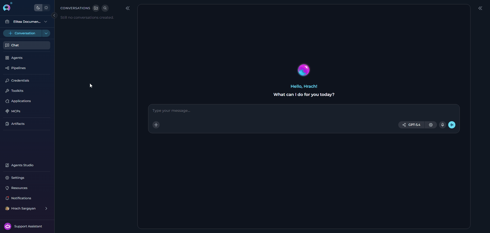

### Creating a New Folder

Organize your conversations by grouping them into folders.

1. In the **Conversations** sidebar, locate the folder icon button next to "Conversations" at the top.
2. Click the **folder icon** (Create folder button).
3. A new folder entry will appear. Enter a descriptive **Name** for your folder.
4. Press Enter or click the checkmark to save.

The new folder will appear in your **CONVERSATIONS** sidebar.  

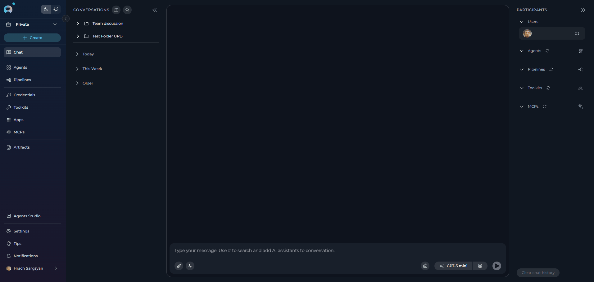

## Managing Conversations

### Moving Conversations to Folders

To organize conversations into folders:

**Method 1: Drag and Drop**

1. In the **CONVERSATIONS** sidebar, click and hold on the conversation you wish to move.
2. Drag the conversation over the destination folder.
3. Release to drop the conversation into the folder.

**Method 2: Context Menu**

1. In the **CONVERSATIONS** sidebar, right-click on the conversation you wish to move.
2. Select **Move to** from the context menu.
3. Choose the desired destination folder from the list, OR
4. Select **Create folder** to create a new folder and move the conversation into it simultaneously.
5. To move a conversation back to the main list, select **Back to the list** from the Move to menu.

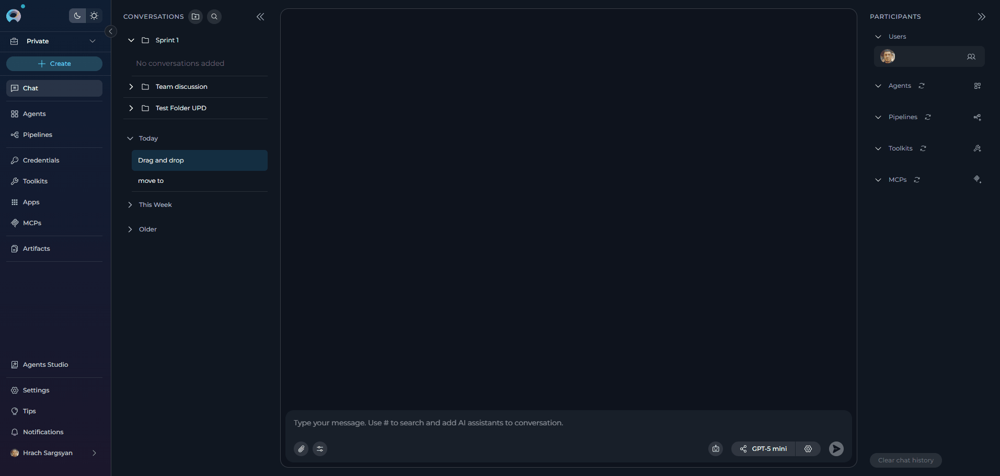

### Conversation Actions (Sidebar)

You can manage conversations directly from the **CONVERSATIONS** sidebar by right-clicking on a conversation or clicking the options menu (often **...**) associated with it. The following actions are available:

* **Edit**: Rename the conversation. Enter the new name and confirm.
* **Pin / Unpin**: Select **Pin** to keep the conversation at the top of the list for easy access. Select **Unpin** on a pinned conversation to remove it from the top.
* **Move To**: Move the conversation into a folder, as described above.
* **Make Public**: Convert a private conversation into a public one, visible to other project members.  
     **Caution**: This action is irreversible; you cannot make a public conversation private again.
*  **Share**: To share a conversation with team members, select **Share** from the conversation contextual menu. This action copies a direct link to the conversation to your clipboard. Team members can use this link to access and view the conversation. (`available for team project`)  
* **Delete**: Permanently remove the conversation. You will be asked to confirm this action.
* **Playback**: Enter Playback mode for this conversation (See [Playback Mode](#playback-mode)).

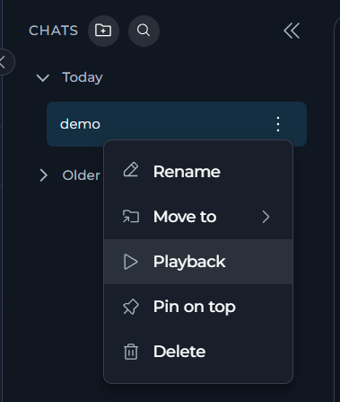

### Sharing Conversations

The conversation sharing feature allows you to share conversations with team members by providing them with a direct link. This is particularly useful for collaboration, code reviews, troubleshooting, and knowledge sharing within your team.

<Warning title="Important Permissions">
* **Team Projects Only**: Conversation sharing is only available for conversations in team projects. You cannot share conversations from personal projects.
* **Team Members**: Only team members who have access to the project can view shared conversations.
* **Access Level**: Recipients must have appropriate permissions within the project to access the shared content.
</Warning>

**How Conversation Sharing Works**

When you share a conversation, ELITEA generates a unique URL that includes the conversation ID, name, and a special parameter that identifies it as a shared conversation. Team members who receive this link can access and view the complete conversation history in their browser.

**How to Share a Conversation**

1. Navigate to the **CONVERSATIONS** sidebar in the **Chat** section.
2. Locate the conversation you want to share.
3. Hover over the conversation to reveal the contextual menu.
4. Select **Share** from the menu options.
5. The conversation link is automatically copied to your clipboard.
6. You will see a notification: "The link has been copied to the clipboard."
7. Paste the link in your communication channel (email, Slack, Teams, etc.) to share it with team members.

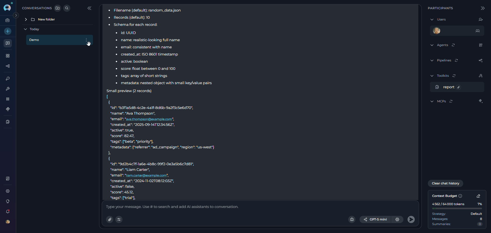


**Use Cases for Sharing Conversations**

* **Collaboration**: Share conversations to involve team members in ongoing discussions or problem-solving sessions
* **Code Reviews**: Share conversations containing code generation or refactoring for peer review
* **Troubleshooting**: Share error discussions with technical support or senior team members
* **Knowledge Transfer**: Share valuable conversations as learning resources for team members
* **Documentation**: Share conversations that demonstrate best practices or solutions to common problems
* **Demos and Presentations**: Share conversations to demonstrate ELITEA capabilities or AI-assisted workflows

<Tip title="Sharing vs Making Public">
The **Share** action is different from **Make Public**. Sharing creates a link for easy access while maintaining existing permissions, whereas making a conversation public changes its visibility settings permanently and cannot be reversed.
</Tip>

**Accessing Shared Conversations**

When a team member clicks on a shared conversation link:

1. The link opens in their browser
2. ELITEA automatically navigates to the specified conversation
3. The conversation opens with the complete history visible
4. The recipient can read the entire conversation thread
5. Depending on their permissions, they may be able to interact with or continue the conversation

<Info title="Access Permissions">
If a user doesn't have access or permissions to the shared conversation (i.e., the conversation is not public and the user is not added as a participant), clicking the shared link will navigate them to the chat interface, but they will not be able to view the conversation content. This is the expected behavior to maintain conversation privacy and security.
</Info>

## Managing Folders

### Folder Actions (Sidebar)

Folders can be managed directly from the **CONVERSATIONS** sidebar. Right-click on a folder or click its associated options menu (**...**) to access the following actions:

* **Edit Folder**: Rename the folder. Enter the new name and click the checkmark (✔) or **Save** button.
* **Delete Folder**: Remove the folder.  
  **Important**: Deleting a folder does not delete the conversations inside it. Conversations within a deleted folder are automatically moved back to the main conversation list (root level). You will be asked to confirm deletion.

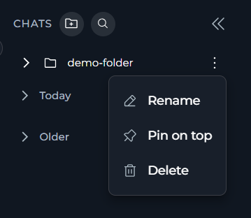

## Understanding Conversation/Folder Visibility

ELITEA has two project types — **Private** and **Team**. Visibility and access rules for conversations and folders depend on which type you're working in.

<Tabs>
  <Tab title="Private Project">
    Conversations and folders in a private project are personal to you only.

    | Aspect | Details |
    |--------|---------|
    | **Visibility** | Only you (the creator) can see and access all conversations and folders |
    | **AI Participants** | Add Agents, Pipelines, Toolkits, and MCPs as AI assistants |
    | **Users** | Cannot add other users as participants |
  </Tab>

  <Tab title="Team Project">
    Team projects support shared collaboration with configurable visibility per conversation and folder.

    | Aspect | Details |
    |--------|---------|
    | **Folders** | All folders in the project are visible to all team members |
    | **Conversations** | Only visible to you if you are a member (participant) of that conversation |
    | **Moving Conversations** | Members can use **Move To** or **Back to the list** to organize conversations across folders |
    | **Folder Permissions** | You cannot delete folders created by other users |
    | **Public Conversations** | Conversations can be marked as public — visible and interactable by all project members |
    | **Public Folders** | Public folders and their contents are visible to all project members |

    <Warning>
    Making a conversation or folder **public is irreversible** — it cannot be converted back to private.
    </Warning>
  </Tab>
</Tabs>

**Example: Collaboration in a Team Project**

<Accordion title="View collaboration scenario">
**Scenario**: The QA, PM, and BA team collaborate on a new file upload feature using a shared team project conversation.

**Steps:**

- **BA adds requirements:**
  ```
  @BA: "The new feature should allow users to upload files up to 10MB. The system must validate file types and provide error messages for unsupported formats."
  ```

- **PM sets the timeline:**
  ```
  @PM: "Development completes by May 15th. QA starts testing May 16th. Release target: May 20th."
  ```

- **QA plans testing:**
  ```
  @QA: "I'll create test cases for uploads, file types, size limits, and error handling. @BA, does the system support drag-and-drop uploads?"
  ```

- **BA clarifies:**
  ```
  @BA: "Yes, drag-and-drop should be supported. Also add a progress bar during uploads."
  ```

- **PM tracks progress:**
  ```
  @PM: "QA, please share test results by May 18th for pre-release review."
  ```

The PM creates a **"Feature: File Upload"** folder and moves the conversation there so all team members can find it easily.
</Accordion>

**Tips for Effective Collaboration in Team Projects**

* Use `@` mentions to notify specific teammates in a conversation.
* Group related conversations into folders for better navigation.
* Define roles, responsibilities, and deadlines directly in the chat.
* Regularly post progress updates and flag blockers in the conversation.


## Working with Participants

Participants are the core components you interact with within a conversation.

### What are Participants?

Participants are the "tools" or "entities" you add to your chat:

<CardGroup cols={3}>
  <Card title="Models" icon="brain">
    Large Language Models (e.g., GPT-4, Claude) for generating text and answering questions.
  </Card>
  <Card title="Agents" icon="robot">
    Pre-configured automated workflows or specialized bots designed for specific tasks.
  </Card>
  <Card title="Pipelines" icon="diagram-project">
    Multi-step automated processes that orchestrate multiple agents and tools.
  </Card>
  <Card title="Toolkits" icon="toolbox">
    Collections of tools and integrations (e.g., GitHub, Jira, Confluence) that extend chat capabilities.
  </Card>
  <Card title="MCPs" icon="server">
    Model Context Protocol servers for external tool capabilities (e.g., Playwright, Figma).
  </Card>
  <Card title="Users" icon="user">
    In public conversations, other project members who join or interact become participants.
  </Card>
</CardGroup>


### Adding Participants to a Conversation

<Tabs>
  <Tab title="Using the + Button">
    1. In the chat input toolbar, click the **`+`** icon.
    2. Hover over the relevant category (**Agents**, **Pipelines**, **Toolkits**, or **MCPs**).
    3. A flyout submenu appears listing available participants of that type.
    4. Select an existing item from the list, or click **Create New {Type}** at the bottom to create one inline.
    5. The participant is added and appears in the **PARTICIPANTS** panel on the right.

    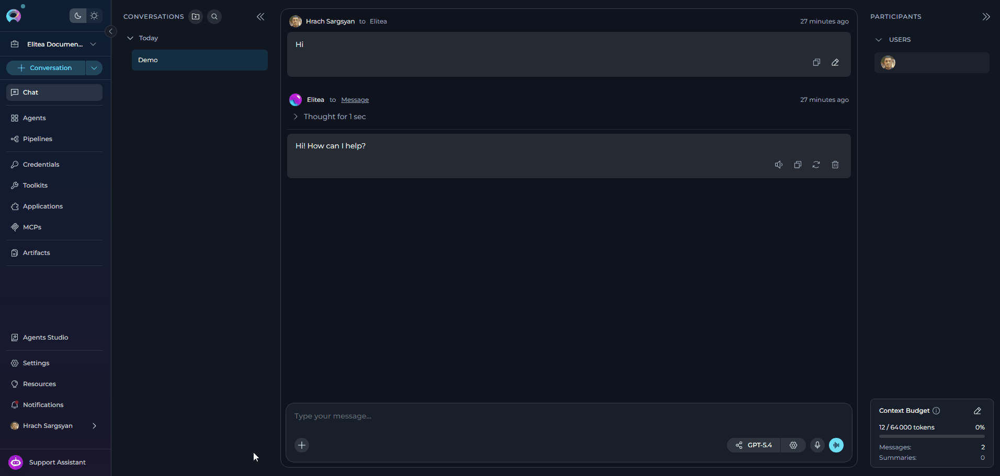
  </Tab>

  <Tab title="# Symbol">
    1. In the chat input box, type `#` to open a dropdown of frequently used participants.
    2. Continue typing to filter by name (e.g., `#Jira` shows all Jira-related participants).
    3. Select a participant from the list (e.g., `#Data Analysis Agent`, `#Jira Toolkit`).
    4. The selected participant appears as a chip above the input box.
    5. Type your message and click **Send**.

    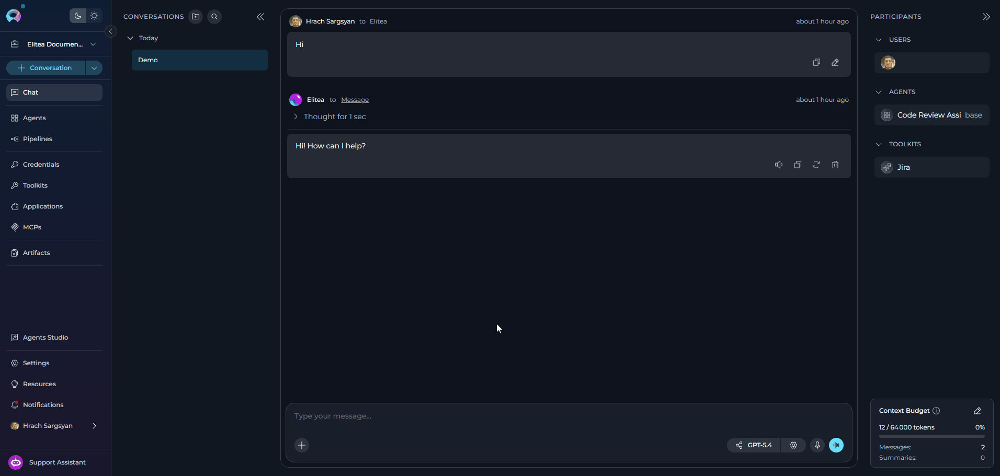
  </Tab>

  <Tab title="/ Toolkit Tool Mention">
    Direct the AI to use a specific tool from an already-added toolkit or MCP by typing `/` in the chat input. This is a two-phase selection:

    **Phase 1 — Select a Toolkit:**

    1. Type `/` to open the **Mention toolkit** dropdown.
    2. The dropdown lists all toolkits and MCPs already added as participants.
    3. Continue typing to filter by name (e.g., `/Jira`).
    4. Click a toolkit name, or type the full name and press `/` again to confirm.
    5. The input updates to `/{ToolkitName}/` and the dropdown switches to available tools.

    **Phase 2 — Select a Tool:**

    6. The dropdown shows **"{ToolkitName} available tools"** with all exposed tools.
    7. Continue typing after the second `/` to filter tools (e.g., `/Jira/create`).
    8. Each tool shows its name and a short description.
    9. Click the desired tool to confirm.
    10. The mention is committed as `/{ToolkitName}/{ToolName}` with a cyan highlight.

    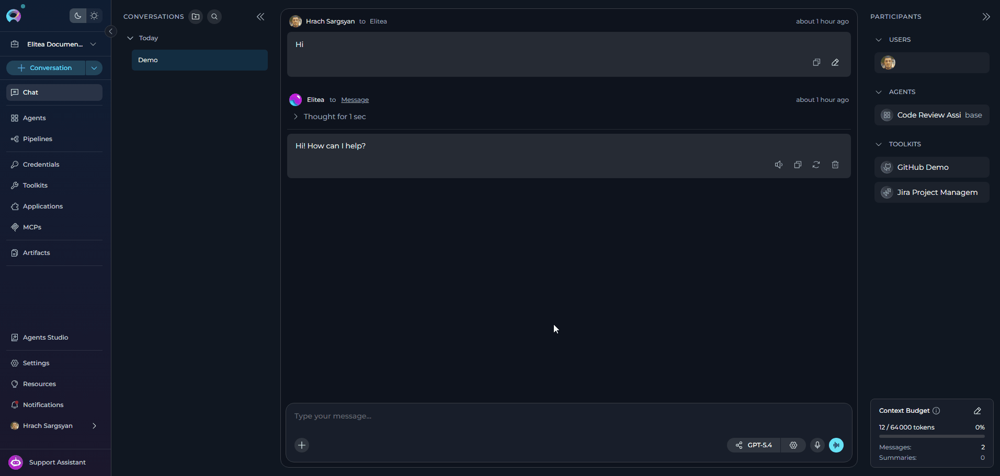

    <Note>
    The `/` mention works with both **Toolkits** and **MCP** participants already added to the conversation. If a toolkit or MCP does not appear, add it first via the **PARTICIPANTS** panel or by typing `#`. Misconfigured toolkits and MCPs are excluded until the issue is resolved.
    </Note>

    You can include multiple mentions in a single message:
    ```
    Please use /Jira/createIssue to create a new issue and then /GitHub/createPR to create a pull request.
    ```
  </Tab>
</Tabs>


### Creating New Participants from Chat

You can create new participants directly from the chat interface:

1. Click the **`+`** icon in the input toolbar.
2. Hover over the relevant category (Agents, Pipelines, Toolkits, or MCPs).
3. Click the **Create New {Type}** option at the bottom of the submenu.
4. The corresponding Canvas editor opens inline.

* **Agents**: See [How to Create and Edit Agents from Canvas](./how-to-create-and-edit-agents-from-canvas).
* **Pipelines**: See [How to Create and Edit Pipelines from Canvas](./how-to-create-and-edit-pipelines-from-canvas).
* **Toolkits**: See [How to Create and Edit Toolkits from Canvas](./how-to-create-and-edit-toolkits-from-canvas).
* **MCPs**: See [How to Create and Edit MCPs from Canvas](./how-to-create-and-edit-mcps-from-canvas).

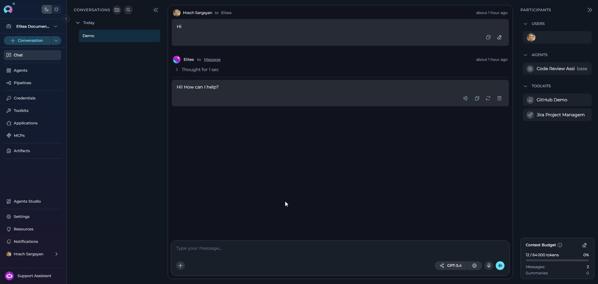


### Adding Users to a Conversation

Users (team members) can only be added to in team projects. They cannot be added to private conversations.

**To Add Users:**

1. In the chat input toolbar, click the **`+`** icon.
2. Select **Invite Users** from the popup menu.
3. The **Add users** modal will appear with a search bar.
4. Use the search bar to find teammates by name.
5. Select one or more users from the list by clicking on them.
6. Click **Add** to confirm. The selected users will appear in the **Users** section of the **PARTICIPANTS** panel.

**Important Notes:**

* Added users will receive notifications about being added to the conversation.
* Users can also join a public conversation implicitly by interacting with it.
* Once a conversation is public, it cannot be converted back to private.

For detailed information on adding teammates, see [Adding Teammates to Conversation](./add-teammates-to-conversation).

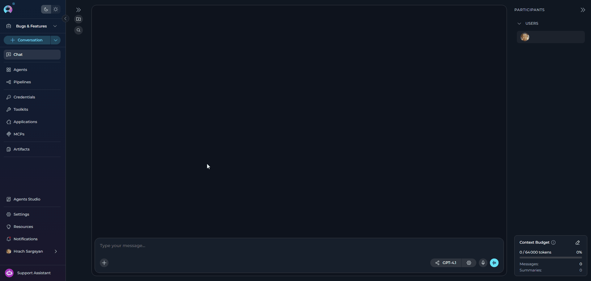


### Using Participants in a Conversation

Once added, participants are ready to process your messages:

1. **Check Participants**: Ensure the desired participant is listed in the **Participants** section.
2. **Select Active Participant(s)**: 
       - **Click**: Click the participant's name/icon in the **Participants** list to make it active for your next message.
3. **Mention Users** (Team Projects only): You can mention other team members using `@` followed by their name (e.g., `@John Doe`). This notifies them and brings their attention to specific parts of the conversation.
4. **Send Message/Command**: Type your message or a simple command (like "Go", "Execute", "Run it") and press **Send**. The active participant(s) will process your input.

<Accordion title="Example Usage">
* **To ask a general question using a specific model**:
    1. Select a model from the model selector dropdown (e.g., `GPT-4o`).
    2. Type: `"Explain the concept of recursion in programming."` -> **Send**.

* **To use a specific agent**:
    1. Click the **`+`** icon in the input toolbar and hover over **Agents**.
    2. Select `Data Analysis Agent` from the submenu, or type `#Data Analysis Agent` in the input box.
    3. Type your request: `"Analyze the latest sales data."` -> **Send**.

* **To use a toolkit**:
    1. Click the **`+`** icon and hover over **Toolkits**. Select the desired toolkit (e.g., `Artifact Toolkit`).
    2. Type: `"Store this data in artifacts."` -> **Send**.

* **To mention a team member** (Team Projects only):
    1. In your message, type `@` followed by the team member's name (e.g., `@John Doe`).
    2. Type: `"@John Doe, can you review this analysis?"` -> **Send**.
</Accordion>


### Selecting and Configuring Models

**Selecting a Model:**

1. Click the **model selector dropdown** at the bottom of the chat.
2. Select a desired LLM model from the available options (e.g., GPT-4o, GPT-5.1, Claude).
3. The selected model name is displayed on the button. Models that support **image analysis** or **reasoning** show small capability icons next to their name in the dropdown.

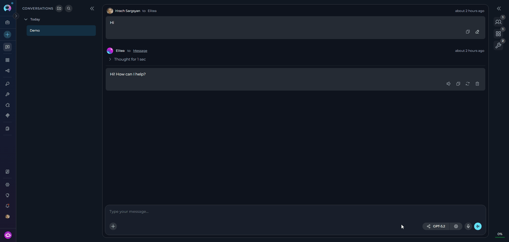

**Model Settings:**

Click the **Settings** (⚙️) icon next to the model selector to fine-tune response generation. Settings vary by model type:

<Tabs>
  <Tab title="Reasoning Models (e.g. GPT-5.1)">
    | Parameter | Description |
    |-----------|-------------|
    | **Reasoning** | Controls the depth of logical thinking and problem-solving. |

    | Level | Behavior |
    |-------|----------|
    | **Low** | Fast, surface-level reasoning with concise answers and minimal steps |
    | **Medium** | Balanced reasoning with clear explanations and moderate multi-step thinking *(default)* |
    | **High** | Deep, thorough reasoning with detailed step-by-step analysis (may be slower) |

    
  </Tab>

  <Tab title="Standard Models (e.g. GPT-4o)">
    | Parameter | Description |
    |-----------|-------------|
    | **Creativity** | Controls response randomness. Lower values produce focused, deterministic outputs; higher values produce more varied and creative responses. |

    | Level | Behavior |
    |-------|----------|
    | **1** | Highly focused and deterministic outputs |
    | **2** | Mostly focused with slight variation |
    | **3** | Balanced between focus and creativity *(default)* |
    | **4** | More varied and creative responses |
    | **5** | Maximum creativity and diversity |

    
  </Tab>
</Tabs>

**Capabilities** *(shown when supported by the selected model)*

| Badge | Meaning |
|-------|---------|
|  | The model accepts image inputs alongside text |
|  | The model uses extended chain-of-thought reasoning |

<Note>
Capability badges appear automatically at the bottom of the settings panel based on the selected model. If neither capability is supported, the Capabilities row is hidden.
</Note>

**Max Completion Tokens** *(All Models)*

| Option | Description |
|--------|-------------|
| **Auto** | System sets the token limit to 4096 tokens *(default)* |
| **Custom** | Manually enter a specific token limit. An error is shown if the value exceeds the model's maximum output tokens. |

**Steps Limit** *(Conversations only)*

Controls the maximum number of execution steps (tool calls) the AI can take before the loop is forcefully stopped. This prevents runaway agent executions that could consume excessive resources.

| Parameter | Value |
|-----------|-------|
| **Default** | 25 steps |
| **Range** | 0 – 999 |

- Each time the AI invokes a tool or performs an internal reasoning step, the counter increments by one. When the limit is reached, the execution loop ends and the AI returns whatever results it has collected so far.
- The Steps Limit field is shown in the model settings panel only in **Conversations** (chat). It is not available on the Agents or Pipelines pages, where step limits are configured at the agent/pipeline level.

<Tip title="Choosing a Steps Limit">
- Set a **lower value** (e.g. 5–10) for simple question-answering tasks where you want fast, predictable responses.
- Set a **higher value** (e.g. 50–100) for complex, multi-step research or automation tasks that require chaining many tool calls.
- If a conversation ends abruptly with incomplete results, check whether the steps limit was reached and increase it accordingly.
</Tip>

<Warning title="Step Limit Reached">
When the steps limit is exceeded, the AI stops executing further tool calls and returns partial results. No error is displayed to the user by default — the response simply stops at the last completed step.
</Warning>


### Configuring Participants

You can configure and edit participants (Agents, Pipelines, Toolkits, and MCPs) directly within the conversation using the Canvas editor.

**Accessing Participant Settings:**

1. **Option 1**: Click the participant in the **Participants** list, then click the **⚙️** (settings) icon.
2. **Option 2**: Hover over the participant element in the **Participants** list and click the **Edit** icon that appears.
3. The appropriate **Canvas** editor will open based on the participant type.

**What You Can Configure:**

<Tabs>
  <Tab title="Agents">
    - Edit the agent's **prompt** and instructions
    - Modify **variables** used by the agent
    - Configure **model settings** 
    - Select the agent **version** (default is "base")
    - Adjust **toolkits** and integrations

    [→ Agent Canvas Guide](./how-to-create-and-edit-agents-from-canvas)
  </Tab>

  <Tab title="Pipelines">
    - Edit the pipeline **workflow** and step sequences
    - Modify **variables** and parameters
    - Configure **agents** used in the pipeline
    - Adjust **toolkits** and integrations
    - Select the pipeline **version** (default is "base")

    [→ Pipeline Canvas Guide](./how-to-create-and-edit-pipelines-from-canvas)
  </Tab>

  <Tab title="Toolkits">
    - Configure **integration settings** and credentials
    - Adjust **tool parameters** and options
    - Enable or disable specific tools within the toolkit
    - Modify **connection settings** for external services

    [→ Toolkit Canvas Guide](./how-to-create-and-edit-toolkits-from-canvas)
  </Tab>

  <Tab title="MCPs">
    - Configure **server connection** settings
    - Adjust **tool availability** and permissions
    - Modify **environment variables** and parameters
    - Set **timeout** and performance options

    <Info>
    MCP servers must be running before they can be used in conversations. Ensure your MCP server is started and accessible before adding it as a participant.
    </Info>

    [→ MCP Canvas Guide](./how-to-create-and-edit-mcps-from-canvas)
  </Tab>
</Tabs>

**Applying Changes:**

1. Make your edits in the Canvas editor.
2. Click the **Save** button to apply your modifications.
3. The updated configuration will be used for subsequent messages in the conversation.

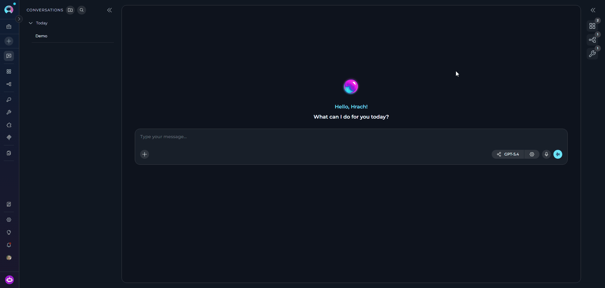


### Displaying Configured Conversation Starters

When you add a participant (like an Agent, Pipeline, Toolkit, or MCP) that has a pre-configured "conversation starter" message or instruction set, this message will automatically appear in the chat. This helps guide you on how to interact with the participant effectively.


## Interacting with Conversation Outputs

### Editing Your Last Message

If you want to refine your prompt instead of sending a brand-new follow-up, ELITEA lets you edit your last user message and regenerate the answer from that updated text.

1. Locate your most recent user message.
2. Use the action icons shown under that message, then click the **Edit** (pencil) icon.
3. The message switches into inline edit mode.
4. Update the text as needed.
5. Click **Save and apply** to submit the edited message and regenerate the answer, or click **Cancel** to discard your changes.

<Note>
The edit action is shown as **Edit the message and regenerate answer**. The **Save and apply** button stays disabled until the message content changes and the edited text is not empty.
</Note>

### Like/Dislike and Commenting

1. Below each generated response, you'll see **Thumbs Up (👍)** and **Thumbs Down (👎)** icons.
2. Click **Thumbs Up** to indicate satisfaction.
3. Click **Thumbs Down** to indicate dissatisfaction.
4. After clicking **Thumbs Down**, a **Leave comment** field appears. Click it, type your specific feedback or reason for disliking, and press **Send** (or **Enter**). This feedback is valuable for improving models and prompts.


### Regenerating the Last Output

1. If you're not satisfied with the very last response generated by a participant, you can ask it to try again.
2. Ensure a response has been generated.
3. Click the **Regenerate** icon 🔄 usually located near the last message or the input box.
4. The system will use the same input/prompt that generated the last response and attempt to create a new, potentially improved, output.

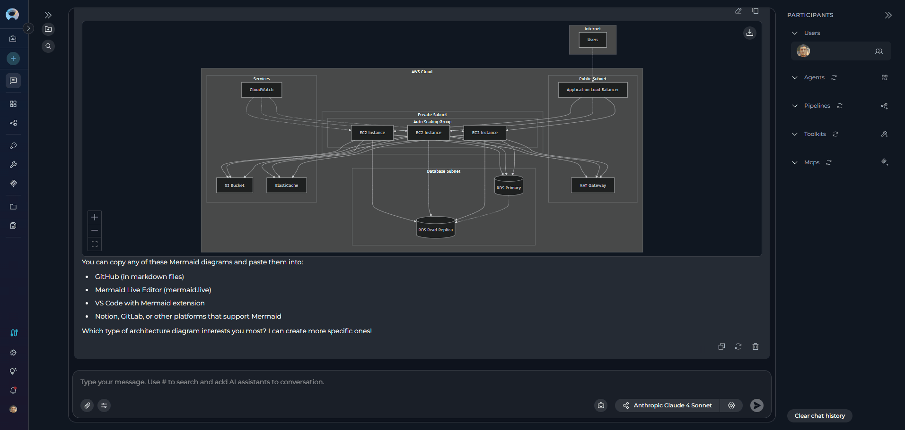


## Using Canvas for Content Editing

Canvas is your all-in-one workspace for editing, refining, and collaborating on AI-generated content in ELITEA. Instead of copying results into other tools, you can work directly with code, tables, and diagrams—right where the conversation happens.

**What is Canvas?**

Canvas is a built-in editor that appears automatically when ELITEA generates code, tables, or Mermaid diagrams in a chat. It allows you to edit, refine, and export AI-generated content without leaving the conversation.

**Canvas Features:**

<CardGroup cols={2}>
  <Card title="Code Editor" icon="code">
    Edit code with syntax highlighting, find/replace, and code folding. Export as `.py`, `.js`, `.java`, and more.
  </Card>
  <Card title="Table Editor" icon="table">
    Modify tables with spreadsheet-like functionality. Add/remove rows and columns, sort, filter, and export to XLSX or Markdown.
  </Card>
  <Card title="Diagram Editor" icon="diagram-project">
    Edit Mermaid diagrams with live preview and syntax highlighting. Export as PNG, JPG, or SVG.
  </Card>
  <Card title="DOCX Editor" icon="file-word">
    Edit `.docx` files from Artifacts in a full WYSIWYG interface — formatting toolbar, ruler, zoom control, save directly to the Artifact bucket.
  </Card>
</CardGroup>

<Info title="Opening the DOCX Editor">
The pencil icon (✏️) does **not** appear for DOCX files in chat. Open DOCX files via the **View/Edit file icon** in Artifacts or chat attachments instead.
</Info>

**How to Use Canvas:**

1. Ask ELITEA to generate code, a table, or a Mermaid diagram.
2. When ELITEA generates the content, look for the pencil icon (✏️) in the top-right corner of the content block.
3. Click the icon to open the Canvas editor in a modal window.
4. Make your edits using the available tools:
      - **Copy**: Copy content to clipboard
      - **Undo/Redo**: Revert or reapply actions
      - **Save**: Save your changes
      - **Export**: Download in various formats
5. Click **Save** to preserve your changes in the conversation or **Export** to download files.

For detailed information, real-world examples, and best practices, see [Canvas in Conversation](./how-to-canvas).

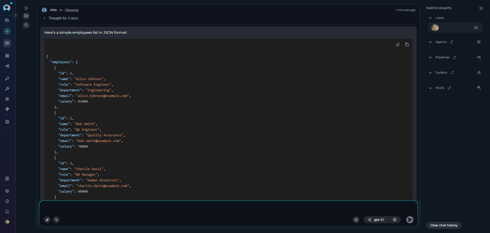


## Attaching Files and Images

Attach files and images directly to chat conversations for AI-powered analysis. This feature enables multimodal interactions where AI can process visual content, documents, and data files alongside text-based queries.

Every file you attach is automatically uploaded to the default `attachments` bucket — no manual Artifact Toolkit configuration is required. Files are accessible from the **Artifacts** section.

* **Images** are sent directly to the LLM for real-time vision analysis.
* **Non-image files** (documents, code, data) are indexed into a vector database and retrieved via semantic search.

**Attachment Limits:**

| Limit | Value |
|-------|-------|
| Max files per message | 10 |
| Max total size | 150 MB |
| Max size per file | 150 MB |
| Max image attachments | 10 |

**How to Attach Files:**

1. In the chat input toolbar, click the **`+`** icon.
2. Click **Attach Files**.
3. The native file browser opens — select one or more files.
4. Selected files appear as chips above the input field. To remove a file, click the **×** on its chip.
5. Type your message and press **Send**.

You can also attach files by:
- **Drag and drop** — drag files directly onto the chat input area.
- **Paste** — paste files or images from your clipboard with **Ctrl+V** / **Cmd+V**.

**Availability by Conversation Type:**

| Context | Attachment availability |
|---------|------------------------|
| **Direct LLM / model chat** | Always enabled — **Attach Files** is active whenever no agent or pipeline is selected. |
| **Agent-based chat** | Only enabled if the agent has **Allow Attachments** toggled on in its **Internal Tools** configuration. If not enabled, **Attach Files** is grayed out with the tooltip: *"Attachments aren't available for the selected agent or pipeline."* |
| **Pipeline-based chat** | Same rule as agents — requires `attachments` in the pipeline's internal tools. |

<Tip title="Enable attachments for an agent">
To enable attachments for an agent, open the agent in Canvas → go to the **Configuration** tab → expand **Internal Tools** → turn on the **Allow Attachments** toggle and save.
</Tip>

     

For detailed information about attachments, including agent configuration and file management, see [Attach Files](./attach-files).


## Using Internal Tools

Internal tools provide built-in capabilities that enhance your conversations without requiring external integrations. These tools can be enabled directly from the chat interface or configured as part of an agent's default setup.

**Available Internal Tools**

<Tabs>
  <Tab title="Python Sandbox">
    Execute Python code securely in conversations using Pyodide (Python compiled to WebAssembly). Useful for calculations, data processing, testing algorithms, and generating visualizations.

    | Capability | Description |
    |-----------|-------------|
    | **Secure Execution** | Run Python code in a secure sandbox environment |
    | **Package Support** | Install and use packages like numpy, pandas, and matplotlib |
    | **Persistent State** | Code execution maintains state within the same conversation |
    | **Visualizations** | Generate data visualizations and reports inline |

    **Use Cases**: Execute code snippets, perform calculations, test algorithms, process data.

    [→ Python Sandbox Guide](./python-sandbox-internal-tool)
  </Tab>

  <Tab title="Planner">
    Create, manage, and track tasks and action items directly within conversations. Set priorities, due dates, and monitor task progress without switching to external tools.

    | Capability | Description |
    |-----------|-------------|
    | **Task Decomposition** | Break down complex requests into smaller, actionable tasks |
    | **Workflow Organization** | Create structured plans with clear steps and dependencies |
    | **Progress Tracking** | Monitor completion with priority levels (High / Medium / Low) |
    | **Task Status** | Track tasks through Pending, In Progress, and Completed states |

    **Use Cases**: Project planning, feature development breakdown, complex problem-solving.

    [→ Planner Guide](./planner-internal-tool)
  </Tab>

  <Tab title="Data Analysis">
    Perform Pandas-based data analysis on uploaded files (CSV, Excel, etc.) using natural language queries. Automatically processes data and generates charts with downloadable results.

    | Capability | Description |
    |-----------|-------------|
    | **Natural Language** | Use plain English to request data analysis operations |
    | **File-Based Analysis** | Works with files uploaded directly to conversations |
    | **Auto Processing** | Intelligent file format detection and data analysis |
    | **Chart Generation** | Automatic creation of visualizations with downloadable results |

    **Use Cases**: Data exploration, statistical analysis, trend identification, report generation.

    [→ Data Analysis Guide](./data-analysis-internal-tool)
  </Tab>

  <Tab title="Image Creation">
    Generate AI-powered images from text prompts directly within conversations. Requires an image generation model configured in your project.

    | Capability | Description |
    |-----------|-------------|
    | **Text-to-Image** | Describe what you want and the AI generates the image |
    | **Inline Results** | Generated images appear directly in the chat conversation |

    **Use Cases**: Mockups, illustrations, visual assets for presentations and documentation.
  </Tab>

  <Tab title="Smart Tools Selection">
    Optimizes token usage when working with many toolkits by dynamically loading tool schemas on demand instead of binding all tools upfront.

    | Capability | Description |
    |-----------|-------------|
    | **On-Demand Loading** | Tool schemas are loaded only when needed, reducing context overhead |
    | **Recommended For** | Conversations using 5 or more toolkits |

    **Use Cases**: Large-scale automation tasks involving many different integrations.

    [→ Smart Tools Selection Guide](./smart-tools-selection-internal-tool)
  </Tab>

  <Tab title="Swarm Mode">
    Enables multi-agent collaboration by allowing all child agents to share the full conversation history and hand off control to each other.

    | Capability | Description |
    |-----------|-------------|
    | **Shared Context** | All child agents see the full conversation history |
    | **Agent Handoff** | Agents transfer control to the most appropriate specialist |

    **Use Cases**: Complex workflows requiring multiple specialized agents working as a team.

    [→ Swarm Mode Guide](./swarm-mode-internal-tool)
  </Tab>

  <Tab title="Elitea MCP Tools">
    Exposes built-in ELITEA platform MCP tools directly inside conversations. Once enabled, the AI can manage agents, pipelines, chat conversations, and toolkits through natural language — without leaving the chat interface.

    | Capability | Description |
    |-----------|-------------|
    | **Agent & Pipeline Management** | Create and manage agents and pipelines from within a conversation |
    | **Chat Management** | Manage conversations and participants programmatically |
    | **Toolkit Management** | Configure toolkits through natural language requests |

    **Use Cases**: Administrative tasks, resource management, and platform configuration without context-switching.

    [→ Elitea MCP Tools Guide](./elitea-mcp-tools-internal-tool)
  </Tab>
</Tabs>

**Enabling Internal Tools in Conversations**

1. Navigate to your conversation.
2. In the chat input toolbar, click the **`+`** icon.
3. Hover over **Internal Tools** in the popup menu.
4. A flyout panel opens on the right showing all available tools with toggle switches.
5. Click the toggle next to the tool name to enable or disable it.
6. A success notification will appear: "Internal tools configuration updated".
7. Click anywhere outside the popup to close it.

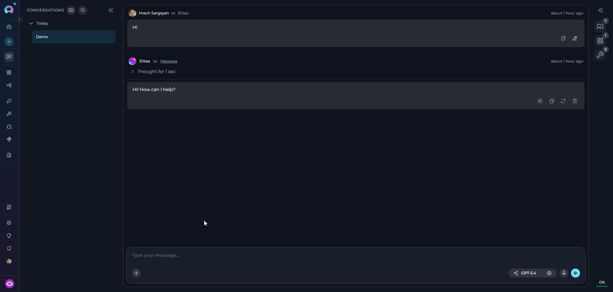

Once enabled, the AI assistant can automatically use these tools during conversations when appropriate.

**Enabling Internal Tools in Agents**

You can also enable internal tools as part of an agent's default configuration. This makes the tools available in all new conversations using that agent.

1. Navigate to **Agents** in the main menu and select the agent.
2. Click the **Configuration** tab.
3. Expand the **Internal Tools** section.
4. Toggle the desired tools ON.
5. Click **Save** at the top of the configuration page.
6. The enabled internal tools will be available in all new conversations using this agent.

**Using Internal Tools**

Once enabled, the AI assistant can use the internal tools during conversations:

* **Python Sandbox**: The assistant can execute Python code, install packages, perform calculations, and generate visualizations
* **Planner**: The assistant can break down complex tasks, create structured plans with priorities and due dates, and track task progress
* **Data Analysis**: The assistant can perform comprehensive data analysis on uploaded files using natural language commands

For detailed usage examples, troubleshooting, and best practices, see:

* [Python Sandbox Guide](./python-sandbox-internal-tool)
* [Planner Internal Tool Guide](./planner-internal-tool)
* [Data Analysis Internal Tool Guide](./data-analysis-internal-tool)
* [Smart Tools Selection Guide](./smart-tools-selection-internal-tool)
* [Swarm Mode Guide](./swarm-mode-internal-tool)
* [Elitea MCP Tools Guide](./elitea-mcp-tools-internal-tool)


## Sensitive Action Authorization

When an agent or pipeline attempts to call a **sensitive tool** (such as deleting a repository, running a shell command, or dropping a database table), the conversation automatically pauses and displays an authorization card before anything is executed.

<Warning title="Administrator-configured feature">
The Sensitive Action Authorization Guardrail is configured at the **server/infrastructure level** by your ELITEA administrator. It applies automatically to all conversations once active — individual users cannot enable or disable it.
</Warning>

**Authorization Dialog Elements:**

| Element | Description |
|---------|-------------|
| **Header** | ⚠️ Sensitive Action Authorization Required — amber-highlighted panel |
| **Action label** | The specific action the agent plans to run (e.g., `github.delete_repo`) |
| **Parameters** | The exact arguments the tool will be called with. Security-sensitive fields (`password`, `token`, `api_key`, `secret`, etc.) are automatically masked as `***` |
| **Policy message** | Your organization's custom message explaining why the action requires approval |

**Actions:**

* **Authorize** — Approves the tool call. Execution resumes and the tool runs as planned.
* **Block** — Rejects the tool call. The tool is skipped entirely; the agent receives a cancellation message and continues or stops based on its logic.

<Tip title="Auto-approve within a batch">
If an agent calls the same sensitive tool multiple times in one execution cycle, only the **first call** raises the interrupt. Subsequent calls to the same tool in the same batch are auto-approved — avoiding repeated dialogs for the same action.
</Tip>

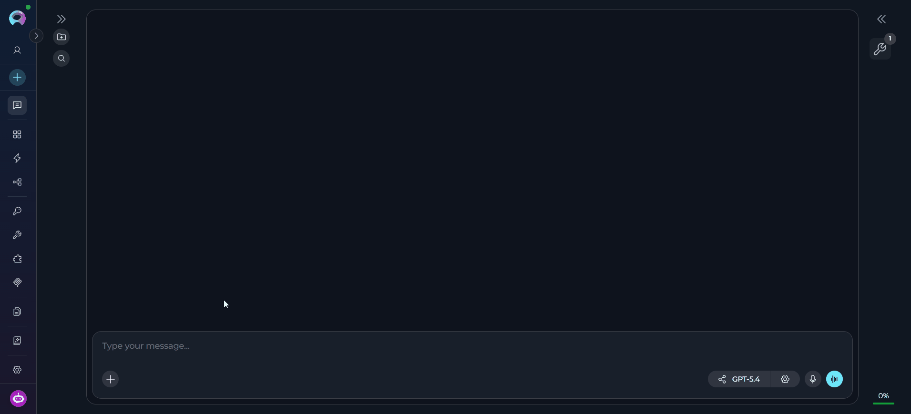

For full details including configuration, pipeline behavior, and troubleshooting, see [Sensitive Action Authorization Guardrail](./sensitive-action-authorization-guardrail).


## Voice Capabilities

ELITEA Chat includes voice input and voice output capabilities that let you speak your messages and have AI responses read back to you.

<CardGroup cols={3}>
  <Card title="Voice Input" icon="microphone">
    Dictate messages into the chat input field. Transcribed text is inserted at the cursor position in real time.
  </Card>
  <Card title="Text-to-Speech" icon="volume-high">
    Have AI responses read aloud. Pause and resume playback from a mini-player pill in the input area.
  </Card>
  <Card title="Speaking Mode" icon="waveform-lines">
    Hands-free voice conversation loop. ELITEA records, sends, speaks the response, and listens again — automatically.
  </Card>
</CardGroup>

### Voice Input

**Voice Input** lets you dictate messages directly into the chat input field using a microphone. The transcribed text is inserted at the cursor position, so you can combine typed and spoken content in the same message.

**How to use Voice Input:**

1. Click the **microphone** icon in the message input toolbar to start recording.
2. Speak your message. A live transcript appears in the input field as you talk — interim results update in real time.
3. Click the **Stop** (■) button to finish recording. The final transcript is committed and focus returns to the input field.

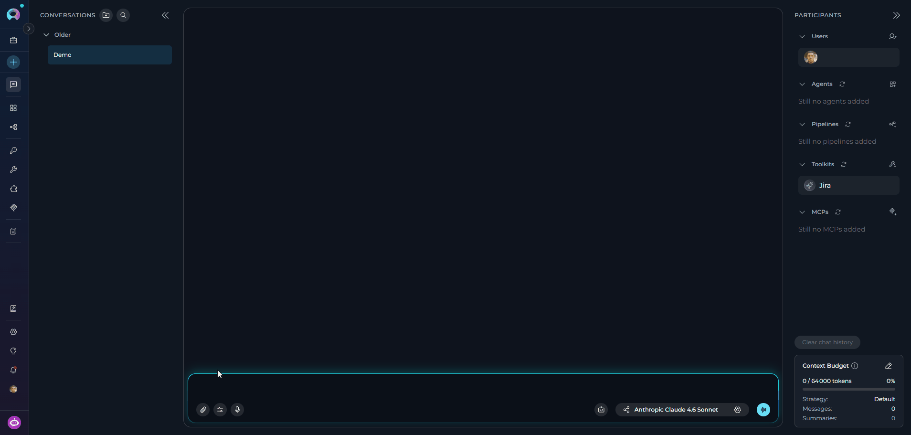

<Note>
When a server-side ASR (automatic speech recognition) model is configured in **Settings → AI Configuration → Speech Recognition (ASR)**, Voice Input uses that model via streaming. If no server ASR model is available, Voice Input falls back to the browser's built-in Web Speech API. If neither is available, the microphone icon is hidden.
</Note>

### Text-to-Speech

**Text-to-Speech** reads AI responses aloud. A **Read out** button (megaphone icon) appears in the action bar below each AI message when the message contains speakable text.

**How to use Text-to-Speech:**

1. Click the **Read out** (megaphone) button below an AI message to start playback.
2. The text is read aloud and a **playback pill** appears in the input area with:
   - A **Stop (■)** button to halt audio playback at any time.
   - A **Voice settings (⚙)** gear icon — opens the Voice Settings dialog (disabled while playback is active).
3. After stopping, a **Play (▶)** button replaces the Stop button to restart playback from the beginning.
4. Click the **⚙** gear icon (only available when playback is stopped) to open the **Voice settings** dialog.

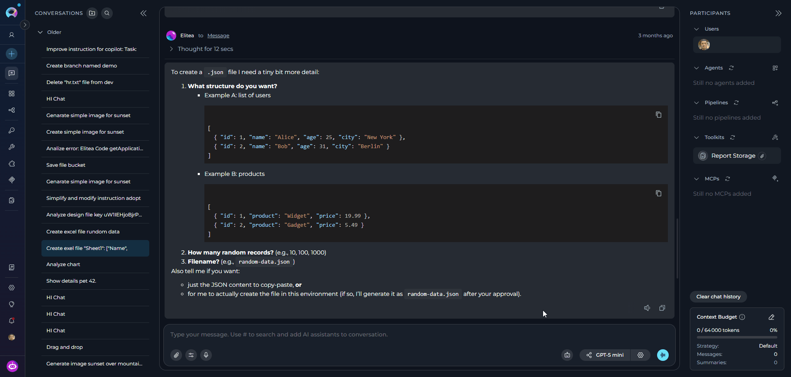

<Note>
When a TTS model is configured in **Settings → AI Configuration → Text to Speech (TTS)**, ELITEA uses that model for audio generation. If no TTS model is configured, playback uses the browser's built-in SpeechSynthesis API as a fallback.
</Note>

**Voice Settings:**

Click the **⚙** gear icon in the playback pill to open the **Voice settings** dialog. Settings are saved to your browser and persist across sessions.

| Setting | Description |
|---------|-------------|
| **Voice** | Select the voice for playback. When a server-side TTS model is configured, the list shows that model's voices. Without a server TTS model, browser built-in voices are listed (non-local voices marked *"online"*). |
| **Speed** | Controls playback rate. Range: **0.5×** to **2×**. Default: **1×**. |
| **Volume** | Controls playback volume. Range: **Mute (0%)** to **100%**. Default: **100%**. |
| **Preview Voice** | Plays a short sample sentence with the current settings. Only available when playback is not active. |

Click **Apply** to save, or **Cancel** to discard changes.

   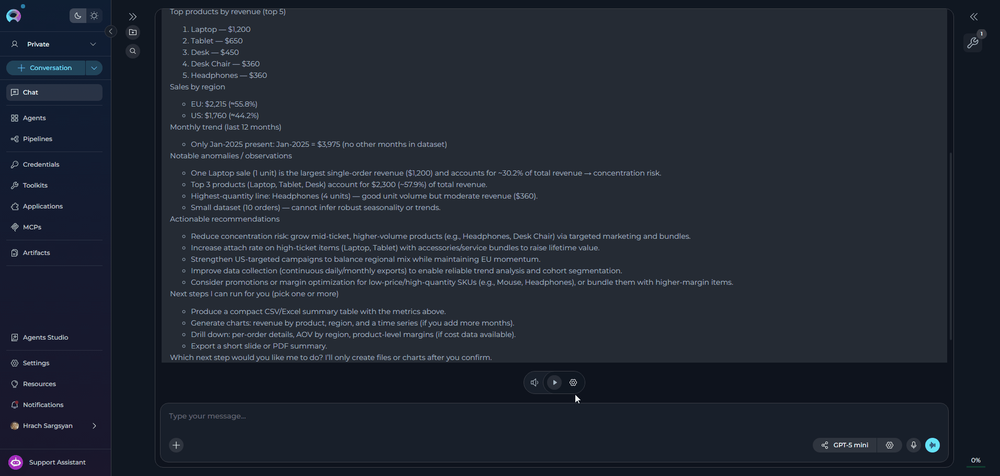


<Tip title="Global voice preferences">
You can also configure voice preferences globally under **User Settings → Profile → Voice Personalization**. These settings apply as the default for all new TTS playbacks across all conversations.
</Tip>

### Speaking Mode

<Warning>
Speaking Mode is only available **after the conversation has been created** — meaning at least one message must have been sent first. The voicewave icon does not appear in a brand-new, unsent conversation. Send your first message to initialize the conversation, then use Speaking Mode for subsequent turns.
</Warning>

**Speaking Mode** is a continuous, hands-free voice conversation loop. Once activated, ELITEA automatically records your speech, sends your message after a pause, plays back the AI's response, and then starts listening again — without any manual interaction between turns.

**How to activate Speaking Mode:**

1. Leave the message input field empty.
2. Click the **voicewave** icon (shown in place of the Send button when the input is empty) to enter Speaking Mode.
3. A voicewave pill with an **Exit** (✕) button replaces the send button, indicating Speaking Mode is active.
4. Speak your message. After **3 seconds of silence**, your message is automatically sent.
5. The AI response streams in and is read aloud via Text-to-Speech.
6. Once the response finishes playing, recording starts again automatically for the next turn.
7. Click the **✕** button in the voicewave pill to exit Speaking Mode at any time.

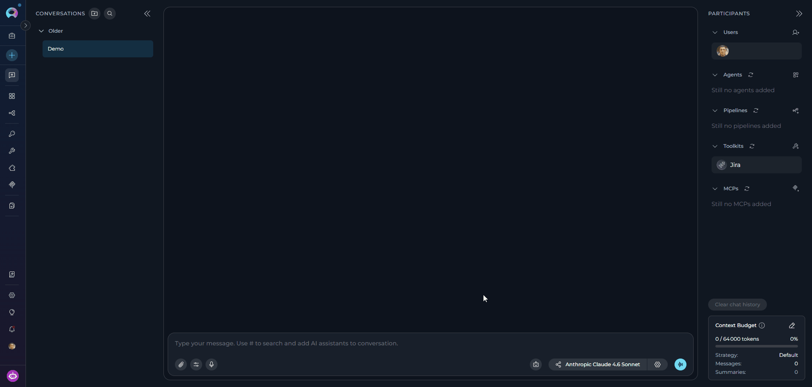

<Note>
Speaking Mode requires a voice recognition source (server ASR model or browser Web Speech API) for input and uses Text-to-Speech for output. If you start manual voice input while Speaking Mode is active, Speaking Mode is automatically deactivated.
</Note>


## Playback Mode

Playback mode allows you to step through an existing conversation turn by turn, exactly as it happened, without actually sending requests to the Models, Toolkits, etc.

   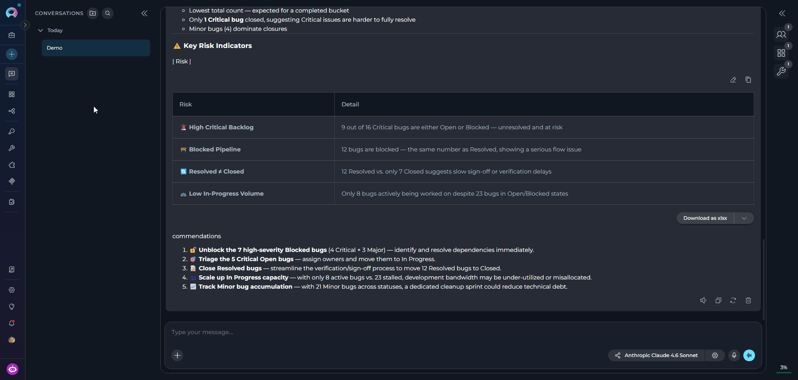

<CardGroup cols={3}>
  <Card title="Purpose" icon="circle-info">
    Demonstrate workflows, review complex interactions, or debug without incurring processing costs or waiting for live responses.
  </Card>
  <Card title="Activation" icon="play">
    Access via the conversation's context menu in the sidebar — right-click a conversation and select **Playback**.
  </Card>
  <Card title="Controls" icon="sliders">
    Move forward to the next message, go back to the previous message, or stop the playback simulation using the on-screen controls or keyboard arrow keys.
  </Card>
</CardGroup>

**Example: Using Playback Mode for a Demo**

**Scenario**:  
A Product Manager is preparing a demo for stakeholders to showcase how the team collaborated on a new feature. They use Playback Mode to simulate the conversation and highlight key decisions and actions.

**Steps to Use Playback Mode**:

**Access the Conversation**:  
   The Product Manager navigates to the conversation in the **CONVERSATIONS** sidebar where the team discussed the feature.

**Activate Playback Mode**:  
   The Product Manager right-clicks on the conversation and selects **Playback** from the context menu.

**Simulate the Conversation**:  
   - The playback starts with the BA's initial message outlining the feature requirements.  
     Example:  
     ```
     @BA: "The new feature should allow users to upload files up to 10MB in size. The system must validate file types and provide error messages for unsupported formats."
     ```
   - The PM uses the **Next** control to move to the next message, where they set the timeline for development and testing.  
     Example:  
     ```
     @PM: "The development team will complete the implementation by May 15th. QA can start testing on May 16th, and we aim to release the feature by May 20th."
     ```
   - The QA's message about testing strategies is reviewed next.  
     Example:  
     ```
     @QA: "I will create test cases for file uploads, including valid and invalid file types, file size limits, and error handling."
     ```

**Highlight Key Decisions**:  
   - The Product Manager pauses playback to explain the rationale behind certain decisions, such as the timeline or testing strategy.
   - They resume playback to show the BA's clarification about drag-and-drop uploads.  
     Example:  
     ```
     @BA: "Yes, drag-and-drop uploads should be supported. Additionally, the system should display a progress bar during uploads."
     ```

**Conclude the Demo**:  
   - The Product Manager stops playback after showcasing the final message tracking progress.  
     Example:  
     ```
     @PM: "QA, please share the test results by May 18th so we can review them before the release."
     ```

**Benefits of Playback Mode for Demos**

* **Polished Presentations**: Playback Mode ensures a smooth and professional demo without interruptions or delays.
* **Clarity**: Stakeholders can see the exact flow of discussions and decisions.
* **Engagement**: The step-by-step simulation keeps the audience engaged and focused on key points.

By using Playback Mode, teams can effectively demonstrate their collaboration and decision-making processes to stakeholders, ensuring transparency and alignment.