## Introduction

A Conversation in ELITEA represents a dynamic dialogue involving multiple participants. These can include language models (LLMs), Agents, Pipelines, Toolkits, MCPs, and human Users like yourself. You interact using natural language, and the chat maintains context, allowing you to refer to previous messages within the same conversation. Conversations are isolated; context is not shared between different conversations.

All your conversations are securely stored on the ELITEA server, making them accessible from any device where you log in. You can find all your conversations listed under the Chat menu in the sidebar.

**Key Features**

<CardGroup cols={3}>
  <Card title="Public & Private Conversations" icon="lock">
    Control visibility and collaboration by sharing conversations or keeping them private.
  </Card>
  <Card title="Diverse Participants" icon="users">
    Integrate Models, Agents, Pipelines, Toolkits, MCPs, and other Users (in public conversations).
  </Card>
  <Card title="Canvas Editor" icon="pen-to-square">
    Edit and refine AI-generated code, tables, diagrams, and DOCX files with built-in tools.
  </Card>
  <Card title="File Attachments" icon="paperclip">
    Upload and attach images and files for AI analysis and processing.
  </Card>
  <Card title="Modules" icon="wrench">
    Execute Python code, plan tasks, analyze data, create images, and more — no external integrations needed.
  </Card>
  <Card title="Rich Interactions" icon="comments">
    Engage with participants, copy responses, provide feedback, and regenerate outputs.
  </Card>
  <Card title="Conversation Management" icon="folder">
    Save, pin, share, delete, and organize conversations into folders.
  </Card>
  <Card title="Playback Mode" icon="play">
    Simulate and review conversation flows without engaging live models — ideal for demos.
  </Card>
</CardGroup>

## Working with Participants

Participants are the core components you interact with within a conversation.

### Adding Participants (Agents, Pipelines, Toolkits, MCPs)

You can add various AI participants to enhance your conversations:

<Tabs>
  <Tab title="Method 1: Using the + Button">
    1. In the chat input toolbar, select the **`+`** icon (tooltip: *Add files, agents, toolkits and more…*).
    2. A popup menu opens. Hover over the category you want:
       - **Agents** — shows a searchable list of available agents
       - **Pipelines** — shows a searchable list of available pipelines
       - **Toolkits** — shows a searchable list of available toolkits (with a Public/Private toggle)
       - **MCPs** — shows a searchable list of available MCP servers (with a Public/Private toggle)
    3. Search by name in the submenu search box, then select a participant to add it.
    4. The added participant appears in the **PARTICIPANTS** panel on the right side of the screen.
    5. For **Agents** and **Pipelines**: selecting the participant in the panel activates it. An **AgentEditorPanel** strip appears above the input area showing the participant name, version selector, variables and a settings button.

    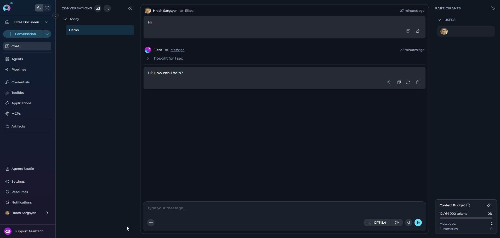
  </Tab>
  <Tab title="Method 2: Using the # Symbol">
    1. In the chat input box, type `#` to open a **Search results** dropdown of available participants.
    2. Continue typing to filter by name (e.g., `#Jira` will show all Jira-related participants).
    3. Select a participant from the filtered list — the dropdown searches across **Agents**, **Pipelines**, **Toolkits** and **MCPs**.
    4. The selected participant appears in the **PARTICIPANTS** panel.

    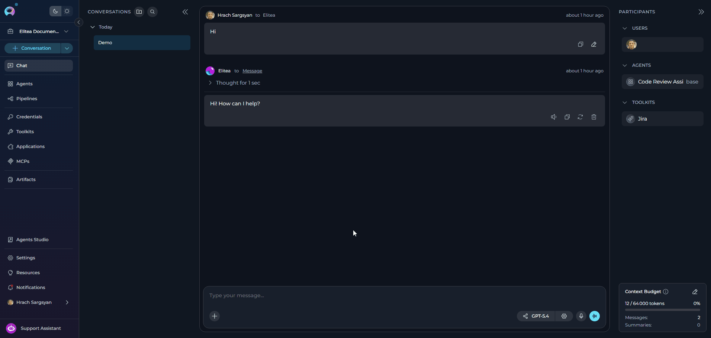
  </Tab>
</Tabs>

### Creating New Participants

You can create new participants directly from the chat interface via the `+` menu:

1. Select the **`+`** icon in the input toolbar.
2. Hover over the relevant category (Agents, Pipelines, Toolkits or MCPs).
3. Select the **Create New \{Type\}** option at the bottom of the submenu.
4. The corresponding Canvas editor opens inline.

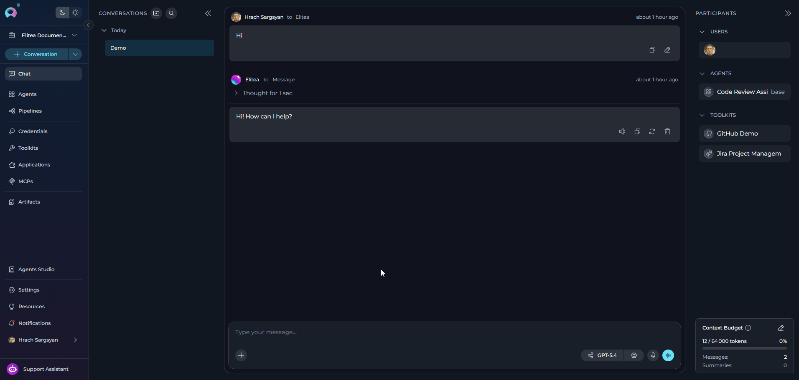

The **PARTICIPANTS** panel shows one collapsible accordion per participant type — **Users**, **Agents**, **Pipelines**, **Toolkits** and **MCPs** — with the **Users** accordion shown only in team projects.

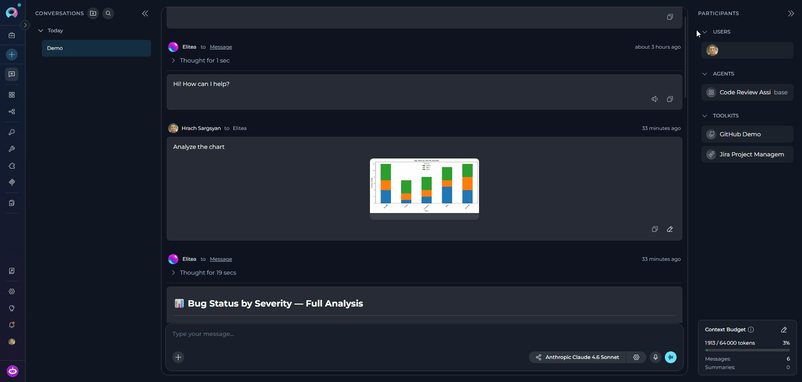

<Note title="Shared Toolkit Credentials">
If a toolkit in your Chat uses shared credentials that are not yet configured in your Personal workspace, a **Misconfiguration errors found. Check the toolkit.** message appears on the toolkit card. Clicking **Check the toolkit** opens the toolkit in the Canvas editor, where the **Credential setup required** warning banner is displayed. Click the **Create a credential** link to create the matching credential. See [Shared Toolkit Credentials](../../menus/toolkits#shared-toolkit-credentials) for details.

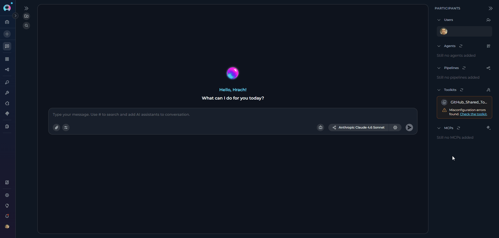
</Note>


### Adding Users to a Conversation

Users (team members) can only be added to in team projects. They cannot be added to private conversations.

**To Add Users:**

1. In the chat input toolbar, click the **`+`** icon.
2. Select **Invite Users** from the popup menu.
3. The **Add users** modal will appear with a search bar.
4. Use the search bar to find teammates by name.
5. Select one or more users from the list by clicking on them.
6. Click **Add** to confirm. The selected users will appear in the **Users** section of the **PARTICIPANTS** panel.

**Important Notes:**

* Added users will receive notifications about being added to the conversation.
* Users can also join a public conversation implicitly by interacting with it.
* Once a conversation is public, it cannot be converted back to private.
* Users can be removed by hovering over their avatar in the **Users** section of the Participants panel and clicking the remove icon.

For detailed information on adding teammates, see [Adding Teammates to Conversation](./add-teammates-to-conversation).

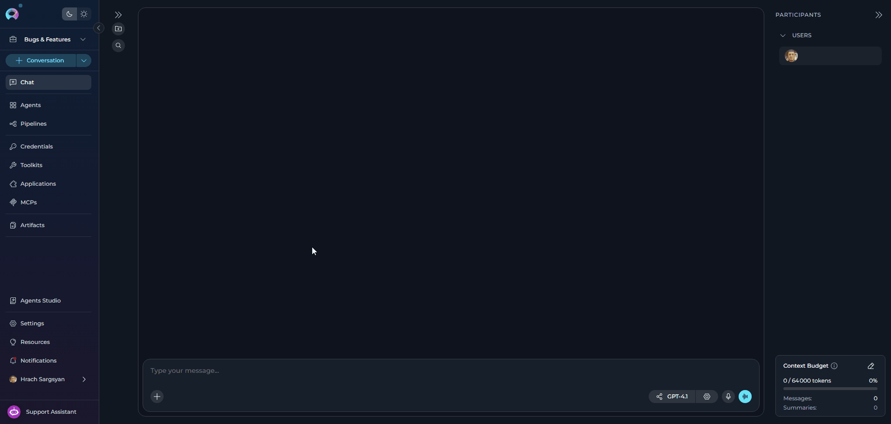

**Tips for Effective Collaboration in Team Projects**

* Use `@` mentions to notify specific teammates in a conversation.
* Group related conversations into folders for better navigation.
* Define roles, responsibilities, and deadlines directly in the chat.
* Regularly post progress updates and flag blockers in the conversation.

**Example: Collaboration in a Team Project**

<Accordion title="View collaboration scenario">
**Scenario**: The QA, PM, and BA team collaborate on a new file upload feature using a shared team project conversation.

**Steps:**

- **BA adds requirements:**
  ```
  @BA: "The new feature should allow users to upload files up to 10MB. The system must validate file types and provide error messages for unsupported formats."
  ```

- **PM sets the timeline:**
  ```
  @PM: "Development completes by May 15th. QA starts testing May 16th. Release target: May 20th."
  ```

- **QA plans testing:**
  ```
  @QA: "I'll create test cases for uploads, file types, size limits, and error handling. @BA, does the system support drag-and-drop uploads?"
  ```

- **BA clarifies:**
  ```
  @BA: "Yes, drag-and-drop should be supported. Also add a progress bar during uploads."
  ```

- **PM tracks progress:**
  ```
  @PM: "QA, please share test results by May 18th for pre-release review."
  ```

The PM creates a **"Feature: File Upload"** folder and moves the conversation there so all team members can find it easily.
</Accordion>

### Using Participants in a Conversation

Once added, participants are ready to process your messages:

1. **Check Participants**: Ensure the desired participant is listed in the **Participants** section.
2. **Select Active Participant(s)**: 
       - **Click**: Click the participant's name/icon in the **Participants** list to make it active for your next message.
3. **Mention Users** (Team Projects only): Hover over user avatars in the participant list or type **@username** in the chat input to mention and notify teammates in the conversation. To mention everyone in the conversation, select the **All Users** option.
4. **Send Message/Command**: Type your message or a simple command (like "Go", "Execute", "Run it") and press **Send**. The active participant(s) will process your input.

#### Mentioning Toolkits and Tools

You can direct the AI to use a specific tool from an already-added toolkit by typing `/` in the chat input. This is a two-phase selection:

**Select a Toolkit:**

1. In the chat input box, type `/` to open the **Mention toolkit** dropdown.
2. The dropdown lists all toolkits that are already added as participants in the current conversation.
3. Continue typing to filter by toolkit name (e.g., `/Jira` filters to Jira-related toolkits).
4. Click a toolkit name from the dropdown, or type the full name and press `/` again to confirm it.
5. The input updates to `/{ToolkitName}/` and the dropdown switches to show the toolkit's available tools.

**Select a Tool:**

6. The dropdown now shows **"{ToolkitName} available tools"** with all tools exposed by that toolkit.
7. Continue typing after the second `/` to filter tools by name (e.g., `/Jira/create` shows create-related tools).
8. Each tool shows its name and a short description.
9. Click the desired tool to confirm the selection.
10. The mention is committed to the input as `/{ToolkitName}/{ToolName}` with a cyan highlight and a trailing space so you can continue typing your message.

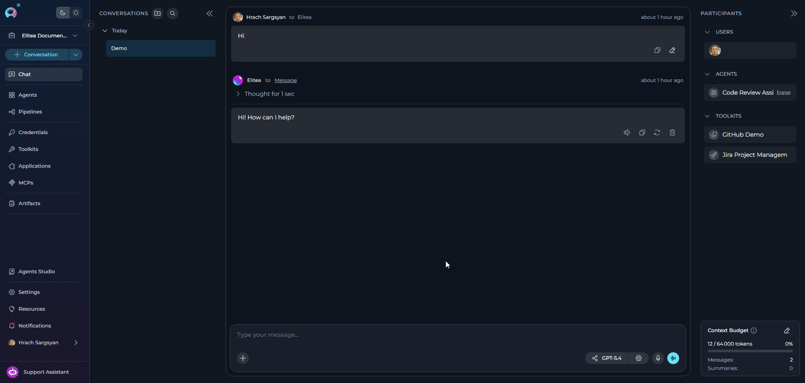

You can include multiple toolkit tool mentions in a single message, and they can be placed anywhere within the message. For example: `Please use /Jira/createIssue to create a new issue and then /GitHub/createPR to create a pull request.`

Each mention is highlighted independently and sent to the AI as separate tool directives.

<Note>
The `/` mention works with both **Toolkits** and **MCP** participants that are already added to the conversation. If a toolkit or MCP does not appear in the dropdown, add it first via the **`+`** button in the input toolbar or by typing `#`. Toolkits and MCPs with misconfiguration errors are excluded from the dropdown until the configuration issue is resolved.
</Note>

<Accordion title="Example Usage">
* **To ask a general question using a specific model**:
    1. Select a model from the model selector dropdown (e.g., `GPT-4o`).
    2. Type: `"Explain the concept of recursion in programming."` -> **Send**.

* **To use a specific agent**:
    1. Click the **`+`** icon in the input toolbar and hover over **Agents**.
    2. Select `Data Analysis Agent` from the submenu, or type `#Data Analysis Agent` in the input box.
    3. Type your request: `"Analyze the latest sales data."` -> **Send**.

* **To use a toolkit**:
    1. Click the **`+`** icon and hover over **Toolkits**. Select the desired toolkit (e.g., `Artifact Toolkit`).
    2. Type: `"Store this data in artifacts."` -> **Send**.

* **To mention a team member** (Team Projects only):
    1. In your message, type `@` followed by the team member's name (e.g., `@John Doe`).
    2. Type: `"@John Doe, can you review this analysis?"` -> **Send**.
</Accordion>

### Configuring Participants

You can configure and edit participants (Agents, Pipelines, Toolkits, and MCPs) directly within the conversation using the Canvas editor.

**Accessing Participant Settings:**

1. **Option 1**: Click the participant in the **Participants** list, then click the **⚙️** (settings) icon.
2. **Option 2**: Hover over the participant element in the **Participants** list and click the **Edit** icon that appears.
3. The appropriate **Canvas** editor will open based on the participant type.

**What You Can Configure:**

<Tabs>
  <Tab title="Agents">
    - Edit the agent's **prompt** and instructions
    - Modify **variables** used by the agent
    - Configure **model settings** 
    - Select the agent **version** (default is "base")
    - Adjust **toolkits** and integrations

    [→ Agent Canvas Guide](./how-to-create-and-edit-agents-from-canvas)
  </Tab>

  <Tab title="Pipelines">
    - Edit the pipeline **workflow** and step sequences
    - Modify **variables** and parameters
    - Configure **agents** used in the pipeline
    - Adjust **toolkits** and integrations
    - Select the pipeline **version** (default is "base")

    [→ Pipeline Canvas Guide](./how-to-create-and-edit-pipelines-from-canvas)
  </Tab>

  <Tab title="Toolkits">
    - Configure **integration settings** and credentials
    - Adjust **tool parameters** and options
    - Enable or disable specific tools within the toolkit
    - Modify **connection settings** for external services

    [→ Toolkit Canvas Guide](./how-to-create-and-edit-toolkits-from-canvas)
  </Tab>

  <Tab title="MCPs">
    - Configure **server connection** settings
    - Adjust **tool availability** and permissions
    - Modify **environment variables** and parameters
    - Set **timeout** and performance options

    <Info>
    MCP servers must be running before they can be used in conversations. Ensure your MCP server is started and accessible before adding it as a participant.
    </Info>

    [→ MCP Canvas Guide](./how-to-create-and-edit-mcps-from-canvas)
  </Tab>
</Tabs>

**Applying Changes:**

1. Make your edits in the Canvas editor.
2. Click the **Save** button to apply your modifications.
3. The updated configuration will be used for subsequent messages in the conversation.

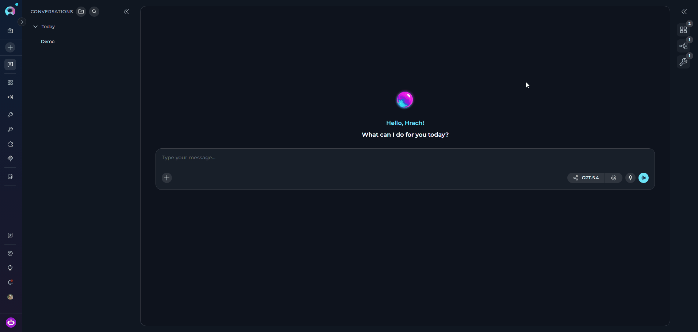

## Attaching Files and Images

Attach files and images directly to chat conversations for AI-powered analysis. This feature enables multimodal interactions where AI can process visual content, documents, and data files alongside text-based queries.

Every file you attach is automatically uploaded to the default `attachments` bucket — no manual Artifact Toolkit configuration is required. Files are accessible from the **Artifacts** section.

* **Images** are sent directly to the LLM for real-time vision analysis.
* **Non-image files** (documents, code, data) are indexed into a vector database and retrieved via semantic search.

**Attachment Limits:**

| Limit | Value |
|-------|-------|
| Max files per message | 10 |
| Max total size | 150 MB |
| Max size per file | 150 MB |
| Max image attachments | 10 |

**How to Attach Files:**

1. In the chat input toolbar, click the **`+`** icon.
2. Click **Attach Files**.
3. The native file browser opens — select one or more files.
4. Selected files appear as chips above the input field. To remove a file, click the **×** on its chip.
5. Type your message and press **Send**.

     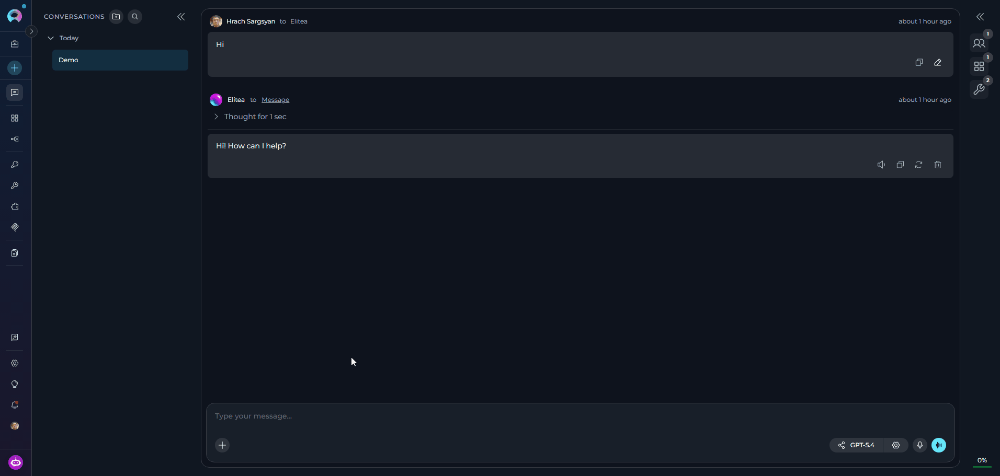

You can also attach files by:
- **Drag and drop** — drag files directly onto the chat input area.
- **Paste** — paste files or images from your clipboard with **Ctrl+V** / **Cmd+V**.

**Availability by Chat Type:**

| Context | Attachment availability |
|---------|------------------------|
| **Direct LLM / model chat** | Always enabled — **Attach Files** is active whenever no agent or pipeline is selected. |
| **Agent-based chat** | Only enabled if the agent has **Allow Attachments** toggled on in **Modules**. If not enabled, **Attach Files** is grayed out with the tooltip: *"Attachments aren't available for the selected agent or pipeline."* |
| **Pipeline-based chat** | Same rule as agents — requires `attachments` in **Modules**. |

<Tip title="Enable attachments for an agent">
To enable attachments for an agent,
1. Open the agent.
2. Find **Modules**.
3. Toggle **Allow Attachments** on.
4. Select **Save**.
</Tip>

For detailed information about attachments, including agent configuration and file management, see [Attach Files](./attach-files).

## Voice Capabilities

Chat includes voice input and voice output capabilities that let you speak your messages and have AI responses read back to you.

<CardGroup cols={3}>
  <Card title="Voice Input" icon="microphone">
    Dictate messages into the chat input field. Transcribed text is inserted at the cursor position in real time.
  </Card>
  <Card title="Text-to-Speech" icon="volume-high">
    Have AI responses read aloud. Pause and resume playback from a mini-player pill in the input area.
  </Card>
  <Card title="Speaking Mode" icon="waveform-lines">
    Hands-free voice conversation loop. ELITEA records, sends, speaks the response, and listens again — automatically.
  </Card>
</CardGroup>

### Voice Input

**Voice Input** lets you dictate messages directly into the chat input field using a microphone. The transcribed text is inserted at the **current cursor position**, so you can combine typed and spoken content in the same message — position your cursor anywhere in the text before starting to record.

**How to use Voice Input:**

1. (Optional) Click inside the input field and place the cursor where you want the dictation inserted.
2. Click the **microphone** icon in the message input toolbar (tooltip: *Start voice input*) to start recording.
3. The mic icon turns **teal** and a **Stop (■)** button appears beside it in a pill-shaped container — this indicates active recording.
4. Speak your message. A live transcript appears in the input field in real time. Interim (in-progress) words are shown immediately and replaced by the final transcript as recognition completes.
5. Click the **Stop (■)** button (tooltip: *Stop dictation*) to finish recording. The final transcript is committed at the cursor position and focus returns to the input field.
6. Review the transcribed text, then press **Send** to send your message.

<Info title="Note">
The **Send** button is disabled while recording is active. Stop recording before sending.
</Info>

   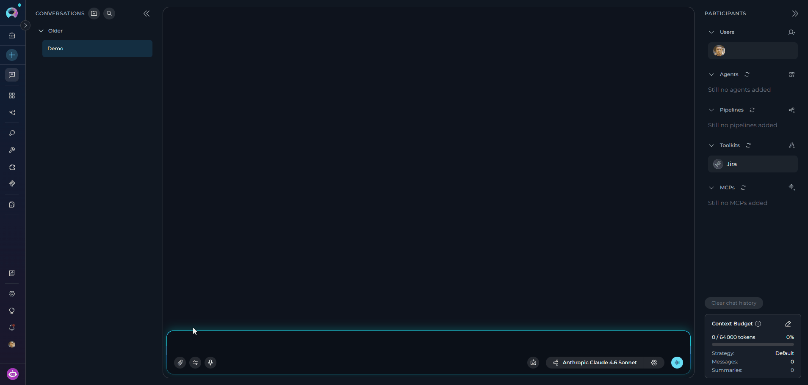

<Note>
**ASR model selection.** ELITEA selects the best available speech recognition source in the following priority order:

1. **Server-side Realtime/Streaming ASR model** (default model first, if configured in [Settings → AI Configuration → Speech Recognition](../../menus/settings/ai-configuration#speech-recognition-asr))
2. **Server-side Whisper ASR model** (default model first — batch transcription with slightly higher latency)
3. **Browser Web Speech API** (built-in browser fallback, no server configuration required)
4. **Microphone icon hidden** — if none of the above is available, the button is not shown

If an administrator has temporarily disabled voice features, the microphone icon is visible but grayed out with the tooltip *"Temporarily disabled by admin"*.
</Note>

### Text-to-Speech

**Text-to-Speech** reads AI responses aloud. A **Read out** button (megaphone icon) appears in the action bar below each AI message when the message contains speakable text.

**How to use Text-to-Speech:**

1. Click the **Read out** (megaphone) button below an AI message to start playback.
2. The text is read aloud and a **playback pill** appears in the input area containing:
   - A **megaphone** icon
   - A **Stop (■)** button (tooltip: *Stop speaking*) — click to stop playback
   - A **Voice settings (⚙)** gear icon (tooltip: *Voice settings*) — opens the Voice Settings dialog. Disabled while playback is active.
3. To restart playback after stopping, click the **Play (▶)** button that replaces the Stop button in the pill.

   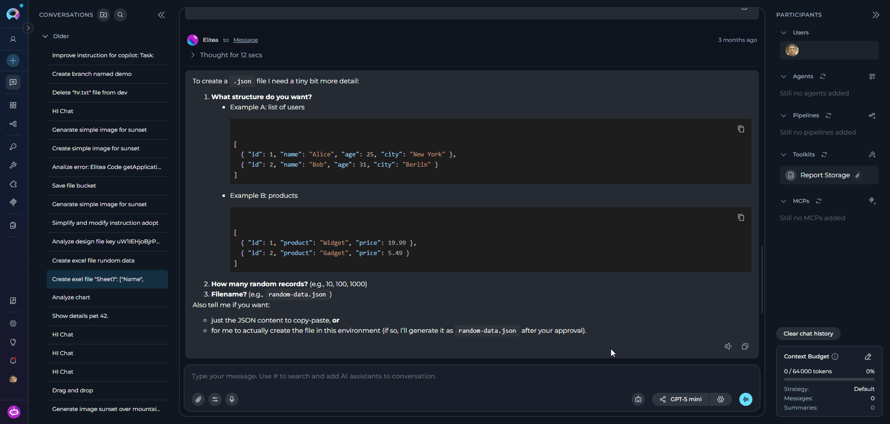

<Note>
When a TTS model is configured in [**Settings → AI Configuration → Text to Speech (TTS)**](../../menus/settings/ai-configuration#text-to-speech-tts), ELITEA uses that model for audio generation. If no TTS model is configured, playback uses the browser's built-in SpeechSynthesis API as a fallback.
</Note>

**Voice Settings:**

Click the **⚙** gear icon in the playback pill (only available when playback is stopped) to open the **Voice settings** dialog. Settings are saved to your browser and persist across sessions.

| Setting | Description |
|---------|-------------|
| **Voice** | Select the voice to use for playback. When a server-side TTS model is configured, the list shows that model's available voices. Without a server TTS model, the list shows your browser's built-in speech synthesis voices (non-local voices are marked *"online"*). |
| **Speed** | Controls playback rate. Range: **0.5×** (slower) to **2×** (faster). Default: **1×**. |
| **Volume** | Controls playback volume. Range: **Mute (0%)** to **100%**. Default: **100%**. |
| **Preview Voice** | Plays a short sample sentence with the currently selected voice and settings. Only available when playback is not active. |

Click **Apply** to save, or **Cancel** to discard changes.

   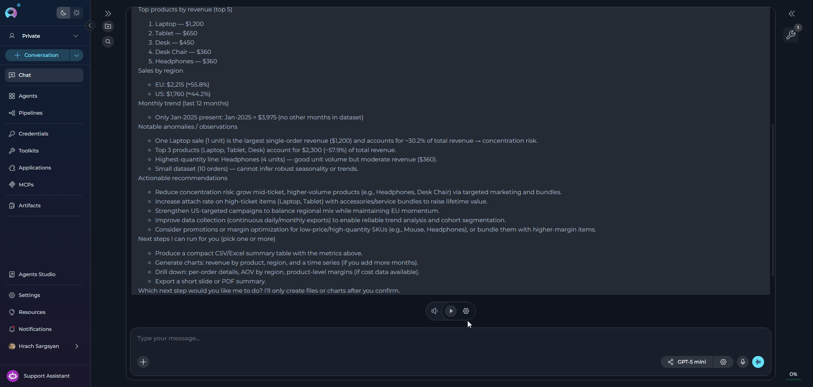


<Tip title="Global voice preferences">
You can also configure voice preferences globally under **User Settings → Profile → Voice Personalization**. These settings apply as the default for all new TTS playbacks across all conversations.
</Tip>

### Speaking Mode

<Warning>
Speaking Mode is only available **after the conversation has been created** — meaning at least one message must have been sent first. The voicewave icon does not appear in a brand-new, unsent conversation. Send your first message to initialize the conversation, then use Speaking Mode for subsequent turns.
</Warning>

**Speaking Mode** is a continuous, hands-free voice conversation loop. Once activated, ELITEA automatically records your speech, sends your message after a pause, plays back the AI's response, and then starts listening again — without any manual interaction between turns.

**How to activate Speaking Mode:**

1. Leave the message input field empty.
2. Click the **voicewave** icon (shown in place of the Send button when the input is empty) to enter Speaking Mode.
3. A voicewave pill with an **Exit** (✕) button replaces the send button, indicating Speaking Mode is active.
4. Speak your message. After **3 seconds of silence**, your message is automatically sent.
5. The AI response streams in and is read aloud via Text-to-Speech.
6. Once the response finishes playing, recording starts again automatically for the next turn.
7. Click the **✕** button in the voicewave pill to exit Speaking Mode at any time.

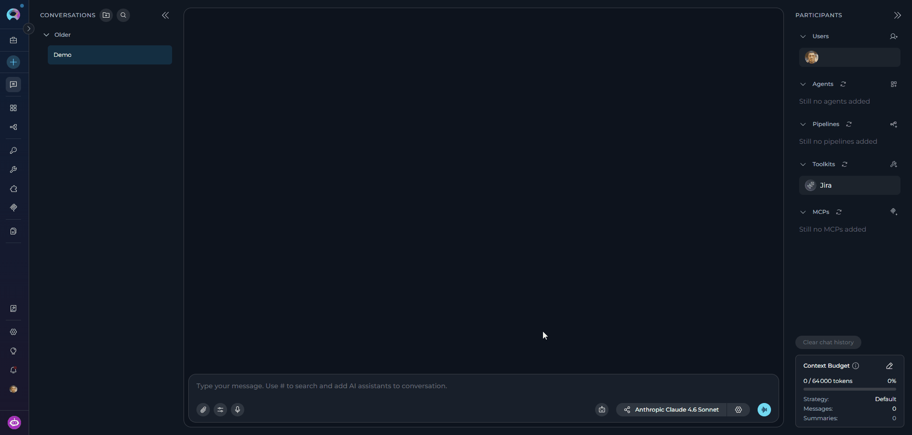

<Note>
Speaking Mode requires a voice recognition source (server ASR model or browser Web Speech API) for input and uses Text-to-Speech for output. If you start manual voice input while Speaking Mode is active, Speaking Mode is automatically deactivated.
</Note>