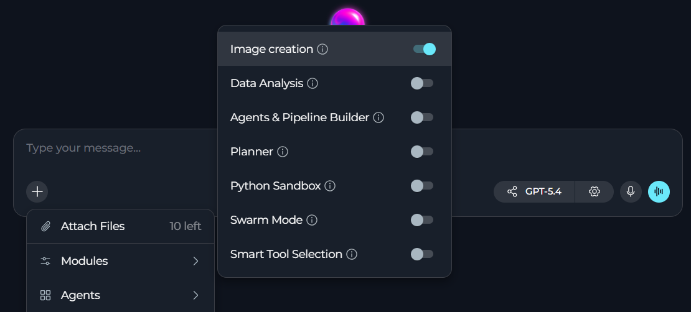
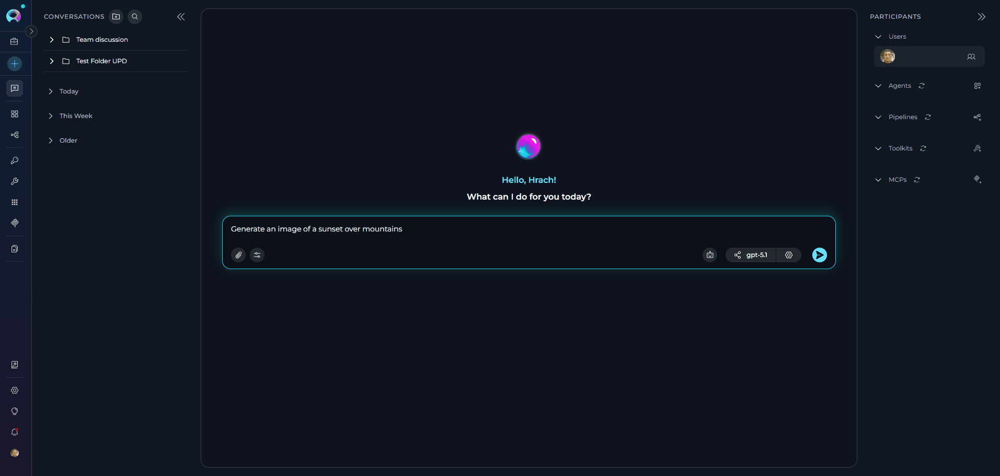
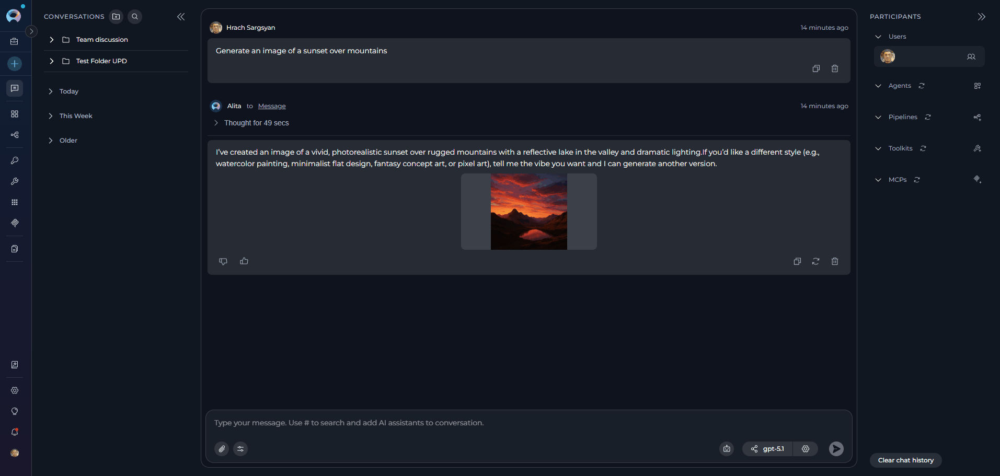
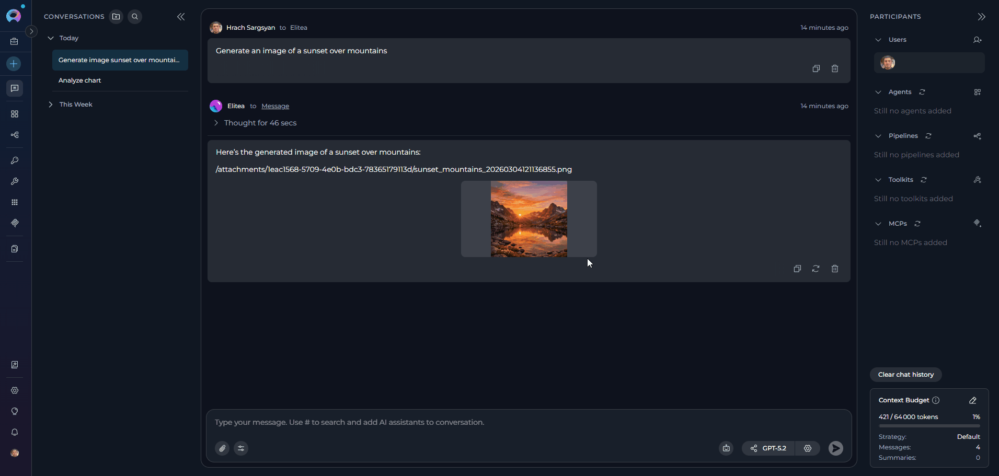
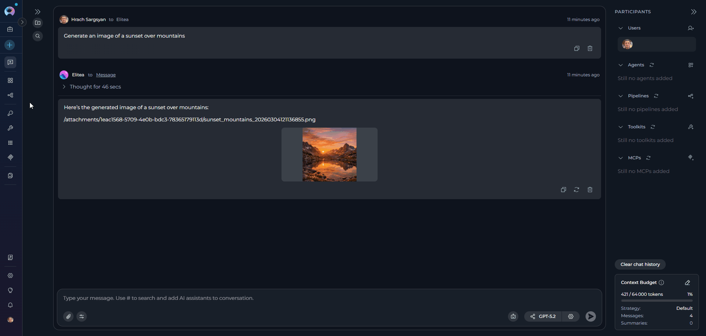

**Image Creation** module allows generating images directly from chat: images appear inline as thumbnails in the conversation and can be viewed full-size or downloaded.

## Prerequisites

To generate images, you need:
* An LLM model that supports image generation
* **Image Creation** enabled in your chat or agent
* An image generation model configured and selected in your project ([Settings > AI Providers](../../menus/settings/ai-providers))
* Proper project configuration by your administrator

<Note title="Not Seeing Image Creation?">
If the **Image Creation** module is not available, contact your administrator to enable image generation for your project.
</Note>

## How to Enable Image Creation

The default state of the **Image Creation** module — on or off — [is defined in the project settings](../../menus/settings/general#default-modules).

If **Image Creation** is turned off by default, you can turn it on for your current conversation or agent.

### For a Conversation

<Info title="Option Availability">
To generate images, your project must have the configured image generation provider toolkit. Without it, the **Image Creation** module is silently omitted from the list. Contact your administrator if you do not see it in the Modules list.
</Info>

1. Go to the conversation.
2. Select **+** in the chat input toolbar.
3. Select **Modules** → **Image Creation** in the list.
4. Toggle **Image Creation** on.
5. Use the model selector to choose a model with image generation capabilities.

### For an Agent

1. Select **Agents**.
2. Select the agent to configure, or create a new agent.
3. In the **TOOLS** section, find **Modules**.
4. Find **Image Creation**. Select **Show all** if you do not see it immediately.
5. Toggle **Image Creation** on.
6. Use the model selector to choose a model with image generation capabilities.
7. Select **Save**.

All changes apply only to new conversations run by this agent. Existing conversations will not be affected.

## How to Generate Images

<Note title="Technical Limitations">
**Technical Limitations**

* Available features depend on the specific image generation model.
* Higher quality images take longer to generate.
* Maximum image size varies by model.
</Note>

1. In the message input field, type a prompt describing the image you want to create.
2. Press **Send** or hit `Enter`. ELITEA will automatically invoke the image generation tool.
3. Generated image(s) will appear inline in the conversation.

<Info title="Storage and Deletion">
Generated images are automatically saved in **Artifacts** in the `attachments` bucket, inside a dedicated images folder. This folder is created automatically the first time you generate an image if it doesn't already exist.
</Info>

For example, you can ask:

* "Generate an image of a sunset over mountains"
* "Create a diagram showing a microservices architecture"
* "Generate an illustration of a friendly robot assistant"
* "Make an image of a modern office workspace"

In your prompts, you can specify:

* number of images
* image quality
* image size
* style

You can further refine a generated image through conversation, for example by saying "Make it brighter and add more natural light." Keep iterating until you are satisfied with the result.

## How to View and Manage Images

You can preview, download, and delete generated images both from the chat and from **Artifacts**.

### In Chat

To view the image in chat:

* Click the thumbnail to open the fullscreen modal.
* Press `Escape` or click outside to close.

To download the image in chat:
* Hover over the generated image thumbnail.
* Click the **Download** icon.

Images are downloaded to your system **Downloads** folder.

To delete the image from the chat:

* Hover over the generated image thumbnail.
* Select **Delete**.
* A confirmation dialog opens showing the image filename.
* The dialog includes an **"Also delete from attachment storage"** checkbox (unchecked by default):
     * Leave it unchecked to remove the image only from the chat view
     * Check it to delete the file from the Artifacts as well.
* Select **Delete**.

### In Artifacts

To view the image in **Artifacts**:

* Navigate to **Artifacts**.
* Open the **`attachments`** bucket.
* Navigate to the folder inside the bucket.
* All generated images are stored here with their timestamps.

To download the image from **Artifacts**, select the **Download** icon in the image's overflow menu.

To delete the image from **Artifacts**:

* Select an image in the bucket.
* Select **Delete** in the image's overflow menu.
* Confirm deletion in the opened window.

In **Artifacts**, you can download and delete images in bulk.

## Usage Scenarios

<Accordion title="Technical diagrams">
**Use case**: Generate architecture diagrams, flowcharts, or system designs

**Best practices:**

* Be specific about components and relationships
* Mention diagram type (flowchart, sequence diagram, architecture diagram)
* Specify colors or styles if needed
* Request multiple variations to choose the best one

**Prompt examples:**

* "Create a diagram showing a three-tier web application architecture with load balancer, web servers, and database"
* "Generate a flowchart for a user authentication process"
* "Make a network diagram showing VPN connection between offices"
</Accordion>

<Accordion title="Illustrations and concept art">
**Use case**: Create visual content for presentations, documentation, or creative projects

**Best practices:**

* Describe the mood and style (modern, minimalist, vibrant, professional)
* Specify color schemes when important
* Include context about the intended use
* Generate multiple options for comparison

**Prompt examples:**

* "Generate an illustration of a team collaborating in a modern office"
* "Create a hero image for a SaaS landing page showing productivity features"
* "Make an icon set for a project management application"
</Accordion>

<Accordion title="Design mockups and prototypes">
**Use case**: Quickly visualize UI/UX concepts or product designs

**Best practices:**

* Specify device type (mobile, tablet, desktop)
* Mention key UI elements to include
* Describe the color palette and brand style
* Request specific layout patterns if needed

**Prompt examples:**

* "Generate a mockup of a mobile app dashboard for fitness tracking"
* "Create a landing page design for an AI-powered writing assistant"
* "Make a product card design for an e-commerce website"
</Accordion>

<Accordion title="Data visualization">
**Use case**: Create charts, graphs, or infographics from described data

**Best practices:**

* Clearly describe the data and labels
* Specify chart type (bar, line, pie, scatter)
* Mention color preferences for different data series
* Include title and axis labels in your description

**Prompt examples:**

* "Generate a bar chart comparing quarterly sales for 2024"
* "Create an infographic showing the software development lifecycle"
* "Make a pie chart showing market share distribution"
</Accordion>

<Accordion title="Educational and training content">
**Use case**: Generate visual aids for learning materials

**Best practices:**

* Focus on clarity and simplicity
* Request labels or annotations
* Use clear, step-by-step descriptions
* Consider your audience's technical level

**Prompt examples:**

* "Create an illustration explaining how photosynthesis works"
* "Generate a diagram showing the layers of the OSI network model"
* "Make an image demonstrating proper ergonomic sitting posture"
</Accordion>

<Accordion title="Marketing and social media content">
**Use case**: Create branded visuals for marketing campaigns

**Best practices:**

* Specify dimensions for the target platform
* Include brand colors and style guidelines
* Mention text placement areas if needed
* Generate variations for A/B testing

**Prompt examples:**

* "Generate a social media post image announcing a product launch"
* "Create a banner image for an email newsletter about new features"
* "Make a promotional image for a webinar on AI automation"
</Accordion>

## Best Practices

<Accordion title="Crafting Effective Prompts">
* Be specific and descriptive to get more accurate results.
* Include context and purpose to help AI understand your intended use and style.
* Specify style and mood.
* Ask for several variants to choose from.
</Accordion>

<Accordion title="Managing Generated Content">
* Download images promptly with descriptive filenames.
* Use browser download management or dedicated folders to stay organized.
* Review initial generations critically and refine with feedback.
* Keep a record of effective prompts and document style preferences that provide consistent results.
</Accordion>

<Accordion title="Performance Optimization">
* Use faster models for quick iterations, and switch to high-quality models for final outputs.
* Consider model capabilities for specific image types when choosing a model.
* Generate multiple variations in one request when possible, but avoid requesting too many images at once.
* Balance quantity with quality for better results.
</Accordion>

## Troubleshooting

<Accordion title="I do not see the Image Creation module">
**Possible causes:**

* **Image Creation** is not enabled
* No image generation provider toolkit is configured for the project
* **Modules** are hidden because the project has no available modules
* Network connectivity issues

**Solutions:**

1. Refresh the page and try again.
2. Enable **Image Creation** in **Modules**.
3. Contact your project administrator.
</Accordion>

<Accordion title="ELITEA cannot generate an image">
**Possible cause:**

The selected model lacks image generation capabilities.

**Solution:**

1. Select a different model.
2. Verify model configuration with your project administrator.
3. Check integration settings for the image generation endpoint.
</Accordion>

<Accordion title="I cannot preview the generated image">
**Possible causes:**

* Image data format error
* Browser compatibility issues
* Base64 encoding problems
* Network interruption during generation

**Solutions:**

1. Refresh the page and regenerate the image.
2. Try a different browser (Chrome, Firefox, Edge).
3. Check the browser console for errors.
4. Ensure that your network connection is stable.
</Accordion>

<Accordion title="Image quality is too low">
**Possible causes:**

* Vague or ambiguous prompt
* Model limitations
* Size constraints

**Solutions:**

1. **Refine your prompt**: Add more specific details and context.
2. **Try different models**: Some models excel at specific image types.
3. **Specify larger sizes**: Request specific dimensions (e.g., 1024x1024).
</Accordion>

<Accordion title="I cannot download the generated image">
**Possible causes:**

* Browser blocks downloads
* Base64 conversion error
* Network timeout
* Insufficient browser storage

**Solutions:**

1. Check browser download permissions.
2. Right-click the image and select "Save Image As".
3. Refresh the page and retry downloading.
4. Clear browser cache and retry downloading.
</Accordion>

<Accordion title="Image generation takes too long">
**Possible causes:**

* Complex prompts require more processing
* Server load or API rate limits
* Network latency

**Solutions:**

1. Simplify your prompt for faster generation.
2. Generate one image at a time instead of bulk generation.
3. Wait for current operations to complete.
4. Try during off-peak hours if the rate is limited.
</Accordion>

<Info title="See also">
See also:

* **[Artifacts](../../integrations/toolkits/artifact_toolkit)**
* **[Agent Configuration](../../menus/agents)**
</Info>