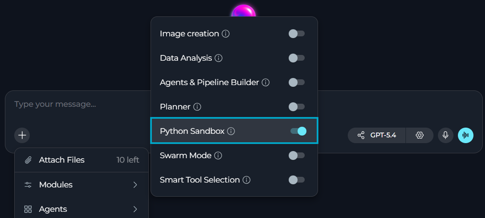
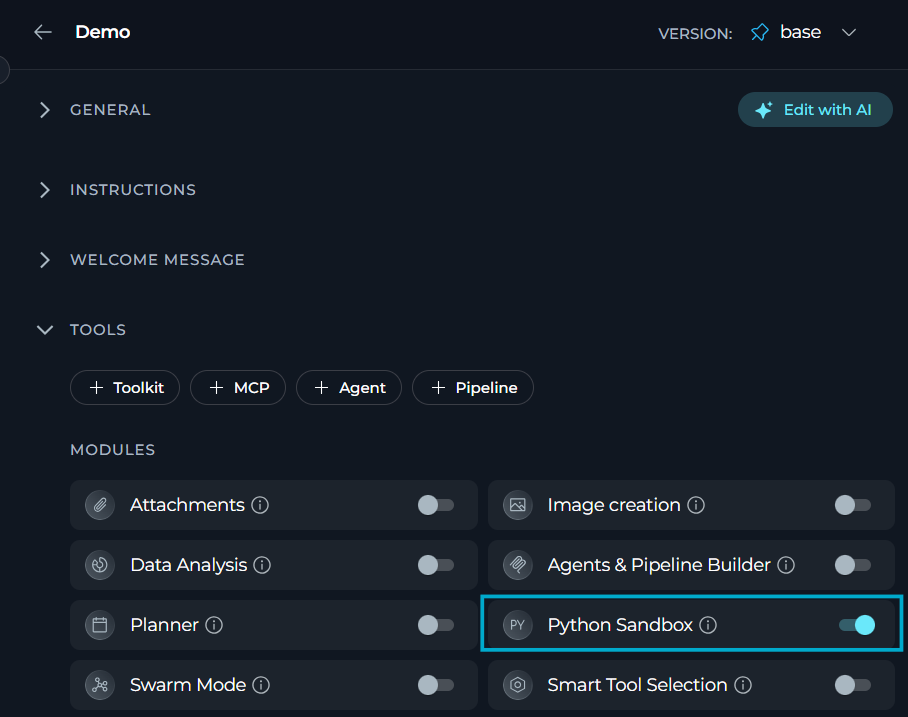
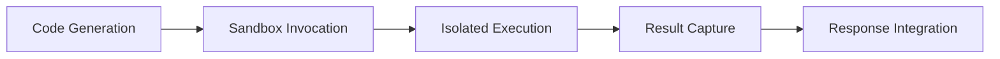

**Python Sandbox** module lets you run secure Python code directly in conversations, with persistent session state and access to Pyodide-compatible libraries.

**Key features:**

* Run Python code in an isolated WebAssembly environment with configurable permissions via Deno
* Access Pyodide-compatible packages
* Persist variables, imports, and function definitions across code blocks in the same conversation
* Execute calculations, data analysis, and visualizations without leaving the chat
* Skip setup entirely — runs out-of-the-box once Deno is installed on the server, no Python installation needed

## Prerequisites

- User role with conversation or agent edit access
- **Python Sandbox** enabled in your chat or agent

## How to Enable Python Sandbox

The default state of the **Python Sandbox** module — on or off — [is defined in the project settings](../../menus/settings/general#default-modules).

If **Python Sandbox** is turned off by default, you can turn it on for your current conversation or agent.

### For a Conversation

1. Go to the conversation.
2. Select `+` in the chat input toolbar.
3. Select **Modules** → **Python Sandbox** in the list.
4. Toggle **Python Sandbox** on.



Once enabled, you can execute Python code directly in that conversation.

### For an Agent

1. Select **Agents**.
2. Select the agent to configure, or create a new agent.
3. In the **TOOLS** section, find **MODULES**.
4. Find **Python Sandbox**. Select **Show all** if you do not see it immediately.
5. Toggle **Python Sandbox** on.
6. Select **Save**.

All changes apply only to new conversations run by this agent. Existing conversations will not be affected.



<Callout icon="lightbulb" color="#a855f7" title="">
For agents designed for data analysis, testing, or development tasks, enabling **Python Sandbox** significantly enhances their problem-solving capabilities and allows them to provide executable solutions.
</Callout>

## How Python Sandbox Works

With **Python Sandbox** enabled, you can:

- Execute multi-line Python scripts
- Use Pyodide-compatible packages (NumPy, Pandas, Matplotlib, SciPy, scikit-learn, etc.)
- Perform complex calculations and data transformations
- Generate visualizations and charts (via matplotlib)
- Maintain variables and state between executions in the same conversation
- Handle errors gracefully and provide debugging information
- Install additional packages available in the Pyodide ecosystem

**Traditional Approach vs Python Sandbox**

| Aspect | Without Python Sandbox | With Python Sandbox |
|--------|------------------------|---------------------|
| **Code Execution** | Copy code, run locally or in external tool | Execute code directly in conversation |
| **Environment Setup** | Install Python, packages, dependencies | No setup—Pyodide runs in WebAssembly via Deno |
| **Data Sharing** | Export/import files between tools | Process data within conversation context |
| **Results** | Manual copy-paste of outputs | Automatic integration of results into chat |
| **Security** | Depends on local environment | Isolated sandbox with restricted Deno permissions |

### Execution Flow

When Python Sandbox is enabled, ELITEA handles code execution automatically:



1. **Code Generation:** Assistant writes Python code to solve your request.
2. **Sandbox Invocation:** Code is sent to the Pyodide sandbox environment via Deno subprocess.
3. **Isolated Execution:** Code runs in WebAssembly with access to Pyodide packages.
4. **Result Capture:** Output (print statements, return values, errors) is captured.
5. **Response Integration:** Results are formatted and returned in the conversation.

### Possible Use Cases

<CardGroup cols={2}>
  <Card title="Data Analysis and Processing" icon="chart-line">
    - Process datasets and calculate statistics
    - Transform data structures using NumPy and Pandas
  </Card>
  <Card title="Algorithm Testing and Validation" icon="flask">
    - Test code snippets
    - Validate algorithms with comprehensive test cases
    - Prototype solutions before production implementation
  </Card>
  <Card title="Mathematical Computations" icon="square-root-variable">
    - Perform complex calculations
    - Solve equations
    - Run numerical analysis and mathematical modeling
  </Card>
  <Card title="Quick Prototyping" icon="bolt">
    - Iterate rapidly on solutions without leaving the conversation
    - Skip local environment setup
    - Get instant feedback during development
  </Card>
</CardGroup>


### Heavy Computational Tasks

When performing heavy computational tasks, keep in mind these limitations:

* **Timeouts:** Very large datasets or computationally intensive operations may hit Deno timeout limits (default: 60 seconds). For production workloads with large-scale data processing, use dedicated Python environments.
* **Package availability:** Some Python packages are not available in Pyodide. Check the [Pyodide packages list](https://pyodide.org/en/stable/usage/packages-in-pyodide.html) before relying on specific libraries. C-extension packages may not be supported.
* **File system access:** Limited file I/O capabilities due to WebAssembly sandbox restrictions. For tasks requiring extensive file operations or system-level access, consider alternative approaches.
* **Network operations:** Network access is configurable via Deno permissions but may be restricted depending on server configuration. External API calls and web scraping may not work as expected.

## Example Scenarios

<Accordion title="Example Conversation">
**User**: I'm writing a function to validate email addresses. Can you help me test it with various inputs to make sure it works correctly?

```python
import re

def validate_email(email):
    """
    Improved email validation with better edge case handling.
    """
    # Check for consecutive dots
    if '..' in email:
        return False

    # More strict regex pattern
    # Local part: starts and ends with alphanumeric, can contain ._+-% 
    # Domain: proper format with labels that start/end with alphanumeric
    pattern = (
        r'^[a-zA-Z0-9][a-zA-Z0-9._%+-]*[a-zA-Z0-9]'
        r'@[a-zA-Z0-9]+([.-][a-zA-Z0-9]+)*\.[a-zA-Z]{2,}$'
        r'|^[a-zA-Z0-9]@[a-zA-Z0-9]+([.-][a-zA-Z0-9]+)*\.[a-zA-Z]{2,}$'
    )

    return re.match(pattern, email) is not None
```

**Assistant**: I'll help you test your email validation function with a comprehensive set of test cases! Let me run various inputs through it to identify any edge cases.

A **Python Sandbox** badge appears in the chat. Selecting it opens the executed code and its output in separate panes:

```python

import re

def validate_email(email):
    """
    Improved email validation with better edge case handling.
    """
    # Check for consecutive dots
    if '..' in email:
        return False
    
    # More strict regex pattern
    pattern = r'^[a-zA-Z0-9][a-zA-Z0-9._%+-]*[a-zA-Z0-9]@[a-zA-Z0-9]+([.-][a-zA-Z0-9]+)*\.[a-zA-Z]{2,}$|^[a-zA-Z0-9]@[a-zA-Z0-9]+([.-][a-zA-Z0-9]+)*\.[a-zA-Z]{2,}$'
    
    return re.match(pattern, email) is not None

# Test cases
test_cases = [
    ("user@example.com", True),
    ("user.name@example.co.uk", True),
    ("user+tag@example.com", True),
    ("invalid.email@", False),
    ("@example.com", False),
    ("user@.com", False),
    ("user@example", False),
    ("user name@example.com", False),
    ("user@example..com", False),
]

print("Email Validation Test Results")
print("=" * 50)
passed = 0
failed = 0

for email, expected in test_cases:
    result = validate_email(email)
    status = "✓ PASS" if result == expected else "✗ FAIL"
    
    if result == expected:
        passed += 1
    else:
        failed += 1
    
    print(f"{status} | {email:30} | Expected: {expected}, Got: {result}")

print("=" * 50)
print(f"Results: {passed}/{len(test_cases)} passed, {failed} failed")

if failed > 0:
    print("\n⚠️  Some test cases failed. Review the pattern.")
else:
    print("\n✓ All test cases passed!")
```

**Output:**
```
Email Validation Test Results
==================================================
✓ PASS | user@example.com              | Expected: True, Got: True
✓ PASS | user.name@example.co.uk       | Expected: True, Got: True
✓ PASS | user+tag@example.com          | Expected: True, Got: True
✓ PASS | invalid.email@                | Expected: False, Got: False
✓ PASS | @example.com                  | Expected: False, Got: False
✓ PASS | user@.com                     | Expected: False, Got: False
✓ PASS | user@example                  | Expected: False, Got: False
✓ PASS | user name@example.com         | Expected: False, Got: False
✓ PASS | user@example..com             | Expected: False, Got: False
==================================================
Results: 9/9 passed, 0 failed

✓ All test cases passed!
```

Great! Your improved email validation function passes all test cases. The enhancements you made successfully handle:
- Consecutive dots (rejected)
- Domain without TLD (rejected)
- Proper multi-part domains (accepted)
- Special characters in local part (accepted when appropriate)
</Accordion>


<Accordion title="Data Analysis with NumPy and Statistics">
**Scenario:** A data analyst needs to quickly analyze a dataset and calculate statistical metrics.

**User Request:**

> "I have sales data for the past 12 months: [45000, 52000, 48000, 61000, 58000, 67000, 72000, 68000, 75000, 81000, 79000, 88000]. Calculate mean, median, standard deviation, and identify the growth trend."

**Assistant Response:**

The assistant generates and executes Python code using NumPy to:
- Calculate mean, median, and standard deviation
- Compute month-over-month growth rates
- Identify the overall trend
- Present results in a formatted summary

**Code Executed:**
```python
import numpy as np

sales_data = np.array([45000, 52000, 48000, 61000, 58000, 67000, 
                      72000, 68000, 75000, 81000, 79000, 88000])

mean_sales = np.mean(sales_data)
median_sales = np.median(sales_data)
std_dev = np.std(sales_data)

# Calculate month-over-month growth
growth_rates = np.diff(sales_data) / sales_data[:-1] * 100
avg_growth = np.mean(growth_rates)

print(f"Sales Analysis Report")
print("=" * 50)
print(f"Mean Sales: ${mean_sales:,.2f}")
print(f"Median Sales: ${median_sales:,.2f}")
print(f"Standard Deviation: ${std_dev:,.2f}")
print(f"Average Monthly Growth: {avg_growth:.2f}%")
print(f"Trend: {'Positive' if avg_growth > 0 else 'Negative'}")
```

Python Sandbox enables instant analysis without switching tools or exporting data, with results returned directly in the conversation.
</Accordion>

<Accordion title="Algorithm Testing with Edge Cases">
**Scenario:** A developer wants to test a binary search implementation with various edge cases.

**User Request:**

> "Test my binary search function with edge cases including empty arrays, single elements, duplicate values, and targets not in the array."

**Assistant Response:**

The assistant:
- Generates comprehensive test cases covering all edge cases
- Executes the algorithm with each test case
- Validates correctness for each scenario
- Reports results with detailed pass/fail status and execution details

**Code Executed:**
```python
def binary_search(arr, target):
    left, right = 0, len(arr) - 1
    
    while left <= right:
        mid = (left + right) // 2
        if arr[mid] == target:
            return mid
        elif arr[mid] < target:
            left = mid + 1
        else:
            right = mid - 1
    
    return -1

# Test cases
test_cases = [
    ([], 5, -1, "Empty array"),
    ([1], 1, 0, "Single element - found"),
    ([1], 2, -1, "Single element - not found"),
    ([1, 2, 3, 4, 5], 3, 2, "Standard case - middle element"),
    ([1, 2, 3, 4, 5], 1, 0, "First element"),
    ([1, 2, 3, 4, 5], 5, 4, "Last element"),
    ([1, 2, 3, 4, 5], 6, -1, "Target larger than all"),
    ([1, 1, 2, 2, 3, 3], 2, 2, "Duplicate values"),
]

print("Binary Search Test Results")
print("=" * 70)
passed = 0

for arr, target, expected, description in test_cases:
    result = binary_search(arr, target)
    status = "✓ PASS" if result == expected else "✗ FAIL"
    
    if result == expected:
        passed += 1
    
    print(f"{status} | {description:30} | Expected: {expected:3}, Got: {result:3}")

print("=" * 70)
print(f"Results: {passed}/{len(test_cases)} tests passed")
```

Python Sandbox provides immediate feedback on algorithm behavior and comprehensive edge case validation.
</Accordion>

<Accordion title="Mathematical Calculations and Equation Solving">
**Scenario:** A student needs to solve quadratic equations and understand the mathematical properties.

**User Request:**

> "Solve the quadratic equation 2x² - 8x + 6 = 0 and explain the solutions."

**Assistant Response:**

Using Python Sandbox with mathematical operations:
- Calculates discriminant to determine solution types
- Computes exact solutions using the quadratic formula
- Verifies solutions by substitution
- Explains the mathematical interpretation

**Code Executed:**
```python
import math

# Coefficients for 2x² - 8x + 6 = 0
a, b, c = 2, -8, 6

# Calculate discriminant
discriminant = b**2 - 4*a*c
print(f"Quadratic Equation: {a}x² + ({b})x + {c} = 0")
print("=" * 50)
print(f"Discriminant (b² - 4ac): {discriminant}")

if discriminant > 0:
    x1 = (-b + math.sqrt(discriminant)) / (2*a)
    x2 = (-b - math.sqrt(discriminant)) / (2*a)
    
    print(f"\nTwo distinct real solutions:")
    print(f"x₁ = {x1}")
    print(f"x₂ = {x2}")
    
    # Verify solutions
    print(f"\nVerification:")
    print(f"For x₁={x1}: {a}({x1})² + ({b})({x1}) + {c} = {a*x1**2 + b*x1 + c:.10f}")
    print(f"For x₂={x2}: {a}({x2})² + ({b})({x2}) + {c} = {a*x2**2 + b*x2 + c:.10f}")
elif discriminant == 0:
    x = -b / (2*a)
    print(f"\nOne repeated real solution: x = {x}")
else:
    real_part = -b / (2*a)
    imaginary_part = math.sqrt(-discriminant) / (2*a)
    print(f"\nTwo complex solutions:")
    print(f"x₁ = {real_part} + {imaginary_part}i")
    print(f"x₂ = {real_part} - {imaginary_part}i")
```

Python Sandbox brings mathematical concepts to life with executable code and instant verification.
</Accordion>

## Best Practices

<Accordion title="Leverage Pyodide's package ecosystem">
Pyodide supports many popular Python packages including NumPy, Pandas, Matplotlib, SciPy and scikit-learn. These packages are precompiled for WebAssembly and work seamlessly in the sandbox environment.

Check the [Pyodide packages list](https://pyodide.org/en/stable/usage/packages-in-pyodide.html) for available packages. 
</Accordion>

<Accordion title="Break complex tasks into logical steps">
Ask ELITEA to break complex analysis into logical steps. Each code block can build on previous results since the sandbox maintains state within a conversation. This makes it easier to understand the process and identify issues.
</Accordion>

<Accordion title="Combine with Data Analysis module">
When working with conversation attachments (CSV, Excel files), enable both Python Sandbox and [Data Analysis](./data-analysis-internal-tool) modules. Python Sandbox provides the execution environment, while Data Analysis can help with file parsing and data structure handling.
</Accordion>

<Accordion title="Combine with Swarm Mode for multi-agent workflows">
Python Sandbox works seamlessly alongside [Swarm Mode](./swarm-mode-internal-tool). In multi-agent setups, individual child agents can each have Python Sandbox enabled, allowing them to perform independent code execution tasks within the shared conversation context.
</Accordion>

<Accordion title="Review generated code for learning">
While Python Sandbox is secure and isolated, reviewing the code the assistant plans to execute helps you understand the approach and learn from the implementation. This is especially valuable for educational use cases.
</Accordion>

<Accordion title="Provide sample data for better results">
When requesting data analysis or processing, include sample data in your message or describe the data format clearly. This helps the assistant generate more accurate and relevant code tailored to your specific use case.
</Accordion>

<Accordion title="Use descriptive requests for clear code">
When asking the assistant to work with data structures or algorithms, use clear descriptions and specify expected behavior. This helps generate more readable and maintainable code with appropriate variable names and comments.
</Accordion>

## Troubleshooting

<Accordion title="Python Sandbox does not execute code">
**Possible Causes:**

* Python Sandbox not enabled in chat or agent configuration
* Deno not installed on the server
* Backend service unavailable or crashed

**Solution:**

1. Verify Python Sandbox is enabled in MODULES for the chat or agent
2. Check that the success notification appeared when enabling the tool
3. Contact system administrator to verify Deno installation on the server
4. Try disabling and re-enabling Python Sandbox to reset the connection
5. Refresh the page and start a new chat to reset state
6. Check server logs for Deno-related errors
</Accordion>

<Accordion title="Package import fails">
**Possible Causes:**

* Package not available in the Pyodide ecosystem
* Package not preloaded in the sandbox environment
* Typo in package name

**Solution:**

1. Verify the package is listed in the [Pyodide packages list](https://pyodide.org/en/stable/usage/packages-in-pyodide.html)
2. Use alternative packages that are Pyodide-compatible
3. Check the error message for suggestions on alternative packages
4. Some pure Python packages may need to be loaded dynamically
</Accordion>

<Accordion title="Code execution times out">
**Possible Causes:**

* Long-running computations exceeding the timeout limit
* Infinite loops in the code
* Large dataset processing taking too long

**Solution:**

1. Break large computations into smaller chunks that execute faster
2. Optimize algorithms to reduce time complexity
3. Use iterative processing for large datasets
4. Review code for potential infinite loops or performance bottlenecks
5. Consider using a local Python environment for heavy computations
</Accordion>

<Accordion title="Session does not preserve variables between executions">
**Possible Causes:**

* Conversation reset or page refresh
* Backend session expiration
* An error in a previous code execution corrupted the session state

**Solution:**

1. Re-run initialization code to redefine variables and imports
2. Avoid page refreshes during stateful work sessions
3. Check for errors in previous executions that may have corrupted the state
4. Use explicit variable definitions in each code block for critical values
5. Start a new conversation if the session state is corrupted
</Accordion>

<Accordion title="Network requests fail">
**Possible Causes:**

* Network access not allowed by Deno permissions
* Firewall blocking outbound connections from the sandbox
* Using the `requests` library instead of `httpx.AsyncClient`

**Solution:**

1. Ensure network access is configured in the sandbox settings (`allow_net=True`)
2. Use `httpx.AsyncClient` for HTTP requests instead of the `requests` library
3. Contact the administrator to check the Deno network permission configuration
4. Check if specific domains need to be whitelisted in the Deno settings
</Accordion>

<Info title="See also">
See also:
- [Pyodide Documentation](https://pyodide.org/en/stable/)
- [Pyodide Packages](https://pyodide.org/en/stable/usage/packages-in-pyodide.html)
- [Deno Documentation](https://docs.deno.com/)
- [Data Analysis](./data-analysis-internal-tool)
- [Swarm Mode](./swarm-mode-internal-tool)
</Info>