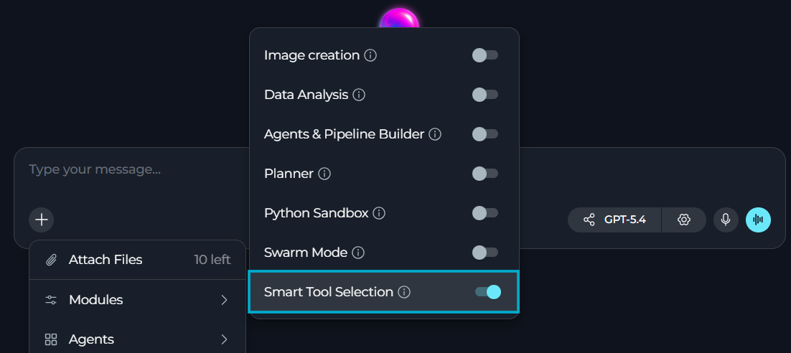
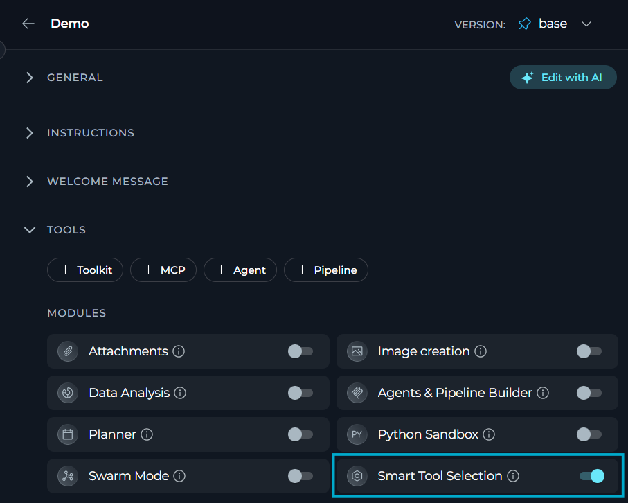
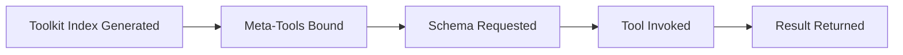

**Smart Tools Selection** module reduces token usage by loading toolkit schemas and tools on demand.

**Key features:**

* Reduce token usage
* Access all toolkit functionality through two meta-tools
* Load tool schemas on demand instead of pre-binding every tool to the LLM
* Keep the same final tool results as direct binding
* Preserve toolkit organization for efficient tool discovery and invocation

<Callout icon="lightbulb" color="#a855f7" title="">
Enable **Smart Tools Selection** once an agent or conversation has **5 or more toolkits** configured. Note that it only takes effect once there are **20 or more** eligible tools in total — below that, every tool stays bound directly no matter what the toggle says. Above that, token savings grow as tool count rises further.
</Callout>

## Prerequisites

- User role with conversation or agent edit access
- At least 20 eligible toolkit tools configured in total
- **Smart Tools Selection** enabled in your chat or agent

## How to Enable Smart Tools Selection

The default state of the **Smart Tools Selection** module — on or off — [is defined in the project settings](../../menus/settings/general#default-modules).

If **Smart Tools Selection** is turned off by default, you can turn it on for your current conversation or agent.

### For a Conversation

1. Go to the conversation.
2. Select `+` in the chat input toolbar.
3. Select **Modules** → **Smart Tools Selection** in the list.
4. Toggle **Smart Tools Selection** on.



Once enabled, the setting persists for that conversation; you can toggle it off at any time.

### For an Agent

1. Select **Agents**.
2. Select the agent to configure, or create a new agent.
3. In the **TOOLS** section, find **MODULES**.
4. Find **Smart Tools Selection**. Select **Show all** if you do not see it immediately.
5. Toggle **Smart Tools Selection** on.
6. Select **Save**.

All changes apply only to new conversations run by this agent. Existing conversations will not be affected.



## How Smart Tools Selection Works

With **Smart Tools Selection** enabled:

- Only two meta-tools are bound to the LLM: `get_tool_schema` and `invoke_tool`
- Every configured toolkit's tools remain reachable through `invoke_tool`, without being bound directly
- The assistant retrieves a tool's parameter schema on demand via `get_tool_schema`, right before calling it
- A compressed toolkit index (toolkit names, tool lists, instance descriptions) is included in the system prompt instead of full tool schemas
- Toolkit structure is preserved, so tools stay organized and easy to discover

**Smart Tools Selection** behavior depends on the exact module:

* **Planner** — always bound directly to the model, never routed through `get_tool_schema`/`invoke_tool`. Enabling Smart Tools Selection brings no benefit here.
* **Image Creation** — implemented as a direct model/provider call, not a tool bound to the LLM at all, so it's unaffected either way.
* **Swarm Mode** — forces every peer agent's tools to bind directly for that peer, which disables lazy loading for the whole toolset while Swarm Mode is active.
* **Python Sandbox**, **Data Analysis**, **Ask User** — no exemption. These are ordinary toolkit tools and get swept into the lazy-tools registry like any other tool once the 20-tool threshold is met.

**Meta-Tools**

| Meta-Tool | Purpose | Functionality |
|-----------|---------|----------------|
| **`get_tool_schema(toolkit, tool)`** | Schema retrieval | Returns a tool's description and required/optional parameters before it is invoked |
| **`invoke_tool(toolkit, tool, arguments)`** | Tool execution | Executes a tool from any configured toolkit and returns the result |

**Traditional Approach vs Smart Tools Selection**

| Aspect | Traditional Approach | Smart Tools Selection |
|--------|---------------------|------------------------|
| **Tool Binding** | Every tool from every toolkit bound directly to the LLM | Only 2 meta-tools bound: `get_tool_schema` and `invoke_tool` |
| **Schema Transmission** | Each tool's full schema sent in every request | Compressed toolkit index included in the system prompt |
| **Tool Loading** | All tools pre-loaded upfront | Tools loaded on demand when needed |
| **Example (50 toolkits)** | 50 toolkits × 10 tools avg = 500 tool definitions bound to the model | 2 meta-tools + one compact index entry per toolkit type |

*Actual token savings depend on toolkit count, average tools per toolkit, and schema size — measure your own usage rather than relying on a fixed estimate.*

### Execution Flow

When Smart Tools Selection is enabled, ELITEA handles tool access automatically:



1. **Toolkit Index Generation:** The system generates a compressed index of all available toolkits and their tools.
2. **Meta-Tool Binding:** Only `get_tool_schema` and `invoke_tool` are bound to the LLM, instead of every individual tool.
3. **Schema Retrieval:** When a tool is needed, the assistant calls `get_tool_schema` to learn its parameters.
4. **Tool Invocation:** The assistant calls `invoke_tool` with the toolkit name, tool name, and arguments.
5. **Result Return:** The tool's result is returned to the conversation like any other tool call. `invoke_tool` calls are not shown as a separate action chip, but `get_tool_schema` lookups appear as visible steps in the assistant's action trace.

<Info title="What the Assistant Sees">
When Smart Tools Selection is enabled, a compressed toolkit index is included in the system prompt:

<Accordion title="System Prompt">
```
# Available Tools

You have 2 meta-tools to access all functionality:
- get_tool_schema(toolkit, tool) - Get parameter schema for a tool BEFORE calling it
- invoke_tool(toolkit, tool, arguments) - Execute a tool

IMPORTANT: Each toolkit name (e.g., 'sdk', 'docs', 'core') targets a DIFFERENT repository.
Use the EXACT toolkit name to work with that specific repo. The toolkit name IS the repo selector.

SCHEMA EFFICIENCY: Toolkits of the same type share identical schemas.
Get schema once per tool (e.g., get_tool_schema('sdk', 'search_code')), then reuse that knowledge
for other toolkits of same type - just change the toolkit name in invoke_tool.

Example: invoke_tool(toolkit="frontend_repo", tool="create_issue", arguments={...})

## Type: github
  Toolkit names (use one of these exactly):
    - "backend_repo": GitHub toolkit for backend repository
    - "frontend_repo": GitHub toolkit for frontend repository
  Tools (45): close_issue, create_issue, create_pr, list_issues, merge_pr, ...

## Type: jira
  Toolkit name: "project_jira"
  Description: Jira toolkit for main project
  Tools (28): create_ticket, search_tickets, update_ticket, ...

Total: 3 toolkits, 118 tools
```
</Accordion>

This compact format lets the assistant access hundreds of tools while using minimal tokens. The `Tools (N)` count per type is deduplicated across instances of the same type, but the final `Total` counts tools per toolkit instance — so two GitHub instances with 45 identical tool names each contribute 45+45 to the total, not 45.
</Info>

### Possible Use Cases

<CardGroup cols={2}>
  <Card title="Many Configured Toolkits" icon="layer-group">
    - Token savings scale with toolkit and tool count
    - No effect below 20 eligible tools total
  </Card>
  <Card title="Cross-Platform Integration" icon="diagram-project">
    - Agents orchestrating work across GitHub, Jira, Confluence, Slack, etc.
    - Each additional platform increases the value of on-demand loading
  </Card>
  <Card title="Multi-Instance Toolkits" icon="clone">
    - Agents managing multiple instances of the same service (e.g., several GitHub repositories)
    - Reduced token overhead while keeping access to every instance
  </Card>
  <Card title="Token-Constrained Conversations" icon="coins">
    - Conversations that would otherwise approach context limits with many bound tools
    - Frees up context for actual conversation content
  </Card>
</CardGroup>

### Limitations

* **Hard 20-tool floor:** Smart Tools Selection is silently disabled whenever the eligible tool count (excluding always-bound tools like Planner's) is below 20 — even with the toggle on, every tool remains directly bound with no warning shown.
* **Latency:** Meta-tool invocations add roughly 1-2 seconds per tool call. For latency-critical, single-toolkit operations, direct binding may be preferred.
* **Highly repetitive tool usage:** When a conversation repeatedly uses the same 2-3 tools, direct binding keeps schemas in context without repeated lookups.
* **Keyword-based pre-selection can bypass meta-tools:** A separate toolkit pre-selection step can bind a toolkit's tools directly based on keywords in the request, independent of the 20-tool floor — those tools are bound directly for that turn rather than routed through `get_tool_schema`/`invoke_tool`.
* **Sub-agents and pipelines are always bound:** Child agents and pipelines added as tools are always bound directly to the model and are never routed through the meta-tools, regardless of toolkit or tool count.

## Example Scenarios

<Accordion title="QA Testing Coordinator">
**Scenario:** A QA engineer uses an agent to manage test cases across multiple test management systems and coordinate with development teams.

**Configuration:**

- TestRail (test case management)
- Xray (Jira test management)
- GitHub (2 repositories for test automation)
- Slack (team communication)
- Artifact storage (test results)
- **Total: 6 toolkits, ~85 tools**

**User Request:**

> `Find all failed test cases from yesterday's regression suite in TestRail, check if there are existing bugs in Xray for these failures, and create GitHub issues for any new defects`

Smart Tools Selection allows the agent to seamlessly query TestRail, cross-reference with Xray, and create GitHub issues — all while keeping token usage minimal despite having access to multiple test management platforms.
</Accordion>

<Accordion title="Multi-Client Services Agency">
**Scenario:** A digital agency manages projects for 5 different clients, each with their own GitHub repository and Jira project.

**Configuration:**

- 5 GitHub repositories (one per client)
- 5 Jira projects (one per client)
- 1 Confluence space (internal documentation)
- 1 Slack workspace (internal communication)
- **Total: 12 toolkits, ~160 tools**

**Without Smart Tools Selection:** all 160 tools bound directly to the model — costly for per-client conversations.

**With Smart Tools Selection:** only 2 meta-tools plus the compact toolkit index are bound — a large drop in bound-tool overhead. *(Illustrative example; actual savings depend on your toolkit index size and vary by configuration.)*

**User Request:**

> `Check the status of Client A's payment feature PR, update Client B's sprint board with completed stories, and document the deployment process in our internal wiki`

The agent can work across multiple client repositories and projects efficiently, with the assistant only loading the specific tools needed for each client when required.
</Accordion>

<Accordion title="Documentation Hub Agent">
**Scenario:** A technical writer maintains documentation across multiple platforms and needs to keep content synchronized.

**Configuration:**

- 3 Confluence spaces (product docs, internal wiki, knowledge base)
- 2 GitHub repositories (docs-as-code projects)
- SharePoint (legacy documentation)
- Artifact storage (documentation assets)
- **Total: 7 toolkits, ~95 tools**

**User Request:**

> `Search all documentation sources for references to the old API endpoint, update them with the new endpoint, and create a migration guide in the product documentation space`

Smart Tools Selection enables efficient cross-platform documentation searches and updates without the overhead of binding nearly 100 documentation-related tools.
</Accordion>

## Best Practices

<Accordion title="Use descriptive toolkit names for multi-instance configurations">
When configuring multiple instances of the same toolkit type (e.g., GitHub for different repos), use clear, semantic names that the assistant can understand: `github_frontend`, `github_backend`, `github_docs` rather than generic names.
</Accordion>

<Accordion title="Leverage schema reuse across toolkit instances">
Toolkits of the same type share identical schemas. The assistant calls `get_tool_schema` once to learn a tool's parameters, then reuses that knowledge across all instances by changing only the toolkit name in `invoke_tool` calls.
</Accordion>

<Accordion title="Monitor and validate token savings">
Use your LLM provider's token monitoring dashboard to verify actual savings. Compare usage before and after enabling.
</Accordion>

<Accordion title="Test before deploying to production">
For new multi-toolkit agents, test both configurations: run the agent with Smart Tools Selection disabled to establish a baseline, then enable it to measure performance and token savings in your specific use case.
</Accordion>

<Accordion title="Configure only necessary toolkits">
Smart Tools Selection optimizes token usage but doesn't replace thoughtful toolkit selection. Only configure toolkits that the agent actually needs — unused toolkits still add to the index size.
</Accordion>

<Accordion title="Consider latency requirements">
Meta-tool calls add minimal overhead (1-2 seconds per tool invocation). For latency-sensitive applications using few toolkits, evaluate whether the token savings justify the additional response time.
</Accordion>

## Troubleshooting

<Accordion title="Tools not being invoked">
**Possible causes:**

* Smart Tools Selection not properly enabled
* Meta-tools not accessible to the assistant
* Toolkit index not generated

**Solution:**

1. Verify Smart Tools Selection is enabled in **Modules**.
2. Check conversation logs for meta-tool calls (`get_tool_schema`, `invoke_tool`).
3. Try disabling and re-enabling Smart Tools Selection.
4. If issues persist, disable Smart Tools Selection and use traditional tool binding.
</Accordion>

<Accordion title="Increased latency">
**Possible causes:**

* Additional meta-tool calls add minor overhead
* Multiple schema lookups for complex workflows

**Solution:**

1. This is expected behavior — Smart Tools Selection trades minimal latency for significant token savings.
2. For latency-critical single-toolkit use cases, consider disabling Smart Tools Selection.
3. Latency overhead is typically 1-2 seconds per tool invocation.
4. There is no built-in caching of schema results — each `get_tool_schema` call is a fresh lookup, so repeated calls for the same tool are expected.
</Accordion>

<Accordion title="Tool not found errors">
**Possible causes:**

* Incorrect toolkit name in invocation
* Tool not available in specified toolkit
* Toolkit index not properly synchronized
* Tool blocked by security policy

**Solution:**

1. The assistant receives detailed error messages with available toolkits and tools.
2. Error responses include suggestions for correct toolkit/tool names.
3. The assistant can self-correct by using the provided information.
4. If the error text says the tool "is blocked by security policy," the tool is intentionally disabled — check with your administrator rather than treating it as a naming or configuration issue.
5. If errors persist otherwise, verify toolkit configuration in agent settings.
</Accordion>

<Accordion title="Higher token usage than expected">
**Possible causes:**

* Using single or few toolkits (limited benefit)
* Frequent schema lookups for different tools
* Very long conversation history

**Solution:**

1. Verify you have 5+ toolkits configured for meaningful savings.
2. Review the conversation to ensure meta-tools are being used.
3. Consider disabling Smart Tools Selection for single-toolkit use cases.
4. Token savings are most significant in the system prompt, not conversation history.
</Accordion>

<Accordion title="Schema errors or missing parameters">
**Possible causes:**

* Tool schema not properly extracted
* Parameter validation issues
* Toolkit metadata incomplete

**Solution:**

1. Error messages include detailed parameter requirements and examples.
2. The assistant receives schema information before invocation.
3. Verify toolkit configuration includes proper tool metadata.
4. If specific tools fail consistently, report to system administrators.
</Accordion>