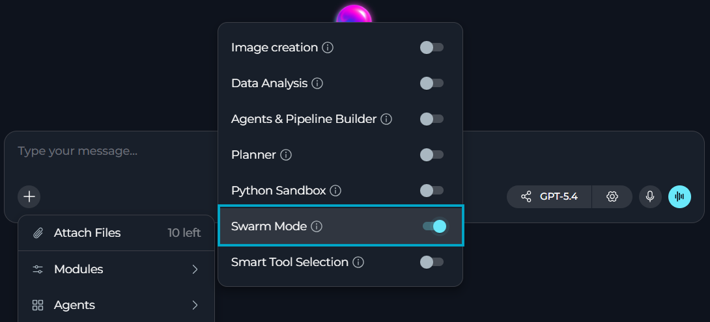
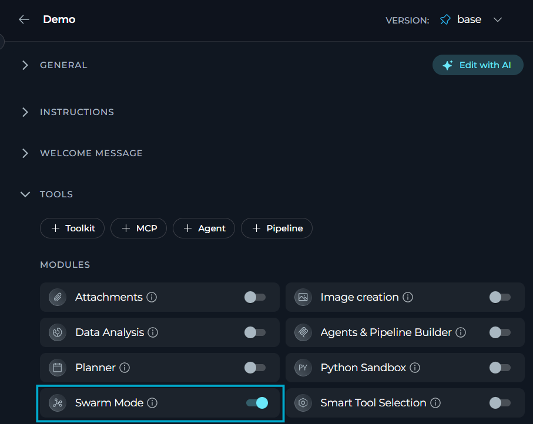
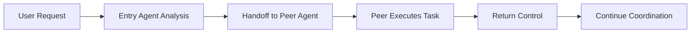

**Swarm Mode** module lets multiple specialized agents collaborate in a shared conversation, handing off control to each other.

**Key features:**

* Make your child agents work together while maintaining conversation continuity
* Hand off control dynamically between the entry agent and specialized peer agents
* Return control automatically to the entry agent once a peer agent completes its task
* Treat pipelines added as toolkits as direct-invocation peers that run without an LLM wrapper

## Prerequisites

- User role with agent edit access
- At least one child agent configured in the parent agent's toolkits
- **Swarm Mode** enabled in your chat or agent

<Warning title="Swarm-enabled agents cannot be added as a tool to any parent">
Nested swarms (a swarm-enabled agent as a child of any other agent) are not supported. If an agent has Swarm Mode enabled, it cannot be added as a tool to any other agent or pipeline (including other swarm-enabled agents). To use an agent as a child agent or toolkit, disable Swarm Mode on that agent first.
</Warning>

## How to Enable Swarm Mode

The default state of the **Swarm Mode** module — on or off — [is defined in the project settings](../../menus/settings/general#default-modules).

If **Swarm Mode** is turned off by default, you can turn it on for your current conversation or agent.

### For a Conversation

1. Go to the conversation.
2. Select `+` in the chat input toolbar.
3. Select **Modules** → **Swarm Mode** in the list.
4. Toggle **Swarm Mode** on.

Once enabled, Swarm Mode stays active for that conversation as long as at least one child agent is configured in the entry agent's toolkits.

### For an Agent

1. Select **Agents**.
2. Select the agent to configure, or create a new agent.
3. In the **TOOLS** section, find **MODULES**.
4. Find **Swarm Mode**. Select **Show all** if you do not see it immediately.
5. Toggle **Swarm Mode** on.
6. Select **Save**.

All changes apply only to new conversations run by this agent. Existing conversations will not be affected.

<Callout icon="lightbulb" color="#a855f7" title="">
Always add and configure your child agents before enabling Swarm Mode. The parent agent needs at least one child agent to create a functional swarm.
</Callout>

## How Swarm Mode Works

Swarm Mode replaces a single agent handling every request with a set of peer agents that hand off control to each other within the same conversation.

**Traditional Agent vs Swarm Mode**

| Aspect | Traditional Agent | Swarm Mode |
|--------|-------------------|------------|
| **Agent Structure** | Single agent handles all tasks | Parent agent coordinates multiple specialist agents |
| **Conversation Context** | Only the active agent sees the conversation | All agents share the full conversation history at the [routing level](#conversation-visibility-during-a-handoff) |
| **Task Distribution** | Single agent attempts all tasks | Parent delegates tasks to specialized child agents |
| **Control Flow** | Linear execution | Dynamic handoff between parent and child agents |
| **Collaboration** | No inter-agent communication | Agents can transfer control and share results |

### Limitations

* Swarm Mode has no effect if no child agent is configured in the entry agent's toolkits; the agent behaves as a standard agent.
* Only one handoff is processed per turn. If the entry agent emits multiple handoff tool calls in a single response, only the first is executed — any additional handoff calls in that response are discarded, not queued for later.
* A peer agent's handoff `task` argument is its only input — it has no access to prior conversation history, other tool results, or other peers' outputs unless that data is inlined explicitly.

### Agent Roles

Swarm Mode creates a **flat peer-to-peer architecture**. There is no strict parent/child hierarchy — the entry agent is simply the default starting point that the user talks to; all other agents are peers with equal standing:

| Role | Description | Responsibilities |
|------|-------------|------------------|
| **Entry Agent** | The agent the user addresses (default active agent) | - Receives user requests - Determines which specialist to involve - Delegates tasks to peer agents via handoff tools - Can receive control back from any peer |
| **Peer Agents** | Specialized agents | - Execute specific tasks using their tools - Access the full shared conversation history at the [routing level](#conversation-visibility-during-a-handoff) - Hand control back to the entry agent when done - Can also hand off to other peers |

Pipelines added as toolkits to the swarm agent participate as **direct-invocation peers** — they run their full graph and return the result without an LLM wrapper, then hand control back automatically. Regular agents run as LLM-equipped peers.

### Execution Flow

When Swarm Mode is enabled and child agents are configured, ELITEA handles handoffs automatically:

1. **User Request:** User sends a message to the conversation.
2. **Entry Agent Analysis:** Entry agent analyzes the request and determines if a specialist is needed.
3. **Handoff:** Entry agent uses a handoff tool (e.g., `transfer_to_test_agent`) to delegate to a peer agent. The handoff tool's `task` argument must be **completely self-contained** — the peer receives only this string and has no access to prior conversation history, other tool results, or other peers' outputs. Always inline all required data verbatim.
4. **Peer Executes Task:** Peer agent executes the task using its specialized tools and knowledge.
5. **Return Control:** Peer agent uses `transfer_to_main_agent` to return control after completing the task.
6. **Continue Coordination:** Entry agent receives results and continues coordinating the overall workflow.

<Info title="What Happens Behind the Scenes">
When Swarm Mode is enabled, the system automatically creates handoff tools for each peer agent. Every agent in the swarm receives a `transfer_to_[agent_name]` tool for every other peer — this is bidirectional and flat: any agent can hand off to any other. The entry agent and all peers share the same conversation state (SwarmState) via LangGraph's `langgraph-swarm` library, ensuring seamless collaboration.
</Info>

### Conversation Visibility

A handoff to a peer happens in two steps with different visibility into the conversation:

1. The peer's routing layer receives the full shared conversation history (SwarmState) and decides whether to answer directly or hand off again.
2. When the peer executes the task itself, only the handoff's `task` string is passed to that execution — prior conversation history, other tool results, and other peers' outputs are not included unless inlined into `task`.

<Note title="Inline what the peer's task execution needs">
Because step 2 only receives the `task` string, always inline the specific data a peer needs to complete its task — do not rely on it having access to earlier messages or other peers' results.
</Note>

## Example Scenarios

<Accordion title="QA Coordination Agent">
**Scenario:** A QA team uses a coordinator agent to manage testing across multiple platforms and tools.

**Configuration:**

- Parent Agent: QA Coordinator
- Child Agents:
  - API Test Agent (TestRail toolkit)
  - UI Test Agent (Selenium toolkit)
  - Performance Test Agent (JMeter toolkit)
- Swarm Mode: Enabled

**User Request:**

> `Run a full test suite for the new release: API tests, UI smoke tests, and load testing. Create bug reports for any failures.`

**Workflow:**

1. QA Coordinator receives the request and plans the test strategy
2. Hands off to API Test Agent → runs API tests, reports results
3. Hands off to UI Test Agent → runs smoke tests, reports results
4. Hands off to Performance Test Agent → runs load tests, reports metrics
5. Coordinator summarizes all results and creates bug reports for failures
6. User receives comprehensive test report with bug ticket links
</Accordion>

<Accordion title="Development Workflow Agent">
**Scenario:** A development team uses a manager agent to coordinate code review and deployment tasks.

**Configuration:**

- Parent Agent: Dev Manager
- Child Agents:
  - Code Review Agent (GitHub toolkit, code analysis tools)
  - Deployment Agent (Kubernetes toolkit, CI/CD tools)
- Swarm Mode: Enabled

**User Request:**

> `Review the pull request for feature X, and if approved, deploy it to staging`

**Workflow:**

1. Dev Manager analyzes the request
2. Hands off to Code Review Agent → reviews PR, checks tests, provides feedback
3. Code Review Agent reports: "PR approved, all checks passed"
4. Dev Manager hands off to Deployment Agent
5. Deployment Agent deploys to staging, monitors deployment health
6. Manager coordinates the entire process and reports completion
</Accordion>

<Accordion title="Content Creation Swarm">
**Scenario:** A marketing team uses a content coordinator to create comprehensive marketing materials.

**Configuration:**

- Parent Agent: Content Coordinator
- Child Agents:
  - Research Agent (web search, competitor analysis)
  - Writing Agent (content generation, copywriting)
  - Design Agent (image generation, Canva integration)
- Swarm Mode: Enabled

**User Request:**

> `Create a blog post about our new product feature, including research, article, and featured image`

**Workflow:**

1. Content Coordinator breaks down the request
2. Hands off to Research Agent → gathers market data, competitor info
3. Hands off to Writing Agent → creates article using research insights
4. Hands off to Design Agent → generates featured image
5. Coordinator assembles all components and presents final blog post package
</Accordion>

<Accordion title="Test Failures Routed to Bug Tracking">
**Scenario:** A parent agent runs API tests and routes any failures straight to bug tracking, without the user relaying results manually between specialists.

**Configuration:**

- Parent Agent: Test Coordinator
- Child Agents:
  - Test Agent (TestRail toolkit)
  - Bug Tracker Agent (Jira toolkit)
- Swarm Mode: Enabled

**User Request:**

> `Run the API tests and if any fail, create bug reports in Jira`

**Workflow:**

1. Parent agent receives the request
2. Parent uses `transfer_to_test_agent` to hand off to the testing specialist
3. Test agent executes API tests using its TestRail toolkit
4. Test agent identifies failed tests and uses `transfer_to_main_agent`
5. Parent analyzes failures and uses `transfer_to_bug_tracker_agent`
6. Bug tracker agent creates Jira tickets for each failure
7. Bug tracker agent returns control with `transfer_to_main_agent`
8. Parent summarizes the results to the user
</Accordion>

## Best Practices

<Accordion title="Always provide self-contained task context on handoff">
When delegating to a peer agent, the `task` argument in the handoff tool call is the **only input the peer receives**. The peer has no access to the prior conversation, other tool results, or other agents' outputs. Always inline all required data verbatim in the `task` string — never use references like "the items", "those results", or "the data from earlier". If you would write a pronoun, substitute the actual data instead.

**Bad:** `transfer_to_test_agent(task="Run tests on those endpoints.")`

**Good:** `transfer_to_test_agent(task="Run integration tests on the following API endpoints and return a pass/fail summary: POST /api/orders, GET /api/orders/{id}, DELETE /api/orders/{id}")`
</Accordion>

<Accordion title="Design specialized child agents with clear purposes">
Each child agent should have a well-defined specialization and appropriate toolkits. Avoid creating generic agents — instead, create focused specialists (e.g., "GitHub Issues Agent" vs. "Development Agent"). This makes handoff decisions clearer and more effective.
</Accordion>

<Accordion title="Use descriptive agent names and descriptions">
The parent agent uses child agent names and descriptions to decide when to hand off. Use clear, descriptive names like "API_Testing_Agent" and detailed descriptions that explain the agent's capabilities and when to use them.
</Accordion>

<Accordion title="Keep child agent count manageable">
While Swarm Mode supports multiple child agents, managing 3-5 specialists is optimal. Too many child agents can make coordination complex and slow down decision-making. Group related capabilities into single agents when appropriate.
</Accordion>

<Accordion title="Configure comprehensive toolkits for child agents">
Each child agent should have all the toolkits it needs to complete its specialized tasks independently. For example, a bug reporting agent needs both testing tools to verify bugs and Jira tools to create tickets.
</Accordion>

<Accordion title="Test swarm coordination before production use">
Run test scenarios to verify that handoffs work smoothly, agents return control properly, and the conversation flow makes sense. Check that child agents are being called appropriately based on task requirements.
</Accordion>

<Accordion title="Combine with other modules">
Swarm Mode works well with other modules like [Smart Tools Selection](./smart-tools-selection-internal-tool) (for token optimization), [Data Analysis](./data-analysis-internal-tool) (for specialist data agents), and [Python Sandbox](./python-sandbox-internal-tool) (for code execution specialists).
</Accordion>

<Accordion title="Monitor conversation flow and handoffs">
Review conversation logs to understand handoff patterns and optimize agent coordination. If certain agents are rarely called or frequently called for wrong tasks, adjust agent descriptions and parent instructions.
</Accordion>

<Accordion title="Provide clear parent agent instructions">
The parent agent's system prompt should include guidance on when to delegate tasks and how to coordinate the overall workflow. Clear instructions improve handoff decisions and overall effectiveness.
</Accordion>

## Troubleshooting

<Accordion title="Swarm Mode enabled but agents not collaborating">
**Possible causes:**

* No child agents configured in the parent agent's toolkits
* Swarm Mode enabled without child agents present
* Parent agent not recognizing when to hand off tasks

**Solution:**

1. Verify that child agents are added to the parent agent in the TOOLKITS section
2. Check that child agents appear in the toolkits list with type "agent"
3. Review parent agent's system prompt to ensure it knows when to delegate
4. Test with explicit requests like "delegate this to [specialist agent name]"
5. If no child agents are configured, Swarm Mode will fall back to standard agent behavior
</Accordion>

<Accordion title="Child agent not returning control to parent">
**Possible causes:**

* Child agent completing task but not using `transfer_to_main_agent`
* Child agent stuck in a loop or waiting for input
* Conversation flow interrupted

**Solution:**

1. Check child agent's system prompt — it should know to return control when done
2. Child agents automatically receive a `transfer_to_main_agent` handoff tool
3. Review conversation logs to see where control flow stopped
4. Restart the conversation if agents are stuck in an inconsistent state
5. Ensure child agents have clear completion criteria
</Accordion>

<Accordion title="Wrong agent being called for tasks">
**Possible causes:**

* Child agent names or descriptions not clear enough
* Parent agent instructions unclear about delegation
* Tasks require multiple specialists but only one is called

**Solution:**

1. Use descriptive agent names that clearly indicate specialization
2. Enhance child agent descriptions to specify their exact capabilities
3. Update parent agent's system prompt with clear delegation guidelines
4. Review handoff tools — the parent sees tools like `transfer_to_[agent_name]` with the child's description
5. Test with specific scenarios and refine agent descriptions based on results
</Accordion>

<Accordion title="Conversation history not shared correctly">
**Possible causes:**

* Swarm Mode not properly enabled
* Technical issue with shared state
* Conversation interrupted and restarted

**Solution:**

1. Verify Swarm Mode toggle is enabled in Modules
2. Check that the success notification appeared when enabling
3. All agents in a swarm automatically share conversation history via SwarmState
4. If issues persist, try disabling and re-enabling Swarm Mode
5. Start a new conversation to reset the swarm state
</Accordion>

<Accordion title="Performance slower than expected">
**Possible causes:**

* Multiple handoffs adding latency
* Child agents processing large context
* Too many child agents configured

**Solution:**

1. Handoffs add processing time — this is expected behavior for coordination
2. Limit the number of child agents to 3-5 specialists
3. Consider if all delegations are necessary—some tasks may not need specialists
4. Use Smart Tools Selection with Swarm Mode to reduce token overhead
5. For simple tasks that don't need collaboration, consider disabling Swarm Mode
</Accordion>

<Info title="See also">
See also:
- [Smart Tools Selection](./smart-tools-selection-internal-tool)
- [Python Sandbox](./python-sandbox-internal-tool)
- [Data Analysis](./data-analysis-internal-tool)
</Info>