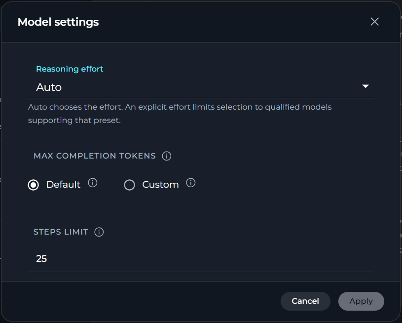
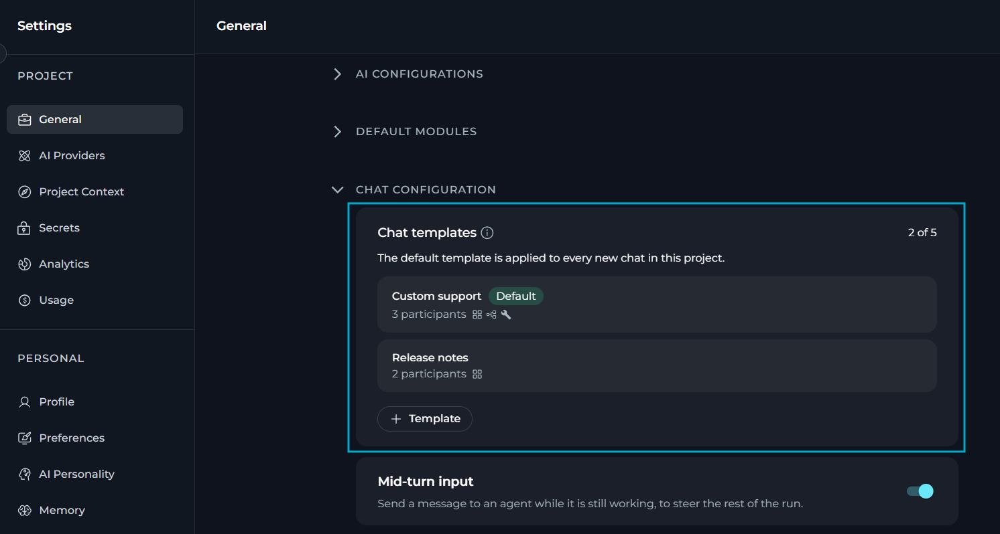
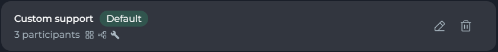
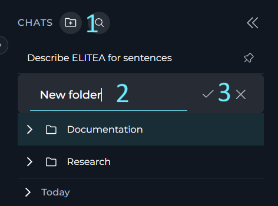
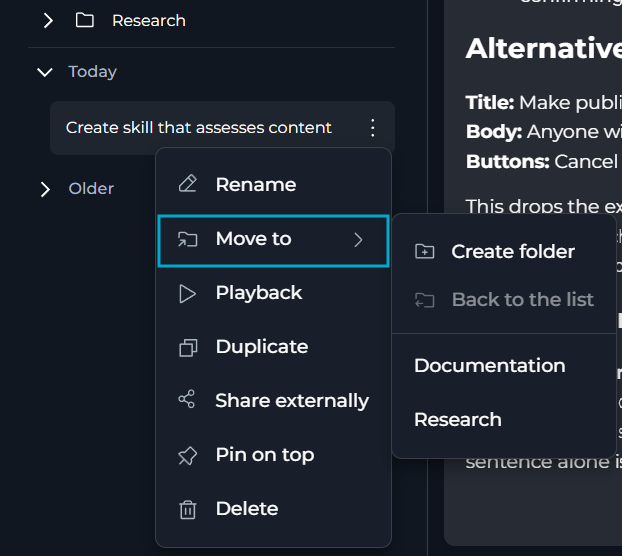
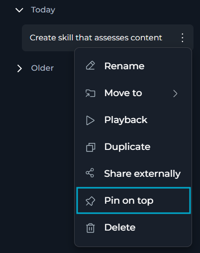
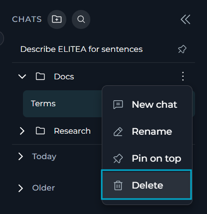
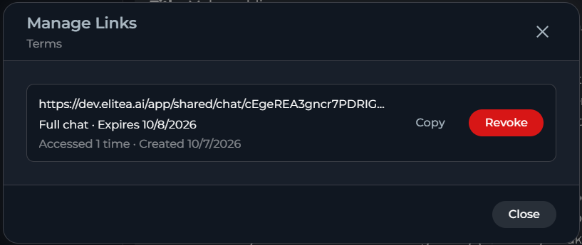
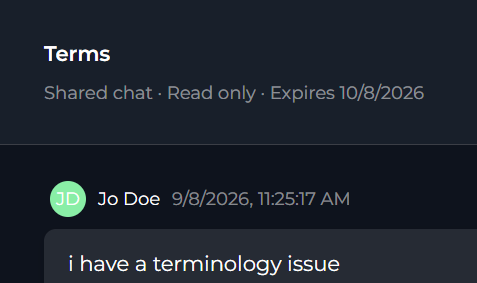
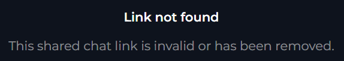

ELITEA allows you to configure individual chats — visibility, models, and response limits — and to manage them day to day.

## How to Configure Chats

You can configure how each chat behaves at creation or during the interaction with an LLM.

<CardGroup cols={2}>
  <Card icon="user-group" href="#make-chats-public">
    Make private chats visible to all project members.
  </Card>
  <Card icon="lock" href="#restrict-access-to-chats">
    Restrict access to public chats or make them private.
  </Card>
  <Card icon="robot" href="#select-a-model">
    Select a suitable LLM by the model selector.
  </Card>
  <Card icon="sliders" href="#set-the-model-up">
    Set up the selected LLM manually.
  </Card>
</CardGroup>

### Manage Access to Chats

By default, a new chat is private — visible only to you.

* In your private project, you cannot invite other users to them for team collaboration — you can only share them externally.
* In team and public projects, you can invite other team members to collaborate in your chats or make chats public. Public chats are visible to all project members, and all project members can communicate with LLM in them.

You can make your chats public and restrict access to public chats in the CHATS sidebar.

#### Make Chats Public

To make your chat public:

1. Find the chat you want to make public in the CHATS sidebar.
2. In its overflow menu, select **Make public**.
3. Confirm your decision in the confirmation dialog:

   

<Note>
**Make public** is available to any project member who can see the chat — not only its creator.
</Note>

All public chats are labelled accordingly:

#### Restrict Access to Chats
To restrict access to a public chat:

1. Find the chat you want to restrict access to in the CHATS sidebar.
2. In its overflow menu, select **Restrict access**.
3. In the dialog window, select which AI participants and project members (as users) should keep access. You can select both AI participants and users from dropdown lists or search for them by typing:

   

4. Select **Restrict access** in the confirmation dialog.

When you restrict access to public chats, these rules apply:

* Only its creator can restrict access to the chat.
* You cannot deselect the chat's creator: The creator of the chat always keeps access to it.
* To revert the chat to private, you must remove all users except for its creator.
* You can leave the chat open for collaboration by selecting users and AI participants who will keep access to it.

### Configure Models

You can select and set up LLMs from the chat main area:

#### Select a Model
The model selector dropdown includes:

* All LLMs available in your project, with their short descriptions and model capability labels.
* **Auto** allows ELITEA to automatically choose the model for each message based on the task and current availability, instead of you selecting one manually.

<Note>
**Auto** only appears in the dropdown if your project administrator has configured it for the project in [Settings > General > Chat Configuration](../../menus/settings/general#chat-configuration).

Pipelines always use an explicitly selected model — **Auto** is not available for them, regardless of this setting.
</Note>

To select the necessary LLM, find it in the model selector dropdown.

#### Set the Model Up

You can set the selected model up in the **Model settings** window that opens by the **Settings** (⚙️) icon located next to the model selector. Settings vary by model type.

**Reasoning vs. Creativity**

<Tabs>
  <Tab title="Reasoning Models">
    Reasoning controls the depth of logical thinking and problem-solving.

    | Level | Behavior |
    |-------|----------|
    | **Low** | Fast, surface-level reasoning with concise answers and minimal steps |
    | **Medium** | Balanced reasoning with clear explanations and moderate multi-step thinking *(default)* |
    | **High** | Deep, thorough reasoning with detailed step-by-step analysis (may be slower) |

    
  </Tab>
  <Tab title="Standard Models">
    Creativity controls the randomness of the responses.
    Lower values produce focused, deterministic outputs; higher values produce more varied and creative responses.

    | Level | Behavior |
    |-------|----------|
    | **** | Highly focused and deterministic outputs |
    | **2** | Mostly focused with slight variation |
    | **3** | Balanced between focus and creativity *(default)* |
    | **4** | More varied and creative responses |
    | **5** | Maximum creativity and diversity |

    
  </Tab>
</Tabs>

**Max Completion Tokens** *(All Models)*

Limits the maximum length of AI responses measured in tokens. A token is roughly 4 characters of text.

|  |  |
|--------|-------------|
| **Default** | No limits are imposed by ELITEA. Native model and provider limits apply. |
| **Custom** | You can set the token limit manually. An error is shown if the value exceeds the model's maximum output tokens. |

**Steps Limit** *(Chats only)*

Controls the maximum number of execution steps (tool calls) the AI can take before the loop is forcefully stopped. This prevents runaway agent executions that could consume excessive resources.

* **Default**: 25 steps
* **Range**: 0 – 999

<Note>
**Steps Limit** is shown in model settings only in chat. It is not available on the **Agents** or **Pipelines** pages, where step limits are configured at the agent/pipeline level.
</Note>

Every time the AI invokes a tool or performs an internal reasoning step, the counter increments by one. The value is passed as a top-level `step_limit` field in the chat payload — it is separate from the `llm_settings` block.

When the limit is reached, the execution loop ends and the AI returns whatever results it has collected so far.

When the steps limit is exceeded, the AI stops executing further tool calls and returns the error message.

<Callout icon="lightbulb" color="#a855f7" title="Choosing a Steps Limit">
**Tips for working with step limits:**

- Set a **lower value** (e.g. 5–10) for simple question-answering tasks where you want fast, predictable responses.
- Set a **higher value** (e.g. 50–100) for complex, multi-step research or automation tasks that require chaining many tool calls.
- If a chat ends abruptly with incomplete results, check whether the steps limit was reached and increase it accordingly.
</Callout>

**Auto**

When **Auto** is selected, model settings behave differently:

* **Reasoning / Creativity** is replaced by a single **Reasoning effort** selector with **Auto** (default — ELITEA chooses the effort automatically), **Low**, **Medium**, and **High**. Selecting an explicit effort limits ELITEA's model choice to models that support that preset.
* **Remaining Tokens** helper field is hidden since there is no single fixed model limit to calculate against.

## How to Manage Chats

Once a chat is created, you can organize it into folders, pin or rename it, delete it when you no longer need it, and share it with people inside or outside your project.

<CardGroup cols={3}>
  <Card icon="plus" href="#create-a-new-chat">
    Create a new chat
  </Card>
  <Card icon="folder-plus" href="#create-folders">
    Create a folder
  </Card>
  <Card icon="arrows-up-down-left-right" href="#move-chats-to-folders">
    Move a chat to a folder
  </Card>
  <Card icon="thumbtack" href="#pin-unpin-chats-and-folders">
    Pin or unpin a chat or folder
  </Card>
  <Card icon="pen" href="#rename-chats-and-folders">
    Rename a chat or folder
  </Card>
  <Card icon="trash" href="#delete-chats-and-folders">
    Delete a chat or folder
  </Card>
  <Card icon="share-nodes" href="#share-chats-with-team-members">
    Share internally
  </Card>
  <Card icon="link" href="#share-chats-with-external-users">
    Share externally
  </Card>
</CardGroup>

### Create a New Chat

There are three ways to create a new chat in ELITEA:

<AccordionGroup>
  <Accordion title="By the Create button in the left sidebar" id="create-sidebar">
    Creating a chat from the sidebar is the quickest way to start a new conversation.

    1. In the left sidebar, locate the **Chat** section.
    2. Select the **+** button at the top of the sidebar.

       

    3. Use the available controls to configure your new chat.
    4. Enter your first message and select **Send**, or press Enter, to create the chat.
  </Accordion>

  <Accordion title="From a Folder" id="create-folder">
    Creating a new chat directly inside a folder will save you time moving chats to the necessary folders after they are created.

    1. Find the folder in which you want to create a new chat.
    2. In its overflow menu, select **New chat**.

       

    3. Use the available controls to configure your new chat — select models, add participants, attach files or turn on modules.
    4. Enter your first message to create the chat inside the folder.

    ELITEA assigns the new chat to the folder immediately, so you do not need to move it afterward.

    If you are already in the folder, any chats created from the **+ Chat** button in the left sidebar will also be automatically assigned to that folder.

    <Note>
    ELITEA disables **New chat** if you do not have permissions to create chats, or while a new folder has not been saved yet.
    </Note>
  </Accordion>

  <Accordion title="By Duplicating a Chat" id="create-duplicate">
    You can duplicate a chat to reuse its participants and settings without recreating them.

    <Note>
    **Duplicate** is unavailable while you are editing Canvas in the active chat.
    </Note>

    1. Find the chat you want to duplicate.
    2. In its overflow menu, select **Duplicate**.

       

    ELITEA creates a new chat with the same visibility and participants as the source chat and opens it.

    <Note>
    The duplicate does not include messages of the source chat, only its visibility and participants.
    </Note>

    If you duplicate a chat inside a folder, the new chat is **not** automatically assigned to that folder — you will need to move it manually.
  </Accordion>
</AccordionGroup>

All new chats are created and appear in the CHATS sidebar.

For new — not duplicated — chats, ELITEA generates their name automatically based on your message content. For duplicated chats, ELITEA forms their names by appending "(1)" to the original name, or by incrementing the number already in parentheses (for example, duplicating "Report Review (1)" produces "Report Review (2)").

You can manually rename any chat at any time afterwards.

### Work with Chat Templates

A chat template is a saved, reusable set of chat participants — agents, pipelines, toolkits, MCP servers, or users — that you can apply to new chats without adding each participant manually.

ELITEA allows setting one chat template as default:

* A **default** template is applied automatically when you start a new chat.
* Any **non-default** template is not applied automatically and is not offered as a manual choice when creating a chat; it remains a saved configuration until you mark it as the project's default.

<Note>
Creating or editing the default template does not affect any existing chats.
</Note>

Chat templates are created and managed in [Settings > General > Chat Configuration](../../menus/settings/general#chat-configuration):

 General > Chat Configuration." />

You can create, edit or delete chat templates only if you have **permission** to edit the project's configuration settings. Project members without this permission can view the existing templates, and the default template (if set) is applied to every new chat they create.

Each template appears in the list as a card showing:

* Its **name**.
* A **Default** label, if it is marked as the project's default template.
* Number of participants — both AI participants and users — added to the template.
* Icons for its participants, grouped by type — agents, pipelines, toolkits, MCP servers, then users.

On hover, you can see two action icons:

* An **edit** icon to open the template (shown as a **view** icon instead if you do not have permission to edit configuration settings).
* A **delete** icon to remove the template, shown only if you have permission to edit configuration settings.

**Rules and limitations**

* You can create up to **5 templates** per project.
* A template **name is required**, must be 64 characters or fewer, and must be unique within the project (matching is case-insensitive).
* Only one template per project can be marked *default* at a time.
* If a template has exactly one participant, that participant automatically becomes the active participant in chats created from it, and your messages go directly to it.
* Chat templates specify participants only — they do not specify the model, visibility, or any other chat setting.

#### Create a Chat Template

To create a chat template:

1. Go to **Settings > General > Chat Configuration**.
2. Select **+ Template**.

   <Note>
   **+ Template** is disabled if the project already has 5 templates.
   </Note>

3. Enter a unique **name** for the template.
4. (optional) Select **Set as default**.
5. Add participants from the **Agents**, **Pipelines**, **Toolkits**, **MCPs**, and **Users** tabs.
6. Select **Save**.

<Note>
The **Users** tab is available only in team projects. In private projects, the tab is hidden because they have no users to add.
</Note>

<video src="../../img/menus/settings/project/general/gen_chat-temps_create.mp4" controls alt="Creating a new chat template in Settings > General > Chat Configuration."></video>

#### Edit a Chat Template

To edit a chat template:

1. In **Settings > General > Chat Configuration**, find the template you want to change.
2. Select **Edit** (appears on hover).
3. Update its name, default status, or participants.
4. Select **Save**.

<Note>
If you do not have permission to edit the project's configuration settings, templates open in a read-only view instead, without the **Save** option.
</Note>

#### Delete a Chat Template

1. In **Settings > General > Chat Configuration**, find the template you want to remove.
2. Select **Delete** (appears on hover).
3. Confirm the deletion.

<Note>
Deleting a template does not affect chats that were already created from it — they keep their participants. Deleting the default template leaves the project without a default template until you mark another one.
</Note>

### Organize Chats

You can add your chats to folders for better organization and easier management:

* In private projects, only you can see folders and their content.
* In a team project, you can see a folder if you created it, or if it contains at least one chat you have access to — because it is public or because you are a participant. All project members can move their chats into or from folders they can see, but cannot delete folders created by other project members.

#### Create Folders

1. Click the **folder icon** button in the header of the CHATS sidebar.
2. Enter a **name** for the new folder.
3. Select **Save**.

The new folder will appear in the CHATS sidebar.

#### Move Chats to Folders

You can organize chats into folders in two ways:

* by dragging the chat and dropping it to the necessary folder
* from its overflow menu

To move the chat to a folder from its overflow menu:

1. Find the chat you want to move in the CHATS sidebar.
2. In its overflow menu, select **Move to**.
3. Choose the desired destination folder from the list, OR
4. Select **Create folder** to create a new folder for this chat.

You can move chats back to the main list by selecting **Move to** > **Back to the list**.

#### Pin/Unpin Chats and Folders

All project members who see chats and folders can pin them.

To pin a chat or a folder, select **Pin on top** in its overflow menu. This keeps it at the top of the CHATS sidebar, above the time-based sections and other folders.

To unpin chats and folders, select **Unpin**.

<Note>
You cannot pin a chat that is in a folder. To pin chats, you must move them out of their folders first.
</Note>

#### Rename Chats and Folders

Creators of chats and folders can change their names.

To rename a chat or folder:

1. Find the chat or folder you want to rename in the CHATS sidebar.
2. In its overflow menu, select **Rename**.
3. Enter the new name.
4. Select the checkmark (✔) to save your changes.

<video src="../../img/how-tos/chat-conversations/chats/config-mnmt/chat_rename.mp4" width="250" controls alt="Renaming a chat in the CHATS sidebar."></video>

### Delete Chats and Folders

Chats and folders can be deleted only by their creators.

To delete a chat or folder:

1. Find the chat or folder you want to delete in the CHATS sidebar.
2. In its overflow menu, select **Delete**.
3. Confirm the deletion.

Deleting a chat permanently removes it and its history — this cannot be undone.

Deleting a folder does not delete the chats inside it — they are moved back to the main chat list.

### Share Chats

In ELITEA, sharing options depend on the users with whom you want to share your chats and the type of your project.

#### Share Chats with Team Members

In team projects, you can share your chats with other team members who already have access to this chat — ELITEA will generate a direct link to the chat which you can send to the users you need:

1. Find the chat you want to share.
2. In its overflow menu, select **Share**.

ELITEA copies the chat link to your clipboard and shows you a confirmation message.

<Note>
Recipients must already have access to the chat — as its participants or because the chat is public — to open the link.
</Note>

#### Share Chats with External Users

You can share a chat with people outside your project or outside ELITEA through a secure, read-only link. Recipients do not need an ELITEA account to view the shared content.

**Create a Share Link**

1. Find the chat you want to share.
2. In its overflow menu, select **Share externally**.
3. In the **Share chat** dialog, select what to share.

| Option | Description |
|--------|-------------|
| Entire chat | Shares all messages and attachments. |
| Messages only | Shares only messages without attachments. |
| Attachments only | Shares only the attached files and images. |
| Select specific messages | Shares only the message groups you select from a checklist. You must select at least one message group to be able to share the chat. |

4. Select an expiration for the link: **1 hour**, **24 hours**, **7 days** (default), **30 days**, or **Never expires**.
5. (optional) Enter a password to restrict access to the link. Your password must be at least 8 characters long.
6. Select **Generate link**.

ELITEA copies the link to your clipboard and displays it in the dialog.

<video src="../../img/how-tos/chat-conversations/chats/config-mnmt/share-external.mp4" controls alt="Video demonstrating how to share a conversation externally."></video>

<Warning>
Anyone with the link can view the shared content. Do not share links for chats that contain sensitive information.
</Warning>

**Manage or Revoke a Share Link**

1. Find the chat whose link you want to change or revoke.
2. In its overflow menu, select **Manage links**.
3. In the **Manage Links** dialog, review each link: its scope, expiration, password status and view count.
4. Select **Copy** to copy a link again, or select **Revoke** to disable it immediately.

Only the chat's creator can create, manage or revoke share links. Revoking a link blocks access immediately and cannot be undone — create a new link if you need to share the chat again.

<Note>
[Restricting access](#restrict-access-to-chats) does not revoke external share links.
</Note>

**What Recipients See**

Recipients open the link in a browser. If the link has a password, ELITEA prompts for it before showing the chat. The shared view is read-only: recipients can see the shared messages and attachments, but cannot reply, edit or add participants.

After 10 failed password attempts, ELITEA locks the link for 15 minutes before allowing another attempt.

After a link expires or is revoked, recipients see a message that the link is no longer available.

## Best Practices

* Keep sensitive chats private, and restrict access again immediately if you do not need the chat to be public anymore.
* Use **Auto** when you want ELITEA to pick the best available model per message; select a specific model when you need consistent behavior or a particular capability.
* Organize related chats into folders, and pin the ones you use most often for quicker access.
* Set an expiration and password on external share links for anything containing sensitive information, and revoke links you no longer need.
* Use chat templates to save the participant sets you reuse most often.

## Troubleshooting

<Accordion title="I do not see Make public or Restrict access in the overflow menu">
**Cause:** These actions are unavailable in your project type, or — for **Restrict access** — you are not the chat's creator.

**Solution:** Confirm your project type, and ask the chat's creator to restrict access if you need it changed.
</Accordion>

<Accordion title="I do not see Pin on top available for a chat">
**Cause:** The chat is inside a folder.

**Solution:** Move the chat out of the folder, then pin it.
</Accordion>

<Accordion title="I do not see Rename in the chat's overflow menu">
**Cause:** Only the chat's creator can rename it.

**Solution:** Ask the creator to rename the chat, or duplicate the chat if you need your own editable copy.
</Accordion>

<Accordion title="I do not see the shared chat — the link says it is no longer available">
**Cause:** The link expired or was revoked.

**Solution:** Ask the chat's creator to create a new share link.
</Accordion>

<Accordion title="I cannot create, edit, or delete a chat template">
**Cause:** The project already has 5 templates, or you do not have permission to edit the project's configuration settings.

**Solution:** Delete a template you no longer need to free up a slot, or ask a project administrator to manage templates for you.
</Accordion>

<Accordion title="My new chat does not start with the participants I expected">
**Cause:** No template is marked as default, the default template was deleted, or you had already selected different participants before the default template could apply.

**Solution:** Check [Settings > General > Chat Configuration](../../menus/settings/general#chat-configuration) for a default template, and ask your project administrator to mark one if none is set.
</Accordion>

<Accordion title="I do not see the MCPs tab when adding template participants">
**Cause:** MCP exposure is not enabled at the platform level.

**Solution:** Ask your platform administrator to enable MCP exposure. Until then, you cannot add MCP servers as template participants, though any already added before remain in the template.
</Accordion>

<Info title="See Also">
See also:

* [Chat](../../menus/chat)
* [Settings > General > Chat Configuration](../../menus/settings/general#chat-configuration)
</Info>