ELITEA allows you to configure individual chats — visibility, models, and response limits — and to manage them day to day.

## How to Configure Chats

You can configure how each chat behaves at creation or during the interaction with LLM.

<CardGroup cols={2}>
  <Card icon="user-group" href="#make-public">
    Make private chats visible to all project members.
  </Card>
  <Card icon="lock" href="#restrict-access">
    Restrict access to public chats or make them private.
  </Card>
  <Card icon="robot" href="#select-an-llm">
    Select a suitable LLM by the model selector.
  </Card>
  <Card icon="sliders" href="#set-up-an-llm">
    Set up the selected LLM manually.
  </Card>
</CardGroup>

### Manage Access to Chats

By default, a new chat is private — visible only to you.

* In your private project, you cannot invite other users to them for team collaboration - you can only share them externally.
* In team and public projects, you can invite other team members to collaborate in your chats or make chats public. Public chats are visible for all project members, and all project members can communicate with LLM in them.

You can make your chats public and restrict access to public chats in the CHATS sidebar.

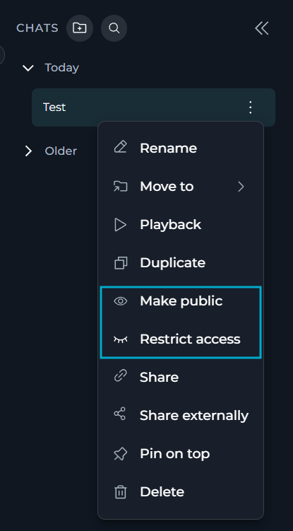

#### Make Chats Public

To make your chat public:

1. Find the chat you want to make public in the CHATS sidebar.
2. In its overflow menu, select **Make public**.
3. Select **Make public** in the confirmation dialog:

   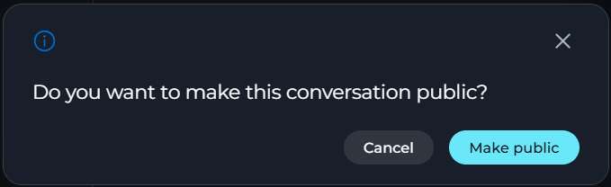

<Note>
**Make public** is available to any project member who can see the chat — not only its creator.
</Note>

All public chats are marked with the users icon:

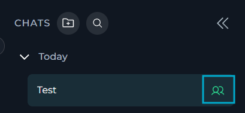

#### Restrict Access to Chats
To restrict access to a public chat:

1. Find the chat you want to make restrict access to in the CHATS sidebar.
2. In its overflow menu, select **Restrict access**.
3. In the dialog window, select which AI participants and project members (as users) should keep access. You can select both AI participants and users from dropdown lists or search for them by typing:

   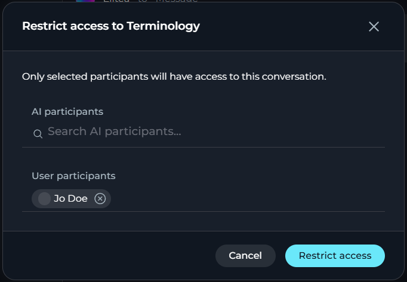

4. Select **Restrict access** in the confirmation dialog.

When you restrict access to public chats, these rules apply:

* Only its creator can restrict access to the chat.
* You cannot deselect the chat's creator: The creator of the chat always keeps access to it.
* To revert the chat to private, you must remove all users except for its creator.
* You can leave the chat open for collaboration by selecting users and AI participants who will keep access to it.

### Configure Models

You can select and set up LLMs from the chat main area:

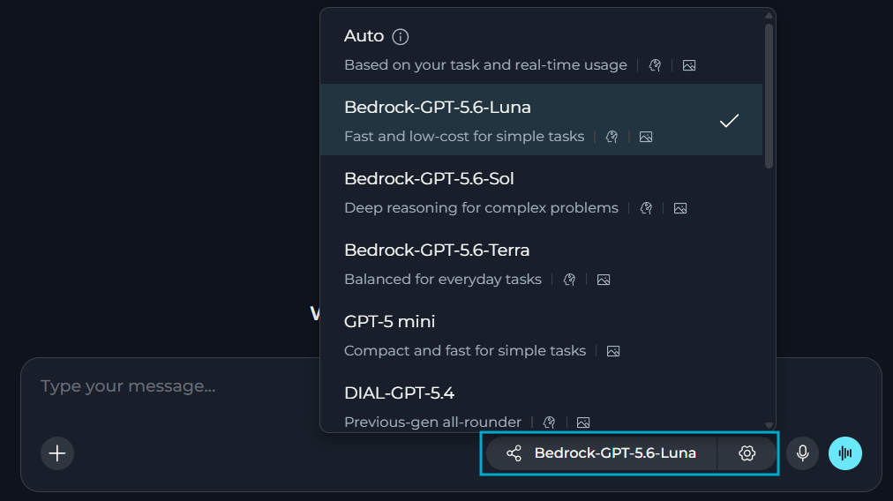

#### Select a Model
The model selector dropdown includes:

* All LLMs available in your project, with their short descriptions and model capability labels.
* **Auto** allows ELITEA automatically choose the model for each message based on the task and current availability, instead of you selecting one manually.

<Note>
**Auto** only appears in the dropdown if your project administrator has enabled it for the project in [Settings > General > CHAT CONFIGURATION](../../menus/settings/general#chat).
</Note>

To select the necessary LLM, find it in the model selector dropdown.

#### Set the Model Up

You can set the selected model up in the **Model settings** window that opens by the **Settings** (⚙️) icon located next to the model selector. Settings vary by model type.

**Reasoning vs. Creativity**

<Tabs>
  <Tab title="Reasoning Models">
    Reasoning controls the depth of logical thinking and problem-solving.

    | Level | Behavior |
    |-------|----------|
    | **Low** | Fast, surface-level reasoning with concise answers and minimal steps |
    | **Medium** | Balanced reasoning with clear explanations and moderate multi-step thinking *(default)* |
    | **High** | Deep, thorough reasoning with detailed step-by-step analysis (may be slower) |

    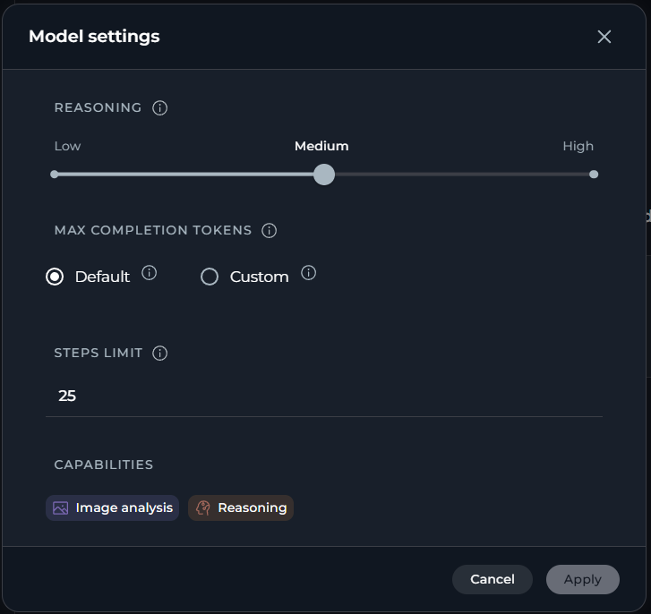
  </Tab>
  <Tab title="Standard Models">
    Creativity controls the randomness of the responses.
    Lower values produce focused, deterministic outputs; higher values produce more varied and creative responses.

    | Level | Behavior |
    |-------|----------|
    | **1** | Highly focused and deterministic outputs |
    | **2** | Mostly focused with slight variation |
    | **3** | Balanced between focus and creativity *(default)* |
    | **4** | More varied and creative responses |
    | **5** | Maximum creativity and diversity |

    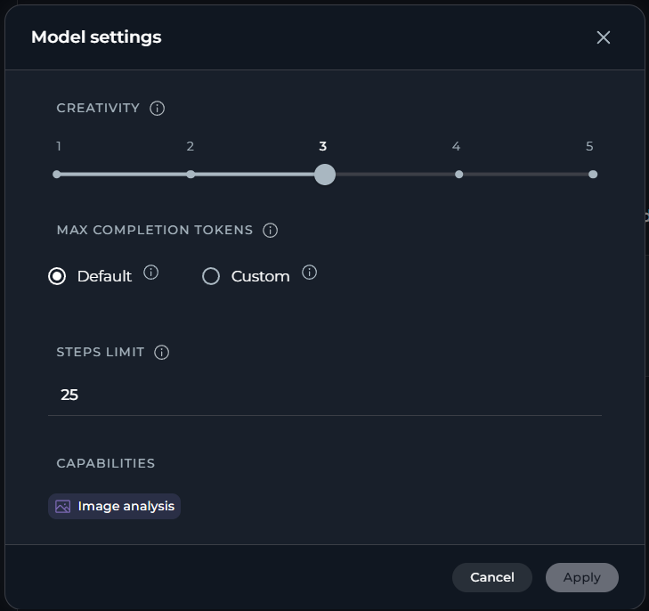
  </Tab>
</Tabs>

**Max Completion Tokens** *(All Models)*

Limits the maximum length of AI responses measured in tokens. A token is roughly 4 characters of text.

|  |  |
|--------|-------------|
| **Default** | No limits are imposed by ELITEA. Native model and provider limits apply. |
| **Custom** | You can set the token limit manually. An error is shown if the value exceeds the model's maximum output tokens. |

**Steps Limit** *(Chats only)*

Controls the maximum number of execution steps (tool calls) the AI can take before the loop is forcefully stopped. This prevents runaway agent executions that could consume excessive resources.

* **Default**: 25 steps
* **Range**: 0 – 999

<Note>
**Steps Limit** is shown in model settings only in chat. It is not available on the **Agents** or **Pipelines** pages, where step limits are configured at the agent/pipeline level.
</Note>

Every time the AI invokes a tool or performs an internal reasoning step, the counter increments by one. The value is passed as a top-level `step_limit` field in the chat payload — it is separate from the `llm_settings` block.

When the limit is reached, the execution loop ends and the AI returns whatever results it has collected so far.

When the steps limit is exceeded, the AI stops executing further tool calls and returns partial results. No error is displayed to the user by default — the response simply stops at the last completed step.

<Callout icon="lightbulb" color="#a855f7" title="Choosing a Steps Limit">
**Tips for working with step limits:**

- Set a **lower value** (e.g. 5–10) for simple question-answering tasks where you want fast, predictable responses.
- Set a **higher value** (e.g. 50–100) for complex, multi-step research or automation tasks that require chaining many tool calls.
- If a conversation ends abruptly with incomplete results, check whether the steps limit was reached and increase it accordingly.
</Callout>

**Auto**

When **Auto** is selected, model settings behave differently:

* **Reasoning / Creativity** is replaced by a single **Reasoning effort** selector with **Auto** (default — ELITEA chooses the effort automatically), **Low**, **Medium**, and **High**. Selecting an explicit effort limits ELITEA's model choice to models that support that preset.
* **Remaining Tokens** helper field is hidden since there is no single fixed model limit to calculate against.

## How to Manage Chats

Once a chat is created, you can organize it into folders and share it with people outside your project.

<CardGroup cols={3}>
  <Card icon="plus" href="#create-a-new-chat">
    Create a new chat
  </Card>
  <Card icon="folder-plus" href="#create-folders">
    Create a folder
  </Card>
  <Card icon="arrows-up-down-left-right" href="#move-chats-to-folders">
    Move a chat to a folder
  </Card>
  <Card icon="thumbtack" href="#pin-unpin-chats-and-folders">
    Pin or unpin a chat or folder
  </Card>
  <Card icon="pen" href="#rename-chats-and-folders">
    Rename a chat or folder
  </Card>
  <Card icon="trash" href="#delete-chats-and-folders">
    Delete a chat or folder
  </Card>
  <Card icon="share-nodes" href="#share-chats-internally">
    Share internally
  </Card>
  <Card icon="link" href="#share-chats-with-external-users">
    Share externally
  </Card>
</CardGroup>

### Create a New Chat

There are three ways to create a new chat in ELITEA:

<AccordionGroup>
  <Accordion title="By the Create button in the left sidebar" id="create-sidebar">
    Creating a chat from the sidebar is the quickest way to start a new conversation.

    1. In the left sidebar, locate the **Chat** section.
    2. Select the **+** button at the top of the sidebar.

       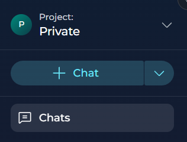

    3. Use the available controls to configure your new chat.
    4. Enter your first message and select **Send**, or press Enter, to create the chat.
  </Accordion>

  <Accordion title="From a Folder" id="create-folder">
    Creating a new chat directly inside a folder will save your time moving chats to the necessary folders after they are created.

    1. Go to the overflow menu of the folder, in which you want to create a new chat.
    2. Select **New chat**.

       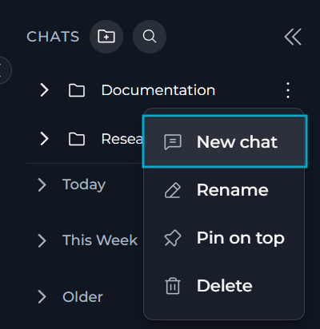

    3. Use the available controls to configure your new chat — select models, add participants, attach files or turn on modules.
    4. Enter your first message to create the chat inside the folder.

    ELITEA assigns the new chat to the folder immediately, so you do not need to move it afterward.

    If you are already in the folder, any chats created from the **+ Chat** button in the left sidebar will also be automatically assigned to that folder.

    <Note>
    ELITEA disables **New chat** if you do not have permissions to create chats, or while a new folder has not been saved yet.
    </Note>
  </Accordion>

  <Accordion title="By Duplicating a Chat" id="create-duplicate">
    You can duplicate a chat to reuse its participants and settings without recreating them.

    <Note>
    **Duplicate** is unavailable while you are editing Canvas in the active chat.
    </Note>

    1. Go to the overflow menu of the chat you want to duplicate.
    2. Select **Duplicate**.

       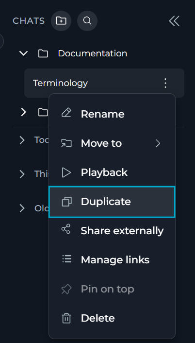

    ELITEA creates a new chat with the same visibility and participants as the source chat and opens it.

    <Note>
    The duplicate does not include messages of the source chat, only its visibility and participants.
    </Note>

    ELITEA names the duplicate by appending "(1)" to the original name, or by incrementing the number already in parentheses (for example, duplicating "Report Review (1)" produces "Report Review (2)").

    If you duplicate a chat inside a folder, the new chat is **not** automatically assigned to that folder — you will need to move it manually.
  </Accordion>
</AccordionGroup>

All new chats are created and appear in the **CHATS** sidebar.

For new  — not duplicated — chats, ELITEA generates their name automatically based on your message content. You can manually rename any chat at any time afterwards.

### Organize Chats

You can add your chats to forders for better organization and easier management.

#### Create Folders

<Note title="Private and Team Chats/Folders">
**Private:** In a private project, you can add all participant types except users. Folders and their contents are only accessible to you.

**Team Project:** You can view all folders within the project, but can only see chats inside folders if you are a member. Members can move chats into or out of folders; you cannot delete folders created by others.
</Note>

1. Click the **folder icon** button in the header of the CHATS sidebar.
2. Provide a **Name** for the folder.
3. Select **Save** to create the folder.

The new folder will appear in the CHATS sidebar.

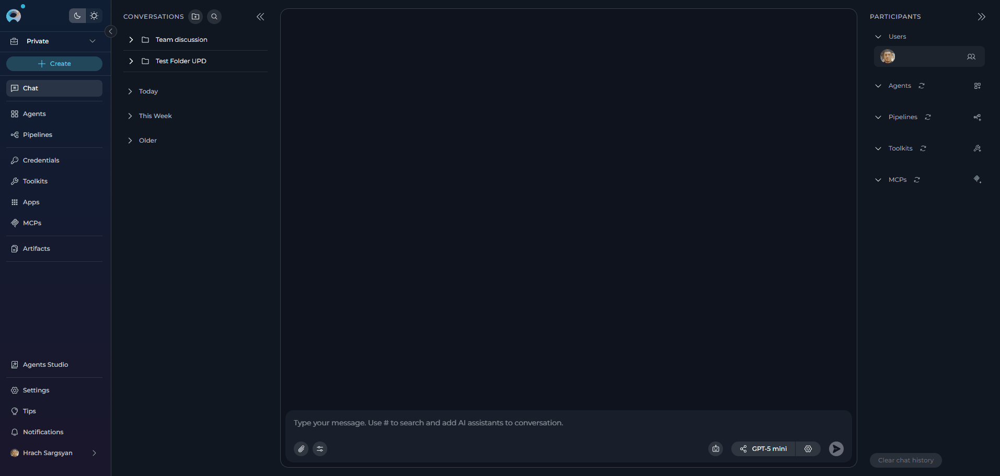

#### Move Chats to Folders

To organize chats into folders:

**Method 1: Drag and Drop**

1. In the CHATS sidebar, click and hold on the chat you wabt to move.
2. Drag the chat over the destination folder.
3. Release to drop the chat into the folder.

**Method 2: Context Menu**

1. In the CHATS sidebar, right-click on the chat you wish to move.
2. Select **Move to** from the context menu.
3. Choose the desired destination folder from the list, OR
4. Select **Create folder** to create a new folder and move the conversation into it simultaneously.
5. To move a conversation back to the main list, select **Back to the list** from the Move to menu.

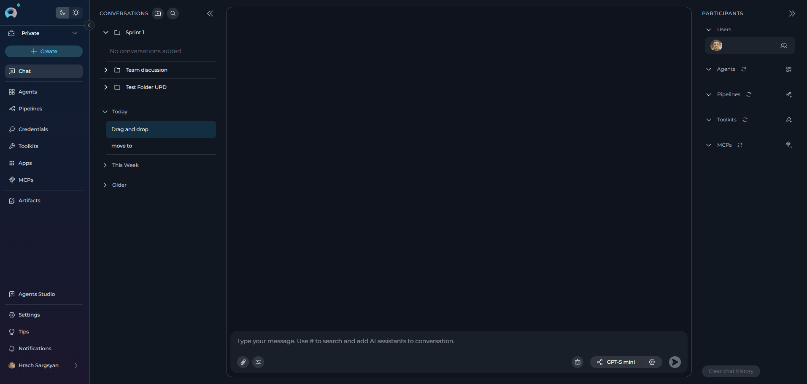

#### Pin/Unpin Conversations and Folders

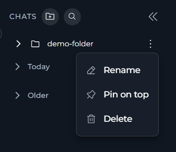

**Conversations**: Select **Pin on top** in the conversation's overflow menu to keep it at the top of the **CONVERSATIONS** sidebar, above the time-based sections. Select **Unpin** to remove it. Available to anyone who can see the conversation.

<Note>
A conversation already inside a folder cannot be pinned — move it out of the folder first.
</Note>

**Folders**: Select **Pin on top** in the folder's contextual menu to keep it at the top of the **CONVERSATIONS** sidebar. Select **Unpin** to remove it.

#### Rename Conversations and Folders

**Conversations**: Select **Rename** in the conversation's overflow menu and enter the new name. Available only to the conversation's creator.

**Folders**: Select **Rename** in the folder's contextual menu, update the name, and click the checkmark (✔) or **Save** button.

### Delete Conversations and Folders

**Conversations**: Select **Delete** in the conversation's overflow menu, then confirm. This permanently removes the conversation and its history and cannot be undone. Available only to the conversation's creator.

**Folders**: Select **Delete** in the folder's options menu (**...**), then confirm. Deleting a folder does not delete the conversations inside it — they are automatically moved back to the main conversation list (root level).

### Share Conversations

#### Share Conversations Internally

You can copy a direct link to a conversation for other project members who already have access to it.

1. Go to the overflow menu of the conversation you want to share.
2. Select **Share**.

ELITEA copies the link to your clipboard and shows a confirmation toast.

<Note>
**Share** is available in team and public projects only — there is no one else to share with in a private project. Recipients must already have access to the conversation (as a participant, or because the conversation is public) to open the link.
</Note>

#### Share Conversations with External Users

You can share a conversation with people outside ELITEA through a secure, read-only link. Recipients do not need an ELITEA account to view the shared content.

**Create a Share Link**

1. Go to the overflow menu of the conversation you want to share.
2. Select **Share externally**.
3. In the **Share conversation** dialog, select what to share.

| Option | Description |
|--------|-------------|
| Entire conversation | Shares all messages and attachments. |
| Messages only | Shares only messages without attachments. |
| Attachments only | Shares only the attached files and images. |
| Select specific messages | Shares only the message groups you select from a checklist. You must select at least one message group to be able to share the conversation. |

4. Select an expiration for the link: **1 hour**, **24 hours**, **7 days** (default), **30 days**, or **Never expires**.
5. (optional) Enter a password to restrict access to the link. Your password must be at least 8 characters long.
6. Select **Generate link**.

ELITEA copies the link to your clipboard and displays it in the dialog.

<video src="../../img/how-tos/chat-conversations/share-external.mp4" controls alt="Video demonstrating how to share a conversation externally."></video>

<Warning>
Anyone with the link can view the shared content. Do not share a link for a conversation that contains sensitive information.
</Warning>

**Manage or Revoke a Share Link**

1. Right-click the conversation, or select its options menu (**...**).
2. Select **Manage links**.
3. In the **Manage Links** dialog, review each link: its scope, expiration, password status and view count.
4. Select **Copy** to copy a link again, or select **Revoke** to disable it immediately.

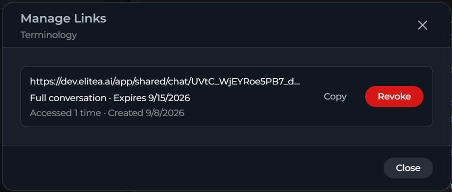

<Note>
Only the conversation author can create, manage or revoke share links. Revoking a link blocks access immediately and cannot be undone — create a new link if you need to share the conversation again.
</Note>

**What Recipients See**

Recipients open the link in a browser. If the link has a password, ELITEA prompts for it before showing the conversation. The shared view is read-only: recipients can see the shared messages and attachments, but cannot reply, edit or add participants.

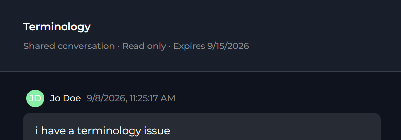

After 10 failed password attempts, ELITEA locks the link for 15 minutes before allowing another attempt.

After a link expires or is revoked, recipients see a message that the link is no longer available.

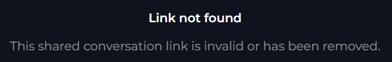

## Best Practices

* Keep sensitive conversations private, and restrict access again immediately if a public conversation no longer needs to stay open to everyone.
* Use **Auto** when you want ELITEA to pick the best available model per message; select a specific model when you need consistent behavior or a particular capability.
* Organize related conversations into folders, and pin the ones you use most often for quicker access.
* Set an expiration and password on external share links for anything containing sensitive information, and revoke links you no longer need.

## Troubleshooting

<Accordion title="Issue: Make public or Restrict access is missing from the overflow menu">
**Cause:** These actions are unavailable in your project type, or — for **Restrict access** — you are not the conversation's author.

**Solution:** Confirm your project type, and ask the conversation's author to restrict access if you need it changed.
</Accordion>

<Accordion title="Issue: Pin on top is disabled for a conversation">
**Cause:** The conversation is inside a folder.

**Solution:** Move the conversation out of the folder, then pin it.
</Accordion>

<Accordion title="Issue: Rename or Delete is missing from a conversation's overflow menu">
**Cause:** Only the conversation's creator can rename or delete it.

**Solution:** Ask the creator to make the change, or duplicate the conversation if you need your own editable copy.
</Accordion>

<Accordion title="Issue: A shared link says it is no longer available">
**Cause:** The link expired or was revoked.

**Solution:** Ask the conversation's author to create a new share link.
</Accordion>

<Info title="See Also">
See also:

* [Chat](../../menus/chat)
* [Settings > General > Chat Configuration](../../menus/settings/general#chat)
</Info>