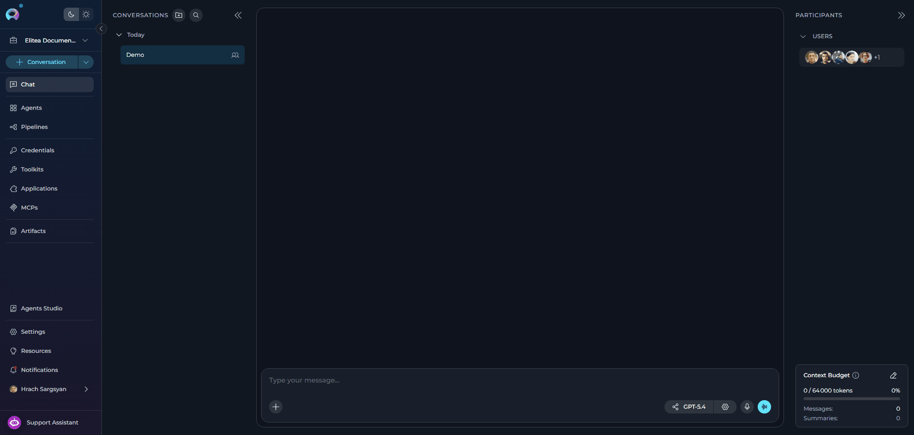
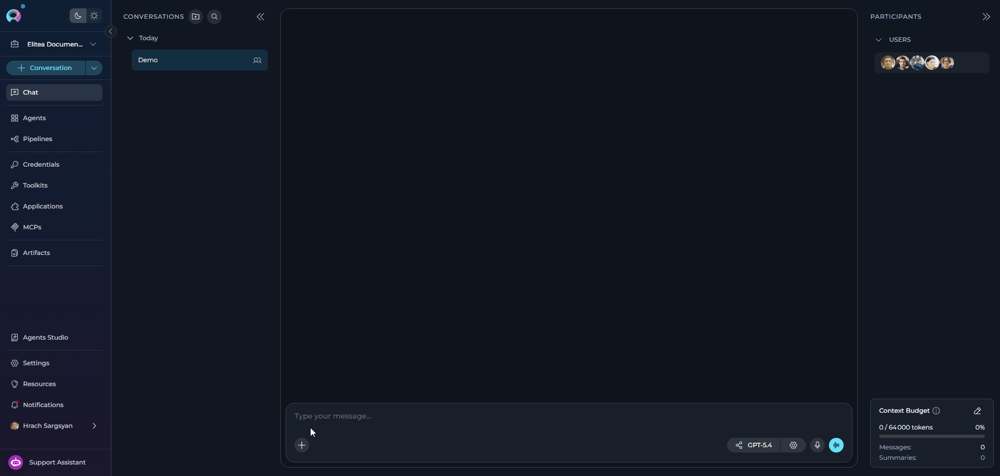
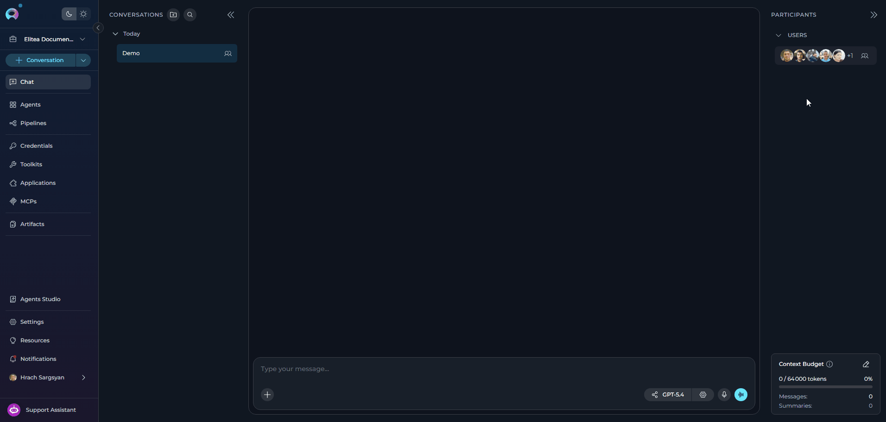
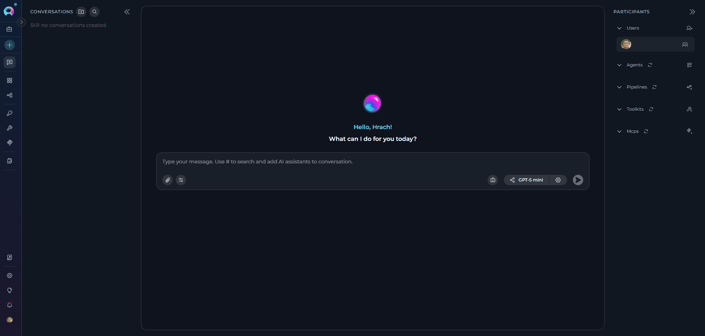
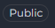
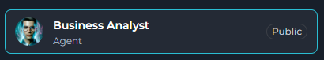
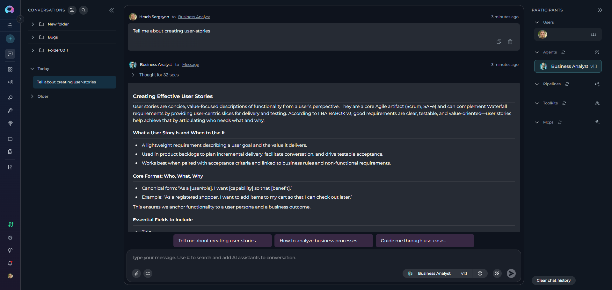

With ELITEA, you can add to your chat two kinds of participants — users (human team members) and AI participants (agents, pipelines, toolkits and MCPs). All participants are displayed and can be managed in the PARTICIPANTS panel of the CHATS page.

## How to Work with Users

<Note title="Team Projects Only">
User collaboration features are only available in team projects, not in your private/personal project workspace.
</Note>

### Add Users to a Chat

Users (team members) can only be added to in team projects. They cannot be added to private conversations.

To add users:

1. In the chat input toolbar, click the **`+`** icon.
2. Select **Invite Users** from the popup menu.
3. The **Add users** modal will appear with a search bar.
4. Use the search bar to find teammates by name.
5. Select one or more users from the list by clicking on them.
6. Click **Add** to confirm. The selected users will appear in the **Users** section of the **PARTICIPANTS** panel.

**Important Notes:**

* Added users will receive notifications about being added to the conversation.
* Users can also join a public conversation implicitly by interacting with it.
* Users can be removed by hovering over their avatar in the **Users** section of the Participants panel and clicking the remove icon.

For detailed information on adding teammates, see [Adding Teammates to Conversation](../chat-conversations/add-teammates-to-conversation).


**Tips for Effective Collaboration in Team Projects**

* Use `@` mentions to notify specific teammates in a conversation.
* Group related conversations into folders for better navigation.
* Define roles, responsibilities, and deadlines directly in the chat.
* Regularly post progress updates and flag blockers in the conversation.

### View Users

All conversation participants are visible in the **PARTICIPANTS** panel on the right side of the chat interface:

* **Users Section**: Shows human teammates as circular avatars
* **Visual Display**: When multiple users are present, their avatars are displayed in a row
* **Participant Count**: If there are more users than can fit in the display, a count indicator (e.g., "+3") shows additional participants
* **Users Dropdown**: Hover over the Users section to reveal the users icon, then click it to see the complete list of all conversation participants
* **Sorted List**: Users appear in alphabetical order by name in the dropdown menu

   

### Mention Users

Mentioning teammates directs messages to them and highlights their name in the conversation for better visibility.

**How to Mention a Specific User:**

**Method 1: Using the Participants Panel**

1. In the **PARTICIPANTS** panel, hover over the **Users** section to reveal the users icon.
2. Click the users icon to open the users dropdown.
3. Hover over the user's name you want to mention — an **@** symbol overlay appears.
4. Click the user's name (or the **@** overlay) to insert the mention into your message.

**Method 2: Using @ in Chat Input**

1. In the chat input field, type **@**
2. A suggestion list appears showing all users in the conversation
3. Select the user you want to mention from the list (or continue typing their name to filter)
4. The mention is inserted into your message

The user's mention will be automatically inserted into the chat input field.

**Mention Everyone:**

To direct your message to all participants in the conversation:

1. In the **PARTICIPANTS** panel, hover over the **Users** section to reveal the users icon.
2. Click the users icon to open the users dropdown.
3. Select **"All users"** from the dropdown (appears at the bottom after the divider, only shown when there are 2 or more users).
4. The `@Everyone` mention is inserted into your message.
5. Complete your message and send.

Alternatively, type **@** in the chat input and select **"Everyone"** from the suggestion list.

   


<Tip title="About Mentions">
* Mentions help direct messages to specific users or all participants in the conversation
* You can mention multiple users in a single message by clicking on each user's avatar
* **Important**: When you mention a user, the message is directed to that user only - AI assistants (agents, pipelines) will not process or respond to the message
</Tip>

### Remove Users from the Chat

**To remove a user from the chat:**

1. In the **PARTICIPANTS** panel, hover over the **Users** section to reveal the users icon.
2. Click the users icon to open the dropdown.
3. Hover over the user's name — a **Delete** icon appears on the right.
4. Click the **Delete** icon.
5. In the confirmation dialog ("Remove user? Are you sure to remove the **[name]** user from conversation?"), click **Remove** to confirm.

The user will be immediately removed from the conversation and will no longer have access to the chat.

   

<Warning title="Removal Confirmation">
You cannot remove yourself from the conversation. The Delete icon only appears for other users.
</Warning>

## Working with AI Participants

AI participants — Agents, Pipelines, Toolkits, MCPs — are the core components you interact with within a conversation.

### Add Existing AI Participants

You can add various AI participants to enhance your conversations.

**Method 1: Using the + Button**

1. In the chat input toolbar, select the **`+`** icon (tooltip: *Add files, agents, toolkits and more…*).
2. A popup menu opens. Hover over the category you want:
    - **Agents** — shows a searchable list of available agents
    - **Pipelines** — shows a searchable list of available pipelines
    - **Toolkits** — shows a searchable list of available toolkits (with a Public/Private toggle)
    - **MCPs** — shows a searchable list of available MCP servers (with a Public/Private toggle)
3. Search by name in the submenu search box, then select a participant to add it.
4. The added participant appears in the **PARTICIPANTS** panel on the right side of the screen.
5. For **Agents** and **Pipelines**: selecting the participant in the panel activates it. An **AgentEditorPanel** strip appears above the input area showing the participant name, version selector, variables and a settings button.


**Method 2: Using the # Symbol**

1. In the chat input box, type `#` to open a **Search results** dropdown of available participants.
2. Continue typing to filter by name (e.g., `#Jira` will show all Jira-related participants).
3. Select a participant from the filtered list — the dropdown searches across **Agents**, **Pipelines**, **Toolkits** and **MCPs**.
4. The selected participant appears in the **PARTICIPANTS** panel.


### Create New AI Participants

You can create new participants directly from the chat interface via the `+` menu:

1. Select the **`+`** icon in the input toolbar.
2. Hover over the relevant category (Agents, Pipelines, Toolkits or MCPs).
3. Select the **Create New \{Type\}** option at the bottom of the submenu.
4. The corresponding Canvas editor opens inline.


The **PARTICIPANTS** panel shows one collapsible accordion per participant type — **Users**, **Agents**, **Pipelines**, **Toolkits** and **MCPs** — with the **Users** accordion shown only in team projects.


<Note title="Shared Toolkit Credentials">
If a toolkit in your Chat uses shared credentials that are not yet configured in your Personal workspace, a **Misconfiguration errors found. Check the toolkit.** message appears on the toolkit card. Clicking **Check the toolkit** opens the toolkit in the Canvas editor, where the **Credential setup required** warning banner is displayed. Click the **Create a credential** link to create the matching credential. See [Shared Toolkit Credentials](../../menus/toolkits#shared-toolkit-credentials) for details.


</Note>

### Use Participants in a Chat

Once added, participants are ready to process your messages:

1. **Check Participants**: Ensure the desired participant is listed in the **Participants** section.
2. **Select Active Participant(s)**: 
       - **Click**: Click the participant's name/icon in the **Participants** list to make it active for your next message.
3. **Send Message/Command**: Type your message or a simple command (like "Go", "Execute", "Run it") and press **Send**. The active participant(s) will process your input.

#### Mention Toolkits and Tools

You can direct the AI to use a specific tool from an already-added toolkit by typing `/` in the chat input. This is a two-phase selection:

**Select a Toolkit:**

1. In the chat input box, type `/` to open the **Mention toolkit** dropdown.
2. The dropdown lists all toolkits that are already added as participants in the current conversation.
3. Continue typing to filter by toolkit name (e.g., `/Jira` filters to Jira-related toolkits).
4. Click a toolkit name from the dropdown, or type the full name and press `/` again to confirm it.
5. The input updates to `/{ToolkitName}/` and the dropdown switches to show the toolkit's available tools.

**Select a Tool:**

6. The dropdown now shows **"{ToolkitName} available tools"** with all tools exposed by that toolkit.
7. Continue typing after the second `/` to filter tools by name (e.g., `/Jira/create` shows create-related tools).
8. Each tool shows its name and a short description.
9. Click the desired tool to confirm the selection.
10. The mention is committed to the input as `/{ToolkitName}/{ToolName}` with a cyan highlight and a trailing space so you can continue typing your message.


You can include multiple toolkit tool mentions in a single message, and they can be placed anywhere within the message. For example: `Please use /Jira/createIssue to create a new issue and then /GitHub/createPR to create a pull request.`

Each mention is highlighted independently and sent to the AI as separate tool directives.

<Note>
The `/` mention works with both **Toolkits** and **MCP** participants that are already added to the conversation. If a toolkit or MCP does not appear in the dropdown, add it first via the **`+`** button in the input toolbar or by typing `#`. Toolkits and MCPs with misconfiguration errors are excluded from the dropdown until the configuration issue is resolved.
</Note>

### Configure AI Participants

You can configure and edit participants (Agents, Pipelines, Toolkits, and MCPs) directly within the conversation using the Canvas editor.

**Accessing Participant Settings:**

1. **Option 1**: Click the participant in the **Participants** list, then click the **⚙️** (settings) icon.
2. **Option 2**: Hover over the participant element in the **Participants** list and click the **Edit** icon that appears.
3. The appropriate **Canvas** editor will open based on the participant type.

**What You Can Configure:**

<Tabs>
  <Tab title="Agents">
    - Edit the agent's **prompt** and instructions
    - Modify **variables** used by the agent
    - Configure **model settings** 
    - Select the agent **version** (default is "base")
    - Adjust **toolkits** and integrations
  </Tab>

  <Tab title="Pipelines">
    - Edit the pipeline **workflow** and step sequences
    - Modify **variables** and parameters
    - Configure **agents** used in the pipeline
    - Adjust **toolkits** and integrations
    - Select the pipeline **version** (default is "base")
  </Tab>

  <Tab title="Toolkits">
    - Configure **integration settings** and credentials
    - Adjust **tool parameters** and options
    - Enable or disable specific tools within the toolkit
    - Modify **connection settings** for external services
  </Tab>

  <Tab title="MCPs">
    - Configure **server connection** settings
    - Adjust **tool availability** and permissions
    - Modify **environment variables** and parameters
    - Set **timeout** and performance options

    <Info>
    MCP servers must be running before they can be used in conversations. Ensure your MCP server is started and accessible before adding it as a participant.
    </Info>
  </Tab>
</Tabs>

**Applying Changes:**

1. Make your edits in the Canvas editor.
2. Click the **Save** button to apply your modifications.
3. The updated configuration will be used for subsequent messages in the conversation.


## How to Use Public Agents from Chat

Public Agents are:

* Pre-configured AI assistants designed for specific tasks
* Created by community members and approved by moderators
* Contain specialized instructions, model configurations, and integrated toolkits
* Examples: Data analysis agents, code review assistants, documentation generators

**Key Characteristics**

* **Community-Driven:** Shared by other Elitea users after quality review
* **Easily Identifiable:** Marked with a "Public" chip/badge for quick recognition
* **Read-Only Core Config:** Core configuration cannot be modified (with temporary adjustments noted below)
* **Immediately Usable:** Add to conversations and start using right away
* **Discoverable:** Browse Latest, My Likes, and Trending sections

### Differences Between Public and Private Agents

#### Functionality

| Aspect | Public Agents | Private Agents |
|--------|--------------|---------------|
| **Execution** | ✔️ Fully functional | ✔️ Fully functional |
| **Add to Chat** | ✔️ Via # search or + button | ✔️ Via # search or + button |
| **Temporary Model Changes** | ✔️ Change LLM & settings (session only) | ✔️ Full control |
| **Temporary Variables** | ✔️ Modify variables (session only) | ✔️ Full control |
| **Save Changes** | ✘ Cannot save any modifications | ✔️ Can save all changes |
| **Edit Core Configuration** | ✘ Prompts read-only | ✔️ Full edit access |

### Permissions and Limitations

#### What You Can Do

✔️ **Execute Public Agents:**

* Run public agents in your conversations
* Use them as many times as needed
* Combine multiple public agents in one conversation

✔️ **View and Temporarily Modify Configurations:**

Public agents open with limited editing capabilities. You can view configurations and make temporary adjustments for your current conversation:

* Click the agent in **PARTICIPANTS** → Click **⚙️** settings icon
* Agent Canvas opens with read-only core configuration
  * **You CAN temporarily modify:**
       * LLM model selection
       * Model settings (Temperature, Top P, Top K, etc.)
       * Variables
  * **You CANNOT modify or save:**
       * Agent prompt/instructions
       * Toolkit configurations
       * Other core settings

<Warning title="Session-Only Changes">
All temporary modifications apply only to your current conversation. Starting a new conversation with the same public agent will revert to the original default configuration. This allows you to experiment without affecting the public version or other users.
</Warning>

✔️ **Create Your Own Versions:**

* While you cannot save modifications to public agents, you can create your own agent
* Copy concepts and adapt them to your needs in your Private or Team projects
* Save customized versions permanently in your workspace

#### What You Cannot Do

✘ **Save Modifications to Public Agents:**

* Cannot save changes to model settings, variables, or credentials
* Temporary adjustments only last for the current conversation
* Each new conversation with the public agent starts with default configuration

✘ **Delete or Unpublish:**

* Only the original author and moderators can manage publication status
* Users cannot remove public agents from the community library

#### Important Notes

**When Creating Your Own Versions:**

* **Learn from Public Agents:** Study how successful agents are structured, understand prompt engineering techniques, and learn effective configuration patterns
* **Adapt, Don't Copy Exactly:** Create variations suited to your specific needs, combine concepts from multiple public agents, and add your own improvements
* **Consider Publishing:** If you create something valuable, consider publishing it back to the community to share your improvements and help others

### Access Public Agents from Chat

Public agents are accessible directly within any conversation through the Chat interface.

**Method 1: Using the # Search**

The quickest way to find and add public agents is using the `#` symbol:

1. **Open or Create a Conversation:**
     * Navigate to **Chat** in the main sidebar
      * Click **+ Create** for a new conversation, or open an existing one

2. **Search for Public Agents:**
      * In the message input box, type `#` followed by the name or keywords
      * A dropdown list appears showing matching agents
      * The list includes both your own agents and public community agents
      * Public agents are marked with a **"Public"** chip/badge for easy identification

3. **Select the Agent:**
      * Click on the desired agent from the dropdown
      * The selected agent appears as a chip above the input box

4. **Send Your Message:**
      * Type your message or question
      * Click **Send** or press Enter
      * The public agent will process your request



**Method 2: Using the Participants Panel**

You can also add public agents through the **PARTICIPANTS** panel on the right side:

1. **Locate the Participants Panel:**
      * On the right side of the chat interface, find the **PARTICIPANTS** section
      * You'll see a collapsible section for **Agents**

2. **Add Public Agents:**
      * Click the **+** icon next to **Agents**
      * A dropdown list appears with available agents, including public ones
      * Public agents are marked with a **"Public"** chip/badge
      * Select the public agent you want to add

3. **Interact with the Agent:**
      * Click on the participant in the **PARTICIPANTS** list to activate it
      * Type your message and send


### Use Public Agents

**Step-by-Step:**

1. **Add the Public Agent:**
     * Use `#AgentName` in the input box, OR
     * Click **+** next to **Agents** in the PARTICIPANTS panel

2. **Activate the Agent:**
     * Click on the agent name in the **PARTICIPANTS** list
     * The active agent is highlighted in the list

3. **Interact:**
     * Type your message or click a conversation starter if available
     * Send your message
     * The public agent processes your request and responds

<Info title="Visual Indicators">
Public agents are marked with a **"Public"** chip/badge, making them easily identifiable. This badge appears on the agent card in lists and search results, helping you quickly distinguish between your private agents and community-shared public agents.


</Info>

<Info title="Example: Using Business Analyst Agent">
The **Business Analyst** agent helps create requirements documentation, diagrams, and analysis artifacts for your projects.

**Scenario:** You need user stories for an e-commerce shopping cart feature.

**Step 1: Add the Agent**

* Type `#Business Analyst` in the chat input box
* The agent appears in PARTICIPANTS with a "Public" badge



**Step 2: Ask Your Question**

```
You: I need user stories for adding items to a shopping cart
```

**Step 3: Agent Response**

The agent provides a comprehensive guide on creating user stories, including:

**Core Format:**
```
As a [user/role], I want [capability] so that [benefit]
```

**Complete User Story Example:**

| Title | Description | Acceptance Criteria | Priority | Story Points |
|---|---|---|---|---|
| Add item to cart | As a registered shopper, I want to add a product to my cart so that I can purchase later | See scenarios below | High | 3 |

**Acceptance Criteria (Gherkin format):**
```gherkin
Scenario: Add an in-stock item
  Given I am a logged-in shopper
  And product "ABC123" is in stock
  When I click "Add to cart"
  Then the item appears in my cart with quantity 1
  And I see "Added to cart"

Scenario: Prevent adding out-of-stock item
  Given product "XYZ999" is out of stock
  When I click "Add to cart"
  Then I see "Item out of stock"
  And the cart is unchanged
```

**Agent Also Provides:**

- ✔️ **Quality Checklist**: INVEST criteria (Independent, Negotiable, Valuable, Estimable, Small, Testable)
- ✔️ **Story Splitting Techniques**: How to break down large stories
- ✔️ **Non-Functional Requirements**: Performance, security, accessibility considerations
- ✔️ **Traceability**: Links to business rules, test cases, and requirements
- ✔️ **Alternative Formats**: YAML, Jira markup, or Azure DevOps format

**Step 4: Request Specific Format**

```
You: Can you provide this in YAML format for our Azure DevOps board?
```

The agent will regenerate the story in your preferred format with all necessary fields.

**Benefits:**

- ⚡ **Fast**: Get complete, well-structured user stories in seconds
- 📋 **Standards-Based**: Follows BABOK, IIBA, and Agile best practices
- 🔄 **Adaptable**: Works with Jira, Azure DevOps, Confluence, or plain Markdown
- 🎯 **Complete**: Includes acceptance criteria, NFRs, and traceability

**Tip:** Click **⚙️** next to the agent to adjust Temperature (lower = more structured output) for your current session.


</Info>

## Best Practices

<Accordion title="Adding and Managing Users">
* **Use Search**: In the Add users modal, use the search bar to quickly find teammates by name in large teams
* **Multiple Users**: You can add multiple users at once from the Add users modal for team-wide conversations
* **User Management**: Remove users who no longer need access to keep conversations focused and secure
</Accordion>

<Accordion title="Using Mentions Effectively">
* **Strategic Mentions**: Use @mentions to get specific users' attention on important updates or questions
* **Mention Everyone Sparingly**: Use `@Everyone` only for critical announcements to avoid notification fatigue
</Accordion>

<Accordion title="Human-AI Collaboration">
* **Collaboration**: Combine user mentions with AI participants (agents, pipelines) for powerful human-AI collaboration
* **Teamwork**: Use conversations to enable seamless collaboration between human teammates and AI assistants
</Accordion>

## Troubleshooting

<Accordion title="Cannot see 'Add users' option">
* Verify you're in a team project (not your personal/private project)
* User collaboration features are disabled in private workspaces
</Accordion>

<Accordion title="User not appearing in search results">
* Ensure the user is a member of your project/team
* Check if the user has been filtered by existing participants (already added users don't appear in search)
* Scroll down in the user list - there may be more results below
</Accordion>

<Accordion title="Cannot remove a user">
* You cannot remove yourself from the conversation
* Only users who were added to the conversation can be removed
* The conversation creator and project members with appropriate permissions can remove users
</Accordion>

<Accordion title="Mentions not working">
* Ensure you're typing **@** followed by the username
* Select the user from the dropdown menu that appears
* Verify the user is still a participant in the conversation
</Accordion>