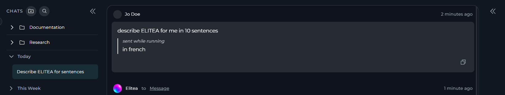
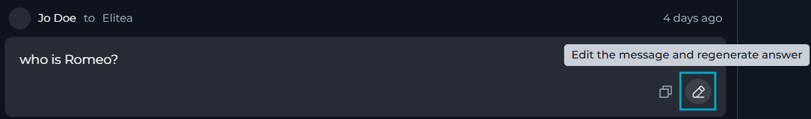
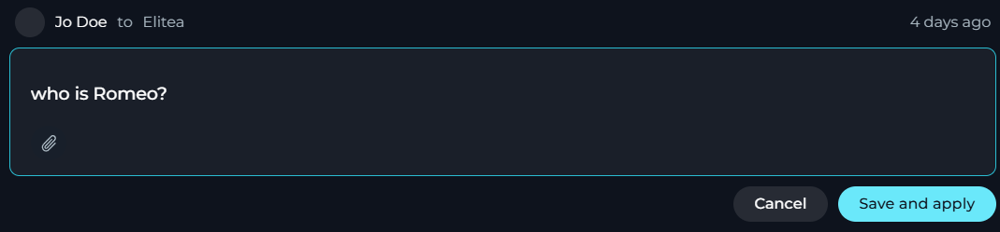
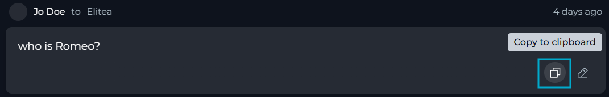
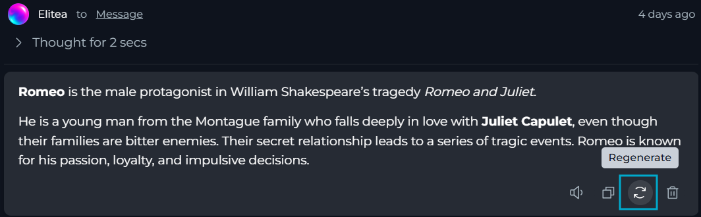
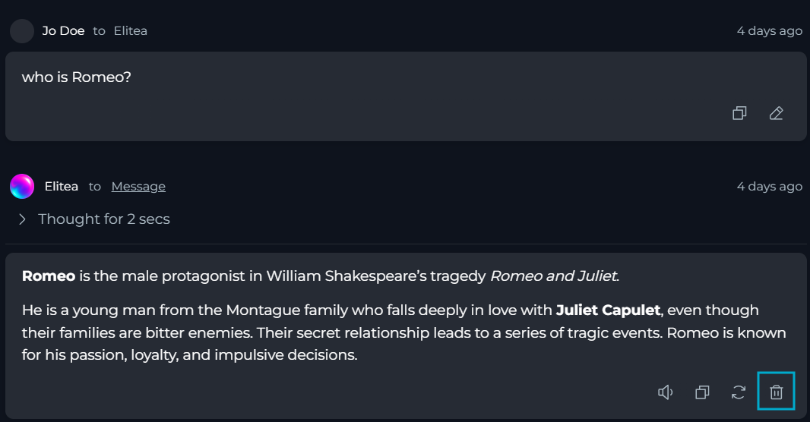

With ELITEA, you can review the LLM responses in chat, interact with them, and play back the whole conversation in chat.

## How to Interact with Chat Responses

ELITEA allows interacting with responses generated by your AI assistant:

<CardGroup cols={3}>
  <Card title="Send" icon="comment-dots" href="#send-a-message-while-the-agent-is-working">
    Send a message while an AI participant is still working.
  </Card>
  <Card title="Edit" icon="pen" href="#edit-your-latest-message">
    Edit your latest message and regenerate the answer.
  </Card>
    <Card title="Read out" icon="volume-high" href="#read-out-a-response">
    Listen to an AI response using text-to-speech playback.
  </Card>
  <Card title="Copy to clipboard" icon="copy" href="#copy-a-message-to-the-clipboard">
    Copy a message's content to your clipboard.
  </Card>
  <Card title="Regenerate" icon="arrow-rotate-right" href="#regenerate-the-latest-output">
    Regenerate the latest output without editing your message.
  </Card>
  <Card title="Delete" icon="trash" href="#delete-your-latest-message">
    Delete your latest message or the AI's latest response.
  </Card>
</CardGroup>

### Send a Message While the Agent Is Working

**Mid-turn input** allows sending a message while an AI assistant is still generating its answer, to change the rest of the run instead of waiting for it to finish.

<Note>
Mid-turn input must be enabled at both the platform level and the project level:
* Platform administrators control which projects have access to this feature through a project allowlist.
* Project administrators or editors can turn it on for the project in [Settings > General > Chat Configuration](../../menus/settings/general#chat).

By default, mid-turn input is turned off.
</Note>

If mid-turn input is allowed and turned on for your project, the message input field remains active while the LLM is still generating its response. This means you can enter your text in the message field as usual.

After you select **Send**, ELITEA will inject your message into the current context and adjust its response based on your new input instead of starting a new run.

ELITEA automatically sends your text as a new, separate message instead if:

* It exceeds 4000 characters.
* The running turn ends before ELITEA processes it.

The text of your mid-turn input is labeled as *sent while running* and appears indented under your original message.

### Edit Your Latest Message

If you want to refine your prompt instead of sending a new follow-up message, you can edit your latest user message and regenerate the answer from the updated text:

1. Among the action icons shown under your latest user message, select **Edit** (the pencil icon).

   

2. The message switches to inline edit mode. If the original message included attachments, they are not removed and remain visible.

   

3. Update the text, as necessary.
4. (optional) Add new attachments or remove the existing ones.
5. Select **Save and apply** to submit the edited message and regenerate the answer, or select **Cancel** to discard your changes.

<Note>
You can edit only your latest message, and only if no [mid-turn input was added to it](#send-a-message-while-the-agent-is-working).
</Note>

The **Edit** icon appears only under your latest message, and only after the response was generated. The **Save and apply** button stays disabled until you add any changes to the message.

Editing a message permanently replaces the previous response — ELITEA does not keep a history of earlier responses, and this action cannot be undone.

**Regenerating counts toward** your project's model and **token usage** like any new message.

### Read Out a Response

**Read out** uses text-to-speech to play an AI response aloud instead of you reading it:

1. Under an AI response, select **Read out**.
2. ELITEA opens a floating voice player under the message input.
3. Select **Play** in the voice player to start listening.

<Note>
**Read out** is unavailable while the response is still loading, streaming, or regenerating, or while another response is already playing or queued to play. Select **Stop** in the voice player before reading out a different response.
</Note>

While a response plays, ELITEA highlights the part of the text currently being spoken.

<video src="../../img/how-tos/chat-conversations/chats/responses/responses_read-out.mp4" controls alt="ELITEA reading an AI response aloud and highlighting the text currently being spoken."></video>

ELITEA adapts some content before speaking it instead of reading it literally:

* Code blocks, tables, and diagrams are replaced with a short spoken notice.
* Links are read as "the link" (or by their link text, if descriptive).
* Images are read as "an image showing" their alt text.
* Ordered list items are read with spoken ordinals (for example, "First," instead of "1.").

<Info>
For detailed information, see [Voice Capabilities](./voice).
</Info>

### Copy a Message to the Clipboard

You can copy the text of any message — yours or an AI response — to your clipboard:

1. Under the message, select **Copy to clipboard**.
2. ELITEA copies the message and shows a confirmation.

ELITEA copies the message's raw content, not its rendered formatting. For a message that includes canvas content, attachments, or an error, ELITEA copies the canvas text, an attachment name placeholder, or the error details instead of the surrounding message text.

<Note>
**Copy to clipboard** is available on every message. On an AI response, it is disabled until ELITEA finishes generating the response.
</Note>

### Regenerate the Latest Output

You can request a new answer for the same input without editing your message, once ELITEA has generated at least one response in the chat:

1. Under the latest generated response, select **Regenerate**.
2. ELITEA regenerates the output based on the same input, providing a refined or corrected response.

You cannot regenerate the latest output while a response is still streaming, while you are editing a canvas in the chat, or if the AI participant that produced the response is no longer active in the chat.

Regenerating resets the response and its reasoning trace — ELITEA does not keep the earlier version, and this action cannot be undone. **Regenerating** also **counts toward** your project's model and **token usage** like any new message.

### Delete Your Latest Message

You can delete the latest message in the chat — either your latest message or the AI's latest response.

1. Under the latest message, select **Delete**.
2. Select **Delete** again in the confirmation dialog, or **Cancel** to keep the message.

<Note>
You can delete only your own latest message, or the latest AI response to a question you asked. The chat's creator can delete any latest message regardless of who sent it.
</Note>

Deleting a message removes only that message — it does not remove any other messages, related or not. ELITEA does not keep a copy of a deleted message, and this action cannot be undone.

You cannot delete the latest AI response while you are editing a canvas in the chat or while the response is still processing.

## How to Use Playback Mode

In **playback mode**, you can step through the conversation in the current chat turn by turn, exactly as it happened, without sending any requests to the models or toolkits:

1. Find the necessary chat in the CHATS sidebar.
2. In its overflow menu, select **Playback**.
3. Move forward to the next message, go back to the previous message, or stop the playback simulation using the on-screen controls or keyboard arrow keys.

<video src="../../img/how-tos/chat-conversations/chats/responses/responses_playback.mp4" controls alt="Playback Mode stepping through a chat's messages without contacting any Model or Toolkit."></video>

<Note>
While playback mode is active, the chat's name is prefixed with **[Playback]**, and its overflow menu is reduced to **Rename** and **Delete**.
</Note>

**Benefits of Playback Mode for Demos**

During demos, teams can use playback mode to demonstrate their collaboration and decision-making processes to stakeholders:

* You can demonstrate workflows and complex interactions without incurring processing costs or waiting for live responses.
* Stakeholders see the exact flow of discussions and decisions smoothly and without interruptions.
* The step-by-step simulation keeps your audience engaged and focused on key points.

<Info title="See Also">
See also:

* [Chat](../../menus/chat)
* [Chat Configuration & Management](./config-mnmt)
* [Chat Configuration settings](../../menus/settings/general#chat)
* [Voice Capabilities](./voice)
</Info>