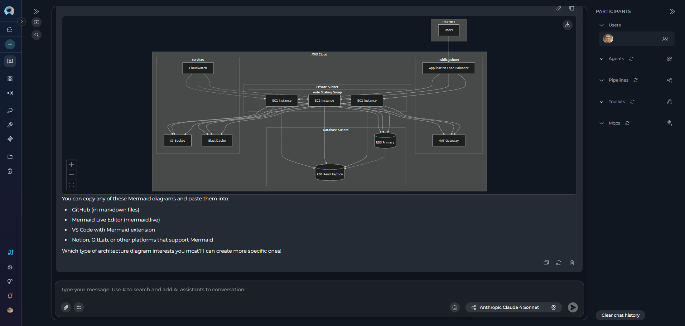
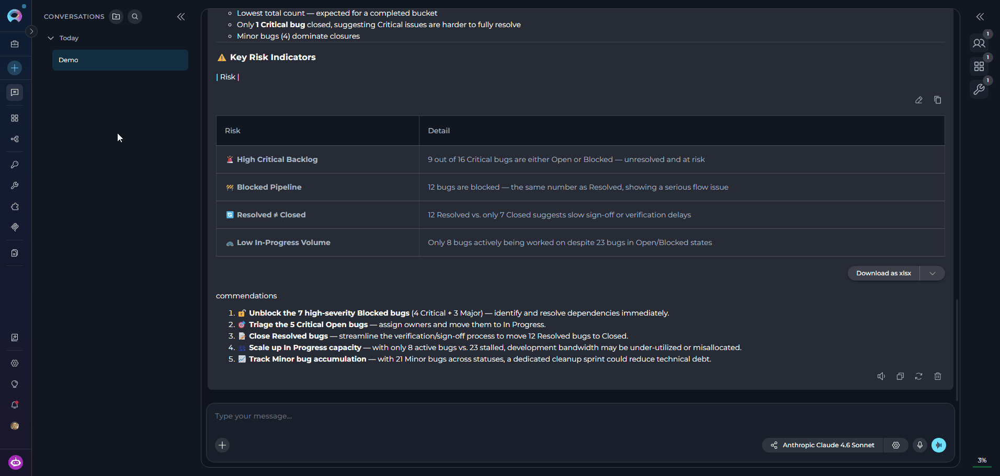

With ELITEA, you can not only review the LLM responses in chat but also interact with them, as well as play the whole conversation in chat back.

## How to Interact with Chat Responses

ELITEA allows interacting with responses generated by your AI assisstant:

<CardGroup cols={3}>
  <Card icon="comment-dots" href="#send-a-message-while-the-agent-is-working">
    Send a message while an AI participant is still working.
  </Card>
  <Card icon="pen" href="#edit-your-latest-message">
    Edit your latest message and regenerate the answer.
  </Card>
  <Card icon="arrow-rotate-right" href="#regenerate-the-latest-output">
    Regenerate the latest output without editing your message.
  </Card>
</CardGroup>

### Send a Message While the Agent Is Working

**Mid-turn input** allows sending a message while an AI assisstent is still generating its answer, to change the rest of the run instead of waiting for it to finish.

<Note>
Mid-turn input must be enabled at both the platform level and the project level:
* Platform administrators control which projects have access to this feature through a project allowlist.
* Project administrators or editors can turn it on for the project in [Settings > General > Chat Configuration](../../menus/settings/general#chat).

By default, mid-turn input is turned off.
</Note>

If mid-turn input is allowed and turned on for your project, the message input field remains active while the LLM is still generating its response. This means you can enter your text in the message field as usual.

After you select **Send**, ELITEA will inject your message into the current context and adjust its response based on your new input instead of starting a new run.

ELITEA automatically sends your text as a new, separate message instead if:

* It exceeds 4000 characters.
* The running turn ends before ELITEA processes it.

The text of your mid-turn input is labeled as *sent while running* and appears indented under your original message.


### Edit Your Latest Message

If you want to refine your prompt instead of sending a new follow-up message, you can edit your latest user message and regenerate the answer from the updated text.

1. Among the action icons shown under your latest user message, select **Edit** (the pencil icon).
3. The message switches to inline edit mode. If the original message included attachments, they are not removed and remain visible.
4. Update the text, as necessary.
5. (optional) Add new attachments or remove the existing ones.
6. Select **Save and apply** to submit the edited message and regenerate the answer, or select **Cancel** to discard your changes.

<Note>
You can edit only your latest message, and only if no mid-turn input was added to it (see [Send a Message While the Agent Is Working](#send-a-message-while-the-agent-is-working)).
</Note>

The **Edit** icon appears only under your latest message, and only after the response was generated. The **Save and apply** button stays disabled until you add any changes to the message.

Editing a message permanently replaces the previous response — ELITEA does not keep a history of earlier responses, and this action cannot be undone.

Regenerating counts toward your project's model and token usage like any new message.

### Regenerate the Latest Output

The **Regenerate** option becomes available only after ELITEA generates at least one response in the chat. This feature allows you to request a new answer for the same input.

1. Under the latest generated response, select the **Regenerate** (🔄) icon.
2. ELITEA regenerates the output based on the same input, providing a refined or corrected response.



<Note>
**Regenerate** is unavailable while a response is still streaming, while you are editing a canvas in the chat, or if the AI participant that produced the response is no longer active in the chat.
</Note>

Regenerating resets the response and its reasoning trace — ELITEA does not keep the earlier version, and this action cannot be undone. Regenerating also counts toward your project's model and token usage like any new message.

## Playback Mode

Playback Mode allows you to step through an existing chat turn by turn, exactly as it happened, without sending any requests to the Models or Toolkits.



<CardGroup cols={3}>
  <Card title="Purpose" icon="circle-info">
    Demonstrate workflows, review complex interactions, or debug without incurring processing costs or waiting for live responses.
  </Card>
  <Card title="Activation" icon="play">
    Find the chat in the CHATS sidebar, then select **Playback** from its overflow menu.
  </Card>
  <Card title="Controls" icon="sliders">
    Move forward to the next message, go back to the previous message, or stop the playback simulation using the on-screen controls or keyboard arrow keys.
  </Card>
</CardGroup>

<Note>
While Playback Mode is active, the chat's name is prefixed with **[Playback]**, and its overflow menu is reduced to **Rename** and **Delete**.
</Note>

**Example: Using Playback Mode for a Demo**

**Scenario**:
A Product Manager is preparing a demo for stakeholders to showcase how the team collaborated on a new feature. They use Playback Mode to simulate the chat and highlight key decisions and actions.

**Steps to Use Playback Mode**:

**Find the Chat**:
The Product Manager finds the chat in the **CHATS** sidebar where the team discussed the feature.

**Activate Playback Mode**:
The Product Manager opens the chat's overflow menu and selects **Playback**.

**Simulate the Chat**:
   - The playback starts with the BA's initial message outlining the feature requirements.
     Example:
     ```
     @BA: "The new feature should allow users to upload files up to 10 MB in size. The system must validate file types and provide error messages for unsupported formats."
     ```
   - The PM moves to the next message, where they set the timeline for development and testing.
     Example:
     ```
     @PM: "The development team will complete the implementation by May 15. QA can start testing on May 16, and we aim to release the feature by May 20."
     ```
   - The QA's message about testing strategies is reviewed next.
     Example:
     ```
     @QA: "I will create test cases for file uploads, including valid and invalid file types, file size limits, and error handling."
     ```

**Highlight Key Decisions**:
   - The Product Manager stops playback to explain the rationale behind certain decisions, such as the timeline or testing strategy.
   - They resume playback to show the BA's clarification about drag-and-drop uploads.
     Example:
     ```
     @BA: "Yes, drag-and-drop uploads should be supported. Additionally, the system should display a progress bar during uploads."
     ```

**Conclude the Demo**:
   - The Product Manager stops playback after showcasing the final message tracking progress.
     Example:
     ```
     @PM: "QA, please share the test results by May 18 so we can review them before the release."
     ```

**Benefits of Playback Mode for Demos**

* **Polished presentations**: Playback Mode ensures a smooth and professional demo without interruptions or delays.
* **Clarity**: Stakeholders can see the exact flow of discussions and decisions.
* **Engagement**: The step-by-step simulation keeps the audience engaged and focused on key points.

Playback Mode helps teams demonstrate their collaboration and decision-making process to stakeholders, ensuring transparency and alignment.

<Info title="See Also">
See also:

* [Chat](../../menus/chat)
* [Chat Configuration & Management](./config-mnmt)
* [Chat Configuration settings](../../menus/settings/general#chat)
</Info>