## Overview

By default, toolkits in a team project use **project credentials** — a single shared set of secrets that all team members execute under. This works for many scenarios, but it means all actions appear under one account, making it impossible to audit who did what or enforce per-user access controls.

**User-specific credentials** solve this by letting the toolkit reference a **private credential** instead. Each team member creates their own private credential with a matching Credential ID, and the system automatically resolves to the individual user's credential at execution time — no shared secrets, no ambiguous audit trails.

**Key Benefits**

<CardGroup cols={2}>
  <Card title="Enhanced Security" icon="shield-halved">
    Each user executes the toolkit with their own credentials — no shared secrets that can be over-permissioned or accidentally exposed.
  </Card>
  <Card title="Individual Auditability" icon="magnifying-glass">
    Actions are attributed to the individual user's account on the target service, making audit trails accurate and meaningful.
  </Card>
  <Card title="Granular Access Control" icon="sliders">
    Each user's access level on the target service (e.g., read-only vs. write) is naturally enforced through their own credentials.
  </Card>
  <Card title="Compliance-Ready" icon="file-shield">
    Meets security and compliance requirements that mandate individual accountability for automated actions.
  </Card>
</CardGroup>

## How It Works

**Limitations of Shared Credentials**

When creating toolkits in a team project with project credentials:

- All users share the same credentials.
- Actions appear under a single account.
- It's difficult to audit individual user actions.
- Potential security and compliance issues.

**Per-User Private Credentials**

By using private credentials with matching IDs, each user's own credentials are automatically resolved at execution time — no shared secrets, no ambiguous audit trails.

**Execution flow:**

- The team (or toolkit creator) agrees on a common Credential ID (e.g., `github_team_access`).
- Each user creates a private credential in their Private workspace using that exact ID.
- The toolkit creator configures the project toolkit to reference a private credential with that ID.
- When a user executes the toolkit, the system looks up a private credential in their workspace matching the configured ID and uses it automatically.

## Understanding Credential Types

**Project Credentials vs Private Credentials**

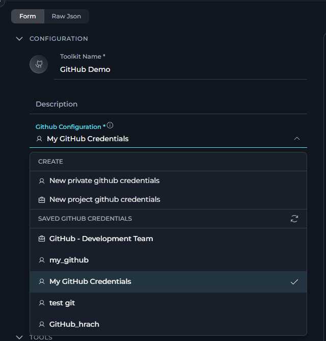

<Icon icon="briefcase" size={24} /> **Project Credentials:**
- Created and stored at the project level
- Accessible to all project members (based on their role permissions)
- Shared across the entire project team
- Identified by a briefcase icon (<Icon icon="briefcase" size={18} />) in the interface

<Note title="Project workspace visibility">
In a team project, both project credentials and the current user's private credentials are shown in the credential selector, filtered by toolkit type (e.g. only GitHub credentials appear for a GitHub toolkit).
</Note>

<Icon icon="user" size={24} /> **Private Credentials:**
- Created and stored in individual user's private workspace
- Only accessible to the credential owner
- Cannot be shared with other users
- Identified by a human icon (<Icon icon="user" size={18} />) in the interface

<Note title="Private workspace visibility">
In a Private workspace, only private credentials are available — no project credentials are shown.
</Note>

### Creating Project Credentials

<Tabs>
  <Tab title="From Credentials Page">
    1. Select the target project from the project dropdown.
    2. Open the sidebar and select **Credentials**.
    3. Click the **+ Create** button — the credential will be stored as a project credential.

       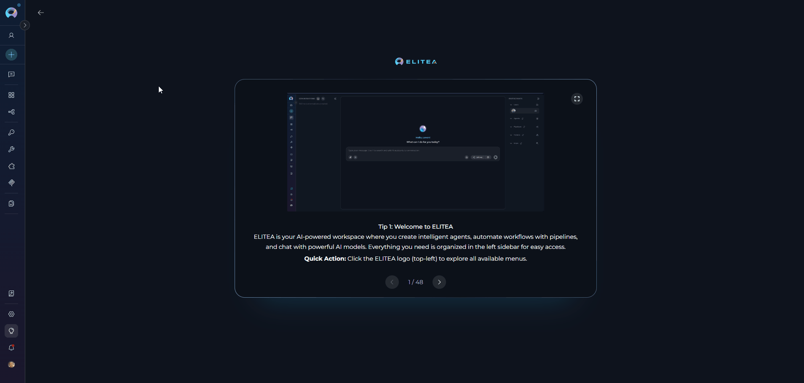
  </Tab>
  <Tab title="From Toolkit Configuration">
    1. Open the toolkit configuration form in a project.
    2. Select **New project {type} credentials** (e.g. "New project GitHub credentials") from the credential dropdown.

       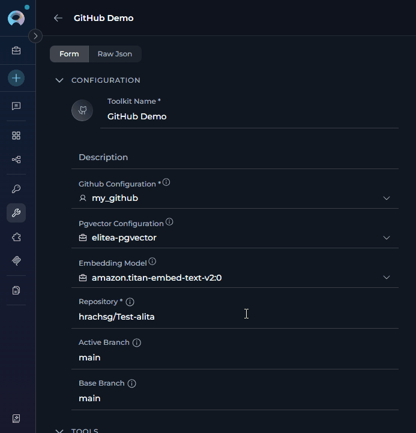
  </Tab>
</Tabs>

### Creating Private Credentials

<Tabs>
  <Tab title="From Credentials Page">
    1. Switch to your **Private workspace** using the project selector.
    2. Open the sidebar and select **Credentials**.
    3. Click the **+ Create** button — the credential is automatically stored as private.

        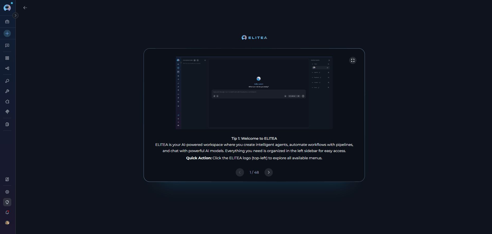
  </Tab>
  <Tab title="From Toolkit Configuration">
    1. Open the toolkit configuration form (even in a team project context).
    2. Select **New private {type} credentials** (e.g. "New private GitHub credentials") from the credential dropdown.

       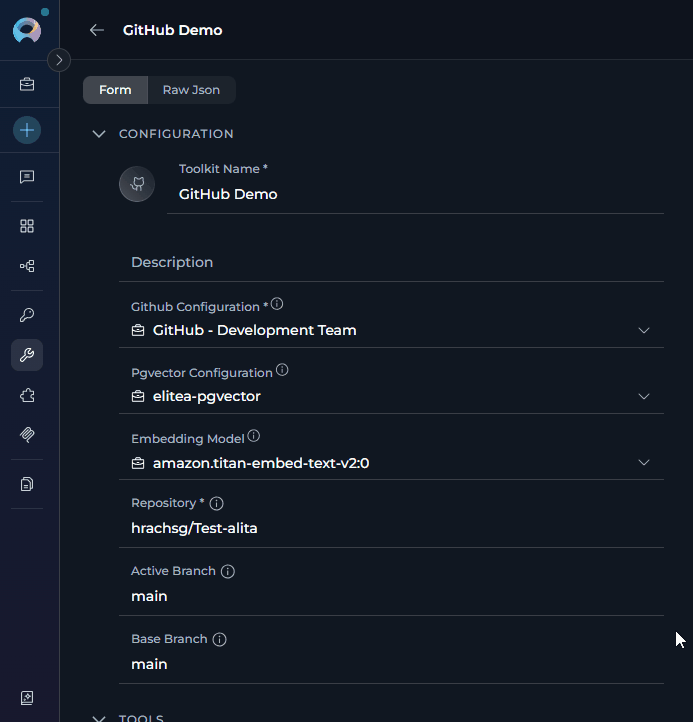
  </Tab>
</Tabs>

## Credential Names and IDs

**Understanding the Distinction**

When creating credentials, you'll notice two important fields:

- **Credential Name**: A human-readable display name shown in the UI.
- **Credential ID**: A unique identifier used by the system to match credentials across users. Always lowercase.

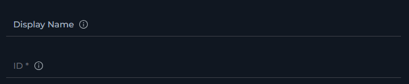

<Warning title="Key Differences">
- **Name**: Can be descriptive and user-friendly (e.g., "GitHub Integration Token"). Displayed in the credential selector.
- **Credential ID**: Must be unique within scope, always lowercase. This is the value the system uses to resolve which credential to inject at execution time (e.g., `github_integration_token`).
</Warning>

**Automatic ID Generation**

When you type a credential name, the Credential ID field is automatically derived from it: spaces are replaced with underscores and all characters are lowercased.

**Example:**
- **Name**: "GitHub Integration Token"  
- **Auto-generated ID**: `github_integration_token`

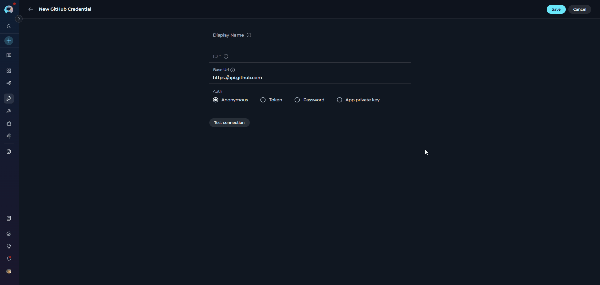

**ID Collision Handling**
If a credential with the same ID already exists in the scope:

1. Saving returns an error indicating the ID is already in use,
2. The **Credential ID** field becomes editable — modify the ID while keeping the same display name.

     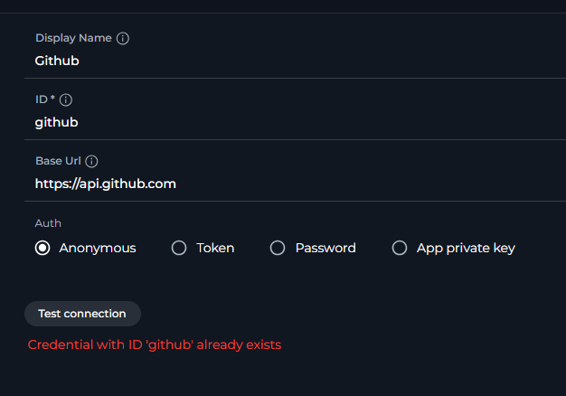

## Team Setup Walkthrough

**Step 1: Agree on a Credential ID**

The team (or toolkit creator) decides on a shared Credential ID that all members will use when creating their private credentials (e.g., `github_team_access`). This ID must be identical across all users' private credentials.

**Step 2: Each User Creates a Private Credential**

Every team member creates a private credential with the agreed-upon ID in their Private workspace. Refer to [Creating Private Credentials](#creating-private-credentials) above for detailed instructions.

**Step 3: Configure the Toolkit**

The toolkit creator opens the toolkit configuration form in the team project and selects a private credential with the agreed-upon ID from the credential dropdown:

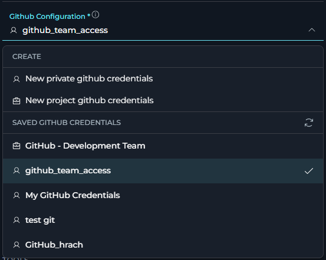

When a user executes the toolkit, the system automatically resolves the credential reference:

1. The system looks for a private credential in the executing user's Private workspace whose Credential ID matches the one configured in the toolkit.
2. If found, the user's private credential is used for execution.

### Missing Private Credentials

If no matching private credential is found, a **Credential setup required** banner is shown in the credential field, prompting the user to create one.

<Card icon="circle-exclamation" color="#ef4444" horizontal>
 <strong>  Credential setup required: </strong> This toolkit requires your own private *[credential type]* credentials. Create a credential with the matching ID *"[credential ID]"* in your Private workspace to use this toolkit.
</Card>

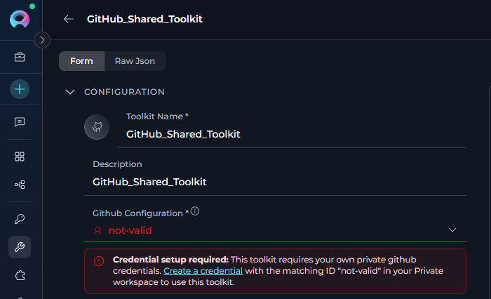

---

### Credential Configuration Change Warning

When any team member with edit permissions **changes the credentials** of a toolkit in a **team project**, a confirmation modal appears before the change is saved:

<Card title="Credential Configuration Change" icon="circle-exclamation" color="#ef4444">
  Changing the credential may make this toolkit non-operational for other team members who do not have a matching Private credential. Make this decision considering the potential impact on your team.
</Card>

**When it appears:** Only in Edit mode for toolkits in a team project, and only when the credential selection is changed or the private/shared flag is toggled. The modal is triggered when you click **Save**.

**Actions in the modal:**

| Button | Behavior |
|--------|----------|
| **Confirm changes** | Saves the new credential configuration. Team members without a matching private credential will see the **Credential setup required** banner. |
| **Discard changes** | Reverts the credential fields to their original state and closes the modal without saving. |

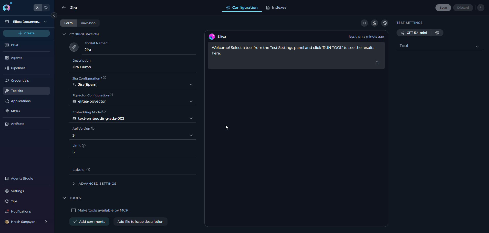

<Warning title="Team Impact">
Changing a shared toolkit's credentials to a private credential means that team members will need to create their own matching private credential in their Personal workspace before the toolkit works for them again. Communicate the required Credential ID to your team before confirming the change.
</Warning>

---

## <Icon icon="hand" size={32} /> Limitations and Considerations

<CardGroup cols={2}>
  <Card title="Credential Requirement" icon="lock">
    Only toolkits that require credentials can leverage user-specific credentials. Toolkits without credential requirements cannot use this functionality.
  </Card>
  <Card title="API Rate Limits" icon="gauge">
    Individual credentials may be subject to separate rate limits depending on the service.
  </Card>
  <Card title="Permission Models" icon="shield-check">
    Ensure all team members have the necessary permissions on the target service before configuring user-specific credentials.
  </Card>
  <Card title="Account Types" icon="user-gear">
    Some services distinguish between personal and organizational accounts — verify that each user's account type is compatible with the toolkit's requirements.
  </Card>
  <Card title="Credential Type Must Match" icon="arrows-left-right">
    A private credential can only substitute a credential of the **same type**. A GitHub toolkit requires a GitHub private credential — a credential of a different type (e.g., GitLab) will not be accepted, even if the Credential ID matches.
  </Card>
</CardGroup>

---

## <Icon icon="triangle-exclamation" size={32} /> Troubleshooting

<AccordionGroup>
  <Accordion title="Toolkit Shows 'Credential setup required' Banner">
    **Problem:** The credential field in a toolkit shows a **Credential setup required** banner for a specific user:

    > *"This toolkit requires your own private {type} credentials. Create a credential with the matching ID "{credentialId}" in your Private workspace to use this toolkit."*

    **Cause:** The toolkit is configured with a private credential reference whose Credential ID does not match any credential in the user's Private workspace.

    **Solution:**

    1. Click the **Create a credential** link in the banner — it opens the credential creation page in a new tab with the required Credential ID and type pre-filled.
    2. Supply the actual secret values and save the credential.
    3. Return to the toolkit — the banner disappears once matching private credentials exist in your Private workspace.

    Alternatively, navigate manually to your **Private workspace → Settings → Credentials** and create a new credential whose Credential ID exactly matches the one shown in the banner.
  </Accordion>

  <Accordion title="Execution Error: Credentials Missing">
    **Problem:** An error appears during agent or toolkit execution stating credentials are missing, or the toolkit displays "Your configuration does not match any available configurations."

    **Cause:** The Credential ID referenced by the toolkit does not exist in the executor's Private workspace, or the credential was deleted after the toolkit was configured.

    **Solution:**

    1. Look for the **Credential setup required** banner in the toolkit's credential field — it shows the exact Credential ID required.
    2. Navigate to your **Private workspace → Settings → Credentials** and create a new credential with that exact ID.
    3. Verify the credential is properly configured (test the connection if available) and save.
  </Accordion>

  <Accordion title="Toolkit Not Recognizing Private Credentials">
    **Problem:** A user has a private credential but the toolkit still shows the **Credential setup required** banner.

    **Cause:** The Credential ID is auto-derived from the credential name at creation time (spaces → underscores, all lowercase). The system matches exclusively on the Credential ID — so if the credential was created with a different name, its auto-generated ID will not match what the toolkit expects.

    **Solution:**

    1. Find the required Credential ID from the **Credential setup required** banner on the toolkit (e.g., `github_team_access`).
    2. Delete or ignore the existing mismatched credential.
    3. Create a new private credential with a **name that produces the correct ID** — during creation, verify that the auto-generated Credential ID shown in the form matches the required one before saving (e.g., name "GitHub Team Access" → ID `github_team_access`).
  </Accordion>

  <Accordion title="Missing Credential Shows Generic Error Instead of Setup Banner">
    **Problem:** A user is missing the required private credential, but instead of the **Credential setup required** banner, they see a generic message: *"Your configuration does not match any available configurations."*

    **Cause:** The helpful **Credential setup required** banner (with the **Create a credential** link) only appears when viewing the toolkit from a **team project** context. If you are viewing the same toolkit while your **Private workspace** is selected, the system shows a generic error message instead.

    **Solution:**

    Switch to the relevant **team project** using the project selector. The toolkit will then show the full **Credential setup required** banner with the direct link to create the missing credential.
  </Accordion>
</AccordionGroup>

## <Icon icon="circle-question" size={32} /> FAQ

<AccordionGroup>
  <Accordion title="Can I use this approach with any toolkit?">
    No, only toolkits that require credentials can use this functionality. Toolkits without credential requirements cannot leverage user-specific credentials. List of the toolkits can be found on following page [How to Use Credentials](./how-to-use-credentials)
  </Accordion>

  <Accordion title="What happens if a user doesn't have the required private credentials?">
    The credential field in the toolkit configuration shows a **Credential setup required** banner with a direct **Create a credential** link. The link pre-fills the required Credential ID and type, so the user only needs to supply the secret values and save. The toolkit becomes usable once matching private credentials exist in the user's Private workspace.
  </Accordion>

  <Accordion title="Do credential names need to match exactly?">
    No, credential names can be different. Only the credential **IDs** need to match exactly (case-sensitive).
  </Accordion>

  <Accordion title="Can I mix project and private credentials in the same toolkit?">
    A toolkit can only use one credential configuration. You either use project credentials (shared) or private credentials (user-specific), but not both simultaneously.
  </Accordion>

  <Accordion title="How do I know what credential ID is required?">
    The **Credential setup required** banner displayed in the toolkit's credential field shows the exact Credential ID required. The toolkit creator should also document this ID when sharing the toolkit with the team.
  </Accordion>

  <Accordion title="Can I change the credential ID after creating the toolkit?">
    Yes, you can edit the toolkit configuration to update the credential reference, but all team members will need to update their private credentials accordingly.
  </Accordion>

  <Accordion title="What happens if I delete my private credential after the toolkit is configured?">
    The toolkit will immediately show the **Credential setup required** banner again for your user, as if the credential was never created. Other team members who have their own matching private credentials are unaffected. You can recreate the credential with the same Credential ID to restore access.
  </Accordion>
</AccordionGroup>

## <Icon icon="book-open" size={32} /> Related Documentation

- [Credentials User Guide](./how-to-use-credentials)
- [Credentials](../../menus/credentials)
- [Toolkits](../../menus/toolkits)
- [Secrets](../../menus/settings/secrets)