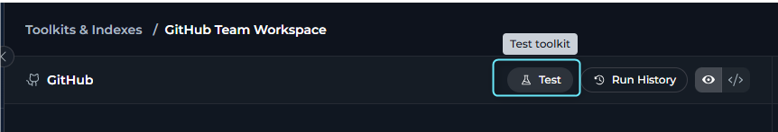

## Overview

Testing toolkit tools is an essential step in the toolkit configuration workflow, enabling you to:

* **Verify Credentials**: Confirm that authentication credentials are correctly configured
* **Validate Tool Functionality**: Test individual tools with real parameters
* **Debug Tool Behavior**: Understand how tools respond to different inputs
* **Review Run Results**: Inspect the returned output in the Results panel
* **Adjust Model Settings**: Change the selected model and its settings before running the test

---

## Test Page

The toolkit test feature is a dedicated full-page interface, separate from the toolkit configuration page.

To access the Test page:

1. Go to **Toolkits & Indexes** from the main navigation
2. Click on a configured toolkit from the list to open its detail page
3. In the action bar on the left panel, click the **Test** button
   
4. The Test page opens with a two-panel layout:
   - **Left panel**: Test Settings for selecting tools, configuring parameters, and choosing models
   - **Right panel**: Results showing test execution output

   

<Info>
- The Test button is disabled if you have unsaved changes. Save your changes first to enable testing.

- The Test page includes breadcrumb navigation at the top, showing: **Toolkits & Indexes** > **[Toolkit Name]** > **Test**. Click any breadcrumb to navigate back.
</Info>

---

## Test a Toolkit Tool

The Test page uses a two-panel layout with Test Settings on the left and Results on the right.

**Test Settings Panel (Left):**

1. **Select a tool**
   - **Empty state**: When no tool is selected, the panel displays a "Test toolkit" message with a **Select Tool** button
   - Click **Select Tool** to open a searchable popover dropdown listing the toolkit's available tools
   - The dropdown includes a search field: "Search tools..."

   

2. **Configure tool parameters**
   - After selecting a tool, the panel displays:
     - **Tool** dropdown: Shows the selected tool (can be changed using the dropdown with search)
     - **Model** selector: Choose from models available in the current project (default project model is selected automatically)
     - **Tool-specific parameter fields**: Rendered from the tool's schema with default values pre-populated when available

    

3. **Select a model and adjust settings**
   - Use the **Model** selector to choose from models available in the current project
   - Click **Model Settings** (gear icon) to open the settings dialog and adjust model behavior

   

    <Tabs>
        <Tab title="Reasoning-capable models">
            | Setting | Description |
            |---|---|
            | **Reasoning** | Controls the model reasoning effort |
            | **Max Completion Tokens** | Sets the maximum output token limit; validation is applied against the selected model maximum output tokens |
            | **Capabilities** | Shows whether the model supports reasoning or vision |
            
        </Tab>
        <Tab title="Standard models">
            | Setting | Description |
            |---|---|
            | **Creativity** | Controls response creativity for non-reasoning models |
            | **Max Completion Tokens** | Sets the maximum output token limit; validation is applied against the selected model maximum output tokens |
            | **Capabilities** | Shows whether the model supports reasoning or vision |
            
        </Tab>
    </Tabs>

4. **Provide required parameters and run the test**
   - Fill in the input fields rendered from the tool's schema (default values are pre-populated when available)
   - The **Run Test** button at the bottom of the left panel stays disabled until:
     - All required inputs are valid
     - No MCP PAT authentication is required (or it's configured)
   - Click **Run Test** (with send icon) to execute the tool
   - During execution, the button is disabled and shows a loading state

   <video controls>
     <source src="../../img/how-tos/credentials-toolkits/test-toolkit-tools/toolkit-tool-test.mp4" type="video/mp4"/>
   </video>

**Results Panel (Right):**

The right panel displays test execution results in a chat-style format:

- **Initial state**: Empty when no tests have been run
- **Chat-style message list**: Displays all test run results in chronological order
- **Execution details**: For each tool run, you can see:
  - **Execution status and time**: Summary line showing success (✅) or failure (❌) and duration, e.g., `✅ tool_name (0.523s)`
  - **Request body**: The input parameters sent to the tool
  - **Response body**: The raw output returned by the tool, rendered as formatted JSON or text
  - **Copy support**: Copy any message or response body from the results
- **Persistent history**: The results panel keeps all run history visible while you stay on the Test page
- **Auto-scroll**: New results automatically scroll into view

<Note>
**Testing Index-Related Tools**

Index-related tools are handled outside the main toolkit test tool list. Use the **[Indexes interface](../indexing/using-indexes-tab-interface)** for index creation, reindexing, search, and other index-specific operations.
</Note>

<Info title="Run History">
Toolkit test runs are also available through the toolkit **[Run History](../credentials-toolkits/toolkit_history_tab)** page. Click the **Run History** button on the toolkit Configuration tab to open the full history view.
</Info>

---

## Test Tools vs. Use in Agents

Understanding the differences between testing tools and using them in agents helps set appropriate expectations:

| Aspect | Tool Testing | Agent Usage |
|--------|--------------|-------------|
| **Execution context** | You select the tool and provide its parameters in the Test Settings panel | The agent decides when to call tools during a conversation |
| **Parameter source** | Entered directly in the Test Settings panel | Derived from the conversation context |
| **Result view** | Shown in the Results panel (right side) | Shown in the agent conversation |
| **Execution flow** | Focused on a single selected toolkit tool | May involve multiple tools and additional reasoning steps |
| **History** | Available in the Results panel and from the toolkit Run History page | Available in the agent conversation history |
| **Interface** | Dedicated full-page Test interface with two panels | Agent conversation interface |

**Key takeaway**: Toolkit testing is the direct way to validate a specific tool configuration before using that toolkit in agents, pipelines, or chat workflows.

---

## Troubleshooting

<Accordion title="Test Button is Disabled on Configuration Tab">
**Problem**: The **Test** button in the Configuration tab action bar is disabled and shows "Save your changes to test" tooltip.

**Solutions:**

* **Save your changes first**: The Test button is disabled when there are unsaved changes to the toolkit configuration.
* **Click the Save button**: Save all pending changes in the Configuration tab.
* **Then click Test**: After saving, the Test button becomes enabled and navigates to the Test page.
</Accordion>

<Accordion title="Authentication Errors">
**Problem**: The tool run fails because the external service rejects authentication.

**Solutions:**

* **Verify the toolkit credential**: Confirm the toolkit is using the correct credential configuration.
* **Check external permissions**: Ensure the credential has access to the requested operation.
* **Update expired secrets**: Replace expired tokens, API keys, or other authentication values.
</Accordion>

<Accordion title="Parameter Validation Errors">
**Problem**: The selected tool cannot be run because the input is incomplete or invalid.

**Solutions:**

* **Complete required fields**: The **Run Test** button at the bottom of the Test Settings panel stays disabled until all required fields are valid.
* **Check input types**: Match the field values to the schema-driven input type shown in the form.
* **Review object and array inputs carefully**: Complex fields must match the expected structure.
</Accordion>

<Accordion title="Tool Not Available in the List">
**Problem**: The tool you expect to test does not appear in the **Select Tool** dropdown.

**Solutions:**

* **Check selected tools**: The test list is built from the toolkit's enabled or available tools.
* **Save toolkit changes**: If you changed tool selection, save the toolkit configuration first.
* **Navigate back to Test**: Click the Test button again to see the updated tool list.
* **Remember index tools are excluded**: Use the **Indexes** interface for index-related operations.
</Accordion>

<Accordion title="Model Configuration Issues">
**Problem**: The selected model or model settings prevent the run from starting.

**Solutions:**

* **Select another project model**: The model list comes from models available in the current project.
* **Review max token validation**: The Model Settings dialog validates max tokens against the selected model's maximum output tokens.
* **Apply settings before running**: Changes in the settings dialog take effect after you click **Apply**.
</Accordion>

<Accordion title="PAT Required for MCP Toolkit Testing">
**Problem**: The Run Test button is disabled and shows "PAT authentication required" tooltip.

**Solutions:**

* **Complete the required PAT setup**: The Run Test button is disabled when internal MCP PAT validation fails.
* **Check MCP authentication status**: Review the MCP authentication banner that appears at the top of the Test page for MCP toolkits.
* **Retry after authentication is configured**: Once the required authentication is available, the Run Test button becomes enabled.
</Accordion>

<Accordion title="Cannot Change Tool or Parameters While Test is Running">
**Problem**: The Tool dropdown and parameter fields are disabled during test execution.

**Solutions:**

* **Wait for the current test to complete**: All input controls are disabled while a test is running.
* **Review the Results panel**: The right panel shows the progress and results of the running test.
* **Configure the next test after completion**: Once the test finishes, all controls become enabled again.
</Accordion>

---

## Best Practices

<Accordion title="Before Production Use">
1. **Test the exact tools you enabled**: Validate the same toolkit tools you plan to expose to users or agents.
2. **Run tests after configuration changes**: Re-test after updating credentials, tool selection, or model settings.
3. **Save configuration before testing**: The Test button is only available when there are no unsaved changes.
4. **Use Run History**: Review previous runs from the toolkit **Run History** page when comparing behavior over time.
</Accordion>

<Accordion title="Parameter Testing Strategy">
1. **Start with the schema-driven defaults**: The Test Settings panel initializes default values when the tool schema provides them.
2. **Validate required inputs first**: Make the form valid before experimenting with optional fields (Run Test button is disabled until all required fields are valid).
3. **Change one variable at a time**: Adjust parameters or model settings incrementally so result differences are easier to interpret.
4. **Review results in the right panel**: The Results panel keeps the full test history visible while you configure and run additional tests.
</Accordion>

<Accordion title="Model Selection Strategy">
1. **Choose a project model that fits the task**: The Test page uses the same project model inventory available throughout the application.
2. **Use model settings intentionally**: Reasoning-capable models expose reasoning controls, while standard models expose creativity controls.
3. **Keep max tokens within the model limit**: The Model Settings dialog validates this before allowing the settings to be applied.
</Accordion>

<Accordion title="Use the Right Interface for the Right Tool">
1. **Use the Test page for non-index toolkit tools**: Access via the Test button on the Configuration tab.
2. **Use the Indexes interface for index operations**: Index-related tools are handled separately from the main tool selector.
3. **Use Run History for past executions**: Open the toolkit history page via the Run History button on the Configuration tab.
4. **Use breadcrumbs for navigation**: Click breadcrumbs at the top to navigate back to Toolkits & Indexes or the toolkit Configuration tab.
</Accordion>

---

<Info title="Related Resources">
For more information on toolkit configuration and usage:

* **[Toolkits Menu](../../menus/toolkits)**—Complete guide to toolkit management and configuration
* **[Indexing Overview](../indexing/indexing-overview)**—Learn about indexing tools and data processing
* **[Toolkit Run History](../credentials-toolkits/toolkit_history_tab)**—View past toolkit test runs
</Info>

---
