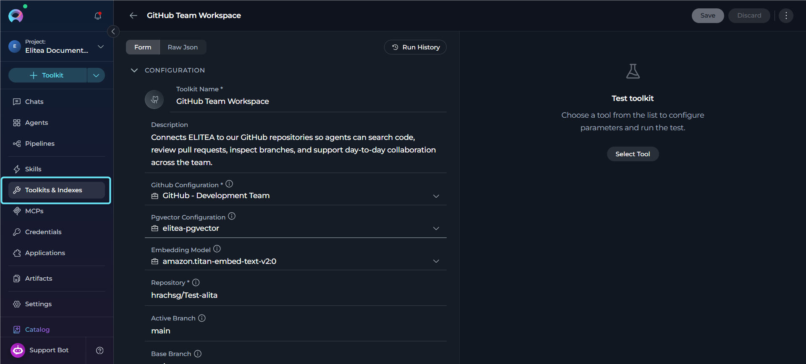
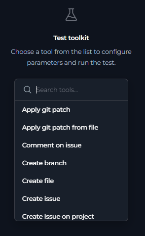
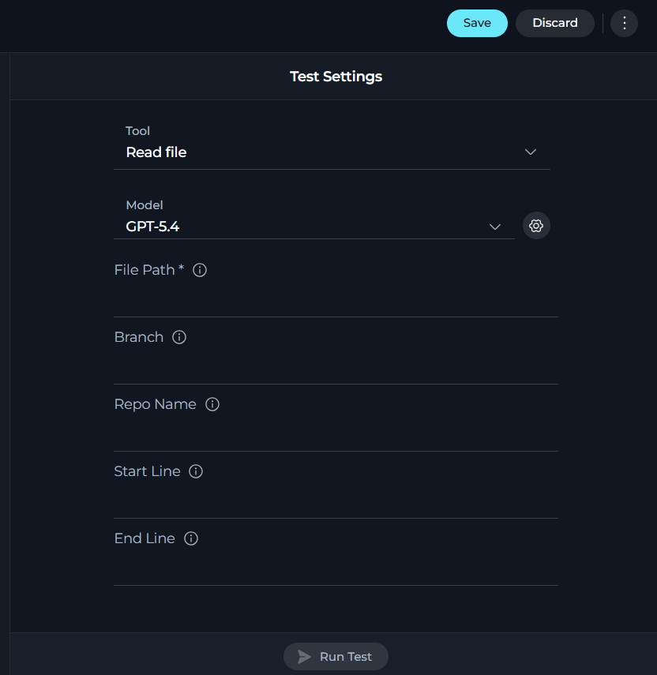
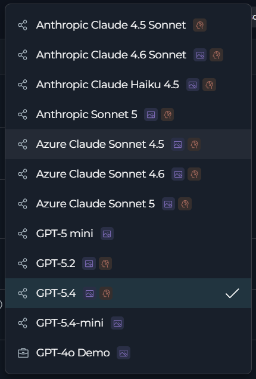

## Overview

Testing toolkit tools is an essential step in the toolkit configuration workflow, enabling you to:

* **Verify Credentials**: Confirm that authentication credentials are correctly configured
* **Validate Tool Functionality**: Test individual tools with real parameters
* **Debug Tool Behavior**: Understand how tools respond to different inputs
* **Review Run Results**: Inspect the returned output in the built-in results panel
* **Adjust Model Settings**: Change the selected model and its settings before running the test

---

## Access the Test Settings Panel

The toolkit detail page includes a built-in testing area on the right side of the page.

To access the Test Settings panel:

1. Go to **Toolkits** from the main navigation.
2. Click on any configured toolkit from the list.
3. Open the toolkit detail page. The right panel opens in a testing flow with these states:
   * **Empty state** before a tool is selected
   * **Test Settings** after a tool is selected
   * **Run Results** after a test is started

   

---

## Test a Toolkit Tool

Follow this workflow to test any tool from your configured toolkit:

1. **Select a tool.**
   In the empty state, click **Select Tool**. This opens a searchable dropdown listing the toolkit's available or selected tools.

   

2. **Review the displayed fields.**
   The panel switches to **Test Settings** and displays the tool-specific parameter fields and the LLM **Model** selector.

   

3. **Select a model and adjust settings.**
   Use the **Model** selector to choose from models available in the current project. The default project model is selected automatically. To adjust model behavior, click **Model Settings** to open the settings dialog.

   

    <Tabs>
        <Tab title="Reasoning-capable models">
            | Setting | Description |
            |---|---|
            | **Reasoning** | Controls the model reasoning effort |
            | **Max Completion Tokens** | Sets the maximum output token limit; validation is applied against the selected model maximum output tokens |
            | **Capabilities** | Shows whether the model supports reasoning or vision |
            
        </Tab>
        <Tab title="Standard models">
            | Setting | Description |
            |---|---|
            | **Creativity** | Controls response creativity for non-reasoning models |
            | **Max Completion Tokens** | Sets the maximum output token limit; validation is applied against the selected model maximum output tokens |
            | **Capabilities** | Shows whether the model supports reasoning or vision |
            
        </Tab>
    </Tabs>

4. **Provide required parameters.**
   Fill in the input fields rendered from the tool's schema. Default values are pre-populated when the schema provides them. The **Run Test** button stays disabled until all required inputs are valid — click it to start the run and switch to **Run Results**.

   <video controls>
     <source src="../../img/how-tos/credentials-toolkits/test-toolkit-tools/toolkit-tool-test.mp4" type="video/mp4"/>
   </video>

<Info title="Testing Index-Related Tools">
Index-related tools are handled outside the main toolkit test tool list. Use the **[Indexes interface](../indexing/using-indexes-tab-interface)** for index creation, reindexing, search, and other index-specific operations.
</Info>

---

### Understand Test Results

The **Run Results** view shows the full execution output for each tool run. For each tool action you can see:

* **Execution status and time**—a summary line at the top of each result shows whether the action succeeded (✅) or failed (❌) and how long it took, for example `✅ tool_name (0.523s)`
* **Request body**—the input parameters sent to the tool
* **Response body**—the raw output returned by the tool, rendered as formatted JSON or text depending on the tool response format
* **Copy support**—copy any message or response body from the results for use elsewhere

<video controls>
  <source src="../../img/how-tos/credentials-toolkits/test-toolkit-tools/review-result.mp4" type="video/mp4"/>
</video>

The results panel keeps the current run history in the chat-style view while you stay on the page.

Use the **back button** in the **Run Results** header to return to **Test Settings** and configure another run.

<Info title="Session-Based History">
Toolkit test runs are also available through the toolkit **[Run History](../credentials-toolkits/toolkit_history_tab)** page. Use the **Run History** button on the toolkit detail page to open the full history view.
</Info>

---

## Test Tools vs. Use in Agents

Understanding the differences between testing tools and using them in agents helps set appropriate expectations:

| Aspect | Tool Testing | Agent Usage |
|--------|--------------|-------------|
| **Execution context** | You select the tool and provide its parameters in **Test Settings** | The agent decides when to call tools during a conversation |
| **Parameter source** | Entered directly in the toolkit test form | Derived from the conversation context |
| **Result view** | Shown in the toolkit **Run Results** panel | Shown in the agent conversation |
| **Execution flow** | Focused on a selected toolkit tool | May involve multiple tools and additional reasoning steps |
| **History** | Available from the toolkit **Run History** page | Available in the agent conversation history |

**Key takeaway**: Toolkit testing is the direct way to validate a specific tool configuration before using that toolkit in agents, pipelines, or chat workflows.

---

## Troubleshooting

<Accordion title="Authentication Errors">
**Problem**: The tool run fails because the external service rejects authentication.

**Solutions:**

* **Verify the toolkit credential**: Confirm the toolkit is using the correct credential configuration.
* **Check external permissions**: Ensure the credential has access to the requested operation.
* **Update expired secrets**: Replace expired tokens, API keys, or other authentication values.
</Accordion>

<Accordion title="Parameter Validation Errors">
**Problem**: The selected tool cannot be run because the input is incomplete or invalid.

**Solutions:**

* **Complete required fields**: The **Run Test** button stays disabled until the form is valid.
* **Check input types**: Match the field values to the schema-driven input type shown in the form.
* **Review object and array inputs carefully**: Complex fields must match the expected structure.
</Accordion>

<Accordion title="Tool Not Available in the List">
**Problem**: The tool you expect to test does not appear in the **Select Tool** dropdown.

**Solutions:**

* **Check selected tools**: The test list is built from the toolkit enabled or available tools.
* **Save toolkit changes**: If you changed tool selection, save the toolkit and reopen the detail page.
* **Remember index tools are excluded**: Use the **Indexes** interface for index-related operations.
</Accordion>

<Accordion title="Model Configuration Issues">
**Problem**: The selected model or model settings prevent the run from starting.

**Solutions:**

* **Select another project model**: The model list comes from models available in the current project.
* **Review max token validation**: The settings dialog validates max tokens against the selected model maximum output tokens.
* **Apply settings before running**: Changes in the settings dialog take effect after you click **Apply**.
</Accordion>

<Accordion title="PAT Required for MCP Toolkit Testing">
**Problem**: The run button is disabled because the toolkit requires MCP authentication.

**Solutions:**

* **Complete the required PAT setup**: The UI blocks the run when internal MCP PAT validation fails.
* **Retry after authentication is configured**: Once the required authentication is available, run the test again.
</Accordion>

---

## Best Practices

<Accordion title="Before Production Use">
1. **Test the exact tools you enabled**: Validate the same toolkit tools you plan to expose to users or agents.
2. **Run tests after configuration changes**: Re-test after updating credentials, tool selection, or model settings.
3. **Use Run History**: Review previous runs from the toolkit **Run History** page when comparing behavior over time.
</Accordion>

<Accordion title="Parameter Testing Strategy">
1. **Start with the schema-driven defaults**: The form initializes default values when the tool schema provides them.
2. **Validate required inputs first**: Make the form valid before experimenting with optional fields.
3. **Change one variable at a time**: Adjust parameters or model settings incrementally so result differences are easier to interpret.
4. **Use the back button between runs**: Return from **Run Results** to **Test Settings** to refine the next run.
</Accordion>

<Accordion title="Model Selection Strategy">
1. **Choose a project model that fits the task**: The toolkit test panel uses the same project model inventory available in the UI.
2. **Use model settings intentionally**: Reasoning-capable models expose reasoning controls, while standard models expose creativity controls.
3. **Keep max tokens within the model limit**: The settings dialog validates this before allowing the settings to be applied.
</Accordion>

<Accordion title="Use the Right Interface for the Right Tool">
1. **Use Test Settings for non-index toolkit tools**: This is the main built-in test flow on the toolkit detail page.
2. **Use the Indexes interface for index operations**: Index-related tools are handled separately from the main tool selector.
3. **Use Run History for past executions**: Open the toolkit history page when you need to review earlier runs outside the current panel state.
</Accordion>

---

<Info title="Related Resources">
For more information on toolkit configuration and usage:

* **[Toolkits Menu](../../menus/toolkits)**—Complete guide to toolkit management and configuration
* **[Indexing Overview](../indexing/indexing-overview)**—Learn about indexing tools and data processing
* **[Toolkit Run History](../credentials-toolkits/toolkit_history_tab)**—View past toolkit test runs
</Info>

---
