## Introduction

The ability to manage authentication credentials centrally within ELITEA offers significant benefits:

<CardGroup cols={2}>
  <Card title="Enhanced Security" icon="shield-check">
    Store sensitive authentication information like API keys, tokens, and passwords securely using ELITEA's credential management system.
  </Card>
  <Card title="Centralized Management" icon="layer-group">
    Manage authentication details for various external services from a single location within ELITEA, simplifying administration and improving visibility.
  </Card>
  <Card title="Reusability" icon="arrows-rotate">
    Create reusable credentials that can be easily applied to multiple Agent toolkits, saving time and effort.
  </Card>
  <Card title="Flexibility" icon="sliders">
    Configure credentials at different levels (personal or project-specific) to meet various security and access requirements.
  </Card>
</CardGroup>

The sections below cover how to create and manage Credentials, along with best practices and practical use cases to help you effectively leverage this feature.

**Workspace Types**

ELITEA organizes work into two distinct types of spaces. Credentials are scoped to the space where they are created — understanding this distinction is essential for managing access correctly.

<CardGroup cols={2}>
  <Card title="Private Workspace" icon="user">
    Your personal area within ELITEA. You have exclusive access to all content you create here — Chats, Agents, Prompts, Datasources, Collections, Artifacts, and Credentials.
  </Card>
  <Card title="Team Project" icon="users">
    A collaborative space shared with team members. All members can access the project's shared content, including Chats, Agents, Prompts, Datasources, Collections, Artifacts, and Credentials.
  </Card>
</CardGroup>

## Credentials Overview

The **Credentials** menu is where you store authentication details for external services — API keys, tokens, usernames, passwords — so your toolkits can connect to those services without requiring sensitive information to be entered repeatedly. Credentials are scoped to the workspace or project where they are created and can be reused across any compatible toolkit within that scope.

**Key capabilities:**

* **Centralized Authentication Management:** The Credentials menu provides a single point of control for managing authentication details for various external services.
* **Reusable Configurations:** Once a credential is configured, it can be reused across multiple toolkits within the **same project** or your **Private** workspace.
* **Private and Project Level Credentials:** You can create credentials within your **Private** workspace for personal use or within **Team** projects for shared access among project members.
* **Secure Storage:** ELITEA securely stores sensitive information such as API keys, tokens, and passwords, with the option to use **[Secrets](../../menus/settings/secrets)** for enhanced security.

### Supported Platforms

ELITEA supports credentials for 27 external services. Select a platform to jump to its setup instructions.

<CardGroup cols={4}>
  <Card title="ADO (Azure DevOps)" icon="microsoft" href="#ado-azure-devops-credential-setup">
    Microsoft Azure DevOps
  </Card>
  <Card title="Bitbucket" icon="bitbucket" href="#bitbucket-credential-setup">
    Git repository hosting
  </Card>
  <Card title="Carrier" icon="tower-broadcast" href="#carrier-credential-setup">
    Communication services, messaging
  </Card>
  <Card title="Confluence" icon="confluence" href="#confluence-credential-setup">
    Atlassian knowledge management
  </Card>
  <Card title="Figma" icon="figma" href="#figma-credential-setup">
    Design collaboration platform
  </Card>
  <Card title="GitHub" icon="github" href="#github-credential-setup">
    Git repository hosting
  </Card>
  <Card title="GitLab" icon="gitlab" href="#gitlab-credential-setup">
    Git repository and DevOps platform
  </Card>
  <Card title="Google Places" icon="location-dot" href="#google-places-credential-setup">
    Location services and mapping APIs
  </Card>
  <Card title="Jira" icon="jira" href="#jira-credential-setup">
    Atlassian project management
  </Card>
  <Card title="Langfuse" icon="chart-line" href="#langfuse-credential-setup">
    LLM observability and tracing
  </Card>
  <Card title="OpenAPI" icon="code" href="#openapi-credential-setup">
    Custom REST API integrations
  </Card>
  <Card title="Postman" icon="paper-plane" href="#postman-credential-setup">
    API development platform
  </Card>
  <Card title="QTest" icon="vial" href="#qtest-credential-setup">
    Test management platform
  </Card>
  <Card title="Rally" icon="bullseye" href="#rally-credential-setup">
    Agile project management
  </Card>
  <Card title="Report Portal" icon="chart-column" href="#report-portal-credential-setup">
    Test reporting and analytics
  </Card>
  <Card title="Salesforce" icon="cloud" href="#salesforce-credential-setup">
    CRM platform
  </Card>
  <Card title="ServiceNow" icon="headset" href="#servicenow-credential-setup">
    IT service management
  </Card>
  <Card title="SharePoint" icon="microsoft" href="#sharepoint-credential-setup">
    Document management and collaboration
  </Card>
  <Card title="Slack" icon="slack" href="#slack-credential-setup">
    Team communication platform
  </Card>
  <Card title="Sonar" icon="shield-halved" href="#sonar-credential-setup">
    Code quality and security analysis
  </Card>
  <Card title="SQL" icon="database" href="#sql-credential-setup">
    Database connections
  </Card>
  <Card title="TestIO" icon="users" href="#testio-credential-setup">
    Crowdsourced testing platform
  </Card>
  <Card title="TestRail" icon="clipboard-list" href="#testrail-credential-setup">
    Test case management
  </Card>
  <Card title="Xray" icon="bolt-lightning" href="#xray-credential-setup">
    Test management for Jira (Cloud)
  </Card>
  <Card title="Zephyr Enterprise" icon="wind" href="#zephyr-enterprise-credential-setup">
    Enterprise test management
  </Card>
  <Card title="Zephyr Essential" icon="wind" href="#zephyr-essential-credential-setup">
    Essential test management
  </Card>
  <Card title="Zephyr Scale" icon="wind" href="#zephyr-scale-credential-setup">
    Test management for Jira
  </Card>
</CardGroup>

### Accessing the Credentials Menu

1. Log in to ELITEA.
2. Navigate to either your **Private** workspace or the specific **Team** project where you want to configure credentials.
3. Click on **Credentials** in the main navigation menu.
4. Click the **+ Create** button.
5. A dialog will appear prompting you to **Select Credential Type**. Choose the service you want to create credentials for (e.g., Confluence, GitHub, Jira, Slack).
6. You will be presented with a configuration form specific to the selected credential type. Follow the detailed steps below for each service.

     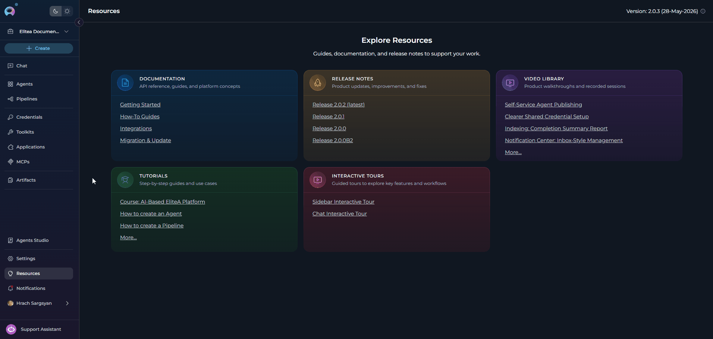

Configure the credential parameters including name and authentication details, then click **Save** to create the credential. After saving, the newly created credential will be added to your **Credentials** dashboard, making it available for selection when configuring toolkits. You can manage your saved credentials directly from the dashboard. Click on a credential to edit its details, set it as default, or delete it if it's no longer needed.

### Scope and Security

* **Private Credentials:** Created in your **Private** workspace — accessible only to you.
* **Project Credentials:** Created within a **Team** project — accessible to all project members.
* **Accuracy matters:** Incorrect credentials will cause toolkit connections to fail. Verify that your tokens, keys, or passwords are valid and have the permissions required for the intended operations.
* **Use Secrets (recommended):** For any sensitive field (API key, token, password), reference a pre-configured secret from the **[Secrets](../../menus/settings/secrets)** section instead of entering the value directly. This keeps sensitive data out of configuration forms and makes rotation easier.
* **Manual entry:** Acceptable for temporary setups or testing when Secrets are not yet available.

## Using Secrets in Credentials

Instead of typing sensitive values (API keys, tokens, passwords) directly into credential fields, ELITEA lets you reference a pre-stored **Secret** — keeping sensitive data out of configuration forms and making credential rotation easier.

### Prerequisites

Before referencing a secret in a credential, create the secret in the **Settings → Secrets** section:

1. Click the **Settings** icon in the main navigation sidebar.
2. Select **Secrets** from the left navigation drawer.
3. Click the **+** button to add a new secret.
4. Enter a unique **Name** (letters, numbers, and underscores only — e.g., `github_pat_token`) and the **Value** (the actual sensitive string).
5. Click the **✓** checkmark to save.

<Info>
Secrets are scoped to the project where they are created. Make sure you create the secret in the same project (or Private workspace) where the credential will be used.
</Info>

For full details on creating and managing secrets, see the **[Secrets documentation](../../menus/settings/secrets)**.

### Referencing a Secret in a Credential Field

When filling in any sensitive field in a credential form (such as **Token**, **API Key**, **Password**, **Client Secret**), you can select a secret instead of entering the value manually:

1. Click on the sensitive field — a dropdown will appear listing available secrets from the current project or workspace.
2. To use an existing secret, select it from the list. The field will display the secret name (e.g., `github_pat_token`) instead of the actual value.
3. To create a new secret, click **+ New Secret** at the top of the dropdown — you will be redirected to the **Settings → Secrets** page. Create the secret there, then navigate back to the credential form. Click the **Refresh** icon to reload the secrets list, then select your newly created secret from the dropdown.
4. Complete the remaining credential fields and click **Save**.

     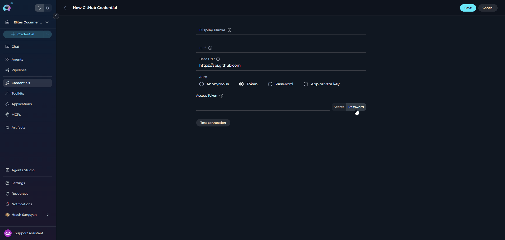

<Tip title="Why Use Secrets?">
* **Security:** The raw value is never stored in the credential form — only a reference to the secret.
* **Easy rotation:** Update the secret value once in Settings → Secrets and all credentials referencing it pick up the change automatically.
* **Auditability:** Secret access and changes are tracked separately from credential configuration.
</Tip>

## Supported Credential Types and Setup Guides

Below are the supported credential types in ELITEA, with step-by-step instructions for each:

### ADO (Azure DevOps) Credential Setup

To create an **ADO (Azure DevOps)** credential:

**Step-by-step Instructions:**

1. Click **+ Create** in the Credentials menu.
2. Select **ADO** as the credential type.
3. **Configure Credential Details:**

    | Field | Description | Example |
    |-------|-------------|---------|
    | **Display Name** | Enter a descriptive name for this credential | `ADO - Project Management` |
    | **ID** | Unique identifier for the credential | Auto-populated from the Display Name |
    | **Organization URL** | Your Azure DevOps organization URL | `https://dev.azure.com/yourorg` |
    | **Token** | Your ADO Personal Access Token (PAT), or select a secret | `pat_abc123...` |

4. **Test Connection:** Click **Test Connection** to verify that ELITEA can connect to Azure DevOps using the provided credentials.
5. **Save Credential:** Click **Save** to create the credential.

     

### Bitbucket Credential Setup

To create a **Bitbucket** credential:

**Step-by-step Instructions:**

1. Click **+ Create** in the Credentials menu.
2. Select **Bitbucket** as the credential type.
3. **Configure Credential Details:**

    | Field | Description | Example |
    |-------|-------------|---------|
    | **Display Name** | Enter a descriptive name for this credential | `Bitbucket - Repository Access` |
    | **ID** | Unique identifier for the credential | Auto-populated from the Display Name |
    | **URL** | Your Bitbucket instance URL | `https://bitbucket.org` |
    | **Username** | Your Bitbucket username | `john.doe` |
    | **Password** | Your Bitbucket password or app password | `••••••••` |

4. **Test Connection:** Click **Test Connection** to verify that ELITEA can connect to Bitbucket using the provided credentials.
5. **Save Credential:** Click **Save** to create the credential.

     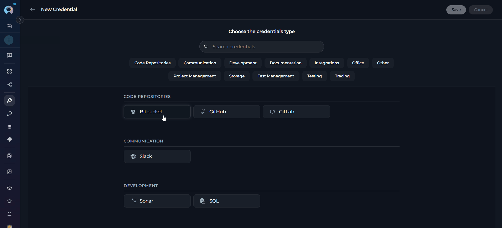

### Confluence Credential Setup

To create a **Confluence** credential:

1. Click **+ Create** in the Credentials menu.
2. Select **Confluence** as the credential type.
3. Configure the common fields and choose your authentication method:

| Field | Description | Example |
|-------|-------------|---------|
| **Display Name** | Enter a descriptive name for this credential | `Confluence - Knowledge Base` |
| **ID** | Unique identifier for the credential | Auto-populated from the Display Name |
| **Hosting** | Hosting type — `Auto` (default), `Cloud`, or `Server` | `Auto` |
| **Base URL** | URL of your Confluence instance | `https://yourcompany.atlassian.net/wiki` |

<Tabs>
  <Tab title="Basic">

**Used for:** Cloud (API token) or Server/Data Center (Personal Access Token) with username.

| Field | Description | Example |
|-------|-------------|---------|
| **Username** | Your username or email | `user@example.com` |
| **API Key / Token** | API token (Cloud) or PAT (Server/DC) | `ATATT3x...` |

4. **Test Connection:** Click **Test Connection** to verify the connection.
5. **Save Credential:** Click **Save** to create the credential.

  </Tab>
  <Tab title="Bearer">

**Used for:** Server/Data Center with a Personal Access Token sent as a Bearer header.

| Field | Description | Example |
|-------|-------------|---------|
| **Token** | Your Personal Access Token | `NjIyOD...` |

4. **Test Connection:** Click **Test Connection** to verify the connection.
5. **Save Credential:** Click **Save** to create the credential.

  </Tab>
</Tabs>

     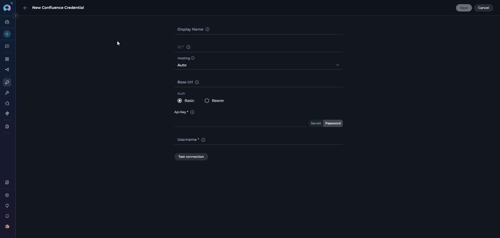

### Figma Credential Setup

To create a **Figma** credential:

**Step-by-step Instructions:**

1. Click **+ Create** in the Credentials menu.
2. Select **Figma** as the credential type.
3. **Configure Credential Details:**

    | Field | Description | Example |
    |-------|-------------|---------|
    | **Display Name** | Enter a descriptive name for this credential | `Figma - Design Assets` |
    | **ID** | Unique identifier for the credential | Auto-populated from the Display Name |
    | **Token** | Your Figma Personal Access Token (generate at **Figma → Settings → Security → Personal access tokens**) | `figd_abc123...` |

4. **Test Connection:** Click **Test Connection** to verify that ELITEA can connect to Figma using the provided credentials.
5. **Save Credential:** Click **Save** to create the credential.

     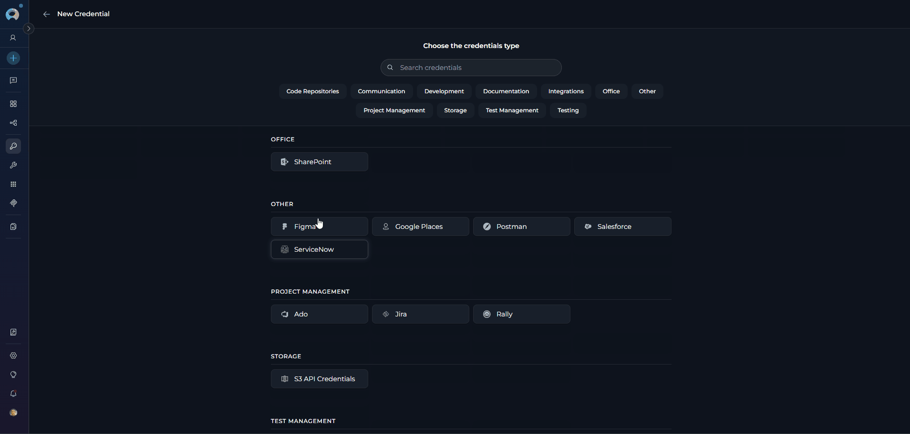

### GitHub Credential Setup

To create a **GitHub** credential:

1. Click **+ Create** in the Credentials menu.
2. Select **GitHub** as the credential type.
3. Configure the common fields and choose your authentication method:

| Field | Description | Example |
|-------|-------------|---------|
| **Display Name** | Enter a descriptive name for this credential | `GitHub - Project Repository` |
| **ID** | Unique identifier for the credential | Auto-populated from the Display Name |
| **Base URL** | GitHub API base URL. Leave blank for GitHub.com; set for GitHub Enterprise Server | `https://ghe.company.com/api/v3` |

<Tabs>
  <Tab title="Token">

**Used for:** Personal Access Token (PAT) authentication — the most common method for GitHub.com and GitHub Enterprise.

| Field | Description | Example |
|-------|-------------|---------|
| **Access Token** | GitHub Personal Access Token | `ghp_abc123...` |

4. **Test Connection:** Click **Test Connection** to verify the connection.
5. **Save Credential:** Click **Save** to create the credential.

  </Tab>
  <Tab title="Password">

**Used for:** Username and password authentication (legacy — not recommended for GitHub.com; may apply to GitHub Enterprise Server).

| Field | Description | Example |
|-------|-------------|---------|
| **Username** | GitHub username | `john.doe` |
| **Password** | GitHub password | `••••••••` |

4. **Test Connection:** Click **Test Connection** to verify the connection.
5. **Save Credential:** Click **Save** to create the credential.

  </Tab>
  <Tab title="App Private Key">

**Used for:** GitHub App authentication using a private key — suitable for organization-level automation.

| Field | Description | Example |
|-------|-------------|---------|
| **App ID** | GitHub App ID | `123456` |
| **App Private Key** | GitHub App private key in PEM format | `-----BEGIN RSA...` |

4. **Test Connection:** Click **Test Connection** to verify the connection.
5. **Save Credential:** Click **Save** to create the credential.

  </Tab>
  <Tab title="Anonymous">

**Used for:** Public GitHub repositories that do not require authentication. No additional fields are required.

4. **Save Credential:** Click **Save** to create the credential.

  </Tab>
</Tabs>

     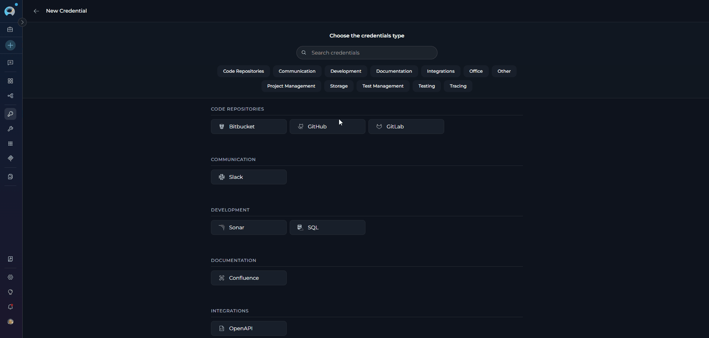

<Info title="GitHub.com vs GitHub Enterprise (Endpoints)">
When configuring GitHub credentials, the Base URL depends on whether you use GitHub.com or a self‑hosted GitHub Enterprise Server (GHES).

| API | Enterprise | GitHub.com |
| --- | --- | --- |
| v3 (REST) | `https://[YOUR_HOST]/api/v3` | `https://api.github.com` |
| v4 (GraphQL) | `https://[YOUR_HOST]/api/graphql` | `https://api.github.com/graphql` |

- For **GitHub.com**: Leave the Base URL blank to use the default `https://api.github.com`.
- For **GitHub Enterprise Server**: Set the Base URL to your REST v3 endpoint (example: `https://ghe.company.com/api/v3`). GraphQL requests use `https://ghe.company.com/api/graphql`.
- Ensure your token scopes match your use case (e.g., `repo`, `workflow`, `read:org`) and that your GHES certificate is trusted by your environment.
</Info>

### GitLab Credential Setup

To create a **GitLab** credential:

**Step-by-step Instructions:**

1. Click **+ Create** in the Credentials menu.
2. Select **GitLab** as the credential type.
3. **Configure Credential Details:**

    | Field | Description | Example |
    |-------|-------------|---------|
    | **Display Name** | Enter a descriptive name for this credential | `GitLab - Development` |
    | **ID** | Unique identifier for the credential | Auto-populated from the Display Name |
    | **URL** | URL of your GitLab instance | `https://gitlab.com` |
    | **Private Token** | Your GitLab Personal Access Token | `glpat-abc123...` |

4. **Test Connection:** Click **Test Connection** to verify that ELITEA can connect to GitLab using the provided credentials.
5. **Save Credential:** Click **Save** to create the credential.

     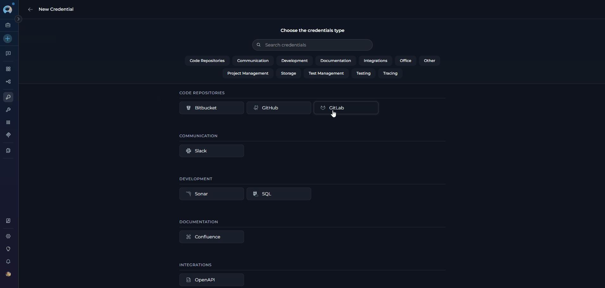

### Jira Credential Setup

To create a **Jira** credential:

1. Click **+ Create** in the Credentials menu.
2. Select **Jira** as the credential type.
3. Configure the common fields and choose your authentication method:

| Field | Description | Example |
|-------|-------------|---------|
| **Display Name** | Enter a descriptive name for this credential | `Jira - Project Management` |
| **ID** | Unique identifier for the credential | Auto-populated from the Display Name |
| **Hosting** | Hosting type — `Auto` (default), `Cloud`, or `Server` | `Auto` |
| **Base URL** | URL of your Jira instance | `https://yourcompany.atlassian.net` |

<Tabs>
  <Tab title="Basic">

**Used for:** Cloud (API token) or Server/Data Center (Personal Access Token) with username.

| Field | Description | Example |
|-------|-------------|---------|
| **Username** | Your username or email | `user@example.com` |
| **API Key / Token** | API token (Cloud) or PAT (Server/DC) | `ATATT3x...` |

4. **Test Connection:** Click **Test Connection** to verify the connection.
5. **Save Credential:** Click **Save** to create the credential.

  </Tab>
  <Tab title="Bearer">

**Used for:** Server/Data Center with a Personal Access Token sent as a Bearer header.

| Field | Description | Example |
|-------|-------------|---------|
| **Token** | Your Personal Access Token | `NjIyOD...` |

4. **Test Connection:** Click **Test Connection** to verify the connection.
5. **Save Credential:** Click **Save** to create the credential.

  </Tab>
</Tabs>

     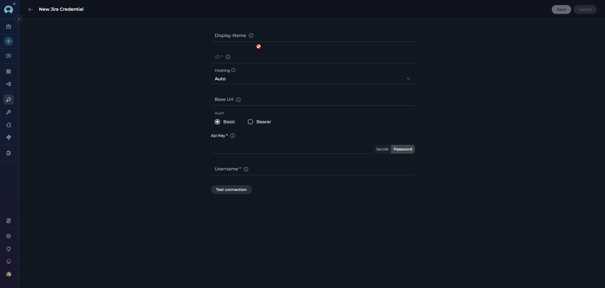

### Postman Credential Setup

To create a **Postman** credential:

**Step-by-step Instructions:**

1. Click **+ Create** in the Credentials menu.
2. Select **Postman** as the credential type.
3. **Configure Credential Details:**

    | Field | Description | Example |
    |-------|-------------|---------|
    | **Display Name** | Enter a descriptive name for this credential | `Postman - API Collections` |
    | **ID** | Unique identifier for the credential | Auto-populated from the Display Name |
    | **Base URL** | Postman API base URL | `https://api.getpostman.com` |
    | **Workspace ID** | Your default Postman workspace ID | `abc12345-xxxx-xxxx-xxxx-xxxxxxxxxxxx` |
    | **API Key** | Your Postman API key | `PMAK-abc123...` |

4. **Test Connection:** Click **Test Connection** to verify that ELITEA can connect to Postman using the provided credentials.
5. **Save Credential:** Click **Save** to create the credential.

     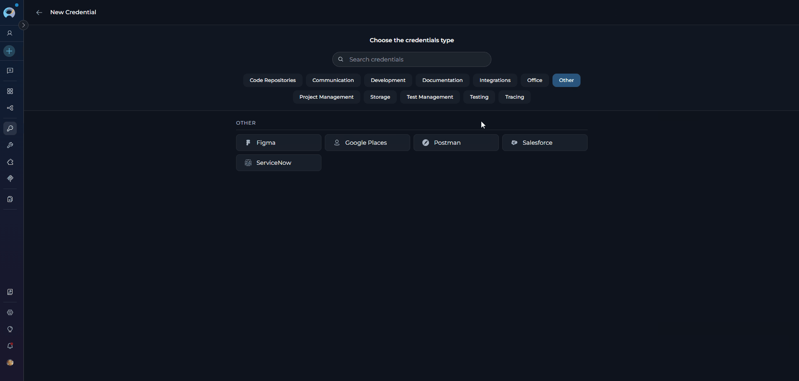

### QTest Credential Setup

To create a **QTest** credential:

**Step-by-step Instructions:**

1. Click **+ Create** in the Credentials menu.
2. Select **QTest** as the credential type.
3. **Configure Credential Details:**

    | Field | Description | Example |
    |-------|-------------|---------|
    | **Display Name** | Enter a descriptive name for this credential | `QTest - Quality Management` |
    | **ID** | Unique identifier for the credential | Auto-populated from the Display Name |
    | **Base URL** | URL of your QTest instance | `https://yourcompany.qtestnet.com` |
    | **API Token** | Your QTest API token | `eyJhbGci...` |

4. **Test Connection:** Click **Test Connection** to verify that ELITEA can connect to QTest using the provided credentials.
5. **Save Credential:** Click **Save** to create the credential.

     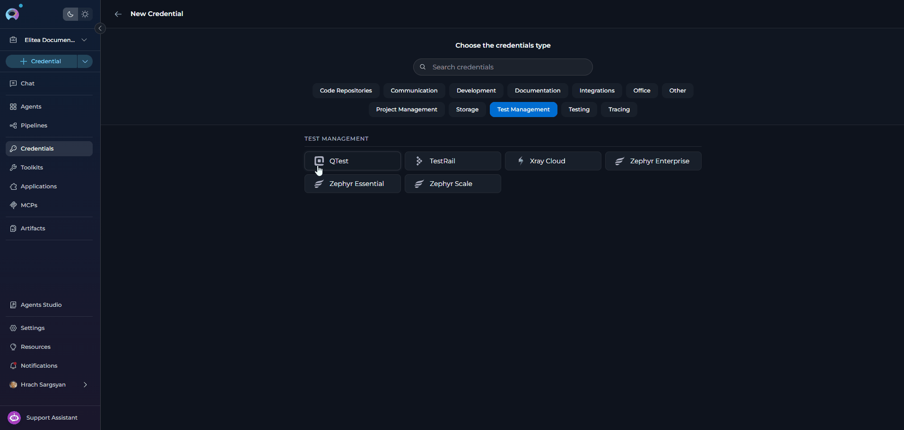

### Rally Credential Setup

To create a **Rally** credential:

**Step-by-step Instructions:**

1. Click **+ Create** in the Credentials menu.
2. Select **Rally** as the credential type.
3. **Configure Credential Details:**

    | Field | Description | Example |
    |-------|-------------|---------|
    | **Display Name** | Enter a descriptive name for this credential | `Rally - Agile Management` |
    | **ID** | Unique identifier for the credential | Auto-populated from the Display Name |
    | **Server** | Your Rally server URL | `https://rally1.rallydev.com` |
    | **Username** | Your Rally username *(Password auth)* | `user@example.com` |
    | **Password** | Your Rally password *(Password auth)* | `••••••••` |
    | **API Key** | Your Rally API key *(API Key auth)* | `_abc123...` |

4. **Save Credential:** Click **Save** to create the credential.

     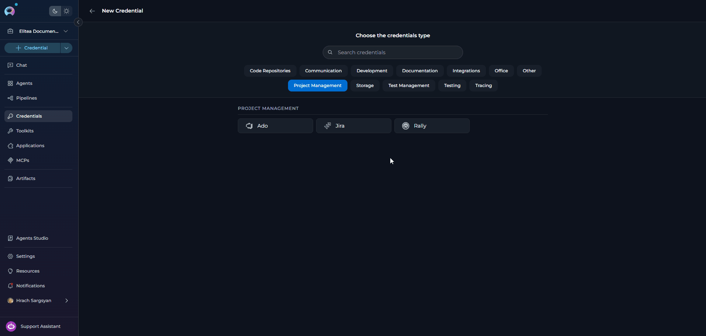

### ServiceNow Credential Setup

To create a **ServiceNow** credential:

**Step-by-step Instructions:**

1. Click **+ Create** in the Credentials menu.
2. Select **ServiceNow** as the credential type.
3. **Configure Credential Details:**

    | Field | Description | Example |
    |-------|-------------|---------|
    | **Display Name** | Enter a descriptive name for this credential | `ServiceNow - IT Service Management` |
    | **ID** | Unique identifier for the credential | Auto-populated from the Display Name |
    | **Base URL** | URL of your ServiceNow instance | `https://yourinstance.service-now.com` |
    | **Username** | Your ServiceNow username | `admin` |
    | **Password** | Your ServiceNow password | `••••••••` |

4. **Save Credential:** Click **Save** to create the credential.

     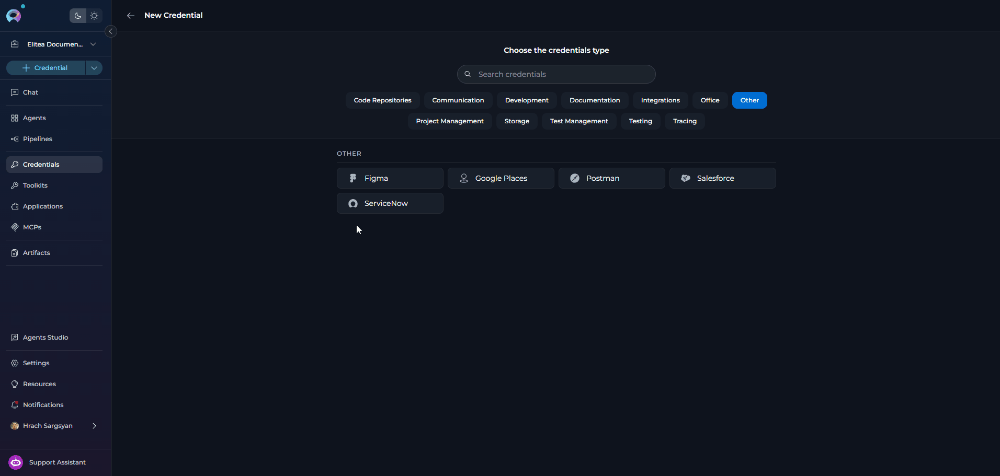

### Slack Credential Setup

To create a **Slack** credential:

**Step-by-step Instructions:**

1. Click **+ Create** in the Credentials menu.
2. Select **Slack** as the credential type.
3. **Configure Credential Details:**

    | Field | Description | Example |
    |-------|-------------|---------|
    | **Display Name** | Enter a descriptive name for this credential | `Slack - Team Communication` |
    | **ID** | Unique identifier for the credential | Auto-populated from the Display Name |
    | **Slack Token** | Your Slack Bot Token or User Token (starts with `xoxb-` or `xoxp-`) | `xoxb-123456...` |
    | **Name** | Slack workspace name *(optional)* | `my-workspace` |
    | **Channel ID** | Default channel ID *(optional)* | `C01234ABCDE` |

4. **Save Credential:** Click **Save** to create the credential.

     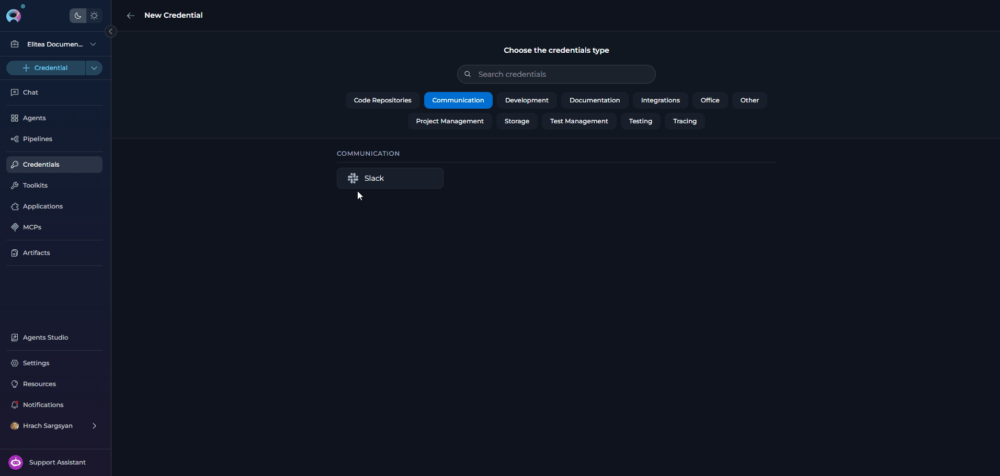

### TestRail Credential Setup

To create a **TestRail** credential:

**Step-by-step Instructions:**

1. Click **+ Create** in the Credentials menu.
2. Select **TestRail** as the credential type.
3. **Configure Credential Details:**

    | Field | Description | Example |
    |-------|-------------|---------|
    | **Display Name** | Enter a descriptive name for this credential | `TestRail - Test Management` |
    | **ID** | Unique identifier for the credential | Auto-populated from the Display Name |
    | **URL** | URL of your TestRail instance | `https://yourcompany.testrail.net` |
    | **Email** | Your TestRail account email | `user@example.com` |
    | **Password** | Your TestRail account password | `••••••••` |

4. **Test Connection:** Click **Test Connection** to verify that ELITEA can connect to TestRail using the provided credentials.
5. **Save Credential:** Click **Save** to create the credential.

     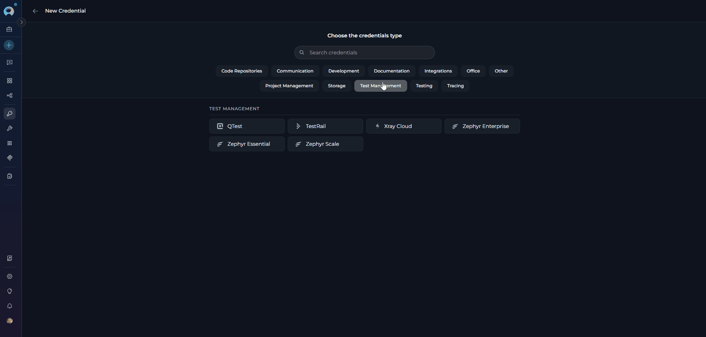

### Xray Credential Setup

To create an **Xray** credential:

**Step-by-step Instructions:**

1. Click **+ Create** in the Credentials menu.
2. Select **Xray** as the credential type.
3. **Configure Credential Details:**

    | Field | Description | Example |
    |-------|-------------|---------|
    | **Display Name** | Enter a descriptive name for this credential | `Xray - Test Automation` |
    | **ID** | Unique identifier for the credential | Auto-populated from the Display Name |
    | **Base URL** | URL of your Xray Cloud instance | `https://xray.cloud.getxray.app` |
    | **Client ID** | Your Xray Cloud Client ID | `abc123...` |
    | **Client Secret** | Your Xray Cloud Client Secret | `••••••••` |

4. **Test Connection:** Click **Test Connection** to verify that ELITEA can connect to Xray using the provided credentials.
5. **Save Credential:** Click **Save** to create the credential.

     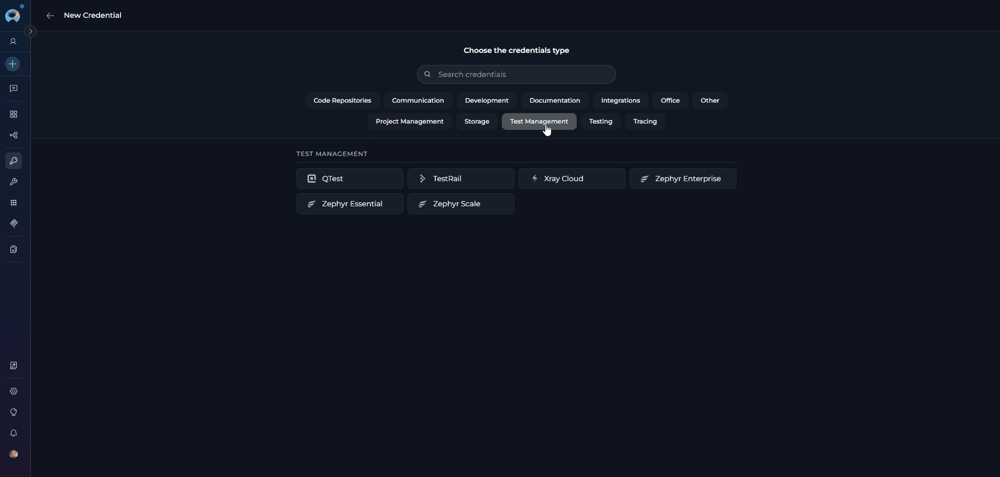

### Zephyr Enterprise Credential Setup

To create a **Zephyr Enterprise** credential:

**Step-by-step Instructions:**

1. Click **+ Create** in the Credentials menu.
2. Select **Zephyr Enterprise** as the credential type.
3. **Configure Credential Details:**

    | Field | Description | Example |
    |-------|-------------|---------|
    | **Display Name** | Enter a descriptive name for this credential | `Zephyr Enterprise - Test Management` |
    | **ID** | Unique identifier for the credential | Auto-populated from the Display Name |
    | **Base URL** | URL of your Zephyr Enterprise instance | `https://zephyr.yourcompany.com` |
    | **Token** | Your Zephyr Enterprise API token | `eyJhbGci...` |

4. **Test Connection:** Click **Test Connection** to verify that ELITEA can connect to Zephyr Enterprise using the provided credentials.
5. **Save Credential:** Click **Save** to create the credential.

     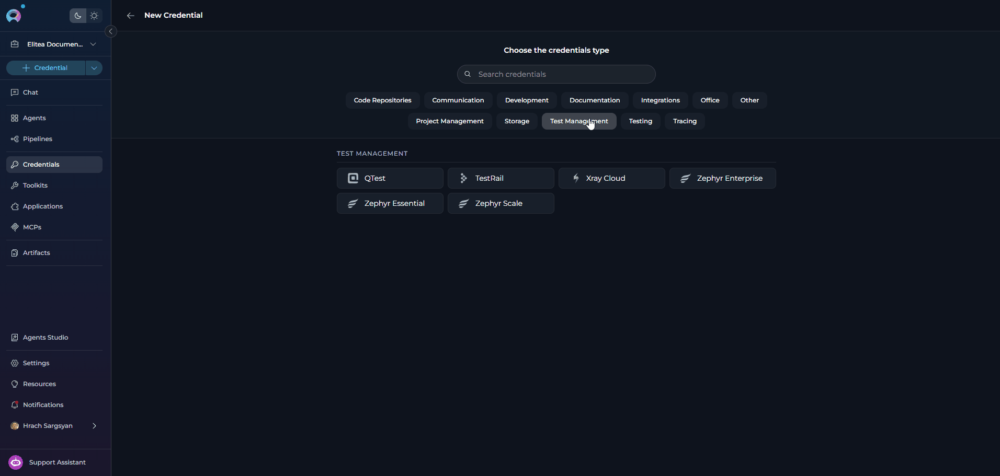

### Zephyr Scale Credential Setup

To create a **Zephyr Scale** credential:

**Step-by-step Instructions:**

1. Click **+ Create** in the Credentials menu.
2. Select **Zephyr Scale** as the credential type.
3. **Configure Credential Details:**

    | Field | Description | Example |
    |-------|-------------|---------|
    | **Display Name** | Enter a descriptive name for this credential | `Zephyr Scale - Test Planning` |
    | **ID** | Unique identifier for the credential | Auto-populated from the Display Name |
    | **Base URL** | URL of your Zephyr Scale instance | `https://yourcompany.atlassian.net` |
    | **Token** | Your Zephyr Scale API token *(Token auth)* | `eyJhbGci...` |
    | **Username** | Your username *(Username/Password auth)* | `user@example.com` |
    | **Password** | Your password *(Username/Password auth)* | `••••••••` |
    | **Cookies** | Authentication cookies *(Cookies auth)* | `session=abc123...` |

4. **Save Credential:** Click **Save** to create the credential.

     

---

### Carrier Credential Setup

To create a **Carrier** credential:

**Step-by-step Instructions:**

1. Click **+ Create** in the Credentials menu.
2. Select **Carrier** as the credential type.
3. **Configure Credential Details:**

    | Field | Description | Example |
    |-------|-------------|---------|
    | **Display Name** | Enter a descriptive name for this credential | `Carrier - Communication Service` |
    | **ID** | Unique identifier for the credential | Auto-populated from the Display Name |
    | **Organization** | Your Carrier organization name | `my-organization` |
    | **URL** | Carrier service endpoint URL | `https://carrier.yourcompany.com` |
    | **Private Token** | Your Carrier platform private token | `abc123...` |

4. **Save Credential:** Click **Save** to create the credential.

     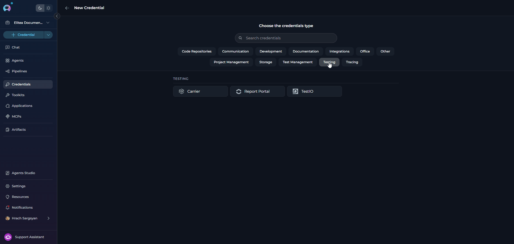

---

### Google Places Credential Setup

To create a **Google Places** credential:

**Step-by-step Instructions:**

1. Click **+ Create** in the Credentials menu.
2. Select **Google Places** as the credential type.
3. **Configure Credential Details:**

    | Field | Description | Example |
    |-------|-------------|---------|
    | **Display Name** | Enter a descriptive name for this credential | `Google Places - Location Services` |
    | **ID** | Unique identifier for the credential | Auto-populated from the Display Name |
    | **API Key** | Your Google Places API key | `AIzaSy...` |

4. **Save Credential:** Click **Save** to create the credential.

     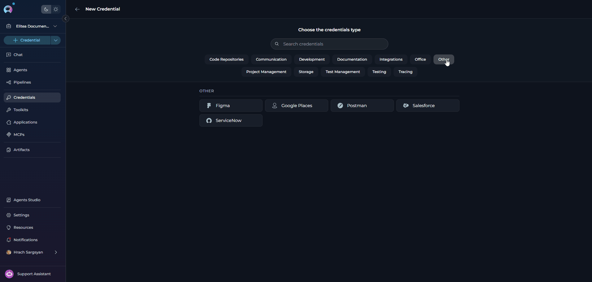

---

### Report Portal Credential Setup

To create a **Report Portal** credential:

**Step-by-step Instructions:**

1. Click **+ Create** in the Credentials menu.
2. Select **Report Portal** as the credential type.
3. **Configure Credential Details:**

    | Field | Description | Example |
    |-------|-------------|---------|
    | **Display Name** | Enter a descriptive name for this credential | `Report Portal - Test Analytics` |
    | **ID** | Unique identifier for the credential | Auto-populated from the Display Name |
    | **Project Name** | Your Report Portal project name | `my_project` |
    | **Endpoint URL** | URL of your Report Portal instance | `https://reportportal.yourcompany.com` |
    | **API Key** | Your Report Portal API key | `abc123...` |

4. **Test Connection:** Click **Test Connection** to verify that ELITEA can connect to Report Portal using the provided credentials.
5. **Save Credential:** Click **Save** to create the credential.

     

---

### Salesforce Credential Setup

To create a **Salesforce** credential:

**Step-by-step Instructions:**

1. Click **+ Create** in the Credentials menu.
2. Select **Salesforce** as the credential type.
3. **Configure Credential Details:**

    | Field | Description | Example |
    |-------|-------------|---------|
    | **Display Name** | Enter a descriptive name for this credential | `Salesforce - CRM Integration` |
    | **ID** | Unique identifier for the credential | Auto-populated from the Display Name |
    | **Base URL** | Your Salesforce instance URL | `https://your-domain.my.salesforce.com` |
    | **Client ID** | Consumer Key from your Connected App | `3MVG9...` |
    | **Client Secret** | Consumer Secret from your Connected App | `••••••••` |

4. **Save Credential:** Click **Save** to create the credential.

     

---

### SharePoint Credential Setup

To create a **SharePoint** credential:

1. Click **+ Create** in the Credentials menu.
2. Select **SharePoint** as the credential type.
3. Choose your authentication flow and configure the fields accordingly:

<Tabs>
  <Tab title="App Only">

**Step-by-step Instructions:**

Configure the following fields for application-level access using a client secret (no user context):

| Field | Description | Example |
|-------|-------------|---------|
| **Display Name** | Enter a descriptive name for this credential | `SharePoint - App Only` |
| **ID** | Unique identifier for the credential | Auto-populated from the Display Name |
| **Site URL** | Your SharePoint site URL | `https://yourcompany.sharepoint.com/sites/mysite` |
| **Client ID** | Application (Client) ID from Azure AD app registration | `xxxxxxxx-xxxx-xxxx-xxxx-xxxxxxxxxxxx` |
| **Client Secret** | Client secret value from Azure AD app registration | `••••••••` |

4. **Test Connection:** Click **Test Connection** to verify that ELITEA can connect to SharePoint using the provided credentials.
5. **Save Credential:** Click **Save** to create the credential.

     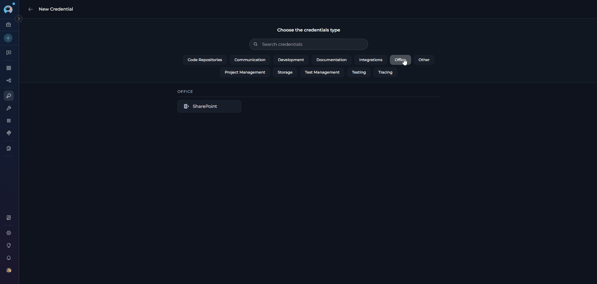

  </Tab>
  <Tab title="Delegated">

**Step-by-step Instructions:**

Configure the following fields for delegated access using OAuth2 on behalf of a user:

| Field | Description | Example |
|-------|-------------|---------|
| **Display Name** | Enter a descriptive name for this credential | `SharePoint - Delegated` |
| **ID** | Unique identifier for the credential | Auto-populated from the Display Name |
| **Site URL** | Your SharePoint site URL | `https://yourcompany.sharepoint.com/sites/mysite` |
| **Client ID** | Application (Client) ID from Azure AD app registration | `xxxxxxxx-xxxx-xxxx-xxxx-xxxxxxxxxxxx` |
| **Client Secret** | Client secret value from Azure AD app registration | `••••••••` |
| **OAuth Discovery Endpoint** | Azure AD authority endpoint | `https://login.microsoftonline.com/{tenant_id}` |
| **Scopes** | Space-separated OAuth2 permission scopes | `Sites.ReadWrite.All Files.ReadWrite.All Lists.ReadWrite.All` |

4. **Login:** Once the **OAuth Discovery Endpoint** field is filled in, a **Login** button appears next to the **Test Connection** button. Click **Login** to initiate the OAuth authorization flow — ELITEA redirects to Azure AD for user sign-in. After you authorize the application, the token is stored and the connection is verified.
5. **Save Credential:** Click **Save** to create the credential.

     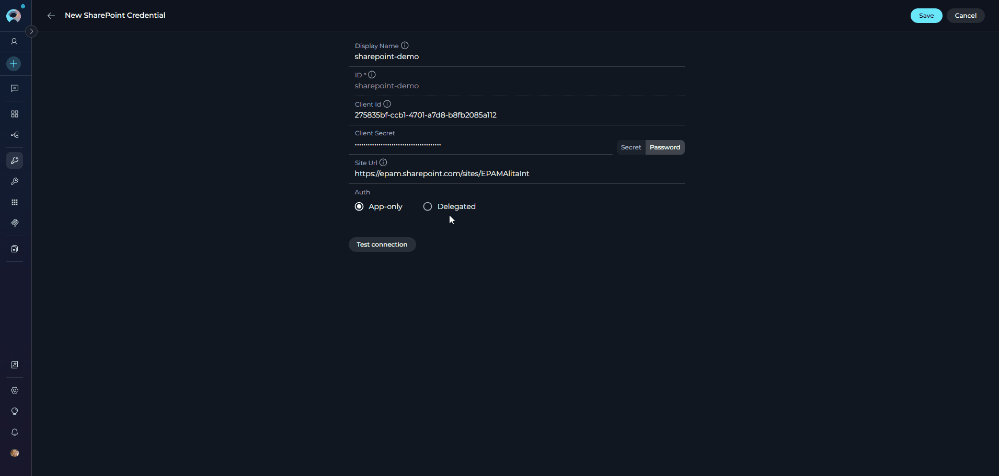

  </Tab>
</Tabs>

---

### Sonar Credential Setup

To create a **Sonar** credential:

**Step-by-step Instructions:**

1. Click **+ Create** in the Credentials menu.
2. Select **Sonar** as the credential type.
3. **Configure Credential Details:**

    | Field | Description | Example |
    |-------|-------------|---------|
    | **Display Name** | Enter a descriptive name for this credential | `Sonar - Code Quality` |
    | **ID** | Unique identifier for the credential | Auto-populated from the Display Name |
    | **URL** | URL of your SonarQube or SonarCloud instance | `https://sonarcloud.io` |
    | **Token** | Your SonarQube/SonarCloud API token | `squ_abc123...` |

4. **Save Credential:** Click **Save** to create the credential.

     

---

### SQL Credential Setup

To create a **SQL** credential:

**Step-by-step Instructions:**

1. Click **+ Create** in the Credentials menu.
2. Select **SQL** as the credential type.
3. **Configure Credential Details:**

    | Field | Description | Example |
    |-------|-------------|---------|
    | **Display Name** | Enter a descriptive name for this credential | `SQL - Production Database` |
    | **ID** | Unique identifier for the credential | Auto-populated from the Display Name |
    | **Host** | Database server hostname or IP address | `db.yourcompany.com` |
    | **Port** | Database port number | `5432` |
    | **Username** | Database username | `db_user` |
    | **Password** | Database password | `••••••••` |

4. **Save Credential:** Click **Save** to create the credential.

     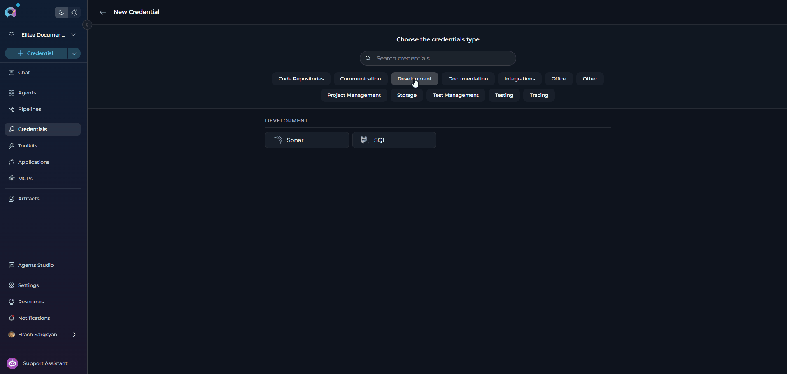

<Warning title="Database Security">
Ensure your database credentials have only the minimum permissions required for your intended operations.
</Warning>

---

### TestIO Credential Setup

To create a **TestIO** credential:

**Step-by-step Instructions:**

1. Click **+ Create** in the Credentials menu.
2. Select **TestIO** as the credential type.
3. **Configure Credential Details:**

    | Field | Description | Example |
    |-------|-------------|---------|
    | **Display Name** | Enter a descriptive name for this credential | `TestIO - Crowdsourced Testing` |
    | **ID** | Unique identifier for the credential | Auto-populated from the Display Name |
    | **Endpoint** | TestIO API endpoint URL | `https://app.test.io` |
    | **API Key** | Your TestIO platform API key | `abc123...` |

4. **Test Connection:** Click **Test Connection** to verify that ELITEA can connect to TestIO using the provided credentials.
5. **Save Credential:** Click **Save** to create the credential.

     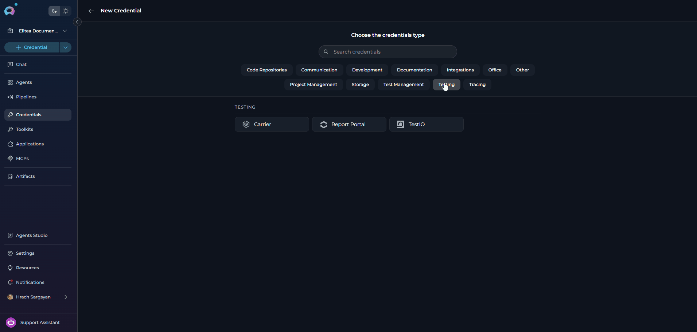

---

### Zephyr Essential Credential Setup

To create a **Zephyr Essential** credential:

**Step-by-step Instructions:**

1. Click **+ Create** in the Credentials menu.
2. Select **Zephyr Essential** as the credential type.
3. **Configure Credential Details:**

    | Field | Description | Example |
    |-------|-------------|---------|
    | **Display Name** | Enter a descriptive name for this credential | `Zephyr Essential - Test Management` |
    | **ID** | Unique identifier for the credential | Auto-populated from the Display Name |
    | **Base URL** | URL of your Zephyr Essential instance | `https://zephyr.yourcompany.com` |
    | **Token** | Your Zephyr Essential API token | `eyJhbGci...` |

4. **Test Connection:** Click **Test Connection** to verify that ELITEA can connect to Zephyr Essential using the provided credentials.
5. **Save Credential:** Click **Save** to create the credential.

     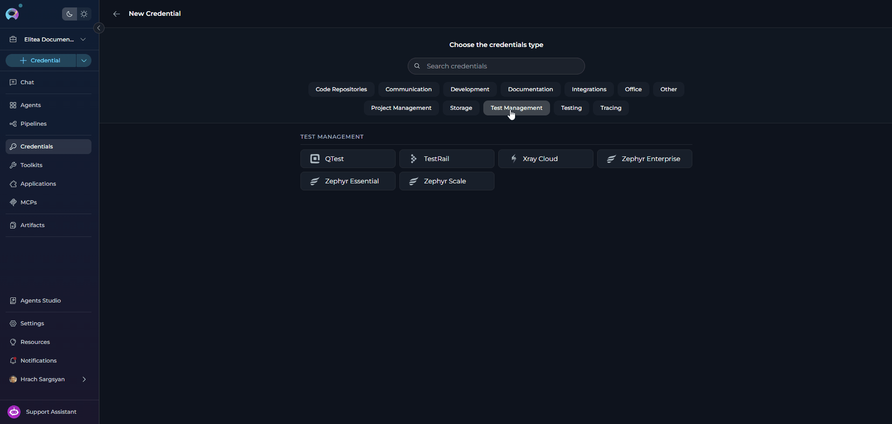

---

### OpenAPI Credential Setup

To create an **OpenAPI Configuration** credential (for connecting to any custom REST API described by an OpenAPI/Swagger spec):

1. Click **+ Create** in the Credentials menu.
2. Select **OpenAPI Configuration** as the credential type.
3. Enter a **Display Name** for this credential (e.g., `GitHub API - Production`).
4. Choose your authentication method and configure the fields accordingly:

<Tabs>
  <Tab title="Anonymous">

**Used for:** Public APIs that do not require authentication.

No additional fields are required. Leave all authentication fields empty — no authentication headers will be added to requests.

4. **Save Credential:** Click **Save** to create the credential.
  </Tab>
  <Tab title="API Key">

**Used for:** APIs that require an API key sent in a header (Bearer token, Basic auth, or a custom header).

| Field | Description | Example |
|-------|-------------|---------|
| **Api Key** | Your API key or token value | `sk-abc123...` |
| **Auth Type** | How to send the key — `Bearer` (default), `Basic`, or `Custom` | `Bearer` |
| **Custom Header Name** | Header name for the key *(required only when Auth Type is `Custom`)* | `X-API-Key` |

| Auth Type | Header sent to the API |
|-----------|------------------------|
| **Bearer** | `Authorization: Bearer <api_key>` |
| **Basic** | `Authorization: Basic <api_key>` |
| **Custom** | `<Custom Header Name>: <api_key>` |

4. **Save Credential:** Click **Save** to create the credential.

  </Tab>
  <Tab title="OAuth 2.0">

**Used for:** APIs that use OAuth 2.0 for authentication and authorization.

| Field | Required | Description | Example |
|-------|----------|-------------|---------|
| **client_id** | Yes | OAuth application client identifier from the API provider's developer console | `Iv1.a1b2c3d4e5f6g7h8` |
| **client_secret** | Yes | OAuth application client secret — confidential, never share this value | `ghp_1234567890abcdef...` |
| **token_url** | Yes | OAuth token endpoint where access tokens are obtained | `https://github.com/login/oauth/access_token` |
| **auth_url** | No | Authorization endpoint for user-interactive flows (authorization code). Leave empty for client credentials flow. | `https://github.com/login/oauth/authorize` |
| **scope** | No | Space-separated OAuth scopes (permissions). Leave empty for default scopes. | `repo:status write:org read:user` |
| **method** | No | How client credentials are sent to the token endpoint — `default` (POST body) or `Basic` (Authorization header) | `default` |

4. **Save Credential:** Click **Save** to create the credential.
  </Tab>
</Tabs>

     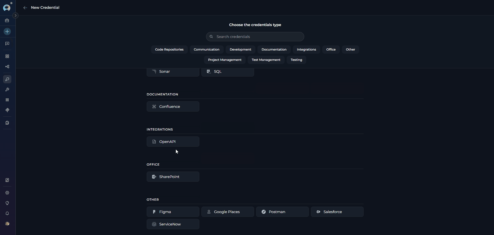

---

### Langfuse Credential Setup

To create a **Langfuse** credential (for LLM observability and tracing):

**Step-by-step Instructions:**

1. Click **+ Create** in the Credentials menu.
2. Select **Langfuse** as the credential type.
3. **Configure Credential Details:**

    | Field | Description | Example |
    |-------|-------------|---------|
    | **Display Name** | Enter a descriptive name for this credential | `Langfuse - LLM Tracing` |
    | **ID** | Unique identifier for the credential | Auto-populated from the Display Name |
    | **Base URL** | Langfuse instance URL | `https://cloud.langfuse.com` |
    | **Public Key** | Your Langfuse public API key (found in Langfuse project settings) | `pk-lf-abc123...` |
    | **Secret Key** | Your Langfuse secret API key | `sk-lf-abc123...` |

4. **Test Connection:** Click **Test Connection** to verify that ELITEA can connect to Langfuse using the provided credentials.
5. **Save Credential:** Click **Save** to create the credential.

     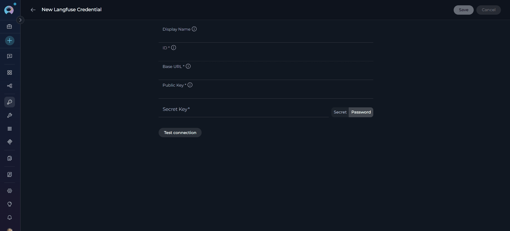

---

## Using Credentials in Toolkits

Once you have created credentials, you can assign them to toolkits to enable secure access to external services.

**How to Assign a Credential:**

1. When creating or editing a toolkit, locate the **configuration** dropdown.
2. Choose an existing credential from the list, or create a new one if needed.
3. Save your changes to apply the credential to your toolkit.

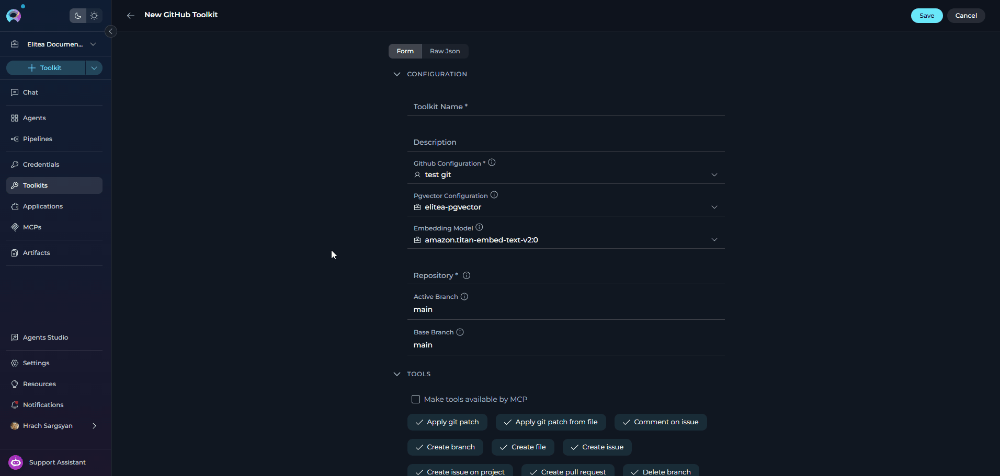

<Tip title="Best Practices">
* Use **project-scoped credentials** for team integrations and shared toolkits.
* Use **personal credentials** for individual agent tasks and private toolkits.
* Regularly rotate and update credentials to maintain security.
* Use Secrets for storing sensitive authentication information.
</Tip>

For more information on creating and managing Toolkits, see the [Toolkits documentation](../../menus/toolkits).

<Info title="Related Documentation">
For more detailed information, refer to:

- **[Credentials Menu](../../menus/credentials)** - Comprehensive guide to the Credentials interface and management
- **[Toolkits Menu](../../menus/toolkits)** - Learn how to integrate credentials with toolkits
- **[Secrets](../../menus/settings/secrets)** - Enhanced security through the Secrets management system
- **[Glossary](../../home/glossary)** - Definitions of key terms and concepts used in ELITEA
</Info>
