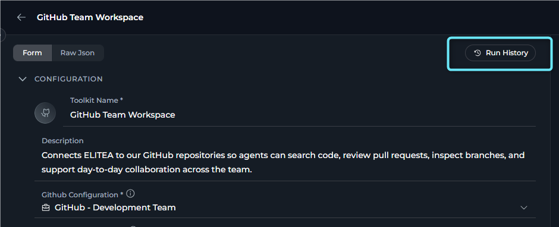
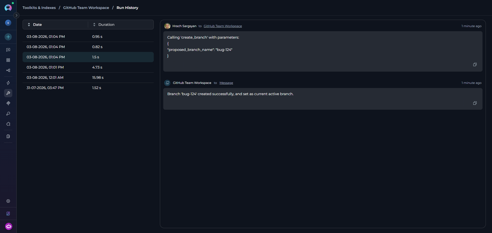
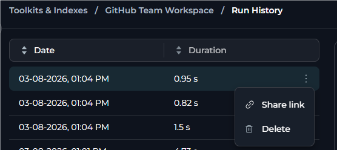

## Overview

The Run History panel serves as a valuable auditing and troubleshooting tool, allowing teams to:

- Monitor toolkit usage patterns and frequency
- Review past executions with full input/output details
- Troubleshoot failures by examining error messages
- Verify successful operations and their results
- Track toolkit performance over time

---

## Access Run History

1. Open the toolkit detail page.
2. Select **Run History** in the top-right corner of the **left panel**.
3. The dedicated **Run History** page for this toolkit opens. To return, use the breadcrumb at the top of the page.

     

---

## Run History View

The Run History page is a dedicated full-page view. At the top, it shows a breadcrumb—**Toolkits & Indexes / [toolkit name] / Run History**—where the "Toolkits & Indexes" and toolkit name links are clickable for navigation back. Below the breadcrumb is a **two-panel layout**: a left panel listing all past runs, and a right panel showing the selected conversation replay.

### Left Panel

The left panel displays a sortable list of all toolkit runs with the following columns:

| Column | Description |
|--------|-------------|
| **Date** | Execution date and time (format: `dd-MM-yyyy, hh:mm AM/PM`) |
| **Duration** | Cumulative time for all toolkit tools used in the conversation (e.g., `2m 34s`, `45s`) |

<Info title="Duration Calculation">
Duration represents the **cumulative time** for all toolkit tool executions within a single conversation. If multiple tools from the same toolkit were used (e.g., Index Data, Search Index, List Collections), the duration shows the total time for all of them.
</Info>

<Info title="No Version column">
The Version column is not shown for toolkits. Only Date and Duration are displayed.
</Info>

**Features:**

- **Sorting**: Select any column header to toggle sort order (ascending ↑ or descending ↓). Default: Date descending (most recent first)
- **Selection**: Select any row to view details in the right panel. The selected row is highlighted
- **Infinite scroll**: Scroll to the bottom to automatically load more entries
- **Three-dot menu (⋮)**: Each row has a context menu available on hover with [run actions](#run-actions)

### Right Panel

The right panel displays comprehensive execution details for the selected run in **read-only format**. You cannot interact with or modify the displayed conversation.

**Displayed Information:**

- **User Input**: Original queries or commands
- **Tool Execution**: Tool names and parameters passed
- **Tool Output**: Results and data returned
- **Error Messages**: Detailed error information with stack traces
- **Timestamps**: Timing information for each step

<Info title="Empty State">
When no run is selected, the right panel remains empty. Select a run from the left panel to view its details.
</Info>

### Run Actions

Each run row includes a **three-dot menu (⋮)** that appears on hover, with these actions:

| Action | Description |
|--------|-------------|
| **Sort** | Select the **Date** or **Duration** column header to toggle ascending and descending order. |
| **Share link** | Copies a direct URL to this specific run to the clipboard. Opening the link automatically navigates to the Run History panel and selects that run. |
| **Delete** | Permanently removes this run record. A confirmation dialog titled "Remove run?" appears before deletion. |

<Warning title="Permanent Deletion">
Deleting a run is permanent and cannot be undone. Confirm carefully before removing any run record.
</Warning>

<Info title="No Restore conversation">
The **Restore conversation** option is not available for Toolkits. It is only available for Agents and Pipelines.
</Info>

---

## View Run Details

Open Run History as described in [Access Run History](#access-run-history), then select any row in the left panel. The right panel loads the preserved conversation in read-only format, where you can scroll through the full execution flow, including the toolkit tools used in that run, the parameters passed to each tool, the returned results, and any errors with stack traces.

     <video src="../../img/how-tos/credentials-toolkits/toolkit-history/run-history-view.mp4" controls></video>
<Info title="Tracked Executions">
The Run History panel tracks toolkit runs from:

- **Test Settings** (right panel on the Configuration page): Tool executions performed interactively
- **Indexes Tab**: Index Data, Search Index, and other indexing operations

It does **not** track toolkit usage from:

- Chat conversations (when you use a toolkit in a regular chat)
- Agent or Pipeline executions (when a toolkit is used by an agent or pipeline)
</Info>

---

## Common Use Cases

<Accordion title="Debug a Failed Run">
**Scenario**: A toolkit operation produced unexpected results or failed to complete.

**Steps**:

1. Open the **Run History** page.
2. Find the failed run by date.
3. Select the run to view the execution details.
4. Review the details to identify:
   - What input triggered the issue
   - Which tool or tools failed
   - Any error messages or stack traces
   - Parameters that were passed
5. Use this information to fix the toolkit configuration or input parameters.
</Accordion>

<Accordion title="Optimize Performance">
**Scenario**: You want to optimize your toolkit's execution time.

**Steps**:

1. Open the **Run History** page.
2. Review the Duration column across multiple runs.
3. Select the **Duration** column header to sort by execution time.
4. Select the longest-running runs to see what operations were performed.
5. Optimize the toolkit based on the longest-running operations.
</Accordion>

<Accordion title="Verify Toolkit Changes">
**Scenario**: You updated your toolkit configuration and want to verify improvements.

**Steps**:

1. Make changes to your toolkit configuration.
2. Run the same test inputs before and after the changes using Test Settings.
3. Open the **Run History** page.
4. Compare runs before and after the changes.
5. Verify that the new configuration produces better results.
</Accordion>

<Accordion title="Audit & Compliance">
**Scenario**: You must provide evidence of what your toolkit processed.

**Steps**:

1. Open the **Run History** page.
2. Find the relevant run by date.
3. Review the complete execution details.
4. Use **Share link** from the ⋮ menu to save a direct URL to the run for documentation.
</Accordion>

<Accordion title="Learn & Train">
**Scenario**: You want to understand how your toolkit handles different inputs.

**Steps**:

1. Open the **Run History** page.
2. Review multiple runs in the list.
3. Study patterns in successful executions.
4. Identify common failure scenarios.
5. Use these insights to improve your toolkit's configuration or documentation.
</Accordion>

---

## Best Practices

<Accordion title="Regular Review">
- **Check history periodically**: Select the **Run History** button in the top-right of the left panel regularly to review toolkit runs and catch issues early.
- **Monitor trends**: Track execution duration and frequency patterns over time.
- **Performance baseline**: Establish expected duration ranges for different toolkit operations.
</Accordion>

<Accordion title="Debugging Workflow">
1. **Reproduce issues**: When a problem is reported, select the **Run History** button and find the specific run first.
2. **Analyze context**: Review input parameters and error messages in detail.
3. **Test fixes**: After fixing, execute the toolkit and compare results in Run History.
4. **Document findings**: Use **Share link** from the ⋮ menu to save a direct URL to key runs as documentation.
</Accordion>

<Accordion title="Data Management">
- **Clean old runs**: Periodically delete runs that are no longer needed.
- **Keep important runs**: Do not delete runs that serve as examples or reference cases.
- **Share critical runs**: Use the copy link feature to share important findings with your team.
</Accordion>

<Accordion title="Performance Monitoring">
- **Track duration trends**: Monitor if toolkit operations are getting slower over time.
- **Identify bottlenecks**: Use duration data to identify which tools need optimization.
- **Compare executions**: Review multiple runs to understand performance variations.
</Accordion>

<Accordion title="Security Considerations">
- **Sensitive data**: Be aware that all input parameters and results are stored in run history.
- **Access control**: Ensure only authorized users can access toolkits with sensitive data.
- **Retention policy**: Consider establishing a policy for how long to retain run history.
</Accordion>

---

## Troubleshooting

<Accordion title="Run History Panel Shows No Entries">
**Possible Causes:**

- No toolkit executions have been performed yet
- All previous runs have been deleted
- You are viewing a newly created toolkit

**Solution:**

1. Execute the toolkit from the **Test Settings** area (right panel on the Configuration page).
2. Go back to the toolkit detail page and re-open **Run History** to refresh.
3. If runs were deleted, they cannot be restored in the UI.
</Accordion>

<Accordion title="Cannot See Run Details in Right Panel">
**Possible Causes:**

- No run is selected
- Run data failed to load due to network issues
- Run details are still loading

**Solution:**

1. Select a run in the left panel.
2. Wait a moment for details to load.
3. If details do not appear, go back and re-open **Run History**.
4. Check your network connection.
5. Select a different run to verify functionality.
</Accordion>

<Accordion title="Copy Link Feature Not Working">
**Possible Causes:**

- Clipboard permissions not granted
- Browser security restrictions

**Solution:**

1. Ensure your browser has clipboard access permissions.
2. Hover over the run row to reveal the **⋮ (three-dot menu)** icon.
3. Select the icon and select **Share link**.
4. Check for the success toast notification confirming the link was copied.
5. If using private or incognito mode, check browser clipboard permissions.
</Accordion>

<Accordion title="Delete Option Not Appearing">
**Possible Causes:**

- Not hovering over the run row
- Insufficient permissions
- UI not fully loaded

**Solution:**

1. Hover your mouse over the run row to reveal the **⋮ (three-dot menu)** icon.
2. Wait briefly for the icon to appear on the right side of the row.
3. Select the icon and look for **Delete** in the menu.
4. Verify you have the necessary permissions to delete runs.
5. Refresh the page if the menu does not appear.
</Accordion>

<Accordion title="Runs Not Sorted Correctly">
**Possible Causes:**

- Unexpected sort direction after multiple selections
- Cached data display issue

**Solution:**

1. Select the column header once to sort ascending.
2. Select again to sort descending.
3. Look for the arrow indicator (↑/↓) showing the current sort direction.
4. Go back and re-open **Run History** if sorting appears broken.
5. Sort by a different column first, then switch back.
</Accordion>

---

<Info>
**Guides & References**

- [Creating & Managing Toolkits](../../menus/toolkits) - Learn how to create and configure toolkits
- [Testing Toolkits](./how-to-test-toolkit-tools) - Execute toolkit operations using Test Settings
</Info>
