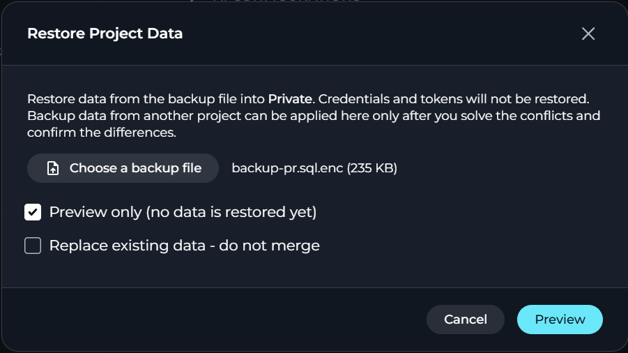
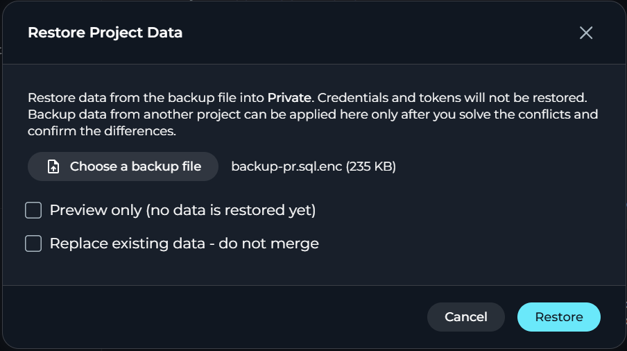
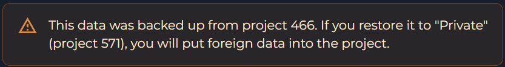
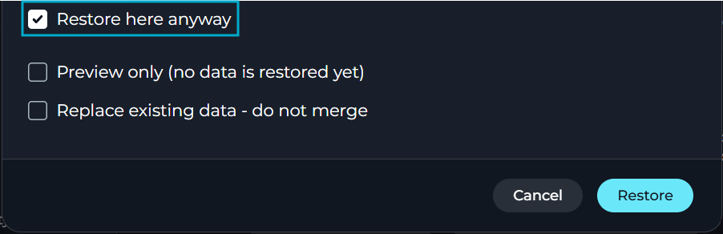

With ELITEA, you can preserve your project data by creating a backup.

You can back up agents, pipelines, toolkits, MCP servers and skills into a single file, and restore them later into the same project or, with confirmation, into a different project. ELITEA excludes credentials, tokens and other secrets from backup files, so you must reconfigure them after the restore.

<Callout icon="lightbulb" color="#a855f7" title="When to Back Up a Project">
Consider creating a backup before making large changes to your project.
</Callout>

## Back Up & Restore Settings

To create a backup file or restore data from a backup: 

1. Select **Settings** > **General**.
2. In **General**, expand **Back Up & Restore**.

**Back Up & Restore** shows two independent actions, **Create a Backup** and **Restore from the Backup**.

All ELITEA users see these actions for their private projects. For team projects, ELITEA shows them only to users who have the required permissions. You can request the permissions from your project administrator.

## Create a Backup

1. In **Back Up & Restore**, select **Create a Backup**.
2. Wait while ELITEA prepares the file. The button label changes to indicate that it is preparing the backup.
3. ELITEA downloads the backup as an encrypted SQL file.

<CardGroup cols={2}>
	<Card title="Included in the backup file" icon="check" color="#22c55e">
		- Agents
		- Skills
		- Pipelines
		- Toolkits
		- MCP servers
	</Card>
	<Card title="Excluded from the backup file" icon="circle-exclamation" color="#ef4444">
		- Credentials
		- Tokens
	</Card>
</CardGroup>

## Restore Data Into a Project

To restore data into a project:

1. In **Back Up & Restore**, select **Restore from the Backup**.
2. In the **Restore Project Data** dialog, select **Choose a backup file**, then select an *.sql* or *.enc* backup file.
3. Keep **Preview only (no data is restored yet)** selected, clear **Replace existing data - do not merge**, then select **Preview**.

   

4. Review the restore summary: the number of statements and rows, the tables affected, any skipped tables, and any columns that ELITEA dropped or filled because of differences between the backup and the current project structure.
5. Clear **Preview only (no data is restored yet)** and select **Restore**.

   

ELITEA merges the backup into the current data: it adds rows that are not yet in the project, updates matching rows and keeps rows that are not in the backup.

If the file belongs to a different project, ELITEA shows a warning and disables the submit action:

If you want to add the data from a different project, select **Restore here anyway**, then select **Preview** again or **Restore** (depending on whether you want to preview the changes first).

## Restore the Whole Project

To restore the whole project, you must create a new empty project or select a project whose data you are willing to overwrite.

<Warning>
When you select **Replace existing data - do not merge**, ELITEA deletes the current data in the project before it applies the backup. Any data not in the backup file is lost.
</Warning>

0. Create a new empty project.
1. In **Back Up & Restore**, select **Restore from the Backup**.
2. In the **Restore Project Data** dialog, select **Choose a backup file** and select an *.sql* or *.enc* backup file.
3. Select **Replace existing data - do not merge**.
4. Keep **Preview only (no data is restored yet)** selected and select **Preview** to review the restore summary, including the number of tables that will be truncated, before you commit to the change.
5. Clear **Preview only (no data is restored yet)** and select **Restore**.

## Best Practices

- Create a backup before you make large changes to a project.
- Preview a restore before you apply it. ELITEA selects **Preview only (no data is restored yet)** by default.
- Store backup files in a secure location. A backup file, together with the restore permission, is enough to load its data into a project.
- Reconfigure credentials, tokens and other secrets after every restore. ELITEA does not include them in a backup file.
- Confirm the source project before you select **Restore here anyway**. Restoring a backup from a different project mixes that project's data into the current one.

## Troubleshooting

<Accordion title="Issue: You do not see Back Up & Restore in General settings">
**Cause:** You do not have the required permissions for the project.

**Solution:** Ask a project administrator for the necessary permissions.
</Accordion>

<Accordion title="Issue: Create a Backup fails to download">
**Cause:** The download request failed.

**Solution:** ELITEA shows an error message describing the failure. Try the download again. If the issue continues, contact your project administrator.
</Accordion>

<Accordion title="Issue: The Restore button is disabled">
**Cause #1:** No backup file is selected.

**Solution #1:** Select a backup file. If the issue continues, contact your project administrator.

**Cause #2:** The selected file belongs to a different project and **Restore here anyway** is not selected.

**Solution #2:** Select another file, if you do not intend to restore data from another project. If you do intend to restore data from another project, select **Restore here anyway**.
</Accordion>

<Accordion title="Issue: ELITEA reports a project mismatch">
**Cause:** The backup file was created from a different project than the one you are restoring into.

**Solution:** Confirm you have the correct file for this project, or select **Restore here anyway** to bring that project's data into the current one.
</Accordion>

<Accordion title="Issue: Columns were dropped or filled during a restore">
**Cause:** The project structure changed between when ELITEA created the backup and when you restore it. ELITEA drops columns the current project no longer has, and leaves columns empty when the backup has no value for a column the current project requires.

**Solution:** Review the dropped and filled columns in the restore summary, then update the restored agents, pipelines, toolkits, MCP servers or skills as needed.
</Accordion>

<Info title="See Also">
See also:
- [General Settings](../../menus/settings/general.mdx)
</Info>
