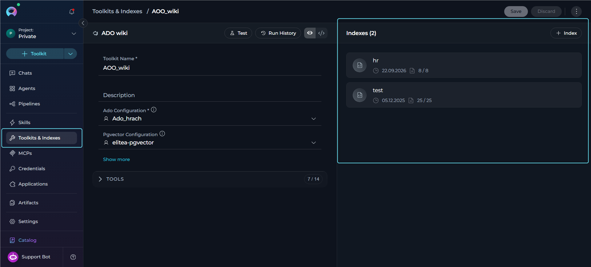
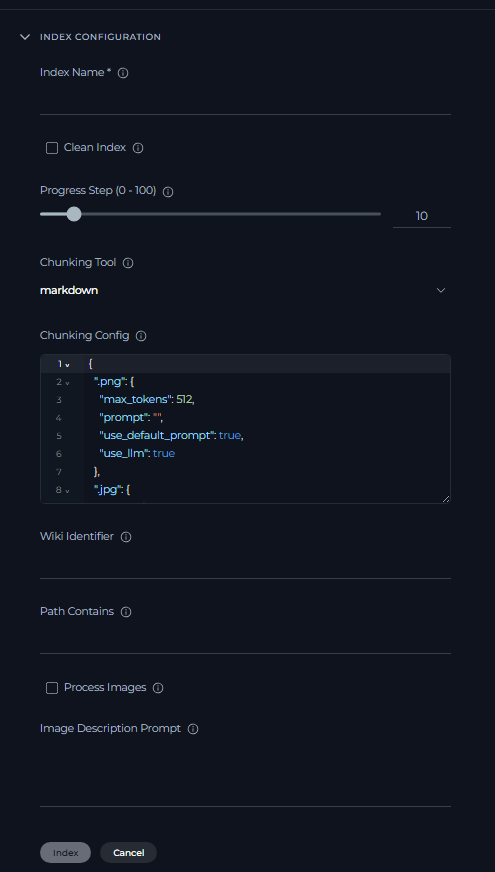
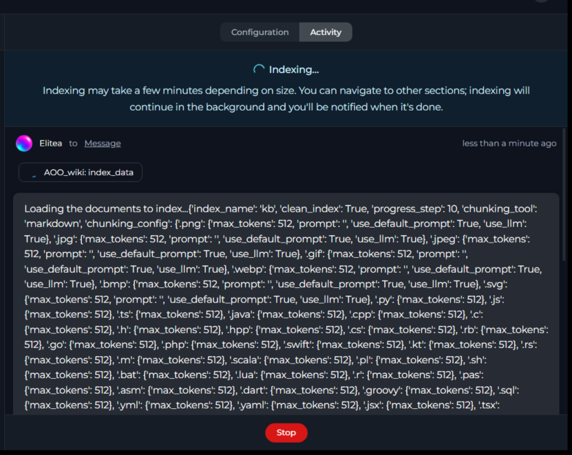
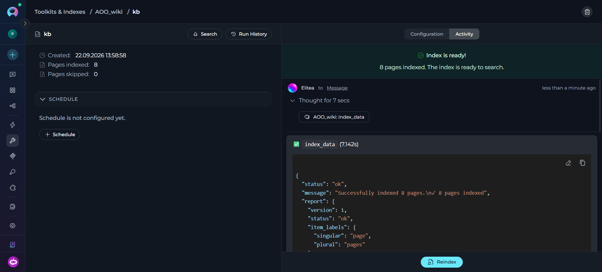
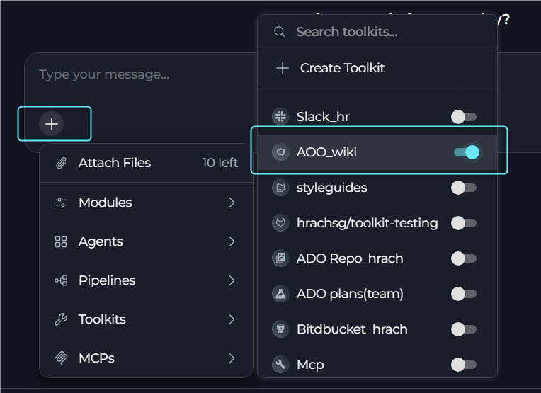

## Overview

ADO Wiki indexing turns your Azure DevOps wiki content into a searchable knowledge base inside ELITEA. You can index wiki pages—including project wikis and code wikis—with their hierarchical path structure, optionally describe embedded images with an LLM and optionally index referenced attachments as their own searchable documents.

<CardGroup cols={2}>
  <Card title="Knowledge Search" icon="magnifying-glass">
    Find documentation, procedures and technical guidance across wiki pages using natural-language queries.
  </Card>
  <Card title="Context-Aware Chat" icon="comments">
    Get AI-generated answers from your wiki content with citations to specific pages.
  </Card>
  <Card title="Faster Onboarding" icon="user-plus">
    Help new team members learn processes and standards from existing wiki documentation.
  </Card>
  <Card title="Documentation Audits" icon="clipboard-check">
    Identify gaps, overlap and outdated information in your wiki documentation.
  </Card>
</CardGroup>

---

## Prerequisites

Before indexing ADO Wiki data, ensure you have:

1. **ADO Credential**: An Azure DevOps personal access token configured as an [ADO credential](../credentials-toolkits/how-to-use-credentials#ado-azure-devops-credential-setup) in ELITEA
2. **Vector Storage**: PgVector selected in Settings → [AI Providers](../../menus/settings/ai-configuration)
3. **Embedding Model**: Selected in Settings → [AI Providers](../../menus/settings/ai-configuration)
4. **[ADO Wiki Toolkit](../../integrations/toolkits/ado_wiki_toolkit.mdx)**: Configured with your Azure DevOps project details and credential, with the **Index Data** tool enabled

<Warning title="Requirements">
The **Indexes** section requires:
- PgVector and an Embedding Model configured at the project level
- The **Index Data** tool enabled in your toolkit configuration

Complete both project-level setup and toolkit configuration to access indexing functionality.
</Warning>

**Required Permissions**

<Card icon="shield-check">
**Your ADO personal access token must have**
- **Wiki → Read** scope to index wiki content. Use **Wiki → Read & write** instead if the toolkit also modifies pages.
- Access to the specific project and wikis you want to index.
</Card>

---

## Set Up the ADO Wiki Toolkit

1. **Generate a Personal Access Token** in your Azure DevOps account (User Settings → Personal Access Tokens → **+ New Token**) with **Wiki** scope
2. **Create a Credential in ELITEA**: Go to **Credentials** → **+ Create** → **Ado**, enter the Organization Url and Token, then save
3. **Create the Toolkit**: Go to **Toolkits & Indexes** → **+ Create** → **Azure Wiki (ADO Wiki)**
4. **Enable Required Tools**: Select `Index Data`, `List Indexes`, `Search Index`, `Stepback Search Index`, `Stepback Summary Index` and `Remove Index`

<Warning title="Required Tool">
The **Index Data** tool must be enabled for the **Indexes** section to appear on the toolkit detail page.
</Warning>

**Tool Overview**

| Tool | Purpose |
|------|---------|
| **Index Data** | Creates or refreshes a searchable index from ADO wiki pages. |
| **List Indexes** | Lists the indexes available for this toolkit. |
| **Search Index** | Performs semantic search across indexed content. |
| **Stepback Search Index** | Rewrites or simplifies the query before searching, using conversation context. |
| **Stepback Summary Index** | Performs a stepback search and generates a summarized answer. |
| **Remove Index** | Deletes an existing index. |

<Info title="Detailed Instructions">
For complete credential and toolkit setup details, see:

- [ADO Credential Setup](../credentials-toolkits/how-to-use-credentials#ado-azure-devops-credential-setup)
- [ADO Wiki Toolkit Integration Guide](../../integrations/toolkits/ado_wiki_toolkit)
</Info>

---

## Index ADO Wiki Data

The following sections describe how to create, verify, reindex, schedule and delete an ADO Wiki index.

### Access the Interface

1. Go to **Toolkits & Indexes** in the main navigation.
2. Select your configured ADO Wiki toolkit to open its detail page.
3. The toolkit detail page shows a two-panel layout: the left panel has the toolkit configuration form, and the right panel has the **Indexes** section listing indexes for this toolkit.

    

<Warning title="Indexing Section Availability">
If the **Index Data** tool is not enabled, the **Indexes** section displays **"Indexing is not available for now"**. Enable **Index Data** in the toolkit configuration before using indexing features.
</Warning>

### Create a New Index

1. In the **Indexes** section, select **+ Index**.
2. A dedicated **Create Index** page opens with the **Index Data** configuration form.
3. Enter the required and optional values for your ADO Wiki index.

    

**ADO Wiki Index Parameters**

| Parameter | Required | Default | Validation | Description |
|-----------|----------|---------|------------|-------------|
| **Index Name** | Yes | None | 1-32 characters | Unique name for the index (used as the collection identifier). Read-only once the index is created. |
| **Clean Index** | No | `FALSE` | boolean | Rebuild the index by re-processing every page from the source instead of skipping unchanged ones. Previously indexed pages the source no longer returns may remain searchable. |
| **Progress Step** | No | `10` | 0-100 | Step size for progress reporting during indexing. |
| **Chunking Tool** | No | `markdown` | `markdown` or empty | Chunking method applied to page content. |
| **Chunking Config** | No | `{}` | JSON object | Configuration for the chunking tool. |
| **Wiki Identifier** | No | None | string | Wiki to index, for example `ProjectAlpha.wiki`. If omitted, the toolkit's **Default Wiki Identifier** is used; when a default is configured, this field's helper text shows it (`Default wiki: <value>`). If neither is provided, indexing fails with an error. Applied the same way for manual index creation, manual reindexing and scheduled reindexing. |
| **Path Contains** | No | None | string | Case-insensitive substring filter matched against the full wiki page path. Hyphens and spaces are treated as equivalent (`Feature-Analysis` matches `Feature Analysis`), and matching a parent folder name also includes its descendant pages. Leave empty to index all pages. |
| **Process Images** | No | `FALSE` | boolean | Replace inline image markdown in page content with LLM-generated image descriptions so image content becomes searchable text. Only affects images embedded in page content, not attachments. |
| **Image Description Prompt** | No | None | string | Custom prompt used when generating image descriptions (shared by Process Images and Include Attachments). |
| **Include Attachments** | No | `FALSE` | boolean | Index files referenced under `/.attachments/` in page content as their own dependent documents. Include/Skip Extensions (below) filter only these attachments—wiki pages themselves are never filtered by extension. |
| **Include Extensions** | No | `[]` | array of extensions | Attachment file extensions to include. If empty, all attachments are processed except those in Skip Extensions. |
| **Skip Extensions** | No | `[]` | array of extensions | Attachment file extensions to exclude. |
| **Workers** | No | `1` (serial) | 1-10 | Maximum number of attachments/images processed concurrently. |

    

<Tip>
**Toolkit-Specific Settings**

Index parameters vary by toolkit type. For a full comparison across all supported toolkits, see [Indexing Tools](./indexing-tools).
</Tip>

The **Index** button remains disabled until all required fields are valid.

4. Select **Index** to start indexing.
5. The page navigates to the dedicated index detail page, which opens on the **Activity** tab and shows live progress updates.
     
6. When indexing completes, the index enters **Completed** or **Partially Indexed** state and becomes available for search, scheduling, reindexing and history review.
     

### Verify Index Creation

Once indexing completes:

- The **Configuration** tab shows the saved index parameters (all editable except **Index Name**).
- The **General** section shows the created date and the **Files indexed** / **Files skipped** counts.

    

- The **Indexes** section shows an index card with the index name, created date, file counts and status icon. Hover over a card to reveal quick actions: **Open**, **Reindex**, **Delete**.

    

### Reindex an Index

Use **Reindex** on the index detail page to refresh the index with the latest wiki content.

1. Open the **Configuration** tab and adjust any fields if needed (all fields are editable except **Index Name**).
2. Select **Reindex** (shown as **Save & Reindex** if changes are pending) and confirm.

<Note>
**ADO Wiki Reindex Behavior**

- Pages are deduplicated by hashing the raw page markdown, so re-running indexing does not re-embed unchanged pages—including when only **Process Images** output would differ, since that hash is computed before image descriptions are generated.
- If you change **Include Attachments**, **Include Extensions** or **Skip Extensions** between runs, affected pages are automatically reprocessed even though their page content hash is unchanged, because the toolkit also compares the expected set of attachment documents for each page.
- If an attachment fails to download after retries, its parent page is automatically marked for reprocessing on the next reindex, so the failed attachment is retried rather than silently skipped forever.
- Pages removed from the source wiki are not automatically removed from the index during reindexing.
</Note>

### Schedule Reindexing

Use the **Schedule** section on the index detail page to automate reindexing on a cron schedule. Scheduling is available only for indexes in **Completed** or **Partially Indexed** state.

<Note>
Scheduled reindexing applies the **Wiki Identifier** fallback the same way as a manual reindex: if the field is left empty, each scheduled run resolves it from the toolkit's current **Default Wiki Identifier** at run time, with no need to specify it in the schedule itself. If you update the **Default Wiki Identifier** on the toolkit later, subsequent scheduled runs pick up the new value automatically.
</Note>

For cron expression syntax, credential selection and schedule management, see [Schedule Indexing](./schedule-indexing).

### Delete an Index

Open the index, select **Delete**, and enter the index name to confirm. Deleting an index permanently removes its indexed data, run history, and schedule configuration. The **Delete** action is only available when the **Remove Index** tool is enabled for the toolkit.

---

## Use Search Tools

Once your ADO Wiki index is **Completed** or **Partially Indexed**, open its index detail page and select **Search** to run any of the search tools enabled for the toolkit:

| Tool | Description |
|------|-------------|
| **Search Index** | Basic semantic search across indexed content. |
| **Stepback Search Index** | Advanced search that rewrites the query using conversation context. |
| **Stepback Summary Index** | Stepback search with an AI-generated summary answer. |

For the full parameter reference for each search tool, see [Indexing Tools](./indexing-tools).

    

---

## Use Indexed Data in Conversations & Agents

Your ADO Wiki toolkit can be used in two main contexts:

1. **In Conversations**: Add the toolkit as a participant to ask questions and search your indexed wiki data
2. **In Agents**: Include the toolkit when creating AI agents to give them access to your documentation

**Real-Life Example: Index Development Team Documentation**

**Scenario**: You have a development team wiki in Azure DevOps containing project documentation, API guides and troubleshooting information. You want to make this documentation searchable for your team.

**Step 1: Create the index**

1. Navigate to **Toolkits & Indexes** → select your ADO Wiki toolkit
2. In the **Indexes** section, select **+ Index**
3. Configure parameters:
     - **Index Name**: `docs`
     - **Wiki Identifier**: `WebApp.wiki` (or leave empty to use the toolkit's default wiki)
     - **Clean Index**: ✓ (checked to rebuild the index from the source)
     - **Path Contains**: (leave empty to index all pages)
     - **Chunking Tool**: `markdown`
4. Select **Index** and monitor progress on the Activity tab
5. Wait for **Completed** status

**Step 2: Add the toolkit to a conversation**

- Navigate to **Chat** → **+ Create**
- In the participants section, add your ADO Wiki toolkit

    

**Step 3: Ask questions**

  * **User Request:** "Find all documentation related to microservices deployment and provide a summary of the deployment process from our wiki."

  * **ADO Wiki Toolkit:** "Based on your indexed wiki pages, here is a comprehensive summary of microservices deployment:

    **Deployment Documentation Found:**

    1. **CI/CD Pipeline Setup**: Complete guide for automated deployment workflows
    2. **Environment Configuration**: Development, staging and production environment setup
    3. **Container Deployment**: Docker containerization and Kubernetes deployment procedures

    **Deployment Process Summary:**

    - **Pre-Deployment**: Code review, automated testing, security scanning
    - **Development**: Automatic deployment on code commit
    - **Staging**: Manual approval with integration testing
    - **Production**: Blue-green deployment with rollback capabilities

    [Citations: Deployment Guide v2.1, Container Best Practices, Production Runbook]"

**Advanced search example:**

  * **User:** "What are the authentication mechanisms used across our microservices?"

  * **ADO Wiki Toolkit:** "According to the indexed documentation, your microservices use a multi-layered authentication approach:

    1. **JWT Tokens**: Primary authentication for API calls
    2. **OAuth 2.0**: Third-party service integration
    3. **Service-to-Service**: Mutual TLS authentication

    [Citations: Authentication Architecture, API Security Guide, Service Mesh Configuration]"

---

## Troubleshooting

<Accordion title="Indexes Section Not Visible">

- Verify PgVector and an Embedding Model are configured in Settings → [AI Providers](../../menus/settings/ai-configuration).
- Ensure the **Index Data** tool is enabled in your ADO Wiki toolkit configuration.
- Refresh the page and try again.

</Accordion>

<Accordion title="Wiki Identifier Not Provided Error">

**Problem:** Indexing fails with an error such as *"Wiki identifier must be provided either as a parameter or configured as default in toolkit settings."*

**Cause:** The **Wiki Identifier** field was left empty and no **Default Wiki Identifier** is set in the toolkit configuration.

**Resolution:**
- Set the **Wiki Identifier** field on the index, or
- Open the toolkit configuration and set **Default Wiki Identifier** to your wiki name (for example, `ProjectAlpha.wiki`)

</Accordion>

<Accordion title="Connection or Authentication Failures">

- Verify the ADO personal access token has **Wiki: Read** (or **Read & write**) scope and has not expired.
- Check the **Project** field and the credential's **Organization Url** for typos.
- Confirm you have access to the specified project and wiki.

</Accordion>

<Accordion title="Index Creation Failed or Stuck In Progress">

- Verify the wiki exists and contains pages matching your **Path Contains** filter (if set).
- Check for very large pages or a large number of attachments that might extend processing time.
- Verify PgVector and the embedding model are reachable.

</Accordion>

<Accordion title="Attachments Not Searchable">

- Verify **Include Attachments** was enabled when the index was created or last reindexed.
- Check **Include Extensions** / **Skip Extensions**—an attachment excluded by either filter is not indexed.
- Attachment downloads are retried automatically; a persistently failing attachment marks its parent page for reprocessing on the next reindex rather than failing silently.

</Accordion>

<Accordion title="No Search Results Returned">

- Verify the index status is **Completed** or **Partially Indexed**.
- Lower the **Cut Off** score (for example, from `0.5` to `0.35`).
- Increase **Search Top**.
- Try **Stepback Search Index** for complex, multi-part questions.
- Confirm the **Index Name** used in the search tool matches the index you created.

</Accordion>

<Accordion title="Vector Database or Embedding Model Errors">

- Ensure PgVector is configured correctly in Settings → AI Providers.
- Verify an embedding model is selected and available.
- Confirm the vector database is reachable.

</Accordion>

---

<Info>
**Related Documentation**
- **[Indexing Overview](./indexing-overview)**—Complete guide to indexing in ELITEA and its capabilities
- **[Indexing Tools](./indexing-tools)**—Detailed reference for all indexing tools and parameters
- **[Create & Use Indexes](./using-indexes-tab-interface)**—Full walkthrough of the Indexes interface, reindexing, history and search

</Info>
