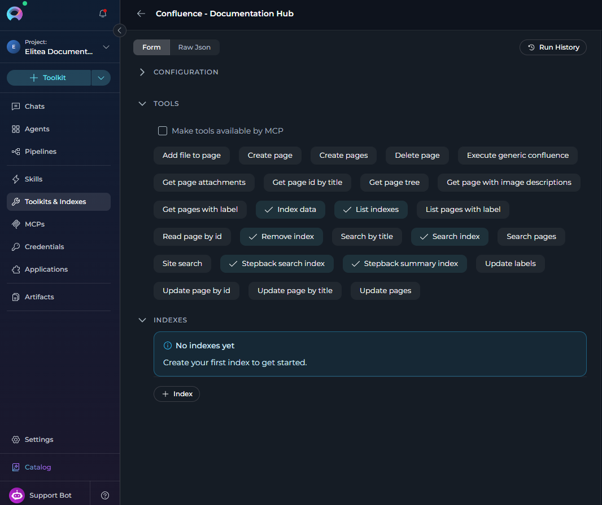
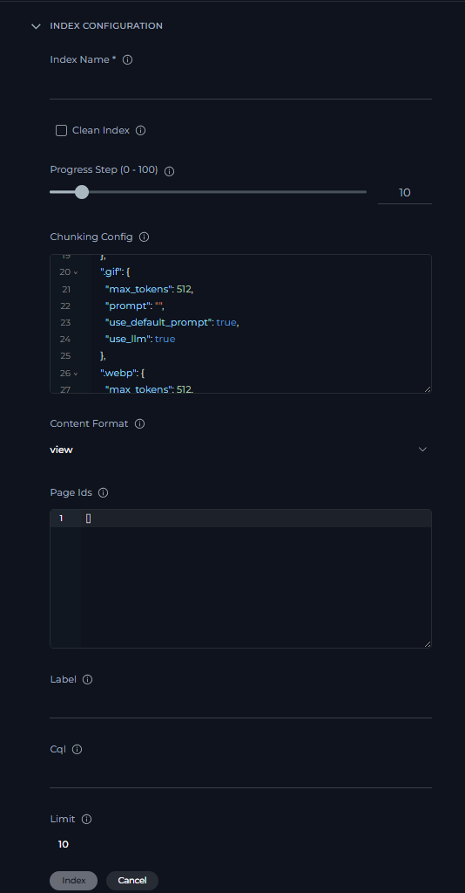
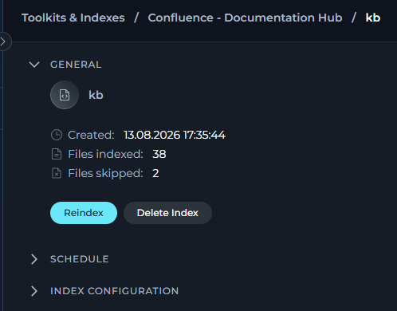
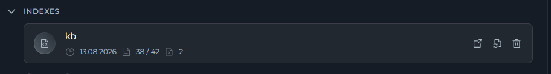
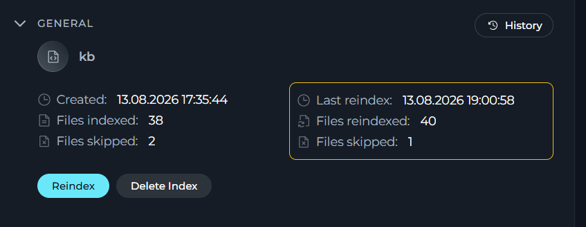
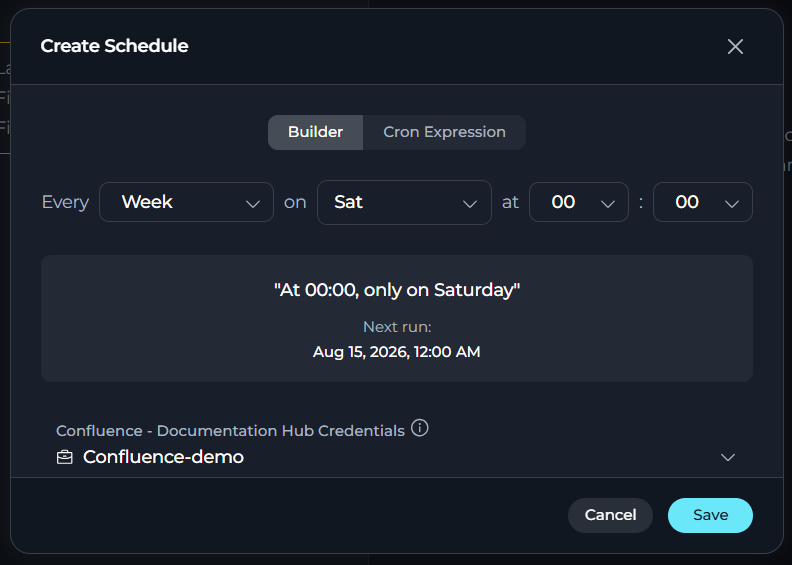
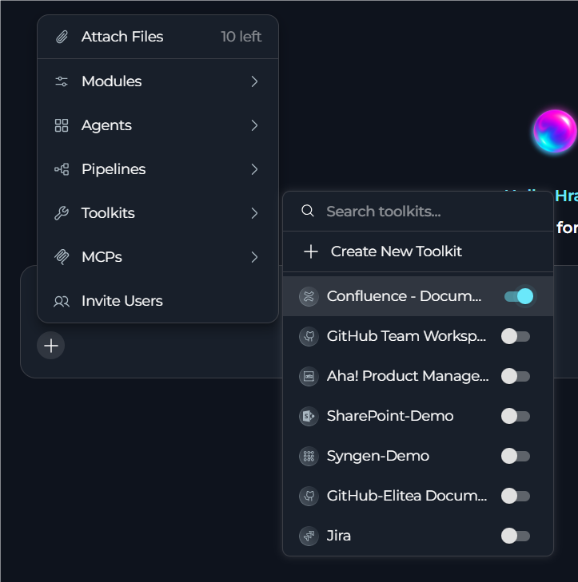
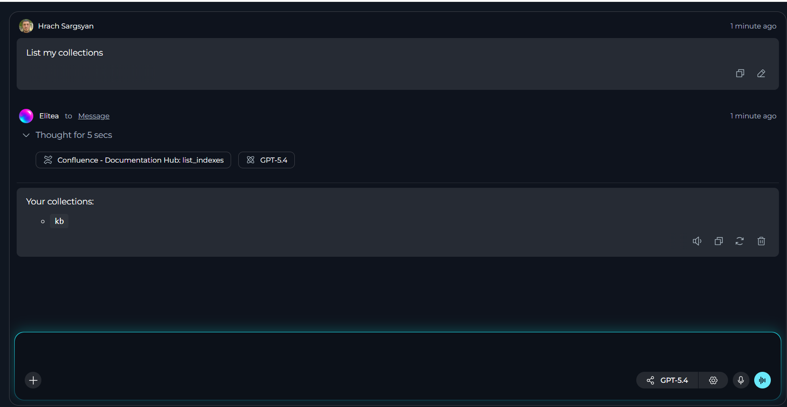

## Overview

Confluence indexing turns your Confluence content into a searchable knowledge base inside ELITEA. You can index pages, spaces, labels, attachments, and comments, then use that data for semantic search, AI chat with citations, and broader knowledge discovery across your documentation.

Typical use cases include:

<CardGroup cols={2}>
  <Card title="Knowledge Search" icon="magnifying-glass">
    Find procedures, policies, and technical guidance across Confluence spaces.
  </Card>
  <Card title="Faster Onboarding" icon="user-plus">
    Help new team members learn from existing documentation more quickly.
  </Card>
  <Card title="Support Enablement" icon="life-ring">
    Resolve tickets faster with indexed knowledge articles and FAQs.
  </Card>
  <Card title="Summaries & Answers" icon="sparkles">
    Generate concise answers and summaries from existing Confluence content.
  </Card>
  <Card title="Content Audits" icon="clipboard-check">
    Identify gaps, overlap, and outdated information in your documentation.
  </Card>
  <Card title="Knowledge Reuse" icon="arrows-rotate">
    Reuse existing Confluence content in chats, workflows, and team research.
  </Card>
</CardGroup>

---

## Prerequisites

Before indexing Confluence data, ensure you have:

1. **Confluence Credential**: A Confluence API token or [authentication credentials](../credentials-toolkits/how-to-use-credentials#confluence-credential-setup) configured in ELITEA
2. **Vector Storage**: PgVector selected in Settings → [AI Providers](../../menus/settings/ai-providers#vector-storages)
3. **Embedding Model**: Selected in AI Configuration (defaults available) → [AI Providers](../../menus/settings/ai-providers#embedding-models)
4. **Confluence Toolkit**: Configured with your Confluence instance details, credentials, and **Index Data tool enabled**

<Warning title="Requirements">
The **Indexes** interface requires:
- PgVector and Embedding Model configured at the project level
- The **Index Data** tool enabled in your toolkit configuration

Complete both project-level setup and toolkit configuration to access indexing functionality.
</Warning>

**Required Permissions**

<Card icon="shield-check">
**Your Confluence credential must have**
- Read access to the spaces and pages you want to index
- Access to attachments and comments if you plan to include them
- Access to restricted content only if you want restricted pages indexed
</Card>

<Card icon="key">
**Supported authentication methods**

- **Basic Authentication**: Username and API Key
- **Bearer Token**: Confluence API token
</Card>

---

### Setting Up the Confluence Toolkit

1. **Generate a Confluence API Token** in your Atlassian account under **Security → API Tokens**
2. **Create a Confluence Credential in ELITEA**: Go to **Credentials** → **+ Credential** → **Confluence**, enter the required details, and save
3. **Create a Confluence Toolkit**: Go to **Toolkits** → **+ Toolkit** → **Confluence**
4. **Configure the Toolkit**: Set the base URL, space, hosting option, and assign the Confluence credential you created
5. **Enable Required Tools**: Select `Index Data`, `List Collections`, `Search Index`, `Stepback Search Index`, `Stepback Summary Index`, and `Remove Index`
6. **Save the Toolkit**

<Warning title="Required Tool">
The **Index Data** tool must be enabled for indexing functionality to be available. Without this tool, you cannot access the indexing interface.
</Warning>

**Tool Overview**

| Tool | Purpose |
|------|---------|
| `Index Data` | Creates searchable indexes from Confluence pages and content. |
| `List Collections` | Lists available collections and indexes so you can verify what has been indexed. |
| `Search Index` | Performs semantic search across indexed content using natural language queries. |
| `Stepback Search Index` | Breaks down complex questions into simpler parts to improve search results. |
| `Stepback Summary Index` | Generates summaries and insights from search results across indexed content. |
| `Remove Index` | Deletes existing collections and indexes when you need to clean up or start fresh. |

<Info title="Detailed Instructions">
For complete credential and toolkit setup details, see:

- [Confluence Toolkit Integration Guide](../../integrations/toolkits/confluence_toolkit)
</Info>

---

## Index Confluence Data

### Access the Interface

1. Go to **Toolkits & Indexes** in the main navigation.
2. Choose your configured Confluence toolkit from the list.
3. In the toolkit configuration view, expand the **INDEXES** section.
4. Use the left-side index list to create a new index or open an existing one.

    

<Warning title="Indexing section Availability">
If the **Index Data** tool is not turned on in the toolkit configuration, the **INDEXES** section displays the message **"Indexing is not available for now"**. Turn on **Index Data** before using indexing features.
</Warning>

### Create a New Index

1. In the **INDEXES** section, select **+ Index**.
2. Open the dedicated **New index** page with **Index configuration** parameters.
3. Enter the required and optional values for the Confluence indexing parameters.

**Confluence Index Parameters**

| Parameter | Description | Example Value | Required |
|-----------|-------------|---------------|----------|
| Index Name | Suffix for collection name (max 7 chars) | `kb` or `docs` | ✓ |
| Clean Index | Remove existing index data before re-indexing | ✓ (checked) or ✗ (unchecked) | ✗ |
| Progress Step (0 - 100) | Controls how often progress updates are reported during indexing. | `10` | ✗ |
| Chunking Config | Custom chunking configuration for processing indexed content. | `{}` | ✗ |
| Content Format | Defines which Confluence content representation to retrieve. | `view`, `storage`, `export_view` | ✗ |
| Page Ids | Limits indexing to specific Confluence page IDs. | `["123456", "789012"]` | ✗ |
| Label | Filters indexed pages by label. | `"api-docs"` | ✗ |
| Cql | Uses a Confluence Query Language filter to narrow indexed content. | `"space = DEV"` | ✗ |
| Limit | Limits the number of results returned by the source query. | `10` | ✗ |
| Max Pages | Sets the maximum number of pages to retrieve and index. | `1000` | ✗ |
| Include Restricted Content | Includes restricted pages if the credential has access. | ✓ (checked) or ✗ (unchecked) | ✗ |
| Include Archived Content | Includes archived Confluence content in the index. | ✓ (checked) or ✗ (unchecked) | ✗ |
| Include Attachments | Includes page attachments in the indexing run. | ✓ (checked) or ✗ (unchecked) | ✗ |
| Include Extensions | Restricts indexing to selected file extensions. | `["pdf", "docx"]` | ✗ |
| Skip Extensions | Excludes selected file extensions from indexing. | `["png", "zip"]` | ✗ |
| Include Comments | Includes page comments in indexed content. | ✓ (checked) or ✗ (unchecked) | ✗ |
| Include Labels | Includes Confluence labels in indexed metadata. | ✓ (checked) or ✗ (unchecked) | ✗ |
| Ocr Languages | Sets OCR languages for processing supported attachments. | `eng`, `fra`, `deu` | ✗ |
| Keep Markdown Format | Preserves Markdown formatting in indexed output. | ✓ (checked) or ✗ (unchecked) | ✗ |
| Keep Newlines | Preserves line breaks and formatting in indexed text. | ✓ (checked) or ✗ (unchecked) | ✗ |
| Bins With Llm | Uses an LLM to process supported binary files. | ✓ (checked) or ✗ (unchecked) | ✗ |

    

### Start and Monitor Indexing

1. Fill in all required fields until the **Index** button becomes active.
2. Select **Index** to start the indexing process.
3. Track progress on the dedicated index page after the run starts.
4. Watch real-time status updates on the index page.

 <video src="../../img/how-tos/indexing/confluence/confluence-indexing-full.mp4" controls width="600"></video>

 <Info>
**Index Statuses**
- 🔄 **In Progress**: Indexing is currently running.
- ✅ **Completed**: All items indexed successfully.
- ⚠️ **Partially Indexed**: Indexing finished but some files were skipped (unsupported extension, empty content, or errors). The index is fully usable for search and scheduling. Review the skipped-file breakdown in the chat panel.
- ❌ **Failed**: Indexing encountered an error.

</Info>

### Verify Index Creation

Once indexing completes:

- The index status should appear as **Completed** or **Partially Indexed**.
- The dedicated index page shows the **General** section with the index name, created date, and the initial **Files indexed** and **Files skipped** counts.
   

- The **INDEXES** section shows an index card with the collection name, created date, indexed or total file count, and skipped file count when applicable.
    

### Reindexing

Use **Reindex** on the dedicated index page when you want to refresh the indexed Confluence content.

- The **Index configuration** section loads the saved settings for the current index.
- You can update the configuration before starting the reindex run, except for `index_name`, which remains read-only.
- After a successful reindex, the **General** section shows the latest reindex details, including the last reindex date and updated file counts.

<Note>
**Confluence Reindex Behavior**
- If attachments are deleted from a Confluence page, they are not removed from the index during reindexing, even when **Clean Index** is selected. If new attachments are added to the page, they are added to the index. **This behavior is caused by Atlassian-side limitations.**
- If a page is deleted from Confluence, it is not removed from the index during reindexing unless **Clean Index** is selected.

</Note>

   

### Scheduling

Use the **Schedule** section on the index page to automate reindexing.

- Select **+ Schedule** to create a schedule and define when the index should run.
- Existing schedules can be edited, deleted, enabled, or disabled from the same section.
- Scheduling is available only for indexes in **Completed** or **Partially Indexed** status.
- Scheduled indexing runs also generate notifications, so you can track successful, partial, or failed updates.
   

---

## Use Search Tools

Once your Confluence data is indexed, you can search and interact with it directly through the interface.

The following search tools are available:

| Tool | Description |
|------|-------------|
| **Search Index** | Basic semantic search across indexed content. |
| **Stepback Search Index** | Advanced search that breaks down complex questions. |
| **Stepback Summary Index** | Search with automatic summarization of results. |

<Info>
**Prerequisites for Search**
- Indexes in **Completed** or **Partially Indexed** status support search.
- At least one search tool must be enabled in the toolkit configuration: **Search Index**, **Stepback Search Index**, or **Stepback Summary Index**.
</Info>

### Select a Search Tool

1. Open the index page.
2. In the left panel, select **Select tool**.
3. Choose a search tool from the dropdown list.
4. The page switches to the selected tool settings.

   

### Run a Search

1. Enter your query.
2. Adjust optional parameters such as filters or model settings.
3. Select **Search**.
4. Review the results in the integrated chat panel.

   <video src="../../img/how-tos/indexing/confluence/search-indexed-data.mp4" controls width="600"></video>
---

## Use Indexed Data in Conversations

Your Confluence toolkit can be used in two main contexts:

1. **In Conversations**: Add the toolkit as a participant to ask questions and search your indexed Confluence data
2. **In Agents**: Include the toolkit when creating AI agents to give them access to your Confluence knowledge base

**How to use:**

- **Start a New Conversation or Create an Agent**
- **Add Toolkit as Participant**: Select your Confluence toolkit from the available toolkits
- **Ask Natural Language Questions**: The toolkit will automatically search your indexed data and provide relevant answers with citations

### Real-Life Example Workflow

Let's walk through a complete example of indexing and using a company knowledge base:

**Step 1: Add toolkit to a conversation and start asking questions**

   - Navigate to **Chat** → **+ Chat**
   - select the **`+`** icon in the input toolbar.
   - Hover over the Toolkits category and enable your Confluence toolkit

   

**Step 2: Index the Knowledge Base**

 * **User Request in Chat:**
 
   > "Index our knowledge base with collection suffix 'kb'. Include comments and labels but exclude attachments. Keep markdown formatting and clean any existing index first."

<video src="../../img/how-tos/indexing/confluence/confluence-index-chat.mp4" controls width="600"></video>

**Step 3: Verify Index Creation**

 * **User Request:**
 
   > "List my collections"

 **Confluence Toolkit Response:**

   

 This confirms the indexing completed successfully and your knowledge base collection is available for searching.

**Step 4: Start the conversation and begin asking questions about your indexed content**

  * **User Request:** "What is our company's vacation policy?"
   
  * **Confluence Toolkit:** "Based on your indexed knowledge base, here's your company's vacation policy:
   
    1. **Annual Leave Entitlement**: All full-time employees are entitled to 25 days of annual leave per year
    2. **Accrual System**: Vacation days accrue monthly at a rate of 2.08 days per month
    3. **Carryover Policy**: Up to 5 unused vacation days can be carried over to the next year...
   
   *Source: HR Policies → Employee Benefits → Vacation Policy (Page ID: 12345)*"

   <video src="../../img/how-tos/indexing/confluence/confluence-search-chat.mp4" controls width="600"></video>

   
   * **User Request:** "How do I set up a new development environment?"
   
   * **Confluence Toolkit:** "Here's the step-by-step process for setting up a new development environment:
   
     **Prerequisites:**

      1. Install Docker Desktop
      2. Obtain access credentials from the DevOps team
      3. Clone the main repository from GitHub
   
     **Setup Steps:**

     1. Run the environment setup script: `./scripts/setup-dev.sh`
     2. Configure your local environment variables...
   
   *Source: Developer Documentation → Environment Setup → Development Environment (Page ID: 67890)*"

## Troubleshooting

<Accordion title="Indexing Interface Not Visible or Tab Disabled">

- Verify PgVector and Embedding Model are configured in Settings → AI Configuration.
- Ensure the **Index Data** tool is enabled in your Confluence toolkit configuration.
- Check that your toolkit supports indexing.
- Refresh the browser page and try again.

</Accordion>

<Accordion title="Create New Index Button Not Working">

- Verify all project-level prerequisites are met.
- Check that you have the required permissions for the toolkit.
- Ensure the toolkit is saved with valid credentials.

</Accordion>

<Accordion title="Space Not Found or Authentication Failed">

- Verify that your Confluence credential uses the correct API token.
- Ensure the space key is exact and case-sensitive, for example `KB` instead of `kb`.
- Check that the credential has access to the target space.

</Accordion>

<Accordion title="Index Creation Failed or Indexing Stuck in Progress">

- Check that your space and filter settings are not too restrictive.
- Verify that the space contains pages matching your criteria.
- Review the progress indicators for specific error details.

</Accordion>

<Accordion title="API Rate Limit Exceeded">

- Reduce **Max Pages** or narrow the scope with labels or CQL.
- Wait and retry the indexing run.
- Consider indexing large spaces in smaller batches.

</Accordion>

<Accordion title="No Documents Indexed">

- Check that your label or CQL filters are not too restrictive.
- Verify that the space contains pages matching your criteria.
- Try indexing without filters first, then narrow the scope.

</Accordion>

<Accordion title="No Search Results Returned">

- Verify that the index status is **Completed**.
- Check that your query matches the type of indexed content.
- Try broader search terms or a different search tool.
- Verify that the indexed content contains the information you expect.

</Accordion>

<Accordion title="Vector Database Connection Failed or PgVector Errors">

- Ensure PgVector is configured correctly in Settings → AI Configuration.
- Verify that the vector database is running and accessible.
- Check connection credentials and database permissions.
- Restart the vector database service if needed.

</Accordion>

<Accordion title="Embedding Model Not Found or Embedding Errors">

- Verify that an embedding model is selected in AI Configuration.
- Check that the model is available and initialized.
- Try switching to a different embedding model.
- Ensure the environment has enough resources to load the model.

</Accordion>

<Accordion title="Large Confluence Spaces">

- Use label filters such as `label="documentation"` or `label="public"`.
- Use CQL to narrow the scope, for example `space="KB" AND created>="2024-01-01"`.
- Consider indexing by page hierarchy or in smaller batches.
- Monitor progress indicators and document counts during the run.

</Accordion>

<Accordion title="Search Result Quality">

If search returns few or no results:

- Verify that the index status is **Completed**.
- Lower the cut-off score from `0.5` to `0.35` or `0.3`.
- Increase `search_top` from `10` to `20` or `30`.
- Rephrase the query with different keywords.

For better search quality:

- Include both pages and attachments for broader coverage.
- Use natural language queries instead of exact keyword matches.
- Use follow-up questions in the integrated chat interface.
- Create separate indexes for different content types or scopes.

</Accordion>

---

<Info>
**Guides & References**
- [Indexing Overview](./indexing-overview) - General indexing concepts and features
- [How to Use Credentials](../credentials-toolkits/how-to-use-credentials) - Credential management and Confluence setup
- [Toolkits Menu](../../menus/toolkits) - Toolkit configuration and management
- [Confluence Toolkit Integration Guide](../../integrations/toolkits/confluence_toolkit) - Complete Confluence toolkit reference
- [AI Providers](../../menus/settings/ai-providers) - Vector storage and embedding model setup
- [Chat Menu](../../menus/chat) - Creating conversations and adding toolkit participants
</Info>

