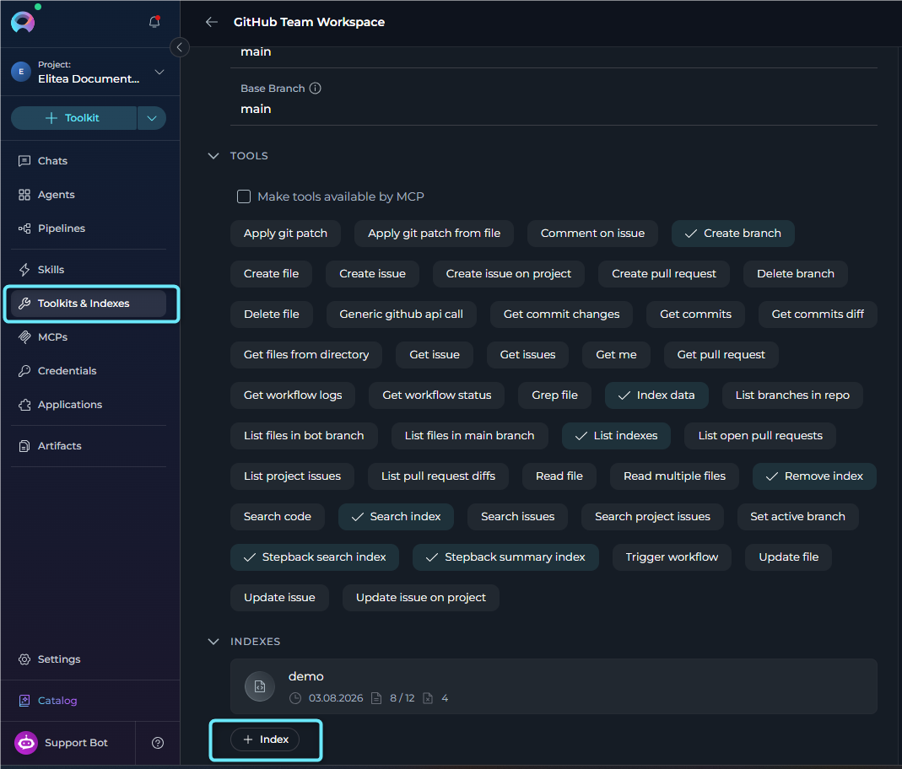
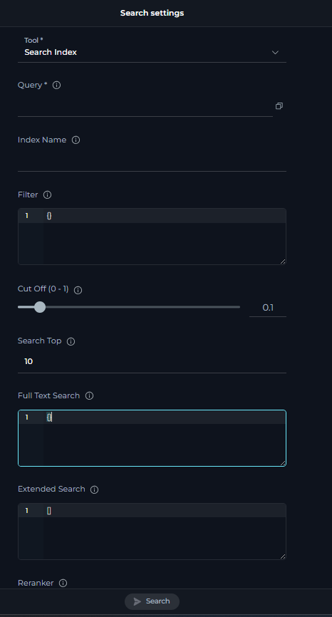
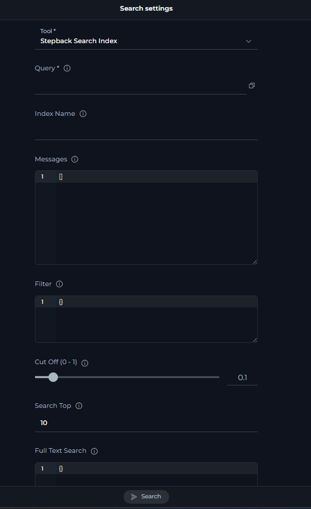
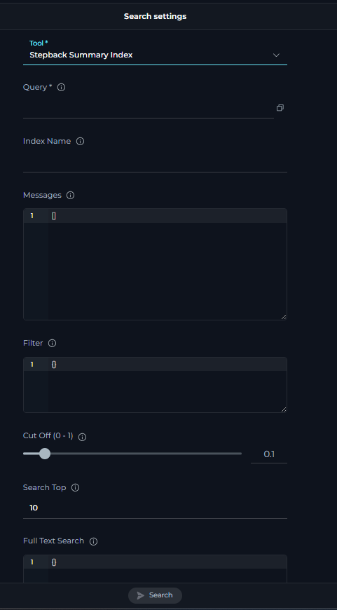

## Prerequisites

- Credential for your toolkit (required for all except Artifact). See [Create a Credential](../../getting-started/create-credential).
- Vector Storage: PgVector selected in Settings → [AI Configuration](../../menus/settings/ai-configuration).
- Embedding Model selected in Settings → [AI Configuration](../../menus/settings/ai-configuration).
- A configured toolkit that supports indexing. See [Indexing Overview](./indexing-overview#toolkits-which-support-indexes).

---

## Index Data

Create a new index or refresh an existing one from the connected source system. This tool collects source content, processes it with the configured chunking strategy, and stores the result in the vector database so it can be searched later.

**Purpose**

- Create a searchable index from supported toolkit data.
- Update an existing index with the latest source content.
- Prepare indexed content for Search Index, Stepback Search Index, and Stepback Summary Index.

**How to Execute**

The **Index Data** tool runs when you create an index.

**Recommended: Indexes Section**

1. Open your toolkit.
2. Expand the **Indexes** section.
3. Select **+ Index**.
4. Fill in the **Index Data** parameters.
5. Select **Index** to run the tool and create the index.

    

### Common Settings & Parameters

| UI label | Description | Required? | Default value | Validation/Allowed |
| --- | --- | --- | --- | --- |
| Index Name | Unique collection name for the index | Yes | None | max_length=7, min_length=1 |
| Progress Step | Step size for progress reporting | No | 10 | ge=0, le=100 |
| Clean Index | Clean existing index before re-indexing | No | `FALSE` | None |
| Skip Unsupported Extensions | Skip files with unsupported extensions instead of processing them with the text chunker | No | `TRUE` | boolean |
| Chunking Config | Configuration for chunking tool | No | `{}` | None |

 

### Toolkit-Specific Settings & Parameters

The following parameters apply to specific toolkit types only.

| Toolkit type | UI label | Description | Required? | Default | Validation/Allowed |
| --- | --- | --- | --- | --- | --- |
| Repositories (GitHub, GitLab, Bitbucket, ADO Repos) | Branch | Branch to index files from. Defaults to the active branch if not provided. | No | None | string |
| Repositories (GitHub, GitLab, Bitbucket, ADO Repos) | Whitelist | File extensions or paths to include. Example: `["*.md", "*.java"]`. | No | None | array of glob patterns |
| Repositories (GitHub, GitLab, Bitbucket, ADO Repos) | Blacklist | File extensions or paths to exclude. Example: `["*.md", "*.java"]`. | No | None | array of glob patterns |
| Repositories (GitHub, GitLab, Bitbucket, ADO Repos) | Skip Unsupported Extensions | Skip files with unsupported extensions instead of processing them with the text chunker. | No | `TRUE` | boolean |
| Test Management (Zephyr Enterprise) | Zql | ZQL query to search for test cases. Supported fields include estimatedTime, testcaseId, creator, release, project, priority, altId, version, versionId, automated, folder, contents, name, comment, and tag. Examples: `folder="TestToolkit"`, `name~"TestToolkit5"`. | No | None | ZQL syntax |
| Test Management (Zephyr Scale) | Project Key | Jira project key filter (for example, `PROJ`). | Yes | None | Jira project key |
| Test Management (Zephyr Scale) | Jql | JQL-like query for searching test cases. Supported fields include folder, folderPath, label, text, customFields, steps, orderBy, orderDirection, limit, includeSubfolders, and exactFolderMatch. | Yes | None | JQL-like syntax |
| ADO Boards | Wiql | WIQL (Work Item Query Language) query string to select and filter Azure DevOps work items. | Yes | None | WIQL syntax |
| ADO Boards | Workers | Maximum number of work items processed concurrently. | No | 1 | integer, 1–10 |
| ADO Boards | Process Images | Describe inline images in HTML work item fields with the LLM before indexing. | No | `FALSE` | boolean |
| ADO Boards | Image Description Prompt | Optional prompt used when `process_images` is turned on. | No | None | string |
| ADO Boards | Fields | Whitelist of work item field reference names to include in indexed content. | No | None | array of field names |
| ADO Boards | Sanitize | Sanitize HTML-rich field content before indexing. | No | `TRUE` | boolean |
| ADO Plans | Plan Id | ID of the test plan for which test cases are requested. | Yes | None | numeric ID |
| ADO Plans | Suite Ids | List of test suite IDs for which test cases are requested. Leave empty to index all suites from the plan. Example: `[2, 23]`. | No | `[]` | array of numeric IDs |
| ADO Wiki | Wiki Identifier | Wiki identifier to index (for example, `ABCProject.wiki`). If omitted, the default wiki identifier from the toolkit configuration is used. | No | None | string |
| ADO Wiki | Path Contains | Case-insensitive substring filter applied to the full wiki page path. Leave empty to index all pages. | No | None | string |
| ADO Wiki | Process Images | Replace inline image markdown with LLM-generated descriptions so image content becomes searchable text. | No | `FALSE` | boolean |
| ADO Wiki | Image Description Prompt | Optional custom prompt used when generating image descriptions. | No | None | string |
| ADO Wiki | Include Attachments | Index `/.attachments/` files referenced by wiki pages as dependent documents. | No | `FALSE` | boolean |
| SharePoint | Limit Files | Maximum number of files to return. Supports synonyms such as First, Top, or a numeric literal (for example, `Top 10 files`). If not specified, the default applies. | No | 1000 | number or synonym keyword |
| SharePoint | Include Extensions | List of file extensions to include when processing. If empty, all files are processed except those in Skip Extensions. Example: `["*.png", "*.jpg"]`. | No | None | array of glob patterns |
| SharePoint | Skip Extensions | List of file extensions to skip when processing. Example: `["*.png", "*.jpg"]`. | No | None | array of glob patterns |
| SharePoint | Path | Folder path to scope indexing. Accepts a full server-relative path or a relative path. | No | None | string |
| SharePoint | Form Name | Document library name to scope indexing to. | No | None | string |
| SharePoint | Include OneNote | Index OneNote pages from the SharePoint site. Requires Graph API delegated access. | No | `FALSE` | boolean |
| SharePoint | OneNote Filter | Optional dictionary controlling which OneNote notebooks, sections, and pages are indexed and how they are processed. | No | None | dictionary |
| Figma | Urls Or File Keys | Comma-separated list of Figma file URLs or raw file keys to index. | Yes | None | comma-separated string |
| Figma | Number Of Threads | Number of worker threads used when indexing Figma images. | No | 5 | integer, 1–5 |
| Figma | Node Ids Include | List of top-level node IDs (pages) to include in the index. | No | None | array of strings |
| Figma | Node Ids Exclude | List of top-level node IDs (pages) to exclude when `node_ids_include` is not provided. | No | None | array of strings |
| Figma | Node Types Include | List of node types to include in the index. | No | None | array of strings |
| Figma | Node Types Exclude | List of node types to exclude when `node_types_include` is not provided. | No | None | array of strings |
| Figma | Scale To Limit Threshold | Maximum image dimension in pixels for LLM vision processing. Larger frames are scaled down. | No | 8000 | integer |
| Figma | Subframe Extract Threshold | Frames larger than this dimension are split into subframes and processed individually. | No | 15000 | integer |
| TestRail | Project Id | TestRail project ID to index data from. | Yes | None | string or numeric ID |
| TestRail | Suite Id | Optional TestRail suite ID to filter test cases. | No | None | string or numeric ID |
| TestRail | Section Id | Optional section ID to filter test cases. | No | None | numeric ID |
| TestRail | Include Attachments | Whether to include attachment content in indexing. | No | `FALSE` | boolean |
| TestRail | Skip Attachment Extensions | List of file extensions to skip when processing attachments (for example, `['.png', '.jpg']`). | No | None | array of extensions |
| Xray Cloud | Jql | JQL query for searching test cases in Xray. Supported fields include project, testType, labels, summary, description, status, and priority. | No | None | JQL syntax |
| Xray Cloud | Graphql | Custom GraphQL query for advanced data extraction. Use either `jql` or `graphql`, not both. | No | None | GraphQL syntax |
| Xray Cloud | Include Attachments | Whether to include attachment content in indexing. | No | `FALSE` | boolean |
| Xray Cloud | Skip Attachment Extensions | List of file extensions to skip when processing attachments (for example, `['.exe', '.zip', '.bin']`). | No | None | array of extensions |
| Confluence | Content Format | Render format for page content. | No | `view` | string (for example, `view`) |
| Confluence | Page Ids | List of page IDs to retrieve. | No | None | array of IDs |
| Confluence | Label | Label to filter pages. | No | None | string |
| Confluence | Cql | CQL query to filter pages. | No | None | CQL syntax |
| Confluence | Limit | Limit the number of results. | No | 10 | number |
| Confluence | Max Pages | Maximum number of pages to retrieve. | No | 1000 | number |
| Confluence | Include Restricted Content | Include restricted content. | No | `FALSE` | boolean |
| Confluence | Include Archived Content | Include archived content. | No | `FALSE` | boolean |
| Confluence | Include Attachments | Whether to include attachment content in indexing. | No | `FALSE` | boolean |
| Confluence | Include Extensions | List of file extensions to include when processing attachments. If empty, all files are processed except those in Skip Extensions. | No | `[]` | array of glob patterns |
| Confluence | Skip Extensions | List of file extensions to skip when processing attachments. | No | `[]` | array of glob patterns |
| Confluence | Include Comments | Include page comments in indexing. | No | `FALSE` | boolean |
| Confluence | Include Labels | Include page labels in indexing. | No | `FALSE` | boolean |
| Confluence | Ocr Languages | OCR languages for processing attachments. | No | `eng` | language codes (for example, `eng`) |
| Confluence | Keep Markdown Format | Keep Markdown formatting in output. | No | `TRUE` | boolean |
| Confluence | Keep Newlines | Preserve newlines in extracted content. | No | `TRUE` | boolean |
| Confluence | Bins With Llm | Use LLM for processing binary files. | No | `FALSE` | boolean |
| Jira | Jql | JQL query to filter issues. If omitted, all accessible issues are indexed. Examples: `project=PROJ`, `parentEpic=EPIC-123`, `status=Open`. | No | None | JQL syntax |
| Jira | Fields To Extract | Additional fields to extract from issues. | No | None | array of field keys |
| Jira | Fields To Index | Additional fields to include in indexed content. | No | None | array of field keys |
| Jira | Include Attachments | Whether to include attachment content in indexing. | No | `FALSE` | boolean |
| Jira | Include Comments | Whether to fetch and index comments for each issue. | No | `FALSE` | boolean |
| Jira | Process Images | Whether to use a vision LLM to describe images referenced in issue descriptions and comments. | No | `FALSE` | boolean |
| Jira | Max Total Issues | Maximum number of issues to index. | No | 1000 | number |
| Jira | Skip Attachment Extensions | List of file extensions to skip when processing attachments (for example, `['.png', '.jpg']`). | No | None | array of extensions |
| Jira | Chunking Tool | Name of chunking tool for the base document. | No | `markdown` | `markdown` or empty |

---

## Search Index

Search indexed content using natural-language queries. This tool returns matching chunks from the selected index so you can inspect the raw search results directly.

**Purpose**

- Search indexed content with a direct semantic query.
- Retrieve matching chunks from a selected index.
- Test search quality before using more advanced stepback tools.

**How to Execute**

1. Open your toolkit.
2. Expand the **Indexes** section.
3. Open an existing index page.
4. In the left panel, select **Select tool**.
5. Choose **Search Index**.
6. Fill in the search parameters.
7. Select **Search** to run the tool.

### Common Settings & Parameters

| UI label | Description | Required? | Default | Validation/Allowed |
| --- | --- | --- | --- | --- |
| Query | Query text to search in index | Yes | None | None |
| Index Name | Target index collection name used for the search | No | `""` | max_length=7 |
| Filter | Metadata filter for search results | No | `{}` | JSON format |
| Cut Off (0–1) | Minimum similarity score threshold | No | 0.2 | None |
| Search Top | Number of top results to return | No | 10 | None |
| Full Text Search | Full text search configuration | No | None | JSON with enabled, weight, fields, language |
| Extended Search | Additional chunk types to search | No | None | title, summary, propositions, keywords, documents |
| Reranker | Reranker configuration | No | `{}` | None |
| Reranking Config | Advanced reranking configuration | No | None | JSON with field weights and rules |
| Output Fields | Fields to include in the search response payload | No | None | page_content, score, metadata.* |

<Info title="Note">
Applicable to all toolkits that support indexing.
</Info>

---

## Stepback Search Index

Advanced search that rewrites or simplifies the query before searching and can use conversation context to improve retrieval.

**Purpose**

- Improve retrieval for complex or multi-part questions.
- Use conversation context through the `Messages` parameter.
- Return raw matching chunks after stepback query transformation.

**How to Execute**

1. Open your toolkit.
2. Expand the **Indexes** section.
3. Open an existing index page.
4. In the left panel, select **Select tool**.
5. Choose **Stepback Search Index**.
6. Fill in the search parameters.
7. Select **Search** to run the tool.

### Common Settings & Parameters

| UI label | Description | Required? | Default | Validation/Allowed |
| --- | --- | --- | --- | --- |
| Query | Query text to search in index | Yes | None | None |
| Index Name | Target index collection name used for the search | No | `""` | max_length=7 |
| Messages | Chat messages for stepback search context | No | `{}` | JSON format |
| Filter | Metadata filter for search results | No | `{}` | JSON format |
| Cut Off (0–1) | Minimum similarity score threshold | No | 0.2 | None |
| Search Top | Number of top results to return | No | 10 | None |
| Full Text Search | Full text search configuration | No | None | JSON with enabled, weight, fields, language |
| Extended Search | Additional chunk types to search | No | None | title, summary, propositions, keywords, documents |
| Reranker | Reranker configuration | No | `{}` | None |
| Reranking Config | Advanced reranking configuration | No | None | JSON with field weights and rules |

<Info title="Note">
Applicable to all toolkits that support indexing.
</Info>

Output is a list of matching documents and chunks. If you prefer a generated answer, use **Stepback Summary Index**.

---

## Stepback Summary Index

Contextual search plus an AI-generated answer, with optional citations. This tool combines stepback retrieval with answer generation for users who want a direct response instead of raw chunks.

**Purpose**

- Search indexed content with stepback retrieval.
- Generate a concise answer from the retrieved content.
- Support question-answering workflows where users want a direct response.

**How to Execute**

1. Open your toolkit.
2. Expand the **Indexes** section.
3. Open an existing index page.
4. In the left panel, select **Select tool**.
5. Choose **Stepback Summary Index**.
6. Fill in the search parameters.
7. Select **Search** to run the tool.

### Common Settings & Parameters

| UI label | Description | Required? | Default | Validation/Allowed |
| --- | --- | --- | --- | --- |
| Query | Query text to search in index | Yes | None | None |
| Index Name | Target index collection name used for the search | No | `""` | max_length=7 |
| Messages | Chat messages for stepback search context | No | `{}` | JSON format |
| Filter | Metadata filter for search results | No | `{}` | JSON format |
| Cut Off (0–1) | Minimum similarity score threshold | No | 0.2 | None |
| Search Top | Number of top results to return | No | 10 | None |
| Full Text Search | Full text search configuration | No | None | JSON with enabled, weight, fields, language |
| Extended Search | Additional chunk types to search | No | None | title, summary, propositions, keywords, documents |
| Reranker | Reranker configuration | No | `{}` | None |
| Reranking Config | Advanced reranking configuration | No | None | JSON with field weights and rules |

<Info title="Note">
Applicable to all toolkits that support indexing.
</Info>

If the answer lacks sources, increase **Search Top** or lower **Cut Off** slightly to include more candidate passages.

---

## Remove Index

Delete an existing collection when it is no longer needed. Use this tool to remove outdated or temporary indexes from the toolkit.

**Purpose**

- Remove an index that is no longer needed.
- Clean up outdated, duplicate, or test indexes.

**How to Execute**

1. Open your toolkit.
2. Expand the **Indexes** section.
3. Open the index page you want to remove.
4. Select **Delete**.
5. Confirm the deletion.

<Warning>
**Warning**: Removing an index deletes its data from vector storage for this toolkit. Make sure you are targeting the correct collection.
</Warning>

---

## List Indexes

List all available indexes for the current toolkit. Use this tool to confirm which indexes exist before searching, reindexing, or deleting.

**Purpose**

- View the indexes available for the current toolkit.
- Confirm index names before running search or delete actions.
- Check whether an expected index has been created.

**How to Execute**

1. Open your toolkit.
2. Expand the **Indexes** section.
3. Review the index list in the left panel.

---

## Search Tools Comparison

The following table compares the three search tools available in the Indexes section.

| Aspect | Search Index | Stepback Search Index | Stepback Summary Index |
| --- | --- | --- | --- |
| Output | Raw results (document chunks with scores) | Raw results (document chunks with scores) | Short, AI-generated answer with optional citations |
| Uses conversation context | No | Yes (for query transform) | Yes (for search and answer generation) |
| Best for | Direct semantic search and quick result inspection | Exploring documents and improving retrieval for complex questions | Direct answers for end users |
| Cost/latency | Lowest | Lower | Higher |

---

## Tips & Troubleshooting

- If search returns few or no results, try lowering **Cut Off** (for example, from `0.5` to `0.35`) or increasing **Search Top**.
- Use **Index Name** consistently (for example, `prod`, `test`) so you can target the right dataset later.
- For better question answering, consider proposal-style chunking when indexing, because it turns on titles, summaries, and propositions.
- For known limitations and workarounds, see [Release Notes 1.7.0](../../release-notes/archived/rn-1-7-0#known-issues).

<Info>
**Guides & References**

- [Indexing Overview](./indexing-overview)
- [Create & Use Indexes](./using-indexes-tab-interface)
- [GitHub](./index-github-data), [Confluence](./index-confluence-data), [Jira](./index-jira-data), [SharePoint](./index-sharepoint-data) — per-toolkit examples
</Info>
