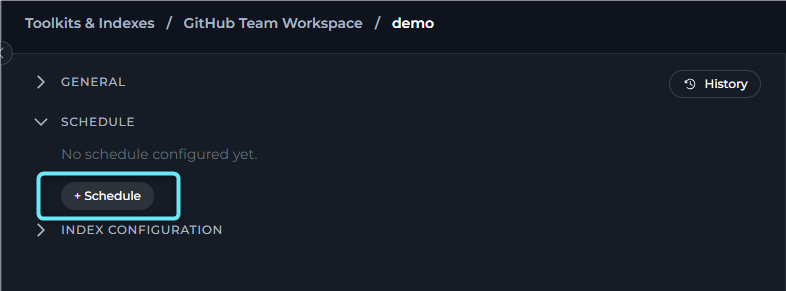
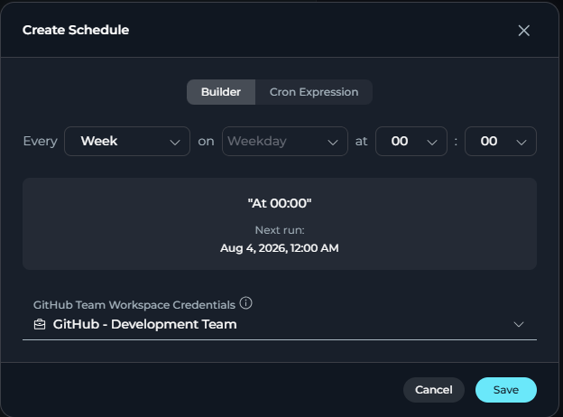
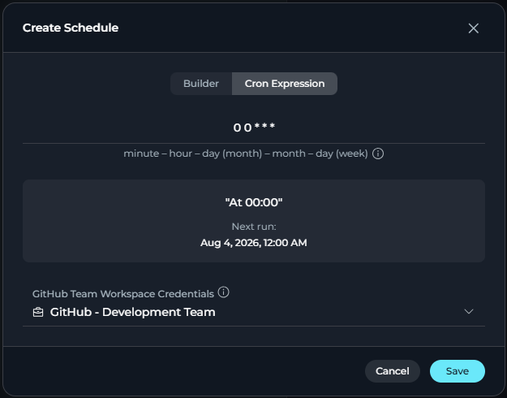
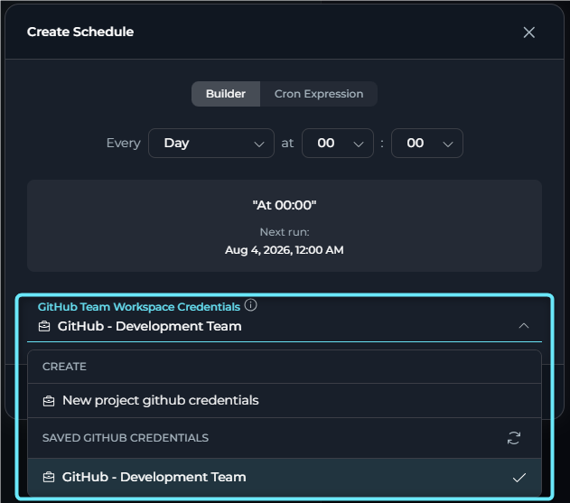
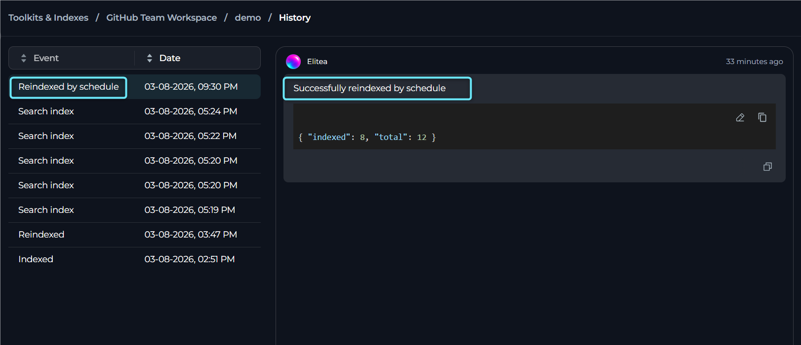
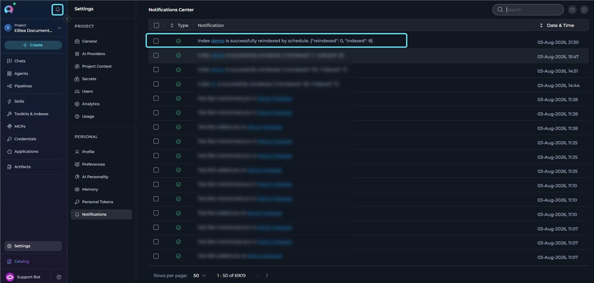
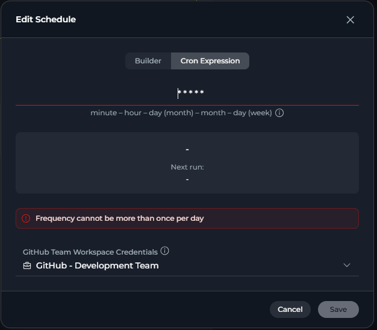
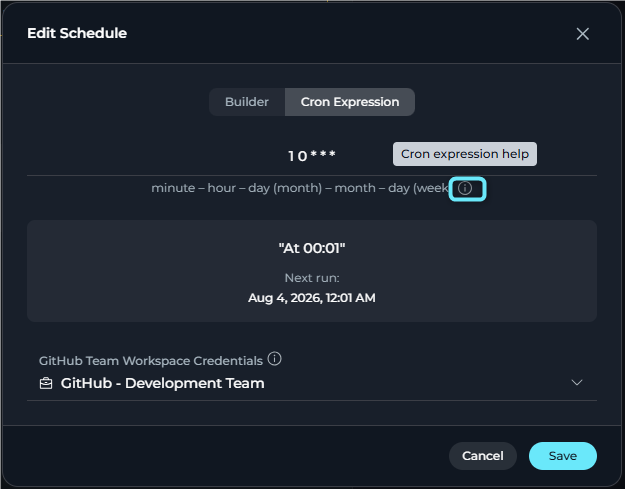

## Introduction

**Why use scheduled indexing:**

- **Automated data freshness**: Keep indexes up-to-date automatically as source data evolves.
- **Reduced manual overhead**: Eliminate the need for manual reindexing operations.
- **Consistent synchronization**: Maintain predictable sync schedules across multiple indexes.
- **Resource optimization**: Schedule updates during off-peak hours to minimize system impact.
- **User-specific schedules**: Each user can configure independent schedules for the same index.

---

## Prerequisites

Before configuring scheduled indexing, ensure the following requirements are met:

<CardGroup cols={2}>
      <Card title="Successful Index Creation" icon="circle-check">
            An index must already exist before scheduling can be configured.
      </Card>
      <Card title="Appropriate Permissions" icon="user-shield">
            You must have permission to modify toolkit and index scheduling settings.
      </Card>
      <Card title="Valid Index State" icon="signal">
            Scheduling is available only when the index is in a usable state. Indexes in **cancelled** or **failed** state must be reindexed successfully before a schedule can be turned on.
      </Card>
      <Card title="Personal Access Token" icon="key">
            At least one valid, non-expired ELITEA personal access token is required for scheduled indexing operations. The token must still be valid at the time of scheduled execution. If all your tokens are expired, scheduled reindexing operations will fail. To manage your tokens, go to **User Settings** > **[Personal Access Tokens](../../getting-started/create-personal-access-token)**.
      </Card>
      <Card title="Credentials Configuration" icon="id-card">
            If the toolkit requires credentials, you must select or create a valid credential configuration before turning on the schedule. Only credentials matching the project type are available: private project credentials for private projects, and team project credentials for team projects.
      </Card>
</CardGroup>

---

## Configure Scheduled Indexing

### Access Index Actions

1. **Open the Indexes section**: Expand the **INDEXES** section in the toolkit configuration page.
2. **Select an existing index** to open its dedicated index page.
       

### Configure Cron Expression

1. **Open Schedule Settings**:
      - If no schedule exists yet, select **+ Schedule**.
      - If a schedule already exists, select the **edit** icon on the schedule card.
       
2. **Choose Schedule Type**:
      - **Builder**: Visual cron builder with interactive controls.
      - **Cron Expression**: Manual text input for a cron expression.

<Info>
**Default Schedule**

When first configured, the schedule defaults to `0 0 * * 6` (Every Saturday at midnight).
</Info>

      **Builder mode**:

      - Use the visual builder to configure the schedule.
      - The cron expression is generated automatically as you make selections.
      - The preview updates in real time.
             

      **Cron Expression mode**:

      - Enter a cron expression directly in the text field (for example, `0 2 * * *`).
      - Format guide shown below: `minute – hour – day (month) – month – day (week)`.
      - Select the **info icon** to open [crontab.guru](https://crontab.guru) for help.
      - The preview and validation update as you type.
             

3. **Configure Credentials** (if required):
      - Some toolkits require credentials for scheduled indexing.
      - If required, a **credentials dropdown** appears below the cron configuration.
      - Select an existing credential configuration or create a new one.
      - **Available credentials are filtered by project type**:
          - If you are in a **Private Project**, only private project credentials are shown.
          - If you are in a **Team Project**, only team project credentials are shown.
      
4. **Save Changes**: Select **Save** to store the cron expression and credentials.

       <video src="../../img/how-tos/indexing/indexes/scheduling-index.mp4" controls></video>

<Info>
**Review History**

Scheduled reindexing operations appear in the History page with the label "Reindexed."

</Info>

### Schedule Card

The **Schedule** section on the index page shows the current schedule state for the selected index.

When a schedule exists, the schedule card displays the following information and actions.

**Information about the schedule:**

- The human-readable schedule summary.
- The next scheduled run date.
- The selected credentials, when credentials are required.

**Actions available for the schedule:**

- Edit the schedule configuration.
- Delete the schedule.
- Turn the schedule on or off.


### Schedule Notifications

You receive notifications for all indexing operations (initial indexing, manual reindexing, and scheduled reindexing).

**Successful operations:**

- **Icon**: Green success checkmark.
- **Message format**:
    - Initial indexing: `Index {name} is successfully created: { "indexed": X }`.
    - Reindex (manual): `Index {name} is successfully reindexed. { "reindexed": X, "indexed": Y }`.
    - Reindex (scheduled): `Index {name} is successfully reindexed by schedule. { "reindexed": X, "indexed": Y }`.
- **Action**: Select the notification to go to the index page in the **Indexes** section.

**Failed operations:**

- **Icon**: Red error icon.
- **Message**: `Index {name} is failed.`
- **Note**: This applies to both initial indexing failures and reindexing failures.
- **Action**: Select the notification to view the index and check error details in the History page.

**Notification details:**

- Notifications appear in the notifications panel (bell icon in top navigation).
- Each notification shows the relative time (for example, "2 minutes ago," "1 hour ago").
- Selecting a notification goes directly to the specific index page in the **Indexes** section.
- Scheduled operations are clearly marked with "by schedule" text.



---

## Cron Expressions

Scheduled indexing uses **cron expressions** to define when automatic reindexing occurs. A cron expression consists of five space-separated fields:

```
minute   hour   day(month)   month   day(week)
  *       *         *          *         *
```

**Cron field definitions**

| Position | Field | Allowed values | Special characters |
|----------|-------|----------------|-------------------|
| 1 | Minute | 0-59 | `*` `,` `-` `/` |
| 2 | Hour | 0-23 | `*` `,` `-` `/` |
| 3 | Day of month | 1-31 | `*` `,` `-` `/` |
| 4 | Month | 1-12 | `*` `,` `-` `/` |
| 5 | Day of week | 0-7 (0 and 7 = Sunday) | `*` `,` `-` `/` |

**Special characters:**

- **`*`** (asterisk): Matches any value (for example, `*` in the hour field means "every hour").
- **`,`** (comma): Lists multiple values (for example, `1,15` in the day field means "1st and 15th").
- **`-`** (hyphen): Defines a range (for example, `9-17` in the hour field means "9 AM to 5 PM").
- **`/`** (slash): Specifies step values (for example, `*/2` in the hour field means "every two hours").

**Frequency limitations**

Scheduled reindexing cannot run more frequently than once per day.

Use daily or less frequent schedules to avoid unnecessary resource usage:



**Minimum supported frequency:** `0 0 * * *` (once per day at midnight) or less frequent.

---

## Common Schedule Patterns

The following table lists verified schedule patterns for typical reindexing scenarios:

| Pattern | Cron expression | Description |
|---------|----------------|-------------|
| **Default** | `0 0 * * 6` | Every Saturday at midnight (00:00) |
| **Daily midnight** | `0 0 * * *` | Every day at midnight (00:00) |
| **Daily 2 AM** | `0 2 * * *` | Every day at 2:00 AM |
| **Weekdays 6 AM** | `0 6 * * 1-5` | Monday through Friday at 6:00 AM |
| **Weekly Sunday** | `0 0 * * 0` | Every Sunday at midnight |
| **Monthly 1st** | `0 0 1 * *` | First day of each month at midnight |
| **Quarterly** | `0 0 1 1,4,7,10 *` | First day of January, April, July, October at midnight |

<Tip title="Testing Your Cron Expression">
Use [crontab.guru](https://crontab.guru) to validate and understand cron expressions. The system also provides real-time validation and human-readable descriptions when you configure schedules. You can also select the **info icon** in the Schedule Settings modal to quickly access crontab.guru.


</Tip>

---

## Manage Schedules

**Edit schedules**

To modify an existing schedule:

1. **Open Schedule Settings**: Select the edit icon on the schedule card.
2. **Update Cron Expression**: Enter the new expression in the modal.
3. **Validate & Save**: Ensure the expression is valid, then select **Save**.
4. No notification is shown for cron expression updates (only for enable/disable).

**Pause schedules**

To temporarily pause scheduled reindexing without removing the schedule configuration:

1. Turn off the **Schedule** toggle on the schedule card.
2. The saved cron expression and selected credentials remain attached to the schedule.
3. When the schedule is turned off, the page shows a banner with the message **"Schedule is turned off."**
4. To resume scheduled reindexing, turn the toggle back on.


---

## Real-Life Example: Daily GitHub Repository Indexing

<Accordion title="Daily GitHub Repository Example">
This example demonstrates how to set up automated daily reindexing for a GitHub repository index to keep code and documentation searches current.

**Scenario**

**Goal**: Keep a GitHub repository index updated daily at 2:00 AM to reflect new commits, pull requests, and documentation changes.

**Index details:**

- **Toolkit**: GitHub toolkit for `ProjectAlita/projectalita.github.io` repository.
- **Index name**: `docs`.
- **State**: Successfully created and completed.
- **Desired schedule**: Daily at 2:00 AM (during off-peak hours).

**Step-by-step configuration**

**1. Access the index:**

- Go to **Toolkits** > select the **GitHub (ProjectAlita/projectalita.github.io)** toolkit.
- Open the **Indexes** section.
- Select the **docs** index from the sidebar.

**2. Turn on scheduling:**

- Find the **Schedule** section on the index page.
- Select the **toggle switch** to turn on scheduling.
- Confirm the success notification that the schedule was turned on.

**3. Configure daily 2 AM schedule:**

1. Select the **edit** icon on the schedule card.
2. The Schedule Settings modal opens showing the schedule.
3. **Choose a configuration method:**

      **Option A: Builder mode**:

      - Select **Builder** schedule type (if not already selected).
      - Use the builder controls to configure the schedule for daily execution at 2:00 AM.
      - The cron expression `0 2 * * *` is generated automatically.
      - Verify the preview shows the expected schedule summary.

      **Option B: Cron Expression mode**:

      - Select **Cron Expression** schedule type.
      - Clear the input and enter: `0 2 * * *`.
      - Verify the preview updates to the expected schedule summary.

4. Select **Save** to store the schedule.

**4. Verify configuration:**

1. **Toggle state**: Confirmed on.
2. **Cron expression**: `0 2 * * *` (verified by reopening the schedule modal).
3. **Schedule active**: Automatic reindexing occurs daily at 2:00 AM.

**Expected behavior**

**Daily at 2:00 AM:**

1. The system automatically triggers a reindexing operation for the `docs` index.
2. The index state changes to `in_progress` during the operation.
3. Progress is tracked and visible in the index interface.
4. Upon completion, the index state returns to `completed`.
5. A new entry appears in the **History** tab with label "Reindexed" and the timestamp.
6. A notification is sent:
   - **Success**: `Index docs is successfully reindexed by schedule. { "reindexed": X, "indexed": Y }`.
   - **Failure**: `Index docs is failed.`

**History page entry:**

```
Event: Reindexed
Date: 2025-11-25, 02:00 AM
```

**Notification received:**

```
Index docs is successfully reindexed by schedule.
{ "reindexed": 15, "indexed": 120 }
2 minutes ago
```

**Result:**

Your team can ask questions about the codebase and documentation using the most recent repository content, with automatic updates every day without manual intervention.
</Accordion>

---

## Troubleshooting

<Accordion title="Schedule Toggle Is Disabled">
**Symptom**: The Schedule toggle switch is grayed out and cannot be selected.

**Causes and solutions:**

| Cause | Solution |
|-------|----------|
| Index state is `cancelled` | Select **Reindex** to restart indexing, then turn on the schedule. |
| Index state is `failed` | Review error logs, fix the issue, reindex successfully, then turn on the schedule. |
| Insufficient permissions | Contact the project administrator for toolkit modification permissions. |
</Accordion>

<Accordion title="Cron Expression Validation Errors">
**Common validation errors and how to fix them:**

| Error message | Cause | Solution |
|---------------|-------|----------|
| "Cron expression is required" | Empty or null input | Enter a valid five-field cron expression. |
| "Cron must have exactly 5 parts with space between every part" | Incorrect number of fields | Ensure exactly five space-separated fields. |
| "Invalid minute (0-59, *, ranges, lists, steps allowed)" | Minute value out of range or invalid format | Use values 0-59 or valid special characters. |
| "Invalid hour (0-23, *, ranges, lists, steps allowed)" | Hour value out of range or invalid format | Use values 0-23 or valid special characters. |
| "Invalid day (1-31, *, ranges, lists, steps allowed)" | Day value out of range or invalid format | Use values 1-31 or valid special characters. |
| "Invalid month (1-12, *, ranges, lists, steps allowed)" | Month value out of range or invalid format | Use values 1-12 or valid special characters. |
| "Invalid weekday (0-7 where 0,7=Sunday, *, ranges, lists, steps allowed)" | Weekday value out of range or invalid format | Use values 0-7 or valid special characters. |
| "Frequency cannot be less than every day" | Schedule would trigger more than once per day | Use patterns with minimum one-day intervals. |
| "Invalid hour step value. Step cannot be 0." | Hour step value is 0 | Use a non-zero step value (for example, `*/2` instead of `*/0`). |
</Accordion>

<Accordion title="Schedule Not Executing">
**Symptom**: The schedule is turned on, but reindexing is not occurring at the configured time.

**Troubleshooting steps:**

1. **Verify cron expression**:
      - Open Schedule Settings and check the cron expression.
      - Use [crontab.guru](https://crontab.guru) to verify the expression matches your intent.
      - Ensure the expression is not in the past (for example, a specific date or time that has passed).

2. **Check index state**:
      - Ensure the index state is `completed`, not `failed` or `cancelled`.
      - If the state is invalid, manually reindex and then turn on the schedule again.

3. **Confirm toggle is turned on**:
      - Verify the Schedule toggle is on (blue).
      - If it is off, turn it on again.

4. **Review system logs** (if accessible):
      - Check for backend errors during scheduled execution.
      - Look for quota limitations or resource constraints.

5. **Time zone considerations**:
      - Cron expressions execute in the server time zone.
      - Verify the server time zone matches your expectations.
</Accordion>

<Accordion title="Schedule Turned On but No Notification">
**Symptom**: When updating the cron expression, no success notification appears.

**Expected behavior**: This is expected. Success notifications only appear when **turning on or turning off** the schedule toggle, not when modifying the cron expression or credentials.

**To verify configuration:**

- Reopen the Schedule Settings modal.
- Confirm the cron expression shows your updated value.
- Confirm credentials are selected (if required).
</Accordion>

<Accordion title="Cannot Turn On Schedule — Credentials Required">
**Symptom**: The Schedule toggle is turned off with the tooltip "Set credentials to turn on scheduling."

**Cause**: The toolkit requires credentials for scheduled indexing operations.

**Solution:**

1. Select the **edit** icon on the schedule card.
2. In the Schedule Settings modal, scroll down to the **credentials selector**.
3. Select an existing credential configuration from the dropdown (only credentials matching your project type are shown), or
4. Select **+ Create new** to create a credential configuration.
5. Select **Save** to store the changes.
6. The Schedule toggle is now turned on.

**Note**: The credentials dropdown only shows credentials that match your project type:

- **Private project**: Only private project credentials are available.
- **Team project**: Only team project credentials are available.
</Accordion>

<Accordion title="Save Button Disabled in Schedule Settings">
**Symptom**: The **Save** button in the Schedule Settings modal is grayed out.

**Causes and solutions:**

| Cause | Solution |
|-------|----------|
| Invalid cron expression | Check the error message and correct the expression. |
| Required credentials not selected | Scroll down and select a credential configuration. |
| Toolkit schema still loading | Wait for the loading to complete. |
</Accordion>

<Accordion title="Scheduled Reindexing Fails — Token Error">
**Symptom**: Scheduled reindexing operations fail and you receive error notifications.

**Cause**: No valid ELITEA personal access token is available, or all tokens have expired.

**Solution:**

1. Go to **User Settings** > **Personal Access Tokens**.
2. Check if you have any active (non-expired) tokens.
3. If all tokens are expired or no tokens exist:
      - Select **Generate New Token**.
      - Provide a token name and expiration date.
      - Save the token.
4. Return to the **Indexes** section and verify the schedule is still turned on.
5. Wait for the next scheduled execution or manually trigger a reindex to test.

**Prevention**: Review your personal access tokens regularly and generate new ones before existing tokens expire to avoid disruption to scheduled operations.
</Accordion>

---

## Limitations

| Limitation | Description |
|------------|-------------|
| **Minimum frequency** | Schedules cannot execute more frequently than once per day. |
| **User-specific schedules** | Schedules are per user; there is no shared or global schedule for all users. |
| **Single schedule per user per index** | Each user can only configure one schedule per index. |
| **Credentials stored per schedule** | If credentials are required, they are stored with the schedule and used for all scheduled runs. |
| **No schedule history** | The system does not maintain a history of schedule configuration changes. |
| **No concurrent execution protection** | If a scheduled run is in progress when the next trigger occurs, behavior is undefined. |
| **Time zone** | Schedules execute in the server time zone, not the user's local time zone. |
| **No advanced scheduling options** | No support for date ranges (for example, only reindex between January 1 and March 31), conditional schedules (for example, only if data has changed), retry logic on failure, or schedule dependencies between indexes. |
| **Schedule turns off after index failure** | If a manually triggered or scheduled reindexing fails, the schedule is automatically turned off and must be manually turned on again after fixing the issue. |
| **Notification for result only** | Notifications are sent when reindexing completes (success) or fails (error), but there is no notification when a scheduled reindexing starts. Check the index status or History tab to monitor ongoing operations. |

---

## Best Practices

<Accordion title="Choose the Right Schedule">
1. **Data change frequency**: Match the schedule to how often your source data changes.
      - **Rapidly changing data** (for example, active repositories): Daily.
      - **Moderately changing data** (for example, documentation wikis): Weekly.
      - **Slowly changing data** (for example, archived content): Monthly.

2. **Off-peak hours**: Schedule during low-usage periods.
      - Early morning (for example, 2:00 AM to 5:00 AM).
      - Weekends (for example, Saturday or Sunday midnight).
      - Avoid business hours to prevent performance impact on users.

3. **Resource considerations**:
      - Larger indexes take longer to reindex.
      - Consider system load and concurrent operations.
      - Stagger schedules for multiple indexes to avoid simultaneous heavy operations.

4. **User needs vs. system load**:
      - Balance data freshness requirements with system resources.
      - Do not schedule more frequently than necessary.
</Accordion>

<Accordion title="Manage Multiple Schedules">
When managing schedules across multiple indexes:

1. **Stagger execution times**: Avoid scheduling multiple indexes at the same time.
      - Index A: `0 2 * * *` (daily at 2:00 AM).
      - Index B: `0 4 * * *` (daily at 4:00 AM).
      - Index C: `0 6 * * *` (daily at 6:00 AM).

2. **Group by priority**:
      - Critical indexes: More frequent schedules.
      - Reference indexes: Less frequent schedules.

3. **Document your schedules**: Maintain a reference document listing all configured schedules for coordination.
</Accordion>

<Accordion title="Monitor & Maintain">
1. **Regular review**: Check the History tab periodically to verify schedules are executing successfully.
2. **Update schedules as needed**: Adjust cron expressions when data change patterns evolve.
3. **Remove unused schedules**: Turn off schedules for indexes that are no longer actively used.
4. **Test before production**: Validate schedule configuration with a test index before applying to production indexes.
</Accordion>

---

<Info>
**Guides & References**

- [Create & Use Indexes](./using-indexes-tab-interface) — Comprehensive guide to the **Indexes** section and index pages.
- [Indexing Overview](./indexing-overview) — General indexing concepts and architecture.
- [Toolkits Menu](../../menus/toolkits) — Guide to the Toolkit menu interface.
</Info>

---
