## Key Features

<CardGroup cols={2}>
     <Card title="Visual Status Indicators" icon="signal">
          Real-time identification of index states, including in-progress, completed, partly indexed, failed, and stopped.
     </Card>
     <Card title="Dedicated Pages" icon="window-maximize">
          Separate pages for creating a new index, working with an existing index, and reviewing index history.
     </Card>
     <Card title="Real-time Progress Monitoring" icon="arrows-rotate">
          Live updates during index creation and updates with conversation recovery.
     </Card>
     <Card title="Detailed Indexing Results" icon="list-check">
          Structured per-category breakdown of indexed and skipped files after each operation.
     </Card>
     <Card title="Automated Scheduling" icon="calendar-days">
          Configure periodic reindexing using cron expressions for hands-free maintenance.
     </Card>
     <Card title="Multiple Search Tools" icon="magnifying-glass">
          Access Search Index, Stepback Search Index, and Stepback Summary Index when those tools are turned on for the toolkit.
     </Card>
</CardGroup>

---

## Prerequisites

Before using the Indexes, ensure the following requirements are met:

### Project-Level Configuration

1. **PgVector Configuration**: Vector storage must be configured at the project level.
      - In **Settings**, select **[AI Configuration](../../menus/settings/ai-configuration)**.
      - Configure PgVector connection settings.
      - Verify the connection is active.

2. **Embedding Model Configuration**: An embedding model must be selected.
      - In **Settings**, select **[AI Configuration](../../menus/settings/ai-configuration)**.
      - Select and configure an embedding model.
      - Test model availability.

<Warning title="Access Control">
When project-level prerequisites are missing, the **Indexes** section displays the message **"Indexing is not available for now"**. Configure both **PgVector** and an **Embedding Model** before using indexing features.
</Warning>

### Toolkit Configuration

**Supported Toolkit**: Ensure you are working with a toolkit that supports indexing:

| Category | Supported Toolkits |
|----------|-------------------|
| **Repos** | [ADO Repos, Bitbucket, GitLab, GitHub](./index-github-data) |
| **Wikis** | [ADO Wiki](./index-ado-wiki-data), [Confluence](./index-confluence-data), [SharePoint](./index-sharepoint-data) |
| **Issues** | ADO Boards, ADO Plans, [Jira](./index-jira-data) |
| **Files** | [Artifact](./index-artifacts-data), [SharePoint](./index-sharepoint-data) |
| **Designs** | [Figma](./index-figma-data) |
| **Tests** | [TestRail](./index-testrail-data), [Xray Cloud](./index-xray-data), [Zephyr Enterprise, Zephyr Essential, Zephyr Scale](./index-zephyr-data) |

**Toolkit Tools**: Turn on indexing tools in your toolkit configuration:

| Tool | Status | Description |
|------|--------|-------------|
| **Index Data** | Required | For creating indexes |
| **Search Index** | Required | For search functionality |
| **Stepback Search Index** | Optional | For advanced search |
| **Stepback Summary Index** | Optional | For summarized search results |
| **List Indexes** | Optional | For viewing available indexes |
| **Remove Index** | Optional | For index cleanup |

<Warning title="Indexing section Availability">
If the **Index Data** tool is not turned on in the toolkit configuration, the **Indexes** section displays the message **"Indexing is not available for now"**. Turn on **Index Data** before using indexing features.
</Warning>

---

## Access the Indexes Interface

1. Open a toolkit that supports indexing.
2. In the toolkit **Configuration** page, expand the **Indexes** section.
3. Use the left-side index list to create a new index or open an existing one.

      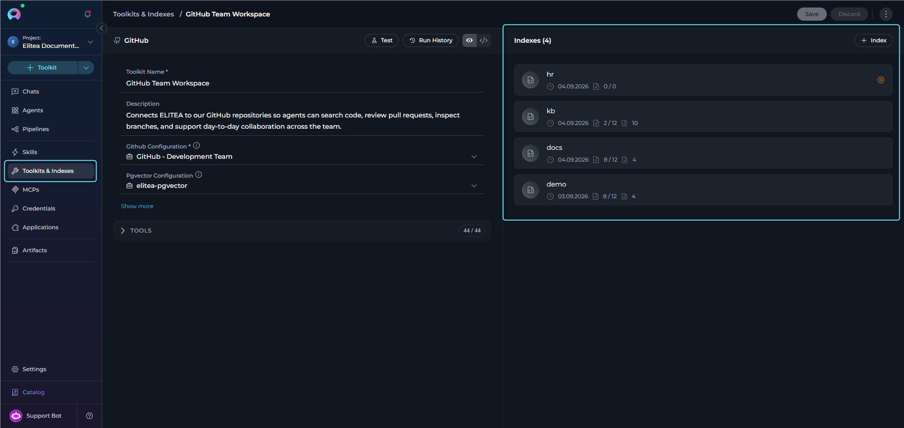

If the **Indexes** section is turned off or not visible, verify that your project-level prerequisites are properly configured and that the **Index Data** tool is turned on for the toolkit.

---

## Create a New Index

1. In the index section, select **+ Index**.
2. A dedicated **New index** page opens with breadcrumb navigation and an **Index configuration** accordion.
3. Fill in the required fields for the **Index Data** tool.

The **Index Data** form includes required and toolkit-specific parameters such as:

| Parameter | Description | Example |
|-----------|-------------|---------|
| **Index Name** | Unique collection name for the index. It must be unique within the toolkit and cannot start or end with whitespace. | `docs`, `prod`, `v1` |
| **Progress Step** | Progress reporting interval (0-100). | `10` |
| **Clean Index** | Remove existing data before indexing. | ✓ or ✗ |
| **Chunking Config** | Document chunking configuration. | `{}` (default) |
| **Skip Unsupported Extensions** | Skip files with unsupported extensions (default: **turned on**). When turned off, unsupported files fall back to plain-text chunking instead of being skipped. | ✓ (default) |

      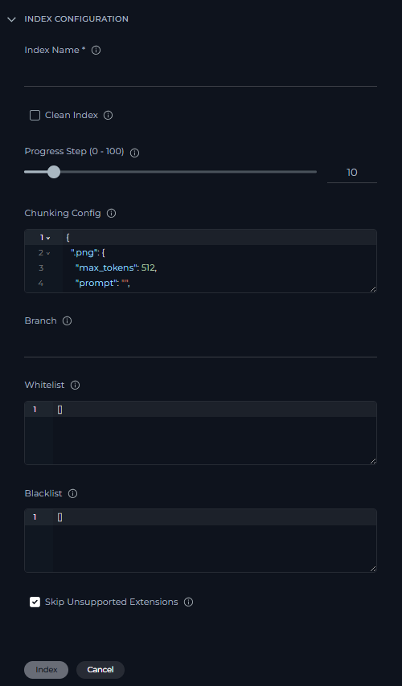

<Tip title="Toolkit-Specific Settings">
Different toolkits require different parameters. For example:

- **GitHub**: Repository name, branch, file patterns
- **Confluence**: Space key, page filters
- **Jira**: JQL queries, field extraction settings
- **TestRail**: Project ID, suite filters

Refer to toolkit-specific documentation for detailed parameter information.
</Tip>

The **Index** button remains turned off until the form is valid.

4. Select **Index** to start indexing, or **Cancel** to return.
5. After the run starts, the UI navigates to the dedicated page for that index and begins tracking progress there.

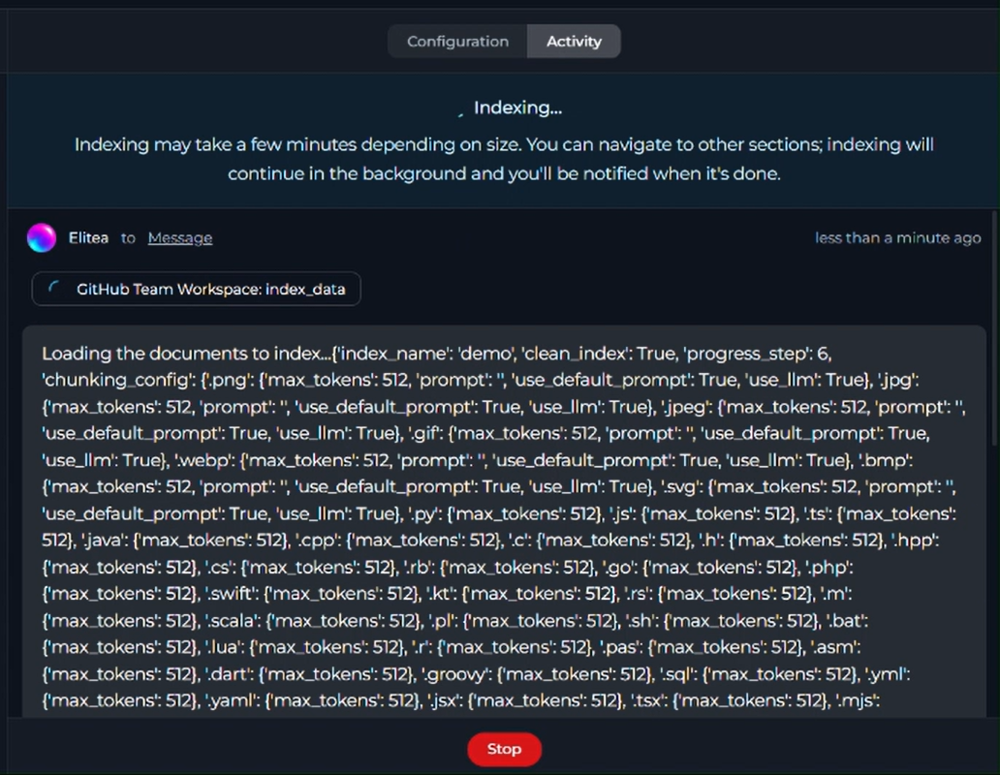

6. When indexing completes, the index enters **Completed** or **Partially Indexed** state and becomes available for search, scheduling, configuration review, reindexing, history review, and deletion.

 <video controls>
   <source src="../../img/how-tos/indexing/indexes/create-index.mp4" type="video/mp4"/>
   Your browser does not support the video tag.
 </video>

<Note title="Partially Indexed vs Failed">
An index with **Partially Indexed** status is fully usable—search tools and scheduling work normally. It means that some files were skipped during the operation (for example, binary or archive files with unsupported extensions). Review the **Indexing Results** section in the chat panel to see exactly which files were skipped and why.
</Note>

## Index Page Details

When you open an index, the dedicated page displays the current state, metadata, controls, and results for that index.

**General section**

The **General** section displays the index name with the index icon, the created date, and the initial **Files indexed** and **Files skipped** counts. It also provides the main index actions, including **Reindex** and **Delete Index** when the user has permission to delete indexes.

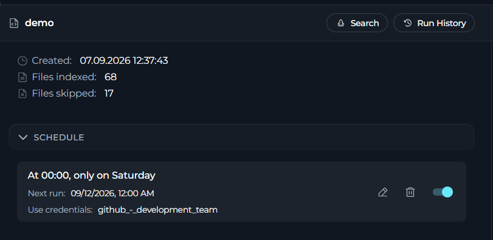

**Schedule section**

The **Schedule** section shows whether a schedule is configured for the index. When no schedule exists, it displays a placeholder and a **+ Schedule** action. When a schedule exists, it shows the schedule summary, the next run date, the selected credentials, edit and delete actions, and the enable or disable switch. If the schedule exists but is turned off, the page also displays a dedicated banner.

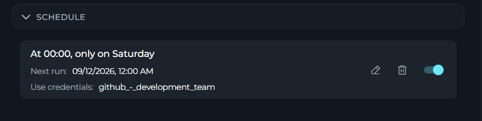

**Index configuration section**

The **Index configuration** section loads the stored **Index Data** settings for the current index. The `index_name` field remains non-editable, while the other configuration fields stay editable and can be adjusted before running a reindex.

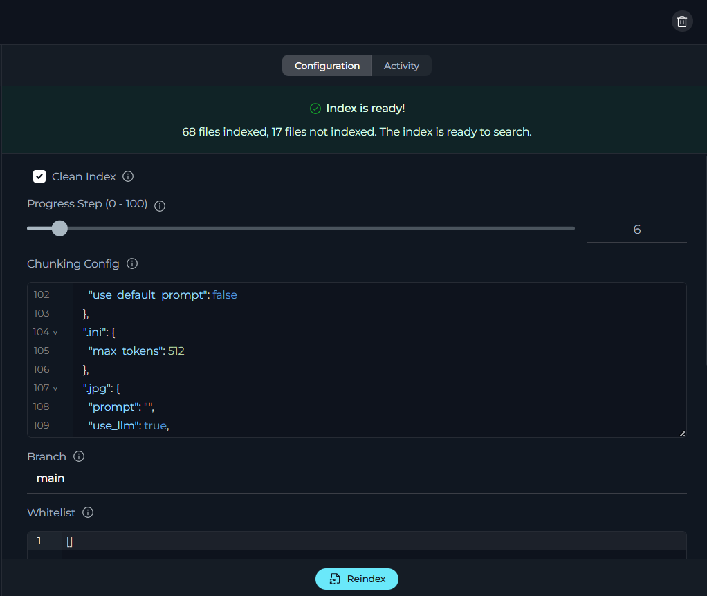

### Index Card Summary

On the toolkit detail page, the **Indexes** section displays index cards for the current toolkit. Each card provides a compact summary of the index together with quick actions.

The card shows the **collection name**, **created date**, **indexed / total file count**, and, when applicable, the **skipped file count**. For non-completed states, it also displays a **status icon**. On hover, the card exposes actions to **open the index page**, **reindex**, or **delete** the index.

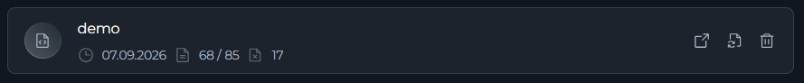

<Check title="Indexing Notifications">
You will receive notifications for all indexing operations (initial indexing and reindexing):

- **Success**: Green checkmark icon with message showing indexed/reindexed counts
- **Partially Indexed**: Warning notification with a summary of skipped-file categories and counts
- **Failure**: Red error icon with failure message
- **Scheduled Operations**: Marked with "by schedule" text
- **Action**: Select any notification to navigate directly to the index

Notifications appear in the notifications panel.

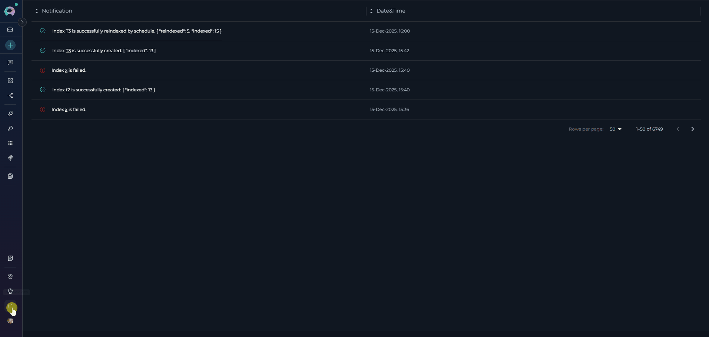
</Check>

---

## Manage Existing Indexes

Select any index card on the toolkit detail page to open its dedicated index page. From there you can reindex, stop an active run, configure a schedule, view history, and delete the index.

### Reindex

To trigger a manual reindex, select **Reindex** in the **General** section. A confirmation dialog appears—confirm to start the run.

Before confirming, you can adjust the configuration fields in the **Index configuration** section. Those values are used for the reindex run. The `index_name` field cannot be changed.

During reindexing, the system compares incoming content with the data already stored for the index. Files that are unchanged are not duplicated, while files whose content or source update timestamp changed are refreshed so the stored index stays current. In practice, this means partially indexed or previously outdated files are processed again on the next reindex to restore a complete and up-to-date result.

After the index has been reindexed successfully at least once, the **General** section also shows a separate reindex summary with **Last reindex**, **Files reindexed**, and the skipped-file count for the latest reindex run.

### Skipped File Categories

The following table describes the categories of files that may be skipped during indexing:

| Category | Description |
|----------|-------------|
| **Supported extensions** | The SDK supports Markdown (`.md`, `.markdown`, `.mdown`, `.mkd`, `.mdx`), JSON (`.json`, `.jsonl`, `.jsonc`), config files (`.yml`, `.yaml`, `.toml`, `.ini`, `.cfg`, `.conf`, `.env`), text/data files (`.txt`, `.xml`, `.html`, `.htm`, `.csv`), and code files such as `.py`, `.js`, `.jsx`, `.mjs`, `.cjs`, `.ts`, `.tsx`, `.java`, `.kt`, `.rs`, `.go`, `.cpp`, `.c`, `.cs`, `.hs`, `.rb`, `.scala`, `.lua`, `.sh`, `.bash`, `.zsh`, `.sql`, `.r`, `.swift`, `.php`, `.pl`, `.pm`, `.h`, `.hpp`, `.m`, `.bat`, `.pas`, `.asm`, `.dart`, and `.groovy`. Files with extensions outside this set are treated as unsupported when **Skip Unsupported Extensions** is turned on. |
| **Whitelist filtered** | File path did not match the configured whitelist pattern. |
| **Blacklist filtered** | File path matched the configured blacklist pattern and was excluded. |
| **Empty content** | File exists but contains no indexable text. |
| **Read error** | File could not be read due to permissions or corruption. |
| **Runtime error** | Unexpected error during processing. |

<Tip title="Handle Unsupported Files">
To index files with unsupported extensions (for example, plain-text configuration files with a custom extension), turn off the **Skip Unsupported Extensions** parameter when creating the index. Files with unsupported extensions will then be processed using plain-text chunking instead of being skipped.
</Tip>

<Info title="Long Skip Lists">
When more than five files are skipped in a single category, the results summary shows the first five file names followed by a "... X more" indicator. The full list is stored in the index metadata and accessible via the API.
</Info>

<video src="../../img/how-tos/indexing/indexes/reindex.mp4" controls></video>

<Warning title="Reindex Replaces Current Data">
Reindexing replaces all current index data and cannot be undone once started.
</Warning>

### Schedule

To configure automated reindexing, use the **Schedule** section on the index page.

- Select **+ Schedule** to create a new schedule. Set the cron expression using the builder or manual input, and select the credentials to use for scheduled runs.
- Once a schedule exists, use the **edit** icon to update it, the **delete** icon to remove it, and the toggle switch to turn it on or off without deleting it.
- The section shows the schedule summary, the next run date, and the selected credentials at a glance.

<video src="../../img/how-tos/indexing/indexes/scheduling-index.mp4" controls></video>

<Info title="Schedule Availability">
Scheduling is available only for indexes in **Completed** or **Partially Indexed** state. Indexes in **Failed** or **Stopped** state cannot be scheduled.
</Info>

<Tip title="Detailed Scheduling Documentation">
For comprehensive information about scheduling features, cron expressions, troubleshooting, and best practices, see [Schedule Indexing](./schedule-indexing).
</Tip>

### View History

The **History** button is available in the index page header. It opens the dedicated History page for that index. The button is turned off when no history exists yet or when an active run is in progress.

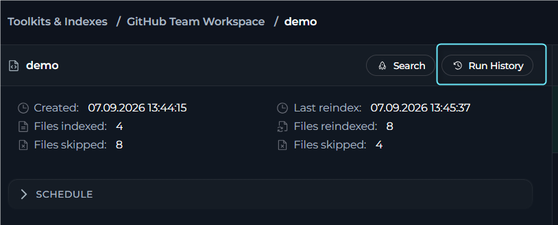

<Warning title="History Limitations">
- Schedule configuration changes are not tracked in the history.
- History is permanently deleted when an index is removed.
</Warning>

### Delete Indexes

**Delete process:**

1. Open the index you want to delete.
2. Select **Delete**.
3. Enter the index name in the confirmation dialog.
4. Confirm the deletion.
5. The index and its associated data are permanently removed, and the UI returns to the toolkit detail page.

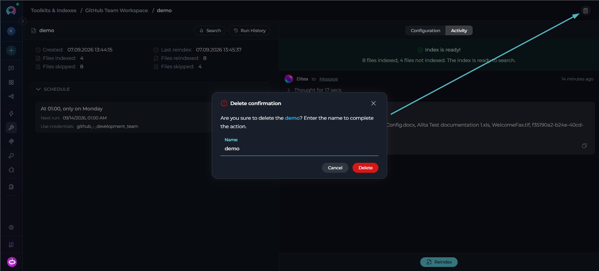

<Warning title="Deletion Warning">
Index deletion is **permanent** and **cannot be undone**. All indexed data, search history, and configurations are permanently removed.
</Warning>

---

## Use Search Tools

The following prerequisites must be met before using search tools:

<Info>
**Prerequisites for Search**

- **Successful Index**: Indexes with **Completed** or **Partially Indexed** status both support search operations. Failed and stopped indexes do not.
- **Turned-on Search Tools**: At least one search tool (Search Index, Stepback Search Index, or Stepback Summary Index) must be turned on in toolkit configuration.
</Info>

The following search tools are available:

| Tool | Description |
|------|-------------|
| **Search Index** | Basic semantic search across indexed content |
| **Stepback Search Index** | Advanced search that breaks down complex questions |
| **Stepback Summary Index** | Search with automatic summarization of results |

**Select a search tool:**

1. Open an index page.
2. In the left panel, select **Select tool**.
3. Choose a search tool from the dropdown list.
4. The page switches from the initial state to the selected tool settings.

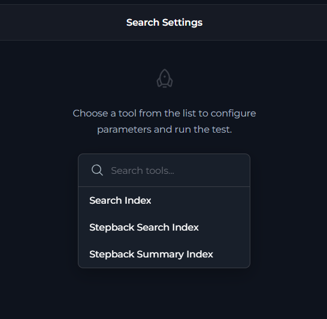

### Stepback Summary Index

**Configuration:**

1. **Select Tool**: Choose "Stepback Summary Index" from the search tool options.
2. **Configure Search Parameters**:

     | Parameter | Description | Example |
     |-----------|-------------|---------|
     | **Query** | Required search query for the selected index | `Summarize the deployment flow and list the required configuration steps` |
     | **Index Name** | Target index collection name used for the search | `docs`, `prod`, `v1` |
     | **Messages** | Conversation history for context-aware search | Previous chat messages |
     | **Filter** | Metadata filter as dictionary or JSON string | `{"category": {"$eq": "bug"}}`, `{"$and": [{"priority": {"$eq": "high"}}, {"status": {"$eq": "open"}}]}` |
     | **Cut Off (0 - 1)** | Relevance threshold for filtering results | `0.7` for high relevance, `0.3` for broader results |
     | **Search Top** | Maximum number of top results to return | `10`, `25`, `50` |
     | **Full Text Search** | Dictionary with full-text search configuration | `{"enabled": true, "weight": 0.3, "fields": ["content", "description"], "language": "english"}` |
     | **Extended Search** | List of chunk types to search | `["title", "summary", "propositions", "keywords", "documents"]` |
     | **Reranker** | Reranker configuration used to reorder retrieved results | `{"model": "cross-encoder", "top_k": 20}` |
     | **Reranking Config** | Dictionary with field-based reranking rules | `{"importance": {"weight": 3.0, "rules": {"contains": "critical"}}}`, `{"created_at": {"weight": 1.0, "rules": {"sort": "desc"}}}` |

3. Select **Search** to execute the search operation.
4. The page switches to the results view, where the chat panel displays the search output.

<video src="../../img/how-tos/indexing/indexes/stepback-summary-index.mp4" controls></video>

### Search Index

**Configuration:**

1. **Select Tool**: Choose "Search Index" from the search tool options.
2. **Configure Search Parameters**:

     | Parameter | Description | Example |
     |-----------|-------------|---------|
     | **Query** | Required search query for the selected index | `How do I create secrets in Elitea and what are the best practices for managing sensitive configuration data?` |
     | **Index Name** | Target index collection name used for the search | `docs`, `prod`, `v1` |
     | **Filter** | Metadata filter as dictionary or JSON string | `{"file_type": {"$eq": "markdown"}}`, `{"$and": [{"author": {"$eq": "john"}}, {"status": {"$eq": "active"}}]}` |
     | **Cut Off (0 - 1)** | Relevance threshold for filtering results | `0.7` for high relevance, `0.3` for broader results |
     | **Search Top** | Maximum number of top results to return | `10`, `25`, `50` |
     | **Full Text Search** | Dictionary with full-text search configuration | `{"enabled": true, "weight": 0.3, "fields": ["content", "title"], "language": "english"}` |
     | **Extended Search** | List of chunk types to search | `["title", "summary", "propositions", "keywords", "documents"]` |
     | **Reranker** | Reranker configuration used to reorder retrieved results | `{"model": "cross-encoder", "top_k": 20}` |
     | **Reranking Config** | Dictionary with field-based reranking rules | `{"severity": {"weight": 2.5, "rules": {"priority": "critical"}}}`, `{"file_type": {"weight": 1.5, "rules": {"contains": "test"}}}` |
     | **Output Fields** | Fields to include in the search response payload | `["page_content", "score", "metadata.source"]` |

**Execute search:**

1. **Activate Run Button**: The button becomes active when the form is valid.
2. **Run Search**: Execute the search operation.
3. **View Results**: The page switches to the results view, where the chat panel displays the search output.

### Stepback Search Index

**Configuration:**

1. **Select Tool**: Choose "Stepback Search Index" from the search tool options.
2. **Configure Search Parameters**:

     | Parameter | Description | Example |
     |-----------|-------------|---------|
     | **Query** | Required search query for the selected index | `Summarize the deployment flow and list the required configuration steps` |
     | **Index Name** | Target index collection name used for the search | `docs`, `prod`, `v1` |
     | **Messages** | Conversation history for context-aware search | Previous chat messages |
     | **Filter** | Metadata filter as dictionary or JSON string | `{"category": {"$eq": "bug"}}`, `{"$and": [{"priority": {"$eq": "high"}}, {"status": {"$eq": "open"}}]}` |
     | **Cut Off (0 - 1)** | Relevance threshold for filtering results | `0.7` for high relevance, `0.3` for broader results |
     | **Search Top** | Maximum number of top results to return | `10`, `25`, `50` |
     | **Full Text Search** | Dictionary with full-text search configuration | `{"enabled": true, "weight": 0.3, "fields": ["content", "description"], "language": "english"}` |
     | **Extended Search** | List of chunk types to search | `["title", "summary", "propositions", "keywords", "documents"]` |
     | **Reranker** | Reranker configuration used to reorder retrieved results | `{"model": "cross-encoder", "top_k": 20}` |
     | **Reranking Config** | Dictionary with field-based reranking rules | `{"importance": {"weight": 3.0, "rules": {"contains": "critical"}}}`, `{"created_at": {"weight": 1.0, "rules": {"sort": "desc"}}}` |

<Tip title="Result Actions">
- **Copy Results**: Copy search output for external use.
- **Export Data**: Save results in various formats.
- **Refine Search**: Modify parameters and search again.
- **Follow-up Questions**: Continue the conversation with additional queries.
</Tip>

---

## <Icon icon="triangle-exclamation" size={32} /> Troubleshooting

<Accordion title="Turned-Off Sections & Buttons">
**Indexes Section Turned Off:**

The **Indexes** section is automatically turned off if required prerequisites are not met. To access this section in your toolkit configuration, ensure:

- **PgVector Configuration**: Vector storage must be configured at project level (In **Settings**, select **AI Configuration**).
- **Embedding Model**: An embedding model must be selected and configured (In **Settings**, select **AI Configuration**).
- **Index Data Tool**: The **Index Data** tool must be turned on in your toolkit configuration.

**Solutions:**

1. **Verify Prerequisites**: Ensure PgVector and Embedding Model are configured.
2. **Check Toolkit Support**: Confirm the toolkit supports indexing.
3. **Review Permissions**: Verify the user has access to indexing features.
4. **Refresh Browser**: Clear the cache and reload the page.

**Delete Button Turned Off:**

The **Delete** button in the **Indexes** section or on an index page is turned off if the **Remove Index** tool is not selected in toolkit configuration. Turn on this tool to allow index deletion operations.

**Search Section Turned Off:**

The search area on the index page is turned off if at least one search index tool (**Search Index**, **Stepback Search Index**, or **Stepback Summary Index**) is not selected in toolkit configuration. It is also turned off for indexes with **Failed** or **Stopped** status—only **Completed** and **Partially Indexed** indexes support search. Turn on at least one search tool and ensure your index is in a searchable state to access search actions.

**Reindex Button Turned Off:**

The **Reindex** button is available from the index page when the index state and permissions allow it. If it is turned off, verify that you are on the index page, the index is not in an active run, and the current toolkit configuration supports reindexing.
</Accordion>

<Accordion title="Index Creation Failures">
**Symptoms:**

- Index creation process fails.
- Error notifications during indexing.
- Stuck in "in progress" state.

**Solutions:**

1. **Check Credentials**: Verify toolkit credentials are valid and accessible.
2. **Review Parameters**: Ensure all required parameters are provided.
3. **Data Source Access**: Confirm the data source is accessible and contains data.
4. **Resource Limits**: Check if data size exceeds system limits.
5. **Network Connectivity**: Verify a stable internet connection.

**Common Error Messages:**

| Error | Possible Cause | Solution |
|-------|---------------|----------|
| "Authentication failed" | Invalid credentials | Update toolkit credentials. |
| "Data source not found" | Incorrect source parameters | Verify repository/space/project names. |
| "Insufficient permissions" | Limited access rights | Grant appropriate permissions to the credential. |
| "Processing timeout" | Large dataset or slow connection | Reduce scope or increase timeout settings. |
</Accordion>

<Accordion title="Search Tool Issues">
**Symptoms:**

- Search tools not available.
- Run button remains turned off.
- No search results returned.

**Solutions:**

1. **Index Status**: Verify the index is successfully completed.
2. **Tool Selection**: Ensure search tools are turned on in the toolkit.
3. **Query Format**: Check search query syntax and format.
4. **Model Configuration**: Verify the LLM model is properly configured.
5. **Collection Access**: Confirm index collections are accessible.
</Accordion>

<Accordion title="Poor Search Results">
**Symptoms:**

- Search returns irrelevant results.
- Missing expected documents in search results.
- Low-quality or incomplete answers.
- Too many or too few results returned.

**Solutions:**

1. **Adjust Cut Off Parameter**: The **Cut Off** threshold (0-1) is critical for result quality.
     - **Too High (for example, 0.9)**: May exclude relevant results; try lowering to 0.7 or 0.6.
     - **Too Low (for example, 0.3)**: May include irrelevant results; try increasing to 0.5 or 0.6.
     - **Recommended Starting Point**: 0.7 for high-quality results, adjust based on feedback.
2. **Modify Search Top**: Adjust the number of results returned.
     - Increase for broader coverage (for example, 25-50 results).
     - Decrease for more focused results (for example, 5-10 results).
3. **Refine Query**: Use more specific search terms and context.
4. **Turn On Full Text Search**: Activate for comprehensive text-based matching.
5. **Turn On Extended Search**: Activate for semantic similarity search.
6. **Apply Filters**: Use filters to narrow scope (for example, `file_type:markdown`, `author:john.doe`).
7. **Configure Reranking**: Use Reranking Config to boost relevance of specific fields.

<Tip title="Optimize the Cut Off Parameter">
The **Cut Off** parameter has the most significant impact on search quality. Start with 0.7 and adjust based on results:

- **0.8-0.9**: Very strict, only highly relevant matches.
- **0.6-0.7**: Balanced, recommended for most use cases.
- **0.4-0.5**: Broader results, useful for exploratory searches.
- **0.2-0.3**: Very inclusive, may include less relevant results.
</Tip>
</Accordion>

<Accordion title="Large Dataset Handling">
**Strategies:**

- **Incremental Indexing**: Use progressive updates instead of full re-indexing.
- **Scope Filtering**: Limit indexing scope to relevant content.
- **Chunking Optimization**: Adjust chunk sizes for optimal processing.
- **Batch Processing**: Process large datasets in smaller batches.
</Accordion>

<Accordion title="Search Performance">
**Optimization Tips:**

- **Specific Queries**: Use specific search terms instead of broad queries.
- **Result Limits**: Set appropriate limits on result counts.
- **Model Selection**: Choose appropriate LLM models for search tasks.
- **Collection Targeting**: Search specific collections instead of all indexes.
</Accordion>

---

## <Icon icon="circle-check" size={32} /> Best Practices

<Accordion title="Index Naming & Organization">
**Naming Conventions:**

- **Descriptive Names**: Use meaningful collection suffixes (`docs`, `prod`, `test`).
- **Version Control**: Include version indicators for time-based indexes (`v1`, `2024q1`).
- **Environment Separation**: Distinguish between environments (`dev`, `staging`, `prod`).
- **Purpose Indication**: Reflect the index purpose (`onboard`, `support`, `api`).

**Organization Strategies:**

- **Logical Grouping**: Group related indexes by purpose or team.
- **Lifecycle Management**: Implement retention policies for old indexes.
- **Access Control**: Consider who needs access to which indexes.
- **Documentation**: Maintain documentation of index purposes and usage.
</Accordion>

<Accordion title="Efficient Index Management">
**Creation Best Practices:**

- **Start Small**: Begin with limited scope and expand as needed.
- **Test First**: Use test environments before production indexing.
- **Validate Data**: Ensure data quality before indexing.
- **Monitor Resources**: Track system resource usage during indexing.

**Update Strategies:**

- **Incremental Updates**: Prefer incremental over full updates when possible.
- **Scheduled Maintenance**: Use off-peak hours for large updates.
- **Change Detection**: Implement change detection to trigger targeted updates.
- **Rollback Plans**: Maintain the ability to revert to previous index versions.
</Accordion>

<Accordion title="Search Optimization">
**Query Design:**

- **Specific Queries**: Use specific terms for better accuracy.
- **Context Awareness**: Use conversation context for follow-up questions.
- **Tool Selection**: Choose appropriate search tools for different use cases.
- **Result Validation**: Verify search results against known information.

**Model Configuration:**

- **Model Selection**: Choose appropriate LLMs for different search types.
- **Parameter Tuning**: Adjust temperature and token limits based on use case.
- **Cost Management**: Balance result quality with computational costs.
- **Performance Monitoring**: Track search performance and optimize accordingly.
</Accordion>

<Accordion title="Maintenance & Monitoring">
**Regular Maintenance:**

- **Index Health Checks**: Regularly verify index integrity and performance.
- **Cleanup Operations**: Remove unused or outdated indexes.
- **Performance Reviews**: Analyze search performance and user satisfaction.
- **Security Audits**: Review access permissions and credential management.

**Monitoring Practices:**

- **Usage Analytics**: Track index usage patterns and popular searches.
- **Error Monitoring**: Monitor for indexing and search failures.
- **Resource Tracking**: Monitor system resource consumption.
- **User Feedback**: Collect feedback on search quality and interface usability.
</Accordion>

---

<Info>
**Guides & References**

**Core Indexing Docs:**

- [Indexing Overview](./indexing-overview) — General concepts and getting started
- [Indexing Tools](./indexing-tools) — Detailed tool documentation and parameters
- [Schedule Indexing](./schedule-indexing) — Automated reindexing with cron expressions

**Toolkit-Specific Docs:**

- [Index GitHub Data](./index-github-data) — GitHub repository indexing
- [Index Confluence Data](./index-confluence-data) — Confluence space indexing
- [Index Jira Data](./index-jira-data) — Jira issue indexing
- [Index TestRail Data](./index-testrail-data) — TestRail test case indexing
- [Index Figma Data](./index-figma-data) — Figma design file indexing
- [Index Artifacts Data](./index-artifacts-data) — File-based content indexing

**Configuration Docs:**

- [AI Configuration](../../menus/settings/ai-configuration) — PgVector and embedding model setup
- [Toolkits Menu](../../menus/toolkits) — General toolkit configuration
- [Configure EPAM AI DIAL Key](../../getting-started/configure-epam-ai-dial-key) — Production LLM setup
</Info>
