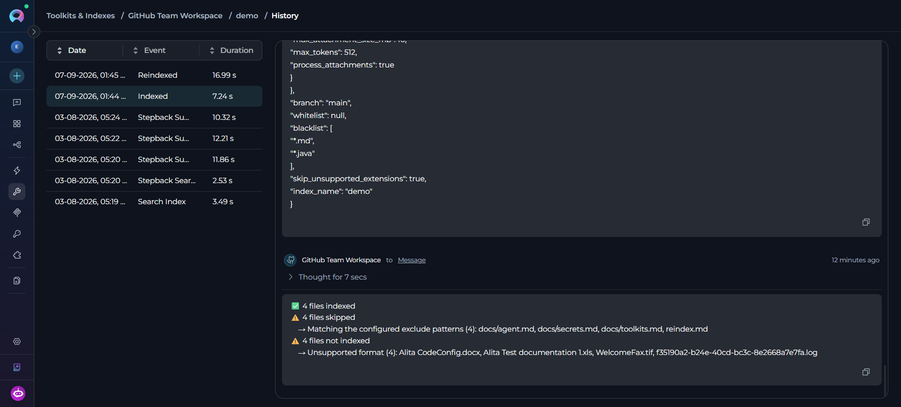
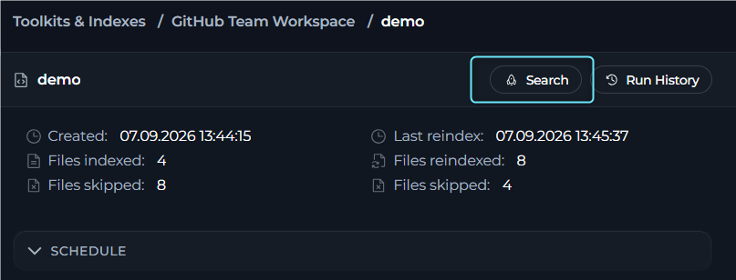

## Key Features

<CardGroup cols={2}>
     <Card title="Visual Status Indicators" icon="signal">
          Real-time identification of index states, including in-progress, completed, partly indexed, failed and stopped.
     </Card>
     <Card title="Dedicated Pages" icon="window-maximize">
          Separate pages for creating a new index, working with an existing index and reviewing index history.
     </Card>
     <Card title="Real-time Progress Monitoring" icon="arrows-rotate">
          Live updates during index creation and updates with conversation recovery.
     </Card>
     <Card title="Detailed Indexing Results" icon="list-check">
          Structured per-category breakdown of indexed and skipped files after each operation.
     </Card>
     <Card title="Automated Scheduling" icon="calendar-days">
          Configure periodic reindexing using cron expressions for hands-free maintenance.
     </Card>
     <Card title="Multiple Search Tools" icon="magnifying-glass">
          Access Search Index, Stepback Search Index and Stepback Summary Index when those tools are turned on for the toolkit.
     </Card>
</CardGroup>

---

## Prerequisites

Before using the Indexes, ensure the following requirements are met:

### Project-Level Configuration

1. **PgVector Configuration**: Vector storage must be configured at the project level.
      - In **Settings**, select **[AI Providers](../../menus/settings/ai-configuration)**.
      - Configure PgVector connection settings.
      - Verify the connection is active.

2. **Embedding Model Configuration**: An embedding model must be selected.
      - In **Settings**, select **[AI Providers](../../menus/settings/ai-configuration)**.
      - Select and configure an embedding model.
      - Test model availability.

<Warning>
**Access Control**

When project-level prerequisites are missing, the **Indexes** section displays the message **"Indexing is not available for now"**. Configure both **PgVector** and an **Embedding Model** before using indexing features.
</Warning>

### Toolkit Configuration

**Supported Toolkit**: Ensure you are working with a toolkit that supports indexing:

| Category | Supported Toolkits |
|----------|-------------------|
| **Repos** | [ADO Repos, Bitbucket, GitLab, GitHub](./index-github-data) |
| **Wikis** | [ADO Wiki](./index-ado-wiki-data), [Confluence](./index-confluence-data), [SharePoint](./index-sharepoint-data) |
| **Issues** | ADO Boards, ADO Plans, [Jira](./index-jira-data) |
| **Files** | [Artifact](./index-artifacts-data), [SharePoint](./index-sharepoint-data) |
| **Designs** | [Figma](./index-figma-data) |
| **Tests** | [TestRail](./index-testrail-data), [Xray Cloud](./index-xray-data), [Zephyr Enterprise, Zephyr Essential, Zephyr Scale](./index-zephyr-data) |

**Toolkit Tools**: Turn on indexing tools in your toolkit configuration:

| Tool | Status | Description |
|------|--------|-------------|
| **Index Data** | Required | For creating indexes |
| **Search Index** | Required | For search functionality |
| **Stepback Search Index** | Optional | For advanced search |
| **Stepback Summary Index** | Optional | For summarized search results |
| **List Indexes** | Optional | For viewing available indexes |
| **Remove Index** | Optional | For index cleanup |

<Warning>
**Indexing section Availability**

If the **Index Data** tool is not turned on in the toolkit configuration, the **Indexes** section displays the message **"Indexing is not available for now"**. Turn on **Index Data** before using indexing features.
</Warning>

---

## Access the Indexes Interface

1. Go to **Toolkits & Indexes** from the main navigation
2. Click on a toolkit that supports indexing to open its detail page
3. The toolkit detail page displays a two-panel layout:
   - **Left panel**: Toolkit configuration form
   - **Right panel**: Indexes section showing the list of indexes for this toolkit
4. The Indexes section displays:
   - **Header**: "Indexes" title with count badge (e.g., "Indexes (3)")
   - **+ Index button**: Appears in the header when indexes exist
   - **Index cards**: Each card shows the index name, created date, status and file counts

      

---

## Create a New Index

1. In the Indexes section, click **+ Index** button
2. A dedicated **Create Index** page opens with:
   - **Breadcrumb navigation**: Toolkits & Indexes > [Toolkit Name] > Create Index
   - **Index configuration** form displaying all fields for the **Index Data** tool
3. Fill in the required fields for the **Index Data** tool

      

The **Index Data** form includes required and toolkit-specific parameters such as:

| Parameter | Description | Example |
|-----------|-------------|---------|
| **Index Name** | Unique collection name for the index. It must be unique within the toolkit and cannot start or end with whitespace. | `docs`, `prod`, `v1` |
| **Progress Step** | Progress reporting interval (0-100). | `10` |
| **Clean Index** | Remove existing data before indexing. | ✓ or ✗ |
| **Chunking Config** | Document chunking configuration. | `{}` (default) |
| **Skip Unsupported Extensions** | Skip files with unsupported extensions (default: **turned on**). When turned off, unsupported files fall back to plain-text chunking instead of being skipped. | ✓ (default) |

      

<Tip>
**Toolkit-Specific Settings**

Different toolkits require different parameters. For example:

- **GitHub**: Repository name, branch, file patterns
- **Confluence**: Space key, page filters
- **Jira**: JQL queries, field extraction settings
- **TestRail**: Project ID, suite filters

Refer to toolkit-specific documentation for detailed parameter information.
</Tip>

The **Index** button at the bottom remains disabled until all required fields are valid.

4. Click **Index** to start indexing
5. After the indexing run starts:
   - The page navigates to the dedicated index detail page for that index
   - The index detail page has two tabs: **Configuration** and **Activity**
   - The **Activity** tab is automatically selected, displaying live progress updates
   - Progress is tracked in real-time with conversation-style updates

      

6. When indexing completes:
   - The index enters **Completed** or **Partially Indexed** state
   - The index becomes available for:
     - Search operations (via the Search button)
     - Scheduling automated reindexing
     - Viewing configuration (switch to Configuration tab on the index detail page)
     - Manual reindexing
     - Viewing history (History button)
     - Deletion (if Remove Index tool is enabled)

 <video controls>
   <source src="../../img/how-tos/indexing/indexes/create-index.mp4" type="video/mp4"/>
   Your browser does not support the video tag.
 </video>

<Note>
**Partially Indexed vs Failed**

An index with **Partially Indexed** status is fully usable—search tools and scheduling work normally. It means that some files were skipped during the operation (for example, binary or archive files with unsupported extensions). Review the **Indexing Results** section in the chat panel to see exactly which files were skipped and why.
</Note>

## Index Detail Page

When you open an index, the dedicated page displays the current state, metadata, controls and results for that index.

**Index statistics:** 

Created date, Files indexed, Files skipped. After first reindex: Last reindex date, Files reindexed, Files skipped.

**SCHEDULE:** 

The Schedule section shows whether a schedule is configured. When no schedule exists, it displays a placeholder and **+ Schedule** button. When a schedule exists, it shows the cron expression, next run time, selected credentials, edit/delete icons and enable/disable toggle.

**Configuration Tab**

Displays editable **Index Data** tool configuration fields. The `index_name` field is **read-only**, all other fields are **editable**. Changes are saved when clicking **Save** or **Save & Reindex**. If no editable fields exist: "No additional configuration required".

**Index Cards**

**Displays:** Collection name, created date, file counts (Indexed / total), skipped file count and status icon for in-progress, failed or stopped states.

**Interactions:** Click card to open index detail page. Hover to expose quick action buttons: Open, Reindex, Delete.

<Info>
**Index Card States**

Index cards display different visual indicators based on their current state:
- **In Progress**: Shows loading indicator and progress percentage
- **Completed**: Shows green checkmark icon
- **Partially Indexed**: Shows warning icon with skipped file count
- **Failed**: Shows error icon with red accent
- **Stopped**: Shows stopped icon
</Info>

<Check title="Indexing Notifications">
You will receive notifications for all indexing operations (initial indexing and reindexing):

- **Success**: Green checkmark icon with message showing indexed/reindexed counts
- **Partially Indexed**: Warning notification with a summary of skipped-file categories and counts
- **Failure**: Red error icon with failure message
- **Scheduled Operations**: Marked with "by schedule" text
- **Action**: Select any notification to navigate directly to the index

Notifications appear in the notifications panel.

</Check>

---

## Manage Existing Indexes

Select any index card on the toolkit detail page to open its dedicated index page. From there you can reindex, stop an active run, configure a schedule, view history and delete the index.

### Reindex

To trigger a manual reindex:

1. Open the index detail page (click an index card from the Indexes section)
2. Open the **Configuration** tab and modify configuration fields if needed (all fields are editable except `index_name`)
3. Click the **Reindex** button in the footer (shows "Save & Reindex" if changes are pending)
4. A confirmation dialog appears—click **Reindex** to confirm
5. The page tab showes real-time progress updates
6. During reindexing, the footer displays a **Stop** button to cancel the operation

**Reindex behavior:**

During reindexing, the system compares incoming content with existing index data:
- **Unchanged files**: Not duplicated, existing data is retained
- **Modified files**: Content or timestamps changed, data is refreshed
- **Previously skipped files**: Processed again if conditions changed
- **Result**: Index remains current with the latest source data

<Note>
**Index Availability During Reindexing**

The existing index remains searchable during reindexing. If reindexing fails due to network issues, expired authentication or service unavailability, the previous working index stays available for search operations. The system replaces the index only after successful completion of the reindexing operation.
</Note>

**After first reindex:**

The **General** section displays an additional reindex summary:
- **Last reindex**: Date and time of the most recent reindex
- **Files reindexed**: Count of files processed in the latest reindex
- **Files skipped**: Count of files skipped in the latest reindex

<video src="../../img/how-tos/indexing/indexes/reindex.mp4" controls></video>

### Skipped File Categories

The following table describes the categories of files that may be skipped during indexing:

| Category | Description |
|----------|-------------|
| **Supported extensions** | The SDK supports Markdown (`.md`, `.markdown`, `.mdown`, `.mkd`, `.mdx`), JSON (`.json`, `.jsonl`, `.jsonc`), config files (`.yml`, `.yaml`, `.toml`, `.ini`, `.cfg`, `.conf`, `.env`), text/data files (`.txt`, `.xml`, `.html`, `.htm`, `.csv`), and code files such as `.py`, `.js`, `.jsx`, `.mjs`, `.cjs`, `.ts`, `.tsx`, `.java`, `.kt`, `.rs`, `.go`, `.cpp`, `.c`, `.cs`, `.hs`, `.rb`, `.scala`, `.lua`, `.sh`, `.bash`, `.zsh`, `.sql`, `.r`, `.swift`, `.php`, `.pl`, `.pm`, `.h`, `.hpp`, `.m`, `.bat`, `.pas`, `.asm`, `.dart`, and `.groovy`. Files with extensions outside this set are treated as unsupported when **Skip Unsupported Extensions** is turned on. |
| **Whitelist filtered** | File path did not match the configured whitelist pattern. |
| **Blacklist filtered** | File path matched the configured blacklist pattern and was excluded. |
| **Empty content** | File exists but contains no indexable text. |
| **Read error** | File could not be read due to permissions or corruption. |
| **Runtime error** | Unexpected error during processing. |

<Tip>
**Handle Unsupported Files**
To index files with unsupported extensions (for example, plain-text configuration files with a custom extension), turn off the **Skip Unsupported Extensions** parameter when creating the index. Files with unsupported extensions will then be processed using plain-text chunking instead of being skipped.
</Tip>

<Info>
**Long Skip Lists**

When more than five files are skipped in a single category, the results summary shows the first five file names followed by a "... X more" indicator. The full list is stored in the index metadata and accessible via the API.
</Info>

### Schedule

To configure automated reindexing, use the **Schedule** section on the index page.

- Select **+ Schedule** to create a new schedule. Set the cron expression using the builder or manual input and select the credentials to use for scheduled runs.
- Once a schedule exists, use the **edit** icon to update it, the **delete** icon to remove it and the toggle switch to turn it on or off without deleting it.
- The section shows the schedule summary, the next run date and the selected credentials at a glance.

<video src="../../img/how-tos/indexing/indexes/scheduling-index.mp4" controls></video>

<Info>
**Schedule Requirements**

Scheduling is available only for indexes in **Completed** or **Partially Indexed** state. Indexes in **Failed** or **Stopped** state cannot be scheduled.
</Info>

<Tip>
**Detailed Scheduling Documentation**

For comprehensive information about scheduling features, cron expressions, troubleshooting and best practices, see [Schedule Indexing](./schedule-indexing).
</Tip>

### View History

The **History** button in the index detail page header opens a dedicated run history page:

**Access history:**
1. Open an index detail page
2. Click the **History** button in the page header
3. The History page opens showing all indexing operations for this index

       

**History page displays:**

- **Run history table**: Sortable list of all indexing operations
  - Run date and time
  - Operation type (initial index, reindex, scheduled run)
  - Status (completed, partially indexed, failed, stopped)
  - Files indexed and skipped counts
  - Duration
- **Click any row**: Opens the details for that specific run

**Button states:**
- **Disabled**: When no history exists yet or when an active run is in progress
- **Enabled**: When at least one completed run exists and no active operation is running

<Warning>
**History Limitations**

- Schedule configuration changes are not tracked in the history
- History records only indexing operations (initial index, reindex, scheduled runs)
- History is permanently deleted when an index is removed
</Warning>

### Delete Indexes

To delete an index:

1. Open the index you want to delete.
2. Select **Delete** icon.
3. Enter the index name in the confirmation dialog.
4. Confirm the deletion.

**What gets deleted:**
- All indexed data and vectors
- Run history records
- Schedule configuration
- Index metadata and settings

<Warning>
**Deletion is Permanent**

Index deletion **cannot be undone**. All indexed data, run history, schedule configuration and metadata are permanently removed. Confirm you want to delete the index before proceeding.
</Warning>

---

## Use Search Tools

The search functionality is available through a dedicated search page for each index.

**Prerequisites for Search:**

<Info>
**Search Requirements**

- **Successful Index**: Indexes with **Completed** or **Partially Indexed** status both support search operations. Failed and stopped indexes do not.
- **Enabled Search Tools**: At least one search tool (Search Index, Stepback Search Index, or Stepback Summary Index) must be enabled in toolkit configuration.
</Info>

**Available Search Tools:**

| Tool | Description |
|------|-------------|
| **Search Index** | Basic semantic search across indexed content |
| **Stepback Search Index** | Advanced search that breaks down complex questions |
| **Stepback Summary Index** | Search with automatic summarization of results |

**Access the Search Page:**

Open an index detail page and click the **Search** button in the page header. A dedicated search page opens with a two-panel layout: the left panel shows search tool selection and parameter configuration, the right panel displays search results. The left panel initially displays an empty state with a **Select Tool** button.

**Select a Search Tool:**

Click **Select Tool** in the left panel to open a searchable dropdown listing available search tools. Choose a search tool from the list and the page switches to the selected tool's configuration form.

<Info>
**Search Button States**

The **Search** button on the index detail page is:
- **Disabled** when:
  - No search tools are enabled in toolkit configuration
  - The index status is Failed or Stopped
  - An indexing operation is currently in progress
</Info>

### Stepback Summary Index

**Configuration:**

1. **Select Tool**: Choose "Stepback Summary Index" from the search tool options.
2. **Configure Search Parameters**:

     | Parameter | Description | Example |
     |-----------|-------------|---------|
     | **Query** | Required search query for the selected index | `Summarize the deployment flow and list the required configuration steps` |
     | **Index Name** | Target index collection name used for the search | `docs`, `prod`, `v1` |
     | **Messages** | Conversation history for context-aware search | Previous chat messages |
     | **Filter** | Metadata filter as dictionary or JSON string | `{"category": {"$eq": "bug"}}`, `{"$and": [{"priority": {"$eq": "high"}}, {"status": {"$eq": "open"}}]}` |
     | **Cut Off (0 - 1)** | Relevance threshold for filtering results | `0.7` for high relevance, `0.3` for broader results |
     | **Search Top** | Maximum number of top results to return | `10`, `25`, `50` |
     | **Full Text Search** | Dictionary with full-text search configuration | `{"enabled": true, "weight": 0.3, "fields": ["content", "description"], "language": "english"}` |
     | **Extended Search** | List of chunk types to search | `["title", "summary", "propositions", "keywords", "documents"]` |
     | **Reranker** | Reranker configuration used to reorder retrieved results | `{"model": "cross-encoder", "top_k": 20}` |
     | **Reranking Config** | Dictionary with field-based reranking rules | `{"importance": {"weight": 3.0, "rules": {"contains": "critical"}}}`, `{"created_at": {"weight": 1.0, "rules": {"sort": "desc"}}}` |

3. Select **Search** to execute the search operation.
4. The right panel displays the search output in a chat-style format.

<video src="../../img/how-tos/indexing/indexes/stepback-summary-index.mp4" controls></video>

### Search Index

1. Select "Search Index" from the search tool options.
2. Configure Search Parameters:

     | Parameter | Description | Example |
     |-----------|-------------|---------|
     | **Query** | Required search query for the selected index | `How do I create secrets in Elitea and what are the best practices for managing sensitive configuration data?` |
     | **Index Name** | Target index collection name used for the search | `docs`, `prod`, `v1` |
     | **Filter** | Metadata filter as dictionary or JSON string | `{"file_type": {"$eq": "markdown"}}`, `{"$and": [{"author": {"$eq": "john"}}, {"status": {"$eq": "active"}}]}` |
     | **Cut Off (0 - 1)** | Relevance threshold for filtering results | `0.7` for high relevance, `0.3` for broader results |
     | **Search Top** | Maximum number of top results to return | `10`, `25`, `50` |
     | **Full Text Search** | Dictionary with full-text search configuration | `{"enabled": true, "weight": 0.3, "fields": ["content", "title"], "language": "english"}` |
     | **Extended Search** | List of chunk types to search | `["title", "summary", "propositions", "keywords", "documents"]` |
     | **Reranker** | Reranker configuration used to reorder retrieved results | `{"model": "cross-encoder", "top_k": 20}` |
     | **Reranking Config** | Dictionary with field-based reranking rules | `{"severity": {"weight": 2.5, "rules": {"priority": "critical"}}}`, `{"file_type": {"weight": 1.5, "rules": {"contains": "test"}}}` |
     | **Output Fields** | Fields to include in the search response payload | `["page_content", "score", "metadata.source"]` |

3. Select **Search** to execute the search operation.
4. The right panel displays the search output in a chat-style format.

### Stepback Search Index

1. Select "Stepback Search Index" from the search tool options.
2. Configure Search Parameters:

     | Parameter | Description | Example |
     |-----------|-------------|---------|
     | **Query** | Required search query for the selected index | `Summarize the deployment flow and list the required configuration steps` |
     | **Index Name** | Target index collection name used for the search | `docs`, `prod`, `v1` |
     | **Messages** | Conversation history for context-aware search | Previous chat messages |
     | **Filter** | Metadata filter as dictionary or JSON string | `{"category": {"$eq": "bug"}}`, `{"$and": [{"priority": {"$eq": "high"}}, {"status": {"$eq": "open"}}]}` |
     | **Cut Off (0 - 1)** | Relevance threshold for filtering results | `0.7` for high relevance, `0.3` for broader results |
     | **Search Top** | Maximum number of top results to return | `10`, `25`, `50` |
     | **Full Text Search** | Dictionary with full-text search configuration | `{"enabled": true, "weight": 0.3, "fields": ["content", "description"], "language": "english"}` |
     | **Extended Search** | List of chunk types to search | `["title", "summary", "propositions", "keywords", "documents"]` |
     | **Reranker** | Reranker configuration used to reorder retrieved results | `{"model": "cross-encoder", "top_k": 20}` |
     | **Reranking Config** | Dictionary with field-based reranking rules | `{"importance": {"weight": 3.0, "rules": {"contains": "critical"}}}`, `{"created_at": {"weight": 1.0, "rules": {"sort": "desc"}}}` |

3. Select **Search** to execute the search operation.
4. The right panel displays the search output in a chat-style format.

<Tip>
**Search Result Actions**

**Copy Results**: Copy search output for use elsewhere. **Refine Search**: Modify parameters in the left panel and search again. **Follow-up Searches**: The search history persists in the right panel during the session. **Navigate Back**: Use breadcrumbs to return to the index detail page.
</Tip>

---

## <Icon icon="triangle-exclamation" size={32} /> Troubleshooting

<Accordion title="Disabled Sections & Buttons">
**Indexes Section Not Visible:**

The **Indexes** section is not visible or shows "Indexing is not available for now" if required prerequisites are not met.

**Requirements:**
- **PgVector Configuration**: Configure at Settings > AI Configuration
- **Embedding Model**: Select and configure at Settings > AI Configuration
- **Index Data Tool**: Must be enabled in the toolkit configuration

**Solutions:**
1. Navigate to **Settings** > **AI Configuration**
2. Configure PgVector connection settings
3. Select and configure an embedding model
4. In toolkit configuration, enable the **Index Data** tool
5. Save the toolkit configuration
6. Return to the toolkit detail page to see the Indexes section

**Delete Index Button Disabled:**

The **Delete Index** button on the index detail page is disabled when:
- The **Remove Index** tool is not enabled in toolkit configuration
- The user lacks permissions to delete indexes
- An active indexing operation is in progress

**Solutions:**
1. Enable the **Remove Index** tool in toolkit configuration
2. Verify you have delete permissions for the project
3. Wait for any active indexing operations to complete

**Search Button Disabled:**

The **Search** button on the index detail page header is disabled when:
- No search tools are enabled in toolkit configuration
- The index status is Failed or Stopped
- An indexing operation is currently in progress

**Solutions:**
1. Enable at least one search tool in toolkit configuration:
   - Search Index
   - Stepback Search Index
   - Stepback Summary Index
2. Ensure the index status is Completed or Partially Indexed
3. Wait for any active indexing operations to complete

**Reindex Button Disabled:**

The **Reindex** button on the index detail page is disabled when:
- An indexing operation is already in progress
- The toolkit configuration has changed and not been saved

**Solutions:**
1. Wait for the current indexing operation to complete
2. Save any pending changes to the toolkit configuration
3. Navigate to the index detail page and ensure you are viewing the Configuration tab (not Activity tab)

**History Button Disabled:**

The **History** button on the index detail page header is disabled when:
- No run history exists yet (newly created index)
- An active indexing operation is in progress

**Solutions:**
1. Wait for the first indexing operation to complete
2. If an operation is running, wait for it to finish
3. History becomes available after at least one indexing operation completes
</Accordion>

<Accordion title="Index Creation Failures">
**Symptoms:**

- Index creation process fails.
- Error notifications during indexing.
- Stuck in "in progress" state.

**Solutions:**

1. **Check Credentials**: Verify toolkit credentials are valid and accessible.
2. **Review Parameters**: Ensure all required parameters are provided.
3. **Data Source Access**: Confirm the data source is accessible and contains data.
4. **Resource Limits**: Check if data size exceeds system limits.
5. **Network Connectivity**: Verify a stable internet connection.

**Common Error Messages:**

| Error | Possible Cause | Solution |
|-------|---------------|----------|
| "Authentication failed" | Invalid credentials | Update toolkit credentials. |
| "Data source not found" | Incorrect source parameters | Verify repository/space/project names. |
| "Insufficient permissions" | Limited access rights | Grant appropriate permissions to the credential. |
| "Processing timeout" | Large dataset or slow connection | Reduce scope or increase timeout settings. |
</Accordion>

<Accordion title="Search Tool Issues">
**Symptoms:**

- Search tools not available.
- Run button remains turned off.
- No search results returned.

**Solutions:**

1. **Index Status**: Verify the index is successfully completed.
2. **Tool Selection**: Ensure search tools are turned on in the toolkit.
3. **Query Format**: Check search query syntax and format.
4. **Model Configuration**: Verify the LLM model is properly configured.
5. **Collection Access**: Confirm index collections are accessible.
</Accordion>

<Accordion title="Poor Search Results">
**Symptoms:**

- Search returns irrelevant results.
- Missing expected documents in search results.
- Low-quality or incomplete answers.
- Too many or too few results returned.

**Solutions:**

1. **Adjust Cut Off Parameter**: The **Cut Off** threshold (0-1) is critical for result quality.
     - **Too High (for example, 0.9)**: May exclude relevant results; try lowering to 0.7 or 0.6.
     - **Too Low (for example, 0.3)**: May include irrelevant results; try increasing to 0.5 or 0.6.
     - **Recommended Starting Point**: 0.7 for high-quality results, adjust based on feedback.
2. **Modify Search Top**: Adjust the number of results returned.
     - Increase for broader coverage (for example, 25-50 results).
     - Decrease for more focused results (for example, 5-10 results).
3. **Refine Query**: Use more specific search terms and context.
4. **Turn On Full Text Search**: Activate for comprehensive text-based matching.
5. **Turn On Extended Search**: Activate for semantic similarity search.
6. **Apply Filters**: Use filters to narrow scope (for example, `file_type:markdown`, `author:john.doe`).
7. **Configure Reranking**: Use Reranking Config to boost relevance of specific fields.

<Tip>
**Optimize the Cut Off Parameter**

The **Cut Off** parameter has the most significant impact on search quality. Start with 0.7 and adjust based on results:

- **0.8-0.9**: Very strict, only highly relevant matches.
- **0.6-0.7**: Balanced, recommended for most use cases.
- **0.4-0.5**: Broader results, useful for exploratory searches.
- **0.2-0.3**: Very inclusive, may include less relevant results.
</Tip>
</Accordion>

<Accordion title="Large Dataset Handling">
**Strategies:**

- **Incremental Indexing**: Use progressive updates instead of full re-indexing.
- **Scope Filtering**: Limit indexing scope to relevant content.
- **Chunking Optimization**: Adjust chunk sizes for optimal processing.
- **Batch Processing**: Process large datasets in smaller batches.
</Accordion>

<Accordion title="Search Performance">
**Optimization Tips:**

- **Specific Queries**: Use specific search terms instead of broad queries.
- **Result Limits**: Set appropriate limits on result counts.
- **Model Selection**: Choose appropriate LLM models for search tasks.
- **Collection Targeting**: Search specific collections instead of all indexes.
</Accordion>

---

## <Icon icon="circle-check" size={32} /> Best Practices

<Accordion title="Index Naming & Organization">
**Naming Conventions:**

- **Descriptive Names**: Use meaningful collection suffixes (`docs`, `prod`, `test`).
- **Version Control**: Include version indicators for time-based indexes (`v1`, `2024q1`).
- **Environment Separation**: Distinguish between environments (`dev`, `staging`, `prod`).
- **Purpose Indication**: Reflect the index purpose (`onboard`, `support`, `api`).

**Organization Strategies:**

- **Logical Grouping**: Group related indexes by purpose or team.
- **Lifecycle Management**: Implement retention policies for old indexes.
- **Access Control**: Consider who needs access to which indexes.
- **Documentation**: Maintain documentation of index purposes and usage.
</Accordion>

<Accordion title="Efficient Index Management">
**Creation Best Practices:**

- **Start Small**: Begin with limited scope and expand as needed.
- **Test First**: Use test environments before production indexing.
- **Validate Data**: Ensure data quality before indexing.
- **Monitor Resources**: Track system resource usage during indexing.

**Update Strategies:**

- **Incremental Updates**: Prefer incremental over full updates when possible.
- **Scheduled Maintenance**: Use off-peak hours for large updates.
- **Change Detection**: Implement change detection to trigger targeted updates.
- **Rollback Plans**: Maintain the ability to revert to previous index versions.
</Accordion>

<Accordion title="Search Optimization">
**Query Design:**

- **Specific Queries**: Use specific terms for better accuracy.
- **Context Awareness**: Use conversation context for follow-up questions.
- **Tool Selection**: Choose appropriate search tools for different use cases.
- **Result Validation**: Verify search results against known information.

**Model Configuration:**

- **Model Selection**: Choose appropriate LLMs for different search types.
- **Parameter Tuning**: Adjust temperature and token limits based on use case.
- **Cost Management**: Balance result quality with computational costs.
- **Performance Monitoring**: Track search performance and optimize accordingly.
</Accordion>

<Accordion title="Maintenance & Monitoring">
**Regular Maintenance:**

- **Index Health Checks**: Regularly verify index integrity and performance.
- **Cleanup Operations**: Remove unused or outdated indexes.
- **Performance Reviews**: Analyze search performance and user satisfaction.
- **Security Audits**: Review access permissions and credential management.

**Monitoring Practices:**

- **Usage Analytics**: Track index usage patterns and popular searches.
- **Error Monitoring**: Monitor for indexing and search failures.
- **Resource Tracking**: Monitor system resource consumption.
- **User Feedback**: Collect feedback on search quality and interface usability.
</Accordion>

---

<Info>
**Guides & References**

**Core Indexing Docs:**

- [Indexing Overview](./indexing-overview) — General concepts and getting started
- [Indexing Tools](./indexing-tools) — Detailed tool documentation and parameters
- [Schedule Indexing](./schedule-indexing) — Automated reindexing with cron expressions

**Toolkit-Specific Docs:**

- [Index GitHub Data](./index-github-data) — GitHub repository indexing
- [Index Confluence Data](./index-confluence-data) — Confluence space indexing
- [Index Jira Data](./index-jira-data) — Jira issue indexing
- [Index TestRail Data](./index-testrail-data) — TestRail test case indexing
- [Index Figma Data](./index-figma-data) — Figma design file indexing
- [Index Artifacts Data](./index-artifacts-data) — File-based content indexing

**Configuration Docs:**

- [AI Configuration](../../menus/settings/ai-configuration) — PgVector and embedding model setup
- [Toolkits Menu](../../menus/toolkits) — General toolkit configuration
- [Configure EPAM AI DIAL Key](../../getting-started/configure-epam-ai-dial-key) — Production LLM setup
</Info>
