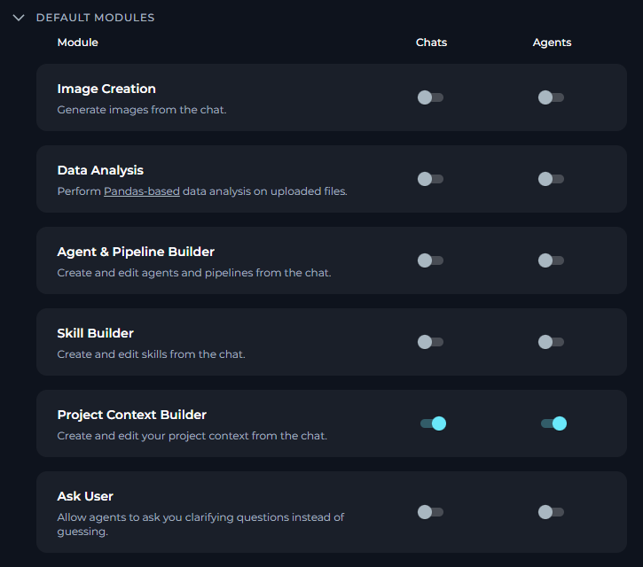
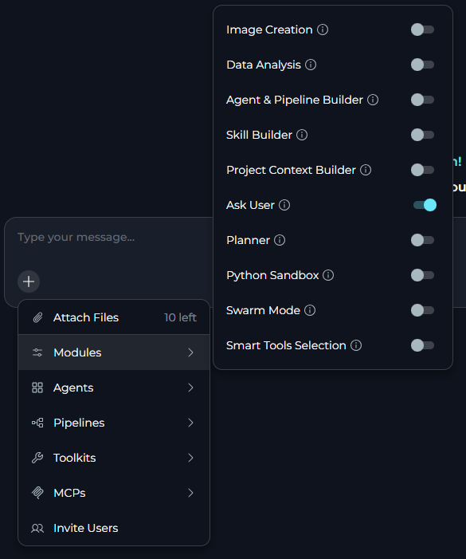
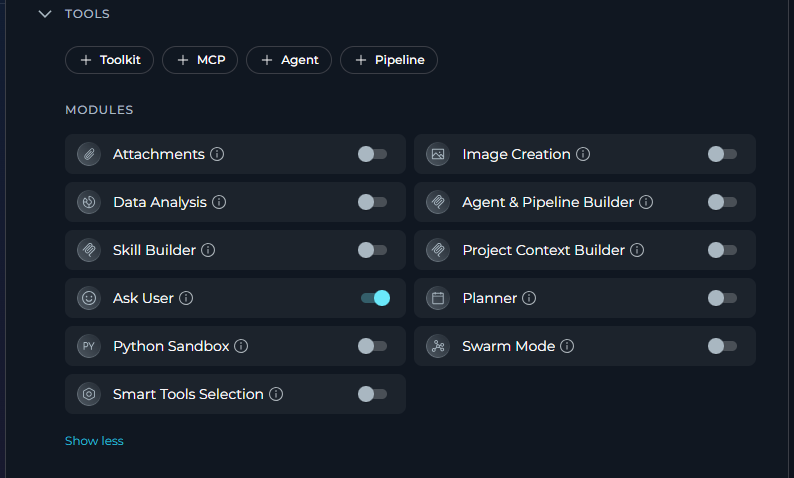
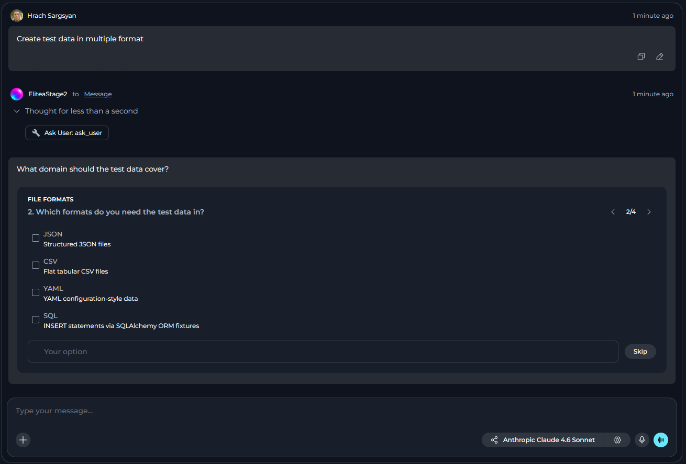
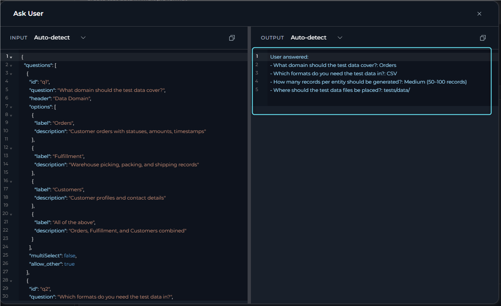

## Overview

The **Ask User** module is a built-in module that allows agents to pause execution and request clarification from users through structured questions instead of proceeding with assumptions. When enabled, agents can present 1-4 questions with selectable options and optional free-text input, then resume with the answers injected into the execution context.

**Key Capabilities:**

* Pause agent execution to ask clarifying questions
* Present multiple-choice questions with 2-4 options
* Support single-select and multi-select question types
* Allow free-text "Other" input for custom answers
* Display questions in stepwise navigation with progress indicators
* Resume execution with structured answers

<Note>
The Ask User module must be enabled in your agent configuration or project settings. It is off by default for new conversations and agents.
</Note>

## Prerequisites

- **Agent or Conversation**: The module must be enabled for the specific agent or conversation.
- **Interactive Session**: The module works in interactive sessions where users can respond to questions.
- **Non-Interactive Behavior**: In non-interactive or API runs, the module auto-skips and returns reasonable defaults.

<Warning title="Non-Interactive Sessions">
In non-interactive sessions, the Ask User tool automatically skips pausing and returns a message indicating the user is not available. The agent proceeds with reasonable defaults and states the assumption made.
</Warning>

---

## How It Works

When the Ask User module is enabled, the agent gains access to a tool that can pause execution and present structured questions to the user. The module uses the platform Human-In-The-Loop (HITL) pipeline:

1. **Agent pauses** when it needs clarification or faces ambiguous requirements
2. **Questions display** in a stepwise pager with single-select or multi-select options
3. **User answers** by selecting options or entering free-text when allowed
4. **Agent resumes** with answers injected as tool results
5. **Execution continues** with the clarification information

**Question Display:**

- Single question shows only Submit button
- Multiple questions show Back/Next navigation controls
- Progress indicator displays "Question X of Y"
- Questions appear one per step
- Navigation gated until current question receives an answer

**Available Actions:**

| Action | Description |
|--------|-------------|
| `Answer` | Submit answers to the clarifying questions and resume agent execution |

---

## Enabling Ask User

You can enable Ask User in three ways: as a default setting for all new chats and agents, for a specific conversation, or in an individual agent configuration.

<Tip>
**Recommended:** Enable Ask User alongside **Skill Builder** and **Project Context Builder** modules for the best experience. When enabled, agents can request structured clarification for skill or project context creation requests instead of proceeding with incomplete information.
</Tip>

### In Project Settings

1. Navigate to **Settings** in the main menu.
2. Go to the **General** section.
3. Find the **Ask User** row under default modules.
4. Toggle **Chats** on to enable Ask User by default for all new conversations.
5. Toggle **Agents** on to enable Ask User by default for all new agents.
6. Click **Save**.

     

New chats and agents in this project will have Ask User enabled based on your toggle settings.

### In a Conversation

1. Navigate to your conversation.
2. Click the **`+`** icon in the chat input toolbar.
3. Hover over **Modules** to open the flyout panel.
4. Find **Ask User** in the list and toggle it on.
5. A success notification appears: **"Modules configuration updated"**.

     

Once enabled, the agent can pause and ask clarifying questions for that conversation.

### In Agent Configuration

1. Navigate to **Agents** in the main menu.
2. Select the agent you want to configure or create a new agent.
3. In the **TOOLS** section, locate the **MODULES** subsection.
4. Find the **Ask User** toggle (click **Show all** if needed).
5. Toggle **Ask User** on.
6. Click **Save**.

     

New conversations with this agent will have Ask User enabled by default.

---

## Using Ask User

### How Questions Appear

When a conversation encounters ambiguous requirements or missing information, execution can pause and present structured clarifying questions.

**Example Scenario:**

You request to create a test data but do not provide all required information. If Ask User is enabled, the conversation pauses and presents focused questions:

     

**Navigation:**

- **Single question**: Continue button applies the answer
- **Multiple questions**: Back and Continue buttons navigate between questions
- **Progress indicator**: Shows "Question X of Y" for multi-question flows
- **Skip option**: Available to skip answering and proceed without providing clarification

### Answering Questions

**Step 1: Review the Question**

Read the question header and description. Review available options with their descriptions.

**Step 2: Select Your Answer**

- For single-select: Click one option
- For multi-select: Click one or more options
- For free-text: Enter custom text in the "Other" field (when allowed)

**Step 3: Navigate Through Questions**

- Click **Continue** to proceed to the next question (saves current answer)
- Click **Back** to return to previous questions
- Click **Skip** to skip answering and continue without clarification
- After the last question, click **Continue** to apply all answers

**Step 4: Execution Resumes**

After applying answers, execution resumes with your clarification and continues the task.

---

## Best Practices

<Accordion title="Enable with Builder Modules">
**Always enable Ask User alongside Skill Builder and Project Context Builder modules.** This provides the best experience:

- **With Ask User enabled**: Agents present structured clarifying questions (1-4 questions) with interactive options when skill or project context requests are missing information.

- **Without Ask User**: Agents can only request missing information through normal chat responses, requiring multiple back-and-forth exchanges.

**How to enable together:**
- In Project Settings: Toggle **Ask User**, **Skill Builder**, and **Project Context Builder** under Default Modules
- In Agent Configuration: Enable all three modules in the MODULES section
- In Conversations: Enable all three from the Modules flyout panel
</Accordion>

<Accordion title="When to Use">
- Enable Ask User for agents that create or configure resources (skills, project context, agents)
- Enable for agents that perform complex tasks with multiple valid approaches
- Enable when working with agents that handle ambiguous or incomplete requirements
- Disable for fully automated or API-driven workflows where user interaction is not possible
</Accordion>

<Accordion title="Question Design">
Agents design questions to gather specific information:

- Questions focus on genuine decision points (approach, target, configuration)
- Options provide 2-4 distinct choices when possible
- Descriptions explain what choosing each option means
- Free-text "Other" field available when flexibility is needed
- Questions do not ask permission to run tools (agents should have appropriate permissions)
</Accordion>

<Accordion title="Module Configuration">
- Enable Ask User by default in Project Settings if your team frequently works with builder modules
- Enable Ask User for agents that create or manage project resources
- Disable Ask User for agents in automated pipelines or API-only environments
- Review agent behavior with Ask User to ensure questions are meaningful
</Accordion>

<Accordion title="Working with Questions">
- Answer all questions before submitting to avoid incomplete clarification
- Use the "Other" field to provide specific details not covered by options
- Navigate back to review or change previous answers before submitting
- Provide complete information upfront in your request to minimize clarification rounds
</Accordion>

---

## Limitations

- **Off by default**: Must be explicitly enabled for each conversation or agent.
- **Interactive sessions only**: Auto-skips in non-interactive or API runs.
- **Question limit**: Agents can ask 1-4 questions per pause.
- **Navigation gating**: Must answer current question before proceeding to next.
- **No nested pauses**: Agent cannot pause again while a clarifying question is pending.

---

<Info title="Additional Resources">
- [Skill Builder](../modules/skill-builder) - Module that benefits from Ask User integration
- [Project Context Builder](../modules/project-context-builder) - Module that benefits from Ask User integration
- [Agents](../../menus/agents) - How to configure agents and enable modules
- [Chat](../../menus/chat) - Conversation features and module management
</Info>
