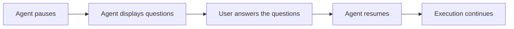

**Ask User** module allows agents to pause execution and request clarification from users through structured questions instead of proceeding with assumptions.

When enabled, agents can present questions with selectable options and optional free-text input, then resume with the answers injected into the execution context.

**Key features:**

* Pause agent execution to ask clarifying questions
* Present open, single-select and multi-select questions with 2-4 options
* Allow free-text input for open answers
* Display questions in stepwise navigation with progress indicators

<Note>
**Ask User** must be enabled in your project settings or for your current chat or agent.
</Note>

## How to Enable Ask User

The default state of the **Ask User** module — on or off — [is defined in the project settings](../../menus/settings/general#default-modules).

If **Ask User** is turned off by default, you can turn it on for your current conversation or agent.

<Callout icon="lightbulb" color="#a855f7" title="Recommended">
Enable **Ask User** alongside **Skill Builder** and **Project Context Builder** for the best experience. When enabled, agents can request structured clarification for skill or project context creation requests instead of proceeding with incomplete information.
</Callout>

### For a Conversation

1. Go to the conversation.
2. Select `+` in the chat input toolbar.
3. Select **Modules** → **Ask User** in the list.
4. Toggle **Ask User** on.

Once enabled, the agent can pause and ask clarifying questions for that conversation.

### For an Agent

1. Select **Agents**.
2. Select the agent to configure, or create a new agent.
3. In the **TOOLS** section, find **MODULES**.
4. Find **Ask User**. Select **Show all** if you do not see it immediately.
5. Toggle **Ask User** on.
6. Select **Save**.

All changes apply only to new conversations run by this agent. Existing conversations will not be affected.

## How Ask User Works

When **Ask User** is on, the agent gains access to a tool that can pause execution and present structured questions to the user. The module uses the platform Human-In-The-Loop (HITL) pipeline:

1. **Agent pauses** when it needs clarification or faces ambiguous requirements
2. **Questions are displayed** in a stepwise pager with a text field or single-select or multi-select options
3. **User answers** by selecting options or entering free-text
4. **Agent resumes** with answers injected as tool results
5. **Execution continues** with the clarification information

**Ask User** works in interactive sessions where users can respond to questions. In non-interactive or API runs, the module auto-skips, proceeds with reasonable defaults and states the assumption made.

### Questions

ELITEA suggests three types of questions:

| Question Type | How to Respond |
|----------------|-----------------|
| **Open** (no options) | Type your answer in the free-text field. |
| **Single-select** (2-4 options) | Click one option to select it, or type a custom answer in the free-text field instead. |
| **Multi-select** (2-4 options) | Click one or more options to toggle them, optionally adding a custom answer in the free-text field, then click **Continue**. |

**How questions are designed:**

- Questions focus on genuine decision points (approach, target, configuration)
- Options provide 2-4 distinct choices when possible
- Descriptions explain what choosing each option means
- Free-text field is available when flexibility is needed
- Questions do not ask permission to run tools (agents should have appropriate permissions)

**How questions are displayed:**

- Questions appear one per step.
- If there is only one question, you will see only the **Skip** or **Continue** buttons.
- With multiple questions, you will also see `<`/`>` navigation controls.
- Progress indicator displays `X/Y` (meaning *Question X of Y*).
- Navigation is gated until current question receives an answer.

Navigation buttons:

| | |
|--------|--------|
| `Continue` | Proceeds to the next question (saves the current answer). After the last question, applies all answers. |
| `>` (Next) | Proceeds to the next question (saves the current answer). |
| `<` (Back) | Returns to previous questions. |
| `Skip` | Skips answering and continues without clarification. |

### Limitations

- **Interactive sessions only**: Auto-skips in non-interactive or API runs.
- **Question limit**: Agents can ask 1-4 questions per pause.
- **Navigation gating**: Must answer current question before proceeding to the nextone.
- **No nested pauses**: Agent cannot pause again while a clarifying question is pending.

## How to Answer Questions

To answer the questions:

1. Review the question: its header, description and available options.
2. Give your answer by selecting one or more options or entering custom text.
3. Navigate through questions using the navigation buttons.
4. Execution resumes with your clarification, and the task continues.

## Best Practices

<Accordion title="Module Configuration">
- Enable **Ask User** by default in project settings if your team frequently works with builder modules
- Enable **Ask User** for agents that create or manage project resources
- Disable **Ask User** for agents in automated pipelines or API-only environments
- Review agent behavior with **Ask User** to ensure questions are meaningful
</Accordion>

<Accordion title="Working with Questions">
- Answer all questions before submitting to avoid incomplete clarification
- Use the "Other" field to provide specific details not covered by options
- Navigate back to review or change previous answers before submitting
- Provide complete information upfront in your request to minimize clarification rounds
</Accordion>

<Info title="See also">
See also:
- [Agent & Pipeline Builder](../chat-conversations/agents-&-pipeline-builder)
- [Skill Builder](../modules/skill-builder)
- [Project Context Builder](../modules/project-context-builder)
</Info>