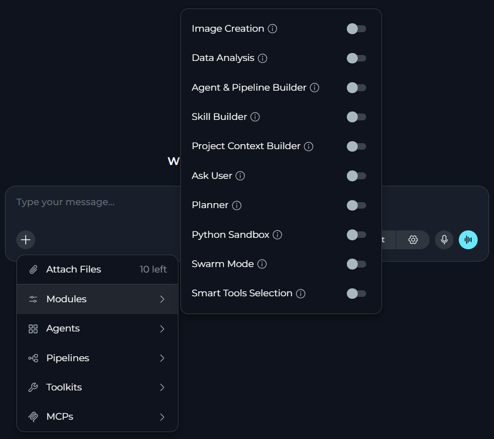
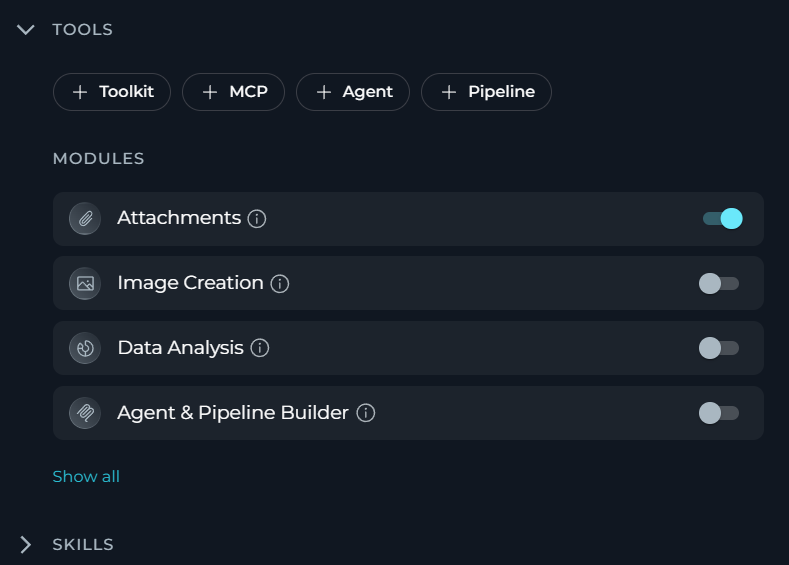

A module is a built-in capability that extends what a conversation or agent can do beyond standard chat and toolkit actions. Each module adds a specific function, such as generating images, analyzing uploaded data, running Python code, or asking clarifying questions.

Modules exist so that advanced capabilities stay optional. You — or your project administrator for team projects — can turn on only the modules currently required, which keeps chats and agents focused and avoids unnecessary token usage.

ELITEA provides ten modules:

<CardGroup cols={2}>
  <Card title="Image Creation" icon="image" href="../chat-conversations/image-generation">
    Generates, views, and manages AI-generated images using an image-capable model.
  </Card>
  <Card title="Data Analysis" icon="chart-bar" href="../chat-conversations/data-analysis-internal-tool">
    Performs Pandas-based data analysis on uploaded files (CSV, Excel, etc.) using natural language queries. Automatically processes data and generates charts with downloadable results.
  </Card>
  <Card title="Agent & Pipeline Builder" icon="sitemap" href="../chat-conversations/agents-&-pipeline-builder">
    Creates and updates agents and pipelines from chat, and calls tagged agents and MCP-enabled toolkits.
  </Card>
  <Card title="Skill Builder" icon="wand-magic-sparkles" href="./skill-builder">
    Creates and edits skills directly from chat.
  </Card>
  <Card title="Project Context Builder" icon="folder-tree" href="./project-context-builder">
    Creates and edits project context directly from chat.
  </Card>
  <Card title="Ask User" icon="circle-question" href="./ask-user">
    Pauses agent execution to ask structured clarifying questions instead of guessing when data is missing.
  </Card>
  <Card title="Planner" icon="list-check" href="../chat-conversations/planner-internal-tool">
    Creates, prioritizes, and tracks tasks and action items directly in chat.
  </Card>
  <Card title="Python Sandbox" icon="terminal" href="../chat-conversations/python-sandbox-internal-tool">
    Executes Python code in an isolated environment using Pyodide.
  </Card>
  <Card title="Swarm Mode" icon="people-group" href="../chat-conversations/swarm-mode-internal-tool">
    Enables multi-agent collaboration by sharing the full conversation history and control between agents.
  </Card>
  <Card title="Smart Tools Selection" icon="bolt" href="../chat-conversations/smart-tools-selection-internal-tool">
    Loads toolkit schemas and tools on demand to reduce token usage when many toolkits are configured.
  </Card>
</CardGroup>

<Note title="Attachments in Agent Configuration">
In agent configuration, **Attachments** also appears as a toggle in **MODULES** alongside other modules.
</Note>

For team projects, the list of modules available for its members depends on project configuration.

The **Modules** icon in the chat toolbar is hidden when no module is available for the project. If a specific module does not appear in the list, verify the prerequisites or contact your administrator.

## Prerequisites

To be able to turn modules on or off, team members require a user role with conversation or agent edit access.

Some modules have additional prerequisites:

| Module | Additional prerequisite |
|--------|--------------------------|
| **Image Creation** | <ul><li>An image generation provider toolkit must be configured for the project.</li><li>A model that supports image generation must be selected.</li></ul> |
| **Agent & Pipeline Builder** | <ul><li>MCP features must be enabled on the platform.</li><li>Agents must carry the **`mcp`** tag to be callable as tools.</li></ul> |
| **Skill Builder** | <ul><li>MCP features must be enabled on the platform.</li><li>The user must have skill management permissions.</li></ul> |
| **Project Context Builder** | <ul><li>MCP features must be enabled on the platform.</li><li>The user must have project context edit permissions.</li></ul> |
| **Data Analysis** | None. |
| **Ask User** | None. The module works only in interactive sessions; it auto-skips in non-interactive or API runs. |
| **Planner** | <ul><li>An LLM model that supports tool invocation must be selected.</li></ul> |
| **Python Sandbox** | <ul><li>Deno must be installed on the server, which an administrator configures.</li></ul> |
| **Swarm Mode** | <ul><li>At least one child agent must be configured in the parent agent's toolkits.</li></ul> |
| **Smart Tools Selection** | None. |

## Default Behavior

All ELITEA modules are turned off by default, both for new conversations and for new agents.

Project administrators — or you in your private project — can turn modules on in [Settings > General](../../menus/settings/general). In this case, these modules are turned on for all new chats and agents.

Default settings are overridden if you turn the module on explicitly for your project, conversation or agent.

## How to Turn Modules On & Off

You can turn modules on or off in three places: in the project settings as a project-wide default and for a current conversation or agent.

### In Project Settings

To set the default state of a module for all new conversations and agents in a project:

1. Select **Settings > General**.
2. Go to **General > Default Modules**.
3. Find the required module among the available ones.
4. Toggle **Chats** on to turn the module on by default for all new conversations.
5. Toggle **Agents** on to turn the module on by default for all new agents.
6. Select **Save**.

All changes apply only to new conversations and agents. Existing conversations or agents will not be affected.

 General" />

### For a Conversation

1. Go to the conversation.
2. Select **+** in the chat input toolbar.
3. Hover over **Modules** to open the list of modules.
4. Find the module in the list and toggle it on.
5. A success notification appears: **"Modules configuration updated"**.

<Info title="Module List Filtering">
Modules are hidden from the **Modules** list until their prerequisites are met.
</Info>

### For an Agent

To configure modules for an agent and any new conversations run by this agent:

1. Select **Agents**.
2. Select the agent to configure, or create a new agent.
3. In the **TOOLS** section, find **MODULES**.
4. Find the necessary module. Select **Show all** if you do not see it immediately.
5. Toggle the module on.
6. Select **Save**.

All changes apply only to new conversations run by this agent. Existing conversations or agents will not be affected.

<Warning title="Swarm Mode Cannot Nest">
An agent that already has Swarm Mode turned on cannot be added as a child agent to another swarm-enabled agent. Turn Swarm Mode off on an agent before using it as a child.
</Warning>

## How to Use Modules Together

Most modules work independently, but you can combine some of them to get better results.

| Combination | Why |
|-------------|-----|
| **Ask User** + **Skill Builder**, **Project Context Builder**, or **Agent & Pipeline Builder** | Builders can pause and ask clarifying questions instead of guessing at missing details or requesting them through plain chat responses. |
| **Python Sandbox** + **Data Analysis** | Data Analysis parses uploaded files and structures data, while Python Sandbox provides a code execution environment for custom logic beyond what Data Analysis covers alone. |
| **Smart Tools Selection** with five or more toolkits configured | Smart Tools Selection loads tool schemas on demand instead of binding every tool upfront, which reduces token usage as the toolkit count grows.|
| **Swarm Mode** + **Smart Tools Selection**, **Data Analysis**, or **Python Sandbox** | Peer agents in a swarm can each use these modules independently within the shared conversation. |

<Note title="Smart Tools Selection Has No Effect on These Modules">
**Planner**, **Python Sandbox**, **Data Analysis**, **Swarm Mode**, and **Image Creation** are always bound directly to the model rather than loaded on demand through Smart Tools Selection. Turning on Smart Tools Selection alongside these modules brings no benefit to them.
</Note>

<Info title="See Also">
See also:
- [Chat](../../menus/chat)
- [Agent](../../menus/agents)
- [Default Settings](../../menus/settings/general)
</Info>