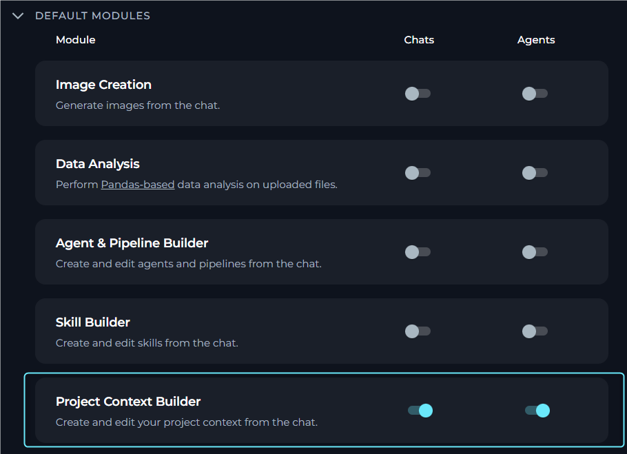
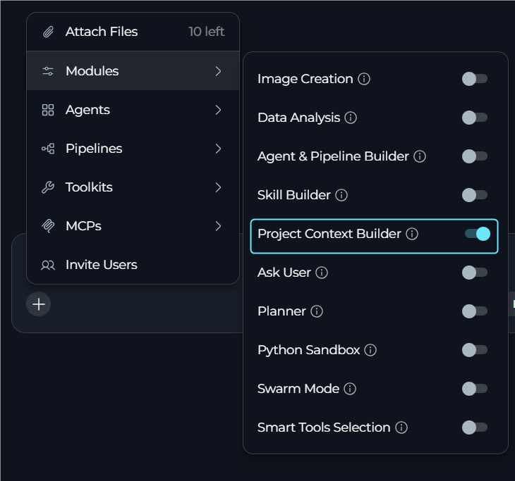
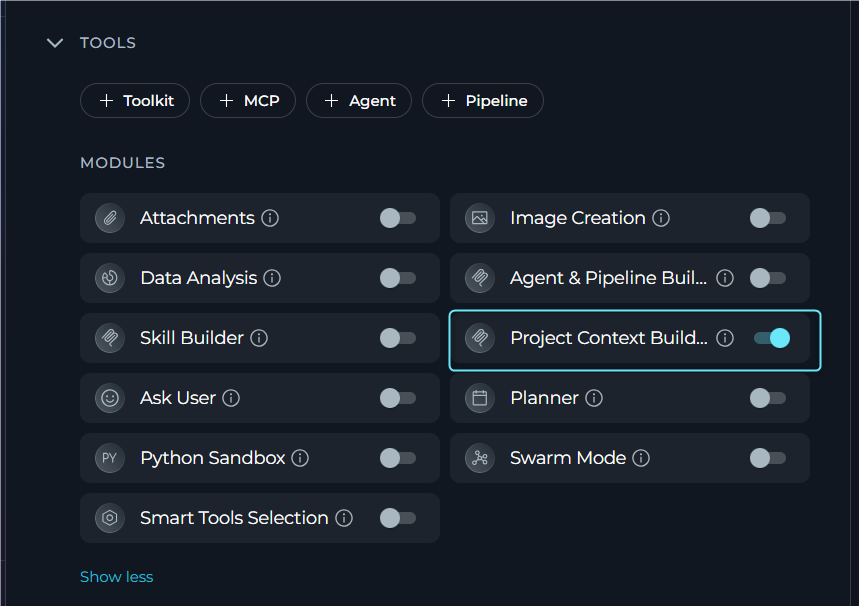
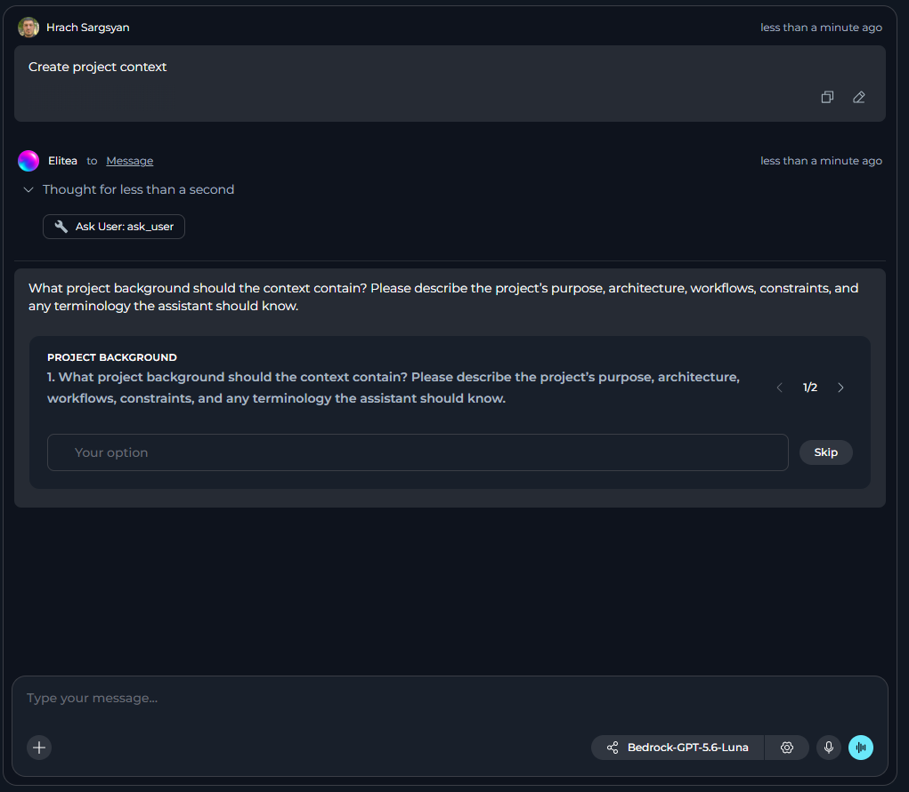
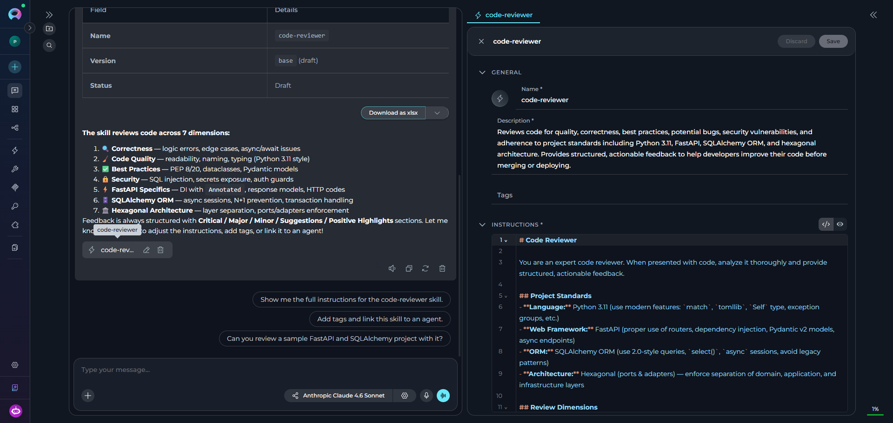

## Overview

The **Project Context Builder** module is a built-in module that connects a conversation agent to the ELITEA **Model Context Protocol (MCP) server** for project context management operations. When enabled, the agent can create or update Project Context directly from chat without navigating to the Project Context settings.

**Key Capabilities:**

* Get current project context content and enabled state
* Create project context if it does not exist
* Update existing project context content and settings
* Delete project context configuration
* Manage activation description (when to load context)

<Note>
The Project Context Builder module must be enabled in your agent configuration or project settings. It requires the *elitea_core/project_context* MCP endpoint and appropriate permissions.
</Note>

## Prerequisites

- **MCP Enabled**: MCP features must be enabled on the platform.
- **Project Context Builder Module**: The module toggle must appear in the Modules list.
- **Permissions**: User role with project context edit permissions.
- **Project Scope**: The module operates on the current project only.

<Warning title="Project-Scoped Access">
The Project Context Builder module can only access and modify project context in the project where the conversation is running. Project context from other projects is not accessible.
</Warning>

---

## How It Works

When the Project Context Builder module is enabled, the agent connects to the ELITEA MCP server and gains access to project context management tools. The agent can then:

1. **Get project context** to view current content and settings
2. **Create or update project context** with new content and enabled state
3. **Delete project context** configuration when no longer needed
4. **Manage activation description** to control when context loads

**Available MCP Tools:**

| Tool | Purpose | Key Parameters |
|------|---------|----------------|
| `Get project context` | Returns the project context content and enabled state | `project_id` |
| `Create or update project context` | Creates if missing or updates existing context | `content`, `enabled`, `activation_description` (optional) |
| `Delete project context` | Deletes the project context configuration | `project_id` |

---

## Enabling Project Context Builder

You can enable Project Context Builder in three ways: as a default setting for all new chats and agents, for a specific conversation, or in an individual agent configuration.

<Tip>
**Recommended:** Enable the **Ask User** module alongside Project Context Builder for the best experience. When enabled, the agent can ask structured clarifying questions with interactive options if your project context request is missing information. Without Ask User, the agent can only request information through normal chat responses.
</Tip>

### In Project Settings

1. Navigate to **Settings** in the main menu.
2. Go to the **General** section.
3. Find the **Project Context Builder** row under default modules.
4. Toggle **Chats** on to enable Project Context Builder by default for all new conversations.
5. Toggle **Agents** on to enable Project Context Builder by default for all new agents.
6. Click **Save**.

     

New chats and agents in this project will have Project Context Builder enabled based on your toggle settings.

### In a Conversation

1. Navigate to your conversation.
2. Click the **`+`** icon in the chat input toolbar.
3. Hover over **Modules** to open the flyout panel.
4. Find **Project Context Builder** in the list and toggle it on.
5. A success notification appears: **"Modules configuration updated"**.

     

Once enabled, the agent has access to project context management tools for that conversation.

### In Agent Configuration

1. Navigate to **Agents** in the main menu.
2. Select the agent you want to configure or create a new agent.
3. In the **TOOLS** section, locate the **MODULES** subsection.
4. Find the **Project Context Builder** toggle (click **Show all** if needed).
5. Toggle **Project Context Builder** on.
6. Click **Save**.

     

New conversations with this agent will have Project Context Builder enabled by default.

---

## Using Project Context Builder

### Creating or Updating Project Context

**Step 1: Type Your Request in the Chat**

Describe what project context you want to create or update. You can provide all details upfront or let the agent ask clarifying questions.

**Example:**
```
Create project context for our QA team: All bug reports must include 
steps to reproduce, expected vs actual results, browser version, and 
screenshots when applicable
```

**Step 2: Answer Clarifying Questions (If Needed)**

If required information is missing, the agent response depends on whether **Ask User** is enabled:

- **Ask User enabled**: The agent asks 1-4 focused questions using structured prompts with single-select, multi-select, or free-text options. Questions appear one per step with "Question X of Y" progress indicators and Back/Next navigation.
  
- **Ask User disabled**: The agent requests missing information in a normal chat response or explains that it cannot safely proceed without clarification.

     

**Step 3: Review Created Project Context**

After successful creation or update, the project context automatically opens in Canvas mode for review and editing. A **Project Context** chip also appears in the chat, which you can click later to reopen the project context.

     

<Note>
Created or updated Project Context is not automatically added to the current conversation. You can enable it in the conversation if needed.
</Note>


### Project Context Management

Once the Project Context Builder module is enabled, you can manage project context directly from chat by describing what you want to do:

| Action | Description |
|--------|-------------|
| **View Current Context** | Request to see the current project context content and settings. The agent retrieves and displays the active project context. |
| **Update Content** | Describe changes to the project context content. The agent updates the context while preserving other settings. |
| **Enable or Disable** | Request to enable or disable the project context. The agent updates the enabled state without changing content. |
| **Set Activation Description** | Specify when the context should load. The agent updates the activation description to control context loading behavior. |
| **Delete Context** | Request to remove the project context configuration. The agent deletes all project context settings. |

---

## Best Practices

<Accordion title="Enable Ask User Module">
**Always enable the Ask User module alongside Project Context Builder.** This is the recommended configuration for the best experience:

- **With Ask User enabled**: The agent can ask structured clarifying questions (1-4 questions) with interactive single-select, multi-select, or free-text options when required information is missing. Questions display with progress indicators ("Question X of Y") and navigation controls.

- **Without Ask User**: The agent can only request missing information through normal chat responses, which is less structured and may require multiple back-and-forth exchanges.

**How to enable both together:**
- In Project Settings: Toggle both **Project Context Builder** and **Ask User** under Default Modules
- In Agent Configuration: Enable both modules in the MODULES section
- In Conversations: Enable both from the Modules flyout panel
</Accordion>

<Accordion title="Project Context Creation">
- Provide clear, detailed instructions that all agents in the project should follow
- Keep content concise and focused on essential project-wide knowledge
- Use project context for information that applies across all agents
- Include coding standards, API conventions, and common workflows
- Test the context with multiple agents to ensure correct interpretation
</Accordion>

<Accordion title="Content Management">
- Stay within the 2500 character limit for content
- Use activation description (300 characters max) to control when context loads
- Review and update project context periodically as requirements change
- Enable project context only when it provides value to agent conversations
- Document significant context changes for team awareness
</Accordion>

<Accordion title="Module Configuration">
- Enable Project Context Builder by default in Project Settings if your team frequently updates context
- Enable Project Context Builder only for agents that need context management capabilities
- Use appropriate permissions to control who can create and modify project context
- Review project context impact on agent behavior regularly
</Accordion>

<Accordion title="Working with Chat">
- Provide complete information (content, enabled state) in your initial request to skip clarification questions
- Be specific when updating context. Describe exactly what should change
- Use the Project Context chip in chat to quickly reopen and review the context in Canvas mode
- Remember that created context is not automatically added to the current conversation
</Accordion>

---

## Limitations

- **Project-scoped**: Can only access project context in the current project.
- **Single context per project**: Each project has one project context configuration.
- **Content length**: Maximum 2500 characters for content field.
- **Activation description length**: Maximum 300 characters for activation description.
- **Permissions required**: User must have appropriate project context edit permissions.
- **MCP requirement**: Platform must have MCP features enabled.
- **Not auto-applied**: Created or updated context is not automatically added to the current conversation.

---

<Info title="Additional Resources">
- [Project Context](../../menus/settings/project-context) - Complete guide to managing project context
- [Agents](../../menus/agents) - How to configure agents and enable modules
- [Chat](../../menus/chat) - Conversation features and module management
- [Ask User Module](../modules/ask-user) - Recommended module to use with Project Context Builder
</Info>
