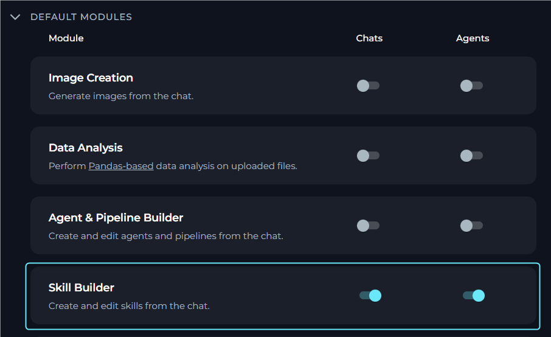
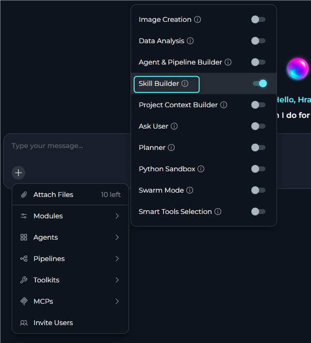
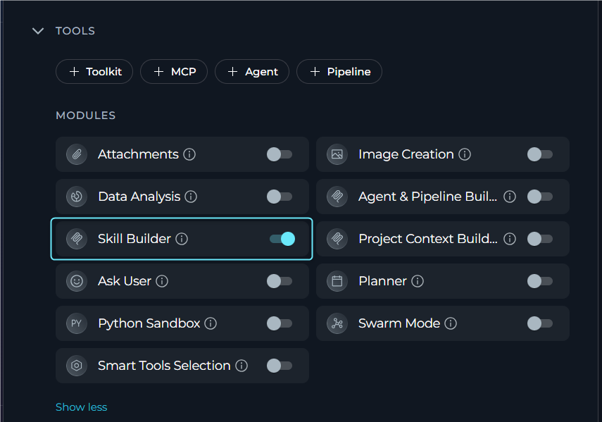
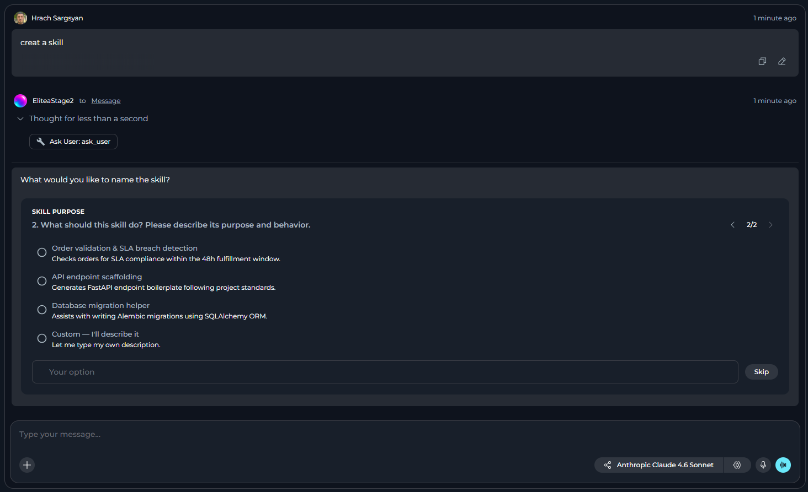
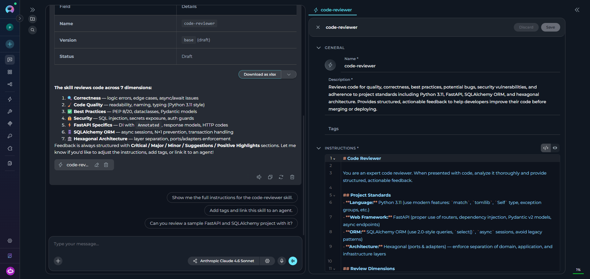

## Overview

The **Skill Builder** module is a built-in module that connects a conversation agent to the ELITEA **Model Context Protocol (MCP) server** for skill management operations. When enabled, the agent can create, update, and manage skills directly from chat without navigating to the Skills menu.

**Key Capabilities:**

* List skills in the project with filtering and search
* Create new skills with initial versions
* Retrieve skill details and version configurations
* Update skill metadata and version content
* Create new versions for existing skills
* Link and unlink skills to agent versions
* Delete skills and skill versions

<Note>
The Skill Builder module must be enabled in your agent configuration or project settings. It requires the `elitea_core/skills` MCP endpoint and appropriate permissions.
</Note>

## Prerequisites

- **MCP Enabled**: MCP features must be enabled on the platform.
- **Skill Builder Module**: The module toggle must appear in the Modules list.
- **Permissions**: User role with skill creation and editing permissions.
- **Project Scope**: The module operates on the current project skills only.

<Warning title="Project-Scoped Access">
The Skill Builder module can only access and modify skills in the project where the conversation is running. Skills from other projects are not accessible.
</Warning>

---

## How It Works

When the Skill Builder module is enabled, the agent connects to the ELITEA MCP server and gains access to skill management tools. The agent can then:

1. **List and search skills** in the current project with filtering options
2. **Create new skills** with required metadata and an initial "base" version
3. **Read skill details** including all version information
4. **Update skills** by modifying metadata or version content
5. **Manage versions** by creating, updating, or deleting skill versions
6. **Link skills to agents** by attaching skill versions to agent versions

**Available MCP Tools:**

| Tool | Purpose | Key Parameters |
|------|---------|----------------|
| **List skills** | Search and filter skills in the project | `query`, `tags`, `author_id`, `statuses`, `limit`, `offset` |
| **Create skill** | Create a new skill with initial version | `name`, `description`, `versions` (with initial version data) |
| **Get skill details** | Retrieve full skill metadata and version config | `skill_id`, optional `version_id` |
| **Update skill** | Modify skill metadata or version content | `skill_id`, optional `version_id`, update payload |
| **Create version** | Add a new version to an existing skill | `skill_id`, `name`, `instructions`, `tags`, `meta` |
| **Link/unlink skill** | Attach or detach skill from agent version | `skill_id`, `skill_version_id`, `has_relation` |
| **Delete skill** | Remove a skill and all its versions | `skill_id` |
| **Delete version** | Remove a specific skill version | `skill_id`, `version_id` |

---

## Enabling Skill Builder

You can enable Skill Builder in three ways: as a default setting for all new chats and agents, for a specific conversation, or in an individual agent configuration.

<Tip>
**Recommended:** Enable the **Ask User** module alongside Skill Builder for the best experience. When enabled, the agent can ask structured clarifying questions with interactive options if your skill creation request is missing information. Without Ask User, the agent can only request information through normal chat responses.
</Tip>

### In Project Settings

1. Navigate to **Settings** in the main menu.
2. Go to the **General** section.
3. Find the **Skill Builder** row under default modules.
4. Toggle **Chats** on to enable Skill Builder by default for all new conversations.
5. Toggle **Agents** on to enable Skill Builder by default for all new agents.
6. Click **Save**.

     

New chats and agents in this project will have Skill Builder enabled based on your toggle settings.

### In a Conversation

1. Navigate to your conversation.
2. Click the **`+`** icon in the chat input toolbar.
3. Hover over **Modules** to open the flyout panel.
4. Find **Skill Builder** in the list and toggle it on.
5. A success notification appears: **"Modules configuration updated"**.

     

Once enabled, the agent has access to skill management tools for that conversation.

### In Agent Configuration

1. Navigate to **Agents** in the main menu.
2. Select the agent you want to configure or create a new agent.
3. In the **TOOLS** section, locate the **MODULES** subsection.
4. Find the **Skill Builder** toggle (click **Show all** if needed).
5. Toggle **Skill Builder** on.
6. Click **Save**.

     

New conversations with this agent will have Skill Builder enabled by default.

---

## Using Skill Builder

### Creating a New Skill

**Step 1: Type Your Request in the Chat**

Describe what skill you want to create. You can provide all details upfront or let the agent ask clarifying questions.

**Example:**
```
Create a skill called "code-review-assistant" that reviews Python code 
for PEP 8 compliance and common security issues
```

**Step 2: Answer Clarifying Questions (If Needed)**

If required information is missing, the agent response depends on whether **Ask User** is enabled:

- **Ask User enabled**: The agent asks 1-4 focused questions using structured prompts with single-select, multi-select, or free-text options. Questions appear one per step with "Question X of Y" progress indicators and Back/Next navigation.
  
  Example questions:
  - "What should this Skill help the user accomplish?"
  - "Who is the primary audience?" (Product Managers, Developers, QA Engineers, Other)
  
- **Ask User disabled**: The agent requests missing information in a normal chat response or explains that it cannot safely proceed without clarification.

     

**Step 3: Review Created Skill**

- After successful creation, the skill automatically opens in Canvas mode for review and editing. 
- A **Skill: [skill name]** chip also appears in the chat, which you can click later to reopen the skill.
- The created skill is added to your project and can be accessed later via the **Skills** menu.
    
     

### Skill Management

Once the Skill Builder module is enabled, you can manage skills directly from chat by describing what you want to do:

| Action | Description |
|--------|-------------|
| **Update an Existing Skill** | Describe the changes you want to make to an existing skill. The agent modifies the skill metadata (name, description, tags, meta) or version content (instructions, tags, meta) while preserving existing functionality. |
| **Create a New Version** | Request a new version of an existing skill by specifying the version name and changes. The agent creates the new version while keeping the original version intact. |
| **List and Search Skills** | Ask to search for skills in your project. The agent searches by name, description, tags, or other criteria and returns matching skills with their details. |
| **Link Skills to Agents** | Request to link a skill to an agent. The agent attaches the skill version to the specified agent, making it available when the agent runs. |

<Note>
Published or embedded skill versions cannot be updated. Create a new version instead.
</Note>

---

## Best Practices

<Accordion title="Enable Ask User Module">
**Always enable the Ask User module alongside Skill Builder.** This is the recommended configuration for the best experience:

- **With Ask User enabled**: The agent can ask structured clarifying questions (1-4 questions) with interactive single-select, multi-select, or free-text options when required information is missing. Questions display with progress indicators ("Question X of Y") and navigation controls.

- **Without Ask User**: The agent can only request missing information through normal chat responses, which is less structured and may require multiple back-and-forth exchanges.

**How to enable both together:**
- In Project Settings: Toggle both **Skill Builder** and **Ask User** under Default Modules
- In Agent Configuration: Enable both modules in the MODULES section
- In Conversations: Enable both from the Modules flyout panel
</Accordion>

<Accordion title="Skill Creation">
- Provide clear, detailed instructions that explain what the skill should accomplish
- Use descriptive skill names (lowercase, hyphens only) that indicate the skill purpose
- Include specific requirements, constraints, and expected behavior in instructions
- Provide complete information (name, description, instructions) upfront to minimize clarification rounds
- Test the skill immediately after creation to verify it works as expected
- Add relevant tags to improve discoverability across your project
</Accordion>

<Accordion title="Version Management">
- Create new versions for significant changes rather than modifying existing versions
- Use descriptive version names that indicate what changed (e.g., "v2-with-validation", "updated-for-api-v3")
- Document changes between versions in the version description or meta field
- Never attempt to update published or embedded versions. Always create a new version instead
- Keep the base version as a stable foundation and iterate with named versions
</Accordion>

<Accordion title="Module Configuration">
- Enable Skill Builder by default in Project Settings if your team frequently creates skills
- Enable Skill Builder only for agents that need skill management capabilities to avoid unnecessary clutter
- Review and organize created skills periodically to maintain project quality
- Use appropriate permissions to control who can create and modify skills
</Accordion>

<Accordion title="Working with Chat">
- Provide complete information (name, description, instructions) in your initial request to skip clarification questions
- Be specific when updating skills. Describe exactly what should change
- Use the skill chip in chat to quickly reopen and review the skill in Canvas mode
- Search for existing skills before creating duplicates to avoid redundancy
- If skill creation fails, verify all required fields meet validation requirements (name format, character limits)
</Accordion>

---

## Limitations

- **Project-scoped**: Can only access skills in the current project.
- **Version names**: Must be unique within each skill, "base" is reserved.
- **Published versions**: Cannot be updated after publishing.
- **Permissions required**: User must have appropriate skill management permissions.
- **MCP requirement**: Platform must have MCP features enabled.

---

<Info title="Additional Resources">
- [Skills](../../menus/skills) - Complete guide to creating and managing skills
- [Agents](../../menus/agents) - How to configure agents and enable modules
- [Chat](../../menus/chat) - Conversation features and module management
- [Ask User Module](../modules/ask-user) - Recommended module to use with Skill Builder
</Info>
