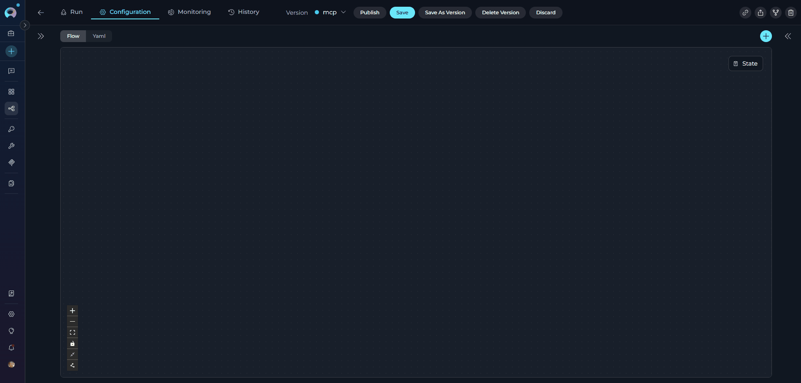

<Warning title="Required Configuration">
Every pipeline must have an entry point. Without one, the pipeline cannot execute.
</Warning>

---

## What is an Entry Point?

The Entry Point defines which node executes first when your pipeline runs—the "starting line" of your workflow.

### Key Rules

**Single Entry Point:**

* Exactly one node must be designated as the entry point
* Pipeline execution always begins at this node

**Node Eligibility:**

* ✔️ **Can be entry points**: LLM, Agent, Toolkit, MCP, Code, Custom, State Modifier, Printer, Decision
* ✘ **Cannot be entry points**: Router node

<Info title="Why Router Can't Be Entry Point">
Router nodes require input data to evaluate their conditions. At pipeline start, no state variables have been populated yet, so the router has nothing to evaluate.
</Info>

---

## Setting an Entry Point

### Visual Method (Flow Editor)


**Steps:**

1. Open your pipeline in the Flow Editor
2. Click the three dots (⋮) on the node card
3. Select **Make entrypoint** from the dropdown

After making a node the entry point, an **Input** icon appears at the top of the node card, indicating it's the pipeline's starting point.



<Tip title="Changing Entry Points">
Setting a new entry point automatically removes the previous designation.
</Tip>

### YAML Method

In YAML configuration, define the entry point at the top level:

```yaml
entry_point: node_id

nodes:
  - id: node_id
    type: llm
    # ... node configuration
```

**Valid Example:**

```yaml
entry_point: greeting

nodes:
  - id: greeting
    type: llm
```

**Invalid Examples:**

```yaml
# ✘ Non-existent node
entry_point: missing_node

# ✘ Router as entry point
entry_point: route_decision
nodes:
  - id: route_decision
    type: router
```

---

## Best Practices

### Match Entry Point to Workflow Type

* **Conversational**: Start with LLM node
* **Automated**: Start with Toolkit or MCP node
* **AI-powered routing**: Start with Decision node
* **Data processing**: Start with Code node
* **User interaction**: Start with Printer node (for displaying initial message)
* **State setup**: Start with State Modifier node


<Tip title="Essential Checks">
- Ensure `entry_point` value exactly matches a node `id`
- Avoid Router nodes as entry points
- Test that entry point node executes first
- Confirm transition to next node works
</Tip>

---
<Info title="Related Documentation">
- **[Node Connectors](./nodes-connectors)** - Connect nodes to create workflows
- **[State Management](./states)** - Understand state in pipelines
- **[Flow Editor](./flow-editor)** - Visual pipeline building
- **[Control Flow Nodes](./nodes/control-flow-nodes)** - Router and Decision nodes
- **[YAML Configuration](./yaml)** - Complete YAML syntax reference
</Info>
