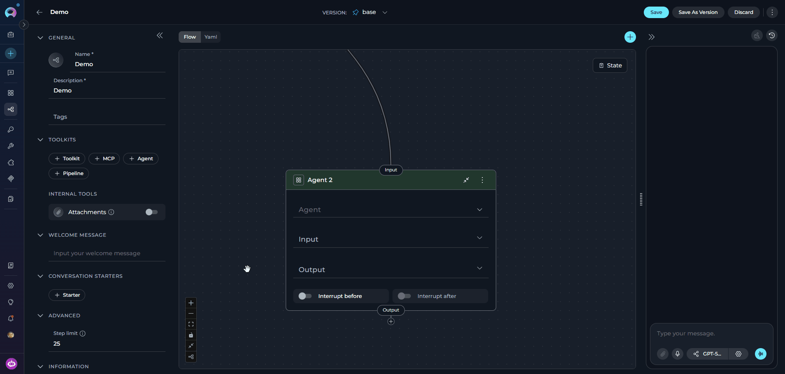
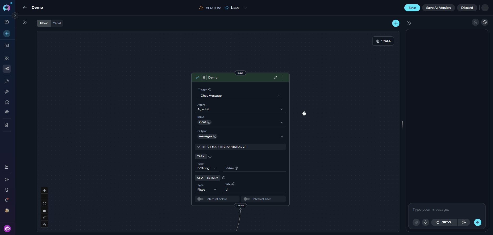
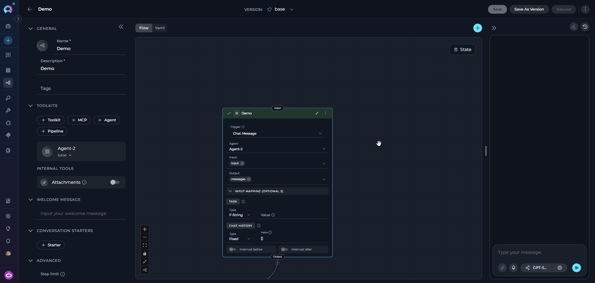
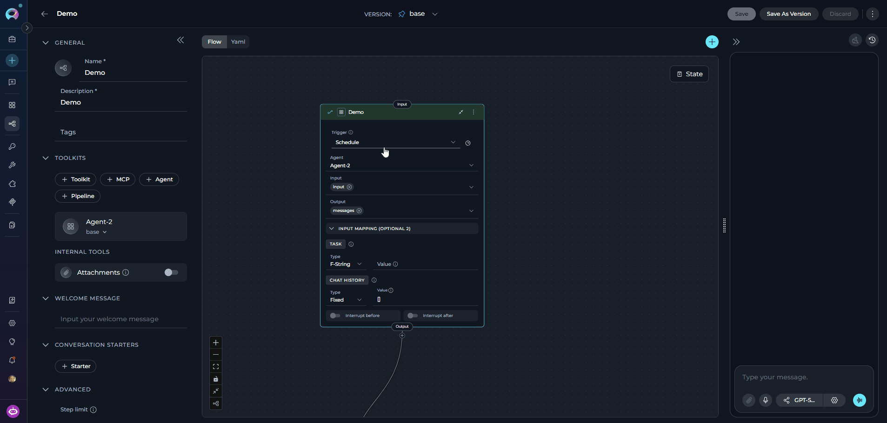

<Warning title="Required Configuration">
Every pipeline must have an entry point. Without one, the pipeline cannot execute.
</Warning>

---

## What is an Entry Point?

The entry point defines which node executes first when your pipeline runs and controls **how the pipeline is triggered**. When a node is designated as the entry point, a Trigger selector appears inside the node body, letting you choose between three trigger modes: `Chat Message`, `Schedule`, and `Webhook`.

### Key Rules

<CardGroup cols={2}>
  <Card title="Single Entry Point" icon="flag">
    Exactly one node must be designated as the entry point. Pipeline execution always begins at this node. Setting a new entry point automatically removes the previous designation.
  </Card>
  <Card title="Auto-Assignment" icon="wand-magic-sparkles">
    When the first node is added to an empty pipeline, it is automatically designated as the entry point. Only Condition and End nodes are excluded from auto-assignment.
  </Card>
  <Card title="Can Be Entry Points" icon="circle-check">
    LLM, Agent, Toolkit, MCP, Code, Printer, Router, State Modifier, HITL, Subgraph, Custom
  </Card>
  <Card title="Cannot Be Entry Points" icon="circle-xmark">
    Condition (deprecated), Decision
  </Card>
</CardGroup>

---

## Setting an Entry Point

### Visual Method (Flow Editor)

1. Open your pipeline in the Flow Editor
2. Expand the node card by clicking on it
3. Click the three dots (⋮) in the node header
4. Select **Make entrypoint** from the dropdown

Once a node is designated as the entry point, an entry point icon appears in its header and the **Trigger** selector becomes visible inside the node body.




<Tip title="Changing Entry Points">
Setting a new entry point automatically removes the previous designation. The "Make entrypoint" option only appears when a node is expanded and is not already the entry point.
</Tip>

### YAML Method

In YAML configuration, declare the entry point at the top level using the node's `id`:

```yaml
entry_point: greeting

nodes:
  - id: greeting
    type: llm
```

The YAML key order is: `state` → `entry_point` → `interrupt_after` → `interrupt_before` → `nodes`.

<Note>
Trigger configuration (schedule, webhook) is stored server-side and is not part of the pipeline YAML. The YAML only contains the `entry_point` node ID.
</Note>

---

## Trigger Type

When a node is the entry point, a **Trigger** dropdown appears inside the node body. This controls how the pipeline is started.


<CardGroup cols={3}>
  <Card title="Chat Message" icon="message">
    Default trigger. The pipeline runs each time a user sends a message in a chat session. Required for interactive pipelines with HITL or Printer nodes.
  </Card>
  <Card title="Schedule" icon="clock">
    Runs automatically at a defined time using a cron expression. Supports a visual cron builder or raw cron input.
  </Card>
  <Card title="Webhook" icon="webhook">
    Allows external systems to trigger the pipeline via HTTP POST. Supports GitHub, GitLab, and Custom webhook types.
  </Card>
</CardGroup>

<Note>
Schedule and Webhook triggers are unavailable when the pipeline contains HITL nodes, Printer nodes, or interrupt configurations. Only Chat Message is available for interactive pipelines.
</Note>

### Chat Message

The default trigger. The pipeline runs each time a user sends a message in a chat session.

- Required when the pipeline contains HITL nodes, Printer nodes, or any `interrupt_before` / `interrupt_after` configurations
- If an interactive element (HITL, Printer) is added while Schedule or Webhook is active, the trigger automatically resets to Chat Message



### Schedule

The pipeline runs automatically at a defined time using a cron expression.

Selecting **Schedule** opens a configuration modal with two modes:

| Mode | Description |
|------|-------------|
| **Default** | Visual cron builder — select minute, hour, day, month, and weekday fields interactively |
| **Advanced** | Enter a raw cron expression manually |

- Default cron expression: `0 0 * * 6` (every Saturday at midnight)
- Timezone is automatically detected from your browser settings
- Cron format: `minute – hour – day (month) – month – day (week)`




### Webhook

The pipeline runs when an external system sends an HTTP POST request to the generated webhook URL.




Selecting **Webhook** opens a configuration modal. Three webhook subtypes are available:

| Type | Auth Header | Signature Method |
|------|-------------|-----------------|
| **GitHub** | `X-Hub-Signature-256` | HMAC-SHA256 (`sha256=<computed_hmac>`) |
| **GitLab** | `X-Gitlab-Token` | Secret token sent directly in the header |
| **Custom** | `X-Webhook-Token` | Secret token sent directly in the header |

The modal shows:

| Field | Description |
|-------|-------------|
| **Webhook URL** | Read-only, automatically constructed based on the selected type. Use the copy button to copy it. |
| **Secret token** | A 32-byte base64url token generated automatically. Can be shown or hidden, copied, or regenerated. Click **Apply** to save a regenerated token. |
| **Example `curl` request** | A ready-to-use example showing the exact headers and payload format for the selected webhook type. |

**GitHub example:**
```bash
curl -X POST "https://your-elitea-instance/webhook/github" \
  -H "Content-Type: text/plain" \
  -H "X-Hub-Signature-256: sha256=<computed_hmac>" \
  -d 'Your message or data here'
```

**GitLab example:**
```bash
curl -X POST "https://your-elitea-instance/webhook/gitlab" \
  -H "Content-Type: text/plain" \
  -H "X-Gitlab-Token: <your_secret>" \
  -d 'Your message or data here'
```

**Custom example:**
```bash
curl -X POST "https://your-elitea-instance/webhook/custom" \
  -H "Content-Type: text/plain" \
  -H "X-Webhook-Token: <your_secret>" \
  -d 'Your message or data here'
```

---

## <Icon icon="circle-check" size={26} /> Best Practices

<AccordionGroup>
  <Accordion title="Match trigger to workflow type">
    Use `Chat Message` for interactive conversational pipelines; use `Schedule` for automated batch processing; use `Webhook` for event-driven integration with external systems.
  </Accordion>
  <Accordion title="Interactive pipelines require Chat Message">
    Any pipeline with HITL or Printer nodes must use the `Chat Message` trigger. Schedule and Webhook triggers are automatically disabled for such pipelines.
  </Accordion>
  <Accordion title="Match entry_point value to a node id">
    In YAML configuration, ensure the `entry_point` value exactly matches a node `id` defined in the `nodes` list.
  </Accordion>
  <Accordion title="Protect webhook secrets">
    Regenerate the secret if it is ever exposed. Always copy it immediately after generation — it cannot be retrieved once the modal is closed without regenerating.
  </Accordion>
</AccordionGroup>

---

<Info title="Related Documentation">
- **[Node Connectors](./nodes-connectors)** - Connect nodes to create workflows
- **[State Management](./states)** - Understand state in pipelines
- **[Flow Editor](./flow-editor)** - Visual pipeline building
- **[Control Flow Nodes](./nodes/control-flow-nodes)** - Router and Decision nodes
- **[YAML Configuration](./yaml)** - Complete YAML syntax reference
</Info>
