---

## Introduction

The **Inventory application** within ELITEA is an AI-powered knowledge graph engine that ingests source code repositories (GitHub, GitLab, Bitbucket, ADO Repos) and builds structured knowledge graphs by extracting entities — classes, functions, services, APIs, data models, and more — along with the relationships between them. With Inventory, your ELITEA Agents can search code entities by name or concept, analyze upstream and downstream dependencies, retrieve source code, and explore architectural patterns across multiple repositories in a single unified graph.

<CardGroup cols={2}>
  <Card title="Knowledge Graph Construction" icon="diagram-project">
    Extracts entities and relationships from source code using LLM-based and AST-based parsers, storing them in a queryable knowledge graph.
  </Card>
  <Card title="Multi-Source Ingestion" icon="code-branch">
    Combines data from multiple source toolkits (GitHub, GitLab, Bitbucket, ADO Repos) into a single unified graph, including cross-source relations.
  </Card>
  <Card title="Entity Search & Retrieval" icon="magnifying-glass">
    Search entities by name tokens, semantic similarity, or structured filters. Retrieve source code for any entity via its stored citations.
  </Card>
  <Card title="Impact Analysis" icon="arrow-up-right-dots">
    Trace upstream and downstream dependency chains across the graph to understand what depends on a component and what it depends on.
  </Card>
  <Card title="Incremental Updates" icon="rotate">
    Supports delta updates for individual changed files — faster than full re-ingestion when only a subset of the codebase changes.
  </Card>
  <Card title="Built-in Chat Interface" icon="comments">
    Provides an embedded AI chat that orchestrates graph tools and source toolkits to answer natural language questions about the codebase.
  </Card>
</CardGroup>

Integrating Inventory with ELITEA empowers your Agents to understand complex codebases, perform impact analysis before changes, answer architectural questions, and navigate multi-repository systems with deep contextual awareness.

---

## Prerequisites

<CardGroup cols={3}>
  <Card title="Source Code Toolkit" icon="code-branch">
    At least one configured toolkit for accessing a source code repository: GitHub, GitLab, Bitbucket, or ADO Repos.
  </Card>
  <Card title="LLM Configuration" icon="brain">
    Access to a configured LLM model used for entity and relationship extraction during ingestion.
  </Card>
  <Card title="Embedding Model" icon="vector-square">
    A configured embedding model for semantic search (optional but recommended for natural language queries).
  </Card>
</CardGroup>

<Info title="Kubernetes Deployment">
When deployed on Kubernetes, the Inventory application runs ingestion in dedicated stateless Job workers managed by the `K8sIngestionJobManager`. This provides improved isolation and reliability for ingestion tasks. Deployment dependencies and requirements are clearly defined — consult your platform administrator to ensure the correct environment variables and artifact bucket access are configured before use.
</Info>

---

## System Integration with ELITEA

Inventory integrates with ELITEA as an **Application** accessible through the **Apps menu**. It provides a knowledge graph engine with a built-in user interface for managing ingestion, exploring graph content, and querying the knowledge base through an AI chat interface.

### Request Inventory Application Access

If the **Inventory** application is not yet enabled for your project, the App Catalog card shows a **Request Access** button instead of **Configure**. Submit a request to have it enabled by your administrator.

1. **Navigate to Apps:** Open the sidebar and select **Apps**.
2. **Open the App Catalog tab:** Select the **App Catalog** tab to browse available applications.
3. **Locate the Inventory card:** Find the **Inventory** card in the catalog.
4. **Click Request Access:** Click the **Request Access** button on the Inventory card.
5. **Provide a reason:** In the request modal, enter a description of why you need access to the Inventory application.
6. **Submit the request:** Click **Submit** to send the request to your administrator.
7. **Await approval:** Once approved, the card updates and the **Configure** button becomes available.
8. **Proceed with configuration:** Follow the steps in [Create Inventory Application](#create-inventory-application) to set up the application.

     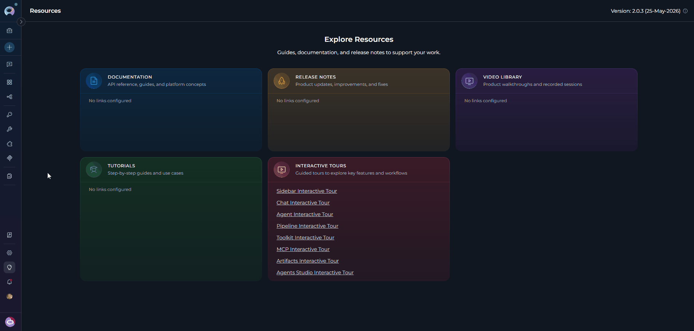

---

### Create Inventory Application

1. **Navigate to Apps:** Open the sidebar and select **Apps**.
2. **Open the App Catalog tab:** Select the **App Catalog** tab to browse available applications.
3. **Locate the Inventory card:** Find the **Inventory** card in the catalog.
4. **Start configuration:** Click the **Configure** button on the Inventory card. This opens the application configuration form.

     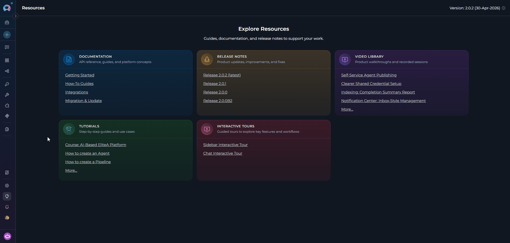

5. **Configure Application Settings:**

    | Parameter | Required | Description | Example |
    |-----------|----------|-------------|---------|
    | **Toolkit Name** | Yes | Descriptive name for the application | "Backend Codebase Graph" |
    | **Description** | No | Optional description of the application's purpose | "Knowledge graph for the core backend services" |
    | **Bucket** | Yes | Storage bucket for knowledge graph data. Uses the fixed internal bucket `inventory_graphs` — no manual bucket configuration is required in standard deployments. | `inventory_graphs` |
    | **LLM Model** | Yes | LLM model used for entity and relationship extraction during ingestion | "gpt-4", "claude-sonnet-3-5" |
    | **Embedding Model** | No | Embedding model for semantic search (optional; enables natural language entity queries) | "text-embedding-3-small" |
    | **Sources** | No | Source toolkit IDs to ingest from (GitHub, ADO Repos, GitLab, Bitbucket) | Select from configured toolkits |
    | **Tools** | No | Select which tools to enable (default: all tools) | `run_ingestion`, `search_graph`, `impact_analysis` |

<Note title="Source Validation Feedback">
When you select source toolkits during app creation, ELITEA validates each source's availability early in the form. If a selected source toolkit cannot be resolved, a clear validation message appears before the application is saved — letting you correct the configuration immediately rather than encountering an error later during ingestion. Form field labels and reference pickers are also rendered with consistent sizing across all Inventory setup fields.
</Note>

6. **Save Application:** Click **Save** to create the application.

    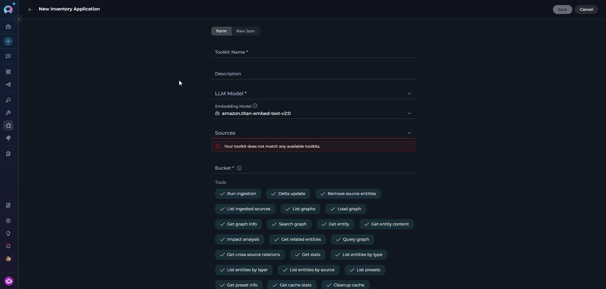

<Info title="Application Interface">
The Inventory application includes an integrated user interface accessible through the application detail page. This interface provides:

* Source ingestion management
* Knowledge graph exploration and entity browsing
* Ingestion status monitoring per source
* Built-in AI chat for querying the knowledge graph
</Info>

---

### Available Tools

The **Inventory** application toolkit provides the following tools:

| **Tool Name** | **Group** | **Required Parameters** | **Optional Parameters** | **Description** |
|---------------|-----------|------------------------|-------------------------|-----------------|
| **run_ingestion** | Ingestion | `toolkit_id` | `branch`, `file_patterns`, `exclude_patterns`, `full_rebuild` | Runs the ingestion pipeline for a source toolkit to build or update the knowledge graph. Async only. |
| **delta_update** | Ingestion | `toolkit_id`, `file_paths` | `branch` | Updates specific files from a source toolkit — faster than full ingestion when only selected files have changed. Async only. |
| **remove_source_entities** | Ingestion | `toolkit_id` | — | Removes all entities contributed by a specific source toolkit from the graph. |
| **list_ingested_sources** | Graph Management | — | `output_format` | Lists all source toolkits that have been ingested into the graph, with entity counts per source. |
| **list_graphs** | Graph Management | — | `output_format` | Lists all available knowledge graphs in this Inventory application. |
| **load_graph** | Graph Management | `graph_name` | — | Loads or switches to a specific knowledge graph by name. |
| **get_graph_info** | Graph Management | — | `output_format` | Returns metadata about the currently loaded graph: sources, entity counts, and last update time. |
| **get_sources_status** | Graph Management | — | `output_format` | Returns the ingestion status for all sources: `pending`, `in_progress`, `completed`, or `error`, with last update time and entity counts. |
| **search_graph** | Search & Retrieval | `query` | `entity_type`, `layer`, `source_toolkit`, `file_pattern`, `top_k`, `output_format` | Searches for entities using token matching. Supports `'chat message'` finding `ChatMessageHandler`, file patterns, and layer/source filtering. |
| **get_entity** | Search & Retrieval | `entity_name` | `include_relations`, `output_format` | Returns detailed information about a specific entity: properties, relations, and all source citations. |
| **get_entity_content** | Search & Retrieval | `entity_name` | — | Retrieves the source code for an entity using its citation (file path and line numbers). |
| **impact_analysis** | Search & Retrieval | `entity_name` | `direction`, `max_depth`, `output_format` | Analyzes what entities would be impacted by changes (`downstream`) or what this entity depends on (`upstream`). Works across all sources. |
| **get_related_entities** | Search & Retrieval | `entity_name` | `relation_type`, `direction`, `output_format` | Returns entities related to a specific entity, optionally filtered by relation type (`CALLS`, `IMPORTS`, `EXTENDS`, etc.) and direction. |
| **query_graph** | Search & Retrieval | — | `query`, `types`, `layers`, `files`, `name`, `related_to`, `relation_types`, `direction`, `has_relations`, `limit`, `output_format` | Queries the graph with structured JQL-like filters. Supports `type:class layer:code` or `related:UserService type:function dir:out` syntax. |
| **get_cross_source_relations** | Search & Retrieval | — | `output_format` | Returns relations that connect entities from different source toolkits (e.g., a Jira ticket referencing a GitHub PR). |
| **get_stats** | Search & Retrieval | — | `output_format` | Returns statistics about the knowledge graph: entity counts by type, source, and layer. |
| **list_entities_by_type** | Entity Listing | `entity_type` | `source_toolkit`, `limit`, `output_format` | Lists all entities of a specific type (e.g., `class`, `function`, `api_endpoint`) across all sources. |
| **list_entities_by_layer** | Entity Listing | `layer` | `source_toolkit`, `limit`, `output_format` | Lists entities by semantic layer: `code`, `service`, `data`, `product`, `domain`, `documentation`, `configuration`, `testing`, `tooling`, `knowledge`, or `structure`. |
| **list_entities_by_source** | Entity Listing | `source_toolkit` | `entity_type`, `limit`, `output_format` | Lists all entities contributed by a specific source toolkit, optionally filtered by type. |
| **list_presets** | Presets & Cache | — | — | Lists available language presets for ingestion: `python`, `javascript`, `typescript`, `java`, and more. |
| **get_preset_info** | Presets & Cache | `preset_name` | — | Returns details about a language preset including its file include patterns and exclude patterns. |
| **get_cache_stats** | Presets & Cache | — | `output_format` | Returns statistics about the local graph cache: total size, graph count, and details per cached graph. |
| **cleanup_cache** | Presets & Cache | — | `output_format` | Forces cleanup of stale graphs from the local cache (normally runs automatically in the background). |
| **normalize_types** | Graph Maintenance | — | `output_format` | Normalizes all entity type names to canonical lowercase forms (e.g., `Feature` / `Features` → `feature`). Run to reduce type fragmentation after ingestion. |
| **rebuild_indices** | Graph Maintenance | — | `output_format` | Rebuilds all graph indices (name, type, file, source) and normalizes entity types. Use after manual modifications or to fix index inconsistencies. |
| **get_type_stats** | Graph Maintenance | — | `output_format`, `show_all` | Returns detailed statistics about entity types including counts and potential duplicates — useful for identifying type fragmentation before normalization. |
| **link_toolkits_to_tools** | Graph Enrichment | — | `dry_run`, `output_format` | Creates `PROVIDES_TOOL` relationships between toolkit entities and their tools based on file paths, naming patterns, and `parent_toolkit` properties. Run after ingestion to improve toolkit–tool connectivity. |
| **connect_orphan_nodes** | Graph Enrichment | — | `min_score`, `max_connections`, `dry_run`, `output_format` | Finds isolated entities (no relationships) and connects them to related entities using name-overlap scoring. Creates `RELATED_TO` relationships to reduce graph fragmentation. |
| **validate_relationships** | Graph Enrichment | — | `fix_issues`, `output_format` | Validates existing relationships using heuristic rules — checks for self-loops, invalid relation types, and missing required relationships. Returns a validation report; optionally auto-fixes removable issues. |

---

### Applications Tab

All created Inventory applications are listed in the **Applications** tab of the **Apps menu**. Each card displays the application name and description.

**To open an Inventory application:**

1. Navigate to the **Apps menu** in the sidebar and select the **Applications** tab.
2. Click on your Inventory application card.
3. The Inventory interface opens. Here you can manage data sources, monitor ingestion status, explore the knowledge graph, and access the AI chat.

     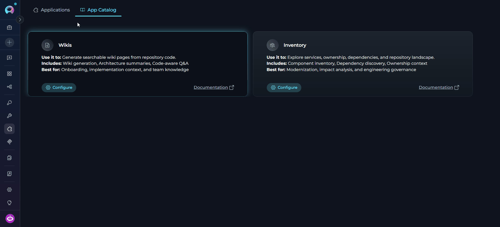

Use the action menu on any card to edit application settings or delete the application.

<Note>
If no applications have been configured yet, the **Applications** tab shows an empty state with the message **"No applications yet"**. Click **+ Create** to open the App Catalog, or click **Start Guided Tour** to take an interactive walkthrough.


</Note>

---

## Working with the Inventory Application

The Inventory interface is organized into several areas:

- **Sources Panel:** Manage data sources and monitor per-source ingestion status
- **Graph Explorer:** Browse entities, view relationships, and inspect source citations
- **Chat Interface:** AI-powered chat for natural language knowledge graph queries

     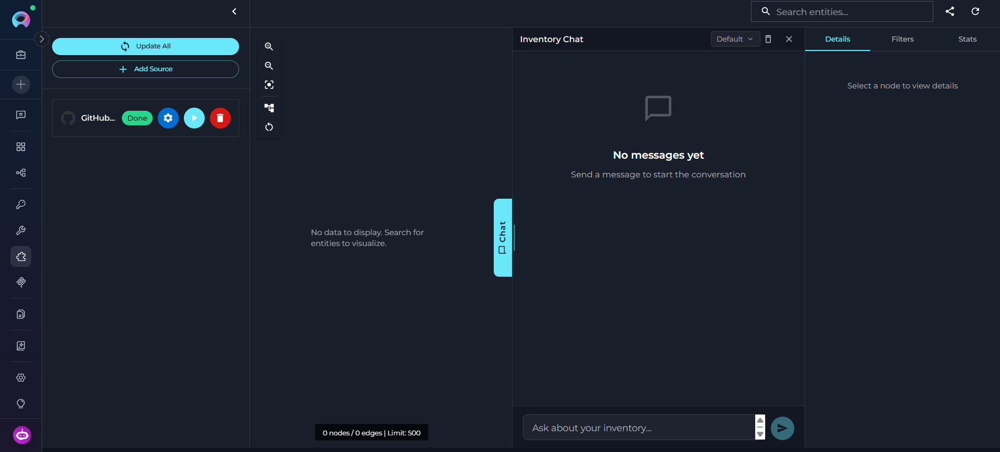

### Adding Sources

Before running ingestion, add one or more source toolkits to the Inventory application. Sources are the code repositories the knowledge graph will be built from.

**To add a source:**

1. Open the Inventory application from the **Applications** tab.
2. In the **Sources** panel, click **Add Source**.
3. Select a source toolkit from the dropdown (GitHub, GitLab, Bitbucket, or ADO Repos).
4. Click **Save** to add the source.

     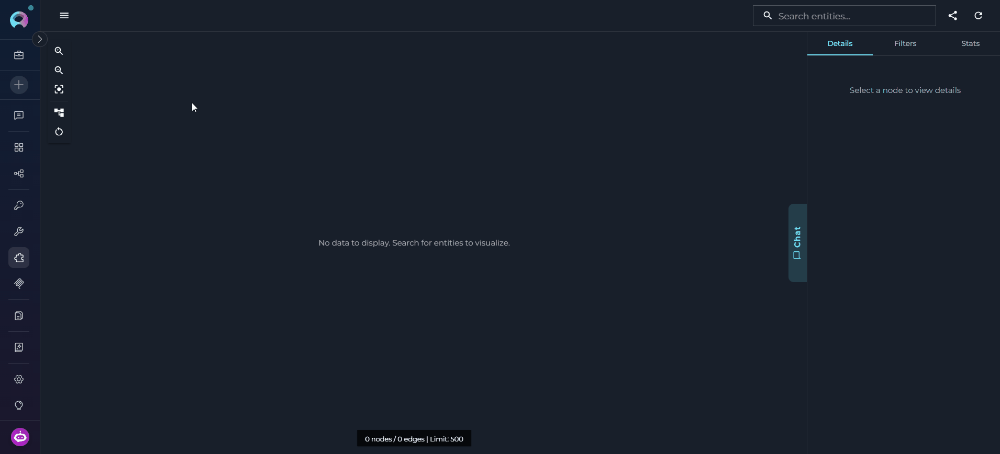

<Note title="Multi-Source Knowledge Graph">
You can add multiple logically related sources — for example, a backend service repo, a shared library repo, and a frontend repo — to a single Inventory application. All sources are ingested into the **same unified knowledge graph**, meaning the chat and search tools query across all of them simultaneously. Cross-source relations (e.g., a service calling a function defined in a different repository) are tracked automatically. Use the **Sources** filter in the **Filters** tab to narrow search results to specific repositories when needed.
</Note>

<Card title="Per-Source Settings" icon="gear">
  Each source can be fine-tuned independently to control which files are ingested and how the ingestion pipeline processes the repository. These settings are optional — if left blank, the source toolkit defaults are used.

  - **Branch** — Target branch to ingest. Uses the toolkit default if not specified.
  - **File Patterns** — Comma-separated glob patterns to include (e.g., `**/*.py,**/*.js`).
  - **Exclude Patterns** — Comma-separated patterns to exclude (e.g., `**/test/**,**/vendor/**`).
  - **Preset** — Language preset to apply (e.g., `python`, `typescript`, `java`) — automatically sets sensible include/exclude patterns.

  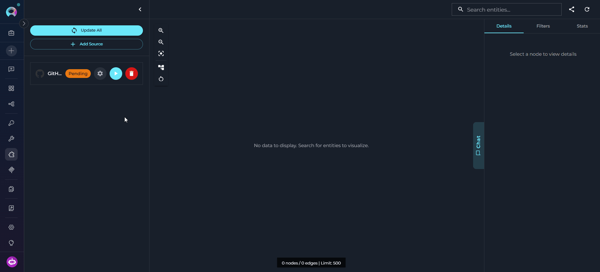

  <Info title="Language Presets">
  Language presets provide sensible file include/exclude patterns for common languages. Use `list_presets` to see available presets and `get_preset_info` to inspect the patterns for a specific preset before applying it.
  </Info>
</Card>


---

### Running Ingestion

Once sources are configured, run ingestion to build the knowledge graph.

<Note title="How Ingestion Works">
The ingestion pipeline connects to each source toolkit, fetches documents using its loader, and extracts entities and relationships using a combination of AST-based parsing (for classes, functions, and methods) and LLM-based extraction (for higher-level entities like services, APIs, and domain concepts). Entities from multiple sources are merged when they share the same name and type, and cross-source relations are tracked automatically.
</Note>

**To run ingestion for a source:**

1. In the **Sources** panel, locate the source you want to ingest.
2. Check the source status indicator — a `pending` or `error` status means the source has not been successfully ingested.
3. Click the **Run Ingestion** button next to the source.
4. Ingestion runs asynchronously in the background. Monitor progress in the status indicator.

     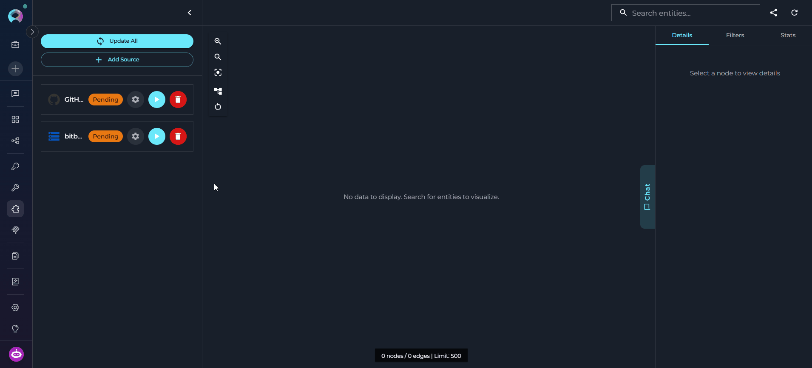

<Info title="Ingestion Time">
Ingestion time depends on repository size and complexity: small repositories (< 100 files) take 1–3 minutes; medium repositories (100–1,000 files) take 3–10 minutes; large repositories (> 1,000 files) may take 10–30+ minutes. Use file patterns or a language preset to reduce the scope if ingestion takes too long.
</Info>

**Source Status Values:**

| Status | Meaning |
|--------|---------|
| `Pending` | Source has been added but ingestion has not started |
| `Ingesting` | Ingestion is currently running |
| `Done` | Ingestion completed successfully |
| `Error` | Ingestion failed — inspect the error message for details |

<Note title="Stopping an Active Ingestion">
While ingestion is running, a **Stop** button appears at the top of the **Sources** panel (replacing the **Update All** button). Click **Stop** to cancel the active ingestion run. The backend task is interrupted and the ingestion slot is released, making it immediately available for a new run.
</Note>

<Warning title="Concurrent Ingestion Limit">
The Inventory application enforces a limit on the number of simultaneously active ingestion runs. If all ingestion workers are already busy when you attempt to start a new ingestion, you will receive an error message listing the currently running ingestions and a suggested retry window. Wait for an active run to complete before starting another.
</Warning>

<Warning title="Async Ingestion Only">
The `run_ingestion` and `delta_update` tools are **async-only** — they do not return a result synchronously. When invoked from an agent, the agent should check `get_sources_status` to confirm completion rather than expecting an immediate result.
</Warning>

---

## Use the Chat Interface

The Inventory application includes a built-in AI chat interface that lets you explore the knowledge graph using natural language — no need to write tool calls or structured queries manually. The chat agent orchestrates graph search, entity inspection, dependency tracing, and source code retrieval behind the scenes and streams its reasoning steps in real time.

**Purpose:** Use the chat to answer questions about your codebase that would otherwise require multiple tool calls — "What does this service depend on?", "Which classes implement this interface?", "Find all API endpoints in the auth module." The agent picks the right tools automatically and builds the answer from graph data.

---

### Opening the Chat

1. Open the Inventory application from the **Applications** tab.
2. Click the vertical **Chat** tab on the right edge of the graph canvas.
3. The chat panel slides open. It is resizable — drag the left edge to adjust the width.

     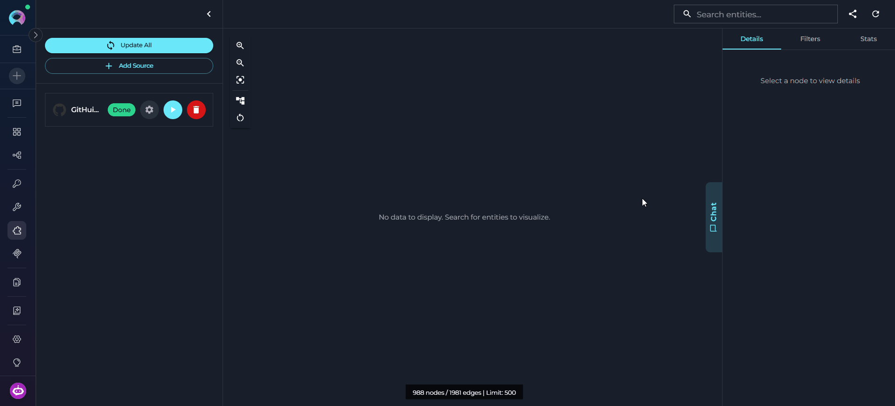

<Info title="Graph Features Require Ingestion">
The chat works without ingestion, but only via direct source toolkit search — it has no knowledge graph to query. Graph-based features (entity search, impact analysis, dependency traversal, structured queries) are only available after at least one source has been successfully ingested. **Ingest your sources first to unlock the full capabilities of the chat.**
</Info>

---

### How the Chat Works

<Steps>
  <Step title="Select the LLM Model">
    In the chat header, click the model selector dropdown next to **Inventory Chat**. Choose a model from the list or keep **Default (from toolkit)** to use the model configured in the Inventory application settings. The selected model is used for all messages in the current session.

    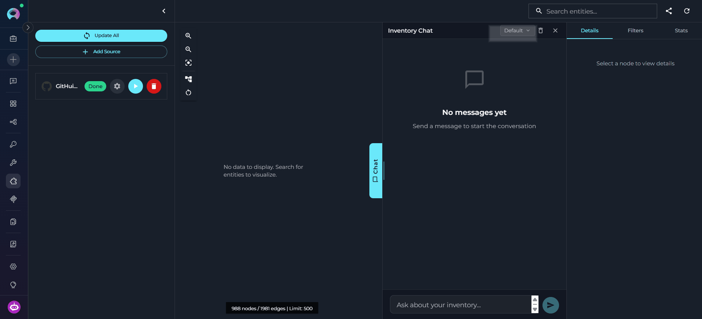
  </Step>

  <Step title="Type Your Query and Send">
    Type your question in the input field at the bottom of the chat panel. Press **Enter** or click the send button to submit. You can ask in plain language — no special syntax required.

    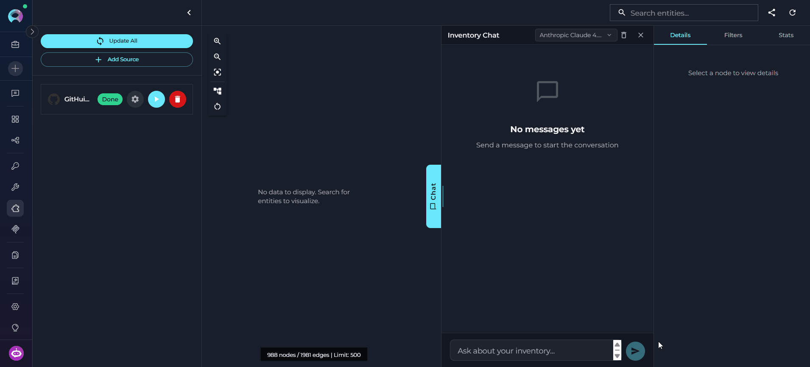

    Examples:
    - *"What does `ConfigurationModelHandler` do and what classes extend it?"*
    - *"List all API endpoints defined in `api/v1/`."*
    - *"If I change `create_configuration`, what else would be affected?"*
  </Step>

  <Step title="Review the Tools Executed">
    While the agent processes your query, intermediate reasoning steps appear in the chat — showing which tools were called and what they returned. The agent selects tools automatically based on your question, following this priority:

    1. `search_graph` — find entities by name tokens or semantic similarity
    2. `get_related_entities` — explore connections between found entities
    3. `query_graph` — apply structured filters (by type, layer, or file pattern)
    4. Source toolkit fallback — code search against the repository when the graph lacks the content

    Each tool call is visible as a collapsible step before the final answer.

        

  </Step>

  <Step title="Read the Response">
    The agent's answer streams in real time below the tool steps. It includes entity names, relation types, file paths, and source code excerpts where relevant. You can ask follow-up questions — the chat remembers the context of the current session.

    Use the stop button (■) to cancel a response mid-stream if needed. As you chat, entities accessed during the conversation are automatically merged into the graph canvas.

    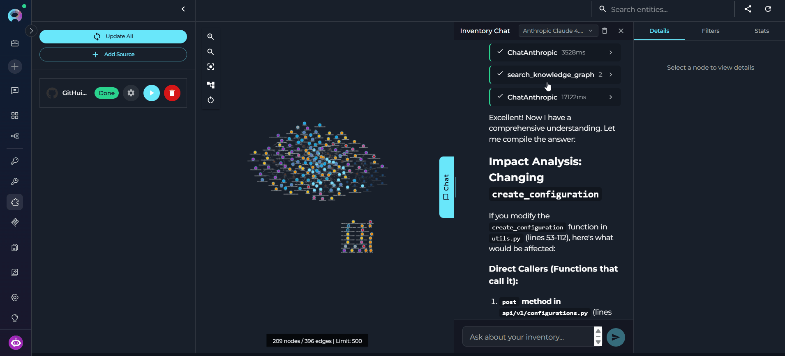
  </Step>
</Steps>

---

### Graph Canvas

The graph canvas is an interactive visualization of the knowledge graph that runs alongside the chat. Its purpose is to give you a spatial, visual understanding of how entities relate to each other — complementing the text-based chat responses with a navigable map of the codebase.

**How it updates:** Every entity the agent touches during a conversation — whether retrieved, searched, or referenced — is automatically merged into the canvas. The graph grows organically as you ask questions: new nodes and edges appear after each response without any manual action. Entities returned by the most recent response are highlighted so you can immediately see what changed.

Nodes on the canvas may be **connected** — linked to other nodes by visible edges representing relations — or **unconnected** — entities returned by the chat that have no direct relation to other currently visible nodes. Unconnected nodes may gain edges as the conversation continues and more related entities are added to the canvas.

    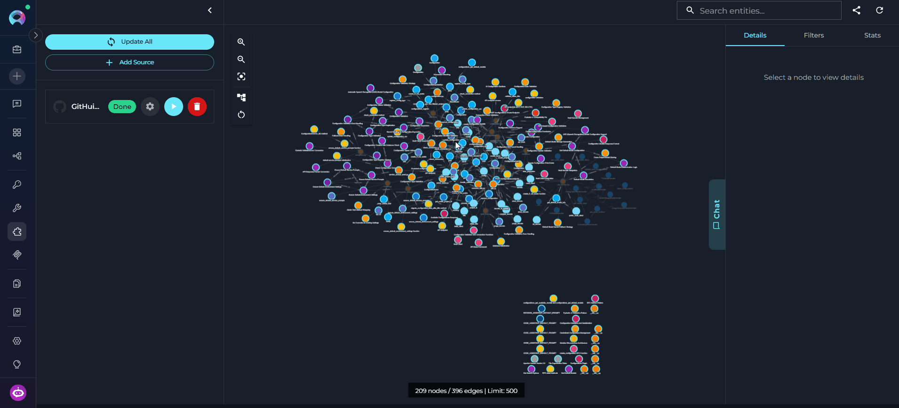


**What you can do with it:**

- **Pan and zoom** freely to navigate large graphs and use the minimap to orient yourself.
- **Fit to View** — resets the viewport to fit all currently visible nodes within the canvas area. Use this after new entities are added to bring the full graph back into view.
- **Re-layout** — re-runs the automatic layout algorithm to redistribute nodes and edges evenly. Useful when the canvas becomes cluttered after many entities are added through conversation.
- **Clear** — removes all nodes and edges from the canvas, giving you a clean slate. The underlying knowledge graph is not affected — entities can be re-added by continuing the conversation.
- **Click any node** to select it and open its details in the right panel.
- **Use the right panel tabs** — **Details**, **Filters**, and **Stats** — to inspect entities, control what is shown, and review graph statistics.

<Tabs>
  <Tab title="Details">
    Shows the **Entity Panel** when a node is selected in the graph canvas — either by clicking a node directly or when the chat highlights an entity in a response.

    | Field | Description |
    |-------|-------------|
    | **Name** | Entity name with **Type** chip and **Layer** chip |
    | **ID** | Internal graph identifier (monospace) |
    | **Description** | Extracted description from the ingestion pipeline |
    | **File Location** | Source file path and line numbers; shows multiple citations if the entity appears in more than one file |
    | **Knowledge Triple** | Subject / predicate / object — present on knowledge-layer entities |
    | **Properties** | All key-value properties extracted during ingestion |
    | **Relations** | Linked entities with their relation types (`CALLS`, `IMPORTS`, `EXTENDS`, `IMPLEMENTS`, `CONTAINS`, etc.) |

    Click any relation entry to navigate directly to that entity. Close the panel to deselect.
    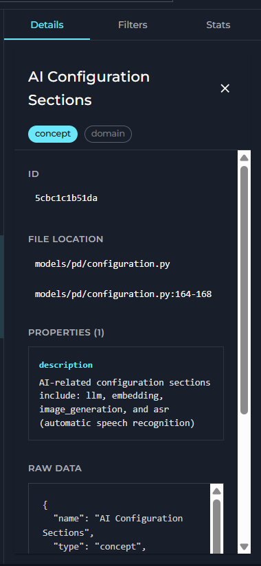
  </Tab>
  <Tab title="Filters">
    Controls what is rendered in the graph canvas and scopes both graph search and chat context to the selected subset.

    **Search Scope**

    | Control | Range | Description |
    |---------|-------|-------------|
    | **Depth** | 1–5 | Number of relationship hops to follow when fetching neighbors for a search result |
    | **Max Nodes** | 50–1000 | Maximum number of entities to render in the canvas at once |

    **Sources**
    - Checkbox list of all ingested source toolkits
    - Restricts the graph view and chat context to the selected repositories
    - Use **All / Clear** buttons to quickly select or deselect everything

    **Node Types**
    - Checkbox list of all entity types present in the current graph (e.g., `class`, `function`, `api_endpoint`, `service`)
    - Each type is color-coded to match its node color in the canvas
    - Unchecking a type hides those nodes from the canvas without removing them from the graph

    **Edge Types**
    - Checkbox list of all relation types present (e.g., `CALLS`, `IMPORTS`, `EXTENDS`)
    - Unchecking a type hides those edges from the canvas

    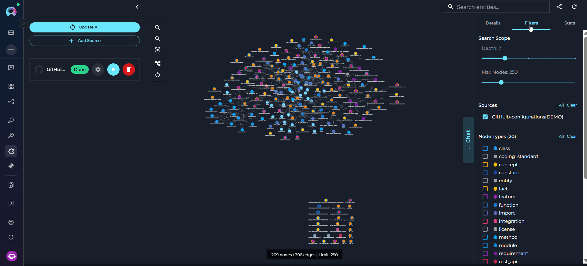
  </Tab>
  <Tab title="Stats">
    Provides a live summary of the knowledge graph and local cache. Content is loaded on the first visit to the tab.

    **Overview**

    | Card | Description |
    |------|-------------|
    | **Entities** | Total number of nodes in the graph |
    | **Relations** | Total number of edges |

    **Breakdowns**
    - **Sources** — per-source entity counts shown as chips (e.g., `my-github-repo (1,243)`)
    - **Entity Types** — top 10 entity types by count (e.g., `function: 892`, `class: 341`)
    - **Layers** — entity counts per semantic layer (`code`, `service`, `data`, `domain`, etc.)

    **Maintenance** *(expandable)*

    | Action | Description |
    |--------|-------------|
    | **Normalize Types** | Consolidates type name variations (e.g., `Feature` → `feature`) to reduce noise in the type list. Shows before/after counts. |
    | **Rebuild Indices** | Fixes index inconsistencies. Reports entity count, unique types, and indexed files after completion. |

    **Cache** — local graph cache usage: total size, graph count, and per-graph details.

    Click **Refresh** (↺ icon in the top-right of the app bar) to reload stats after ingestion completes.
    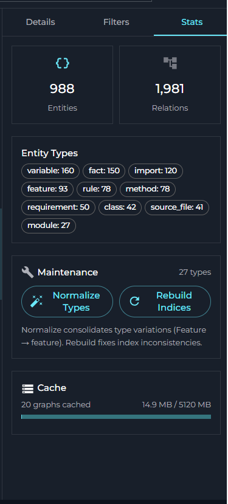

  </Tab>
</Tabs>

---

## Integrating Inventory into Agents, Chats, and Pipelines

To give an ELITEA Agent, Chat, or Pipeline access to the knowledge graph, you need an **Inventory Search toolkit** — a separate, lightweight read-only toolkit that connects to an existing Inventory application. The flow is:

**Create Inventory Application (Apps menu) → Ingest Data → Create Inventory Search Toolkit (Toolkits menu) → Add Toolkit to Agent / Chat / Pipeline**

<Info title="Two Distinct Objects">
The **Inventory application** (created in Apps) manages data sources, ingestion, and the knowledge graph — it is the data store. The **Inventory Search toolkit** (created in Toolkits) is a read-only connector that agents use to query that graph. They are separate objects; you need both.
</Info>

---

### Step 1: Create the Inventory Search Toolkit

<Note title="Prerequisite">
An Inventory application must already exist and have at least one source fully ingested before creating the search toolkit. Complete [Create Inventory Application](#create-inventory-application) and [Running Ingestion](#running-ingestion) first.
</Note>

      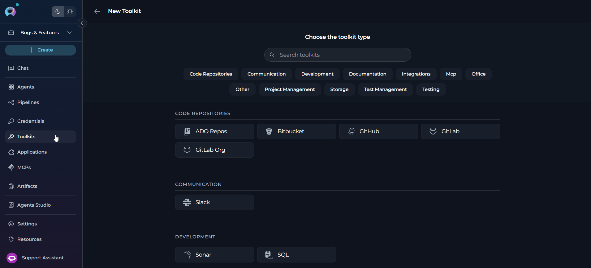

<Steps>
  <Step title="Navigate to Toolkits">
    Open the sidebar and select **Toolkits**.
  </Step>

  <Step title="Create a New Toolkit">
    Click **`+ Create Toolkit`**. The toolkit type selector opens showing all available toolkit types.
  </Step>

  <Step title="Select Inventory Search">
    Scroll to or search for **Inventory Search** in the type list and click it. The configuration form opens.
  </Step>

  <Step title="Configure the Toolkit">
    Fill in the toolkit settings:

    | Parameter | Required | Description |
    |-----------|----------|-------------|
    | **Name** | Yes | A descriptive name for this toolkit (e.g., *"Backend Graph Search"*) |
    | **Description** | No | Optional description of what this toolkit connects to |
    | **Inventory Toolkit** | Yes | Select the existing Inventory application to connect to — the dropdown shows all configured Inventory applications in the project |
    | **Tools** | Yes | Enable the tools the agent should use: `search_knowledge_graph`, `get_entity_details`, `get_related_entities`, `query_graph`, `list_entity_types`, `investigate` |
  </Step>

  <Step title="Save the Toolkit">
    Click **Save**. The Inventory Search toolkit is now available to add to agents, chats, and pipelines.
  </Step>
</Steps>

**Available Tools in the Inventory Search Toolkit**

| Tool | Description |
|------|-------------|
| **`search_knowledge_graph`** | Token-based search for entities by name or concept. Supports `entity_type` and `layer` filters. |
| **`get_entity_details`** | Returns full details for a specific entity: description, file location, properties, and relations. |
| **`get_related_entities`** | Returns entities related to a given entity, filtered by relation type (`CALLS`, `IMPORTS`, `EXTENDS`, etc.) and direction. |
| **`query_graph`** | Structured JQL-like filtering: `type:class layer:code file:*.py related:UserService`. No similarity search — exact structural queries only. |
| **`list_entity_types`** | Lists all entity types present in the graph with counts — use this to understand what's available before searching. |
| **`investigate`** | Ask a natural language question; an AI agent searches the graph, traverses relationships, and returns a reasoned answer with citations. Use for complex multi-entity questions. |


---

### Step 2: Add the Toolkit to an Agent, Chat, or Pipeline

<Steps>
  <Step title="Navigate to the Target Menu">
    Open the sidebar and select **[Agents](../../menus/agents)**, **Chats**, or **Pipelines** — depending on where you want to use the Inventory Search toolkit.
  </Step>

  <Step title="Create or Open an Item">
    Click **`+ Create`** to create a new agent, chat, or pipeline, or click an existing item's name to open its configuration.
  </Step>

  <Step title="Add the Inventory Search Toolkit">
    1. Scroll to the **Toolkits** section of the configuration.
    2. Click the **`+ Toolkit`** button.
    3. In the dropdown, select the Inventory Search toolkit you just created.
    4. The toolkit is added with all its tools enabled.

    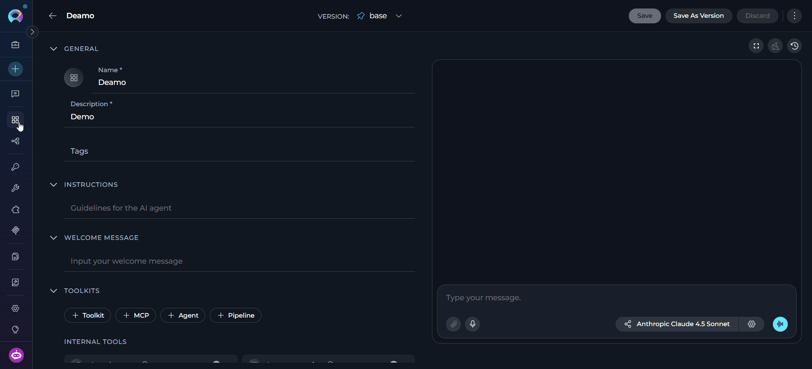
  </Step>

  <Step title="Write Instructions (Agents only)">
    In the **Instructions** field, tell the agent when and how to use the Inventory Search tools. See the examples below.
  </Step>

  <Step title="Save">
    Click **Save**. The agent, chat, or pipeline can now search and explore the knowledge graph.
  </Step>
</Steps>

---

### Example Conversation Starters

| Goal | Example Prompt |
|------|----------------|
| Find a component | *"Find the class responsible for handling authentication."* |
| Explore dependencies | *"What does `UserService` depend on?"* |
| Upstream callers | *"What calls `create_configuration`? Show the full call chain."* |
| Change impact | *"If I modify `PaymentProcessor`, what else could break?"* |
| API inventory | *"List all API endpoints in the `api/v1/` layer."* |
| Architecture overview | *"How does the authentication system work? Trace the full flow."* |
| Entity types | *"What types of entities are in the knowledge graph?"* |
| Cross-repo links | *"Are there cross-repository dependencies between the backend and the shared-lib repo?"* |

---

## <Icon icon="circle-check" size={26} /> Best Practices

<Accordion title="Ingestion Strategy">
1. **Use Language Presets:** Apply a language preset (`python`, `typescript`, `java`, etc.) when ingesting language-specific repositories — presets include sensible include/exclude patterns that keep the graph focused on meaningful source files
2. **Start with a Subset:** For large repositories, use `file_patterns` to ingest a meaningful subset first (e.g., `src/**/*.py`) and verify quality before ingesting the full codebase
3. **Prefer Incremental Over Full Rebuild:** Incremental updates track each file's content hash and skip unchanged files automatically — only modified files are re-processed. Reserve `full_rebuild=True` for cases where the graph has become inconsistent or entity types have changed significantly
4. **Use Delta Updates for Small Changes:** After merging a small pull request, use `delta_update` with the changed file paths instead of re-ingesting the entire repository
5. **Exclude Test and Vendor Files:** Exclude `**/test/**`, `**/tests/**`, and `**/vendor/**` patterns unless you specifically need test entities in the graph — they add noise and increase ingestion time
6. **Ingestion Is Resumable:** If ingestion is interrupted (server restart, timeout, manual stop), it automatically resumes from the last saved checkpoint on the next run — no data is lost and already-processed files are not re-processed. To force a completely fresh start, run `run_ingestion` with `full_rebuild=True`
</Accordion>

<Accordion title="Graph Management">
1. **Monitor Source Status:** Check `get_sources_status` after triggering ingestion — it shows per-source status (`pending`, `in_progress`, `completed`, `error`) and entity counts
2. **Use `get_graph_info` Before Querying:** Call `get_graph_info` to confirm the graph is loaded and review what sources and entity counts are available before performing search operations
3. **Semantic Search Uses a Fixed Local Embedding Model:** Entity embeddings are generated using a pinned local model (`all-MiniLM-L6-v2`) that is the same across all Inventory deployments — this ensures consistent vector dimensions between ingestion and retrieval without any user configuration
4. **Clean Up Stale Graphs:** Periodically remove graphs from sources that are no longer relevant using `remove_source_entities` — stale entities reduce search relevance
5. **Share One App Across Agents:** When multiple agents need to query the same codebase, point them all to the same Inventory application — the knowledge graph is shared and there is no need to create separate applications per agent
6. **Explore Community Clusters:** For large graphs, Inventory automatically detects structural communities (clusters of related entities) after ingestion — use `list_communities` in the chat to get a high-level architectural overview, then `search_within_community` to search within a specific cluster
</Accordion>

<Accordion title="Search and Query">
1. **Use Token Matching for Known Names:** `search_knowledge_graph` excels at finding entities whose names partially match query tokens — use it first when you know the class or function name
2. **Use Semantic Search for Concepts:** When the graph has embeddings, the `semantic_search` tool finds entities by meaning rather than exact name (e.g., "authentication logic", "database connection handling") — it is selected automatically when your query is conceptual rather than name-based
3. **Filter by Layer to Reduce Noise:** The `layer` filter in `search_knowledge_graph` and `query_graph` significantly narrows results — use `code` for classes/functions, `service` for APIs/endpoints, and `data` for models/schemas
4. **Follow Entity References in Results:** Entity references in search results use the format `Name (type)` or `Name (type) @ source - path` — copy these references exactly when calling `get_entity_details`, `impact_analysis`, or `get_related_entities`
5. **Use `query_graph` for Precise Filters:** When `search_knowledge_graph` returns too many results, switch to `query_graph` with structured filters like `type:class layer:service file:src/api/**` for precision
6. **Use `query_pattern` for Multi-Hop Traversal:** For structural path queries (e.g., "what does ClassName call through 3 hops"), use the Cypher-like `query_pattern` syntax: `(ClassName)-[:calls*1..3]->(?)`. Call `get_pattern_vocabulary` first to discover the available relation types and entity types in the graph. Multi-segment chains are also supported: `(A)-[:calls]->(B)-[:imports]->(C)`
</Accordion>

---

## <Icon icon="triangle-exclamation" size={26} /> Troubleshooting

<Accordion title="Ingestion Fails">
**Possible causes:**

* Source toolkit authentication invalid or expired
* Repository or branch not found
* Repository has no files matching the configured file patterns
* LLM API errors or rate limit hit during entity extraction
* Storage bucket does not exist or the service lacks write permissions

**Solutions:**

* Verify the source toolkit is properly configured and authenticated in the Toolkits menu
* Confirm the repository exists and the configured branch is correct
* Check that the file patterns (whitelist/blacklist) are not excluding all files — use `list_presets` and `get_preset_info` to review preset patterns
* Check `get_sources_status` for the specific error message associated with the failed source
* Verify the `bucket` parameter refers to an existing, writable storage bucket
* Check LLM API quota and ensure the configured model is accessible
</Accordion>

<Accordion title="Ingestion Is Slow">
**Possible causes:**

* Large repository with many files being fetched and processed
* LLM extraction is slow for large or complex source files
* File patterns include non-source files (configuration, generated code, test fixtures)

**Solutions:**

* Apply a language preset to automatically exclude dependency, build output, and test directories
* Use `file_patterns` to limit ingestion to specific directories (e.g., `src/**/*.py` instead of `**/*.py`)
* Exclude vendor, dependency, and generated directories explicitly with `exclude_patterns` (e.g., `**/node_modules/**,**/dist/**`)
* Use `delta_update` for routine updates instead of re-running full ingestion
</Accordion>

<Accordion title="Search Returns No Results">
**Possible causes:**

* Ingestion has not been run or has not completed for the relevant source
* Search query uses terminology different from entity names in the graph
* Entity type or layer filter is too restrictive
* Graph is empty or the wrong graph is loaded

**Solutions:**

* Check `get_sources_status` to confirm ingestion has completed (`status: completed`) for the relevant source
* Use `get_stats` to verify entity counts — a zero count indicates the graph is empty or ingestion failed
* Remove or relax the `entity_type` and `layer` filters and search with a broader query first
* Use `get_graph_info` to confirm the correct graph is loaded
* Try different query tokens — use partial names or broader terms (e.g., `"auth"` instead of `"AuthenticationHandler"`)
</Accordion>

<Accordion title="Semantic Search Fails or Returns Poor Results">
**Possible causes:**

* Embeddings were not generated during ingestion — this can happen if the `langchain_community` package or `sentence-transformers` model was unavailable on the server
* Semantic search query is too narrow or uses domain-specific jargon not present in the codebase
* The graph is very small — semantic search requires a minimum number of entities to return meaningful similarity results

**Solutions:**

* Check `get_stats` for an `embeddings_count` field — if zero or absent, embeddings were not generated; contact your administrator to re-run ingestion with the embedding model available
* Fall back to token-based `search_knowledge_graph` if semantic search returns poor results — token matching does not depend on embeddings and works regardless
* Broaden or rephrase the semantic query using more general terms (e.g., "user login" instead of "JWT PKCE flow validation")
* Confirm the `semantic_search` tool is available in the chat — it only appears in the agent's tool list when embeddings exist in the graph
</Accordion>

<Accordion title="Impact Analysis Returns Unexpected Results">
**Possible causes:**

* Entity reference format is incorrect — must match the format from search results
* Graph is partially ingested — not all sources that reference the entity have been ingested
* `max_depth` is too low to traverse the full dependency chain
* Relations were not extracted for the entity during ingestion

**Solutions:**

* Copy entity references exactly from `search_graph` or `get_entity` results — use the format `Name (type)` or `Name (type) @ source - path`
* Ensure all relevant sources are fully ingested before running impact analysis
* Increase `max_depth` (default: 3) if you need to trace deeper dependency chains
* Use `get_entity` with `include_relations=True` to verify that the entity has extracted relations before running impact analysis
</Accordion>

<Accordion title="Graph Cache Issues">
**Possible causes:**

* Local graph cache is full or contains stale graphs
* Cache size limits (`max_cache_size_gb: 5.0`, `max_graphs: 50`) have been reached
* Graphs older than `max_age_days: 2` are being evicted automatically

**Solutions:**

* Use `get_cache_stats` to review current cache usage and per-graph details
* Use `cleanup_cache` to force cleanup of stale graphs (normally runs automatically every hour)
* Contact your administrator if the cache limits need to be increased for your environment
</Accordion>

<Accordion title="Chat Interface Gives Incomplete or Wrong Answers">
**Possible causes:**

* Knowledge graph is stale — repository has changed since last ingestion
* The queried entity type or concept was not extracted during ingestion (e.g., due to restrictive file patterns)
* Chat session exceeded the 30-minute timeout and was automatically cancelled
* Chat context is limited to the last 10 messages — earlier context from a long conversation is no longer visible to the agent

**Solutions:**

* Re-run ingestion to refresh the graph with the latest repository state
* Check `get_stats` to verify that the entity type you are asking about has entries in the graph
* For complex multi-step questions, break them into smaller focused questions
* If the session was cancelled due to timeout, start a new chat session
* Start a new chat session for each independent topic — context from more than 10 messages ago is not included in the agent's context window
* Use `search_knowledge_graph` or `query_graph` directly to verify what is in the graph before expecting the chat to find it
</Accordion>

<Accordion title="LLM Configuration Issues">
**Possible causes:**

* LLM model not accessible or API key expired
* Insufficient context window for extracting entities from large source files
* LLM rate limits reached during parallel entity extraction

**Solutions:**

* Verify the LLM model is properly configured and the API key is valid in the ELITEA configuration
* Check that API key quotas have not been exceeded
* If extraction fails on large files, consider using file patterns to split ingestion into smaller batches
* Check the ingestion logs — LLM extraction failures are per-file and non-fatal; the pipeline continues and reports failed files in the result
</Accordion>

---

## <Icon icon="circle-question" size={26} /> FAQ

<Accordion title="What is a knowledge graph and how is it different from a vector index?">
A knowledge graph stores code entities (classes, functions, services, APIs, etc.) as nodes and their relationships (CALLS, IMPORTS, EXTENDS, IMPLEMENTS, etc.) as edges. This structure enables precise dependency tracing, relationship traversal, and structured queries — operations that a vector index alone cannot support. Vector search (semantic search) is an optional complement: if an embedding model is configured, entity descriptions are also vectorized for natural language queries. The two approaches are used together in the Inventory chat interface.
</Accordion>

<Accordion title="How long does ingestion take?">
Ingestion time depends on repository size and the scope of file patterns:

* Small repositories (< 100 files): 1–3 minutes
* Medium repositories (100–1,000 files): 3–10 minutes
* Large repositories (> 1,000 files): 10–30+ minutes

Using a language preset or restricting file patterns significantly reduces ingestion time. Monitor per-source status with `get_sources_status` during ingestion.
</Accordion>

<Accordion title="Can I add multiple source repositories to a single Inventory application?">
Yes. Inventory supports multi-source ingestion — you can add multiple source toolkits (e.g., a GitHub repo and an ADO repo) to a single application. Entities with the same name and type are merged across sources, and cross-source relations are automatically tracked. Use `get_cross_source_relations` to explore links between entities from different sources.
</Accordion>

<Accordion title="What is the difference between run_ingestion and delta_update?">
`run_ingestion` processes the entire source toolkit: it fetches all files matching the configured patterns and rebuilds the relevant portion of the graph (or the full graph if `full_rebuild=True`). `delta_update` processes only the specific file paths you provide — it is faster and less resource-intensive but requires you to know exactly which files changed. Use `delta_update` for targeted refreshes after small code changes, and `run_ingestion` for broader updates.
</Accordion>

<Accordion title="What entity types does Inventory extract?">
Inventory extracts entities across multiple semantic layers:

* **Code layer:** classes, functions, methods, modules, interfaces, constants — extracted using AST-based parsing (no LLM required)
* **Service layer:** APIs, endpoints, services, RPCs
* **Data layer:** data models, schemas, tables, columns
* **Product layer:** features, UI flows, screens
* **Domain layer:** business objects, rules, glossary terms
* **Documentation layer:** documentation pages, README content
* **Configuration layer:** configuration files, environment settings
* **Testing layer:** test cases, test suites
* **Structure layer:** file container nodes (`source_file`, `document_file`, `config_file`) — one per ingested file
* **Knowledge layer:** semantic facts extracted from code and documentation, including:
  - *From code:* `algorithm` (design patterns, complexity), `behavior` (what the code does, side effects), `validation` (input checks, guards), `dependency` (external service calls, API usage), `error_handling` (retry strategies, fallback logic)
  - *From docs:* `decision` (architectural decisions), `definition` (term definitions), `requirement`, `date`, `contact` (ownership information)

Higher-level entities (services, domain concepts, knowledge facts) are extracted using the configured LLM. Code-layer entities use AST parsing and do not require LLM calls.
</Accordion>

<Accordion title="Can the embedding model affect semantic search results?">
Inventory uses a fixed, pinned local embedding model (`all-MiniLM-L6-v2`) for generating entity vectors during ingestion. This model is the same across all Inventory deployments and does not depend on user configuration — it ensures that ingestion-time and query-time vectors are always in the same vector space.

The LLM model configured in the application is used for entity extraction (understanding code semantics), not for embedding generation. Changing the LLM model does not affect vector search.

If your deployment uses a custom or alternative embedding model (administrator-configured), changing it after ingestion will invalidate stored vectors and break semantic search. In that case, delete the existing graph and re-run full ingestion with the new model in place.
</Accordion>

<Accordion title="Can multiple agents use the same Inventory application?">
Yes. Multiple agents can use the same Inventory application simultaneously for all search and retrieval operations. Ingestion tools (`run_ingestion`, `delta_update`) are async and concurrent invocations from different agents will each be tracked independently, but simultaneous full ingestion of the same source may cause conflicts — avoid running multiple full ingestions for the same source at the same time.
</Accordion>

<Accordion title="What happens if ingestion is run in K8s Jobs mode?">
When the `INVENTORY_JOBS_ENABLED` environment variable is set to `true`, the `run_ingestion` tool delegates processing to Kubernetes Jobs instead of in-process subprocesses. This is the recommended mode for production deployments as it isolates ingestion workloads and scales independently. The behavior from the user perspective is identical — ingestion is still async and status is tracked through `get_sources_status`. Contact your administrator to enable or configure K8s Jobs mode.
</Accordion>

<Accordion title="How is the knowledge graph stored?">
The knowledge graph is persisted as a JSON file in the configured storage bucket. Locally, graphs are cached on disk under `/data/graphs` (configurable) with a maximum cache size of 5 GB and up to 50 cached graphs. Graphs not accessed within 2 days are automatically evicted from the local cache (they remain in the storage bucket and can be reloaded). Use `get_cache_stats` to monitor local cache usage.
</Accordion>

<Accordion title="Does the chat support graph pattern queries and multi-hop traversal?">
Yes. In addition to natural language search, the Inventory chat agent can execute Cypher-like structural pattern queries via the `query_pattern` tool. Patterns follow this syntax:

```
(SourceEntity)-[:relation_type*min..max]->(TargetEntity)
```

Examples:
- `(UserService)-[:calls*1..3]->(?)` — find everything UserService calls within 3 hops
- `(?:class)-[:extends]->(BaseService)` — find all classes that extend BaseService
- `(Controller)-[:*1..5]->(DB_URL)` — any path from Controller to DB_URL in up to 5 hops

Multi-segment chain patterns (up to 4 segments) are also supported:
```
(A)-[:calls]->(B)-[:imports]->(C)
```

Before writing a pattern query, ask the chat to `get_pattern_vocabulary` — this lists all entity types and relation types currently in your graph so you can compose valid patterns. The chat agent selects `query_pattern` automatically for traversal-style questions like "what does X depend on through N levels" or "trace the call chain from A to B".
</Accordion>

---

<Info title="Additional Resources">
For more information about Inventory and related features:

* **[Artifacts Menu](../../menus/artifacts)** — Managing storage buckets used by Inventory
* **[Agents Menu](../../menus/agents)** — Using Inventory tools in agents
* **[GitHub Toolkit](../toolkits/github_toolkit)** — Setting up GitHub source access
* **[GitLab Toolkit](../toolkits/gitlab_toolkit)** — Setting up GitLab source access
* **[Wikis Application](./wikis)** — AI-powered documentation generation from code repositories
</Info>
