---

## Introduction

The **Wikis application** within ELITEA is an advanced AI-powered documentation generator that analyzes code repositories (GitHub, GitLab, Bitbucket, ADO Repos) to create comprehensive wikis through intelligent code analysis and natural language processing. With Wikis, your ELITEA Agents can automatically generate documentation, answer questions about codebases, and perform deep research on repository functionality.

<CardGroup cols={2}>
  <Card title="Automated Wiki Generation" icon="book">
    Creates comprehensive documentation from repository analysis, including architecture overviews, API documentation, and code explanations.
  </Card>
  <Card title="Intelligent Code Analysis" icon="diagram-project">
    Uses Enhanced Unified Graph Builder (EUGB) to understand code structure, dependencies, and relationships across the repository.
  </Card>
  <Card title="Interactive Q&A" icon="comments">
    Enables natural language questions about the codebase with context-aware answers based on the generated knowledge base.
  </Card>
  <Card title="Deep Research Capabilities" icon="magnifying-glass">
    Performs multi-step analysis with planning and investigation to answer complex questions about repository functionality.
  </Card>
  <Card title="Diagram Generation" icon="chart-network">
    Automatically creates Mermaid diagrams to visualize architecture and technical concepts.
  </Card>
</CardGroup>

Integrating Wikis with ELITEA empowers your Agents to understand, document, and explain codebases automatically, making it easier to onboard new team members, maintain documentation, and answer technical questions about your projects.

---

## Prerequisites

<CardGroup cols={3}>
  <Card title="Code Repository Toolkit" icon="code-branch">
    A configured toolkit for accessing your code repository (GitHub, GitLab, Bitbucket, or ADO Repos).
  </Card>
  <Card title="LLM Configuration" icon="brain">
    Access to a configured LLM model for text generation.
  </Card>
  <Card title="Embedding Model" icon="vector-square">
    A configured embedding model for vector search and retrieval.
  </Card>
</CardGroup>


---

## System Integration with ELITEA

Wikis integrates with ELITEA as an **Application** accessible through the **Apps menu**. It provides specialized documentation generation and analysis tools with a built-in user interface for managing wiki content and repository analysis workflows.

### Request Wikis Application Access

If the **Wikis** application is not yet enabled for your project, the App Catalog card shows a **Request Access** button instead of **Configure**. Submit a request to have it enabled by your administrator.

1. **Navigate to Apps:** Open the sidebar and select **Apps**.
2. **Open the App Catalog tab:** Select the **App Catalog** tab to browse available applications.
3. **Locate the Wikis card:** Find the **Wikis** card in the catalog.
4. **Click Request Access:** Click the **Request Access** button on the Wikis card.
5. **Provide a reason:** In the request modal, enter a description of why you need access to the Wikis application.
6. **Submit the request:** Click **Submit** to send the request to your administrator.
7. **Await approval:** Once approved, the card updates and the **Configure** button becomes available.
8. **Proceed with configuration:** Follow the steps in [Create Wikis Application](#create-wikis-application) to set up the application.

     

---

### Create Wikis Application

1. **Navigate to Apps:** Open the sidebar and select **Apps**.
2. **Open the App Catalog tab:** Select the **App Catalog** tab to browse available applications.
3. **Locate the Wikis card:** Find the **Wikis** card in the catalog.
4. **Start configuration:** Click the **Configure** button on the Wikis card. This opens the application configuration form.

     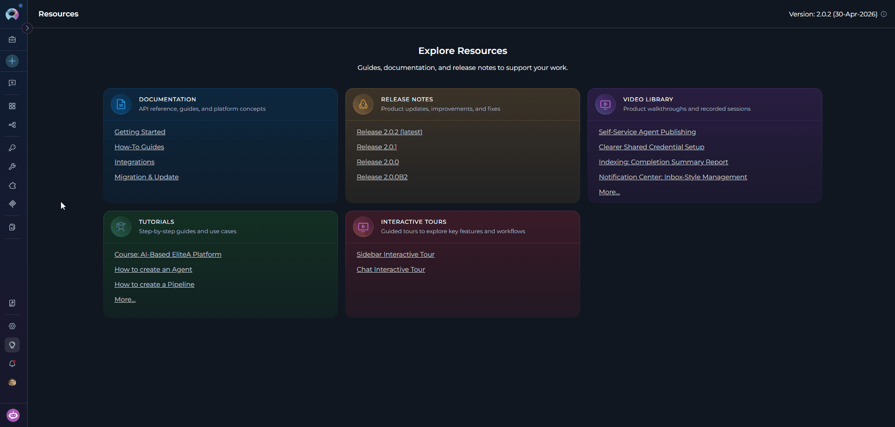

5. **Configure Application Settings:**

    | Parameter | Required | Description | Example |
    |-----------|----------|-------------|----------|
    | **Toolkit Name** | Yes | Descriptive name for the application | "Project Documentation Generator" |
    | **Description** | No | Optional description of the application's purpose | "Generates wiki documentation for main project repo" |
    | **LLM Model** | Yes | LLM model for text generation and wiki content creation | "gpt-4", "claude-sonnet-3-5" |
    | **Embedding Model** | No | Embedding model for vector search and retrieval (default: text-embedding-3-small) | "text-embedding-3-small" |
    | **Code Toolkit** | Yes | Code toolkit (GitHub, GitLab, Bitbucket, or ADO Repos) for accessing repository data | Select from configured toolkits |
    | **Max Tokens** | Yes | Maximum tokens for LLM responses (default: 64000) | 64000, 128000 |
    | **Tools** | No | Select which tools to enable (default: all tools) | generate_wiki, ask, deep_research |

6. **Save Application:** Click **Save** to create the application.

    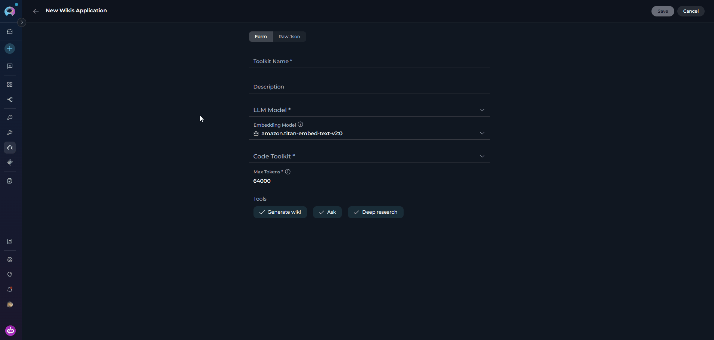

<Info title="Application Interface">
The Wikis Application includes an integrated user interface accessible through the application detail page. This interface provides:

* Visual wiki generation management
* Progress monitoring for documentation generation
* Access to generated wiki content
* Repository analysis status
</Info>

---

### Available Tools

The **Wikis** application toolkit provides three tools:

| **Tool Name** | **Required Parameters** | **Optional Parameters** | **Description** |
|---------------|------------------------|-------------------------|-----------------|
| **generate_wiki** | `query` | `planner_type`, `exclude_tests` | Analyzes the repository and generates a comprehensive structured wiki. Supports sync and async invocation. |
| **ask** | `question` | `repo_identifier_override`, `analysis_key_override` | Answers targeted questions about the repository using the generated knowledge base. Requires wiki to be generated first. |
| **deep_research** | `question` | `repo_identifier_override`, `analysis_key_override` | Performs multi-step deep analysis with planning, delegation, and comprehensive investigation. Requires wiki to be generated first. |

---

### Applications Tab

All created Wikis applications are listed in the **Applications** tab of the **Apps menu**. Each card displays the application name and description.

**To open a Wikis application:**

1. Navigate to the **Apps menu** in the sidebar and select the **Applications** tab.
2. Click on your Wikis application card.
3. The Wikis interface opens. Here you can manage wiki generation, access generated documentation, and monitor repository analysis.

     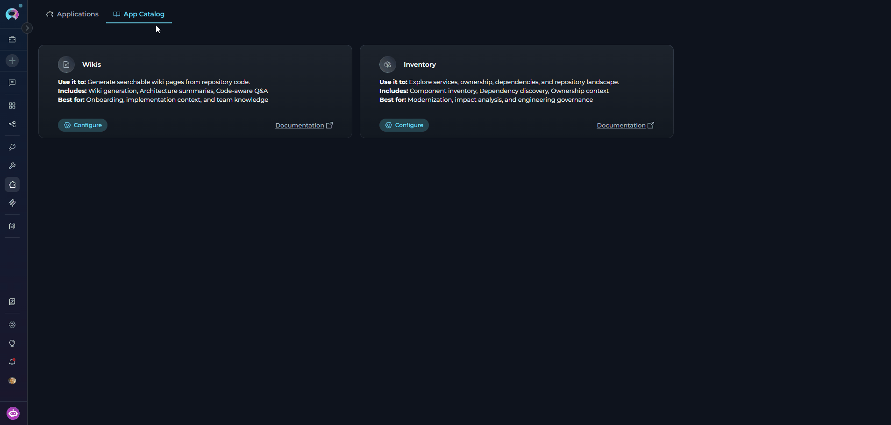

Use the action menu on any card to edit application settings or delete the application.

<Note>
If no applications have been configured yet, the **Applications** tab shows an empty state with the message **"No applications yet"**. Click **+ Create** to open the App Catalog, or click **Start Guided Tour** to take an interactive walkthrough.

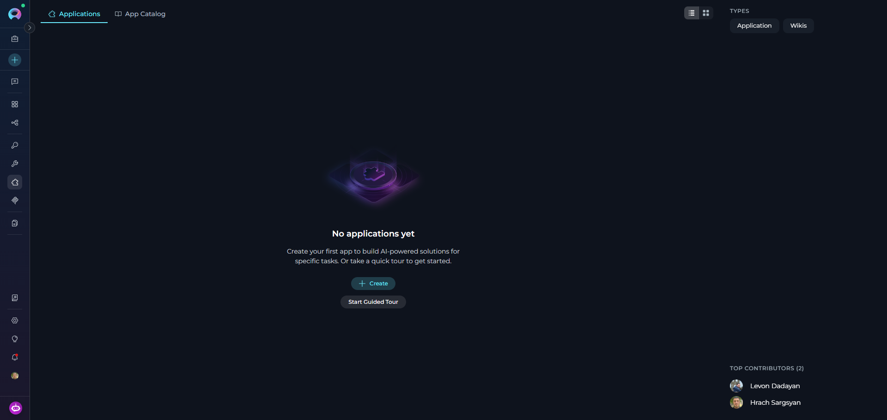
</Note>

---

## Working with the Wikis Application

The Wikis interface is organized into three main panels:

- **Left Sidebar:** Navigation panel for browsing generated wiki pages organized by sections
- **Main Content Area:** Wiki content with formatted markdown, code blocks, and diagrams
- **Chat Panel:** (Right side) For asking questions about your codebase using natural language

     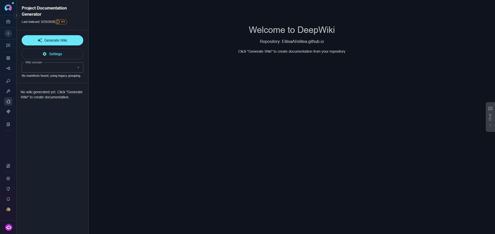

### Wiki Generation Workflow

Once you're in the Wikis application interface, follow these steps to generate documentation:

<Note title="How Wikis Analyzes Repositories">
Repository analysis runs automatically in the background when you use the `generate_wiki` tool — no manual configuration required. Wikis uses the configured code toolkit to access repository data and processes it efficiently based on repository size. The analysis includes:

* **Code Structure Analysis:** Examines repository organization, file relationships, and dependencies
* **Content Extraction:** Processes source code, documentation files, and comments
* **Knowledge Graph Creation:** Builds connections between different parts of your codebase
* **Vector Store Generation:** Creates searchable indexes for intelligent question answering
</Note>

**Step 1: Initiate Wiki Generation**

<Card title="Check Slot Availability Before Starting" icon="gauge">
Wiki generation runs on a limited number of parallel worker slots. Before clicking **Generate Wiki**, check the **slot availability indicator** chip next to the button — if all slots are occupied, your generation will be queued until one becomes free.

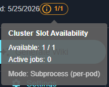

- **Green chip** — slots available, generation starts immediately
- **Yellow chip** — only 1 slot remaining, proceed with caution
- **Red chip** — all slots full, wait for a running generation to complete before starting a new one
</Card>

1. In the left sidebar, locate and click the **"Generate Wiki"** button.
2. In the **"Generate Wiki Documentation?"** dialog:
      - Under **Structure planner**, select a mode:
        - **Graph clustering** (recommended) — builds the outline deterministically from code-graph clusters; scales predictably from small repos to large monorepos
        - **Agentic** — the planner agent drafts the outline iteratively; may over-segment small or doc-light repositories
      - If **Graph clustering** is selected, optionally enable **"Smart skip tests"** to exclude test files from the cluster planner and keep the outline focused
      - Click **"Update"** to start generation, or **"Cancel"** to abort

  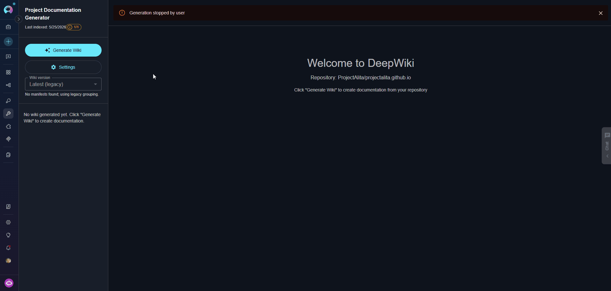
  
<Info title="Generation Time">
Generation time depends on your repository size: small repos (< 100 files) take 2-5 minutes, medium repos (100-1000 files) take 5-15 minutes, and large repos (> 1000 files) may take 15-30+ minutes.
</Info>

**Step 2: Monitor Generation Progress**

Once generation starts, monitor progress through the interface:

- **Progress Bar:** Appears below the Generate Wiki button
- **Status Messages:** Real-time updates show current operations (e.g., "Analyzing repository structure...", "Building knowledge graph...")
- **Elapsed Time:** Counter displays how long generation has been running

    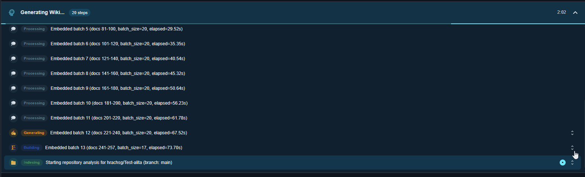

<Tip title="Background Processing">
Generation continues in the background if you navigate away. Return to the application to check completion status.
</Tip>

<Info title="Stopping Generation">
If you need to stop an in-progress generation, click the **"Stop Generation"** button in the sidebar. Note that partial results may not be saved. 


</Info>

###  Access Generated Documentation

Once generation completes:

1. The left sidebar populates with navigation sections
2. Click on any section to expand and view wiki pages
3. Select a page to view its content in the main area
4. Generated content includes:
      - Formatted markdown documentation
      - Code examples with syntax highlighting
      - Mermaid diagrams for visualizations
      - Cross-references between related topics

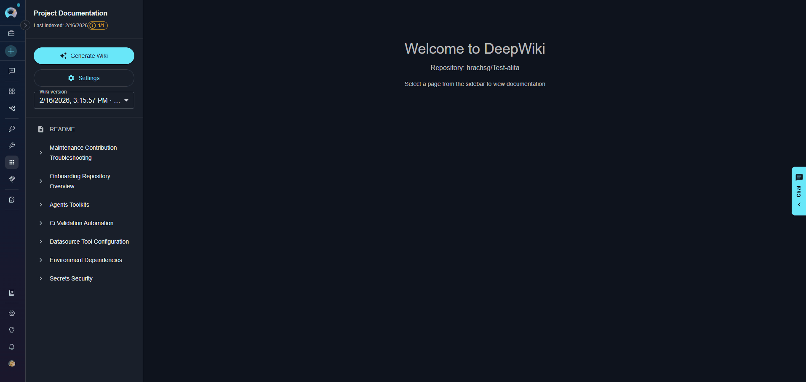

#### Edit Wiki Pages

Wikis allows you to edit generated documentation directly in the interface to refine or customize content:

**To Edit a Page:**

1. Navigate to the wiki page you want to modify
2. Click the **Edit** button (pencil icon) in the top-right corner of the page
3. The page opens in an editor with markdown formatting
4. Make your changes to the content
5. Click **Save** to apply changes or **Cancel** to discard

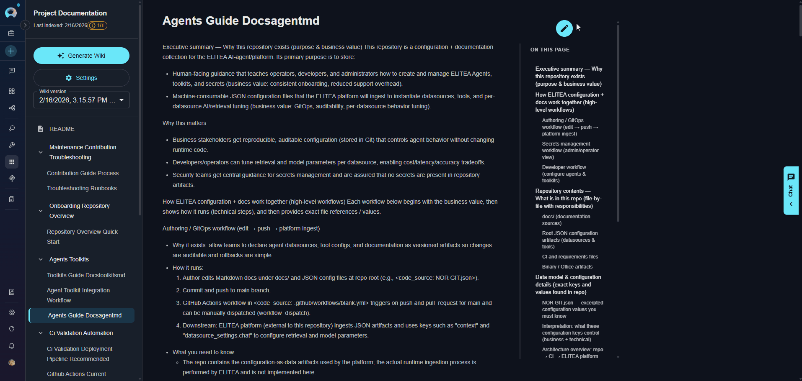

**Editing Capabilities:**

- **Markdown Editing:** Full markdown support for formatting text, adding links, creating lists, and more
- **Code Blocks:** Modify or add code examples with syntax highlighting
- **Diagrams:** Edit Mermaid diagram definitions to update visualizations
- **Content Organization:** Restructure sections, add new information, or clarify existing content

<Warning title="Manual Edits and Regeneration">
If you regenerate the wiki after making manual edits, your changes will be overwritten. Save important customizations separately or use version control to track modifications.
</Warning>

<Tip title="Best Practice">
Use manual edits for minor corrections or additions. For significant changes, consider updating the source code comments and documentation in your repository, then regenerating the wiki to reflect those updates automatically.
</Tip>

#### Update Generated Wiki

When your repository code changes, you can regenerate the wiki to update all sections with the latest information from your codebase.

<Info title="Incremental Updates">
Wikis automatically detects changes in your repository and updates relevant sections. The generation process is optimized to reuse cached analysis where possible, making updates faster than initial generation.
</Info>

**To Update Documentation:**

1. Make changes to your repository code, comments, or documentation files
2. Commit and push your changes to the repository
3. Return to the Wikis application interface
4. Click the **"Generate Wiki"** button in the left sidebar
5. Confirm the regeneration in the dialog
6. Wikis will re-analyze the repository and update all sections

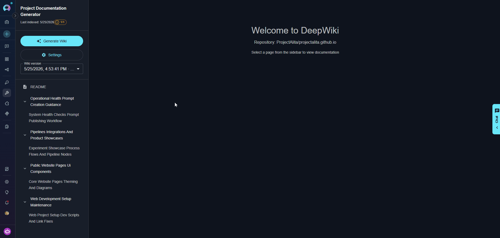

<Info title="Wiki Versions">
The interface includes a wiki version selector that lists all generated versions as versioned manifests, each identified by a timestamp. Select a version to browse the wiki as it was at that point. If no manifest-based versions exist, a fallback **Latest (legacy)** entry is shown.
</Info>


<Warning title="Manual Edit Preservation">
Regenerating the wiki will overwrite any manual edits you made to wiki pages. If you need to preserve custom content, save it separately before regenerating.
</Warning>

#### Wiki Artifacts Storage

When you generate a wiki, Wikis stores all generated files in the `wiki-artifacts` bucket under a per-wiki folder. You can access and manage these files through the **Artifacts Menu** in ELITEA.

**Bucket structure:**

```
wiki-artifacts/
├── _registry/wikis.json              # Global registry of all wikis
└── {wiki_id}/                        # Folder per wiki (e.g. owner--repo--branch)
    ├── wiki_manifest_{version}.json  # Versioned manifest (one per generation)
    ├── wiki_pages/                   # Generated markdown pages
    │   ├── {section}/
    │   │   └── {page}.md
    │   └── README.md
    ├── analysis/
    │   └── wiki_structure.json
    ├── {hash}.faiss                  # Vector index
    ├── {hash}.docstore.bin
    ├── {hash}.bm25.sqlite
    └── combined.code_graph.gz
```

All generated artifacts remain available in the bucket for download, sharing, or archival purposes.

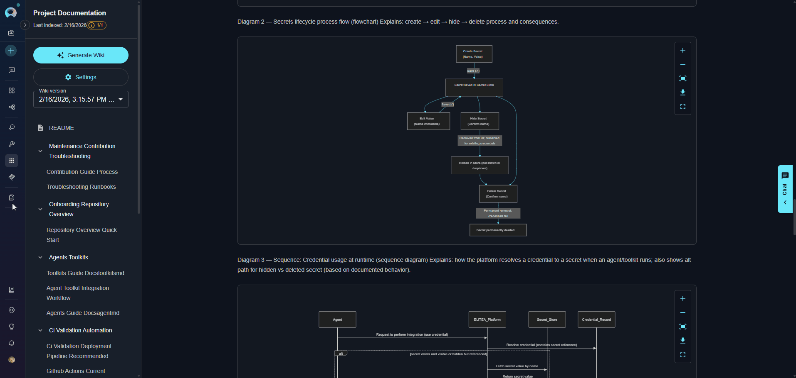

### Managing Settings

The Settings panel allows you to view and modify your Wikis application configuration.

**Opening Settings:**

1. In the left sidebar, click the **"Settings"** button (below Generate Wiki button)
2. The Settings panel opens from the right side

**Settings Parameters:**

| Parameter | Editable | Description |
|-----------|----------|-------------|
| **Max Tokens** | Yes | Token limit for LLM responses (default: 64000) |
| **Code Toolkit ID** | Yes | ID of the code toolkit used to access the repository |
| **LLM Model** | No | Language model used for wiki generation |
| **Embedding Model** | No | Embedding model used for vector search |

<Info title="Read-Only Fields">
The **LLM Model** and **Embedding Model** fields are read-only in the Settings panel. To change the model, delete and recreate the Wikis application with the desired model configuration.
</Info>

**Managing Wiki Data:**

- **Delete Wiki:** Removes all generated wiki artifacts from the bucket
     - Use this to clean up old documentation before regenerating
     - This action cannot be undone
  
**Saving Changes:**

1. Modify any editable configuration field
2. Click **"Save Settings"** button at the bottom
3. Settings are immediately applied to the toolkit

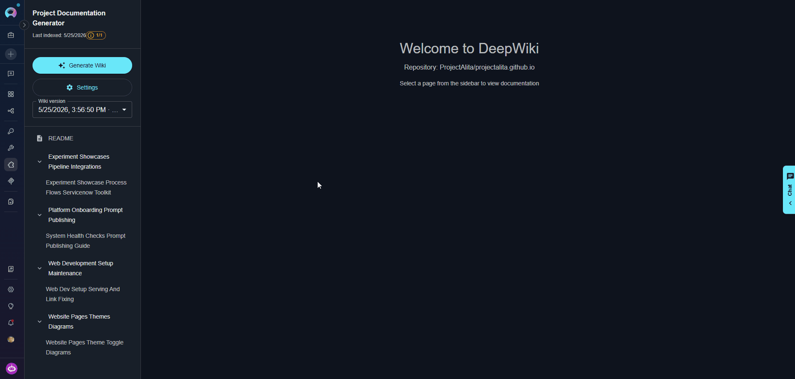

---

## Use the Chat Interface

<Info title="Generate Wiki First">
To use the chat features, you must first generate a wiki for your repository. The chat tools query the generated documentation to answer questions.
</Info>

After wiki generation completes, use the chat interface to query your repository's documentation and get AI-powered answers about your codebase.

**Opening the Chat:**

1. Locate the vertical **Chat** tab on the right edge of the interface
2. Click it to slide open the chat drawer

<Info title="Chat Requires Wiki">
The Chat tab is disabled (greyed out) until at least one wiki generation has completed. It becomes active once wiki pages are available to query.
</Info>


**Selecting a Query Tool:**

Wikis provides two tools for different types of questions:

| Tool | Best For | Response Time | Depth |
|------|----------|---------------|-------|
| **ask** | Quick, focused questions about specific code, APIs, or functionality | Fast (seconds) | Concise answers with code references |
| **deep_research** | Complex analysis requiring investigation across multiple files and concepts | Slower (minutes) | Comprehensive answers with evidence and multi-step reasoning |

**Using the Chat:**

1. Select your preferred tool using the toggle: **Ask** or **Research**
2. Type your question in natural language
3. Press **Enter** or click the **Send** button
4. The response streams in real time with thinking steps visible during processing
5. Use the **copy**, **regenerate**, or **clear** controls on each response as needed

<Tip title="Getting Better Answers">
- **Be specific:** Instead of "How does this work?", ask "How does the user authentication flow work in the login module?"
- **Reference components:** Mention specific files, classes, or modules you're interested in
- **Use follow-ups:** Build on previous answers with more detailed questions
- **Switch tools:** Start with `ask` for quick answers, then use `deep_research` for deeper investigation
</Tip>

<Info title="Example Questions by Type">
**For `Ask` tool (Quick Queries):**

- "What is the main architecture of this application?"
- "What APIs are available in the UserService class?"
- "How do I configure database connections?"
- "What is the purpose of secrets in the ELITEA configuration?"

**For `Research` tool (Complex Analysis):**

- "How does the authentication system work across all modules?"
- "Explain the complete data flow from API request to database"
- "What are the security implications of the current session management?"
- "Analyze the relationships between all microservices"
</Info>


---

## Using Wikis in Your Workflows

To give an ELITEA Agent, Chat, or Pipeline access to a generated wiki knowledge base, you need a **query toolkit** — a separate, lightweight read-only toolkit that connects to an existing Wikis application. The Wikis plugin provides two query toolkit types depending on your use case:

**Create Wikis Application (Apps menu) → Generate Wiki → Create Query Toolkit (Toolkits menu) → Add Toolkit to Agent / Chat / Pipeline**

<Info title="Three Distinct Objects">
The **Wikis application** (created in Apps) manages repository analysis, wiki generation, and the knowledge base — it is the data store. The **query toolkits** (created in Toolkits) are read-only connectors that agents use to query that knowledge base. They are separate objects; you need both.

- **Wikis Query toolkit** — connects to one specific Wikis application. Best when your agent always queries the same repository.
- **Wiki Query toolkit** — connects to the wiki registry and can query any available wiki. Best when your agent needs to work across multiple repositories or discover which wiki to use automatically.
</Info>

---

### Step 1: Create a Query Toolkit

<Note title="Prerequisite">
A Wikis application must already exist and have at least one wiki fully generated before creating a query toolkit. Complete [Create Wikis Application](#create-wikis-application) and [Wiki Generation Workflow](#wiki-generation-workflow) first.
</Note>

<Tabs>
  <Tab title="Wikis Query (Single Wiki)">
    Use this toolkit when your agent always queries **one specific repository**. It connects directly to a named Wikis application and exposes `ask` and `deep_research` for that wiki only.

    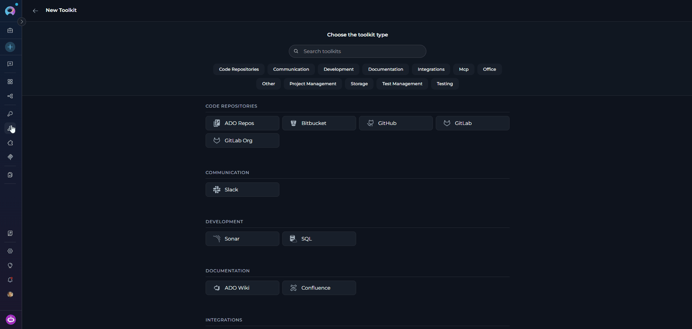

    <Steps>
      <Step title="Navigate to Toolkits">
        Open the sidebar and select **Toolkits**.
      </Step>

      <Step title="Create a New Toolkit">
        Click **`+ Create Toolkit`**. The toolkit type selector opens.
      </Step>

      <Step title="Select Wikis Query">
        Search for or scroll to **Wikis Query** in the type list and click it. The configuration form opens.
      </Step>

      <Step title="Configure the Toolkit">
        Fill in the toolkit settings:

        | Parameter | Required | Description |
        |-----------|----------|-------------|
        | **Name** | Yes | A descriptive name for this toolkit (e.g., *"Backend Repo Q&A"*) |
        | **Description** | No | Optional description of what repository this connects to |
        | **Wikis Toolkit** | Yes | Select the existing Wikis application to connect to — the dropdown shows all configured Wikis applications in the project |
        | **LLM Model** | Yes | LLM model used to answer questions |
        | **Embedding Model** | Yes | Embedding model used for vector search (must match the model used during wiki generation) |
        | **Tools** | Yes | Enable the tools the agent should use: `ask`, `deep_research` |
      </Step>

      <Step title="Save the Toolkit">
        Click **Save**. The Wikis Query toolkit is now available to add to agents, chats, and pipelines.
      </Step>
    </Steps>
  </Tab>

  <Tab title="Wiki Query (Multi-Wiki)">
    Use this toolkit when your agent needs to query **multiple repositories** or should automatically determine which wiki to use based on the question. It connects to the wiki registry and resolves queries across all available wikis.

    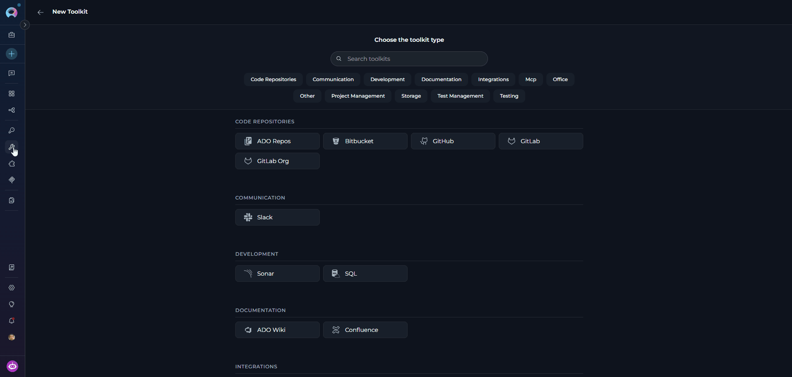

    <Steps>
      <Step title="Navigate to Toolkits">
        Open the sidebar and select **Toolkits**.
      </Step>

      <Step title="Create a New Toolkit">
        Click **`+ Create Toolkit`**. The toolkit type selector opens.
      </Step>

      <Step title="Select Wiki Query">
        Search for or scroll to **Wiki Query** in the type list and click it. The configuration form opens.
      </Step>

      <Step title="Configure the Toolkit">
        Fill in the toolkit settings:

        | Parameter | Required | Description |
        |-----------|----------|-------------|
        | **Name** | Yes | A descriptive name for this toolkit (e.g., *"Multi-Repo Wiki Search"*) |
        | **Description** | No | Optional description |
        | **LLM Model** | Yes | LLM model used for repository resolution and answering questions |
        | **Embedding Model** | Yes | Embedding model for vector search |
        | **Tools** | Yes | Enable the tools the agent should use: `list_wikis`, `resolve_and_ask`, `resolve_and_deep_research`, `delete_wiki` |
      </Step>

      <Step title="Save the Toolkit">
        Click **Save**. The Wiki Query toolkit is now available to add to agents, chats, and pipelines.
      </Step>
    </Steps>
  </Tab>
</Tabs>

---

**Available Tools**

<Tabs>
  <Tab title="Wikis Query (Single Wiki)">
    | Tool | Description |
    |------|-------------|
    | **`ask`** | Ask a targeted question about the repository using the generated wiki knowledge base. Returns a concise answer with code references. The Wikis application must have a wiki already generated. |
    | **`deep_research`** | Perform multi-step deep analysis on a repository topic — uses planning, delegation, and comprehensive investigation. Slower than `ask` but returns thorough answers with evidence. The Wikis application must have a wiki already generated. |
  </Tab>

  <Tab title="Wiki Query (Multi-Wiki)">
    | Tool | Description |
    |------|-------------|
    | **`list_wikis`** | Lists all available wikis in the registry with their IDs, repository names, and descriptions. Use this to discover which repositories have been indexed before asking questions. |
    | **`resolve_and_ask`** | Intelligently determines which repository to query based on the question and answers it. Uses LLM to match questions to available wikis. Pass `wiki_id_hint` (format: `owner--repo--branch`) to skip resolution if you already know the target. |
    | **`resolve_and_deep_research`** | Resolves which repository to query and performs deep multi-step research. Use for complex questions about architecture, security, or cross-cutting concerns. Supports `research_type`: `general`, `architecture`, `security`, `performance`. |
    | **`delete_wiki`** | Deletes a wiki and all its associated artifacts from the registry and storage. Requires `wiki_id` (format: `owner--repo--branch`). This action cannot be undone. |
  </Tab>
</Tabs>
---

### Step 2: Add the Toolkit to an Agent, Chat, or Pipeline

<Steps>
  <Step title="Navigate to the Target Menu">
    Open the sidebar and select **[Agents](../../menus/agents)**, **Chats**, or **Pipelines** — depending on where you want to use the query toolkit.
  </Step>

  <Step title="Create or Open an Item">
    Click **`+ Create`** to create a new agent, chat, or pipeline, or click an existing item's name to open its configuration.
  </Step>

  <Step title="Add the Query Toolkit">
    1. Scroll to the **Toolkits** section of the configuration.
    2. Click the **`+ Toolkit`** button.
    3. In the dropdown, select the Wikis Query or Wiki Query toolkit you just created.
    4. The toolkit is added with all its tools enabled.

    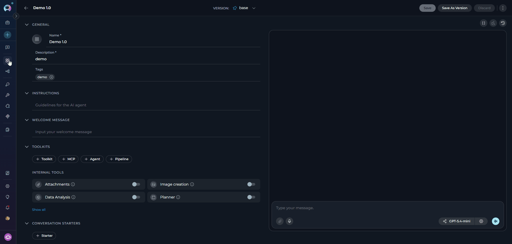
  </Step>

  <Step title="Write Instructions (Agents only)">
    In the **Instructions** field, tell the agent when and how to use the wiki query tools.
  </Step>

  <Step title="Save">
    Click **Save**. The agent, chat, or pipeline can now query the wiki knowledge base.
  </Step>
</Steps>

---

## <Icon icon="circle-check" size={26} /> Best Practices

<Accordion title="Wiki Generation">
1. **Clear Query Descriptions:** Provide specific, detailed queries for `generate_wiki` — the query shapes the structure and focus of the generated documentation
2. **Use Graph Clustering for Large Repos:** Prefer the **Graph clustering** planner for large or complex repositories; it scales predictably and produces more consistent outlines than the Agentic planner
3. **Enable Smart Skip Tests:** Enable **"Smart skip tests"** (Graph clustering only) when your repository has a large test suite — it keeps the wiki outline focused on production code
4. **Monitor Slots:** Check the slot availability indicator before starting generation to avoid queuing delays
</Accordion>

<Accordion title="Question Asking">
1. **Specific Questions:** Ask focused questions rather than broad "explain everything" queries
2. **Pin to a Wiki Version:** Use `analysis_key_override` (format: `owner/repo@version_id`) when querying from an agent to pin results to a specific generation and avoid inconsistency if the wiki is regenerated
3. **Progressive Refinement:** Start with `ask` for quick answers — it runs without slot limits and responds in seconds; switch to `deep_research` for complex multi-file analysis
4. **Reference Generated Wiki:** Browse generated wiki pages before asking questions to understand what context is available
</Accordion>

<Accordion title="Resource Management">
1. **Cleanup Old Wikis:** Regularly remove outdated wiki artifacts using the **Delete Wiki** button in Settings or the `delete_wiki` tool — all artifacts are stored in the shared `wiki-artifacts` bucket
2. **Slot Monitoring:** Be aware of `DEEPWIKI_MAX_PARALLEL_WORKERS` limits in your environment; only `generate_wiki` consumes slots — `ask` and `deep_research` run without slot restrictions
3. **Share One App Across Agents:** When multiple agents need to query the same repository, point them all to the same Wikis application instead of creating separate apps — the generated index is reused automatically
4. **Use `repo_identifier_override` for Cross-Repo Queries:** When using the `wikis_query` toolkit, pass `repo_identifier_override` to direct a query at a specific repository's wiki index rather than the default configured repo
</Accordion>

---

## <Icon icon="triangle-exclamation" size={26} /> Troubleshooting

<Accordion title="Wiki Generation Fails">
**Possible causes:**

* Code toolkit authentication invalid or expired
* Repository or branch not found
* Repository has no indexable source files (`empty_repository` error)
* LLM API errors or insufficient token limit
* Artifact upload failure after generation completes

**Solutions:**

* Check the error message returned — it includes a category (`authentication_error`, `repository_not_found`, `branch_not_found`, `indexing_failed`, `empty_repository`) to indicate the specific cause
* Verify the code toolkit is properly configured and authenticated in the Toolkits menu
* Confirm the repository exists and the configured branch is correct
* If the error is `empty_repository`, the repository contains no files the indexer can process — check that the repo has source code and the code toolkit has read access
* Increase `max_tokens` in Settings if generation fails mid-way on large repositories
* Check the `wiki-artifacts` bucket exists in the Artifacts menu and the service has write permissions
</Accordion>

<Accordion title="Service Busy — Slots Full">
**Possible causes:**

* Maximum parallel subprocess workers reached (`DEEPWIKI_MAX_PARALLEL_WORKERS`, default: 1)
* Maximum parallel K8s Jobs reached (`DEEPWIKI_MAX_CONCURRENT_JOBS`, default: 3) in Jobs mode
* Other wiki generations in progress

**Solutions:**

* Wait for current generations to complete — the slot indicator turns green when a slot is free
* Check current slot status using the slot chip next to the **Generate Wiki** button
* Contact your administrator to increase `DEEPWIKI_MAX_PARALLEL_WORKERS` (subprocess mode) or `DEEPWIKI_MAX_CONCURRENT_JOBS` (K8s Jobs mode)
</Accordion>

<Accordion title="Ask / Deep Research Returns Empty or Incorrect Answers">
**Possible causes:**

* Wiki has not been generated yet for the repository
* Embedding model changed after wiki generation — causes dimension mismatch on query
* Question outside the scope of the indexed content

**Solutions:**

* Ensure `generate_wiki` completed successfully and wiki pages are visible in the sidebar
* If you see an error like **"Dimension mismatch for query vector. Expected 1536 dimensions but received 1024"**, the embedding model was changed after the wiki was generated — delete the wiki, update the Wikis application to use the original embedding model (or regenerate with the new model), then run `generate_wiki` again
* The **LLM Model** and **Embedding Model** fields are read-only in Settings — to change the embedding model, delete and recreate the Wikis application
* Rephrase the question to match terminology used in the codebase
* Browse generated wiki pages to understand what content was indexed
</Accordion>

<Accordion title="Rate Limit / LLM API Quota Exceeded">
**Possible causes:**

* LLM provider rate limit hit during wiki generation or querying (`rate_limit` error)
* API quota exhausted for the configured model
* Too many concurrent requests to the LLM endpoint

**Solutions:**

* Wait and retry — most rate limits reset within minutes to hours
* Check LLM provider quota usage and upgrade the plan if needed
* Reduce `max_tokens` in Settings to lower per-request token consumption
* Contact your ELITEA administrator if the LLM integration is shared across projects
</Accordion>

<Accordion title="Slow Wiki Generation">
**Possible causes:**

* Large repository with many files being cloned and indexed
* Network latency during repository cloning
* LLM response times for generating wiki page content

**Solutions:**

* Generation time scales with repository size — small repos take 2–5 min, large repos (1000+ files) can take 15–30+ min; monitor the progress bar and status messages
* Filesystem-based indexing (the default) is faster than API-based — verify `indexing_method` is not set to `github` unless required
* Enable **"Smart skip tests"** (Graph clustering mode) to reduce the number of files indexed
* Use the **Graph clustering** planner instead of **Agentic** — it is more predictable and faster on large repos
</Accordion>

<Accordion title="Code Toolkit Configuration Error">
**Possible causes:**

* Code toolkit not properly configured or authenticated
* Missing or expired repository access credentials
* Invalid toolkit ID reference in the Wikis application
* Toolkit deleted or no longer accessible

**Solutions:**

* Verify the code toolkit exists and is properly configured in the Toolkits menu
* Check that access tokens or SSH keys are valid and have at least read access to the repository
* Ensure the toolkit has permissions to clone the target repository
* Re-select the code toolkit in the Wikis application Settings panel
* Test the code toolkit independently before using it with Wikis
</Accordion>

<Accordion title="LLM or Embedding Model Configuration Issues">
**Possible causes:**

* LLM model not accessible or API key expired
* Embedding model changed after wiki generation — vector dimensions no longer match (`Dimension mismatch` error)
* Insufficient token limit for large wiki pages

**Solutions:**

* Verify the LLM model is properly configured and the API key is valid
* Check that API key quotas have not been exceeded
* If you changed the embedding model after generating a wiki, delete the wiki and regenerate — the stored vectors and query vectors must use the same model
* To permanently change the embedding model, delete and recreate the Wikis application with the new model, then regenerate the wiki
* Increase `max_tokens` in Settings for large repositories with complex code
</Accordion>

<Accordion title="Out of Memory / Worker Killed">
**Possible causes:**

* Repository too large for the available worker memory
* Too many concurrent wiki generations consuming memory
* Insufficient memory allocated to the DeepWiki worker pod (K8s mode)

**Solutions:**

* Wait for other active generations to complete before starting a new one
* Contact your administrator to increase worker pod memory limits (K8s deployment)
* Use the **Graph clustering** planner — it uses less memory than **Agentic**
* Enable **"Smart skip tests"** to reduce the number of files processed
</Accordion>

<Accordion title="Repository Access or Clone Failures">
**Possible causes:**

* Network connectivity issues between the worker and the repository host
* Repository authentication failures (`authentication_error`)
* Repository deleted, moved, or renamed
* Branch does not exist (`branch_not_found`)
* Firewall or proxy blocking outbound Git operations

**Solutions:**

* Verify the repository URL and branch name configured in the code toolkit are correct
* Confirm the repository is accessible and has not been moved or deleted
* Ensure the access token has at minimum read/clone permissions
* Check for firewall or proxy rules that may block Git operations from the ELITEA worker
* Test the code toolkit independently using a simple repository operation
</Accordion>

<Accordion title="Artifact Storage Issues">
**Possible causes:**

* `wiki-artifacts` bucket does not exist or was deleted
* Insufficient write permissions for the service to upload to the bucket
* Storage quota exceeded
* Network issues between the worker and the artifact storage service

**Solutions:**

* Verify the `wiki-artifacts` bucket exists in the Artifacts menu
* Ensure the ELITEA service account has write permissions to the `wiki-artifacts` bucket
* Confirm storage quota has not been exceeded
* Contact your administrator to verify artifact storage configuration and service account permissions
</Accordion>

---

## <Icon icon="circle-question" size={26} /> FAQ

<Accordion title="How long does wiki generation take?">
Generation time depends on repository size and complexity:

* Small repositories (< 100 files): 2–5 minutes
* Medium repositories (100–1,000 files): 5–15 minutes
* Large repositories (> 1,000 files): 15–30+ minutes

Monitor the progress bar and status messages in the sidebar during generation. Generation always runs to completion in the background — if you navigate away, return to the application to check the result.
</Accordion>

<Accordion title="Can I generate wikis for private repositories?">
Yes. As long as your configured code toolkit (GitHub, GitLab, Bitbucket, or ADO Repos) has valid authentication credentials and the necessary permissions to clone the repository, private repositories are supported.
</Accordion>

<Accordion title="How do I update the wiki when the repository changes?">
Run `generate_wiki` again. Each generation performs a full re-analysis of the repository and creates a new versioned manifest — there is no partial or incremental update. Manual edits made to wiki pages in previous generations will be overwritten by the new generation.

Previous versions remain accessible via the version selector in the wiki interface.
</Accordion>

<Accordion title="What happens if I run out of worker slots?">
Generation returns a `[SERVICE_BUSY]` error indicating all slots are occupied. You can:

* Wait for a running generation to complete — the slot chip next to the **Generate Wiki** button turns green when a slot is free
* Contact your administrator to increase `DEEPWIKI_MAX_PARALLEL_WORKERS` (subprocess mode) or `DEEPWIKI_MAX_CONCURRENT_JOBS` (K8s Jobs mode)

Note: `ask` and `deep_research` are not affected by slot limits and continue to work while generation slots are full.
</Accordion>

<Accordion title="Can multiple agents use the same Wikis application?">
Yes. Multiple agents can use the same Wikis application for `ask` and `deep_research` operations simultaneously — these tools have no slot limits. Only `generate_wiki` is subject to slot limits, and concurrent calls from multiple agents may result in a `[SERVICE_BUSY]` response for all but the first.
</Accordion>

<Accordion title="What LLM models work best with Wikis?">
Wikis works with any LLM model configured in ELITEA. For best results:

* Use models with large context windows — the default `max_tokens` is 64,000, so models that support 64k+ tokens produce better wiki pages
* GPT-4 or Claude Sonnet are recommended for complex, multi-file documentation
* Adjust `max_tokens` in Settings if generation fails or produces truncated content on large repositories
</Accordion>

<Accordion title="Will changing the embedding model break existing wikis?">
Yes. The embedding model must remain consistent between wiki generation and querying. If you change the embedding model after generating a wiki, queries will fail with a dimension mismatch error. To switch models: delete the existing wiki, delete and recreate the Wikis application with the new embedding model, then regenerate the wiki.
</Accordion>

---

<Info title="Additional Resources">
For more information about Wikis and related features:

* **[Artifacts Menu](../../menus/artifacts)** - Managing generated wiki artifacts
* **[Agents Menu](../../menus/agents)** - Using Wikis tools in agents
* **[GitHub Toolkit](../toolkits/github_toolkit)** - Setting up GitHub code access
* **[GitLab Toolkit](../toolkits/gitlab_toolkit)** - Setting up GitLab code access
* **[Indexing Overview](../../how-tos/indexing/indexing-overview)** - Understanding indexing in ELITEA
</Info>
