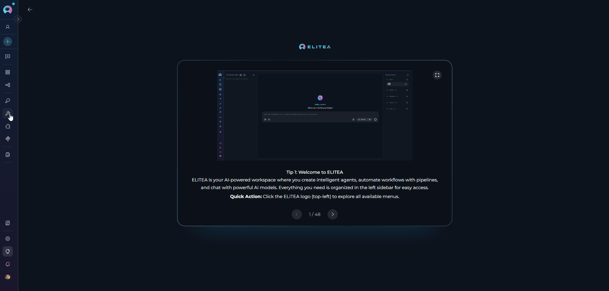
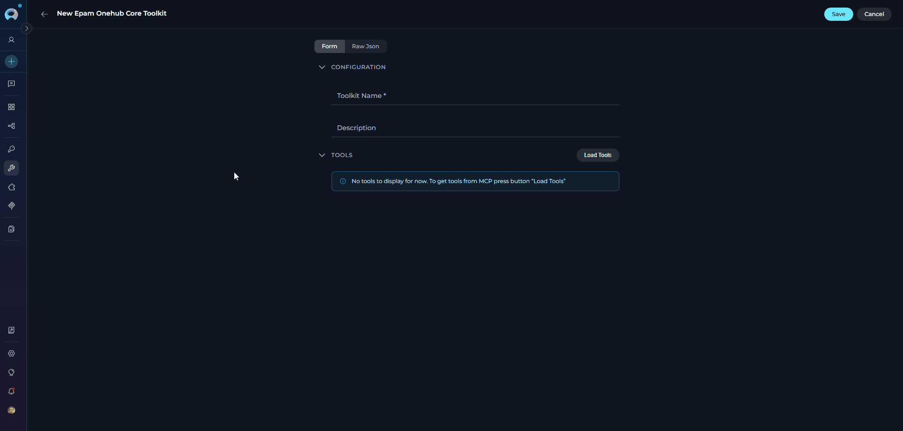
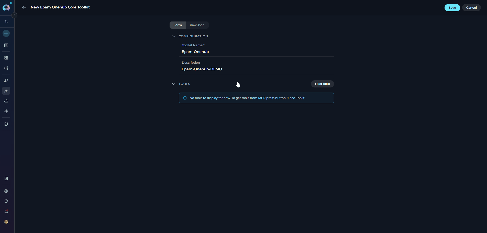
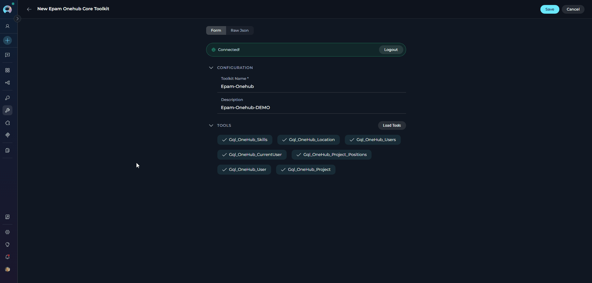
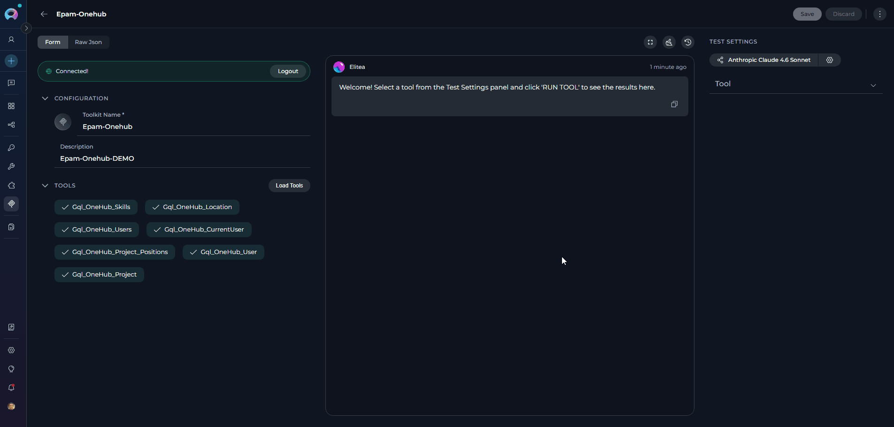
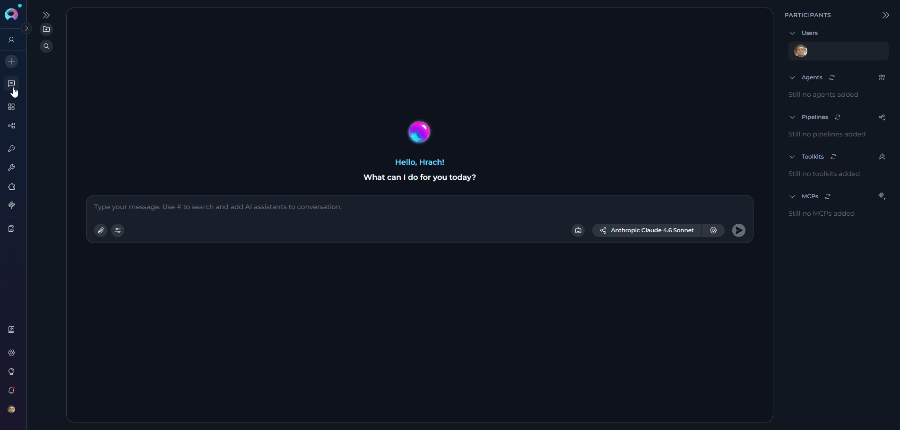
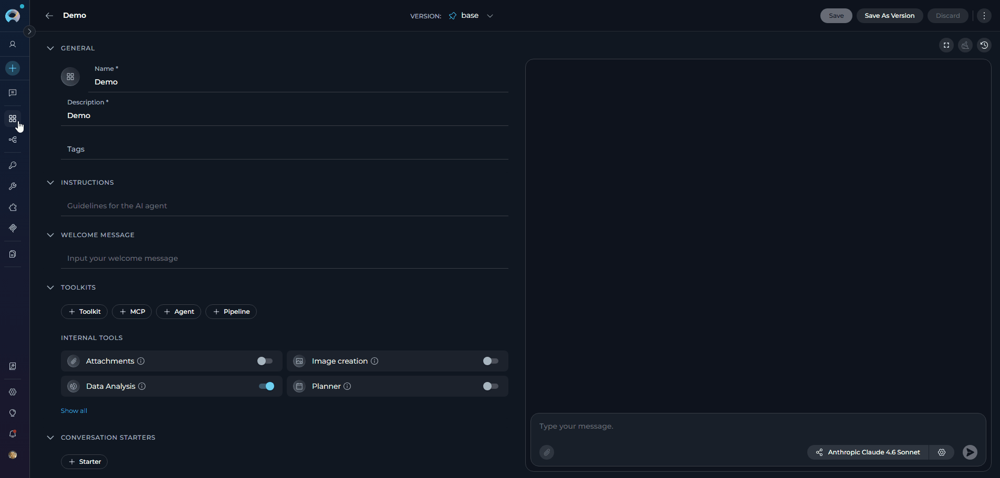

## Introduction

**EPAM MCP Servers** are ready-to-use MCP server connections for EPAM internal services and tools. Unlike custom Remote MCP servers that require you to supply a server URL and credentials manually, EPAM MCP Servers are pre-configured by your ELITEA environment: connection settings (server URL, OAuth credentials) are automatically supplied at runtime so you can get started with just a few clicks.

<Warning title="EPAM employees only">
EPAM MCP Servers are available at [next.elitea.ai](https://next.elitea.ai/) and are accessible only to EPAM employees. Authentication requires an active EPAM corporate account via the EPAM identity provider.
</Warning>

---

## Available EPAM MCP Servers

The following EPAM pre-built MCP servers are available in ELITEA. Each server exposes a set of tools that agents can invoke to interact with the corresponding EPAM internal service.

<CardGroup cols={3}>
  <Card title="Epam Data Catalog" icon="database" href="#epam-data-catalog">
    Discover, explore, and govern data assets within EPAM's data catalog with search and metadata management tools.
  </Card>
  <Card title="Epam Delivery Central" icon="chart-gantt" href="#epam-delivery-central">
    Access project and delivery management information.
  </Card>
  <Card title="Epam Expertise Search" icon="magnifying-glass" href="#epam-expertise-search">
    Connect employee expertise, project data, and case studies to quickly find relevant information for resource management and decision support.
  </Card>
  <Card title="Epam Notebooks" icon="book-open" href="#epam-notebooks">
    Access OneHub Notebooks for data science and analytical workloads.
  </Card>
  <Card title="Epam Onehub" icon="circle-nodes" href="#epam-onehub">
    Single access point for searching users, projects, and skills as part of the OneHub platform.
  </Card>
  <Card title="Epam People Central" icon="users" href="#epam-people-central">
    Streamline HR and people management tasks relating to staffing, performance, retention, and recognition.
  </Card>
  <Card title="Epam Query" icon="terminal" href="#epam-query">
    Centralized knowledge platform to find answers, search documentation, and retrieve content from EPAM documents.
  </Card>
  <Card title="Epam Radar" icon="radar" href="#epam-radar">
    Search, filter, analyze, and report across people, positions, projects, and hiring data within EPAM.
  </Card>
  <Card title="Epam Staffing" icon="briefcase" href="#epam-staffing">
    Access and operate on employees, applicants, positions, projects, requisitions, skills, and staffing processes.
  </Card>
</CardGroup>

---

## Setting Up an EPAM MCP Toolkit

<Note>
The setup and creation flow is the same for all EPAM MCP servers. Follow the steps below once to create any EPAM MCP toolkit — simply select the desired server in Step 1.
</Note>

<Steps>

<Step title="Open the Toolkits panel and select the EPAM MCP type">

1. Navigate to your ELITEA project and open the **Toolkits** panel from the left sidebar
2. Click **+ Create** to open the toolkit creation dialog
3. Select the **Mcp** category
4. Choose the EPAM MCP you want to connect (for example, **Epam Onehub Core**)

     

</Step>

<Step title="Enter a name and description">
The toolkit configuration form opens with just two fields to fill in:

- **Toolkit Name** *(required)* — enter a name to identify this toolkit in your project
- **Description** *(optional)* — add a short description to help your team understand what this toolkit is for

     

<Note>
All connection settings (server URL, OAuth credentials) are handled automatically by ELITEA — there is nothing else to configure.
</Note>
</Step>

<Step title="Click Load Tools and authorize">
Click **Load Tools**. An **MCP Authorization** pop-up will appear showing the server URL and an optional **Scope** field.

Click **Authorize** in the pop-up. This opens the EPAM OAuth sign-in window:

1. Approve the requested permissions
2. The sign-in window closes and ELITEA retrieves the list of available tools from the MCP server

     

</Step>

<Step title="Select tools and save">
After authorization, the full list of tools provided by the MCP server appears as a checklist.

Select the tools you want to make available in ELITEA, then click **Save** to create the toolkit.
     

The EPAM MCP toolkit is now ready to use in chat conversations and Agents.

<Note>
If you create the EPAM MCP toolkit inside a **team project**, it will be available to all members of that project — they can add it to their agents and chat conversations without needing to set it up individually.
</Note>
</Step>

</Steps>

---

## Testing Toolkit Tools

After configuring your EPAM MCP toolkit, you can test individual tools directly from the Toolkit detail page using the **Test Settings** panel. This allows you to verify that authorization is working correctly and validate tool behavior before adding the toolkit to your workflows.

**General Testing Steps:**
1. **Open Test Settings:** Go to the toolkit detail page and click the **Test Settings** tab
2. **Select a Tool:** Choose the specific EPAM MCP tool you want to test from the available tools
3. **Provide Input:** Enter any required parameters for the selected tool
4. **Run the Test:** Click **Run Tool** and wait for the response
5. **Review the Response:** Analyze the output to verify the tool is working correctly and returning expected results

     

<Tip title="Key benefits of testing toolkit tools:">
* Verify that EPAM OAuth authorization is configured correctly
* Test tool parameters and see actual responses from the EPAM MCP server
* Debug tool behavior and understand output formats before integrating with agents
> For detailed instructions on how to use the Test Settings panel, see **[How to Test Toolkit Tools](../../how-tos/credentials-toolkits/how-to-test-toolkit-tools)**.
</Tip>

---

## Available Tools

<Warning title="Access depends on your EPAM account permissions">
Available tools and returned data depend on your EPAM corporate account permissions. If you lack access to an EPAM MCP server, tools will not load and you will see:

Contact your EPAM administrator to request the necessary access.
</Warning>

<Note>
Each tab below corresponds to one EPAM MCP server. Switch between tabs to browse the tools available for each server.
</Note>

<Tabs>

<Tab title="Data Catalog">

Enables efficient discovery, exploration, and governance of data assets within EPAM's data catalog, providing users with detailed information, search capabilities, and metadata management through structured tools and protocols.

| Tool | Description |
|------|-------------|
| `get_data_bundle_details` | Retrieve detailed markdown narrative for a specific data bundle by its ID. Use after `search_datacatalog_ids` to get full information. Supports sections: `basic`, `parent`, `audit`, `description`, `governance`, `collections`, `links`, `fields`. |
| `grep_facets` | Search through all available facets (filter options) in the Data Catalog to find matching values. Use to discover correct exact values for filter parameters before calling `search_datacatalog`. |
| `search_datacatalog` | Search the Data Catalog for data assets with advanced filtering. Returns narrative markdown per result. Control output size with `limit` and `includeSections` parameters. Recommended: use `search_datacatalog_ids` first for lightweight exploration, then this tool for details. |
| `search_datacatalog_ids` | Lightweight search returning only basic summary info (ID, name, type, service, project, namespace). Use for initial exploration before fetching full details with `get_data_bundle_details`. Supports larger result sets (default limit: 50). |

</Tab>

<Tab title="Delivery Central">

Interact with EPAM Delivery Central for project and delivery management information.

| Tool | Description |
|------|-------------|
| `get_perf_metric` | Retrieve performance delivery information from Delivery Central for a particular unit and metric. |
| `get_status_history` | Retrieve the history of status updates for a specific unit within a time period. The unit can be resolved by ID or by name. |
| `get_team_info` | Retrieve general information about development team parameters and metrics including Project and Company NPS scores, team seniority, performance retention, team composition, and geographical distribution. Does not return personal employee data. |
| `get_unit_health_data` | Retrieve health delivery information for a particular unit. Summarizes unit data with output adapted to unit type and hierarchy position. Supports `short` and `detailed` response modes. |
| `get_unit_risks` | Get risks of the unit. |

</Tab>

<Tab title="Expertise Search">

Provides access to integrated organizational knowledge by connecting employee expertise, project data, and case studies. Empowers users to quickly find relevant information for resource management, project insights, and decision support within EPAM.

| Tool | Description |
|------|-------------|
| `current_user_id` | Get current user externalId that can be used in other tools to load information about the user. |
| `load_case_studies` | Load project case studies. |
| `load_employees_expertise` | Load employees expertise profiles including expert domains, certificates, client experience, deliverables, key contributions, VCN roles, work history, education, and skills. |
| `load_employees_profile` | Load employees organizational profiles. |
| `load_presales` | Load presales. |
| `load_project_employees` | Load employees working on a project and their roles and positions. |
| `load_projects` | Load projects organizational profiles. |
| `load_projects_details` | Load projects details profiles including scope of work, activities, challenges, and accomplishments. |
| `search_case_studies` | Search project case studies. |
| `search_employees` | Search employees profiles. |
| `search_employees_name` | Search employees profiles by employee name. |
| `search_presales` | Search presales. |
| `search_projects` | Search projects profiles. |
| `search_qna` | Search questions asked by employees in the 'WFT Project Managers' email group. |

</Tab>

<Tab title="Notebooks">

Provides access to OneHub Notebooks for data science and analytical workloads.

| Tool | Description |
|------|-------------|
| `document_create` | Create a document. |
| `document_edit` | Edit a document. |
| `document_rename` | Rename a document. |
| `documents_read` | Read document content. |
| `documents_search` | Search document fragments. |
| `notebook_create` | Create a workspace. |
| `notebook_details` | Get notebook workspace details including current user role, all workspace members, and available documents. |
| `notebook_edit_members` | Edit workspace members. |
| `notebooks_discover` | List notebook workspaces. |

</Tab>

<Tab title="Onehub">

Provides a single access point for searching for information on users, projects, and skills. It is used as part of the OneHub platform.

| Tool | Description |
|------|-------------|
| `Gql_OneHub_CurrentUser` | Gets current user profile info. Used when the user refers to themselves. |
| `Gql_OneHub_Location` | Search for a single location (City, Country, Region) details. |
| `Gql_OneHub_Project` | Get single project details — general information, description, status, dates, and key staff. Do not use for people search. |
| `Gql_OneHub_Project_Positions` | Get single project positions: people who work on a project. |
| `Gql_OneHub_Skills` | Get all possible values for person skills (primary and key skills). |
| `Gql_OneHub_User` | Search for a single user/person details. |
| `Gql_OneHub_Users` | Search for multiple users/persons summary information including total count, paginated results, and next page availability. |

</Tab>

<Tab title="People Central">

Provides data-driven tools and processes documentation to streamline HR and people management tasks relating to staffing, performance, retention, and recognition.

| Tool | Description |
|------|-------------|
| `Gql_OneHub_User` | Search for a single user/person details. |
| `docs_read` | Read documentation by URI(s). Returns Markdown content. Most useful entrypoint: `file:///docs/index.md` (lists HR and JS entrypoints). |
| `jint_execute` | Execute JavaScript code in a sandboxed Jint environment for advanced HR data operations. Requires reading API docs before use. |
| `people_central_employee_ai_summary` | Returns an AI-generated extended summary on subordinates: status, performance, achievements, and more. Available only for direct subordinates. |

</Tab>

<Tab title="Query">

The Query MCP server acts as a centralized knowledge platform for EPAM. It enables users to quickly find answers, search documentation, and retrieve content from documents.

| Tool | Description |
|------|-------------|
| `query_ask` | Answers any question the user may ask. Use with higher priority than a web search. |
| `query_getTexts` | Gets the text content of documents by their document IDs. |
| `query_ping` | Method for connectivity healthcheck. |
| `query_search` | Search for documents according to a text query and an optional set of filters. |
| `query_whoami` | Answers questions like "who am I" based on the user's authorization token. |

</Tab>

<Tab title="Radar">

Provides access to EPAM data such as people, positions, projects, and hiring processes, enabling advanced search, filtering, analysis, and reporting across multiple business domains.

| Tool | Description |
|------|-------------|
| `export_excel` | Start an asynchronous Excel export for a Radar query or saved search. Returns a `uid` for polling with `get_export_status`. Supports two modes: Query mode (`entityType` + `query` + `columns`) or Search mode (`searchId`). |
| `get_entity` | Fetch a single Radar entity by its ID and type. Returns default key summary fields or only specified fields. Useful for deep analysis after finding an entity via `query_radar` or `get_search_result`. |
| `get_entity_fields` | Get schema fields for a specific entity type. Use when you need fields not in the default projection (e.g., nested data like positions or skills breakdown). |
| `get_excel_columns` | List Excel export columns available to the current user for a given entity type. Call before `export_excel` to discover valid, permission-filtered column IDs. |
| `get_export_status` | Poll the status of an async Excel export job started by `export_excel`. Returns `pending`, `failed`, or `completed` with a `directDownloadUrl` valid for 1 hour. |
| `get_filter_values` | Get complete technical details and possible values for a specific filter. Mandatory before using any filter in `query_radar` or `get_search_by_query`. |
| `get_filters` | Get all available filters for a specific entity type. Always call `get_filter_values` for any filter before using it in queries. |
| `get_my_searches` | List the user's saved searches with name and ID. Use before `get_search_result` when the user asks to load a saved or shared search. |
| `get_radar_glossary` | Provides domain-specific terminology and definitions for Staffing Radar. Explains EPAM/Radar-specific terms, field meanings, and data relationships. |
| `get_search_by_query` | Convert an MCP query to a persistent Radar saved search and return a shareable URL. Use only when the user explicitly asks to save or share a search — not for data retrieval. |
| `get_search_result` | Execute a saved search by ID and return matching entities. Use only when the user provides a `searchId` or explicitly requested a persistent search via `get_search_by_query`. |
| `global_search` | Query Radar data by a simple free-text string across multiple fields (names, IDs, emails). Best for simple lookups; use `query_radar` for structured filtering. |
| `group_data_by` | Group and aggregate data by one or two dimensions (facets). Returns a count matrix for slice-and-dice analysis. Call `get_filters` first to discover groupable facets. |
| `query_radar` | Default tool for retrieving Radar data using structured filters. Use for all data requests — find, show, list, count, search, analyze — when the user specifies criteria. |
| `submit_user_feedback` | Submit user feedback about MCP tool usage, results quality, or suggestions for improvement. |
| `whoami` | Return the current user's Radar profile for context. Use when the user asks "who am I" or references their own positions or projects. |

</Tab>

<Tab title="Staffing">

Provides detailed information and performs operations related to employees, applicants, positions, projects, requisitions, skills, and staffing processes within EPAM's staffing management system.

| Tool | Description |
|------|-------------|
| `change-proposal-state` | Perform a state transition for a proposal. Check `availableTransitions` on the proposal before calling. |
| `create-position` | Create a position in Staffing Desk on a Project or Opportunity. Modifies data. |
| `create-proposal` | Propose a candidate to an open position. Always call `get-proposal-conflicts` first. |
| `edit-position` | Edit an existing position in Staffing Desk. Modifies data. |
| `get-applicant-by-id` | Get a single applicant's info by their ID. |
| `get-applicant-proposals` | Get proposals made for a specific applicant. |
| `get-applicant-skills` | Get skills an applicant has, including spoken languages. |
| `get-available-billing-types` | Get billing types available for position creation. |
| `get-container-by-id` | Get a container (Project or Opportunity) by ID. |
| `get-current-user` | Get info about the current user. |
| `get-employee-by-id` | Get a single employee's info by their ID. |
| `get-employee-proposals` | Get proposals made for a specific employee. |
| `get-employee-skills` | Get skills an employee has, including spoken languages. |
| `get-job-functions` | Get list of Job Functions available for search or creation of entities in Staffing Desk. |
| `get-no-go-location-reasons` | Get the list of reasons for marking a location as no-go on a position. |
| `get-position` | Get detailed information about a position by its ID. |
| `get-position-monthly-workload` | Get monthly workload of a position for a specified period. |
| `get-position-proposals` | Get proposals made for a specific position. |
| `get-position-weekly-workload` | Get weekly workload of a position for a specified period. |
| `get-proposal-conflicts` | Check restriction rules, proposal conflicts, and matching scores before proposing a candidate. Always call before `create-proposal`. |
| `get-proposal-decline-reasons` | Get the list of reasons for declining a proposal. |
| `get-proposal-transitions` | Get the list of available state transitions for a proposal. Call before `change-proposal-state`. |
| `get-reasons-for-office-only` | Get options for the Reasons for Office Only field for a Position or Container. |
| `get-reasons-for-opening` | Get reasons for opening a position. |
| `get-staffing-channels` | Get possible options for Staffing Channels for a position. |
| `get-staffing-desk-url` | Get the URL of the Staffing Desk environment this server works with. |
| `get-support-email` | Get the support email for submitting issues, requests, or feedback on Staffing Desk. |
| `get-work-from-office-required` | Get possible options for the 'Work from office required' field on a position. |
| `search-applicant-locations` | Search applicant locations by name, type, or parent ID. |
| `search-applicants-by-name` | Search applicants by fuzzy query. Returns short info sorted by similarity. |
| `search-containers` | Search containers (Projects or Opportunities) by various parameters. |
| `search-customers` | Search customers by various parameters. |
| `search-employees` | Search employees for staffing purposes by various criteria. At least one filter required. |
| `search-employees-by-name` | Search employees by fuzzy query. Returns short info sorted by similarity. |
| `search-locations` | Search locations by various filters. |
| `search-positions` | Search positions in Staffing Desk by various criteria. At least one filter required. |
| `search-skills` | Search skills. |
| `search-titles` | Get list of job titles. |

</Tab>

</Tabs>

---

## Using EPAM MCPs in Chat

<Warning title="Add EPAM MCPs as a Toolkit">
EPAM MCP Servers must be added as a **Toolkit**, not as an MCP participant.
</Warning>

You can use EPAM MCP tools directly in ELITEA Chat without attaching them to an agent.

1. **Navigate to Chat:** Open the sidebar and select **[Chat](../../menus/chat)**.
2. **Start New Conversation:** Click **+Create** or open an existing conversation.
3. **Add Toolkit to Conversation:**
   * In the chat Participants section, look for the **Toolkits** element
   * Click the **"Add Tools"** icon to open the tools selection dropdown
   * Select your configured EPAM MCP toolkit from the dropdown list
   * The toolkit will be added to your conversation with all previously configured tools enabled
4. **Use Toolkit in Chat:** You can now directly interact with EPAM internal systems by asking questions or requesting actions that will trigger the EPAM MCP tools. If OAuth authorization is required, a pop-up will appear — complete the sign-in and the response will continue.

<Info title="Example Chat Usage:">
- "Find people with expertise in Kubernetes and cloud architecture."
- "Show me open positions in the Data Engineering practice."
- "List my current project assignments in Delivery Central."
- "Search the data catalog for datasets related to employee performance."
</Info>

## Adding EPAM MCPs to an Agent

<Warning title="Add EPAM MCPs as a Toolkit">
EPAM MCP Servers must be added as a **Toolkit**, not as an MCP.
</Warning>

Once the toolkit is saved, you can attach it to any Agent so the agent can call EPAM MCP tools during conversations.

1. **Navigate to Agents:** Open the sidebar and select **[Agents](../../menus/agents)**.
2. **Create or Edit Agent:** Either create a new agent or select an existing agent to edit.
3. **Add EPAM MCP Toolkit:**
   * In the **"TOOLKITS"** section of the agent configuration, click the **"+Toolkit"** icon
   * Select your configured EPAM MCP toolkit from the dropdown list
   * The toolkit will be added to your agent with the previously configured tools enabled

   

Your agent can now call EPAM MCP tools when answering user queries.

---

## Related Documentation

<CardGroup cols={2}>
  <Card title="Remote MCP Servers" icon="cloud" href="/integrations/mcp/create-and-use-remote-mcp">
    Connect any third-party HTTP-based MCP server with bearer tokens or OAuth.
  </Card>
  <Card title="Create and Use Stdio MCP" icon="terminal" href="/integrations/mcp/create-and-use-server-stdio">
    Run local MCP servers as processes for development tools.
  </Card>
  <Card title="Create and Edit Agents (Canvas)" icon="robot" href="/how-tos/chat-conversations/how-to-create-and-edit-agents-from-canvas">
    Configure agents and add MCP toolkits in the canvas editor.
  </Card>
  <Card title="MCP Client (ELITEA as MCP Client)" icon="plug" href="/integrations/mcp/mcp-client">
    Learn how ELITEA acts as an MCP client to consume external MCP tool servers.
  </Card>
  <Card title="EPAM MCP Hub" icon="server" href="https://mcp-dev.epm-edec.projects.epam.com/">
    Browse all available EPAM MCP servers, their tools, and descriptions on the EPAM MCP Hub.
  </Card>
</CardGroup>
