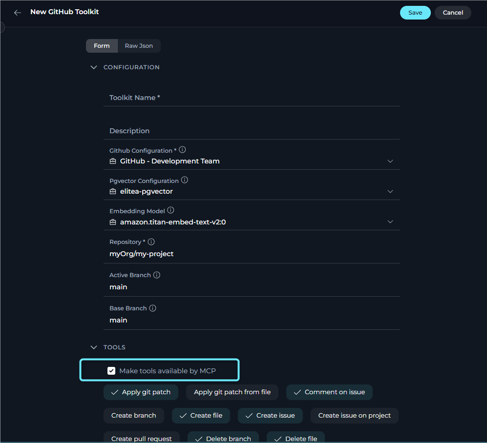
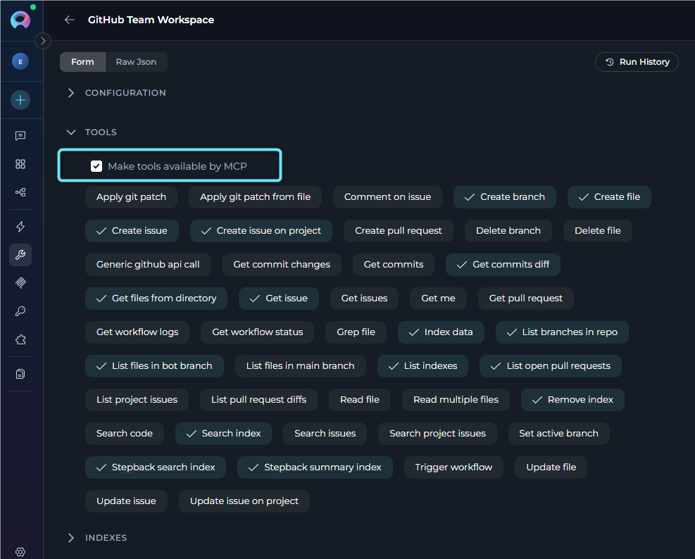
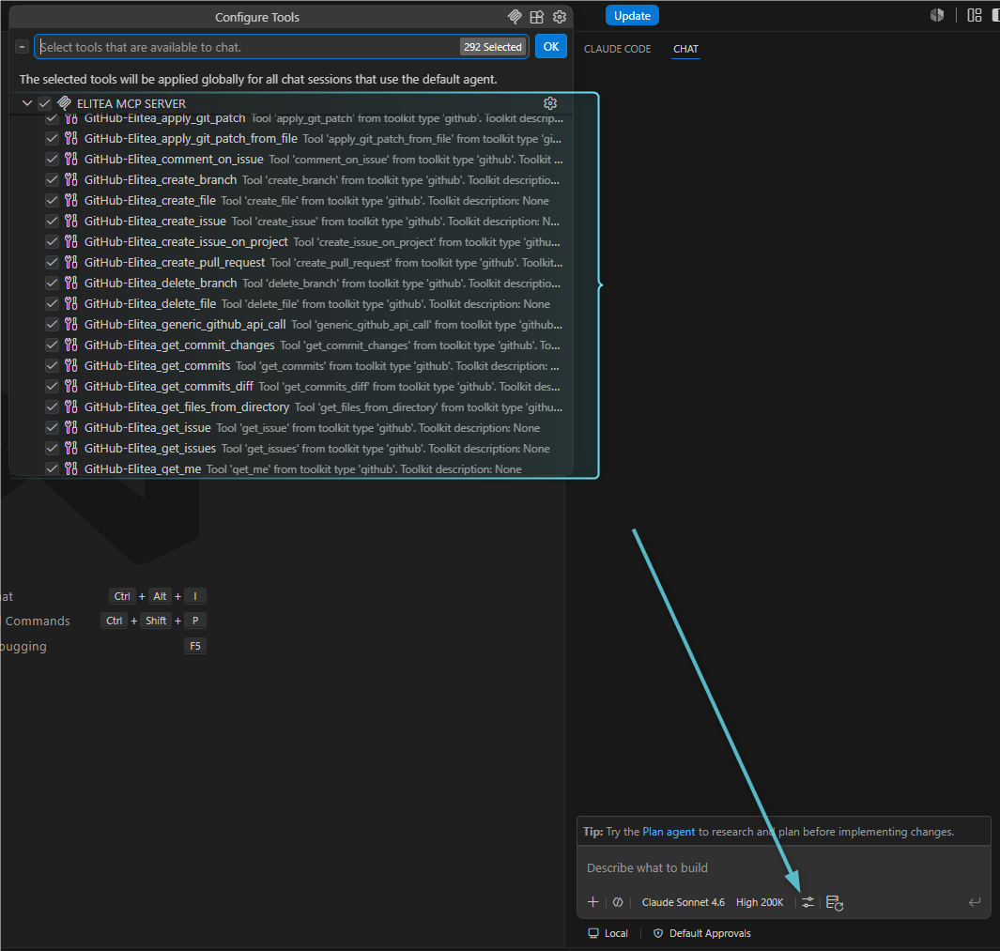

## Overview

This feature is particularly useful when you want to:

* Share toolkit tools with external development environments
* Enable team members to access specific tools through VS Code
* Build MCP-based integrations that leverage Elitea's native toolkit capabilities
* Extend your Elitea toolkits to external MCP-compatible applications

<Info title="MCP Overview">
The Model Context Protocol (MCP) is an open standard for communication between AI-powered tools, agents, and client applications. Elitea implements both MCP Server (making agents and tools available) and MCP Client (consuming external MCP servers) capabilities.
</Info>

---

## How It Works

When you enable **Make tools available by MCP** for a toolkit:

1. The toolkit configuration is saved with MCP availability metadata (`meta.mcp_options.available_by_mcp: true`)
2. Tools from this toolkit become discoverable through Elitea's MCP Server endpoint
3. External MCP clients can connect to your project and access these tools
4. The tools appear alongside agents and pipelines tagged with `mcp` in the client application

---

## Prerequisites

Before enabling this feature, ensure you have:

* **Toolkit Configuration Access** – Permissions to create or edit toolkits in your project
* **Project Access** – Working within a project that supports MCP Server integration
* **Understanding of Tool Scope** – Knowledge of which tools should be made available externally
* **MCP Client Setup** (for verification) – VS Code with GitHub Copilot or another compatible MCP client

<Warning title="Security Consideration">
Only enable this feature for tools that are safe to make available externally. Ensure that sensitive operations or credentials are properly managed and that tool availability aligns with your organization's security policies.
</Warning>

---

## Enabling the Feature

### For New Toolkits

When creating a new toolkit:

1. Go to **Menus → Toolkits** and click **+ Toolkit**
2. Select the toolkit type (e.g., Jira, Confluence, GitHub)
3. Configure the toolkit settings:
    * **Name**: Enter a descriptive name for the toolkit
    * **Connection Details**: Provide required credentials and configuration
4. In the **TOOLS** section, select the tools you want to make available and check **"Make tools available by MCP"**
5. Click **Save**

     

### For Existing Toolkits
To enable MCP availability for an existing toolkit:

1. Navigate to **Menus → Toolkits**
2. Select the toolkit you want to modify
3. Scroll to the **TOOLS** section
4. Locate the **"Make tools available by MCP"** checkbox
5. Check the box to enable MCP availability (or uncheck to disable)
6. Click **Save** to apply changes

 

<Tip>
**Selective Tool Availability**

You can control which tools from a toolkit are available by adjusting the **selected_tools** list. Only checked tools will be available through MCP, even if MCP availability is enabled.
</Tip>

---

### Testing with an MCP Client

To verify tools are accessible through MCP:

2. **Set Up MCP Server Connection**:
    * Configure an MCP client (e.g., VS Code) to connect to your Elitea project
    * Use your project's MCP Server endpoint: `[ELITEA_SERVER_URL]/app/[PROJECT_ID]/mcp` (e.g., https://next.elitea.ai/app/123/mcp)
    * Provide your authentication token
<Info>
For the detailed setup instruction, see the [MCP Server Integration Guide](./mcp-server-sse).
</Info>
2. **Verify Tool Discovery**:
    * Open GitHub Copilot Chat in Agent mode
    * Click the **Tools** icon
    * Check that your toolkit tools appear in the list
    * They should be listed together with agents and pipelines tagged with `mcp`

3. **Test Tool Invocation**:
    * Select one of the available tools
    * Enter the required parameters
    * Run the tool and confirm it works as expected

     

---

## Use Cases

### Scenario 1: Making Jira Tools Available to Development Teams

**Objective**: Allow developers to access Jira tools directly from VS Code.

**Steps**:

1. Create a Jira toolkit with connection details
2. Select tools: `create_issue`, `search_issues`, `update_issue`
3. Enable **Make tools available by MCP**
4. Team members connect their VS Code to the project's MCP Server
5. Developers can now create and update Jira issues without leaving their IDE

**Benefits**: Streamlined workflow, reduced context switching, improved productivity.

### Scenario 2: Sharing Confluence Documentation Tools

**Objective**: Enable technical writers to access Confluence through MCP clients.

**Steps**:

1. Configure a Confluence toolkit
2. Select tools: `create_page`, `update_page`, `search_content`
3. Enable **Make tools available by MCP**
4. Writers use VS Code to query and update documentation

**Benefits**: Centralized toolkit configuration, consistent access patterns.

### Scenario 3: Testing and QA Integration

**Objective**: Provide QA teams with access to TestRail or Report Portal tools.

**Steps**:

1. Set up a testing toolkit (TestRail, Report Portal, etc.)
2. Select relevant tools for test case management
3. Enable **Make tools available by MCP**
4. QA engineers access tools through their preferred MCP client

**Benefits**: Unified testing workflow, better collaboration with development.

---

## Availability and Limitations

**When Enabled**

<Card title="When Enabled" icon="toggle-on">
    Selected tools become discoverable through Elitea's MCP Server and can be used by authenticated MCP clients. Agents using this toolkit are not affected.
</Card>

**When Disabled**

<Card title="When Disabled" icon="toggle-off">
    Tools remain available only inside Elitea and do not appear in external MCP client tool lists, so external clients cannot discover or run them.
</Card>

**Limitations**

<Card title="Limitations" icon="triangle-exclamation">
    External access requires valid authentication, works only within the same project, and applies only to selected tools. Granular permissions for individual selected tools are not supported.
</Card>

<Card title="Agent vs. MCP Tagging" icon="tags">
    This feature is different from tagging agents or pipelines with `mcp`. Agent tagging makes the entire agent available as a tool, while this feature exposes individual toolkit tools.
</Card>

---

## Troubleshooting

<Accordion title="Tools Not Appearing in MCP Client">
If the tools are not visible in VS Code or another MCP client, make sure **"Make tools available by MCP"** is enabled and saved, restart the MCP server connection, verify the authentication token, confirm the project endpoint is correct, and check that the required tools are selected in the toolkit configuration.
</Accordion>

<Accordion title="Tool Invocation Fails">
If the tools appear but fail when executed, validate the toolkit credentials, test the toolkit inside Elitea first, confirm the required parameters are provided correctly, review Elitea logs for errors, and verify network connectivity to the external service.
</Accordion>

<Accordion title="Checkbox Not Visible">
If the **"Make tools available by MCP"** checkbox does not appear, make sure you are using a supported Elitea version, confirm that the toolkit type supports MCP availability, verify your edit permissions, and refresh the toolkit configuration page.
</Accordion>

<Accordion title="Accidental Availability">
If tools were made available by mistake, uncheck **"Make tools available by MCP"** and save, restart MCP client connections to confirm the tools are removed, review any external access that may have occurred, and regenerate project authentication tokens if needed.
</Accordion>

---

## Best Practices

* **Principle of Least Privilege**: Only make available the tools that external users genuinely need
* **Regular Audits**: Periodically review which toolkits have MCP availability enabled
* **Clear Naming**: Use descriptive toolkit names so users can identify tool sources in MCP clients
* **Test First**: Always test toolkit functionality within Elitea before making it available through MCP
* **Document Access**: Maintain documentation about which tools are available and why
* **Credential Management**: Use secure credential storage and rotate tokens regularly
* **Monitor Usage**: Track tool invocations through MCP to understand usage patterns

---

<Info>
**Guides & References**

* **[MCP Server Integration via SSE](./mcp-server-sse)** – Connect external MCP clients to Elitea
* **[Use Elitea in Claude Code](./use-elitea-in-claude-code)** – Connect Claude Code to Elitea through MCP
* **[Toolkits](../../menus/toolkits)** – Complete guide to toolkit configuration
</Info>

---